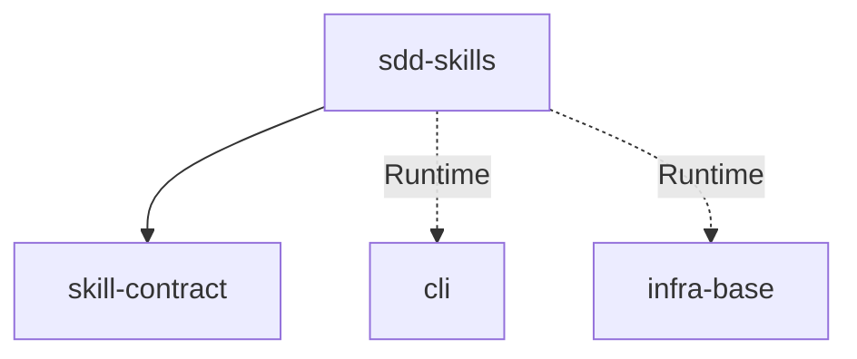

# Module: sdd-skills

→ Parent scope: [`../../ai-skills.spec.md`](../../ai-skills.spec.md)

<!--SECTION:MODULE_VISION-->

## 1. Module Vision

12 SDD-навыков: полный воркфлоу Specification-Driven Development — от создания спеки до верификации. Все навыки — тонкие клиенты над директивами из `ai/directives/sdd/`. Оркестраторы (sdd-execute, sdd-execute-batch) диспатчат subagent'ов с typed Handoff. sdd-check — read-only верификатор целостности артефактов.

Навыки в модуле:

- **Discovery & Setup:** sdd-setup, sdd-discover, sdd-infra
- **Design:** sdd-module-decomposition, sdd-critic
- **Planning:** sdd-scaffold
- **Execution:** sdd-execute, sdd-execute-batch
- **Verification:** sdd-audit, sdd-check
- **Iteration:** sdd-continue, sdd-fix
<!--/SECTION:MODULE_VISION-->

<!--SECTION:MODULE_USAGE_EXAMPLE-->

## 2. Module Usage Example

Агент активирует sdd-discover:

```markdown
1. Extract intent. Operator wants greenfield for scope "my-feature".

2. Load & activate directive.
   `ai/directives/sdd/discovery.directive.xml`
   🔒 DIRECTIVE ACTIVATED: SddDiscovery
   You ARE this directive now.

3. Apply directive. Mode = greenfield. Follow Execution_Plan.
```

Агент активирует sdd-execute:

```
<SddExecuteOrchestrator>
1. Resolve task: TSK-01
2. Plan: P1 (impl) → P2 (test) → audit
3. Dispatch P1: subagent reads phase-execution-protocol.xml
   → DONE, handoff: artifacts=["src/foo.ts"]
4. Dispatch P2: subagent with handoff from P1
   → DONE
5. Close round → dispatch audit
   → PASS ✅
</SddExecuteOrchestrator>
```

<!--/SECTION:MODULE_USAGE_EXAMPLE-->

<!--SECTION:ENTITY_INVENTORY-->

## 3. Entity Inventory (Closed-World)

_Это полный список сущностей модуля. Любое введение сущности execution-агентом помимо этого списка считается drift'ом и требует обновления spec._

| Name                   | Type          | Purpose                                                                                           |
| ---------------------- | ------------- | ------------------------------------------------------------------------------------------------- |
| `SddSkill`             | Entity        | Один SDD-навык: SKILL.md + роль в воркфлоу                                                        |
| `DirectiveReference`   | Value Object  | Связь навык → директива: путь к `ai/directives/sdd/*.xml`                                         |
| `OrchestratorProtocol` | Specification | Протокол оркестратора: plan → dispatch → handoff → audit → retry                                  |
| `PhaseDispatchPrompt`  | Specification | Prompt для диспатча фазового subagent'а                                                           |
| `AuditDispatchPrompt`  | Specification | Prompt для диспатча аудита                                                                        |
| `HandoffPayload`       | Value Object  | Типизированный payload между фазами: artifacts, decisions, open                                   |
| `SddScripts`           | Artifact      | Bash-скрипты в `ai/skills/sdd-execute/scripts/`: sdd, verify, extract, scan, check-blockers, lint |
| `SddWorkflowPhase`     | Enumeration   | Фаза SDD-воркфлоу: discover, design, plan, execute, verify, iterate                               |

<!--/SECTION:ENTITY_INVENTORY-->

<!--SECTION:ENTITY_SURFACES-->

## 4. Entity Surfaces

### `SddSkill`

- **Type:** Entity
- **Purpose:** Один SDD-навык — именованный артефакт в `ai/skills/<name>/`
- **Public Properties:**
  - `name: string` — из frontmatter, например `sdd-discover`
  - `pattern: 'directive' | 'orchestrator' | 'check'` — execution-паттерн
  - `directives: DirectiveReference[]` — связанные директивы
  - `phase: SddWorkflowPhase` — фаза воркфлоу
- **Lifecycle:** Создаётся автором, деплоится через sync-skills
- **Consumers:** Агенты (Claude Code, OpenCode), sync-skills

### `DirectiveReference`

- **Type:** Value Object
- **Purpose:** Связь навык → директива
- **Public Properties:**
  - `path: string` — относительный путь от корня проекта: `ai/directives/sdd/<name>.xml`
  - `activationMode: 'self' | 'subagent'` — как навык активирует директиву: сам или через subagent
- **Lifecycle:** Immutable
- **Consumers:** `SddSkill`

### `OrchestratorProtocol`

- **Type:** Specification
- **Purpose:** Протокол оркестратора для sdd-execute и sdd-execute-batch
- **Public Operations:**
  - Resolve task — найти задачу по Task-ID или вычислить pickable
  - Plan — read planning surface (Meta, Phases Overview, Execution Log); detect state
  - Dispatch phases — sequential loop: fresh context per phase, typed Handoff between phases
  - Close round — append round close to Execution Log, sync trackers
  - Dispatch audit — mandatory, always runs after round close
  - Retry on FAIL — max 2 audit attempts, selective phase re-run
- **Invariants:**
  - Оркестратор не читает bodies фаз, BDD, Verification, Coverage
  - Оркестратор не пишет код
  - Preflight: check-blockers перед стартом
- **Consumers:** sdd-execute, sdd-execute-batch

### `PhaseDispatchPrompt`

- **Type:** Specification
- **Purpose:** Шаблон prompt'а для диспатча фазового subagent'а
- **Public Properties:**
  - Step 1: Read directive (`ai/directives/sdd/phase-execution-protocol.xml`)
  - Step 2: Activate (`🔒 DIRECTIVE ACTIVATED: SddPhaseExecution`)
  - Step 3: Apply to intent (Ticket + Phase + Reason + Inputs)
  - Tooling: `${SKILL_DIR}/scripts/sdd`
- **Consumers:** sdd-execute, sdd-execute-batch

### `AuditDispatchPrompt`

- **Type:** Specification
- **Purpose:** Шаблон prompt'а для диспатча аудита
- **Public Properties:**
  - Step 1: Read directive (`ai/directives/sdd/audit.directive.xml`)
  - Step 2: Activate (`🔒 DIRECTIVE ACTIVATED: SddAudit`)
  - Step 3: Apply to intent (Task + Ticket + Round + Artifacts + Mode)
- **Consumers:** sdd-execute, sdd-execute-batch

### `HandoffPayload`

- **Type:** Value Object
- **Purpose:** Типизированный контекст, передаваемый между фазами
- **Public Properties:**
  - `artifacts: string[]` — созданные/изменённые файлы
  - `decisions: string[]` — принятые решения
  - `open: string[]` — открытые вопросы для следующей фазы
- **Lifecycle:** Создаётся фазой при DONE, потребляется следующей фазой как Inputs
- **Consumers:** Phase subagents (через orchestrator)

### `SddScripts`

- **Type:** Artifact
- **Purpose:** Bash-скрипты для SDD-операций
- **Public Operations:**
  - `sdd extract <file> <NAME>` — извлечь SECTION из markdown
  - `sdd verify <files>` — typecheck + lint + forbidden grep
  - `sdd check-blockers <ticket>` — сканировать BLOCKER в Execution Log
  - `sdd scan [root]` — снапшот проекта
  - `sdd lint <files>` — DBC AST lint
- **Location:** `ai/skills/sdd-execute/scripts/`
- **Consumers:** Phase subagents, audit subagents, sdd-check
- **Invariants:**
  - macOS-совместимый bash (нет GNU-only флагов)
  - Единый permission-паттерн: `Bash(scripts/sdd/sdd *)`
  - AX_BASH_NO_SILENT_EMPTY

### `SddWorkflowPhase`

- **Type:** Enumeration
- **Purpose:** Классификация навыка по фазе SDD-воркфлоу
- **Values:**
  - `discover` — sdd-setup, sdd-discover, sdd-infra
  - `design` — sdd-module-decomposition, sdd-critic
  - `plan` — sdd-scaffold
  - `execute` — sdd-execute, sdd-execute-batch
  - `verify` — sdd-audit, sdd-check
  - `iterate` — sdd-continue, sdd-fix
- **Consumers:** `SddSkill`
<!--/SECTION:ENTITY_SURFACES-->

<!--SECTION:MODULE_CONTRACTS-->

## 5. Module Contracts (DbC)

### Specification: `OrchestratorProtocol`

- **Purpose:** Контракт оркестрации выполнения задач
- **Consumers:** sdd-execute, sdd-execute-batch
- **Runtime Backing:** `real-runtime`
- **Verification Levels:** `contract`
- **Deferred Runtime Scope:** None

**Contract (DbC):**

- **Preconditions:**
  - `tasks/` директория существует
  - Ticket содержит section 1 (Meta), 2 (Phases Overview), 7 (Execution Log)
  - `${SKILL_DIR}/scripts/sdd check-blockers` возвращает CLEAN
- **Postconditions:**
  - Все pending-фазы выполнены последовательно
  - Execution Log содержит закрытый раунд
  - Tracker синхронизирован: ticket Meta.Status ↔ tasks/\*/README.md ↔ tasks/README.md
  - Аудит выполнен (PASS или FAIL с деталями)
- **Invariants:**
  - Max 2 попытки аудита
  - Селективный реран фаз: только те, что в `phases_to_fix`
  - Оркестратор не читает bodies фаз, BDD, Verification, Coverage

### Artifact: `SddScripts`

- **Purpose:** Helper-скрипты для SDD-операций
- **Consumers:** Phase subagents, audit subagents, sdd-check
- **Runtime Backing:** `real-runtime`
- **Verification Levels:** `integration`
- **Deferred Runtime Scope:** None

**Contract (DbC):**

- **Preconditions:**
  - macOS (bash 3.2+)
  - `npx tsx` доступен для Node.js скриптов
- **Postconditions:**
  - `verify` → PASS только если typecheck + lint + forbidden_grep все прошли
  - `check-blockers` → exit 0 если нет неразрешённых BLOCKER
  - `extract` → содержимое SECTION или ошибка
- **Invariants:**
  - Никакой подкоманды не производит пустой вывод (AX_BASH_NO_SILENT_EMPTY)
  - Все подкоманды доступны через единый диспатчер `sdd`
  <!--/SECTION:MODULE_CONTRACTS-->

<!--SECTION:PUBLIC_OPTIONS-->

## 6. Public Options & Policies

| Option                       | Binding                                      | Status   |
| ---------------------------- | -------------------------------------------- | -------- |
| Директивы для каждого навыка | `DirectiveReference` в `SddSkill`            | ✅ bound |
| Протокол оркестратора        | `OrchestratorProtocol`                       | ✅ bound |
| Prompt-шаблоны               | `PhaseDispatchPrompt`, `AuditDispatchPrompt` | ✅ bound |
| Скрипты                      | `SddScripts`                                 | ✅ bound |
| Handoff между фазами         | `HandoffPayload`                             | ✅ bound |

Все опции привязаны. Нет отложенных.

<!--/SECTION:PUBLIC_OPTIONS-->

<!--SECTION:FILE_STRUCTURE-->

## 7. File Structure

```
ai/skills/
├── sdd-setup/SKILL.md
├── sdd-discover/SKILL.md
├── sdd-infra/SKILL.md
├── sdd-module-decomposition/SKILL.md
├── sdd-critic/SKILL.md
├── sdd-scaffold/SKILL.md
├── sdd-execute/
│   ├── SKILL.md
│   └── scripts/
│       ├── sdd                     # диспатчер
│       ├── verify.sh
│       ├── extract-section.sh
│       ├── check-blockers.sh
│       ├── scan.sh
│       ├── lint-artifacts.sh
│       ├── classify-scripts.js
│       ├── classify-scripts.ts
│       └── README.md
├── sdd-execute-batch/SKILL.md
├── sdd-audit/SKILL.md
├── sdd-check/SKILL.md
├── sdd-continue/SKILL.md
└── sdd-fix/SKILL.md
```

**File Mapping:**
| Путь | Компонент |
|---|---|
| `sdd-{name}/SKILL.md` | `SddSkill` — тело навыка |
| `sdd-execute/scripts/sdd` | `SddScripts` — диспатчер |
| `sdd-execute/scripts/*.sh` | `SddScripts` — helper'ы |

<!--/SECTION:FILE_STRUCTURE-->

<!--SECTION:MODULE_DECISION_LOG-->

## 8. Module Decision Log

### D-M002 — 12 SDD-навыков в одном модуле

- **Status:** active
- **Recorded:** session ModuleDecomposition, ai-skills, sdd-skills
- **Why:** Все SDD-навыки объединены в один модуль по общему execution-паттерну (активация директив) и общей SDD-воркфлоу-семантике. Разделение на подмодули по фазам — overengineered для текущих 12 навыков.
- **Risk accepted:** При росте количества навыков модуль может потребовать дальнейшей декомпозиции.
- **Rejected alternatives:**
  - 5 подмодулей по фазам — overengineered: некоторые содержали бы 1-2 навыка
  - Навыки как отдельные модули — 12 модулей, overhead управления
  <!--/SECTION:MODULE_DECISION_LOG-->

<!--SECTION:INTER_MODULE_DEPENDENCIES-->

## 9. Inter-Module Dependencies

- **Depends on:** `skill-contract` (паттерны активации, frontmatter)
- **Scope Reference (cross-scope):** `infra-base` (Node.js 22+, bash), `cli` (gennady CLI)
- **Provides to:** Все скоупы, использующие SDD-воркфлоу



<!--/SECTION:INTER_MODULE_DEPENDENCIES-->

<!--SECTION:HANDOFF-->

## 10. Handoff to Task Scaffolding

- **Implementation files to be created:** Все 12 навыков уже существуют в `ai/skills/`. Требуется только релативизация абсолютных путей в телах SKILL.md.
- **Test files to be created:** Интеграционные тесты для скриптов (sdd verify, sdd extract, sdd check-blockers)
- **Stack dependencies:**
  - Language: TypeScript (для classify-scripts.ts)
  - Test framework: node:test
- **Module Rules Additions:** None

| Rule | Category | Source |
| ---- | -------- | ------ |
| —    | —        | —      |

- **Open risks & validation needs:**
  - Абсолютные пути `/Users/k.lebedev/Developer/gennady/` в телах SKILL.md требуют замены на относительные (`ai/directives/...`)
  - `${SKILL_DIR}` — переменная, предоставляемая агентом-хостером; поведение при отсутствии требует проверки
  - Скрипты завязаны на macOS/bash 3.2+ — не кроссплатформенны
  - classify-scripts.js и classify-scripts.ts — дублирование, требует консолидации
  <!--/SECTION:HANDOFF-->
