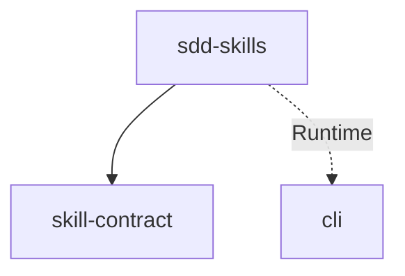

# Module: sdd-skills

→ Parent scope: [`../ai-skills.spec.md`](../ai-skills.spec.md)

<!--SECTION:MODULE_VISION-->

## 1. Module Vision

Восемь SDD-навыков проводят изменение от спецификации до проверенного кода. Поток оставляет модели
свободу рассуждения, но проверяет наблюдаемые артефакты на двух смысловых границах и простыми
механическими инвариантами.

```text
actual specs → independent semantic review → operator approval #1
→ actual tickets → mechanical authoring check → independent actual-ticket review
→ operator approval #2 (decomposition + test plan)
→ execute from ticket/Execution Log/Git → real gates → audit → code-review
```

Продолжение stateless: спецификации, тикеты, Execution Log, Git и текущий вывод CLI — полный источник
состояния. Постоянная `.sdd-session.md`, scaffold-plan JSON/digest, feasibility state machine,
worker-checkpoint JSON и обязательное переиспользование critic/worker не входят в контракт.

<!--/SECTION:MODULE_VISION-->

<!--SECTION:MODULE_USAGE_EXAMPLE-->

## 2. Module Usage Example

```text
1. /sdd создаёт/изменяет фактические V2-спеки.
2. Один fresh reviewer проверяет весь изменённый spec set; оператор утверждает эти bytes.
3. /sdd-scaffold создаёт реальные tickets и indexes.
4. sdd-check --task <path> --authoring проверяет каждый ticket; sdd-check --all проверяет DAG.
5. Один fresh reviewer проверяет реальные tickets против утверждённых specs.
6. Оператор одним решением утверждает разбиение и Requirement-ID → scenario → test plan.
7. /sdd-execute TSK-01 восстанавливает фазу из ticket + Execution Log + Git, выполняет real gates,
   затем запускает audit и code-review.
```

<!--/SECTION:MODULE_USAGE_EXAMPLE-->

<!--SECTION:ENTITY_INVENTORY-->

## 3. Entity Inventory (Closed-World)

| Name                       | Type          | Purpose                                                   |
| -------------------------- | ------------- | --------------------------------------------------------- |
| `SddSkill`                 | Entity        | Публичный вход и его роль в SDD flow                      |
| `DirectiveReference`       | Value Object  | Путь к owner directive и способ активации                 |
| `ArtifactApprovalBoundary` | Specification | Review + operator approval текущих фактических артефактов |
| `OrchestratorProtocol`     | Specification | Resolve → phase dispatch → real gates → audit/review      |
| `PhaseDispatchPrompt`      | Specification | Bounded prompt фазового worker                            |
| `HandoffPayload`           | Value Object  | Фактический результат одной фазы                          |
| `SddWorkflowPhase`         | Enumeration   | route, specify, scaffold, execute, verify, iterate        |

<!--/SECTION:ENTITY_INVENTORY-->

<!--SECTION:ENTITY_SURFACES-->

## 4. Entity Surfaces

### `SddSkill`

- **Properties:** `name`, `pattern`, `directives`, `phase`
- **Lifecycle:** хранится в `ai/skills/<name>/SKILL.md`, деплоится через `sync-skills`
- **Invariant:** direct entry выполняет один read-only `sdd-state` и передаёт forced intent router;
  ни entry, ни router не открывают persistent session

### `ArtifactApprovalBoundary`

- **Spec boundary (#1):** фактический полный spec set → structural checks → один fresh independent
  semantic review → correction/recheck → operator approval
- **Ticket boundary (#2):** фактические tickets/indexes → authoring checks → один fresh independent
  review actual tickets → operator approval decomposition + test plan
- **Invalidation:** semantic edit после review требует нового bounded review; semantic edit после
  approval требует повторного соответствующего approval
- **Durable evidence:** approval #1 — обычная Decision Log entry в каждой spec из reviewed set;
  approval #2 — секция в общем task index. Маркер содержит status, список путей, reviewer verdict,
  operator decision и дату; не содержит hash/JSON
- **Trust boundary:** CLI проверяет форму, значения и membership; модель по текущим артефактам и Git
  evidence решает, не устарел ли маркер; при сомнении он сбрасывается в `pending`

### `OrchestratorProtocol`

- Resolve selected/pickable tickets through `sdd-task`
- Reconstruct phase from ticket, Execution Log, Git and current tool output
- Mentally check declared phase consistency; do not serialize a plan for a critic
- Dispatch a bounded fresh worker per phase; worker continuation is optional, never correctness state
- Record actual commands/files/decisions/deviations in Execution Log
- Run declared real tests/type/lint/coverage and mechanical `sdd-check`
- Dispatch fresh audit and code-review

### `PhaseDispatchPrompt`

- Input: exact phase block, referenced spec/rule excerpts, target files, prior Execution Log facts,
  Git evidence
- Output: typed `HandoffPayload`
- Boundary: worker does not change ticket meaning, dependencies, phases or approved test plan

### `HandoffPayload`

- `artifacts: string[]`
- `requirements: string[]`
- `commands: { command: string; exit: number; result: string }[]`
- `decisions: string[]`
- `open: string[]`

### `SddWorkflowPhase`

- `route` — sdd router and forced direct entries
- `specify` — root/scope/module/infra/interface plus approval #1
- `scaffold` — real ticket creation, checks, ticket review, approval #2
- `execute` — phase workers and real gates
- `verify` — audit, check, code-review
- `iterate` — critic on demand, reconcile

<!--/SECTION:ENTITY_SURFACES-->

<!--SECTION:MODULE_CONTRACTS-->

## 5. Module Contracts (DbC)

### Specification: `ArtifactApprovalBoundary`

**Preconditions:**

- reviewer target contains actual files, not an abstract plan;
- target is bounded and structurally valid;
- reviewer is independent from author and read-only.

**Postconditions:**

- approval #1 marker names the reviewed spec set and carries operator decision;
- approval #2 marker names the reviewed ticket set and carries operator decision;
- findings are resolved or explicitly returned to the operator;
- no hidden session/journal or content fingerprint is needed to resume.

### Specification: `OrchestratorProtocol`

**Preconditions:**

- ticket passed approval #2;
- dependencies are DONE;
- phase and exact verification commands resolve through ticket/spec.

**Postconditions:**

- Execution Log records plan-versus-fact;
- every declared real gate ran and passed;
- mandatory Requirement-ID values appear in implemented tests;
- audit and code-review ran before DONE.

**Invariants:**

- happy-path-only is invalid when behavior has an applicable failure/negative case;
- every mandatory Requirement-ID maps to a scenario and planned/implemented test;
- model judges semantic proof; mechanics judge presence, shape and traceability;
- batch parallelism requires disjoint Target Files and no dependency relation;
- lost worker identity never blocks resume; a fresh worker receives durable bounded context.

<!--/SECTION:MODULE_CONTRACTS-->

<!--SECTION:PUBLIC_OPTIONS-->

## 6. Public Options & Policies

| Option               | Binding                                                                 | Status |
| -------------------- | ----------------------------------------------------------------------- | ------ |
| Single state read    | `sdd-state` is read-only; router consumes exact result once             | bound  |
| Spec semantic gate   | one independent review + operator approval #1                           | bound  |
| Ticket semantic gate | actual-ticket review + operator approval #2                             | bound  |
| Mechanical coverage  | Requirement-ID → scenario → test; applicable negative scenario required | bound  |
| Worker lifetime      | disposable; no checkpoint/session-key correctness dependency            | bound  |
| Migration            | V1→V2 only                                                              | bound  |

<!--/SECTION:PUBLIC_OPTIONS-->

<!--SECTION:FILE_STRUCTURE-->

## 7. File Structure

```text
ai/skills/
├── sdd/SKILL.md
├── sdd-scaffold/SKILL.md
├── sdd-execute/SKILL.md
├── sdd-audit/SKILL.md
├── sdd-check/SKILL.md
├── sdd-code-review/SKILL.md
├── sdd-critic/SKILL.md
└── sdd-reconcile/SKILL.md
```

<!--/SECTION:FILE_STRUCTURE-->

<!--SECTION:MODULE_DECISION_LOG-->

## 8. Module Decision Log

### D-M002 — SDD-навыки в одном модуле

- **Status:** active
- **Why:** навыки связаны одним flow и общей директивной системой; фазовые подмодули добавят
  координацию без отдельной доменной границы.
- **Risk accepted:** при росте surface модуль может потребовать декомпозиции.

### D-M003 — Stateful public entries проходят через один router

- **Status:** superseded by D-M004
- **Recorded:** RC follow-up до draft.64
- **Why superseded:** persistent session, feasibility journal и retained workers превратили простое
  reasoning в ручной протокол JSON/NEXT, создавали ложные migration/conflict ветки и не давали
  восстановить цель после потери worker. Решение сохраняется только как историческое объяснение;
  возврат отложен до отдельного доказательства необходимости и модели concurrency.

### D-M004 — Stateless flow и две границы утверждения

- **Status:** active
- **Recorded:** RC follow-up after draft.64 degradation
- **Why:** спецификации, human-readable approval markers, tickets, Execution Log и Git уже содержат необходимое состояние. Две fresh
  semantic проверки удерживают смысл там, где механический CLI его доказать не может, а operator
  approvals записываются в самих canonical artifacts. Это сокращает процесс без ослабления обязательных
  requirement/negative/test invariants.
- **Risk accepted:** fresh reviewer после semantic correction расходует дополнительный вызов модели;
  это плата за проверку точных новых bytes, а не за долговечную critic session.
- **Rejected alternatives:**
  - патч persistent session — сохраняет неверный скрытый control plane;
  - approval абстрактного DAG до tickets — не доказывает фактические artifacts;
  - только mechanical gates — не оценивают смысл и доказательность теста;
  - только model review — не гарантирует ID/section/traceability presence.

<!--/SECTION:MODULE_DECISION_LOG-->

<!--SECTION:INTER_MODULE_DEPENDENCIES-->

## 9. Inter-Module Dependencies

- **Depends on:** `skill-contract`, `cli` (`sdd-state`, `sdd-task`, `sdd-new`, `sdd-check`)
- **Provides to:** все SDD-потребители


```mermaid
graph TD
    sdd-skills --> skill-contract
    sdd-skills -. Runtime .-> cli
```

<!--/SECTION:INTER_MODULE_DEPENDENCIES-->

<!--SECTION:HANDOFF-->

## 10. Handoff to Task Scaffolding

- Skills and source directives implement the stateless flow.
- CLI must remove the obsolete `sdd-session` surface and stop emitting `[SESSION]` state.
- Generated `ai/directives/sdd-v2/**` must be reassembled from source templates.
- Contract regressions must cover both approvals, V1→V2-only migration, negative scenario presence,
  Requirement-ID traceability and resume without worker/session identity.

<!--/SECTION:HANDOFF-->
