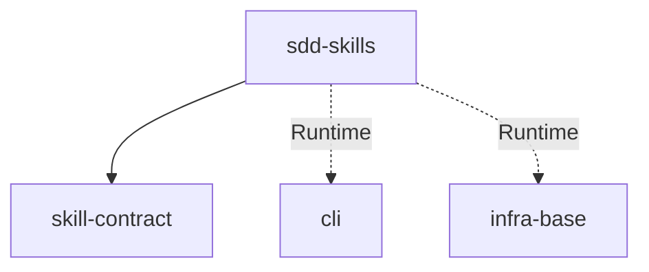

# Module: sdd-skills

→ Parent scope: [`../ai-skills.spec.md`](../ai-skills.spec.md)

<!--SECTION:MODULE_VISION-->

## 1. Module Vision

8 SDD-навыков: полный воркфлоу Specification-Driven Development — от создания спеки до верификации. Большинство навыков — тонкие клиенты над директивами из `ai/directives/sdd-v2/`. `sdd-execute` — единственный оркестратор, диспатчит subagent'ов с typed Handoff (включая batch-режим — тот же навык, LOGIC_SWITCH на intent). `sdd-check` — read-only репортер над CLI-инструментом (без директивы).

Навыки в модуле:

- **Router (единая session/front-door политика):** `sdd` передаёт свободный intent, а stateful direct entries `sdd-scaffold` / `sdd-execute` / `sdd-critic` / `sdd-reconcile` передают literal forced intent в ту же router-директиву. Каждый делает ровно один начальный `sdd-state` и связывает literal stdout с alias `routerState`; router потребляет эти bytes, обновляет snapshot только после подтверждённой preflight-мутации и решает session conflict/open до journal flush. SKILL не хранит закрытый список веток и не открывает session сам.
- **Planning:** `sdd-scaffold`
- **Execution:** `sdd-execute` (single ticket или batch — интент внутри одного навыка)
- **Verification:** `sdd-audit`, `sdd-check`, `sdd-code-review`
- **Iteration:** `sdd-critic`, `sdd-reconcile` (режимы fix и from-code)

`sdd-hooks-install` (bootstrap хуков live-прогресса) удалён по решению оператора — см. `ai-skills.spec.md` D-007.

<!--/SECTION:MODULE_VISION-->

<!--SECTION:MODULE_USAGE_EXAMPLE-->

## 2. Module Usage Example

Агент активирует `sdd` (роутер) для greenfield-скоупа:

```markdown
1. GATHER: sdd-state (portal/scopes) → exact result alias routerState + читает ai/directives/sdd-v2/router.directive.xml

2. EMBODY: You ARE the router directive now. Intent — "новый скоуп my-feature".

3. ROUTE: загруженная router-директива вычисляет LOGIC_SWITCH(state, intent, scope-type) → навык читает и выполняет возвращённый путь (включая execute или chained multi-scope)
```

Агент активирует `sdd-execute` (single ticket или batch — один и тот же навык):

```
<SddSkill id="execute">
1. GATHER: один sdd-state → exact result alias routerState + читает ai/directives/sdd-v2/router.directive.xml
2. ROUTE: передаёт routerState + forced intent=execute; router решает session conflict/open один раз и загружает execute.directive.xml. Если preflight действительно мутировал проект, router делает один refresh; journal branch-result пишется только после совместимой/открытой session.
3. EMBODY OWNER: Task-ID = TSK-01 (или "batch"); Plan: P1 (impl) → P2 (test) → audit
4. Dispatch P1: worker reads phase-execution-protocol.directive.xml
   → DONE, handoff: artifacts=["src/foo.ts"]
5. Dispatch P2: worker with handoff from P1
   → DONE
6. Close round → dispatch audit
   → PASS ✅
</SddSkill>
```

<!--/SECTION:MODULE_USAGE_EXAMPLE-->

<!--SECTION:ENTITY_INVENTORY-->

## 3. Entity Inventory (Closed-World)

_Это полный список сущностей модуля. Любое введение сущности execution-агентом помимо этого списка считается drift'ом и требует обновления spec._

| Name                   | Type          | Purpose                                                          |
| ---------------------- | ------------- | ---------------------------------------------------------------- |
| `SddSkill`             | Entity        | Один SDD-навык: SKILL.md + роль в воркфлоу                       |
| `DirectiveReference`   | Value Object  | Связь навык → директива: путь к `ai/directives/sdd-v2/*.xml`     |
| `OrchestratorProtocol` | Specification | Протокол оркестратора: plan → dispatch → handoff → audit → retry |
| `PhaseDispatchPrompt`  | Specification | Prompt для диспатча фазового subagent'а                          |
| `AuditDispatchPrompt`  | Specification | Prompt для диспатча аудита                                       |
| `HandoffPayload`       | Value Object  | Типизированный payload между фазами: artifacts, decisions, open  |
| `SddWorkflowPhase`     | Enumeration   | Фаза SDD-воркфлоу: route, plan, execute, verify, iterate         |

<!--/SECTION:ENTITY_INVENTORY-->

<!--SECTION:ENTITY_SURFACES-->

## 4. Entity Surfaces

### `SddSkill`

- **Type:** Entity
- **Purpose:** Один SDD-навык — именованный артефакт в `ai/skills/<name>/`
- **Public Properties:**
  - `name: string` — из frontmatter, например `sdd-scaffold`
  - `pattern: 'directive' | 'orchestrator' | 'check'` — execution-паттерн
  - `directives: DirectiveReference[]` — связанные директивы
  - `phase: SddWorkflowPhase` — фаза воркфлоу
- **Lifecycle:** Создаётся автором, деплоится через sync-skills
- **Consumers:** Агенты (Claude Code, OpenCode), sync-skills

### `DirectiveReference`

- **Type:** Value Object
- **Purpose:** Связь навык → директива
- **Public Properties:**
  - `path: string` — относительный путь от корня проекта: `ai/directives/sdd-v2/<name>.directive.xml`
  - `activationMode: 'self' | 'subagent'` — как навык активирует директиву: сам или через subagent
- **Lifecycle:** Immutable
- **Consumers:** `SddSkill`

### `OrchestratorProtocol`

- **Type:** Specification
- **Purpose:** Протокол оркестратора для sdd-execute (single ticket и batch — один и тот же навык, LOGIC_SWITCH на intent)
- **Public Operations:**
  - Resolve task — найти задачу по Task-ID или вычислить pickable
  - Plan — read planning surface (Meta, Phases Overview, Execution Log); detect state
  - Dispatch phases — sequential loop: fresh context per phase, typed Handoff between phases
  - Close round — append round close to Execution Log, sync trackers
  - Dispatch audit — mandatory, always runs after round close
  - Retry on FAIL — max 2 audit attempts, selective phase re-run
- **Invariants:**
  - Оркестратор не читает bodies фаз, BDD, Verification, Coverage
  - Оркестратор не пишет код
  - Preflight: blocker scan (`sdd-check`) перед стартом
- **Consumers:** sdd-execute

### `PhaseDispatchPrompt`

- **Type:** Specification
- **Purpose:** Шаблон prompt'а для диспатча фазового subagent'а
- **Public Properties:**
  - Step 1: Read directive (`ai/directives/sdd-v2/phase-execution-protocol.directive.xml`)
  - Step 2: Activate (`🔒 DIRECTIVE ACTIVATED: SddPhaseExecution`)
  - Step 3: Apply to intent (Ticket + Phase + Reason + Inputs)
  - Tooling: `sdd-extract` / `sdd-verify` / `sdd-log` (gennady CLI, per `AX_TOOL_INVOCATION`)
- **Consumers:** sdd-execute

### `AuditDispatchPrompt`

- **Type:** Specification
- **Purpose:** Шаблон prompt'а для диспатча аудита
- **Public Properties:**
  - Step 1: Read directive (`ai/directives/sdd-v2/audit.directive.xml`)
  - Step 2: Activate (`🔒 DIRECTIVE ACTIVATED: SddAudit`)
  - Step 3: Apply to intent (Task + Ticket + Round + Artifacts + Mode)
- **Consumers:** sdd-execute

### `HandoffPayload`

- **Type:** Value Object
- **Purpose:** Типизированный контекст, передаваемый между фазами
- **Public Properties:**
  - `artifacts: string[]` — созданные/изменённые файлы
  - `decisions: string[]` — принятые решения
  - `open: string[]` — открытые вопросы для следующей фазы
- **Lifecycle:** Создаётся фазой при DONE, потребляется следующей фазой как Inputs
- **Consumers:** Phase subagents (через orchestrator)

### `SddWorkflowPhase`

- **Type:** Enumeration
- **Purpose:** Классификация навыка по фазе SDD-воркфлоу
- **Values:**
  - `route` — общий front-door для stateful public entries; точное множество исходов принадлежит `LOGIC_SWITCH` router-директивы, включая forced execute/scaffold/critic/reconcile и multi-scope
  - `plan` — sdd-scaffold
  - `execute` — sdd-execute (single ticket и batch)
  - `verify` — sdd-audit, sdd-check, sdd-code-review
  - `iterate` — sdd-critic, sdd-reconcile
- **Consumers:** `SddSkill`
<!--/SECTION:ENTITY_SURFACES-->

<!--SECTION:MODULE_CONTRACTS-->

## 5. Module Contracts (DbC)

### Specification: `OrchestratorProtocol`

- **Purpose:** Контракт оркестрации выполнения задач
- **Consumers:** sdd-execute
- **Runtime Backing:** `real-runtime`
- **Verification Levels:** `contract`
- **Deferred Runtime Scope:** None

**Contract (DbC):**

- **Preconditions:**
  - `tasks/` директория существует
  - Ticket содержит section 1 (Meta), 2 (Phases Overview), 7 (Execution Log)
  - `sdd-check` blocker scan возвращает CLEAN (`AX_BLOCKER_RESOLUTION_TRAIL`)
- **Postconditions:**
  - Все pending-фазы выполнены последовательно
  - Execution Log содержит закрытый раунд
  - Tracker синхронизирован: ticket Meta.Status ↔ tasks/\*/README.md ↔ tasks/README.md
  - Аудит выполнен (PASS или FAIL с деталями)
- **Invariants:**
  - Max 2 попытки аудита
  - Селективный реран фаз: только те, что в `phases_to_fix`
  - Оркестратор не читает bodies фаз, BDD, Verification, Coverage
  - Batch-параллелизм разрешён только при непересекающихся Target Files И разных session keys `(spec, kind)`; одинаковый ключ сериализуется

  <!--/SECTION:MODULE_CONTRACTS-->

<!--SECTION:PUBLIC_OPTIONS-->

## 6. Public Options & Policies

| Option                       | Binding                                      | Status   |
| ---------------------------- | -------------------------------------------- | -------- |
| Директивы для каждого навыка | `DirectiveReference` в `SddSkill`            | ✅ bound |
| Протокол оркестратора        | `OrchestratorProtocol`                       | ✅ bound |
| Prompt-шаблоны               | `PhaseDispatchPrompt`, `AuditDispatchPrompt` | ✅ bound |
| Handoff между фазами         | `HandoffPayload`                             | ✅ bound |

Все опции привязаны. Нет отложенных.

<!--/SECTION:PUBLIC_OPTIONS-->

<!--SECTION:FILE_STRUCTURE-->

## 7. File Structure

```
ai/skills/
├── sdd/SKILL.md                    # единая точка входа-роутер
├── sdd-scaffold/SKILL.md
├── sdd-execute/
│   └── SKILL.md                    # single ticket и batch — LOGIC_SWITCH на intent; tooling = gennady CLI (sdd-extract/sdd-verify/sdd-log/sdd-check), не bash-скрипты
├── sdd-audit/SKILL.md
├── sdd-check/SKILL.md              # без директивы — тонкий репортер над `npx gennady sdd-check`
├── sdd-code-review/SKILL.md
├── sdd-critic/SKILL.md
└── sdd-reconcile/SKILL.md          # режимы fix и from-code
```

**File Mapping:**
| Путь | Компонент |
|---|---|
| `sdd-{name}/SKILL.md` | `SddSkill` — тело навыка |

<!--/SECTION:FILE_STRUCTURE-->

<!--SECTION:MODULE_DECISION_LOG-->

## 8. Module Decision Log

### D-M002 — SDD-навыки в одном модуле

- **Status:** active
- **Recorded:** session ModuleDecomposition, ai-skills, sdd-skills
- **Why:** Все SDD-навыки объединены в один модуль по общему execution-паттерну (активация директив) и общей SDD-воркфлоу-семантике. Разделение на подмодули по фазам — overengineered. Решение принято при 12 навыках (сейчас 8 — см. `ai-skills.spec.md` D-005/D-007), рационале не изменился.
- **Risk accepted:** При росте количества навыков модуль может потребовать дальнейшей декомпозиции.
- **Rejected alternatives:**
  - 5 подмодулей по фазам — overengineered: некоторые содержали бы 1-2 навыка
  - Навыки как отдельные модули — 12 модулей, overhead управления

### D-M003 — Stateful public entries проходят через один router

- **Status:** active
- **Recorded:** RC follow-up, session-entry coherence
- **Why:** Прямые `sdd-scaffold` / `sdd-execute` / `sdd-critic` / `sdd-reconcile` раньше дублировали bootstrap и могли открыть, переименовать либо проигнорировать живую session иначе, чем `sdd`. Теперь каждый передаёт один `routerState` snapshot и forced intent в router; router не повторяет initial probe, session conflict/open решается один раз до journal flush, а SCALE спрашивается только у root/scope/module/infra/interface, которые реально используют его как параметр глубины.
- **Risk accepted:** Router получает ещё четыре явных forced-intent ветки, но сами owner-директивы и их payload semantics не дублируются.
- **Rejected alternatives:**
  - Session bootstrap в каждом SKILL — расходится со временем и повторяет `sdd-state`.
  - Запрет direct skills — ухудшает явный DX для execute/scaffold/reconcile/critic.
  <!--/SECTION:MODULE_DECISION_LOG-->

<!--SECTION:INTER_MODULE_DEPENDENCIES-->

## 9. Inter-Module Dependencies

- **Depends on:** `skill-contract` (паттерны активации, frontmatter)
- **Scope Reference (cross-scope):** `infra-base` (Node.js 22+, bash), `cli` (gennady CLI)
- **Provides to:** Все скоупы, использующие SDD-воркфлоу


```mermaid
graph TD
    sdd-skills --> skill-contract
    sdd-skills -. Runtime .-> cli
    sdd-skills -. Runtime .-> infra-base
```

<!--/SECTION:INTER_MODULE_DEPENDENCIES-->

<!--SECTION:HANDOFF-->

## Critic Rounds

### Round 1 — 2026-05-31

- Verdict: NEEDS_WORK
- Accepted: 0
- Rejected: 7 — all findings are pre-existing spec gaps unrelated to the `verify` RUN-ALL/SUPPRESS-ON-SUCCESS change; out of scope for this surgical edit (AX_SURGICAL)
- Changes: none

## 10. Handoff to Task Scaffolding

- **Implementation files to be created:** Все 8 навыков уже существуют в `ai/skills/`. Пути в телах SKILL.md — в dev-форме (`~/Developer/gennady/...`), релативизуются `PathNormalizer` при `sync-skills` (закрыто, см. `skill-contract.spec.md` D-M001/handoff).
- **Test files to be created:** None — SDD tooling verification lives in the `cli` scope test suites (`cli/cmd/sdd-check`, `cli/cmd/sdd-verify`, `cli/cmd/sdd-extract`, `shared/sdd/*.test.ts`)
- **Stack dependencies:**
  - Test framework: node:test
- **Module Rules Additions:** None

| Rule | Category | Source |
| ---- | -------- | ------ |
| —    | —        | —      |

- **Open risks & validation needs:**
  - Резолвед: `ai/skills/sdd-execute/scripts/` (sdd, extract-section.sh, verify.sh, check-blockers.sh, scan.sh, check.sh, lint-artifacts.sh, classify-scripts.js/.ts, \_sdd-lib.sh, README.md) удалены как dead code — все 11 файлов были bash/JS реверс-эталонами, вытесненными gennady CLI-командами (`sdd-extract`, `sdd-verify`, `sdd-check`, `gennady lint`); ни один живой skill/directive не резолвит плейсхолдер `<sdd-path>`, которым эти скрипты были доступны фазовым/аудит-subagent'ам. `execute.directive.xml` и `audit.directive.xml` уже давно ссылаются на CLI-команды напрямую.
  <!--/SECTION:HANDOFF-->
