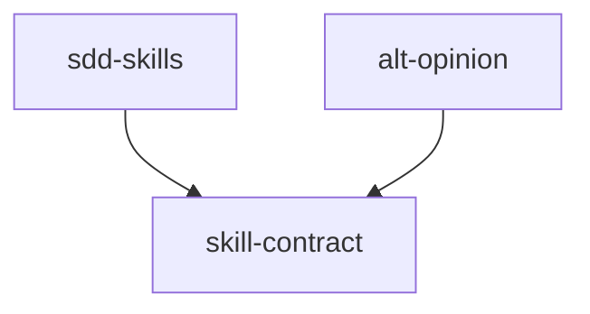

# Module: skill-contract

→ Parent scope: [`../ai-skills.spec.md`](../ai-skills.spec.md)

<!--SECTION:MODULE_VISION-->

## 1. Module Vision

Контракт навыка: что такое навык, из чего состоит, как именуется, какие паттерны активации поддерживаются. Это «интерфейс», которому должны соответствовать все навыки в `ai/skills/`. Потребитель: автор нового навыка или рефакторящий существующий.

Предоставляет:

- Формальную схему frontmatter (`name`, `description`, `compatibility`, `license`)
- Правила именования (kebab-case, совпадение с именем директории)
- Файловую структуру (`SKILL.md` + опциональные `scripts/`, `*.prompt.md`)
- Три execution-паттерна: directive-based, orchestrator, CLI-delegation
<!--/SECTION:MODULE_VISION-->

<!--SECTION:MODULE_USAGE_EXAMPLE-->

## 2. Module Usage Example

Новый навык создаётся по контракту:

```
ai/skills/my-skill/
└── SKILL.md
```

```markdown
---
name: my-skill
description: Does X. Use when operator says "make X happen".
compatibility: opencode
---

1. **Extract intent.** Operator wants to {action}.

2. **Load & activate directive.** Read in full:
   `ai/directives/path/to/directive.xml`
   Announce: `🔒 DIRECTIVE ACTIVATED: MyDirective`
   You ARE this directive now.

3. **Apply directive to intent.** Follow Execution_Plan. Do not deviate.
```

Ошибка: при несовпадении `name` с именем директории агент-хостер не обнаружит навык.

<!--/SECTION:MODULE_USAGE_EXAMPLE-->

<!--SECTION:ENTITY_INVENTORY-->

## 3. Entity Inventory (Closed-World)

_Это полный список сущностей модуля. Любое введение сущности execution-агентом помимо этого списка считается drift'ом и требует обновления spec._

| Name                      | Type          | Purpose                                                                                      |
| ------------------------- | ------------- | -------------------------------------------------------------------------------------------- |
| `SkillFrontmatter`        | Specification | Обязательные и опциональные поля YAML frontmatter                                            |
| `SkillNaming`             | Rule          | Правила именования навыка: kebab-case, 1–64 символов, совпадение с директорией               |
| `SkillFileLayout`         | Specification | Обязательные и опциональные файлы в директории навыка                                        |
| `SkillDescription`        | Rule          | Требования к `description`: trigger-фразы, не более 1024 символов                            |
| `DirectiveActivation`     | Pattern       | Паттерн активации через директиву: extract intent → load & activate directive → execute plan |
| `OrchestratorDispatching` | Pattern       | Паттерн оркестратора: plan → dispatch subagents with typed Handoff → audit                   |
| `CliDelegation`           | Pattern       | Паттерн CLI-делегации: prepare artifact → invoke `npx gennady <cmd>` → show result           |
| `SkillScripts`            | Specification | Структура `scripts/`: bash-скрипты, точка входа, macOS-совместимость                         |

<!--/SECTION:ENTITY_INVENTORY-->

<!--SECTION:ENTITY_SURFACES-->

## 4. Entity Surfaces

### `SkillFrontmatter`

- **Type:** Specification
- **Purpose:** Схема YAML frontmatter в начале каждого `SKILL.md`
- **Public Properties:**
  - `name: string` — обязателен. Уникальный идентификатор навыка
  - `description: string` — обязателен. Описание с trigger-фразами, ≤1024 символов
  - `compatibility: string` — опционален. Целевые хосты: `opencode`, `claude`
  - `license: string` — опционален. Тип лицензии, обычно `MIT`
- **Lifecycle:** Создаётся автором навыка. Неизменяем после публикации (изменение `name` ломает обнаружение)
- **Errors & Degradation:** Отсутствие `name` или `description` → навык не будет обнаружен агентом-хостером
- **Consumers:** Все навыки в `ai/skills/`, агенты-хостеры (Claude Code, OpenCode)

### `SkillNaming`

- **Type:** Rule
- **Purpose:** Правила формирования `name` навыка
- **Invariants:**
  - 1–64 символов
  - lowercase alphanumeric + single hyphen separators (`^[a-z0-9]+(-[a-z0-9]+)*$`)
  - Не начинается и не заканчивается на `-`
  - Нет последовательных `--`
  - Совпадает с именем директории навыка
- **Consumers:** `SkillFrontmatter`, sync-skills (валидация при деплое)

### `SkillFileLayout`

- **Type:** Specification
- **Purpose:** Структура директории навыка
- **Public Properties:**
  - `SKILL.md` — обязателен. Точка входа
  - `scripts/` — опционален. Исполняемые скрипты (bash, tsx)
  - `*.prompt.md` — опционален. Кастомные промпты для моделей
  - `*.md` (прочие) — опционален. Дополнительные артефакты (README, и т.д.)
- **Invariants:**
  - `SKILL.md` всегда заглавными буквами
  - Имя директории === `name` из frontmatter
- **Consumers:** Все навыки, sync-skills, агенты-хостеры

### `SkillDescription`

- **Type:** Rule
- **Purpose:** Требования к полю `description`
- **Public Properties:**
  - 1–1024 символов
  - Содержит trigger-фразы: ключевые слова, по которым агент определяет, когда активировать навык
  - Русский и/или английский язык
- **Consumers:** `SkillFrontmatter`

### `DirectiveActivation`

- **Type:** Pattern
- **Purpose:** Навык активирует директиву: три шага
- **Public Operations:**
  - Extract intent — извлечь намерение оператора из контекста
  - Load & activate — прочитать `ai/directives/.../*.xml`, активироваться как директива
  - Execute plan — следовать Execution_Plan директивы без отклонений
- **Consumers:** SDD directive-based навыки (sdd-discover, sdd-setup, sdd-audit, sdd-scaffold, sdd-module-decomposition, sdd-infra, sdd-critic, sdd-continue, sdd-fix)

### `OrchestratorDispatching`

- **Type:** Pattern
- **Purpose:** Навык планирует и диспатчит subagent-фазы, сам код не пишет
- **Public Operations:**
  - Plan — прочитать planning surface (Meta, Phases Overview, Execution Log)
  - Dispatch phases — последовательно, каждая в свежем контексте, с typed Handoff между фазами
  - Dispatch audit — обязательный финальный шаг после всех фаз
  - Retry on FAIL — максимум 2 попытки аудита, селективный перезапуск фаз
- **Consumers:** sdd-execute, sdd-execute-batch

### `CliDelegation`

- **Type:** Pattern
- **Purpose:** Навык делегирует CLI-команде `npx gennady <cmd>`; навык не содержит логики
- **Public Operations:**
  - Prepare artifact — сформировать входной файл/аргументы
  - Invoke CLI — один bash-вызов `npx gennady <cmd>`
  - Show result — вернуть вывод CLI пользователю
- **Consumers:** alt-opinion

### `SkillScripts`

- **Type:** Specification
- **Purpose:** Структура и контракт для `scripts/` в директории навыка
- **Public Properties:**
  - Точка входа: один диспатчер-скрипт (например `sdd`)
  - Bash, macOS-совместимые (нет GNU-only флагов)
  - Node.js скрипты — только через `tsx`
- **Invariants:**
  - Все подкоманды уважают `AX_BASH_NO_SILENT_EMPTY`
  - Единый permission-паттерн: `Bash(scripts/<name>/<name> *)`
- **Consumers:** sdd-execute (скрипты), sdd-check (использует те же скрипты)
<!--/SECTION:ENTITY_SURFACES-->

<!--SECTION:MODULE_CONTRACTS-->

## 5. Module Contracts (DbC)

### Pattern: `DirectiveActivation`

- **Purpose:** Активация директивы агентом через навык
- **Consumers:** SDD directive-based навыки
- **Runtime Backing:** `real-runtime`
- **Verification Levels:** `contract`
- **Deferred Runtime Scope:** None

**Contract (DbC):**

- **Preconditions:**
  - Навык содержит путь к XML-директиве в dev-форме: `~/Developer/gennady/ai/directives/...` (при sync-skills заменяется на `ai/directives/...`)
  - Директива существует и читаема
  - Агент может читать файлы в проекте
- **Postconditions:**
  - Агент активирован как директива (объявлено `🔒 DIRECTIVE ACTIVATED: <Name>`)
  - Агент следует Execution_Plan директивы
- **Invariants:**
  - Навык не модифицирует директиву (read-only)
  - Навык не содержит логики кроме трёх шагов активации

### Pattern: `OrchestratorDispatching`

- **Purpose:** Оркестрация subagent-фаз с typed Handoff
- **Consumers:** sdd-execute, sdd-execute-batch
- **Runtime Backing:** `real-runtime`
- **Verification Levels:** `contract`
- **Deferred Runtime Scope:** None

**Contract (DbC):**

- **Preconditions:**
  - Ticket существует и содержит Meta + Phases Overview + Execution Log
  - `~/Developer/gennady/ai/skills/sdd-execute/scripts/sdd` доступен (в dev-режиме; при sync-skills → `.claude/skills/sdd-execute/scripts/sdd`)
- **Postconditions:**
  - Все pending-фазы выполнены последовательно
  - Аудит запущен после закрытия раунда
  - Tracker синхронизирован: ticket Meta.Status + tasks/\*/README.md
- **Invariants:**
  - Оркестратор не читает bodies фаз, BDD, Verification, Coverage — это делают subagent'ы
  - Оркестратор не пишет код
  - Max 2 попытки аудита на задачу

### Pattern: `CliDelegation`

- **Purpose:** Делегирование CLI-команде
- **Consumers:** alt-opinion
- **Runtime Backing:** `real-runtime`
- **Verification Levels:** `contract`
- **Deferred Runtime Scope:** None

**Contract (DbC):**

- **Preconditions:**
  - `npx gennady` доступен (npm-пакет установлен)
  - Входной артефакт сформирован (файл или stdin)
- **Postconditions:**
  - CLI выполнен, результат показан пользователю
- **Invariants:**
  - Навык делает ровно один bash-вызов
  - Навык не создаёт промежуточные оркестраторы
  - CLI форматирует результат сам — навык не добавляет комментариев
  <!--/SECTION:MODULE_CONTRACTS-->

<!--SECTION:PUBLIC_OPTIONS-->

## 6. Public Options & Policies

| Option             | Binding                                                     | Status   |
| ------------------ | ----------------------------------------------------------- | -------- |
| Frontmatter-схема  | `SkillFrontmatter`                                          | ✅ bound |
| Naming regex       | `SkillNaming`                                               | ✅ bound |
| Файловая структура | `SkillFileLayout`                                           | ✅ bound |
| Описание ≤1024     | `SkillDescription`                                          | ✅ bound |
| Три паттерна       | DirectiveActivation, OrchestratorDispatching, CliDelegation | ✅ bound |

Все опции привязаны. Нет отложенных.

<!--/SECTION:PUBLIC_OPTIONS-->

<!--SECTION:FILE_STRUCTURE-->

## 7. File Structure

```
ai/skills/<name>/
├── SKILL.md              # обязателен: YAML frontmatter + markdown body
├── scripts/              # опционально: исполняемые скрипты
│   ├── <name>            # диспатчер (точка входа)
│   └── *.sh              # helper-скрипты
└── *.prompt.md           # опционально: кастомные промпты
```

**File Mapping:**
| Путь | Компонент |
|---|---|
| `SKILL.md` | `SkillFrontmatter` (frontmatter) + тело (процедура активации) |
| `scripts/<name>` | `SkillScripts` (диспатчер) |
| `scripts/*.sh` | `SkillScripts` (helper) |
| `*.prompt.md` | Кастомный промпт для моделей |

<!--/SECTION:FILE_STRUCTURE-->

<!--SECTION:MODULE_DECISION_LOG-->

## 8. Module Decision Log

### D-M001 — Три execution-паттерна как отдельные сущности

- **Status:** active
- **Recorded:** session ModuleDecomposition, ai-skills, skill-contract
- **Why:** DirectiveActivation, OrchestratorDispatching и CliDelegation выделены как отдельные сущности, потому что имеют разные контракты (pre/post условия, потребители). Это позволяет добавлять новые паттерны без изменения существующих.
- **Risk accepted:** При добавлении 4-го паттерна потребуется расширение инвентаря.
- **Rejected alternatives:**
  - Один универсальный `ActivationPattern` — не покрывает специфику OrchestratorDispatching (subagent dispatch) и CliDelegation (CLI invoke)
  <!--/SECTION:MODULE_DECISION_LOG-->

<!--SECTION:INTER_MODULE_DEPENDENCIES-->

## 9. Inter-Module Dependencies

- **Depends on:** None (контракт — корень зависимостей)
- **Provides to:** `sdd-skills`, `alt-opinion`



<!--/SECTION:INTER_MODULE_DEPENDENCIES-->

<!--SECTION:HANDOFF-->

## 10. Handoff to Task Scaffolding

- **Implementation files to be created:** Контракт уже существует в виде 17 навыков; код не требуется — это спецификация формата.
- **Test files to be created:** Валидация frontmatter (unit-тесты в sync-skills скоупе)
- **Stack dependencies:**
  - Language: TypeScript (для валидации в sync-skills)
  - Test framework: node:test
- **Module Rules Additions:** None

| Rule | Category | Source |
| ---- | -------- | ------ |
| —    | —        | —      |

- **Open risks & validation needs:**
  - ~~В существующих навыках есть абсолютные пути (`/Users/k.lebedev/...`) — требуют релативизации~~ → Закрыто: PathNormalizer в sync-skills (D-M007) + dev-пути в исходниках
  - `compatibility: opencode` в существующих навыках — ок для OpenCode, Claude игнорирует
  <!--/SECTION:HANDOFF-->
