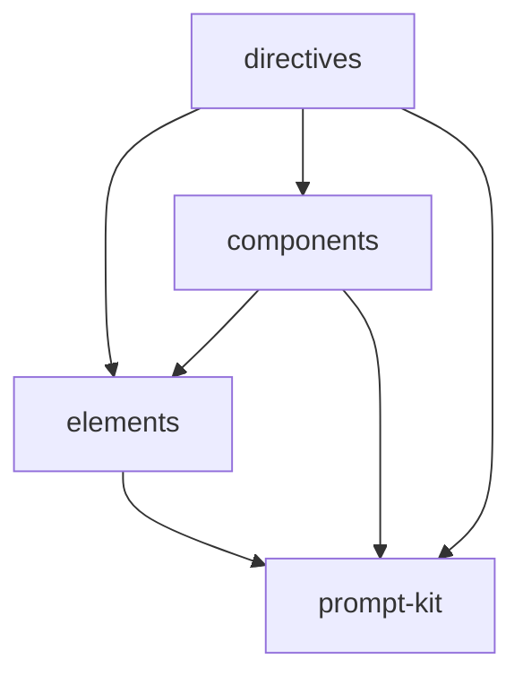

# ai-tsx: Library Specification

<!--SECTION:SCOPE_TYPE-->

## scope-type

library

<!--/SECTION:SCOPE_TYPE-->

<!--SECTION:VISION-->

## 1. Vision & Primary Goal

Перенести 30+ XML-директив из `ai/directives/` на типизированные JSX-компоненты. Автор директивы пишет TSX с автокомплитом и type-checking, библиотека рендерит в HTML (нестрогая XML-семантика). Верификация через `git diff` гарантирует, что сгенерированный вывод побайтово идентичен оригиналу.

Три слоя: `elements` (типизированные `definePromptElement`), `components` (композитные шаблоны), `directives` (готовые TSX-директивы).

<!--/SECTION:VISION-->

<!--SECTION:GOLDEN_DX-->

## 2. Approved Golden DX Example (composition view)

Полный сценарий собирается из трёх модулей. Детальные usage-примеры — в каждом модуле.

```tsx
// 1. Элементы — module: elements
//    см. [elements/usage](./elements/elements.spec.md#2-module-usage-example)
import { Pattern, Snippet, Hook, AntiPattern, Good, Definition } from 'gennady/ai-tsx/elements';

// 2. Композиты — module: components
//    см. [components/usage](./components/components.spec.md#2-module-usage-example)
import { CodePatternsBlock, AntiPatternsBlock, VerificationHooksBlock } from 'gennady/ai-tsx/components';

// 3. Директива + рендер — module: directives
//    см. [directives/usage](./directives/directives.spec.md#2-module-usage-example)
import { TypeScriptCodingRules } from 'gennady/ai-tsx/directives';
import { renderDirective, verifyDirective } from 'gennady/ai-tsx';

// Рендер
const html = renderDirective(TypeScriptCodingRules, 'xml');

// Верификация против оригинала
const result = verifyDirective(
  'ai-tsx/directives/typescript-coding-rules.tsx',
  'ai/directives/coding/typescript-rules.xml'
);
// → { match: true }
```

<!--/SECTION:GOLDEN_DX-->

<!--SECTION:REQUIREMENTS_AND_CONSTRAINTS-->

## 3. Requirements & Constraints

### 3.1 Functional Requirements

- **FR1 · `definePromptElement`-элементы** — типизированные компоненты для структур директив: `Pattern(id, Intent, Snippet, Why)`, `Hook(id, Purpose, Command, Expected)`, `AntiPattern(id, Bad, WhyBad, Good)`, `Definition(id)`, `Snippet(language?)`, `Good(language?)`. Роль `block` для `Snippet` и `Good` — содержимое без markdown-фенсов, фенсы добавляются только при рендере в md (на уровне элементов для тестирования; рендер директив в md — out of scope v1). Экспорт из `gennady/ai-tsx/elements`.

- **FR2 · Композитные шаблоны** — собираются из elements + встроенных примитивов prompt-kit. Представляют переиспользуемые блоки директив (`CodePatterns`, `AntiPatterns`, `VerificationHooks`, etc.). Экспорт из `gennady/ai-tsx/components`.

- **FR3 · Директивы как TSX** — каждая пилотная директива — `.tsx` файл в `ai-tsx/directives/`. Композиция из components/elements/prompt-kit. Рендерится в HTML (нестрогий XML, без экранирования энтити).

- **FR4 · Рендер директивы** — `renderDirective(component, format) → string`. Обёртка над prompt-kit `renderPrompt`. Возвращает HTML-строку.

- **FR5 · Верификация через diff** — `verifyDirective(tsxPath, originalXmlPath) → { match: boolean, diff: string }`. Рендерит TSX → сравнивает с оригинальным XML. В тестах: `match === true`.

- **FR6 · Простые контейнеры через Group/Node** — `Mission`, `Intent`, `Why`, `Bad`, `WhyBad`, `Purpose`, `Command`, `Expected` реализуются как `<Group is="...">` или `<Node is="...">` без отдельных `definePromptElement`. Group для контейнеров с children, Node для листовых ключ-значение.

  | Контейнер | Примитив | Обоснование |
  |---|---|---|
  | `Mission` | Group | Может содержать children (текст + Bold) |
  | `Intent` | Node | Листовой ключ-значение |
  | `Why` | Node | Листовой ключ-значение |
  | `Bad` | Node | Листовой ключ-значение |
  | `WhyBad` | Node | Листовой ключ-значение |
  | `Purpose` | Node | Листовой ключ-значение |
  | `Command` | Node | Листовой ключ-значение |
  | `Expected` | Node | Листовой ключ-значение |

  **Формат вывода:** HTML с нестрогой семантикой (без экранирования энтити). Параметр `format: 'xml'` в `renderDirective` указывает на формат вывода, исторически названный `xml` для совместимости с prompt-kit, фактически производящий HTML. Сверка через git diff с XML-оригиналами без изменений содержимого.

### 3.2 Non-Functional Constraints

- **NFR1** — Node.js 22+, zero runtime-зависимостей (кроме prompt-kit). Ошибки импорта prompt-kit (missing module, missing export) — нативные ошибки Node.js, не оборачиваются в `[ai-tsx]`.
- **NFR2** — Экспорт через `gennady/ai-tsx`, `gennady/ai-tsx/elements`, `gennady/ai-tsx/components`.
- **NFR3** — Рендер синхронный, stateless. Максимальная глубина вложенности не ограничена (стек JS-движка — предел).
- **NFR4** — Использует существующий `"jsx": "react-jsx"` в tsconfig (совместим с prompt-kit).
- **NFR5** — Форматирование соответствует prettier-конфигу проекта.

### 3.3 Out-of-Scope

- Полная миграция всех 30+ директив (v1 — пилот: директивы с минимальным объёмом правок)
- JSON-формат вывода (только HTML/XML)
- Markdown-рендер директив (только HTML для diff). Element-level md-рендер для тестирования — в scope.
- Валидация структуры директивы (обязательные секции, порядок)
- Внесение изменений в смысловое содержание директив (реформатирование без изменения смысла)
- Пилотные XML-файлы не содержат CDATA, XML-деклараций (`<?xml?>`), XML-комментариев — обработка этих конструкций не требуется в v1

### 3.4 Runtime Backing & Deferred Scope

| Capability | Posture | Note |
|---|---|---|
| `definePromptElement`-элементы | real-runtime | Чистая фабрика, stateless |
| Композитные шаблоны | real-runtime | TSX-функции, stateless |
| Директивы как TSX | real-runtime | Композиция компонент |
| Рендер в HTML | real-runtime | Через prompt-kit `renderPrompt` |
| Верификация через diff | real-runtime | `git diff`, stateless |

Deferred: миграция оставшихся (не-пилотных) директив — v2.

### 3.5 Rules

| Rule | Category | Source |
|---|---|---|
| typescript-rules | coding | ai/directives/coding/typescript-rules.xml |
| node-test | testing | ai/directives/testing/node-test.xml |

<!--/SECTION:REQUIREMENTS_AND_CONSTRAINTS-->

<!--SECTION:PUBLIC_API_SURFACE-->

## 4. Public API Surface

### Элементы (ai-tsx/elements)

```ts
import { Pattern, Snippet, Hook, AntiPattern, Good, Definition } from 'gennady/ai-tsx/elements';
```

| Элемент | Роль | Пропсы | Назначение |
|---|---|---|---|
| `Pattern` | section | `id: string` | Контейнер паттерна: содержит Intent + Snippet + Why |
| `Snippet` | block | `language?: string` | Блок кода без фенсов; фенсы — в md-рендере |
| `Hook` | section | `id: string` | Контейнер верификационного хука: Purpose + Command + Expected |
| `AntiPattern` | section | `id: string` | Контейнер анти-паттерна: Bad + WhyBad + Good |
| `Good` | block | `language?: string` | Блок правильного кода (внутри AntiPattern) |
| `Definition` | section | `id: string` | Контейнер определения: произвольный текст и/или вложенные элементы через children |

### Композитные шаблоны (ai-tsx/components)

```ts
import { CodePatternsBlock, AntiPatternsBlock, VerificationHooksBlock, DefinitionsBlock, DirectiveContextBlock } from 'gennady/ai-tsx/components';
```

| Компонент | Purpose | Дети |
|---|---|---|
| `CodePatternsBlock` | Блок `<CodePatterns>` — обёртка для Pattern[] | Pattern |
| `AntiPatternsBlock` | Блок `<AntiPatterns>` — обёртка для AntiPattern[] | AntiPattern |
| `VerificationHooksBlock` | Блок `<VerificationHooks>` — обёртка для Hook[] | Hook |
| `DefinitionsBlock` | Блок `<Definitions>` — обёртка для Definition[] | Definition |
| `DirectiveContextBlock` | Блок `<DirectiveContext>` — обёртка для Mission. Соответствует структуре всех оригинальных директив (контекст перед BeliefState) | `{ children: JSXNode }` |

Все компоненты — прозрачные функции (transparent component). Функция-компонент не имеет собственного тега в выводе (нет `<CodePatternsBlock>`). Вывод формируется через рендер `Group is="CodePatterns"` внутри компонента — тег `<CodePatterns>` исходит от `Group`, не от самого компонента. Набор закрыт для v1.

Пример сигнатуры:
```tsx
// Типы элементов — результат definePromptElement
// PatternElement = ReturnType<typeof Pattern>, и т.д.
// Прозрачная функция — только children
const CodePatternsBlock = (props: { children: PatternElement[] }) => (
  <Group is="CodePatterns">{props.children}</Group>
);
```

### Утилиты (ai-tsx)

```ts
import { renderDirective, verifyDirective } from 'gennady/ai-tsx';
```

```ts
function renderDirective(
  tree: JSXNode | (() => JSXNode),  // функция вызывается без аргументов: tree()
  format: 'xml'   // v1: только xml; параметр forward-compatible для md/json в будущем
): string;
```

Обёртка над prompt-kit `renderPrompt`. Если `tree` — функция, вызывается без аргументов для получения JSX-дерева. Формат, отличный от `'xml'` → `Error('[ai-tsx] unsupported format: <format>. Supported: xml')`. Ошибка в компоненте → `Error` с префиксом `[ai-tsx]` и `cause`.

```ts
type VerifyResult = { match: true } | { match: false; diff: string };

function verifyDirective(
  tsxPath: string,        // путь относительно корня проекта
  originalXmlPath: string  // путь относительно корня проекта
): VerifyResult;
```

**Контракт ошибок:**
- `{ match: false }` возвращается ТОЛЬКО когда оба файла доступны, рендер успешен, и `git diff` показывает непустой diff
- Все остальные ошибки (файл не найден, ошибка рендера, git недоступен, git crash) → `Error`
- TSX-файл не найден → `Error('[ai-tsx] tsx file not found: <path>')`
- Оригинальный XML не найден → `Error('[ai-tsx] original xml not found: <path>')`
- Ошибка рендера TSX (runtime error в компоненте) → `Error` с `cause`, префикс `[ai-tsx]`
- `git` не доступен → `Error('[ai-tsx] git not available')`
- Файл недоступен для чтения (permission) → `Error` с путём и причиной
- `git diff` завершился аварийно (signal, timeout) → `Error('[ai-tsx] git diff failed: <reason>')`
- `{ match: true }` только когда `git diff --no-index` возвращает exit 0 (пустой diff)
- Никогда не возвращает `{ match: true }` при отсутствующем файле или ошибке рендера

### Импортируемые из prompt-kit (для авторов директив)

```ts
// Готовые примитивы
import {
  Prompt, PrimaryGoal, BeliefState, Axiom, HardForbidden,
  Section, List, Code, Bold, Group, Node
} from 'gennady/prompt-kit';

// Простые контейнеры — через Group/Node из prompt-kit
// <Group is="Mission">текст</Group>
// <Node is="Intent">описание</Node>
```

<!--/SECTION:PUBLIC_API_SURFACE-->

<!--SECTION:ARCHITECTURE-->

## 5. Architecture

### Слои

```
ai-tsx/
├── elements/          # definePromptElement: Pattern, Snippet, Hook, AntiPattern, Good, Definition
│   └── (каждый → тест: рендер в html + md)
├── components/        # композитные шаблоны из elements + prompt-kit
│   └── (каждый → тест: рендер в html)
├── directives/        # готовые TSX-директивы
│   └── (каждая → тест: renderDirective → git diff против оригинала)
└── index.ts           # renderDirective, verifyDirective, реэкспорт
```

### Поток рендера

```
[definePromptElement] → [композит] → [директива .tsx]
                                            ↓
                                    renderPrompt('xml')
                                            ↓
                                      HTML-строка
                                            ↓
                                    git diff против оригинального .xml
                                            ↓
                                   { match: true } ✅
```

### Инкрементальный процесс (BDD-first)

Для каждого элемента:
1. Пишется тест — ожидаемый HTML и Markdown вывод
2. Определяется `definePromptElement` в `elements/`
3. Рендерится — сверяется с ожидаемым
4. Если расхождение — правится элемент или уточняется ожидание
5. Только после этого — компонент и директива

### Решения

- **`definePromptElement` для структурных элементов** — `Pattern`, `Hook`, `AntiPattern`, `Snippet`, `Good`, `Definition` имеют обязательные пропсы (`id`, `language`) и специфичных children. `Group`/`Node` не дают type-safety для children-контракта.
- **`Group`/`Node` для простых контейнеров** — `Mission`, `Intent`, `Why`, `Bad`, `WhyBad`, `Purpose`, `Command`, `Expected` — достаточно `<is>text</is>`.
- **HTML-вывод без экранирования энтити** — выходной формат: HTML с нестрогой семантикой. Энтити не экранируются, остаются как есть.
- **`Snippet` и `Good` — роль `block`** — содержимое без markdown-фенсов. Фенсы добавляются только при рендере в md. В HTML: `<Snippet language="ts">код</Snippet>`.

### 5.1 Rejected Alternatives

- **Все элементы через `Group`** — теряется type-safety: `Pattern` без `id` не должен компилироваться.
- **Отдельные `definePromptElement` для каждого контейнера** — boilerplate: `Mission`, `Intent` уже покрыты `Node is="..."`.
- **Свой `jsxImportSource`** — не нужен, prompt-kit уже использует react-jsx.
- **Отдельный scope для каждого слоя** — elements, components, directives — один scope, три директории. Меньше церемоний, быстрее итерация.
- **JSON-формат в v1** — избыточно. Дифф возможен только против XML-оригиналов.

<!--/SECTION:ARCHITECTURE-->

<!--SECTION:DECISION_LOG-->

## 6. Decision Log

### D-001 — `definePromptElement` для структурных элементов

- **Status:** active
- **Recorded:** session Discovery, ai-tsx
- **Why:** `Pattern`, `Hook`, `AntiPattern`, `Definition` требуют type-safety для обязательного пропса `id`. `Snippet`, `Good` требуют type-safety для опционального пропса `language`. `Group`/`Node` не дают контракта на children-структуру.
- **Risk accepted:** Шесть элементов — больше API-поверхности, чем один универсальный `Group`.
- **Rejected alternatives:** Все через `Group` — `Pattern` без `id` не ловится компилятором.

### D-002 — `Group`/`Node` для простых контейнеров

- **Status:** active
- **Recorded:** session Discovery, ai-tsx
- **Why:** `Mission`, `Intent`, `Why`, `Bad`, `WhyBad`, `Purpose`, `Command`, `Expected` — простые `<is>text</is>`, не требуют type-safety сверх того что даёт `Group`/`Node`.
- **Risk accepted:** Имя тега в `<Node is="Intent">` может быть опечаткой — не ловится компилятором.
- **Rejected alternatives:** Отдельный `definePromptElement` для каждого — boilerplate без выигрыша.

### D-003 — Отдельный scope `ai-tsx` (не модуль prompt-kit)

- **Status:** active
- **Recorded:** session Discovery, ai-tsx
- **Why:** prompt-kit — максимально обобщённые примитивы. `ai-tsx` — доменно-специфичные элементы и шаблоны для директив. Разделение сохраняет чистоту prompt-kit и позволяет независимую эволюцию.
- **Risk accepted:** Два скоупа с зависимостью — координация изменений в prompt-kit может требовать обновления ai-tsx.
- **Rejected alternatives:** Модуль внутри prompt-kit — размывает границу между обобщённым движком и доменной спецификой.

### D-004 — Пилотный подход (не все директивы сразу)

- **Status:** active
- **Recorded:** session Discovery, ai-tsx
- **Why:** 30+ директив с вариациями структуры. Начинаем с директив, где минимум правок (`typescript-rules`, `node-test`), отлаживаем процесс, затем масштабируем.
- **Risk accepted:** Пилот может выявить необходимость доработки prompt-kit formatter, что отложит остальные директивы.
- **Rejected alternatives:** Все 30+ директив разом — высокий риск расхождений и переписывания.

### D-005 — HTML-вывод без экранирования энтити

- **Status:** active
- **Recorded:** session Discovery, ai-tsx
- **Why:** Оригинальные XML-директивы используют HTML с нестрогой семантикой. Экранирование энтити (`&amp;`, `&lt;`) не применяется — вывод должен быть побайтово близок к оригиналу.
- **Risk accepted:** Формально невалидный XML в некоторых случаях. Приоритет — идентичность diff.
- **Rejected alternatives:** Строгий XML с экранированием — дифф расходится на каждом `&` и `<`.

### D-006 — `Snippet` и `Good` с ролью `block`

- **Status:** active
- **Recorded:** session Discovery, ai-tsx
- **Why:** Содержимое — чистый код без markdown-фенсов. Фенсы (` ```typescript `) добавляются форматтером только при рендере в md. В HTML: `<Snippet language="ts">код</Snippet>`.
- **Risk accepted:** prompt-kit `block` role уже поддерживает `lang` пропс — совместимо.
- **Rejected alternatives:** Хранить фенсы в содержимом — дублирование, сложнее редактировать.

### D-007 — BDD-first инкрементальный процесс

- **Status:** active
- **Recorded:** session Discovery, ai-tsx
- **Why:** Каждый элемент сначала покрывается тестом с ожидаемым HTML/MD выводом, затем реализуется, затем рендерится и сверяется. Исключает regression на ранних этапах.
- **Risk accepted:** Больше файлов (тесты на каждый элемент) — дольше начальный заход.
- **Rejected alternatives:** Сначала все элементы → потом все тесты — regression сложнее отловить.

### D-008 — Декомпозиция по слоям (elements + components + directives)

- **Status:** active
- **Recorded:** session ModuleDecomposition, ai-tsx
- **Why:** Три модуля с чёткими границами: элементы (фабрики) → компоненты (композиция) → директивы (финальный артефакт + diff-тесты). Каждый слой — естественный consumer нижнего. Минимум coupling.
- **Risk accepted:** Три модуля для небольшого scope — overhead. Но оправдано разным характером работы.
- **Rejected alternatives:** Монолит (всё в одном модуле) — свалка из фабрик, композитов и diff-тестов; декомпозиция по feature (typescript-directive, node-test-directive, ...) — дублирование элементов между feature-модулями.

<!--/SECTION:DECISION_LOG-->

<!--SECTION:SCOPE_DEPENDENCIES-->

## 7. Scope Dependencies

- **Depends on:** prompt-kit (library, workspace: `"prompt-kit": "workspace:*"`, API snapshot `git: aeff4ee` — `renderPrompt`, `definePromptElement`, `Prompt`, `Group`, `Node`, `BeliefState`, `Axiom`, `Section`, `List`, `Code`, `Bold`), infra-base (infrastructure — TypeScript, node:test, prettier)
- **Provides to:** ai-skills (директивы для агентов)

<!--/SECTION:SCOPE_DEPENDENCIES-->

<!--SECTION:MODULE_MAP-->

## 8. Module Map

Spec hierarchy is materialized at `specs/ai-tsx/`. Module specs are at `specs/ai-tsx/<module>/<module>.spec.md`.

### 8.1 Modules

- [elements](./elements/elements.spec.md) — `definePromptElement`-элементы: Pattern, Snippet, Hook, AntiPattern, Good, Definition
- [components](./components/components.spec.md) — композитные шаблоны: CodePatternsBlock, AntiPatternsBlock, VerificationHooksBlock, DefinitionsBlock, DirectiveContextBlock
- [directives](./directives/directives.spec.md) — пилотные TSX-директивы + утилиты renderDirective, verifyDirective

### 8.2 Inter-Module Dependency Map



### 8.3 Stack Dependencies

- Languages: TypeScript
- Test frameworks: node:test

### 8.4 Handoff to task scaffolding

- **Primary input:** `specs/ai-tsx/ai-tsx.spec.md` (this file)
- **Required directives:** `ai/directives/coding/typescript-rules.xml`, `ai/directives/testing/node-test.xml`
- **Open risks & validation needs:**
  - prompt-kit XML-formatter может потребовать флаг `raw` для неэкранирования энтити
  - `git diff` может показывать controlled расхождения — решение: fix formatter или accept

<!--/SECTION:MODULE_MAP-->

<!--SECTION:BOOTSTRAP_REQUIREMENTS-->

## 9. Bootstrap Requirements

| # | Requirement | Kind | Owner | Resolution |
|---|---|---|---|---|
| 1 | prompt-kit в `exports` package.json | structural | external-prereq-scope (prompt-kit) | Добавить `"./prompt-kit": "./prompt-kit/index.ts"`, `"./prompt-kit/*": "./prompt-kit/*"` |
| 2 | Директория `ai-tsx/` с `elements/`, `components/`, `directives/` | structural | this-scope-task | Создать структуру |
| 3 | `ai-tsx` в `exports` package.json | structural | this-scope-task | `"./ai-tsx": "./ai-tsx/index.ts"`, `"./ai-tsx/elements": "./ai-tsx/elements/index.ts"`, `"./ai-tsx/components": "./ai-tsx/components/index.ts"` |
| 4 | `ai-tsx/**/*` в tsconfig `include` | structural | this-scope-task | Добавить в массив |
| 5 | snake_case → PascalCase в `ai/directives/*.xml` | file | operator-action | ✅ Выполнено (81 тег, 36 файлов) |

<!--/SECTION:BOOTSTRAP_REQUIREMENTS-->

<!--SECTION:HANDOFF-->

## 10. Handoff

Module decomposition complete — see §8 Module Map for per-module specs and handoffs.

- **Bootstrap tickets ready for cascade:** see §9
- **Open risks:**
  - prompt-kit XML-formatter может потребовать флаг `raw` для неэкранирования энтити
  - Порядок атрибутов может отличаться от оригинала → требует доработки formatter. Любой diff → fix, не accept. Если formatter не может быть исправлен — D-00X с явным risk acceptance оператора
  - Пилот: директивы, использующие только элементы из FR1 и не требующие изменений в prompt-kit formatter

<!--/SECTION:HANDOFF-->

## Critic Rounds

### Round 1 — 2026-06-09

- Verdict: NEEDS_WORK
- Accepted: 9 — D-001 language prop contradiction; verifyDirective error paths missing; Definition children unspecified; failure modes absent; component list mismatch §4 vs §8.1; HTML/XML terminology drift; format param misleading; Group/Node mapping missing; prompt-kit unversioned
- Rejected: 1 — «No concrete BDD scenarios in spec» → BDD belongs to module specs and task tickets (TSK-74..76), discovery spec has Golden DX sufficient
- Reconcile: все сущности → JUSTIFY (prompt-kit даёт обобщённые примитивы, ai-tsx добавляет типизированные domain-specific фабрики)
- Changes: D-001 language fix; DefinitionsBlock + DirectiveContextBlock добавлены в §4; Definition children contract; error contracts для verifyDirective; Group/Node mapping table; prompt-kit version constraint; формат вывода уточнён

### Round 2 — 2026-06-09

- Verdict: NEEDS_WORK
- Accepted: 7 — components API contracts missing; DirectiveContextBlock unjustified; prompt-kit unversioned; verifyDirective error paths undifferentiated; git non-content errors; decision log numbering; component set hedged
- Rejected: 0
- Changes: components table с purpose + children; DirectiveContextBlock justification; verifyDirective error paths с именами файлов; git non-content error handling; D-007/D-008 хронологический порядок; prompt-kit API snapshot; hedging text removed

### Round 3 — 2026-06-09

- Verdict: CRITICAL
- Accepted: 9 — prompt-kit unversioned; exact-match vs controlled risk contradiction; md fenses scope qualifier; renderDirective invalid format error; simple container import; git crash error; "практически" → "побайтово"; pilot selection criteria; recursion note
- Rejected: 2 — element rendering output (определяется prompt-kit engine по роли; конкретный вывод в тестовых фикстурах TSK-74); Definition speculative (typescript-rules.xml содержит `<Definitions>` + `<Definition>`, используется в пилоте)
- Reconcile: N/A
- Changes: prompt-kit pin `git: aeff4ee`; "побайтово идентичен"; FR1 md qualifier; renderDirective unsupported format error; git crash error contract; §8.4 open risks updated; simple container import example; NFR3 recursion note; pilot criteria

### Round 4 — 2026-06-09

- Verdict: CRITICAL
- Accepted: 8 — component transparency contradiction; components API signatures; verifyDirective error vs return semantics; prompt-kit dependency model; encoding edge cases; acceptance criteria; md boundary; DirectiveContextBlock justification
- Rejected: 4 — Definition children contract (definePromptElement мотивирован id, не children); infra-base dependency (фундамент); failure scenarios (error contracts покрыты в §4); DirectiveContextBlock wraps single entity (семантическая обёртка на всех директивах)
- Changes: компонентная прозрачность + сигнатуры; verifyDirective return semantics; workspace dependency model; encoding note в out-of-scope; acceptance criteria tightened; md boundary clarified

### Round 5 — 2026-06-09

- Verdict: NEEDS_WORK (MAX_ROUNDS)
- Accepted: 4 — PatternElement type undefined; renderDirective function component props; DirectiveContextBlock children type; prompt-kit import error boundary
- Rejected: 1 — Architecture process guidance (minor organizational concern)
- Changes: element instance types comment; renderDirective signature `() => JSXNode`; DirectiveContextBlock children type; NFR1 prompt-kit import error note

