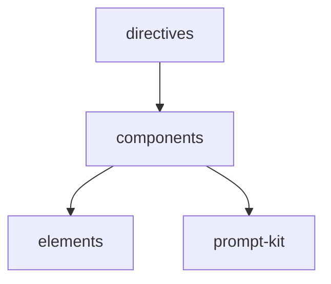

# Module: components

<!--SECTION:MODULE_VISION-->

## 1. Module Vision

Композитные шаблоны — переиспользуемые блоки, собранные из `elements` + prompt-kit-примитивов. Каждый шаблон — прозрачная функция (transparent component), рендерится только children. Представляют типовые блоки директив: CodePatterns, AntiPatterns, VerificationHooks, Definitions, DirectiveContext.

[Scope spec → `../../ai-tsx.spec.md`](../../ai-tsx.spec.md)

<!--/SECTION:MODULE_VISION-->

<!--SECTION:MODULE_USAGE_EXAMPLE-->

## 2. Module Usage Example

```tsx
import { CodePatternsBlock } from 'gennady/ai-tsx/components';
import { Pattern, Snippet } from 'gennady/ai-tsx/elements';
import { Node } from 'gennady/prompt-kit';

const block = (
  <CodePatternsBlock>
    <Pattern id="PT_EXAMPLE">
      <Node is="Intent">Exported data shape.</Node>
      <Snippet language="typescript">{`type Foo = { id: string }`}</Snippet>
      <Node is="Why">...</Node>
    </Pattern>
  </CodePatternsBlock>
);

// HTML:
// <CodePatterns>
//   <Pattern id="PT_EXAMPLE">
//     <Intent>Exported data shape.</Intent>
//     <Snippet language="typescript">type Foo = { id: string }</Snippet>
//     <Why>...</Why>
//   </Pattern>
// </CodePatterns>
```

<!--/SECTION:MODULE_USAGE_EXAMPLE-->

<!--SECTION:ENTITY_INVENTORY-->

## 3. Entity Inventory (Closed-World)

_Это полный список сущностей модуля. Любое введение сущности execution-агентом помимо этого списка считается drift'ом и требует обновления spec._

| Name | Surface | Type | Purpose |
|---|---|---|---|
| `CodePatternsBlock` | 🟢 | Component | Блок `<CodePatterns>...</CodePatterns>`, принимает children-Pattern[] |
| `AntiPatternsBlock` | 🟢 | Component | Блок `<AntiPatterns>...</AntiPatterns>`, принимает children-AntiPattern[] |
| `VerificationHooksBlock` | 🟢 | Component | Блок `<VerificationHooks>...</VerificationHooks>`, принимает children-Hook[] |
| `DefinitionsBlock` | 🟢 | Component | Блок `<Definitions>...</Definitions>`, принимает children-Definition[] |
| `DirectiveContextBlock` | 🟢 | Component | Блок `<DirectiveContext>`, обёртка над `Group is="DirectiveContext"` с Mission |

<!--/SECTION:ENTITY_INVENTORY-->

<!--SECTION:ENTITY_SURFACES-->

## 4. Entity Surfaces

### `CodePatternsBlock`

- **Type:** Component (прозрачная функция)
- **Purpose:** Блок с паттернами кода. Оборачивает children в `Group is="CodePatterns"`.
- **Public Properties:** children (Pattern[])
- **Public Operations:** N/A — JSX-компонент
- **Lifecycle:** Stateless.
- **Events Emitted:** N/A
- **Errors & Degradation:** N/A
- **Consumers:**
  - Internal: `directives/`
  - External: пользовательский код

### `AntiPatternsBlock`

- **Type:** Component
- **Purpose:** Блок с анти-паттернами. Оборачивает children в `Group is="AntiPatterns"`.
- **Public Properties:** children (AntiPattern[])
- **Consumers:**
  - Internal: `directives/`
  - External: пользовательский код

### `VerificationHooksBlock`

- **Type:** Component
- **Purpose:** Блок с верификационными хуками. Оборачивает children в `Group is="VerificationHooks"`.
- **Public Properties:** children (Hook[])
- **Consumers:**
  - Internal: `directives/`
  - External: пользовательский код

### `DefinitionsBlock`

- **Type:** Component
- **Purpose:** Блок с определениями. Оборачивает children в `Group is="Definitions"`.
- **Public Properties:** children (Definition[])
- **Consumers:**
  - Internal: `directives/`
  - External: пользовательский код

### `DirectiveContextBlock`

- **Type:** Component
- **Purpose:** Блок контекста директивы. Оборачивает Mission в `Group is="DirectiveContext"`.
- **Public Properties:** children (обычно один `Node is="Mission"`)
- **Consumers:**
  - Internal: `directives/`
  - External: пользовательский код

<!--/SECTION:ENTITY_SURFACES-->

<!--SECTION:MODULE_CONTRACTS-->

## 5. Module Contracts (DbC)

### Module-level invariants

- Все компоненты — прозрачные функции (transparent). Рендерятся только children. Пропсы игнорируются.
- Оборачивают children в `Group is="..."` из prompt-kit.
- Не содержат логики рендера вне JSX-композиции.
- Не имеют состояния.
- Имена файлов: lower-case.

<!--/SECTION:MODULE_CONTRACTS-->

<!--SECTION:PUBLIC_OPTIONS-->

## 6. Public Options & Policies

N/A — модуль не имеет публичных опций.

<!--/SECTION:PUBLIC_OPTIONS-->

<!--SECTION:FILE_STRUCTURE-->

## 7. File Structure

```
components/
├── code-patterns-block.tsx
├── anti-patterns-block.tsx
├── verification-hooks-block.tsx
├── definitions-block.tsx
├── directive-context-block.tsx
├── index.ts
└── __tests__/
    ├── code-patterns-block.test.ts
    ├── anti-patterns-block.test.ts
    ├── verification-hooks-block.test.ts
    ├── definitions-block.test.ts
    ├── directive-context-block.test.ts
    └── fixtures/
        ├── code-patterns-block/     (input.tsx, expected.html)
        ├── anti-patterns-block/
        ├── verification-hooks-block/
        ├── definitions-block/
        └── directive-context-block/
```

**File Mapping:**
- `code-patterns-block.tsx`: `CodePatternsBlock`
- `anti-patterns-block.tsx`: `AntiPatternsBlock`
- `verification-hooks-block.tsx`: `VerificationHooksBlock`
- `definitions-block.tsx`: `DefinitionsBlock`
- `directive-context-block.tsx`: `DirectiveContextBlock`
- `index.ts`: агрегирующий экспорт

<!--/SECTION:FILE_STRUCTURE-->

<!--SECTION:MODULE_DECISION_LOG-->

## 8. Module Decision Log

_Пусто — решения уровня scope зафиксированы в scope-спеке._

<!--/SECTION:MODULE_DECISION_LOG-->

<!--SECTION:INTER_MODULE_DEPENDENCIES-->

## 9. Inter-Module Dependencies

- **Depends on:** `elements` (Pattern, Snippet, Hook, AntiPattern, Good, Definition), prompt-kit (Group, Node)
- **Scope Reference (cross-scope):** N/A
- **Provides to:** `directives`



<!--/SECTION:INTER_MODULE_DEPENDENCIES-->

<!--SECTION:HANDOFF-->

## 10. Handoff to task scaffolding

- **Implementation files to be created:** `components/code-patterns-block.tsx`, `components/anti-patterns-block.tsx`, `components/verification-hooks-block.tsx`, `components/definitions-block.tsx`, `components/directive-context-block.tsx`, `components/index.ts`
- **Test files to be created:** `components/__tests__/code-patterns-block.test.ts`, `components/__tests__/anti-patterns-block.test.ts`, `components/__tests__/verification-hooks-block.test.ts`, `components/__tests__/definitions-block.test.ts`, `components/__tests__/directive-context-block.test.ts`
- **Fixture test files:** по одному на каждый компонент.

  Структура: `components/__tests__/fixtures/<case-name>/`

  ```
  <case-name>/
  ├── input.tsx            # JSX с компонентом + дочерними элементами
  └── expected.html        # ожидаемый HTML
  ```

  _Критические кейсы:_
  - `code-patterns-block` — CodePatternsBlock с Pattern'ами внутри
  - `anti-patterns-block` — AntiPatternsBlock с AntiPattern'ами
  - `verification-hooks-block` — VerificationHooksBlock с Hook'ами
  - `definitions-block` — DefinitionsBlock с Definition'ами
  - `directive-context-block` — DirectiveContextBlock с Mission
  - `empty-block` — блок без детей → пустой Group

- **Stack dependencies:**
  - Language: `TypeScript` (resolves to `ai/directives/coding/typescript-rules.xml`)
  - Test framework: `node:test` (resolves to `ai/directives/testing/node-test.xml`)
- **Module Rules Additions:** None
- **Open risks & validation needs:** Полный набор блоков уточняется при реализации пилотных директив. Возможно добавление дополнительных.

<!--/SECTION:HANDOFF-->

## Critic Rounds

_Ожидает первого раунда._

