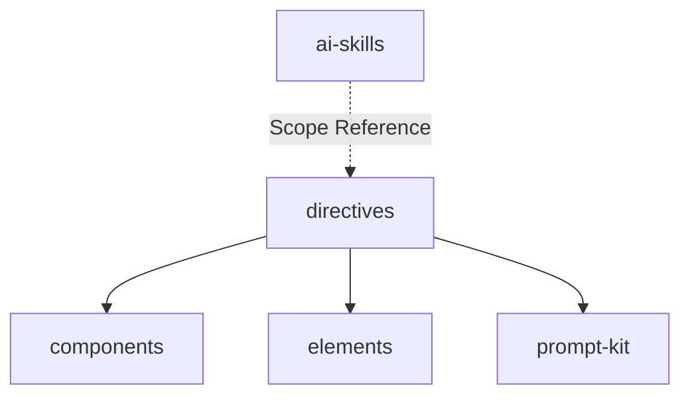

# Module: directives

<!--SECTION:MODULE_VISION-->

## 1. Module Vision

Готовые TSX-директивы — пилотные порты существующих XML-директив на JSX. Каждая директива — композиция из elements + components + prompt-kit-примитивов. Верифицируется через `verifyDirective`: рендер в HTML → `git diff` против XML-оригинала.

Содержит утилиты `renderDirective` и `verifyDirective` для рендера и проверки.

[Scope spec → `../../ai-tsx.spec.md`](../../ai-tsx.spec.md)

<!--/SECTION:MODULE_VISION-->

<!--SECTION:MODULE_USAGE_EXAMPLE-->

## 2. Module Usage Example

```tsx
import { TypeScriptCodingRules } from 'gennady/ai-tsx/directives';
import { renderDirective, verifyDirective } from 'gennady/ai-tsx';

// Рендер директивы в HTML
const html = renderDirective(TypeScriptCodingRules, 'xml');

// Верификация против оригинала
const result = verifyDirective(
  'ai-tsx/directives/typescript-coding-rules.tsx',
  'ai/directives/coding/typescript-rules.xml'
);
// → { match: true } | { match: false, diff: '...' }
```

<!--/SECTION:MODULE_USAGE_EXAMPLE-->

<!--SECTION:ENTITY_INVENTORY-->

## 3. Entity Inventory (Closed-World)

_Это полный список сущностей модуля. Любое введение сущности execution-агентом помимо этого списка считается drift'ом и требует обновления spec._

| Name                    | Surface | Type      | Purpose                                                       |
| ----------------------- | ------- | --------- | ------------------------------------------------------------- |
| `TypeScriptCodingRules` | 🟢      | Directive | TSX-версия `ai/directives/coding/typescript-rules.xml`        |
| `NodeTestRules`         | 🟢      | Directive | TSX-версия `ai/directives/testing/node-test.xml`              |
| `renderDirective`       | 🟢      | Utility   | Обёртка над `renderPrompt`, возвращает HTML-строку            |
| `verifyDirective`       | 🟢      | Utility   | Рендерит TSX → сравнивает с оригинальным XML через `git diff` |

<!--/SECTION:ENTITY_INVENTORY-->

<!--SECTION:ENTITY_SURFACES-->

## 4. Entity Surfaces

### `TypeScriptCodingRules`

- **Type:** Directive
- **Purpose:** TSX-версия правил TypeScript. Композиция из elements + components + prompt-kit.
- **Public Properties:** N/A — JSX-дерево
- **Public Operations:** N/A
- **Lifecycle:** Stateless. Константа на уровне модуля.
- **Events Emitted:** N/A
- **Errors & Degradation:** N/A
- **Consumers:**
  - Internal: тесты (`verifyDirective`)
  - External: ai-skills (рендер для агентов)

### `NodeTestRules`

- **Type:** Directive
- **Purpose:** TSX-версия правил node:test.
- **Public Properties:** N/A
- **Consumers:**
  - Internal: тесты
  - External: ai-skills

### `renderDirective`

- **Type:** Utility
- **Purpose:** Обёртка над prompt-kit `renderPrompt`. Принимает JSX-дерево, возвращает HTML-строку.
- **Public Properties:** N/A
- **Public Operations:** `renderDirective(tree, 'xml') → string`
- **Lifecycle:** Stateless.
- **Events Emitted:** N/A
- **Errors & Degradation:** Ошибка в компоненте → `Error` с `[ai-tsx]` префиксом и `cause`.
- **Consumers:**
  - Internal: `verifyDirective`, тесты
  - External: скрипты, ai-skills

### `verifyDirective`

- **Type:** Utility
- **Purpose:** Рендерит TSX-директиву → сравнивает с оригинальным XML через `git diff --no-index`.
- **Public Properties:** N/A
- **Public Operations:** `verifyDirective(tsxPath, originalXmlPath) → VerifyResult`
- **Lifecycle:** Stateless.
- **Events Emitted:** N/A
- **Errors & Degradation:** Файл не найден → `Error`. Не нулевой exit code git → `{ match: false, diff }`.
- **Consumers:**
  - Internal: тесты директив
  - External: CI

<!--/SECTION:ENTITY_SURFACES-->

<!--SECTION:MODULE_CONTRACTS-->

## 5. Module Contracts (DbC)

### Module-level invariants

- Каждая директива — JSX-дерево. Корень — `Prompt` из prompt-kit с пропсами `keywords` и `is`.
- `verifyDirective` проверяет идентичность вывода оригиналу. Расхождение → `{ match: false, diff }`.
- `renderDirective` синхронный, stateless.
- Имена файлов: lower-case.

### `renderDirective`

- **Preconditions:** `tree` — валидное JSX-дерево или функция-компонент. `format` — `'xml'`.
- **Postconditions:** Возвращает HTML-строку. Ошибка в компоненте → `Error` с `[ai-tsx]` префиксом и `cause`.
- **Invariants:** Не модифицирует входное дерево. Не имеет сайд-эффектов. Делегирует рендер в prompt-kit.

### `verifyDirective`

- **Preconditions:** `tsxPath` и `originalXmlPath` — существующие файлы.
- **Postconditions:** `match: true` когда `git diff --no-index` пуст. Иначе `match: false` с diff-строкой.
- **Invariants:** Не модифицирует файлы. Вызывает `renderDirective` → временный файл → `git diff --no-index` → удаляет временный.

<!--/SECTION:MODULE_CONTRACTS-->

<!--SECTION:PUBLIC_OPTIONS-->

## 6. Public Options & Policies

N/A — модуль не имеет публичных опций.

<!--/SECTION:PUBLIC_OPTIONS-->

<!--SECTION:FILE_STRUCTURE-->

## 7. File Structure

```
directives/
├── typescript-coding-rules.tsx
├── node-test-rules.tsx
├── index.ts
└── __tests__/
    ├── typescript-coding-rules.test.ts
    ├── node-test-rules.test.ts
    └── fixtures/
        ├── typescript-coding-rules/    (input.tsx)
        └── node-test-rules/            (input.tsx)

ai-tsx/
├── render-directive.ts
├── verify-directive.ts
└── __tests__/
    ├── render-directive.test.ts
    └── verify-directive.test.ts
```

**File Mapping:**

- `directives/typescript-coding-rules.tsx`: `TypeScriptCodingRules`
- `directives/node-test-rules.tsx`: `NodeTestRules`
- `render-directive.ts`: `renderDirective`
- `verify-directive.ts`: `verifyDirective`
- `directives/index.ts`: агрегирующий экспорт (директивы + утилиты)

<!--/SECTION:FILE_STRUCTURE-->

<!--SECTION:MODULE_DECISION_LOG-->

## 8. Module Decision Log

_Пусто — решения уровня scope зафиксированы в scope-спеке._

<!--/SECTION:MODULE_DECISION_LOG-->

<!--SECTION:INTER_MODULE_DEPENDENCIES-->

## 9. Inter-Module Dependencies

- **Depends on:** `components` (CodePatternsBlock, AntiPatternsBlock, ...), `elements` (Pattern, Snippet, ...), prompt-kit (Prompt, BeliefState, Axiom, Group, Node, ...)
- **Scope Reference (cross-scope):** N/A
- **Provides to:** ai-skills (готовые директивы для рендера)



<!--/SECTION:INTER_MODULE_DEPENDENCIES-->

<!--SECTION:HANDOFF-->

## 10. Handoff to task scaffolding

- **Implementation files to be created:**
  - `render-directive.ts`, `verify-directive.ts`, `index.ts`
  - `directives/typescript-coding-rules.tsx`, `directives/node-test-rules.tsx`, `directives/index.ts`
- **Test files to be created:**
  - `__tests__/render-directive.test.ts`, `__tests__/verify-directive.test.ts`
  - `directives/__tests__/typescript-coding-rules.test.ts`, `directives/__tests__/node-test-rules.test.ts`
- **Fixture test files:** директивы проверяются через `verifyDirective` против оригинального `.xml` файла.

  Структура: `directives/__tests__/fixtures/<case-name>/`

  ```
  <case-name>/
  └── input.tsx            # импорт и рендер директивы
  ```

  Ожидаемый вывод — содержимое соответствующего `ai/directives/**/*.xml`. Сравнение через `git diff`.

  _Критические кейсы:_
  - `typescript-coding-rules` — проверка через verifyDirective против `ai/directives/coding/typescript-rules.xml`
  - `node-test-rules` — проверка против `ai/directives/testing/node-test.xml`

- **Stack dependencies:**
  - Language: `TypeScript` (resolves to `ai/directives/coding/typescript-rules.xml`)
  - Test framework: `node:test` (resolves to `ai/directives/testing/node-test.xml`)
- **Module Rules Additions:** None
- **Open risks & validation needs:**
  - prompt-kit XML-formatter может требовать флага `raw` для неэкранирования энтити
  - `git diff` может показывать controlled расхождения (whitespace, attribute order) — решение: fix formatter или accept
  - Пилот — две директивы. Остальные 30+ отложены до v2

<!--/SECTION:HANDOFF-->

## Critic Rounds

_Ожидает первого раунда._
