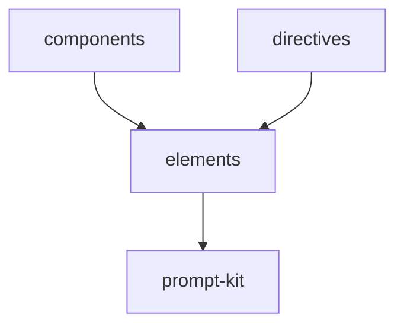

# Module: elements

<!--SECTION:MODULE_VISION-->

## 1. Module Vision

Типизированные `definePromptElement`-элементы для структур директив. Каждый элемент — результат фабрики prompt-kit с предопределённой ролью и пропсами. Семантические блоки, из которых собираются композитные шаблоны и директивы.

[Scope spec → `../../ai-tsx.spec.md`](../../ai-tsx.spec.md)

<!--/SECTION:MODULE_VISION-->

<!--SECTION:MODULE_USAGE_EXAMPLE-->

## 2. Module Usage Example

```tsx
import { Pattern, Snippet } from 'gennady/ai-tsx/elements';
import { Node } from 'gennady/prompt-kit';

const block = (
  <Pattern id="PT_EXAMPLE">
    <Node is="Intent">Exported data shape with domain prefix.</Node>
    <Snippet language="typescript">{`export type Foo = { id: string }`}</Snippet>
    <Node is="Why">Data shape with no runtime behavior → type + @purpose.</Node>
  </Pattern>
);
```

<!--/SECTION:MODULE_USAGE_EXAMPLE-->

<!--SECTION:ENTITY_INVENTORY-->

## 3. Entity Inventory (Closed-World)

_Это полный список сущностей модуля. Любое введение сущности execution-агентом помимо этого списка считается drift'ом и требует обновления spec._

| Name | Surface | Type | Purpose |
|---|---|---|---|
| `Pattern` | 🟢 | Element | Контейнер паттерна с обязательным `id`. Содержит Intent + Snippet + Why |
| `Snippet` | 🟢 | Element | Блок кода без markdown-фенсов. Роль `block`. Пропс `language?` |
| `Hook` | 🟢 | Element | Контейнер хука с обязательным `id`. Содержит Purpose + Command + Expected |
| `AntiPattern` | 🟢 | Element | Контейнер анти-паттерна с обязательным `id`. Содержит Bad + WhyBad + Good |
| `Good` | 🟢 | Element | Блок правильного кода. Роль `block`. Пропс `language?` |
| `Definition` | 🟢 | Element | Контейнер определения с обязательным `id` |

<!--/SECTION:ENTITY_INVENTORY-->

<!--SECTION:ENTITY_SURFACES-->

## 4. Entity Surfaces

### `Pattern`

- **Type:** Element
- **Purpose:** Контейнер паттерна кода. Оборачивает Intent + Snippet + Why.
- **Public Properties:** `id: string`
- **Public Operations:** N/A — JSX-элемент
- **Lifecycle:** Stateless. Создаётся через `definePromptElement` при импорте.
- **Events Emitted:** N/A
- **Errors & Degradation:** N/A
- **Consumers:**
  - Internal: `components/`, `directives/`
  - External: пользовательский код

### `Snippet`

- **Type:** Element
- **Purpose:** Блок кода без markdown-фенсов. В HTML: `<Snippet language="ts">код</Snippet>`. В MD: ` ```ts\nкод\n``` `.
- **Public Properties:** `language?: string`
- **Public Operations:** N/A
- **Lifecycle:** Stateless.
- **Events Emitted:** N/A
- **Errors & Degradation:** N/A
- **Consumers:**
  - Internal: `Pattern` (как child), `components/`, `directives/`
  - External: пользовательский код

### `Hook`

- **Type:** Element
- **Purpose:** Контейнер верификационного хука. Оборачивает Purpose + Command + Expected.
- **Public Properties:** `id: string`
- **Public Operations:** N/A
- **Lifecycle:** Stateless.
- **Events Emitted:** N/A
- **Errors & Degradation:** N/A
- **Consumers:**
  - Internal: `components/`, `directives/`
  - External: пользовательский код

### `AntiPattern`

- **Type:** Element
- **Purpose:** Контейнер анти-паттерна. Оборачивает Bad + WhyBad + Good.
- **Public Properties:** `id: string`
- **Public Operations:** N/A
- **Lifecycle:** Stateless.
- **Events Emitted:** N/A
- **Errors & Degradation:** N/A
- **Consumers:**
  - Internal: `components/`, `directives/`
  - External: пользовательский код

### `Good`

- **Type:** Element
- **Purpose:** Блок правильного кода (внутри AntiPattern). Роль `block`.
- **Public Properties:** `language?: string`
- **Public Operations:** N/A
- **Lifecycle:** Stateless.
- **Events Emitted:** N/A
- **Errors & Degradation:** N/A
- **Consumers:**
  - Internal: `AntiPattern` (как child)
  - External: пользовательский код

### `Definition`

- **Type:** Element
- **Purpose:** Контейнер определения с идентификатором.
- **Public Properties:** `id: string`
- **Public Operations:** N/A
- **Lifecycle:** Stateless.
- **Events Emitted:** N/A
- **Errors & Degradation:** N/A
- **Consumers:**
  - Internal: `components/`, `directives/`
  - External: пользовательский код

<!--/SECTION:ENTITY_SURFACES-->

<!--SECTION:MODULE_CONTRACTS-->

## 5. Module Contracts (DbC)

### Module-level invariants

- Все элементы созданы через `definePromptElement` из prompt-kit. Роль предопределена.
- `Pattern`, `Hook`, `AntiPattern`, `Definition` — роль `section`. `includeBoundaryComments: true`.
- `Snippet`, `Good` — роль `block`. Содержимое без markdown-фенсов. Фенсы добавляются форматтером только в MD.
- Имена элементов — PascalCase. Не конфликтуют с HTML-тегами (lowercase).
- `id` пропс обязателен для `Pattern`, `Hook`, `AntiPattern`, `Definition`.
- `language` пропс опционален для `Snippet`, `Good`.

<!--/SECTION:MODULE_CONTRACTS-->

<!--SECTION:PUBLIC_OPTIONS-->

## 6. Public Options & Policies

N/A — модуль не имеет публичных опций.

<!--/SECTION:PUBLIC_OPTIONS-->

<!--SECTION:FILE_STRUCTURE-->

## 7. File Structure

```
elements/
├── pattern.ts
├── snippet.ts
├── hook.ts
├── anti-pattern.ts
├── good.ts
├── definition.ts
├── index.ts
└── __tests__/
    ├── pattern.test.ts
    ├── snippet.test.ts
    ├── hook.test.ts
    ├── anti-pattern.test.ts
    ├── good.test.ts
    ├── definition.test.ts
    └── fixtures/
        ├── pattern-basic/      (input.tsx, expected.html, expected.md)
        ├── snippet-code/
        ├── hook-basic/
        ├── anti-pattern-basic/
        ├── good-code/
        └── definition-basic/
```

**File Mapping:**
- `pattern.ts`: `Pattern`
- `snippet.ts`: `Snippet`
- `hook.ts`: `Hook`
- `anti-pattern.ts`: `AntiPattern`
- `good.ts`: `Good`
- `definition.ts`: `Definition`
- `index.ts`: агрегирующий экспорт

<!--/SECTION:FILE_STRUCTURE-->

<!--SECTION:MODULE_DECISION_LOG-->

## 8. Module Decision Log

_Пусто — решения уровня scope зафиксированы в scope-спеке._

<!--/SECTION:MODULE_DECISION_LOG-->

<!--SECTION:INTER_MODULE_DEPENDENCIES-->

## 9. Inter-Module Dependencies

- **Depends on:** prompt-kit (core — `definePromptElement`)
- **Scope Reference (cross-scope):** N/A
- **Provides to:** `components`, `directives`



<!--/SECTION:INTER_MODULE_DEPENDENCIES-->

<!--SECTION:HANDOFF-->

## 10. Handoff to task scaffolding

- **Implementation files to be created:** `elements/pattern.ts`, `elements/snippet.ts`, `elements/hook.ts`, `elements/anti-pattern.ts`, `elements/good.ts`, `elements/definition.ts`, `elements/index.ts`
- **Test files to be created:** `elements/__tests__/pattern.test.ts`, `elements/__tests__/snippet.test.ts`, `elements/__tests__/hook.test.ts`, `elements/__tests__/anti-pattern.test.ts`, `elements/__tests__/good.test.ts`, `elements/__tests__/definition.test.ts`
- **Fixture test files:** по одному на каждый элемент.

  Структура: `elements/__tests__/fixtures/<case-name>/`

  ```
  <case-name>/
  ├── input.tsx            # JSX с элементом
  ├── expected.html        # ожидаемый HTML
  └── expected.md          # ожидаемый Markdown
  ```

  _Критические кейсы:_
  - `pattern-basic` — Pattern с id, Intent + Snippet + Why
  - `snippet-code` — Snippet с language, код внутри
  - `snippet-no-lang` — Snippet без language
  - `hook-basic` — Hook с id, Purpose + Command + Expected
  - `anti-pattern-basic` — AntiPattern с id, Bad + WhyBad + Good
  - `good-code` — Good с language
  - `definition-basic` — Definition с id и текстом

- **Stack dependencies:**
  - Language: `TypeScript` (resolves to `ai/directives/coding/typescript-rules.xml`)
  - Test framework: `node:test` (resolves to `ai/directives/testing/node-test.xml`)
- **Module Rules Additions:** None
- **Open risks & validation needs:** prompt-kit XML-formatter может требовать флага для неэкранирования энтити

<!--/SECTION:HANDOFF-->

## Critic Rounds

_Ожидает первого раунда._

