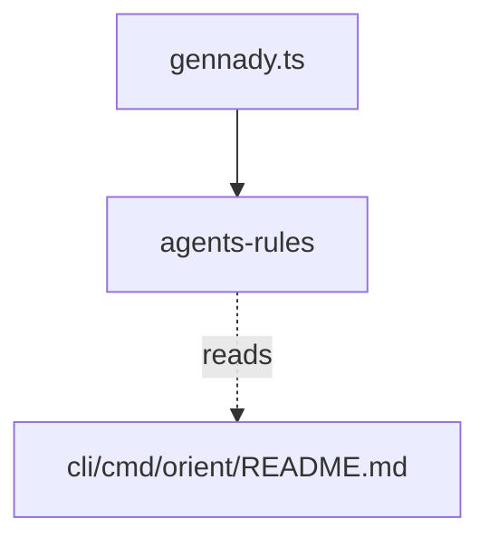

# Module: agents-rules

## 1. Module Vision

Команда `gennady agents-rules` выводит на stdout markdown-инструкцию по использованию `orient` для AI-агентов. Агент запускает команду, читает вывод, переосмысливает под свою задачу и интегрирует в `AGENTS.md`. Контент — `cli/cmd/orient/README.md` из пакета gennady. Zero runtime dependencies (только Node.js built-in).

→ Parent scope: [`../cli.spec.md`](../cli.spec.md) (раздел 5.10 agents-rules). Спецификация контента README.md → parent §3.7 Golden DX.

## 2. Entity Inventory (Closed-World)

_Это полный список сущностей модуля. Любое введение сущности execution-агентом помимо этого списка считается drift'ом и требует обновления spec._

| Name                 | Type    | Purpose                                                                                                                          |
| -------------------- | ------- | -------------------------------------------------------------------------------------------------------------------------------- |
| `AgentsRulesCommand` | Command | Точка входа: проверяет `node_modules/gennady/`, читает `cli/cmd/orient/README.md` через `import.meta.resolve`, выводит на stdout |

## 3. Entity Surfaces

### `AgentsRulesCommand`

- **Type:** Command
- **Purpose:** Выводит agent-facing документацию по orient на stdout
- **Public Properties:** N/A (свой CLI-процесс)
- **Public Operations:**
  - `run(argv: string[]): Promise<void>` — главная точка входа. `argv` — стандартная сигнатура для dispatch-совместимости со всеми CLI-командами; содержимое игнорируется. Проверяет `<cwd>/node_modules/gennady/` → резолвит `README.md` → `console.log(содержимое)`
- **Lifecycle:** Запускается один раз через `gennady agents-rules → import('./cmd/agents-rules/index.ts')`. Выполняется синхронно, завершается `process.exit(0)` или `process.exit(1)`
- **Events Emitted:** N/A
- **Errors & Degradation:**
  - `node_modules/gennady/` не найден → `console.error('gennady package not found. Install it locally: npm i -D gennady')` + `process.exit(1)`
  - `README.md` не найден → `console.error('README.md not found at <path>')` + `process.exit(1)`
  - Ошибка чтения (EACCES) → `console.error('Cannot read README.md: <message>')` + `process.exit(1)`
- **Consumers:**
  - Internal: `cli/gennady.ts` (dispatch)
  - External: AI-агенты (через CLI)

## 4. Module Contracts (DbC)

### 4.1 Ports

None.

### 4.2 Command: `AgentsRulesCommand`

- **Purpose:** Генерация agent-facing документации по orient
- **Consumers:**
  - Internal: `cli/gennady.ts`
  - External: AI-агенты
- **Supporting Artifacts:**
  - `cli/cmd/orient/README.md` — канонический источник контента (markdown)
- **Runtime Backing:** `real-runtime`
- **Verification Levels:** `integration`
- **Deferred Runtime Scope:** None

**Contract (DbC):**

- **Preconditions:**
  - `<cwd>/node_modules/gennady/` существует (пакет установлен)
  - `cli/cmd/orient/README.md` существует в пакете gennady
- **Postconditions:**
  - Содержимое `README.md` выведено на stdout как есть
  - Exit code 0
- **Side Effects:**
  - `console.log(content)` — вывод в stdout
  - `console.error(message)` — ошибки в stderr
- **Invariants:**
  - Никогда не модифицирует файловую систему
  - Никогда не делает сетевых запросов
  - Вывод всегда markdown (содержимое README.md)

## 5. Public Options & Policies

| Option | Binding | Status |
| ------ | ------- | ------ |
| None   | —       | —      |

No options. One entry point: `gennady agents-rules`. No flags, no arguments.

## 6. File Structure

```
cli/cmd/agents-rules/
├── index.ts                  # import { run } from './agents-rules.cmd.ts'; run(process.argv)
├── agents-rules.cmd.ts       # AgentsRulesCommand (~40 строк)
└── __tests__/
    └── agents-rules.cmd.test.ts  # Integration: mock fs.existsSync + fs.readFileSync

cli/cmd/orient/
└── README.md                 # Канонический контент (markdown)
```

**File Mapping:**

| File                                       | Component            | Notes                                                                                                     |
| ------------------------------------------ | -------------------- | --------------------------------------------------------------------------------------------------------- |
| `cli/cmd/agents-rules/index.ts`            | Entry point          | `import { run } from './agents-rules.cmd.ts'; run(process.argv)`                                          |
| `cli/cmd/agents-rules/agents-rules.cmd.ts` | `AgentsRulesCommand` | Проверка `fs.existsSync(cwd + '/node_modules/gennady')` → `import.meta.resolve` → `readFileSync` → stdout |
| `cli/cmd/orient/README.md`                 | Source content       | Markdown: таблица «когда использовать», примеры, инструкция. Разработчик обновляет вручную                |

**Limits:** `agents-rules.cmd.ts` ≤ 40 строк. Портов/адаптеров нет — один implementation.

## 7. Module Decision Log

### D-M001 — README.md как источник контента (не хардкод)

- **Status:** active
- **Recorded:** session ModuleDecomposition, cli, agents-rules
- **Why:** Контент живёт в `cli/cmd/orient/README.md` — единый источник правды. GitHub рендерит его в директории orient, человек видит. Команда `agents-rules` читает тот же файл — агент получает актуальный контент. Нет дублирования.
- **Risk accepted:** При изменении `README.md` без обновления команды — риск отсутствует (команда читает файл динамически). При удалении/переименовании `README.md` — команда сломается (exit 1 с читаемым сообщением).
- **Rejected alternatives:**
  - Хардкод контента в `agents-rules.cmd.ts` — дублирование, дрифт между кодом и документацией
  - Хранение контента вне `orient/` — теряется связность; `README.md` логически принадлежит orient

### D-M002 — Проверка `node_modules/gennady` перед чтением

- **Status:** active
- **Recorded:** session ModuleDecomposition, cli, agents-rules
- **Why:** Команда зависит от наличия установленного пакета gennady. Проверка на старте даёт читаемое сообщение (`npm i -D gennady`) вместо загадочного `ENOENT`.
- **Risk accepted:** `fs.existsSync` — синхронный вызов на старте (~0.1ms). Не влияет на производительность.
- **Rejected alternatives:**
  - Пропустить проверку — агент получит `ENOENT` без объяснения как исправить
  - Проверять через `import.meta.resolve` напрямую — может резолвить глобальный пакет даже без локальной установки

## 8. Inter-Module Dependencies

- **Depends on:** None (не зависит от других модулей cli)
- **Scope Reference (cross-scope):** [`infra-base`](../../infra-base/infra-base.spec.md) — Node.js 22+, TypeScript, node:test, Vite
- **Provides to:** `cli/gennady.ts` (dispatch), AI-агенты (через CLI)



## 9. Handoff to Task Scaffolding

- **Implementation files to be created:**
  - `cli/cmd/agents-rules/index.ts`
  - `cli/cmd/agents-rules/agents-rules.cmd.ts`
- **Content files to be created:**
  - `cli/cmd/orient/README.md` — markdown-инструкция по orient
- **Test files to be created:**
  - `cli/cmd/agents-rules/__tests__/agents-rules.cmd.test.ts` — integration: mock `fs.existsSync` + `fs.readFileSync`
- **Files to modify:**
  - `cli/gennady.ts` — + `case 'agents-rules'` в switch + `case 'agents-rules'` в per-command help блок
  - `cli/AGENTS.md` — + строка `agents-rules` в таблицу команд
  - `cli/cmd/help/help.cmd.ts` — + строка `agents-rules` в вывод
- **Stack dependencies:**
  - Language: TypeScript (resolves to `ai/directives/coding/typescript-rules.xml`)
  - Test framework: node:test (resolves to `ai/directives/testing/node-test.xml`)
- **Module Rules Additions:** None (scope-wide baseline достаточен)

- **Open risks & validation needs:**
  - `README.md` — статический контент. При изменении orient (новые сценарии/флаги) разработчик должен вручную обновить `README.md`
  - `import.meta.resolve('gennady')` — поведение в разных рантаймах (npx vs глобальная vs локальная установка) требует проверки. Смягчается pre-check'ом (`fs.existsSync`), который гарантирует локальную установку; variance benign — контент статический
  - Интеграционный тест должен мокать `fs.existsSync` и `fs.readFileSync` для изоляции от реальной FS

## Critic Rounds

### Round 1 — 2026-05-31

- **Verdict:** NEEDS_WORK
- **Accepted:** 1 — "Test files not in §9 Handoff" → added `__tests__/agents-rules.cmd.test.ts` to §9
- **Rejected:** 4 — "Error paths not in parent FR" (minor, parent can tighten later), "import.meta.resolve ambiguity" (acknowledged risk, pre-check mitigates), "No README.md content spec" (command treats README as opaque; informational), "run(argv) signature" (trivial, §5 makes intent clear)
- **Changes:** Added test file path to §9 Handoff

### Round 2 — 2026-05-31

- **Verdict:** CLEAN
- **Accepted:** 1 — "§6 tree omits **tests**/ dir" → added **tests**/ to file structure tree
- **Rejected:** 0
- **Changes:** Added `__tests__/` → `agents-rules.cmd.test.ts` to §6 File Structure tree
