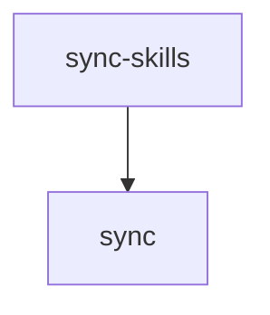

# Tasks: cli

## Scope Spec

- [Scope spec](./cli.spec.md)

## Cascade Table

<!-- ЗАПОЛНЯЕТ АГЕНТ: действующие правила scope из Scope Graph (транзитивное замыкание depends-on). -->

## Inter-Module DAG

## Tracker

| Task-ID      | Title                                                                | Module       | Dependencies                            | Status   | Reopens |
| ------------ | -------------------------------------------------------------------- | ------------ | --------------------------------------- | -------- | ------- |
| AR-command   | Реализовать agents-rules                                             | agents-rules | —                                       | [ ] TODO | —       |
| CAT-mr-url   | cat --url: поддержка GitLab MR / GitHub PR                           | cat          | VC-github                               | [ ] TODO | —       |
| CLI-alt-core | AltOpinion Core (types + parser + runner)                            | —            | —                                       | [x] DONE | —       |
| CLI-alt-cli  | AltOpinion CLI (cmd + prompts + registration)                        | —            | CLI-alt-core                            | [x] DONE | —       |
| CLI-alt-test | AltOpinion Tests (parser + runner + integration)                     | —            | CLI-alt-core, CLI-alt-cli               | [x] DONE | —       |
| CLI-alt-tele | AltOpinion Telemetry                                                 | —            | CLI-alt-core, CLI-alt-cli, CLI-alt-test | [x] DONE | —       |
| CLI-approve  | Команда vcs-approve                                                  | —            | VC-approve, CLI-vcs-ctx                 | [ ] TODO | —       |
| CLI-revoke   | vcs-approve --revoke (unapprove)                                     | —            | VC-unappr                               | [ ] TODO | —       |
| CLI-vcs-ctx  | vcs-context-resolver: унифицированный резолв VCS-контекста           | —            | —                                       | [ ] TODO | —       |
| CLI-diff     | vcs-diff CLI (getChanges)                                            | —            | —                                       | [x] DONE | —       |
| CLI-discuss  | CLI команда vcs-discussions                                          | —            | —                                       | [ ] TODO | —       |
| CLI-reg-vcs  | Интеграция: регистрация команд в gennady.ts + help + README          | —            | CLI-mrcreate, CLI-mr-edit, CLI-discuss  | [ ] TODO | —       |
| CLI-draft    | —                                                                    | —            | —                                       | [ ] TODO | —       |
| CLI-jobs     | vcs-job + vcs-job-log CLI                                            | —            | VC-jobs                                 | [ ] TODO | —       |
| CLI-mrcreate | CLI команда vcs-mr-create                                            | —            | VMM-core, VMM-glcreate                  | [ ] TODO | —       |
| CLI-mr-edit  | CLI команда vcs-mr-edit                                              | —            | VMM-core, VMM-glcreate                  | [ ] TODO | —       |
| CLI-pipeline | vcs-pipeline CLI                                                     | —            | VC-pipeline                             | [ ] TODO | —       |
| CLI-vcs-use  | Рефакторинг VCS-команд на vcs-context-resolver                       | —            | CLI-vcs-ctx                             | [ ] TODO | —       |
| CLI-noteedit | vcs-reply edit/delete + review-issues noteId                         | —            | VC-noteedit                             | [ ] TODO | —       |
| CLI-reopen   | vcs-reply: resolve/reopen discussion через stdin JSON                | —            | VC-resolve                              | [ ] TODO | —       |
| CLI-suggest  | vcs-reply suggestion блоки                                           | —            | —                                       | [x] DONE | —       |
| CLI-todo     | vcs-todo CLI                                                         | —            | VC-todos                                | [ ] TODO | —       |
| CLI-deplinks | vcs-worktree: детерминированный симлинкинг зависимостей (FR-WT-07)   | —            | —                                       | [ ] TODO | —       |
| CLI-submods  | vcs-worktree: git submodule update --init --recursive (FR-WT-08)     | —            | CLI-deplinks                            | [ ] TODO | —       |
| E2E-harness  | E2E-тестирование CLI-команд через npm pack                           | e2e          | —                                       | [ ] TODO | —       |
| LIN-types    | Типы: LintError, LintOptions, LintReport, коды ошибок                | lint         | —                                       | [x] DONE | —       |
| LIN-headers  | FileHeaderCheck                                                      | lint         | LIN-types                               | [x] DONE | —       |
| LIN-anchors  | AnchorCheck                                                          | lint         | LIN-types                               | [x] DONE | —       |
| LIN-dbc      | DbcContractCheck                                                     | lint         | LIN-types, DL-content                   | [x] DONE | —       |
| LIN-command  | LintCommand + регистрация в gennady.ts                               | lint         | LIN-headers, LIN-anchors, LIN-dbc       | [x] DONE | —       |
| LIN-unit     | Тесты: проверки + интеграционные                                     | lint         | LIN-command                             | [x] DONE | —       |
| LIN-e2e      | Интеграционные тесты CLI команды lint                                | lint         | LIN-unit                                | [x] DONE | —       |
| LIN-language | LanguageCheck: проверка языка (English-only) в контрактах и хедерах  | lint         | LIN-command                             | [x] DONE | —       |
| LIN-targets  | resolveTargets() + интеграция в LintCommand                          | lint         | LIN-command                             | [ ] TODO | —       |
| LIN-dir-test | Тесты resolveTargets + интеграционные тесты директорий               | lint         | LIN-targets                             | [ ] TODO | —       |
| LIN-disable  | Implement DisablesCheck (TypeScript/Linter disable discipline)       | lint         | LIN-dir-test                            | [x] DONE | —       |
| LIN-purpose  | DisablesCheck: enforce purpose text (D-007 contract tightening)      | lint         | LIN-disable                             | [x] DONE | —       |
| ORI-command  | Команда orient: навигация по file-header и DBC-контрактам            | orient       | —                                       | [ ] TODO | —       |
| RUN-command  | gennady run command                                                  | run          | COR-model                               | [ ] TODO | —       |
| SS-command   | sync-skills command (типы, ядро, форматтер, CLI, тесты, регистрация) | sync-skills  | SYN-shared                              | [ ] TODO | —       |
| SS-skills    | ai/skills bootstrap (13 SDD-скилов)                                  | sync-skills  | SS-command                              | [ ] TODO | —       |
| SYN-shared   | Extract shared sync core + refactor sync                             | sync         | SYN-command, SYN-tests                  | [ ] TODO | —       |
| SYN-command  | Sync Core + CLI (типы, ядро, форматтер, обвязка, регистрация)        | sync         | INP-rel-cmd, INP-pack-ai                | [ ] TODO | —       |
| SYN-tests    | Sync Tests (core, formatter, integration)                            | sync         | SYN-command                             | [ ] TODO | —       |
| TES-tree     | testcov: port coverage-tree as gennady CLI command                   | testcov      | parse-args                              | [ ] TODO | —       |
| UC-semver    | Fix: downgrade notification + --version flag                         | update-check | UC-notify, UC-tests                     | [ ] TODO | —       |
| UC-notify    | Bootstrap + Impl: update-check механизм                              | update-check | —                                       | [ ] TODO | —       |
| UC-tests     | Tests: update-check (unit + integration)                             | update-check | UC-notify                               | [ ] TODO | —       |

## Decision Log (scope task level)

<!-- <ACR>-DL-N scope-уровневых решений декомпозиции/планирования. -->
