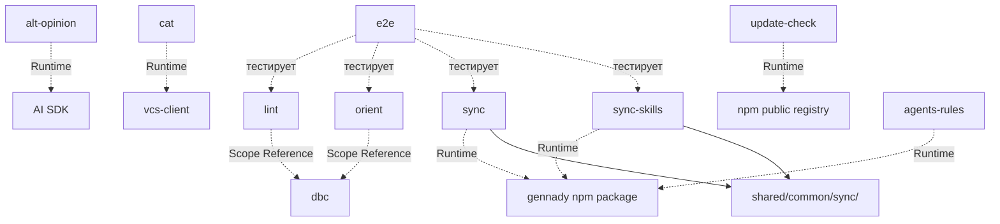

# cli: Scope Specification

## scope-type

product

## 1. Vision & Primary Goal

CLI-модуль с командами для AI-агентов. Команды: `lint` (трёхслойная валидация TypeScript-файлов и директорий с рекурсивным обходом), `alt-opinion` (альтернативные мнения от AI-моделей на переданный артефакт с опциональным синтезом), `cat` (сбор содержимого файлов в XML/MD для AI-агентов с поддержкой локальных файлов и удалённых через `--url`), `sync` (синхронизация `ai/directives/` из npm-пакета в текущий проект), `sync-skills` (синхронизация SDD-скилов из npm-пакета в `.claude/skills/` проекта с orphan-удалением), `orient` (ориентация по file-header и DBC-контрактам — карта проекта, поиск по задачам, потребителям, сущностям и ключевым словам, граф зависимостей), `agents-rules` (выводит инструкцию по использованию `orient` для AI-агентов — когда и какую команду вызывать для навигации по репозиторию).

## 2. Project Type

- **Type:** cli-utility
- **Why this type:** Набор CLI-команд, запускаемых через `gennady <command>`. Вход — аргументы командной строки, выход — stdout/stderr + exit code. Без UI, без сервера.

## 3. Approved Golden DX Example

```bash
# --- версия ---
$ gennady --version
0.8.1

$ gennady -v
0.8.1

# --- happy path: всё чисто ---
$ gennady lint services/dbc/linter/dbc-linter.types.ts

# exit 0, stdout пуст

# --- ошибки: file header, контракты, anchors ---
$ gennady lint services/dbc/parser/dbc-parser.types.ts src/foo.ts

services/dbc/parser/dbc-parser.types.ts:1:1: error: ERR_CLI_LINT_MISSING_CONSUMERS  File header missing // @consumers:. Add // @consumers: <ConsumerName> before the first import.
src/foo.ts:5:3: error: ERR_DBC_LINT_MISSING_CONTRACT  Entity 'bar' has no JSDoc contract. Add /** @purpose ... */ before the exported entity.
src/foo.ts:12:1: error: ERR_CLI_LINT_ANCHOR_NESTING  END_CHECKOUT at line 12 closes parent, but START_PAYMENT at line 8 is still open. Close START_PAYMENT first.
src/foo.ts:18:1: error: ERR_CLI_LINT_ANCHOR_UNPAIRED_START  START_RETRY at line 18 has no matching END_RETRY. Add // #endregion END_RETRY.

# exit 1

# --- линтинг директории (рекурсивно, .ts + .tsx) ---
$ gennady lint services/dbc/

# exit 0

# --- смешанный ввод: файлы + директории ---
$ gennady lint src/foo.ts services/ cli/cmd/

# exit 0

# --- autofix: исправляем что можно, остаток показываем ---
$ gennady lint --autofix services/dbc/parser/dbc-parser.types.ts

Auto-fixed: 3 error(s)
services/dbc/parser/dbc-parser.types.ts:1:1: error: ERR_CLI_LINT_MISSING_CONSUMERS  File header missing // @consumers:. Add // @consumers: <ConsumerName> before the first import.

# exit 1 (одна ошибка осталась после autofix)

# --- git-режим: все изменённые/новые .ts файлы ---
$ gennady lint --staged

# exit 0

# --- комбинированный ---
$ gennady lint --staged --autofix

# --- ошибка: --staged + позиционные цели взаимоисключающие ---
$ gennady lint --staged src/foo.ts
Error: --staged and positional targets are mutually exclusive

# exit 1

# --- degradation: несуществующий путь ---
$ gennady lint src/foo.ts nonexistent/

src/foo.ts:5:3: error: ERR_DBC_LINT_MISSING_CONTRACT  Entity 'bar' has no JSDoc contract.
ERR_CLI_LINT_RESOLVE_FAILED: nonexistent/: ENOENT: no such file or directory

# exit 1 (одна ошибка линтинга + одна ошибка резолвинга)

# --- degradation: файл без прав на чтение ---
$ gennady lint src/foo.ts restricted/

ERR_CLI_LINT_RESOLVE_FAILED: restricted/: EACCES: permission denied

# exit 0 (если src/foo.ts чист) или exit 1 (если есть ошибки линтинга)
```

Файл читается один раз, контент передаётся во все три проверки. Сообщения об ошибках содержат: что сломано → указание на место → конкретное действие по исправлению. При передаче директорий — рекурсивный обход с фильтрацией по поддерживаемым расширениям (`.ts`, `.tsx`). Ошибки резолвинга целей (ENOENT, EACCES) выводятся в stderr и не прерывают линтинг остальных файлов.

### alt-opinion DX

```bash
# --- без синтеза: stdin, 2 модели → все мнения ---
$ cat specs/cli/cli.spec.md | gennady alt-opinion \
    --model="openrouter/anthropic/claude-3.5-sonnet" \
    --model="llmproxy/deepseek-v4-pro"

<!--START_ALT_OPINION_openrouter-claude-3.5-sonnet-->
### Мнение Claude 3.5 Sonnet
...
<!--END_ALT_OPINION_openrouter-claude-3.5-sonnet-->

<!--START_ALT_OPINION_llmproxy-deepseek-v4-pro-->
### Мнение DeepSeek V4 Pro
...
<!--END_ALT_OPINION_llmproxy-deepseek-v4-pro-->

# exit 0

# --- с синтезом: ТОЛЬКО синтез ---
$ gennady alt-opinion --file=task.md \
    --model="llmproxy/deepseek-v4-pro" \
    --model="openrouter/anthropic/claude-3.5-sonnet" \
    --synthModel="llmproxy/deepseek-v4-pro"

<!--START_ALT_OPINION_SYNTH-->
### Синтез
...
<!--END_ALT_OPINION_SYNTH-->

# exit 0

# --- одна модель (минимальный вызов) ---
$ gennady alt-opinion --file=task.md --model="llmproxy/deepseek-v4-pro"

# exit 0

# --- custom prompts ---
$ gennady alt-opinion --file=task.md \
    --model="openrouter/anthropic/claude-3.5-sonnet" \
    --model="llmproxy/deepseek-v4-pro" \
    --modelPrompt="./prompts/critic.prompt.md"

# exit 0

# --- per-model prompt override ---
$ gennady alt-opinion --file=task.md \
    --model="openrouter/anthropic/claude-3.5-sonnet::./prompts/architect.prompt.md" \
    --model="llmproxy/deepseek-v4-pro::./prompts/sec-auditor.prompt.md"

# exit 0

# --- degradation: модель недоступна ---
$ gennady alt-opinion --file=task.md \
    --model="llmproxy/deepseek-v4-pro" \
    --model="openrouter/nonexistent-model"

<!--START_ALT_OPINION_llmproxy-deepseek-v4-pro-->
...
<!--END_ALT_OPINION_llmproxy-deepseek-v4-pro-->

<!--START_ALT_OPINION_openrouter-nonexistent-model-->
Model error: timeout after 5m
<!--END_ALT_OPINION_openrouter-nonexistent-model-->

# exit 0 (одна модель ответила успешно, без --strict)

# --- strict mode: любая ошибка → exit 1 ---
$ gennady alt-opinion --file=task.md --strict \
    --model="llmproxy/deepseek-v4-pro" \
    --model="openrouter/nonexistent-model"

# exit 1

# --- ошибка: нет API-ключа ---
$ gennady alt-opinion --file=task.md --model="llmproxy/deepseek-v4-pro"
Error: GENNADY_LLM_PROXY_API_KEY is not set

# exit 1

# --- ошибка: и stdin, и --file ---
$ cat task.md | gennady alt-opinion --file=task.md --model="llmproxy/dsv4"
Error: --file and stdin are mutually exclusive

# exit 1
```

Модели опрашиваются параллельно (`Promise.allSettled`). При отказе модели — описание ошибки в её блоке, остальные продолжаются. `--synthModel` → вывод только синтеза (без индивидуальных мнений).

### 3.1 Update Check DX

```bash
# --- happy path: есть обновление ---
$ gennady lint src/foo.ts

# exit 0, stdout пуст (ошибок нет)

# --- после выхода процесса, в stderr: ---
╭──────────────────────────────────────────────────────────╮
│                                                          │
│   Update available: 1.2.3 → 1.3.0                       │
│   Run npm i -g gennady@latest to update.                 │
│                                                          │
╰──────────────────────────────────────────────────────────╯

# --- нет обновления: ничего не показывается ---
$ gennady lint src/foo.ts

# exit 0, stderr пуст

# --- уже проверяли сегодня: запрос не делается ---
$ gennady lint src/foo.ts

# exit 0, молча

# --- нет сети / таймаут 5с / ошибка реестра ---
$ gennady lint src/foo.ts

# exit 0, молча. Проверка просто не сработала. Не ошибка.

# --- CI-окружение: проверка не делается ---
$ CI=true gennady lint src/foo.ts

# exit 0, молча

# --- opt-out через env ---
$ GENNADY_NO_UPDATE_CHECK=1 gennady lint src/foo.ts

# exit 0, молча

# --- opt-out через флаг ---
$ gennady --no-update-check lint src/foo.ts

# exit 0, молча

# --- stdout в pipe: уведомление НЕ показывается ---
$ gennady lint src/foo.ts | tee report.txt

# exit 0, только вывод lint в stdout и файл. Без уведомления.
```

Уведомление в stderr после завершения команды, не блокирует запуск, не надоедает (раз в сутки), самоустраняется при отсутствии сети.

### 3.4 sync DX

```bash
# --- первый запуск: ai/directives/ не существует ---
$ gennady sync

Sync: /Users/user/my-project
  + ai/directives/knowledge.xml
  + ai/directives/coding/typescript-rules.xml
  + ai/directives/coding/result-conventions.xml
  + ai/directives/infra/eslint-setup.xml
  + ai/directives/infra/git-setup.xml
  ...
  + ai/directives/testing/node-test.xml
Synced: 34 added, 0 updated, 0 skipped (unchanged)

# exit 0

# --- повторный запуск: ничего не изменилось ---
$ gennady sync

Sync: /Users/user/my-project
  = ai/directives/knowledge.xml                                   (unchanged)
  = ai/directives/coding/typescript-rules.xml                     (unchanged)
  ... (34 files unchanged)
Synced: 0 added, 0 updated, 34 skipped (unchanged)

# exit 0

# --- часть файлов изменилась в новой версии пакета ---
$ gennady sync

Sync: /Users/user/my-project
  ~ ai/directives/sdd/discovery.directive.xml
  ~ ai/directives/sdd/setup.directive.xml
  = ai/directives/knowledge.xml                                   (unchanged)
  ... (2 updated, 32 unchanged)
Synced: 0 added, 2 updated, 32 skipped (unchanged)

# exit 0

# --- dry-run: предпросмотр без записи ---
$ gennady sync --dry-run

Sync (dry-run): /Users/user/my-project
  + ai/directives/knowledge.xml                                   (would add)
  ~ ai/directives/sdd/discovery.directive.xml                     (would update)
  = ai/directives/testing/node-test.xml                           (unchanged, skip)
  ... (1 add, 1 update, 32 skip)
Dry-run: no files written.

# exit 0

# --- фильтр: только sdd ---
$ gennady sync sdd

Sync: /Users/user/my-project
  = ai/directives/sdd/README.md                                   (unchanged)
  = ai/directives/sdd/discovery.directive.xml                     (unchanged)
  ... (8 files)
Synced: 0 added, 0 updated, 8 skipped (unchanged)

# exit 0

# --- фильтр: несколько поддиректорий ---
$ gennady sync sdd coding testing

Sync: /Users/user/my-project
  = ai/directives/sdd/...                                         (unchanged)
  = ai/directives/coding/...                                      (unchanged)
  = ai/directives/testing/...                                     (unchanged)
Synced: 0 added, 0 updated, 27 skipped (unchanged)

# exit 0

# --- ошибка: несуществующая поддиректория ---
$ gennady sync nonexistent/

Error: ai/directives/nonexistent/ not found in package.
Available: sdd, coding, testing, infra, perf-auditor

# exit 1

# --- ошибка: пакет не найден ---
$ gennady sync

Error: gennady package not found. Install it locally: npm i -D gennady

# exit 1
```

Легенда вывода: `+` — добавлен (файла не было), `~` — обновлён (содержимое изменилось), `=` — пропущен (содержимое совпадает). Файлы сравниваются побайтово (`Buffer.compare`). Итоговая строка: `Synced: N added, M updated, K skipped (unchanged)`.

Пакет-источник: приоритет — локальная установка (`node_modules/gennady`), fallback — резолв от запущенного процесса. Исключённые из синхронизации (захардкожены в команде): `architecture/`, `dbc-audit.directive.xml`, `dev-review.directive.xml`, `semantic-change-extractor.directive.xml`.

### 3.5 orient DX

```bash
# --- карта проекта (S1) ---
$ gennady orient

services/dbc/
  parser/
    dbc-parser.types.ts — @file: Universal contract schema types, parser interface, and issue codes | @tasks: TSK-01 | @consumers: DbcParserImplementations | @exports: 4
    implementations/jsdoc/
      dbc-jsdoc-parser.ts — @file: JSDoc implementation of the DbcParser contract | @tasks: TSK-02 | @exports: 1
      ... 1 more dir, 3 files
  linter/
    dbc-linter.types.ts — @file: DbcLinter interface and lint error codes | @tasks: TSK-03 | @consumers: DbcTsLinter | @exports: 4
    implementations/ts/
      ... 2 more files

Hints:
  --detail          Show exports for each file
  orient <keyword>  Search files by purpose
  orient --task=<id>  Find files by task
  orient --consumer=<name>  See who depends on a module

# exit 0

# --- карта с детализацией экспортов ---
$ gennady orient --detail

services/dbc/
  parser/
    dbc-parser.types.ts — @file: Universal contract schema types | @tasks: TSK-01 | @consumers: DbcParserImplementations | @exports: 4
      DbcParser: interface
        @purpose: Parse DBC contracts into universal schema
      DbcSchema: type
        @purpose: Universal contract schema structure
      ...

# exit 0

# --- поиск по задаче (S2): один task-id ---
$ gennady orient --task=TSK-04

TSK-04 → tasks/dbc/dbc-linter/dbc-linter.task-04.md → specs/dbc/dbc-linter/dbc-linter.spec.md

1 file:

  dbc-ts-linter.ts — @file: TypeScript linter implementation with 4-pass contract match validation | @tasks: TSK-04, TSK-05 | @consumers: lint command | @exports: 4

Hints:
  --detail               Show exports for each file
  orient --file=<path>   Inspect any file in full detail
  orient --consumer=<name>  See who depends on these files

# exit 0

# --- поиск по задаче: несколько task-id ---
$ gennady orient --task=TSK-01 --task=TSK-02

TSK-01, TSK-02

TSK-01: dbc-parser.types.ts, dbc-linter.types.ts
TSK-02: dbc-jsdoc-parser.ts, dbc-ts-linter.ts, dbc-ts-ast-adapter.ts

5 files:

  dbc-jsdoc-parser.ts — @file: JSDoc implementation of the DbcParser contract | @tasks: TSK-02 | @exports: 1
  dbc-linter.types.ts — @file: DbcLinter interface and lint error codes | @tasks: TSK-01 | @consumers: DbcTsLinter | @exports: 4
  dbc-parser.types.ts — @file: Universal contract schema types, parser interface | @tasks: TSK-01 | @consumers: DbcParserImplementations | @exports: 4
  dbc-ts-ast-adapter.ts — @file: TypeScript tree-sitter AST adapter | @tasks: TSK-02, TSK-11 | @consumers: DbcTsLinter | @exports: 1
  dbc-ts-linter.ts — @file: TypeScript linter implementation | @tasks: TSK-02, TSK-04, TSK-05 | @exports: 4

Hints:
  --detail               Show exports for each file
  orient --file=<path>   Inspect any file in full detail
  orient --consumer=<name>  See who depends on these files

# exit 0

# --- поиск потребителей (S3) ---
$ gennady orient --consumer=DbcTsLinter

"DbcTsLinter" referenced as consumer by 3 files:

  dbc-ast-adapter.types.ts — @file: DbcAstAdapter interface and AST types | @tasks: TSK-07 | @consumers: DbcTsLinter | @exports: 5
  dbc-linter.types.ts — @file: DbcLinter interface and lint error codes | @tasks: TSK-03 | @consumers: DbcTsLinter | @exports: 4
  file-header.check.ts — @file: File header validation | @tasks: TSK-16 | @consumers: DbcTsLinter, lint.cmd.ts | @exports: 1

Hints:
  --detail               Show exports for each file
  orient --file=<path>   Inspect any file in full detail
  orient --task=<id>     Find tasks related to these files

# exit 0

# --- поиск по ключевым словам (S4) ---
$ gennady orient "merge conflict"

"merge conflict" found in 2 files:

  cli/cmd/resolve-conflicts/resolve-conflicts.cmd.ts — @file: Resolves merge conflicts in review artifacts | @tasks: TSK-40 | @exports: 2
  shared/common/merge.ts — @file: Merge utility functions | @tasks: TSK-22 | @exports: 3
    - mergeArtifacts()  @purpose: Merge two review artifacts with conflict resolution

Hints:
  --detail               Show exports for each file
  orient --file=<path>   Inspect any file in full detail
  orient --task=<id>     Filter results by task

# exit 0

# --- детальный взгляд на файл (S5) ---
$ gennady orient --file=services/dbc/parser/dbc-parser.types.ts

dbc-parser.types.ts

@file: Universal contract schema types, parser interface, and issue codes for DBC parsers
@tasks: TSK-01
@consumers: DbcParserImplementations
@exports: 4

  DbcParser: interface
    @purpose: Parse DBC contracts into universal DbcSchema
    parse(inputContract: string): DbcSchema
      @purpose: Parse raw JSDoc text into DbcSchema
      @param inputContract: string — Raw JSDoc contract text
      @returns: DbcSchema — Parsed contract schema

  DbcSchema: type
    @purpose: Universal contract schema structure with entries and metadata

  DbcEntrySchema: type
    @purpose: Single contract entry — params, returns, throws, side effects

  DbcIssueCode: enum
    @purpose: Standardized error codes for DBC parser issues

Hints:
  orient --consumer=<name>  See who depends on this file
  orient --task=<id>        See other files for the same tasks
  orient <keyword>          Search by purpose across all files

# exit 0

# --- несколько файлов ---
$ gennady orient --file=src/lint.ts --file=src/check.ts

lint.ts

@file: Lint command CLI wrapper
...

check.ts

@file: File header validation
...

# exit 0

# --- поиск сущности (S6) ---
$ gennady orient --entity=DbcJsDocParser

"DbcJsDocParser" found in 1 file:

  services/dbc/parser/implementations/jsdoc/dbc-jsdoc-parser.ts — @file: JSDoc implementation of the DbcParser contract | @tasks: TSK-02 | @exports: 1
    DbcJsDocParser: class
      @purpose: Parse JSDoc contracts into universal DbcSchema
      @implements: DbcParser

Hints:
  orient --file=<path>     Inspect the file in full detail
  orient <keyword>         Search by purpose across all files
  orient --consumer=<name>  See who depends on the defining file

# exit 0

# --- поиск сущности с fuzzy ---
$ gennady orient --entity=DbcJdocParsr --fuzzy

"DbcJdocParsr" matched 1 entity:

  services/dbc/parser/implementations/jsdoc/dbc-jsdoc-parser.ts — @file: JSDoc implementation | @tasks: TSK-02 | @exports: 1
    DbcJsDocParser: class
      @purpose: Parse JSDoc contracts into universal DbcSchema

# exit 0

# --- граф зависимостей (S7) ---
$ gennady orient --graph

Project dependencies:

  DbcJsDocParser consumes:
    dbc-parser.types.ts — @file: Universal contract schema types | @tasks: TSK-01

  DbcTsLinter consumes:
    dbc-linter.types.ts — @file: DbcLinter interface | @tasks: TSK-03
    dbc-ast-adapter.types.ts — @file: DbcAstAdapter interface | @tasks: TSK-07
    dbc-parser.types.ts — @file: Universal contract schema types | @tasks: TSK-01

  lint command consumes:
    dbc-ts-linter.ts — @file: TypeScript linter | @tasks: TSK-04
    file-header.check.ts — @file: File header validation | @tasks: TSK-16
    anchor.check.ts — @file: Anchor validation | @tasks: TSK-17

  ...

Hints:
  --recursive        Show transitive dependency chains
  orient --consumer=<name>  Focus on a specific consumer
  orient --file=<path>  Inspect any file in full detail

# exit 0

# --- граф с транзитивными зависимостями ---
$ gennady orient --graph --recursive

  gennady.ts
    lint command
      dbc-ts-linter.ts
        dbc-linter.types.ts
        dbc-ast-adapter.types.ts
        dbc-parser.types.ts
      file-header.check.ts
      anchor.check.ts
    sync command
      ...

# exit 0

# --- фильтрация по директории ---
$ gennady orient --dir=services/dbc/parser

services/dbc/parser/
  dbc-parser.types.ts — @file: Universal contract schema types | @tasks: TSK-01 | @exports: 4
  implementations/jsdoc/
    dbc-jsdoc-parser.ts — @file: JSDoc implementation | @tasks: TSK-02 | @exports: 1

# exit 0

# --- лимит результатов ---
$ gennady orient <keyword> --max-results=10

# exit 0

# --- ошибка: файл не существует ---
$ gennady orient --file=nonexistent.ts
Error: nonexistent.ts: ENOENT: no such file or directory

# exit 1

# --- ошибка: нет совпадений ---
$ gennady orient --task=TSK-999
No files found for TSK-999

# exit 0

# --- ошибка: нет совпадений по consumer ---
$ gennady orient --consumer=NonexistentModule
"NonexistentModule" not found as consumer

# exit 0

# --- ошибка: --graph и позиционный keyword взаимоисключающие ---
$ gennady orient "merge conflict" --graph
Error: positional <keyword> and --graph are mutually exclusive

# exit 1

# --- ошибка: --file и --dir одновременно ---
$ gennady orient --file=src/foo.ts --dir=src/
Error: --file and --dir are mutually exclusive. Use --file for specific files, orient <keyword> for directory-scoped search.

# exit 1

# --- обзор всех спек (S8) ---
$ gennady orient --specs

Specs overview:

  dbc-linter.spec.md
    TSK-03: dbc-linter.types.ts — @file: DbcLinter interface and lint error codes | @consumers: DbcTsLinter | @exports: 4
    TSK-04: dbc-ts-linter.ts — @file: TypeScript linter implementation | @consumers: lint command | @exports: 4
    TSK-07: dbc-ast-adapter.types.ts — @file: DbcAstAdapter interface and AST types | @consumers: DbcTsLinter | @exports: 5
    TSK-08: dbc-ts-ast-adapter.ts — @file: TypeScript tree-sitter AST adapter | @consumers: DbcTsLinter | @exports: 1
    TSK-11: dbc-ts-ast-adapter.ts — @file: TypeScript tree-sitter AST adapter | @consumers: DbcTsLinter | @exports: 1

  dbc-parser.spec.md
    TSK-01: dbc-parser.types.ts — @file: Universal contract schema types, parser interface | @consumers: DbcParserImplementations | @exports: 4
    TSK-02: dbc-jsdoc-parser.ts — @file: JSDoc implementation of the DbcParser contract | @exports: 1

  dbc.spec.md
    (library-level spec — 2 sub-specs above)

Hints:
  orient --spec=<path>       Search by a specific spec
  orient --task=<id>         Find files by task
  orient --file=<path>       Inspect any file in full detail

# exit 0

# --- поиск по конкретной спеке (S9) ---
$ gennady orient --spec=dbc-linter.spec.md

dbc-linter.spec.md

4 tasks, 4 files:

  TSK-03: dbc-linter.types.ts — @file: DbcLinter interface and lint error codes | @consumers: DbcTsLinter | @exports: 4
  TSK-04: dbc-ts-linter.ts — @file: TypeScript linter implementation | @consumers: lint command | @exports: 4
  TSK-07: dbc-ast-adapter.types.ts — @file: DbcAstAdapter interface and AST types | @consumers: DbcTsLinter | @exports: 5
  TSK-08: dbc-ts-ast-adapter.ts — @file: TypeScript tree-sitter AST adapter | @consumers: DbcTsLinter | @exports: 1

Hints:
  orient --file=<path>       Inspect any file in full detail
  orient --task=<id>         Find files by task

# exit 0

# --- ошибка: спека не найдена ---
$ gennady orient --spec=nonexistent.spec.md
Error: spec "nonexistent.spec.md" not found. Use orient --specs for available specs.

# exit 1
```

### 3.6 sync-skills DX

```bash
# --- первый запуск: .claude/skills/ не существует ---
$ gennady sync-skills

Sync skills: /Users/user/my-project
  + alt-opinion/
      opinion.prompt.md
      SKILL.md
      synth.prompt.md
  + sdd-audit/
      SKILL.md
  + sdd-check/
      SKILL.md
  + sdd-continue/
      SKILL.md
  + sdd-critic/
      SKILL.md
  + sdd-discover/
      SKILL.md
  + sdd-execute/
      SKILL.md
      scripts/README.md
      scripts/check-blockers.sh
      scripts/classify-scripts.js
      scripts/classify-scripts.ts
      scripts/extract-section.sh
      scripts/lint-artifacts.sh
      scripts/scan.sh
      scripts/sdd
      scripts/verify.sh
  + sdd-execute-batch/
      SKILL.md
  + sdd-fix/
      SKILL.md
  + sdd-infra/
      SKILL.md
  + sdd-module-decomposition/
      SKILL.md
  + sdd-scaffold/
      SKILL.md
  + sdd-setup/
      SKILL.md
Synced: 13 added, 0 updated, 0 skipped, 0 deleted

# exit 0

# --- повторный запуск: ничего не изменилось ---
$ gennady sync-skills

Sync skills: /Users/user/my-project
  = alt-opinion/                                                   (unchanged)
  = sdd-audit/                                                     (unchanged)
  ... (13 skills unchanged)
Synced: 0 added, 0 updated, 13 skipped, 0 deleted

# exit 0

# --- обновился пакет: часть скилов изменилась ---
$ gennady sync-skills

Sync skills: /Users/user/my-project
  ~ sdd-execute/
      scripts/verify.sh
  ~ sdd-fix/
      SKILL.md
  = alt-opinion/                                                   (unchanged)
  ... (2 updated, 11 unchanged)
Synced: 0 added, 2 updated, 11 skipped, 0 deleted

# exit 0

# --- dry-run: предпросмотр без записи ---
$ gennady sync-skills --dry-run

Sync skills (dry-run): /Users/user/my-project
  + sdd-audit/
      SKILL.md                                                      (would add)
  ~ sdd-execute/
      scripts/check-blockers.sh                                    (would update)
  - sdd-old-deprecated/                                            (would delete)
      SKILL.md
  = alt-opinion/                                                   (unchanged, skip)
  ... (1 add, 1 update, 1 delete, 10 skip)
Dry-run: no files written.

# exit 0

# --- orphan-удаление: скил удалён из пакета ---
$ gennady sync-skills

Sync skills: /Users/user/my-project
  - sdd-old-deprecated/
  = alt-opinion/                                                   (unchanged)
  ... (1 deleted, 12 unchanged)
Synced: 0 added, 0 updated, 12 skipped, 1 deleted

# exit 0

# --- пользовательские скилы в target (не из gennady) ---
# В .claude/skills/ уже есть my-custom-skill/ от пользователя.
# Его нет в ai/skills/ пакета → orphan → будет удалён.

$ gennady sync-skills --dry-run

Sync skills (dry-run): /Users/user/my-project
  - my-custom-skill/                                               (would delete)
      SKILL.md
  = alt-opinion/                                                   (unchanged, skip)
  = sdd-audit/                                                     (unchanged, skip)
  ... (1 delete, 12 skip)
Dry-run: no files written.

# exit 0

# --- реальный запуск: пользовательский скил удалён ---
$ gennady sync-skills

Sync skills: /Users/user/my-project
  - my-custom-skill/
  = alt-opinion/                                                   (unchanged)
  ... (1 deleted, 12 unchanged)
Synced: 0 added, 0 updated, 12 skipped, 1 deleted

# exit 0

# --- ошибка удаления orphan (EACCES) ---
$ gennady sync-skills

Sync skills: /Users/user/my-project
  ! my-custom-skill/                                        (delete failed: EACCES)
  = alt-opinion/                                                   (unchanged)
  ... (1 delete failed, 12 unchanged)
Synced: 0 added, 0 updated, 12 skipped, 1 delete failed

# exit 0 (ошибка удаления — не фатальная)

# --- фильтр + orphan: только указанный скил ---
# В target есть sdd-old-deprecated (удалён из пакета) и sdd-execute (указан).
# sdd-old-deprecated НЕ удаляется, потому что не указан в фильтре.

$ gennady sync-skills sdd-execute

Sync skills: /Users/user/my-project
  = sdd-execute/                                                   (unchanged)
Synced: 0 added, 0 updated, 1 skipped, 0 deleted

# exit 0

# --- фильтр: только указанные скилы ---
$ gennady sync-skills sdd-execute alt-opinion

Sync skills: /Users/user/my-project
  = alt-opinion/                                                   (unchanged)
  = sdd-execute/                                                   (unchanged)
Synced: 0 added, 0 updated, 2 skipped, 0 deleted

# exit 0

# --- ошибка: скил не существует ---
$ gennady sync-skills nonexistent-skill

Error: ai/skills/nonexistent-skill/ not found in package.
Available: alt-opinion, sdd-audit, sdd-check, sdd-continue, sdd-critic, sdd-discover, sdd-execute, sdd-execute-batch, sdd-fix, sdd-infra, sdd-module-decomposition, sdd-scaffold, sdd-setup

# exit 1

# --- ошибка: пакет не найден ---
$ gennady sync-skills

Error: gennady package not found. Install it locally: npm i -D gennady

# exit 1
```

Легенда вывода: `+` — скил добавлен, `~` — скил обновлён (изменился хотя бы один файл), `-` — скил удалён (orphan: есть в target, нет в source), `=` — пропущен без изменений. Внутри скила с маркером `~` показываются только изменившиеся файлы с отступом. Файлы сравниваются побайтово (`Buffer.compare`). Итоговая строка: `Synced: N added, M updated, K skipped, D deleted`. Порядок вывода: added → updated → deleted → unchanged, лексикографически внутри каждой группы.

Источник скилов — `ai/skills/` в npm-пакете gennady. 13 скилов: alt-opinion, sdd-audit, sdd-check, sdd-continue, sdd-critic, sdd-discover, sdd-execute (с scripts/), sdd-execute-batch, sdd-fix, sdd-infra, sdd-module-decomposition, sdd-scaffold, sdd-setup. Все скилы платформо-независимы — работают в Claude Code и OpenCode. Скрытые файлы (`.`-префикс) и `.DS_Store` исключаются при синхронизации.

→ Module spec: [`sync-skills/sync-skills.spec.md`](sync-skills/sync-skills.spec.md) (Entity Inventory, Contracts, File Structure).

### 3.7 agents-rules DX

```bash
# --- пакет gennady не установлен в проекте ---
$ gennady agents-rules

Error: gennady package not found. Install it locally: npm i -D gennady

# exit 1

# --- пакет установлен, агент получает инструкцию ---
$ gennady agents-rules

# stdout — содержимое cli/cmd/orient/README.md (markdown):
```

````markdown
# Agent Rules: orient

`orient` — команда для навигации по репозиторию через file-header разметку
(`@file:`, `@tasks:`, `@consumers:`) и DBC-контракты.

## Когда использовать

| Тебе нужно ...                                          | Вызови                                          |
| ------------------------------------------------------- | ----------------------------------------------- |
| Понять структуру проекта, какие файлы за что отвечают   | `npx gennady orient`                            |
| Найти файлы, связанные с конкретной задачей (TSK-XX)    | `npx gennady orient --task=TSK-03`              |
| Узнать, кто потребляет модуль (зависимости снизу-вверх) | `npx gennady orient --consumer=DbcTsLinter`     |
| Найти файлы по ключевому слову в `@file:` описании      | `npx gennady orient "keyword"`                  |
| Посмотреть хедер и DBC-контракты конкретного файла      | `npx gennady orient --file=path/to/file.ts`     |
| Найти экспортируемую сущность (fuzzy)                   | `npx gennady orient --entity=MyService --fuzzy` |
| Увидеть граф зависимостей (кто что потребляет)          | `npx gennady orient --graph`                    |
| Обзор всех спек и их задач                              | `npx gennady orient --specs`                    |

## Примеры

### Узнать, кто потребляет DbcJsDocParser

```bash
npx gennady orient --consumer=DbcJsDocParser
```
````

Вывод: список файлов, у которых `@consumers: DbcJsDocParser` в хедере.

### Найти файлы задачи TSK-04

```bash
npx gennady orient --task=TSK-04
```

Вывод: `TSK-04 → dbc-ts-linter.spec.md → список файлов с аннотациями`.

### Посмотреть конкретный файл в деталях

```bash
npx gennady orient --file=services/dbc/parser/dbc-parser.types.ts
```

Вывод: хедер (`@file:`, `@tasks:`, `@consumers:`) + все экспортируемые сущности с DBC-контрактами.

## Как встроить в AGENTS.md

Запусти `npx gennady agents-rules`, прочитай вывод, переосмысли под свою задачу
и добавь в секцию «Tools / Commands» своего AGENTS.md.

```

```

# exit 0

# --- повторный вызов: вывод идентичен ---

$ gennady agents-rules

# exit 0, тот же вывод

```

Команда `agents-rules` читает `cli/cmd/orient/README.md` из пакета gennady и выводит на stdout. `README.md` — канонический источник: виден человеку в GitHub и доступен агенту через команду. Перед чтением проверяется наличие `node_modules/gennady/` в проекте.

## 4. Requirements & Constraints

### 4.1 Functional Requirements

| ID                  | Требование                                                                                                                                       |
| ------------------- | ------------------------------------------------------------------------------------------------------------------------------------------------ |
| **File header**     |                                                                                                                                                  |
| FR-01               | Проверить наличие `// @file:` в начале файла (до первого `import`). Отсутствие → ошибка `ERR_CLI_LINT_MISSING_FILE`                              |
| FR-02               | Проверить наличие `// @consumers:` в начале файла. Отсутствие → ошибка `ERR_CLI_LINT_MISSING_CONSUMERS`                                          |
| FR-03               | `// @tasks:` не проверяется                                                                                                                      |
| **DBC-контракты**   |                                                                                                                                                  |
| FR-04               | Запустить `DbcLinter` на каждом файле. Принимает путь ИЛИ контент через опцию (требует `refine` скоупа `dbc`)                                    |
| FR-05               | Ошибки линтера транслировать в единый ESLint-формат                                                                                              |
| **Anchor-разметка** |                                                                                                                                                  |
| FR-06               | Проверить парность: каждый `START_<NAME>` имеет `END_<NAME>` в том же файле. Непарный START → `ERR_CLI_LINT_ANCHOR_UNPAIRED_START`               |
| FR-07               | Проверить вложенность: стек открытых регионов. `END_X` закрывает последний открытый `START_X`; закрытие не того → `ERR_CLI_LINT_ANCHOR_NESTING`  |
| FR-08               | Непарный `END` без `START` → `ERR_CLI_LINT_ANCHOR_UNPAIRED_END`                                                                                  |
| **Интерфейс**       |                                                                                                                                                  |
| FR-09               | Принимать список файлов и/или директорий позиционными аргументами. Директории обходятся рекурсивно, собираются `.ts`/`.tsx` файлы                |
| FR-09a              | Рекурсивный обход — поведение по умолчанию, без дополнительного флага. Фильтр: только `.ts`/`.tsx` (регистро-независимо: `.TS` ≡ `.ts`)          |
| FR-09b              | Дедупликация: файл, переданный явно и найденный в директории — линтится один раз. Результат — уникальный отсортированный список абсолютных путей |
| FR-09c              | При рекурсивном обходе исключаются: `node_modules`, скрытые директории (`.`-префикс), `dist`, `coverage`, `build`, `out`. Symlink не обходятся   |
| FR-09d              | Ошибки FS (ENOENT, EACCES) → `ERR_CLI_LINT_RESOLVE_FAILED` в stderr, цель пропускается. Команда продолжается                                     |
| FR-09e              | `--staged` и позиционные цели — взаимоисключающие. Одновременная передача → ошибка, exit 1                                                       |
| FR-10               | Режим `--staged` — автоматический сбор `.ts` файлов из `git diff --staged --name-only` + `git ls-files --others --exclude-standard`              |
| FR-11               | Флаг `--autofix` — исправлять dbc-ошибки через `lintAndFix()`; anchor и header — только диагностика                                              |
| **Вывод**           |                                                                                                                                                  |
| FR-12               | ESLint-формат: `file:line:col: severity: code: message`. Каждое сообщение: описание проблемы + конкретное действие                               |
| FR-13               | Exit code 0 при отсутствии ошибок, 1 при наличии                                                                                                 |

### 4.1.2 alt-opinion Functional Requirements

| ID             | Требование                                                                                                                                           |
| -------------- | ---------------------------------------------------------------------------------------------------------------------------------------------------- |
| **Вход**       |                                                                                                                                                      |
| FR-ALT-01      | Принимать stdin ИЛИ `--file=<path>`. Если передано и то и другое — ошибка                                                                            |
| FR-ALT-02      | Если stdin — терминал (TTY) и `--file` не указан — ошибка с подсказкой                                                                               |
| **Модели**     |                                                                                                                                                      |
| FR-ALT-03      | `--model="{provider}/{model}"` — повторяемый, минимум 1. Провайдер обязателен: `llmproxy` или `openrouter`                                           |
| FR-ALT-04      | `--synthModel="{provider}/{model}"` — опционально. Если не указан — вывод всех мнений; если указан — вывод только синтеза                            |
| FR-ALT-05      | При отсутствии API-ключа для провайдера — ошибка с указанием имени env-переменной: `GENNADY_LLM_PROXY_API_KEY`, `GENNADY_OPENROUTER_API_KEY`         |
| **Промпты**    |                                                                                                                                                      |
| FR-ALT-06      | `--modelPrompt=<path>` — общий промпт для всех моделей (читается из файла). `--synthPrompt=<path>` — промпт для синтеза                              |
| FR-ALT-07      | Per-model override: `--model="{provider}/{model}::{path}"` — индивидуальный промпт для конкретной модели                                             |
| FR-ALT-08      | Если промпт не указан — используется дефолтный из `cli/cmd/alt-opinion/prompts/`                                                                     |
| FR-ALT-09      | Дефолтный промпт мнения: «Ты — эксперт... Верни независимое, критическое мнение...»                                                                  |
| FR-ALT-10      | Дефолтный промпт синтеза: «Ниже — несколько независимых мнений... Синтезируй их в одно консолидированное мнение...»                                  |
| **Выполнение** |                                                                                                                                                      |
| FR-ALT-11      | Модели опрашиваются параллельно через `Promise.allSettled`; синтез — после сбора всех мнений                                                         |
| FR-ALT-12      | Таймаут на вызов модели — 5 минут (через `AbortController`). При таймауте / ошибке — описание в блоке модели, остальные продолжаются                 |
| FR-ALT-13      | Шаблон запроса к модели: `# GOAL:\n<prompt>\n\n# CONTEXT:\n<контент>`                                                                                |
| FR-ALT-14      | `--strict` флаг: exit 1 при любой ошибке модели. Без `--strict`: exit 1 только если все модели упали                                                 |
| **Вывод**      |                                                                                                                                                      |
| FR-ALT-15      | Markdown с блоками `<!--START_ALT_OPINION_{PROVIDER}-{MODEL}-->...<!--END_ALT_OPINION_{PROVIDER}-{MODEL}-->`                                         |
| FR-ALT-16      | При синтезе — блок `<!--START_ALT_OPINION_SYNTH-->...<!--END_ALT_OPINION_SYNTH-->` (без индивидуальных мнений)                                       |
| FR-ALT-17      | Порядок блоков в выводе соответствует порядку `--model` в CLI                                                                                        |
| **Телеметрия** |                                                                                                                                                      |
| FR-ALT-18      | Каждый opinion-блок (включая синтез) завершается строкой `<!--TELEMETRY wall=<N>ms tokens=<prompt>/<completion> reason=<finishReason>-->`            |
| FR-ALT-19      | `AltOpinionModelPort.generate()` возвращает `{ content: string; usage?: { promptTokens: number; completionTokens: number }; finishReason?: string }` |
| FR-ALT-20      | Если порт не вернул `usage` — строка телеметрии содержит только `wall` и `reason`                                                                    |
| FR-ALT-21      | `wall` — реальное время вызова модели в ms (через `performance.now()` до/после `port.generate()`)                                                    |

### 4.1.3 Update Check Functional Requirements

| ID               | Требование                                                                                                                                |
| ---------------- | ----------------------------------------------------------------------------------------------------------------------------------------- |
| **Детект**       |                                                                                                                                           |
| FR-SU-01         | При каждом запуске CLI запускать неблокирующую проверку наличия новой версии в npm-реестре. Проверка не задерживает выполнение команды    |
| FR-SU-02         | Проверка выполняется через `child_process.fork` с `.unref()` — не предотвращает `process.exit`                                            |
| FR-SU-03         | Проверка не чаще одного раза в интервал (по умолчанию 24 часа). Результат кешируется на диск                                              |
| FR-SU-04         | Интервал проверки конфигурируется через `GENNADY_UPDATE_CHECK_INTERVAL` (ms). По умолчанию: `86400000` (24h)                              |
| **Версия**       |                                                                                                                                           |
| FR-SU-05         | Текущая версия вшивается в бандл через Vite `define`                                                                                      |
| FR-SU-06         | Последняя версия запрашивается из `https://registry.npmjs.org/<package>/latest` → поле `version`                                          |
| FR-SU-07         | Таймаут HTTP-запроса к реестру — 5 секунд. При таймауте / ошибке сети — молча, без ошибки                                                 |
| **Уведомление**  |                                                                                                                                           |
| FR-SU-08         | Если найдена новая версия: вывести на stderr сообщение с текущей версией, новой версией и командой обновления (`npm i -g gennady@latest`) |
| FR-SU-09         | Сообщение выводится только если stderr — TTY (не в pipe, не в файл)                                                                       |
| FR-SU-10         | Сообщение выводится после завершения основной команды (deferred), чтобы не мешать выводу                                                  |
| **Opt-out**      |                                                                                                                                           |
| FR-SU-11         | `GENNADY_NO_UPDATE_CHECK=1` — пропустить проверку                                                                                         |
| FR-SU-12         | `--no-update-check` флаг в CLI — пропустить проверку                                                                                      |
| **Авто-пропуск** |                                                                                                                                           |
| FR-SU-13         | Пропустить проверку в CI-окружениях (`CI`, `CONTINUOUS_INTEGRATION`, `BUILD_NUMBER` env)                                                  |
| FR-SU-14         | Пропустить проверку если `NODE_ENV === 'test'`                                                                                            |
| **Версия CLI**   |                                                                                                                                           |
| FR-SU-15         | `--version` и `-v` выводят текущую версию в stdout и завершаются с exit code 0

### 4.1.4 sync Functional Requirements

| ID                     | Требование                                                                                                                                                   |
| ---------------------- | ------------------------------------------------------------------------------------------------------------------------------------------------------------ |
| **Обнаружение пакета** |                                                                                                                                                              |
| FR-SYNC-01             | При наличии `<cwd>/node_modules/gennady/ai/directives/` — использовать локальную версию, независимо от способа запуска геннадия                              |
| FR-SYNC-02             | При отсутствии локальной установки — резолвить путь от запущенного процесса (глобальная / npx) через `import.meta.resolve('gennady')`                        |
| FR-SYNC-03             | Если пакет не найден — ошибка с сообщением `gennady package not found. Install it locally: npm i -D gennady`                                                 |
| **Копирование**        |                                                                                                                                                              |
| FR-SYNC-04             | Рекурсивно копировать `ai/directives/` из пакета-источника в `<cwd>/ai/directives/`                                                                          |
| FR-SYNC-05             | Целевая директория создаётся рекурсивно (`mkdirSync({ recursive: true })`), если отсутствует                                                                 |
| FR-SYNC-06             | Существующие файлы перезаписываются молча. Команда идемпотентна                                                                                              |
| **Исключения**         |                                                                                                                                                              |
| FR-SYNC-07             | Из синхронизации исключены (захардкожены): `architecture/`, `dbc-audit.directive.xml`, `dev-review.directive.xml`, `semantic-change-extractor.directive.xml` |
| **Фильтрация**         |                                                                                                                                                              |
| FR-SYNC-08             | Без позиционных аргументов — синхронизируется вся `ai/directives/` (кроме исключённых)                                                                       |
| FR-SYNC-09             | Позиционные аргументы — имена поддиректорий внутри `ai/directives/`. Синхронизируются только указанные поддиректории                                         |
| FR-SYNC-10             | Если указанная поддиректория не существует в источнике — ошибка с перечислением доступных поддиректорий                                                      |
| **Сравнение**          |                                                                                                                                                              |
| FR-SYNC-11             | Файлы сравниваются побайтово (`Buffer.compare`). Изменение даже на 1 байт → `updated`                                                                        |
| **Вывод**              |                                                                                                                                                              |
| FR-SYNC-12             | Каждый файл выводится строкой: `  <маркер> <относительный_путь>` с маркером `+` (added), `~` (updated), `=` (unchanged)                                      |
| FR-SYNC-13             | Итоговая строка: `Synced: N added, M updated, K skipped (unchanged)`                                                                                         |
| FR-SYNC-14             | `--dry-run` — выводит что БЫЛО БЫ скопировано (`(would add)` / `(would update)` / `(unchanged, skip)`), без фактической записи                               |
| FR-SYNC-15             | При `--dry-run` итоговая строка: `Dry-run: no files written.`                                                                                                |
| FR-SYNC-16             | Exit code 0 при успехе, 1 при ошибке (пакет не найден, несуществующая поддиректория)                                                                         |

### 4.1.5 orient Functional Requirements

| ID                  | Требование                                                                                                                                                                  |
| ------------------- | --------------------------------------------------------------------------------------------------------------------------------------------------------------------------- |
| **Индекс**          |                                                                                                                                                                             |
| FR-OR-01            | Сканировать `.ts` и `.tsx` файлы в `--dir` (по умолчанию cwd), исключая `node_modules`, `.git`, `dist`, `coverage`, `build`, `out`, скрытые (`.`-префикс)                   |
| FR-OR-02            | Извлекать `@file:`, `@tasks:`, `@consumers:` из хедера файла (строки до первого `import`). Отсутствие `@file:` → `(missing)` в выводе                                       |
| FR-OR-03            | Извлекать экспортируемые сущности (function, class, interface, type, enum, const) с их DBC-контрактами через `DbcJsDocParser`                                               |
| FR-OR-04            | Строить инвертированный индекс: слово → `{файл:источник}` для `@file:` и `@purpose`. Индекс — in-memory, без кэша на диск                                                   |
| FR-OR-05            | Индекс строится за один проход по файлам. Сканирование — lazy: при первом вызове команды в сессии                                                                           |
| **S1: Карта**       |                                                                                                                                                                             |
| FR-OR-06            | Без аргументов и флагов (кроме `--dir`, `--depth`, `--max-results`) — вывод дерева файлов с аннотациями                                                                     |
| FR-OR-07            | Формат строки файла: `path — @file: <purpose> \| @tasks: <ids> \| @consumers: <names> \| @exports: <N>`. Порядок полей фиксирован                                           |
| FR-OR-08            | `@tasks:` и `@consumers:` только если присутствуют в хедере. `@exports:` — всегда                                                                                           |
| FR-OR-09            | Индикатор глубины: `... N more dirs/dir, M files/file` (подузел с тем же отступом, singular/plural для `dirs`/`files`)                                                      |
| **S2: Задачи**      |                                                                                                                                                                             |
| FR-OR-10            | `--task=<TSK-NN>` — повторяемый. Поиск файлов с указанным task-id в `@tasks:`                                                                                               |
| FR-OR-11            | Резолвить task-id → task.md → spec.md через существующий `resolve-references.fn.ts`. Выводить строкой контекста перед списком                                               |
| FR-OR-12            | Одна задача: `N files:` → список. Несколько задач: группировка `TSK-XX: file1, file2` → полный список                                                                       |
| **S3: Потребители** |                                                                                                                                                                             |
| FR-OR-13            | `--consumer=<name>` — повторяемый. Подстрока в `@consumers:` (не точное совпадение)                                                                                         |
| FR-OR-14            | Вывод: `"<name>" referenced as consumer by N files:` → список                                                                                                               |
| FR-OR-15            | Несколько consumer: группировка + полный список (как S2)                                                                                                                    |
| **S4: Поиск**       |                                                                                                                                                                             |
| FR-OR-16            | Позиционный `<keyword>` — поиск по `@file:` и `@purpose` сущностей                                                                                                          |
| FR-OR-17            | Алгоритм: инвертированный индекс (exact match +10, prefix match +5) + Damerau-Levenshtein (≤2 для коротких слов, ≤3 для длинных, +3). Сортировка по счёту                   |
| FR-OR-18            | Совпадение в `@purpose` сущности → подстрока `- entity()  @purpose: ...` под строкой файла                                                                                  |
| **S5: Файл**        |                                                                                                                                                                             |
| FR-OR-19            | `--file=<path>` — повторяемый. Вывод хедера блоками (`@file:`, `@tasks:`, `@consumers:`, `@exports:`) + все экспорты с полными DBC-контрактами                              |
| FR-OR-20            | Сущности: `имя(параметры): возврат` для функций, `имя: тип` для const/enum/interface. Под сущностью — DBC-теги (`@purpose`, `@param`, `@returns`, `@throws`, `@implements`) |
| **S6: Сущности**    |                                                                                                                                                                             |
| FR-OR-21            | `--entity=<name>` — повторяемый. Поиск экспортируемых сущностей по имени. Fuzzy с `--fuzzy` (Damerau-Levenshtein ≤2/≤3)                                                     |
| FR-OR-22            | Вывод: `"<name>" found in N files:` → файл → сущность с полными DBC-контрактами                                                                                             |
| **S7: Граф**        |                                                                                                                                                                             |
| FR-OR-23            | `--graph` — плоская картина: `ConsumerName consumes:` → список файлов. По умолчанию без транзитивности                                                                      |
| FR-OR-24            | `--graph --recursive` — транзитивное дерево от корневых потребителей вглубь. `--depth=N` контролирует глубину                                                               |
| **Hints**           |                                                                                                                                                                             |
| FR-OR-25            | Каждый вывод завершается блоком `Hints:` (≤4 подсказки): флаги текущего режима, затем переходы к другим режимам                                                             |
| FR-OR-26            | Hints ссылаются на `<cmd>` (токен команды, заменяемый на `orient`) и флаги с синтаксисом `--flag` / `<cmd> --flag=<value>`                                                  |
| **Модификаторы**    |                                                                                                                                                                             |
| FR-OR-27            | `--detail` — добавить exports в вывод S1-S4 (режимы, выводящие список файлов)                                                                                               |
| FR-OR-28            | `--dir=<path>` — ограничить сканирование директорией (несовместим с `--file`)                                                                                               |
| FR-OR-29            | `--depth=N` — глубина раскрытия дерева (S1, S7 recursive). По умолчанию 2                                                                                                   |
| FR-OR-30            | `--max-results=N` — лимит строк вывода. По умолчанию 50. Остаток: `... N more files`                                                                                        |
| FR-OR-31            | `--fuzzy` — включить Damerau-Levenshtein для `--entity` и `--consumer`                                                                                                      |
| **Вывод**           |                                                                                                                                                                             |
| FR-OR-32            | Exit code 0 при успехе/нет совпадений. Exit code 1 при ошибке (несуществующий файл, несовместимые флаги)                                                                    |
| FR-OR-33            | Формат вывода — текст с отступами (markdown-friendly). `--graph` и позиционный `<keyword>` взаимоисключающие                                                                |
| **S8/S9: Спеки**    |                                                                                                                                                                             |
| FR-OR-34            | `--specs` — обзор всех спек: для каждого `.spec.md` файла показать список `TSK-XX: file.ts` через обратный резолв `@tasks:`                                                 |
| FR-OR-35            | `--spec=<path>` — повторяемый. Поиск по конкретной спеке: все task-id, зарезолвленные в файлы, с аннотациями                                                                |
| FR-OR-36            | Спеки без задач (library-level, только под-спеки) → `(library-level spec — N sub-specs below)`                                                                              |
| FR-OR-37            | Резолв spec → tasks → files через `resolve-references.fn.ts` (существующий)                                                                                                 |
| FR-OR-38            | `--specs` и `--spec` взаимоисключающие с `--file`, `--task`, `--consumer`, `--entity`, `--graph`                                                                            |

### 4.1.6 sync-skills Functional Requirements

| ID                     | Требование                                                                                                                                                   |
| ---------------------- | ------------------------------------------------------------------------------------------------------------------------------------------------------------ |
| **Обнаружение пакета** |                                                                                                                                                              |
| FR-SS-01               | Использовать shared `resolvePackageDir('ai/skills')`: приоритет — `<cwd>/node_modules/gennady/ai/skills/`, fallback — `import.meta.resolve('gennady')` + `/ai/skills/` |
| FR-SS-02               | Пакет не найден → ошибка `gennady package not found. Install it locally: npm i -D gennady`                                                                    |
| **Синхронизация**      |                                                                                                                                                              |
| FR-SS-03               | Source → Target: `<pkg>/ai/skills/` → `<cwd>/.claude/skills/`                                                                                                |
| FR-SS-04               | Рекурсивное копирование: каждый скил — директория с `SKILL.md` и ресурсами (scripts, prompts)                                                                 |
| FR-SS-05               | **Orphan-удаление:** файл/директория есть в target, отсутствует в source → удалить. Полная синхронизация (rsync --delete). При фильтрации по позиционным аргументам — orphan-удаление применяется только к указанным скилам; неуказанные скилы в target не затрагиваются |
| FR-SS-05a              | Ошибка удаления orphan (EACCES, EBUSY) → предупреждение `ERR_CLI_SYNC_SKILLS_DELETE_FAILED` в stderr, скил помечается маркером `!`, синхронизация продолжается |
| FR-SS-06               | Target-директория `.claude/skills/` создаётся `mkdirSync({ recursive: true })`, если отсутствует                                                              |
| **Сравнение**          |                                                                                                                                                              |
| FR-SS-07               | Файлы сравниваются побайтово через shared `compareBytes` (`Buffer.compare`). Скил помечается `updated`, если изменился хотя бы один файл внутри              |
| FR-SS-08               | При сравнении исключаются: скрытые файлы (`.`-префикс), `.DS_Store`                                                                                          |
| **Фильтрация**         |                                                                                                                                                              |
| FR-SS-09               | Без позиционных аргументов — синхронизируются все скилы из `ai/skills/`                                                                                      |
| FR-SS-10               | Позиционные аргументы — имена скилов (например, `gennady sync-skills sdd-execute alt-opinion`). Синхронизируются только указанные                            |
| FR-SS-11               | Несуществующий скил → ошибка с перечислением доступных                                                                                                       |
| **Вывод**              |                                                                                                                                                              |
| FR-SS-12               | Маркеры: `+` (added), `~` (updated), `-` (deleted/orphan), `=` (unchanged) через shared `SyncFormatter`                                                      |
| FR-SS-13               | Вложенные файлы скила с маркером `~` показываются с отступом: `  ~ sdd-execute/` → `      scripts/verify.sh`. Для `+` показываются все файлы, для `=`/`-` — только имя скила |
| FR-SS-14               | Итоговая строка: `Synced: N added, M updated, K skipped, D deleted`                                                                                          |
| FR-SS-15               | `--dry-run` — предпросмотр: маркеры `(would add)` / `(would update)` / `(would delete)` / `(unchanged, skip)`. Итог: `Dry-run: no files written.`            |
| **Exit codes**         |                                                                                                                                                              |
| FR-SS-16               | Exit 0 — успех, exit 1 — ошибка (пакет не найден, несуществующий скил)                                                                                       |

### 4.1.7 agents-rules Functional Requirements

| ID          | Требование                                                                                                                                                   |
| ----------- | ------------------------------------------------------------------------------------------------------------------------------------------------------------ |
| **Проверка** |                                                                                                                                                              |
| FR-AR-01    | Проверить, что `gennady` установлен в проекте (`<cwd>/node_modules/gennady/`). Если нет — ошибка: `gennady package not found. Install it locally: npm i -D gennady`, exit 1 |
| **Вывод**   |                                                                                                                                                              |
| FR-AR-02    | Прочитать `cli/cmd/orient/README.md` из пакета gennady (резолв через `import.meta.resolve('gennady')` + путь к `cli/cmd/orient/README.md`)                    |
| FR-AR-03    | Вывести содержимое `README.md` на stdout как есть (markdown)                                                                                                  |
| FR-AR-04    | Без аргументов, без флагов. Одна точка входа: `gennady agents-rules`                                                                                          |
| FR-AR-05    | Exit code 0 при успехе, 1 при ошибке (пакет не найден)                                                                                                        |
| FR-AR-06    | `README.md` — канонический источник контента. При добавлении новой команды в `orient` разработчик обязан обновить `README.md`                                 |

### 4.1.8 E2E Testing Functional Requirements

| ID               | Требование                                                                                                                                                |
| ---------------- | --------------------------------------------------------------------------------------------------------------------------------------------------------- |
| **Артефакт**     |                                                                                                                                                           |
| FR-E2E-01        | E2E-тесты работают с локальным артефактом: `npm pack` создаёт `.tgz`, идентичный публикуемому в реестр                                                     |
| FR-E2E-02        | `setup.ts` запускает `npm run build` первым шагом. Если билд падает — тест падает с ошибкой билда (stderr команды `npm run build`) |
| **Setup-ошибки**  |                                                                                                                                                           |
| FR-E2E-02a       | `npm pack` — при падении (npm не установлен, permission denied) тест падает с сообщением `npm pack failed: <stderr>`. BDD: `GIVEN npm pack fails WHEN setupE2e() called THEN test fails with pack error in message` |
| FR-E2E-02b       | `npm install <tgz>` — при падении (диск заполнен, permission denied) тест падает с сообщением `npm install failed: <stderr>`. BDD: `GIVEN npm install fails WHEN setupE2e() called THEN test fails with install error in message` |
| FR-E2E-02c       | Создание temp-директории — при падении (EACCES) тест падает с сообщением `failed to create temp directory: <error>`. BDD: `GIVEN os.tmpdir() unavailable WHEN setupE2e() called THEN test fails with directory creation error` |
| FR-E2E-02d       | Копирование fixture-проекта — при падении (ENOENT, EACCES) тест падает с указанием недостающего файла. BDD: `GIVEN fixtures/ missing WHEN setupE2e() called THEN test fails specifying which fixture file is absent` |
| **Фикстура**     |                                                                                                                                                           |
| FR-E2E-03        | Статическая fixture-директория `cli/__tests__/e2e/fixtures/` содержит преднастроенные файлы для каждой тестируемой команды. Для lint: 5 `.ts` файлов с разными типами ошибок. Для orient: 2 `.ts` файла с `@tasks:`, `@consumers:` и экспортируемыми сущностями с `@purpose` |
| FR-E2E-04        | Fixture-директория исключена из линтинга, форматирования и type-check (`**/__tests__/fixtures/**` уже в `.prettierignore` и `tsconfig.json exclude`)      |
| FR-E2E-05        | `gennady lint` НЕ линтит файлы из `**/__tests__/fixtures/**` — они исключаются в `resolveTargets` наравне с `node_modules` и `dist`                        |
| FR-E2E-06        | Один раз перед всеми тестами (`before`) fixture-проект копируется во временную директорию (`os.tmpdir()/gennady-e2e-XXXXX/`), в неё устанавливается `.tgz`. После завершения ВСЕХ тестов (`after`) временная директория удаляется |
| FR-E2E-06a       | `afterEach` очищает состояние после тестов, модифицирующих fixture: для `sync` — удаляет `ai/directives/`, для `sync-skills` — удаляет `.claude/skills/`. Если очистка падает (EACCES) — ошибка выводится в stderr, но НЕ фейлит тест (ОС чистит `/tmp`) |
| **Запуск команд** |                                                                                                                                                           |
| FR-E2E-07        | Команды запускаются как дочерний процесс: `spawn('npx', ['gennady', ...args], { cwd: tempDir, timeout: 30_000 })`. Таймаут 30 секунд на команду            |
| FR-E2E-07a       | При таймауте `spawn` — тест падает с сообщением `spawn timed out after 30s: gennady <args>`. BDD: `GIVEN CLI command hangs WHEN timeout exceeded THEN test fails with timeout message` |
| FR-E2E-08        | Тест перехватывает stdout, stderr и exit code дочернего процесса                                                                                          |
| FR-E2E-09        | Все e2e-тесты запускаются с `GENNADY_NO_UPDATE_CHECK=1` (update-check не релевантен для e2e)                                                               |
| **Покрытие lint** |                                                                                                                                                           |
| FR-E2E-10        | `lint`: happy path (чистый файл → exit 0), ошибки (нет @file:, нет @consumers:, непарные anchor), autofix, `--staged` (fixture: `git init && git add -A` в `setup.ts`), передача директории, несуществующий путь |
| FR-E2E-10a       | Fixture-файлы для lint: `clean.ts` (`@file:` + `@consumers:` валидны, парные anchor), `no-header.ts` (без `@file:`), `no-consumers.ts` (без `@consumers:`), `bad-anchor.ts` (START_X без END_X, но `@file:` и `@consumers:` валидны — anchor-ошибка не должна маскироваться header-ошибкой), `needs-autofix.ts` (валидный header + парные anchor, но DBC-ошибки) |
| **Покрытие sync** |                                                                                                                                                           |
| FR-E2E-11        | `sync`: первый запуск (добавление `ai/directives/` из пакета), повторный без изменений (тест сам делает два последовательных `spawn sync` — первый создаёт, второй проверяет "unchanged"), `--dry-run`, фильтр по поддиректориям, несуществующая поддиректория |
| **Покрытие orient** |                                                                                                                                                        |
| FR-E2E-12        | `orient`: карта проекта (`orient`), поиск по задаче (`--task=TSK-FIX-01` — fixture-файлы содержат этот task-id), поиск потребителей (`--consumer=FixtureConsumer`), поиск по ключевому слову (`"fixture"` в `@file:`), детальный файл (`--file=src/service.ts`), граф (`--graph`) |
| FR-E2E-12a       | Fixture-файлы для orient: `service.ts` (`@file:`, `@tasks: TSK-FIX-01`, `@consumers: FixtureConsumer`, экспортирует `FixtureService` с `@purpose`), `helper.ts` (`@file:`, `@tasks: TSK-FIX-01`, `@consumers: FixtureConsumer`, экспортирует `FixtureHelper` с `@purpose`). Эти файлы также имеют валидные header и anchor — они проходят lint |
| **Покрытие sync-skills** |                                                                                                                                                     |
| FR-E2E-13        | `sync-skills`: установка (включает повторный `spawn` для проверки "unchanged"), `--dry-run`, фильтр по скилам |
| **Вывод**        |                                                                                                                                                           |
| FR-E2E-14        | Отдельная npm-команда: `npm run test:e2e`. Не входит в `npm test`                                                                                         |
| FR-E2E-15        | При падении теста — вывод stdout/stderr упавшей команды для отладки                                                                                       |
| FR-E2E-16        | Тесты используют `node:test` (как весь проект, согласно `infra-base`)                                                                                      |

### 4.2 Non-Functional Constraints

- **NFC-01**: Файл читается один раз, контент передаётся во все три проверки
- **NFC-02**: Anchor-парсер — чистая функция `(content: string) → LintError[]`, без внешних зависимостей
- **NFC-03**: Коды ошибок — стабильные строковые константы c префиксом `ERR_CLI_LINT_`
- **NFC-04**: Node.js 22+, TypeScript strict mode. `lint` и большинство команд — zero runtime dependencies. `alt-opinion` использует AI SDK (`ai` + `@ai-sdk/openai`) — бандлится Vite
- **NFC-05**: Каждое сообщение об ошибке содержит: что сломано → указание на место → конкретное действие. Формат: `<description>. <imperative action>.`
- **NFC-06 (alt-opinion)**: AI-вызовы абстрагированы за DI-портом `AltOpinionModelPort` — позволяет мокать SDK в тестах без monkey-patching
- **NFC-07 (alt-opinion)**: `run(rawArgs, deps)` отделён от self-executing блока — поддержка инжекции stdin/stdout в тестах
- **NFC-08 (alt-opinion)**: Санитизация входного контента — экранирование `# CONTEXT:` и anchor-маркеров для предотвращения prompt injection
- **NFC-09 (alt-opinion)**: Телеметрия опциональна — если `port.generate()` не вернул `usage`, блок содержит только `wall` и `reason`. Отсутствие телеметрии у одной модели не ломает вывод остальных
- **NFC-10 (update-check)**: Zero runtime dependencies — только Node.js built-in модули (`child_process`, `https`, `fs`, `os`, `path`)
- **NFC-11 (update-check)**: Проверка реестра — чистый HTTPS-запрос без npm CLI (не зависит от наличия `npm` в системе)
- **NFC-12 (update-check)**: Кеш хранится в платформо-зависимой директории: `~/Library/Preferences/gennady/` (macOS), `~/.config/gennady/` (Linux), `%APPDATA%/gennady/` (Windows)
- **NFC-13 (sync)**: Zero runtime dependencies — только Node.js built-in модули (`fs`, `path`, `url`)
- **NFC-14 (sync)**: Поиск пакета через `fs.existsSync` (`node_modules/gennady/ai/directives/`) и `import.meta.resolve('gennady')`. Никаких сетевых запросов, не требует npm
- **NFC-15 (orient)**: Один проход по файлам — хедеры извлекаются из первых ~10 строк каждого `.ts`/`.tsx` файла. DBC-парсинг (полный) — только для `--file`, `--entity`, `--detail`. Индекс — in-memory, без кэша на диск
- **NFC-16 (orient)**: Инвертированный индекс — `Map<word, Set<{file, source, entity?}>>`. Поиск O(1) для exact match, O(k) для fuzzy (k — количество кандидатов после фильтрации по длине)
- **NFC-17 (orient)**: Damerau-Levenshtein — zero-deps реализация (~15 строк). Порог ≤2 для слов ≤5 символов, ≤3 для длиннее
- **NFC-18 (orient)**: Формат вывода — текст с отступами (2 пробела). Не XML, не JSON. Читаем и человеком, и агентом (markdown-friendly)
- **NFC-19 (sync-skills)**: Zero runtime dependencies — только Node.js built-in модули (`fs`, `path`, `buffer`). Shared core с `sync`: `resolvePackageDir`, `compareBytes`, `SyncFormatter`, `SyncCmdDeps` вынесены в `shared/common/sync/`
- **NFC-20 (sync-skills)**: Поиск пакета через `fs.existsSync` (`node_modules/gennady/ai/skills/`) и `import.meta.resolve('gennady')`. Никаких сетевых запросов, не требует npm
- **NFC-21 (sync-skills)**: Orphan-удаление: перед записью новых файлов — рекурсивное сравнение target и source, удаление отсутствующих в source. Сухие функции без I/O к stdout
- **NFC-22 (agents-rules)**: Zero runtime dependencies — только Node.js built-in модули (`fs`, `path`). Контент — статический `README.md`, читается через `fs.readFileSync`
- **NFC-E2E-01**: Shell-независим: E2E-тесты не используют bash-специфичный синтаксис, работают на macOS/Linux/Windows
- **NFC-E2E-02**: Временная директория — `os.tmpdir()/gennady-e2e-XXXXX/`. Если тест упал и не удалил за собой — ОС чистит `/tmp`
- **NFC-E2E-03**: `npm pack` вызывается через `child_process.spawn` (не shell) — платформо-независимо
- **NFC-E2E-04**: Zero новых npm-зависимостей: `child_process`, `fs`, `os`, `path` — только Node.js built-in. Требуется `npm` CLI для `npm pack`/`npm install` на этапе setup'a
- **NFC-E2E-05**: `spawn` имеет таймаут 30 секунд на команду. При превышении — тест падает с сообщением `spawn timed out after 30s`

### 4.3 Out-of-Scope

**lint:**

- Autofix для file header и anchor-ошибок (v1 — только диагностика)
- Поддержка языков кроме TypeScript
- Проверка XML-файлов (SDD-промты)
- Diff-стратегия (только full-file в v1)
- `--watch` режим
- Валидация содержимого `@file:` / `@consumers:` (только наличие)

**alt-opinion (v2):**

- Streaming (потоковый вывод)
- `--dry-run` / `--prompt-only` (показать промпт без вызова)
- `--out=<path>` / `--append` (запись в файл)
- `--temperature`, `--max-tokens`, `--seed` (параметры генерации)
- Кеширование ответов
- История / лог запросов
- Автоматический retry / fallback на другую модель
- Concurrency limit (всегда параллельно)

**update-check (v1):**

- Автоматическая установка обновления — только детект и уведомление
- Откат версии
- Проверка из приватных реестров (Gemfury, GitHub Packages, Verdaccio) — только public npm registry
- Кастомный npm-реестр через `.npmrc`
- Кастомизация текста уведомления пользователем

**sync (v1):**

- Интерактивный режим подтверждения перезаписи (v1 — молча)
- Синхронизация других директорий `ai/` (agents, flow) — только `directives`
- Синхронизация исключённых файлов (`architecture/`, `dbc-audit.directive.xml`, `dev-review.directive.xml`, `semantic-change-extractor.directive.xml`)
- `--watch` режим
- Автоматический `git diff` после синхронизации
- Сетевые запросы (работает полностью офлайн)

**orient (v1):**

- Кэширование индекса на диск (in-memory per session)
- XML / JSON формат вывода (только текст с отступами)
- Интерактивный режим (всегда one-shot запрос)
- `--watch` режим
- Граф с рендерингом в Mermaid / Graphviz
- Поиск по содержимому файлов (не по мета-аннотациям — не задача orient)
- Проверка обратной совместимости контрактов
- Интеграция с внешними AI-инструментами (только CLI-вывод)

**sync-skills (v1):**

- Автоматическая проверка обновлений скилов (только явный вызов)
- Регистрация скилов в `opencode.json` проекта (OpenCode сам сканирует `.claude/skills/`)
- Интерактивный режим подтверждения (v1 — молча, как sync)
- `--watch` режим
- Синхронизация из других источников (только npm-пакет gennady)
- Миграция/трансляция формата скилов между платформами

**agents-rules (v1):**

- Описание других команд кроме `orient`
- Динамическое чтение метаданных команд (контент — статический `README.md`)
- Генерация файлов (`README.md` в `cli/cmd/orient/` — создаётся разработчиком вручную)
- Аргументы / флаги (одна точка входа, без вариаций)

**e2e (v1):**

- E2E для `alt-opinion` — требует API-ключей (`GENNADY_LLM_PROXY_API_KEY`), сетевое взаимодействие, нестабильное время ответа
- E2E для `cat` — требует vcs-client (GitLab/GitHub), сетевое взаимодействие
- E2E для `agents-rules` — команда проверяет наличие `README.md` в пакете, покрывается e2e-тестом (exit 0 + stdout содержит `npx gennady orient`)
- E2E для `update-check` — требует сетевого доступа к npm registry
- E2E для sync-skills orphan-удаления — требует преднаполнения target-директории лишними скилами (усложняет fixture setup). Deferred до v2
- Интеграция e2e в `npm run release` / CI — отдельный refine после MVP
- Параллельное выполнение e2e-тестов — sequential в v1 (проще отладка)

### 4.4 Runtime Backing & Deferred Scope

**lint:**

| Capability                      | Posture                      |
| ------------------------------- | ---------------------------- |
| Чтение файлов (FS)              | `real-runtime`               |
| Рекурсивный обход директорий    | `real-runtime`               |
| Фильтрация по расширениям       | `real-runtime`               |
| Защита от symlink-циклов        | `real-runtime`               |
| Git-интеграция (`--staged`)     | `real-runtime`               |
| DBC-линтинг (через `DbcLinter`) | `real-runtime`               |
| Anchor-парсинг                  | `real-runtime`               |
| File header-проверка            | `real-runtime`               |
| Autofix (dbc)                   | `real-runtime`               |
| Autofix (anchor, header)        | `not-implemented` (deferred) |
| Поддержка других языков         | `not-implemented` (deferred) |

**alt-opinion:**

| Capability                 | Posture                      |
| -------------------------- | ---------------------------- |
| Чтение stdin / файлов (FS) | `real-runtime`               |
| HTTP-вызовы к AI API       | `real-runtime`               |
| Streaming вывод            | `not-implemented` (deferred) |
| Кеширование ответов        | `not-implemented` (deferred) |
| `--dry-run` / `--verbose`  | `not-implemented` (deferred) |

**update-check:**

| Capability                          | Posture                      |
| ----------------------------------- | ---------------------------- |
| HTTP-запрос к npm registry          | `real-runtime`               |
| Кеширование результата (FS)         | `real-runtime`               |
| Deferred-уведомление (TTY)          | `real-runtime`               |
| Автоматическая установка обновления | `not-implemented` (deferred) |

**sync:**

| Capability                      | Posture                      |
| ------------------------------- | ---------------------------- |
| Чтение файлов из пакета (FS)    | `real-runtime`               |
| Запись в проект (FS)            | `real-runtime`               |
| Обнаружение локальной установки | `real-runtime`               |
| Сравнение файлов (Buffer)       | `real-runtime`               |
| Сетевое взаимодействие          | `not-implemented` (offline)  |
| Интерактивное подтверждение     | `not-implemented` (deferred) |

**orient:**

| Capability                              | Posture                      |
| --------------------------------------- | ---------------------------- |
| Сканирование файлов (FS)                | `real-runtime`               |
| Извлечение file-header                  | `real-runtime`               |
| Парсинг DBC-контрактов (DbcJsDocParser) | `real-runtime`               |
| Инвертированный индекс                  | `real-runtime`               |
| Damerau-Levenshtein (fuzzy search)      | `real-runtime`               |
| Резолв task-id → task.md → spec.md      | `real-runtime`               |
| Кэширование индекса на диск             | `not-implemented` (deferred) |
| XML / JSON формат вывода                | `not-implemented` (deferred) |
| Кросспроектный поиск                    | `not-implemented` (deferred) |

**sync-skills:**

| Capability                      | Posture                      |
| ------------------------------- | ---------------------------- |
| Чтение файлов из пакета (FS)    | `real-runtime`               |
| Запись в проект (FS)            | `real-runtime`               |
| Обнаружение локальной установки | `real-runtime`               |
| Сравнение файлов (Buffer)       | `real-runtime`               |
| Orphan-удаление (FS)            | `real-runtime`               |
| Сетевое взаимодействие          | `not-implemented` (offline)  |
| Интерактивное подтверждение     | `not-implemented` (deferred) |
| Регистрация в opencode.json     | `not-implemented` (deferred) |

**agents-rules:**

| Capability                      | Posture        |
| ------------------------------- | -------------- |
| Проверка `node_modules/gennady` | `real-runtime` |
| Чтение `README.md` (FS)        | `real-runtime` |
| Вывод на stdout                 | `real-runtime` |

**e2e:**

| Capability                              | Posture                      |
| --------------------------------------- | ---------------------------- |
| Vite `build` → `dist/`                  | `real-runtime`               |
| `npm pack` → `.tgz`                     | `real-runtime`               |
| Копирование fixture в temp dir (FS)     | `real-runtime`               |
| `npm install` локального `.tgz`         | `real-runtime`               |
| `spawn` CLI-команд как дочерний процесс | `real-runtime`               |
| Очистка temp директории (FS)            | `real-runtime`               |
| CI-интеграция                           | `not-implemented` (deferred) |

### 4.5 Rules

| Rule               | Category | Source                                      |
| ------------------ | -------- | ------------------------------------------- |
| `typescript-rules` | coding   | `ai/directives/coding/typescript-rules.xml` |
| `node-test`        | testing  | `ai/directives/testing/node-test.xml`       |

## 5. High-Level Architecture

**Вариант А — Flat команды (утверждён).**

Каждая команда — независимый модуль в `cli/cmd/<name>/`. Общие части — в `cli/cmd/_shared/` (при появлении второго потребителя).

### 5.1 lint

```

cli/cmd/lint/
├── index.ts # import './lint.cmd.ts'
├── lint.cmd.ts # CLI-обвязка: parseArgs, git scan, цикл по файлам, вывод
├── lint.types.ts # LintError, LintOptions, LintReport
├── checks/
│ ├── file-header.check.ts # проверка // @file: + // @consumers:
│ ├── anchor.check.ts # парность + вложенность #region START/END
│ └── dbc-contract.check.ts # адаптер к DbcTsLinter (путь или контент)
└── **tests**/
├── lint.cmd.test.ts
├── file-header.check.test.ts
├── anchor.check.test.ts
└── dbc-contract.check.test.ts

```

**Ключевые решения:**

1. Один проход по файлу: `lint.cmd.ts` читает контент один раз → прокидывает в 3 проверки.
2. Адаптер к dbc: `dbc-contract.check` создаёт `DbcTsLinter` и вызывает `lint()` / `lintAndFix()`.
3. Формат ошибок: единый `LintError` — все 3 проверки возвращают один тип.
4. Git-интеграция: сбор списка файлов через `git diff --staged --name-only` и `git ls-files --others --exclude-standard`.

### 5.2 alt-opinion

```

cli/cmd/alt-opinion/
├── index.ts # import './alt-opinion.cmd.ts'
├── alt-opinion.cmd.ts # CLI-обвязка: парсинг args, чтение stdin/--file, вызов runner, вывод
├── alt-opinion.types.ts # AltOpinionModel, AltOpinionResult, AltOpinionReport
├── alt-opinion-runner.ts # Ядро: параллельный опрос моделей + опциональный синтез (Promise.allSettled)
├── alt-opinion-parser.ts # Свой парсер аргументов (:: синтаксис не поддерживается parseArgs)
├── prompts/
│ ├── default-opinion.prompt.md # Дефолтный промпт мнения
│ └── default-synth.prompt.md # Дефолтный промпт синтеза
└── **tests**/
├── alt-opinion-parser.test.ts # Unit: парсер (12+ кейсов)
├── alt-opinion-runner.test.ts # Unit: runner с моками AI SDK через DI-порт
└── alt-opinion.cmd.test.ts # Integration: CLI-обвязка

```

**Ключевые решения:**

1. **Свой парсер** (`alt-opinion-parser.ts`): `--model="{provider}/{model}::{path}"` не влезает в `parseArgs` — специализированный парсер только для этой команды.
2. **AI SDK напрямую**: используется `ai` + `@ai-sdk/openai` (через `createOpenAI` с custom baseURL для llmproxy/OpenRouter). Не через легаси `services/ai-client`.
3. **DI-порт `AltOpinionModelPort`**: абстракция для AI-вызовов, инжектится в `runner`. Позволяет мокать SDK в тестах без monkey-patching.
4. **`run(rawArgs, deps)` отделён от `process.exit`**: self-executing блок только при прямом запуске (`import.meta.url`). В тестах вызывается `run()` с инжектированными stdin/stdout.
5. **`Promise.allSettled`**: модели опрашиваются параллельно, ошибка одной не прерывает остальные.
6. **Логирование через `#logger`**: старт, прогресс (модель → ответ), ошибки, таймауты. Уровни: `info` для нормального флоу, `warn` для деградации, `error` для провала.
7. **Регистрация в `cli/gennady.ts`**: добавить `case 'alt-opinion'` в switch + обновить help и таблицу в `cli/AGENTS.md`.

### 5.3 Rejected Alternatives

| Вариант                                                    | Почему отвергнут                                                                                     |
| ---------------------------------------------------------- | ---------------------------------------------------------------------------------------------------- |
| Shared pipeline + команды как плагины                      | Pipeline-абстракция была premature для одной команды. Сейчас 2 команды — flat структура подтверждена |
| Проверка XML-файлов (SDD-промты)                           | v1 — только TypeScript. XML — deferred                                                               |
| Autofix для anchor и header                                | v1 — только диагностика. Добавление autofix — отдельная задача                                       |
| Использовать `services/ai-client` (легаси) для alt-opinion | Легаси-код с другой моделью конфигурации (.gennadyrc). alt-opinion — чистый старт на AI SDK          |
| Использовать `parseArgs` для ::-синтаксиса                 | `parseArgs` не поддерживает `::` внутри значений. Свой парсер изолирован в команде                   |
| Общий промпт-файл вместо per-model overrides               | Разные модели требуют разных промптов (архитектор, security-аудитор). Per-model overrides решают     |
| require.resolve как единственный способ поиска пакета      | Не работает при глобальной установке, если в проекте своя версия — приоритет должен быть у локальной |
| Хеширование (SHA256) для сравнения файлов                  | Избыточно для мелких XML/MD-файлов. `Buffer.compare` проще и быстрее                                 |
| Интерактивный prompt перед перезаписью                     | YAGNI для v1. Git покажет diff — пользователь сам решит                                              |

### 5.4 Update Check

```

cli/cmd/\_shared/
├── update-check.ts # checkForUpdates(pkg): читает кеш, spawn worker, deferred notify
└── update-check-worker.ts # HTTPS GET к реестру → пишет результат в кеш

```

**Ключевые решения:**

1. **Паттерн `update-notifier`**: неблокирующая проверка через detached child process (`fork` + `.unref()`). Кеш на диске. Deferred-уведомление после завершения команды.
2. **Zero runtime deps**: только Node.js built-in (`child_process`, `https`, `fs`, `os`, `path`). Версия вшивается в бандл через Vite `define`. Никаких npm-зависимостей.
3. **Worker изолирован**: `update-check-worker.ts` запускается только через `fork`, получает параметры через `process.argv`, пишет результат в кеш-файл и завершается. Не импортируется основным процессом — исключает случайную блокировку.
4. **Интеграция в `cli/gennady.ts`**: вызов `checkForUpdates(pkg)` перед `switch`-диспатчем команд. Парсинг `--no-update-check` флага до диспатча.
5. **Кеш-структура** (`~/.config/gennady/.update-check.json`): `{ "lastCheck": "ISO8601", "latestVersion": "x.y.z" }`. Интервал проверки конфигурируется через `GENNADY_UPDATE_CHECK_INTERVAL` (ms), по умолчанию 24h.

### 5.5 sync

```

cli/cmd/sync/
├── index.ts # import { run } from './sync.cmd.ts'; run(process.argv)
├── sync.cmd.ts # CLI-обвязка: parseArgs, build deps, вызов core + formatter, вывод
├── sync.types.ts # SyncOptions, SyncFileEntry, SyncResult
├── sync-core.ts # Ядро: resolvePackageDir, scanDirectives, collectAndCompare
├── sync-formatter.ts # Форматтер: + / ~ / =, dry-run маркеры, итоговая строка
└── **tests**/
├── sync-core.test.ts # Unit: resolveSource, scanSource, сравнение
├── sync-formatter.test.ts # Unit: форматтер вывода (added / updated / unchanged / dry-run)
└── sync.cmd.test.ts # Integration: CLI-обвязка (parseArgs, --dry-run, ошибки)

```

**Ключевые решения:**

1. **Pattern C (alt-opinion style)**: `run(rawArgs, deps?: SyncCmdDeps)` с DI — позволяет мокать файловую систему в тестах без monkey-patching.
2. **`SyncCmdDeps`**: `{ readFile, writeFile, mkdir, stat, readdir, resolvePackageDir, stdout, stderr }`. В проде — `fs.*`, `path.*`, `process.stdout/stderr`.
3. **`sync-core.ts`** — чистое ядро: принимает `deps` + `SyncOptions`, возвращает `SyncFileEntry[]` (без I/O к stdout).
4. **`sync-formatter.ts`** — чистый трансформер `SyncFileEntry[] → string[]`. Формат вывода изолирован от логики.
5. **`sync.cmd.ts`** — CLI-обвязка: `parseArgs` (разбор `--dry-run` + позиционных поддиректорий), сборка `SyncOptions`, вызов `syncCore(options, deps)` + `syncFormatter(entries, opts)`, вывод.
6. **Обнаружение пакета** (`resolvePackageDir`):
   - Проверить `<cwd>/node_modules/gennady/ai/directives/` — если существует → локальная версия.
   - Иначе — `import.meta.resolve('gennady')` → отрезать `package.json` → путь к пакету.
   - Не найдено → ошибка.
7. **Сравнение файлов** — `Buffer.compare()` (побайтово). Без хешей, без timestamp.
8. **Исключения** — константа `EXCLUDED_ENTRIES = new Set(['architecture', 'dbc-audit.directive.xml', 'dev-review.directive.xml', 'semantic-change-extractor.directive.xml'])`.
9. **`index.ts`** — `import { run } from './sync.cmd.ts'; run(process.argv)` (как alt-opinion).
10. **Guarded self-execution** через `fileURLToPath(import.meta.url)`.
11. **Регистрация**: `case 'sync': await import('./cmd/sync/index.ts'); break` в `cli/gennady.ts`.

### 5.6 orient

```

cli/cmd/orient/
├── index.ts # import { run } from './orient.cmd.ts'; run(process.argv)
├── orient.cmd.ts # CLI-обвязка: parseArgs, автоопределение сценария, вызов ядра, вывод + Hints
├── orient.types.ts # OrientOptions, OrientResult, FileIndexEntry, IndexMatch
├── core/
│ ├── scan-files.ts # Сканирование директорий: walkDir с фильтром .ts/.tsx, исключения
│ ├── build-index.ts # Сборка FileIndexEntry[] → Index (Map<word, Set<FileWordRef>>)
│ ├── extract-header.ts # Извлечение @file:/@tasks:/@consumers: из первых строк файла
│ ├── query-task.ts # S2: поиск по @tasks:
│ ├── query-consumer.ts # S3: поиск по @consumers:
│ ├── query-keyword.ts # S4: поиск по индексу (exact + Damerau-Levenshtein)
│ ├── query-entity.ts # S6: поиск экспортируемых сущностей с fuzzy
│ ├── query-graph.ts # S7: построение графа зависимостей
│ ├── query-spec.ts # S8/S9: поиск по спекам (spec → tasks → files)
│ ├── damerau-levenshtein.ts # zero-deps реализация (~15 строк)
│ └── hints.ts # Генерация Hints-блока для каждого сценария
├── render/
│ ├── render-file-list.ts # Форматтер строки файла: path — @file: ... | @tasks: ... | ...
│ ├── render-detail.ts # Форматтер S5: header блоками + exports с DBC-контрактами
│ ├── render-tree.ts # Форматтер S1: дерево с отступами и индикаторами глубины
│ ├── render-graph.ts # Форматтер S7: плоский/рекурсивный граф
│ ├── render-specs.ts # Форматтер S8/S9: обзор спек / поиск по спеке
│ └── render-search.ts # Форматтер S4: результаты поиска с матчами
└── **tests**/
├── extract-header.test.ts # Unit: парсинг хедера (валидный, отсутствующий, multiline)
├── build-index.test.ts # Unit: индекс (добавление, поиск, fuzzy)
├── damerau-levenshtein.test.ts # Unit: расстояние (exact, transpose, insert, delete)
├── query-task.test.ts # Unit: поиск по задачам
├── query-consumer.test.ts # Unit: поиск по потребителям
├── query-keyword.test.ts # Unit: keyword search + fuzzy
├── query-entity.test.ts # Unit: поиск сущностей
├── query-graph.test.ts # Unit: граф зависимостей
├── query-spec.test.ts # Unit: поиск по спекам
├── render-file-list.test.ts # Unit: форматтер строки файла
├── render-detail.test.ts # Unit: форматтер детального вывода
├── render-specs.test.ts # Unit: форматтер спек
├── hints.test.ts # Unit: генерация hints
└── orient.cmd.test.ts # Integration: CLI-обвязка (parseArgs, exit codes, флаги)

```

**Ключевые решения:**

1. **Одна команда, явные флаги.** `gennady orient` — без позиционных аргументов → S1. `gennady orient <keyword>` → S4. Флаги `--task`, `--consumer`, `--entity`, `--file`, `--graph` — каждый активирует свой сценарий. Без smart-диспатча (кроме keyword vs no-args).

2. **In-memory индекс.** Строится один раз при первом вызове, переиспользуется для всех запросов в рамках сессии. `Map<word, Set<{file, source, entity?}>>`. Без кэша на диск.

3. **Легковесная extraction.** `extract-header.ts` читает первые ~10 строк файла, regex-парсит `@file:`, `@tasks:`, `@consumers:`. Без tree-sitter, без полного парсинга TypeScript. DBC-парсинг (`DbcJsDocParser`) — только для `--file`, `--entity`, `--detail`.

4. **Damerau-Levenshtein zero-deps.** ~15 строк кода. Порог ≤2 для слов ≤5 символов, ≤3 для длиннее. Используется в S4 (keyword fuzzy) и S6 (entity fuzzy).

5. **Рендеринг изолирован.** `render/*.ts` — чистые трансформеры `Index → string[]`. Не зависят от CLI, не пишут в stdout. CLI-обвязка только собирает результат и выводит.

6. **Hints.** `hints.ts` — чистая функция `(scenario, options) → string[]`. Генерирует ≤4 подсказок в зависимости от активного сценария и переданных флагов.

7. **`run(rawArgs, deps?)`.** Как alt-opinion и sync — отделён от `process.exit`. `deps` позволяет мокать FS в тестах.

8. **Регистрация**: `case 'orient': await import('./cmd/orient/index.ts'); break` в `cli/gennady.ts`.

### 5.7 sync-skills

```

shared/common/sync/ # новый — общий код (извлечён из sync)
├── sync-core.shared.ts # resolvePackageDir(subdir), compareBytes
├── sync-formatter.shared.ts # formatSyncOutput(entries, opts)
└── sync-deps.type.ts # SyncCmdDeps (DI-порт)

cli/cmd/sync/ # рефакторинг — импортит shared
├── sync-core.ts # scanDirectives, collectAndCompare (плоская)
├── sync.cmd.ts # ← импорт shared resolvePackageDir + format
├── sync-formatter.ts # удалить → shared
├── sync.types.ts
├── index.ts
└── **tests**/

cli/cmd/sync-skills/ # новый модуль
├── index.ts
├── sync-skills.cmd.ts # CLI-обвязка: parseArgs, build deps, вызов core + formatter, вывод
├── sync-skills.types.ts # SyncSkillsOptions, SyncSkillsFileEntry, SyncSkillsResult
├── sync-skills-core.ts # scanSkills, collectAndCompareSkills (рекурсивная, orphan-удаление)
├── sync-skills-formatter.ts # Форматтер: +/~/-/= с отступами для вложенных файлов
└── **tests**/
├── sync-skills-core.test.ts
├── sync-skills-formatter.test.ts
└── sync-skills.cmd.test.ts

ai/skills/ # 13 скилов (физические артефакты)
├── alt-opinion/ # SKILL.md + opinion.prompt.md + synth.prompt.md
├── sdd-audit/SKILL.md
├── sdd-check/SKILL.md
├── sdd-continue/SKILL.md
├── sdd-critic/SKILL.md
├── sdd-discover/SKILL.md
├── sdd-execute/ # SKILL.md + scripts/ (8 файлов)
├── sdd-execute-batch/SKILL.md
├── sdd-fix/SKILL.md
├── sdd-infra/SKILL.md
├── sdd-module-decomposition/SKILL.md
├── sdd-scaffold/SKILL.md
└── sdd-setup/SKILL.md

```

**Ключевые решения:**

1. **Shared core** (`shared/common/sync/`): `resolvePackageDir(subdir)`, `compareBytes`, `SyncFormatter` вынесены из `sync`. Обе команды импортят. Изменение формата — в одном месте.
2. **`sync-skills-core.ts`** — рекурсивное сравнение директорий: `walkDir(source)` → для каждого скила сравнивает все файлы. Детектит orphan (есть в target, нет в source) — удаляет перед записью.
3. **`sync-skills-formatter.ts`** — расширяет shared-форматтер: вложенные файлы с отступом, маркер `-` для удалённых, группировка по скилам.
4. **Orphan-удаление:** перед записью новых файлов — удаление директорий/файлов, которых нет в source. В dry-run — только показывается маркер `-`.
5. **Исключения:** скрытые файлы (`.`-префикс) и `.DS_Store` исключаются при сканировании.
6. **Pattern C (DI-порт)**: `run(rawArgs, deps?: SyncCmdDeps)` — наследует паттерн из `sync` и `alt-opinion`. `SyncCmdDeps` — из shared.
7. **`index.ts`** — `import { run } from './sync-skills.cmd.ts'; run(process.argv)` (как sync).
8. **Регистрация**: `case 'sync-skills': await import('./cmd/sync-skills/index.ts'); break` в `cli/gennady.ts`.
9. **Скилы в пакете**: `package.json#files` уже включает `"ai/**/*"` → `ai/skills/` попадает в npm-пакет автоматически. `infra-npm-publish` обновлений не требует.

→ Module spec: [`sync-skills/sync-skills.spec.md`](sync-skills/sync-skills.spec.md) (Entity Inventory, DbC, File Structure).

### 5.8 Rejected Alternatives (sync-skills)

| Вариант                                                    | Почему отвергнут                                                                                     |
| ---------------------------------------------------------- | ---------------------------------------------------------------------------------------------------- |
| Флаг `--skills` в команде `sync`                           | Разные доменные модели: файлы vs директории, нет orphan vs есть orphan. Смешивание создало бы раздутый интерфейс |
| Copypaste кода вместо shared core                          | Дублирование ~100 строк, расхождение формата вывода при независимой эволюции                         |
| Отдельный npm-пакет для скилов (`@gennady/skills`)         | Overkill для 13 скилов. `ai/skills/` в том же пакете — проще распространение                         |
| Хеширование (SHA256) для сравнения файлов                  | Избыточно для мелких файлов. `Buffer.compare` из shared — проверено в `sync`                         |
| Сохранение orphan-файлов (не удалять)                      | Неполная синхронизация — пользователь не может доверять состоянию `.claude/skills/`                  |
| Синхронизация в поддиректорию `.claude/skills/gennady/`    | Усложняет структуру, Claude Code может не увидеть скилы во вложенной директории                      |
| Интерактивный prompt перед удалением                       | YAGNI для v1. Git покажет diff — пользователь сам решит                                              |

### 5.9 Rejected Alternatives (orient)

| Вариант                                                   | Почему отвергнут                                                                                               |
| --------------------------------------------------------- | -------------------------------------------------------------------------------------------------------------- |
| Smart-диспатч (TSK-NN → S2, PascalCase → S6+S3)           | Непредсказуемо для агента. Явные флаги (`--task`, `--consumer`, `--entity`) дают детерминированный результат   |
| Несколько команд (`tree`, `search`, `graph`, `info`)      | 4 отдельных case в `gennady.ts`. Общая логика (индекс, extract-header) дублируется или требует `_shared/` слой |
| Флаговый интерфейс (`--tree`, `--search`, `--graph`)      | Взаимоисключающие булевы флаги — антипаттерн CLI. Сценарии естественно разделяются по типу запроса             |
| JSON / XML вывод                                          | YAGNI для v1. Текстовый вывод с отступами читается и агентом, и человеком. XML — deferred                      |
| Кэш индекса на диск                                       | YAGNI для v1. Индекс строится <100ms для 200 файлов. Кэш — deferred                                            |
| Использовать `tree-sitter` для extraction                 | Избыточно. Хедер — первые ~10 строк, regex достаточно. tree-sitter — для DBC-линтинга, не для orient           |
| Полный DBC-парсинг для всех файлов при построении индекса | Дорого (447 строк парсера на файл). Только для `--file`, `--entity`, `--detail`                                |

### 5.10 agents-rules

```

cli/cmd/orient/
├── README.md ← канонический источник контента (markdown)
├── index.ts
├── orient.cmd.ts
└── ...

cli/cmd/agents-rules/
├── index.ts # import { run } from './agents-rules.cmd.ts'; run(process.argv)
└── agents-rules.cmd.ts # проверка node_modules/gennady → readFileSync(README.md) → stdout

````

**Ключевые решения:**

1. **README.md как источник.** Контент живёт в `cli/cmd/orient/README.md`. Команда `agents-rules` читает этот файл и выводит на stdout. `README.md` — единый источник: виден человеку в GitHub и доступен агенту через команду.
2. **Проверка установки.** Перед чтением — проверить `<cwd>/node_modules/gennady/`. Пакет не найден → ошибка с инструкцией `npm i -D gennady`, exit 1.
3. **Резолв пути.** `import.meta.resolve('gennady')` → отрезать `package.json` → прибавить `cli/cmd/orient/README.md`.
4. **Zero runtime deps.** Только `fs.readFileSync`, `path.resolve`, `import.meta.resolve`. Никаких npm-зависимостей.
5. **Регистрация.** `case 'agents-rules': await import('./cmd/agents-rules/index.ts'); break` в `cli/gennady.ts`.

### 5.11 Rejected Alternatives (agents-rules)

| Вариант                                                    | Почему отвергнут                                                                                     |
| ---------------------------------------------------------- | ---------------------------------------------------------------------------------------------------- |
| Контент как template literal в коде                        | `README.md` дублируется: один в коде (для команды), один в `cli/cmd/orient/` (для GitHub). Дрифт между ними |
| Динамический сбор метаданных команд (JSDoc / экспорты)     | YAGNI для v1. `orient` — единственная команда, которую `agents-rules` описывает. Статический README.md проще |
| Отдельный файл контента вне `orient/`                     | README.md логически принадлежит `orient/` — описывает использование orient. GitHub рендерит его в директории |

### D-009 — Команда orient: навигация по file-header и DBC-контрактам

- **Status:** active
- **Recorded:** session Discovery, cli, refine (orient)
- **Why:** Агентам нужен быстрый способ ориентироваться в проекте через существующую разметку (`@file:`, `@consumers:`, `@tasks:`, `@purpose`) без чтения каждого файла. Команда `orient` предоставляет 7 сценариев (S1-S7) через единую точку входа с явными флагами. Инвертированный индекс строится in-memory за один проход, без кэша на диск. DBC-парсинг только для режимов, требующих полных контрактов (`--file`, `--entity`, `--detail`). Вывод — текст с отступами, markdown-friendly. Zero runtime deps (только Node.js built-ins + существующий `DbcJsDocParser` из `services/dbc/`).
- **Risk accepted:** Инвертированный индекс в памяти — при очень больших проектах (>1000 файлов) может потреблять значительный объём памяти. Смягчается `--dir` и `--max-results`. Fuzzy-поиск (Damerau-Levenshtein) — своя реализация, не библиотека. Тестируется unit-тестами на всех операциях (exact, transpose, insert, delete).
- **Rejected alternatives:**
  - Smart-диспатч позиционных аргументов — непредсказуемость для агента
  - Несколько отдельных команд — дублирование логики индекса и хедер-экстракции
  - JSON/XML вывод в v1 — YAGNI; текст с отступами читается и агентом, и человеком
  - Кэш индекса на диск — YAGNI; индекс строится <100ms для 200 файлов
  - Полный tree-sitter парсинг для extraction — избыточно; regex достаточно для первых ~10 строк

## 6. Decision Log

### D-001 — Архитектура Flat (Вариант А)

- **Status:** active
- **Recorded:** session Discovery, cli
- **Why:** Одна команда в v1. Pipeline-абстракция без второй команды — premature abstraction (YAGNI). Flat-структура минимизирует overhead — один файл типов, три проверки в `checks/`. При добавлении второй команды — refine с выделением общих частей.
- **Risk accepted:** При добавлении новых команд возможен перенос общих частей (git-scan, формат вывода) в `cli/cmd/_shared/`. С добавлением `alt-opinion` (D-003) риск подтверждён — flat структура сохранена, общие части не выделялись.
- **Rejected alternatives:** Shared pipeline (вариант Б) — абстракция ради одной команды без подтверждённого второго потребителя.

### D-002 — Декомпозиция: flat, один модуль `lint`

- **Status:** active
- **Recorded:** session ModuleDecomposition, cli
- **Why:** Одна команда в v1. Выделение pipeline-модуля без второго потребителя — YAGNI. При добавлении второй команды — `add-module`.
- **Risk accepted:** При добавлении новых команд потребуется `add-module` и возможно выделение общих частей.
- **Rejected alternatives:** Два модуля (`lint` + `pipeline`) — преждевременная абстракция.

### D-003 — Архитектура alt-opinion: Flat, свой парсер

- **Status:** active
- **Recorded:** session Discovery, cli, refine (alt-opinion)
- **Why:** alt-opinion — вторая команда в CLI. Подтверждает D-001/D-002: flat структура без выделения pipeline (только 2 команды, общие части не выделены). Свой парсер (`alt-opinion-parser.ts`) необходим, потому что `parseArgs` не поддерживает `::`-синтаксис `--model="{provider}/{model}::{path}"`. AI SDK используется напрямую, не через легаси `services/ai-client`.
- **Risk accepted:** При появлении третьей команды может потребоваться рефакторинг парсинга и выделение общих частей. `--modelPrompt` / `--synthPrompt` — файловые пути, пользователь должен обеспечить их существование.
- **Rejected alternatives:**
  - Использовать `parseArgs` + отдельный флаг `--model-prompt` — увеличивает число флагов, ломает атомарность per-model конфигурации
  - Интеграция с `.gennadyrc` — легаси, alt-opinion стартует чистый слой
  - Разделение `provider` и `model` на отдельные флаги — избыточно, `provider/model` — устоявшийся формат AI SDK

### D-004 — Update Check: свой механизм (zero-deps, паттерн update-notifier)

- **Status:** active
- **Recorded:** session Discovery, cli, refine (update-check)
- **Why:** Механизм неблокирующего детекта обновлений на старте CLI. Индустриальный стандарт — `update-notifier` (Sindre Sorhus), но он заархивирован и тянет 15+ транзитивных зависимостей (`boxen`, `chalk`, `configstore` и др.), многие из которых тоже заброшены. Проект держит курс на zero runtime deps — решение с нуля на Node.js built-in модулях (`child_process`, `https`, `fs`). Паттерн проверенный: detached worker с `.unref()`, кеш на диске, deferred-уведомление в stderr.
- **Risk accepted:** Свой код вместо проверенной библиотеки. Смягчается простотой механизма (~100 строк) и полным покрытием тестами.
- **Rejected alternatives:**
  - `update-notifier` напрямую — заархивирован + 15 зависимостей
  - `update-notifier-cjs` (форк) — те же зависимости, меньшее сообщество
  - Использовать `npm view` через `child_process.exec` — зависит от наличия `npm` в системе, медленно, негарантированный формат вывода

### D-005 — Поддержка директорий в lint (рекурсивный обход)

- **Status:** active
- **Recorded:** session Discovery, cli, refine (lint-директории)
- **Why:** Команда `gennady lint` должна принимать не только отдельные файлы, но и директории. При передаче директории — рекурсивно собирать все `.ts`/`.tsx` файлы и линтить их. Расширения объявляются самим линтером — не хардкодятся в CLI-обвязке. Рекурсивный обход — поведение по умолчанию, без дополнительного флага.
- **Risk accepted:** Рекурсивный обход без ограничения глубины. При передаче директории с очень большим количеством файлов — потенциально долгое выполнение. Смягчается тем, что оператор контролирует что передаёт.
- **Rejected alternatives:**
  - Флаг `--recursive` — усложняет интерфейс без выигрыша; рекурсивность — ожидаемое поведение по умолчанию для линтера директорий
  - Жёсткий фильтр по `.ts` без учёта `.tsx` — линтер уже поддерживает оба расширения, искусственное ограничение

### D-007 — TypeScript/Linter Disable Discipline

- **Status:** active
- **Recorded:** session refine (lint disable-discipline)
- **Why:** Любое отключение TypeScript (`@ts-ignore`, `@ts-nocheck`, `@ts-expect-error`) или линтера (`eslint-disable*`) обходит механизм статической верификации, который мы целенаправленно встроили в pipeline. Незадокументированное отключение — это **тихий drift от спецификации**: агент во время реализации обошёл систему, не обсудив это с оператором. Грубейшее нарушение implementation discipline. Поэтому каждое отключение обязано нести ссылку на запись Decision Log (формат `D-\d+`) в той же строке комментария — сам факт ссылки превращает молчаливый shortcut в осознанное решение, обсуждённое заранее.
- **Form:** комментарий с маркером отключения МОЖЕТ существовать только если в той же строке присутствуют **три части**: (a) сам маркер, (b) ссылка `D-\d+` на Decision Log запись, (c) **purpose** — обоснование в свободной форме (≥ 8 непробельных символов после удаления маркера и токена `D-NNN`).
  Рекомендованный, но не обязательный синтаксис: `<marker> — <D-NNN>: <purpose>`. Формат гибкий — разделители (`:`, `—`, `--`) не унифицированы для совместимости с ESLint-конвенцией `// eslint-disable-next-line rule -- reason`:
  ```ts
  // @ts-expect-error: D-042 — abstract class instantiation required by contract test
  // @ts-expect-error — D-042: abstract class instantiation required by contract test
  // eslint-disable-next-line no-explicit-any -- D-017: third-party type definition missing
````

Невалидные (purpose отсутствует или слишком короткий):

```ts
/* @ts-ignore: D-099 */ // purpose пуст
// eslint-disable-next-line no-explicit-any -- D-017        // после D-017 ничего нет
// @ts-ignore D-042 fix                                     // 3 непробельных символа после D-042 — недостаточно
```

- **Where D-NNN lives:** в первой итерации — синтаксическое требование (ссылка должна присутствовать). Существование D-NNN в каком-либо `*.spec.md` не верифицируется. Допустимы записи в scope-spec / module-spec / task-ticket Decision Log в формате `D-NNN — Authorized Escape Hatch`.
- **Enforcement:** новый чек `DisablesCheck` в gennady lint, ортогональный к ESLint и TypeScript (нельзя обойти inline-комментарием отключения — сам комментарий И есть искомый паттерн). Аудит SDD вызывает `gennady lint` на STEP_1 mechanical pre-pass — нарушения попадают в findings автоматически.
- **Scope:** код И тесты, любой `.ts`/`.tsx` файл в проекте.
- **Risk accepted:** в момент включения чека в codebase уже существуют 3 `@ts-expect-error` (`services/vcs-client/__tests__/abstract/vcs-client-abstract.test.ts`) без `D-NNN`. Они получают свою Decision Log запись в `vcs-client` module spec одновременно с включением чека.
- **Rejected alternatives:**
  - ESLint-правило `no-unauthorized-disable` — обходится `// eslint-disable` поверх собственного правила; защита нулевая
  - Запрет любых disable-комментариев — слишком строго; легитимные кейсы существуют (compile-time gates, third-party type gaps)
  - Verification существования D-NNN в spec файлах сразу — преждевременная сложность; начинаем с синтаксической проверки, существование добавляем второй итерацией если понадобится
  - Расширить проверку на `: any` / `.skip` — отдельная политика; начинаем с самого узкого среза (только явные отключения), расширим после пилота
  - Требовать только D-NNN без purpose (первая итерация) — позволяло формально соблюдать политику без реального обоснования (`/* @ts-ignore: D-099 */`); пересмотрено в refine (см. TSK-52)
  - Жёсткий формат `<marker> — <D-NNN>: <purpose>` без альтернативных разделителей — ломает ESLint-конвенцию `-- reason`; выбран семантический подход (три части присутствуют, формат гибкий)

### D-006 — Контракт resolveTargets (дедупликация, исключения, graceful degradation)

- **Status:** active
- **Recorded:** session Discovery, cli, refine (lint-директории, alt-opinion audit)
- **Why:** После аудита spec'а через alt-opinion выявлены критические пробелы в обработке corner cases. `resolveTargets` должен возвращать кортеж `{ files, errors }` вместо `string[]` — это позволяет graceful degradation при ошибках FS. Явно зафиксированы правила: дедупликация (уникальные абсолютные пути), сортировка, исключение `node_modules`/скрытых/`dist`/`coverage`/`build`/`out`, регистро-независимое сравнение расширений, защита от symlink (lstat, не следуем), запрет одновременного использования `--staged` и позиционных целей. Контракт изолирован в чистую функцию, тестируемую с моком `fs`.
- **Risk accepted:** Список исключаемых директорий (`dist`, `coverage`, `build`, `out`) не конфигурируется пользователем в v1. При необходимости — отдельный refine. Symlink-политика «не следуем» может быть неожиданной для пользователей, ожидающих обход symlink. Запрет `--staged` + позиционные цели — потенциально неудобно, но устраняет неоднозначность.
- **Rejected alternatives:**
  - Возврат `string[]` с игнорированием ошибок — молчаливый пропуск проблемных целей ведёт к ложному ощущению успеха
  - Конфигурируемый список исключений через `.gennadyignore` — premature для v1, усложняет контракт
  - Пересечение `--staged` и позиционных целей (линтить только пересечение) — семантически запутанно, сложно объяснить пользователю

### D-008 — Команда sync: синхронизация ai/directives из npm-пакета

- **Status:** active
- **Recorded:** session Discovery, cli, refine (sync)
- **Why:** Агентам, работающим в проекте, нужны актуальные директивы (`ai/directives/`) из пакета gennady. Команда `sync` решает проблему распространения промптов: разработчик устанавливает `gennady` локально в проект → запускает `gennady sync` → получает актуальные директивы. Приоритет у локальной установки (`node_modules/gennady`), fallback — глобальная/npx. Zero runtime deps (только Node.js built-ins), побайтовое сравнение файлов, `--dry-run` для предпросмотра.
- **Risk accepted:** Пакет сейчас не публикует `ai/directives/` — требуется доработка `infra-npm-publish` (добавить в `package.json#files` и `prepare-publish-artifacts.ts`). Исключённые файлы (`architecture/`, `dbc-audit.directive.xml`, `dev-review.directive.xml`, `semantic-change-extractor.directive.xml`) захардкожены — при добавлении новых исключений потребуется новый релиз gennady.
- **Rejected alternatives:**
  - `npx gennady sync` копирует с GitHub (git clone / raw) — требует сети, медленно, не работает офлайн
  - Отдельный npm-пакет `@gennady/directives` — усложняет распространение, два пакета вместо одного
  - Копирование всей `ai/` (не только directives) — agents и flow не нужны в проекте-потребителе

### D-010 — Shared sync core: извлечение общего кода из sync

- **Status:** active
- **Recorded:** session Discovery, cli, refine (sync-skills)
- **Why:** `sync` и `sync-skills` используют одинаковый механизм обнаружения пакета (`resolvePackageDir`), побайтового сравнения (`compareBytes`) и форматирования вывода (маркеры `+`/`~`/`=`/`-`, dry-run, итоговая строка). Вынос в `shared/common/sync/` предотвращает дублирование ~100 строк и гарантирует консистентность вывода между командами.
- **Risk accepted:** Изменение shared-кода влияет на обе команды. Смягчается тестами обеих команд при каждом изменении shared.
- **Rejected alternatives:**
  - Copypaste — дублирование кода, расхождение формата вывода при независимой эволюции

### D-011 — Команда sync-skills: синхронизация SDD-скилов из npm-пакета

- **Status:** active
- **Recorded:** session Discovery, cli, refine (sync-skills)
- **Why:** Агентам нужны актуальные SDD-скилы (skill definitions) из пакета gennady. Команда `sync-skills` синхронизирует 13 скилов из `ai/skills/` npm-пакета в `.claude/skills/` проекта. Отдельная команда (не флаг `--skills` в `sync`), потому что источник, целевая директория, структура данных (директории vs файлы) и семантика (orphan-удаление) принципиально отличаются от `sync`. Shared core с `sync` минимизирует дублирование. Скилы платформо-независимы — работают в Claude Code и OpenCode. Zero runtime deps.
- **Risk accepted:** Две команды с похожим интерфейсом (`sync` / `sync-skills`) могут запутать пользователя. Смягчается консистентным форматом вывода и именованием. Orphan-удаление — полная синхронизация (rsync --delete): пользовательские файлы в `.claude/skills/`, не принадлежащие gennady, будут удалены при sync-skills. Это задокументированное поведение, а не баг. Скилы привязаны к версии gennady — при добавлении новых скилов потребуется новый релиз пакета.
- **Rejected alternatives:**
  - Флаг `--skills` в `sync` — смешивает две разные доменные модели (файлы vs директории, нет orphan vs есть orphan)
  - Отдельный npm-пакет `@gennady/skills` — overkill для 13 скилов
  - Интерактивный режим подтверждения — YAGNI для v1; git покажет diff
  - Синхронизация в поддиректорию `.claude/skills/gennady/` — Claude Code может не увидеть скилы во вложенной директории

### D-012 — Команда agents-rules: документация orient для AI-агентов

- **Status:** active
- **Recorded:** session Discovery, cli, refine (agents-rules)
- **Why:** Агентам, работающим в проекте, нужна документация по тому, КОГДА и ЗАЧЕМ вызывать `orient`. Команда `agents-rules` читает `cli/cmd/orient/README.md` из пакета gennady и выводит на stdout — агент получает готовую инструкцию, переосмысливает под свою задачу и интегрирует в `AGENTS.md`. `README.md` — канонический источник: виден в GitHub и доступен через команду. Проверка наличия `node_modules/gennady/` перед чтением гарантирует, что пакет установлен. Zero runtime deps (только `fs.readFileSync`).
- **Risk accepted:** Контент статический — при изменении `orient` (новые сценарии, флаги) разработчик должен вручную обновить `README.md`. Автоматической синхронизации нет — риск дрифта документации. Смягчается тем, что `README.md` находится в той же директории, что и код `orient`.
- **Rejected alternatives:**
  - Хардкод контента в коде команды — дублирование с `README.md`, дрифт
  - Динамический сбор метаданных из кода orient — YAGNI для v1, усложняет архитектуру
  - Отдельный файл контента вне `orient/` — теряется связность; `README.md` логически принадлежит `orient/`

### 5.12 E2E Testing

```
cli/__tests__/e2e/
├── e2e.test.ts              # describe('cli e2e', ...) — оркестратор
├── setup.ts                 # npm run build → npm pack → git init && git add -A → cp fixture → npm install → { cwd, spawn, cleanup }
├── lint.e2e.test.ts         # describe('lint', ...) — 8 тестов
├── orient.e2e.test.ts       # describe('orient', ...) — 6 тестов
├── sync.e2e.test.ts         # describe('sync', ...) — 5 тестов
├── sync-skills.e2e.test.ts  # describe('sync-skills', ...) — 3 теста
└── fixtures/
    ├── package.json          # { "name": "gennady-e2e-fixture", "private": true }
    └── src/
        ├── clean.ts          # @file: fixture clean file | @consumers: FixtureConsumer (валидный lint)
        ├── no-header.ts      # без @file: (ожидается ERR_CLI_LINT_MISSING_FILE)
        ├── no-consumers.ts   # без @consumers: (ожидается ERR_CLI_LINT_MISSING_CONSUMERS)
        ├── bad-anchor.ts     # START_X без END_X (ожидается ERR_CLI_LINT_ANCHOR_UNPAIRED_START). @file: и @consumers: валидны
        ├── needs-autofix.ts  # DBC-ошибки для проверки --autofix. @file:, @consumers: и anchors валидны
        ├── service.ts        # для orient: @file: E2E fixture service | @tasks: TSK-FIX-01 | @consumers: FixtureConsumer | exports FixtureService with @purpose
        └── helper.ts         # для orient: @file: E2E fixture helper | @tasks: TSK-FIX-01 | @consumers: FixtureConsumer | exports FixtureHelper with @purpose
```

**Ключевые решения:**

1. **Shared Fixture, Sequential** (Variant A): один fixture-проект на все тесты. `npm pack` + `npm install` — один раз в `before`. Тесты идут последовательно: lint → orient → sync → sync-skills. Порядок важен: `lint` и `orient` — read-only, `sync` и `sync-skills` пишут в свои директории. `afterEach` очищает написанное.

2. **`npm pack` как канонический артефакт.** `npm pack` создаёт `.tgz`, побайтово идентичный публикуемому. `npm install <путь к .tgz>` в fixture-проект симулирует полную установку из реестра. Тесты проверяют ТОЧНО то, что получит пользователь.

3. **`spawn` CLI как дочерний процесс.** Команды запускаются через `child_process.spawn('npx', ['gennady', ...args], { cwd })`. Это настоящий E2E: отдельный процесс, реальный stdout/stderr, реальный exit code.

4. **`setup.ts` — контракт.** `setupE2e(): Promise<E2eContext>` возвращает `{ cwd, spawn, cleanup }`. `spawn` — обёртка над `child_process.spawn` с автозахватом stdout/stderr/exitCode. `cleanup` — `rm -rf` временной директории (всегда, даже при падении теста).

5. **Fixture исключена из линтеров.** `resolveTargets` расширен паттерном `**/__tests__/fixtures/**` — `gennady lint` не сканирует fixture-файлы. `.prettierignore` и `tsconfig.json` уже исключают `**/__tests__/fixtures/**`.

6. **`GENNADY_NO_UPDATE_CHECK=1`.** Все e2e-тесты запускаются с этой переменной — update-check не релевантен для e2e и не должен мешать.

7. **Отдельная npm-команда.** `npm run test:e2e` → `node --import tsx --test cli/__tests__/e2e/e2e.test.ts`. Не входит в `npm test`.

### D-013 — E2E-тестирование CLI-команд через локальный артефакт (npm pack)

- **Status:** active
- **Recorded:** session Discovery, cli, refine (e2e)
- **Why:** Нужен способ убедиться, что CLI-команды реально работают после сборки И перед публикацией. Текущие unit/integration-тесты используют моки FS и AI SDK через DI-порт — они не проверяют, что `package.json#bin` корректен, что бандл запускается, что команды выдают ожидаемый stdout/stderr/exit code. Решение: `npm pack` создаёт `.tgz`, идентичный публикуемому → установка в fixture-проект → `spawn('npx', ['gennady', '<cmd>', ...])` → проверка реального вывода. Это индустриальный стандарт (eslint, vitest, tsx). MVP: 4 команды (lint, sync, orient, sync-skills), 22 теста. Без `alt-opinion` (API-ключи) и `cat` (сеть).
- **Risk accepted:** `npm pack` + `npm install` добавляет ~5 секунд к времени запуска e2e-тестов. Смягчается тем, что это отдельная команда (`npm run test:e2e`), не входит в `npm test`. `spawn('npx', ...)` зависит от наличия `npx` в системе — но `npx` поставляется с Node.js (как и `node`). Временная директория в `/tmp` — на Windows `os.tmpdir()` возвращает корректный путь.
- **Rejected alternatives:**
  - Прямой запуск `dist/gennady.js` через `execa` (как tsx) — быстрее, но не тестирует `package.json#bin`, `package.json#files`, реальный резолв пакета
  - E2E против опубликованной версии из реестра — тест показывает результат прошлого релиза, а не текущего кода; необходим динамический skip, который усложняет логику
  - `npm link` — быстрее (нет overhead `.tgz`), но создаёт symlink, а не реальную установку. Не проверяет `package.json#files` — файлы, не попавшие в `files`, всё равно будут доступны через symlink. `npm pack + install` — побайтово идентично registry-установке
  - Отдельный npm-пакет для e2e-фикстур — избыточно для 7 тестовых файлов

## 7. Scope Dependencies

- **Depends on:**
  - [`dbc`](../dbc/dbc.spec.md) — `DbcLinter`, `DbcLintError`, `DbcLintReport`; требует `refine` для опции `content`
  - [`infra-base`](../infra-base/infra-base.spec.md) — TypeScript, node:test, prettier, Vite
  - [`infra-npm-publish`](../infra-npm-publish/infra-npm-publish.spec.md) — публикация `ai/directives/` в npm-пакете (sync читает из пакета)
- **Provides to:** AI-агенты (через CLI)

## 8. Bootstrap Requirements

| Requirement                                                              | Kind          | Owner                 | Resolution                                                                                                                          |
| ------------------------------------------------------------------------ | ------------- | --------------------- | ----------------------------------------------------------------------------------------------------------------------------------- |
| `DbcLinter.lint()` с опцией `content`                                    | external-type | external-prereq-scope | `refine` dbc — добавить `opts?: { content?: string }` в `DbcLinter.lint(filePath, opts?)` и `DbcLinter.lintAndFix(filePath, opts?)` |
| Создать `cli/cmd/lint/index.ts`                                          | file          | this-scope-task       | `import './lint.cmd.ts'`                                                                                                            |
| Создать `cli/cmd/lint/lint.cmd.ts`                                       | file          | this-scope-task       | `LintCommand.run()` + `resolveTargets()`: парсинг, сбор из директорий, git scan, вывод                                              |
| Создать `cli/cmd/lint/lint.types.ts`                                     | file          | this-scope-task       | `LintError`, `LintOptions`, `LintReport`                                                                                            |
| Создать `cli/cmd/lint/checks/file-header.check.ts`                       | file          | this-scope-task       | проверка `// @file:` + `// @consumers:`                                                                                             |
| Создать `cli/cmd/lint/checks/anchor.check.ts`                            | file          | this-scope-task       | парность + вложенность START/END                                                                                                    |
| Создать `cli/cmd/lint/checks/dbc-contract.check.ts`                      | file          | this-scope-task       | адаптер к `DbcTsLinter`                                                                                                             |
| Создать `cli/cmd/lint/__tests__/resolve-targets.test.ts`                 | file          | this-scope-task       | Юнит-тесты `resolveTargets()` с моком `fs` (24 сценария — см. lint.spec.md §6.1)                                                    |
| Обновить `cli/gennady.ts`                                                | file          | this-scope-task       | добавить `case 'lint'` + `case 'alt-opinion'` в switch + help                                                                       |
| Обновить `cli/AGENTS.md`                                                 | file          | this-scope-task       | добавить строки `lint` и `alt-opinion` в таблицу команд                                                                             |
| Обновить `cli/cmd/help/help.cmd.ts`                                      | file          | this-scope-task       | добавить `lint` и `alt-opinion` в вывод                                                                                             |
| Удалить `cli/cmd/lint/lint-cmd.task.spec.md`                             | file          | this-scope-task       | старый spec, заменён на `specs/cli/cli.spec.md`                                                                                     |
| **alt-opinion**                                                          |               |                       |                                                                                                                                     |
| Создать `cli/cmd/alt-opinion/index.ts`                                   | file          | this-scope-task       | `import './alt-opinion.cmd.ts'`                                                                                                     |
| Создать `cli/cmd/alt-opinion/alt-opinion.cmd.ts`                         | file          | this-scope-task       | CLI-обвязка: парсинг, stdin/--file, вызов runner, вывод                                                                             |
| Создать `cli/cmd/alt-opinion/alt-opinion.types.ts`                       | file          | this-scope-task       | `AltOpinionModel`, `AltOpinionResult`, `AltOpinionReport`                                                                           |
| Создать `cli/cmd/alt-opinion/alt-opinion-runner.ts`                      | file          | this-scope-task       | Ядро: параллельный опрос моделей + синтез (Promise.allSettled)                                                                      |
| Создать `cli/cmd/alt-opinion/alt-opinion-parser.ts`                      | file          | this-scope-task       | Парсер `--model="{provider}/{model}::{path}"`                                                                                       |
| Создать `cli/cmd/alt-opinion/prompts/default-opinion.prompt.md`          | file          | this-scope-task       | Дефолтный промпт мнения                                                                                                             |
| Создать `cli/cmd/alt-opinion/prompts/default-synth.prompt.md`            | file          | this-scope-task       | Дефолтный промпт синтеза                                                                                                            |
| Создать `cli/cmd/alt-opinion/__tests__/alt-opinion-parser.test.ts`       | file          | this-scope-task       | Unit: парсер (12+ кейсов)                                                                                                           |
| Создать `cli/cmd/alt-opinion/__tests__/alt-opinion-runner.test.ts`       | file          | this-scope-task       | Unit: runner с моками AI SDK через DI-порт (10+ кейсов)                                                                             |
| Создать `cli/cmd/alt-opinion/__tests__/alt-opinion.cmd.test.ts`          | file          | this-scope-task       | Integration: CLI-обвязка (10+ кейсов)                                                                                               |
| `GENNADY_LLM_PROXY_API_KEY`                                              | env           | operator-action       | Оператор устанавливает env-переменную                                                                                               |
| `GENNADY_OPENROUTER_API_KEY`                                             | env           | operator-action       | Оператор устанавливает env-переменную                                                                                               |
| **sync**                                                                 |               |                       |                                                                                                                                     |
| `ai/**/*` в `package.json#files`                                         | structural    | external-prereq-scope | refine infra-npm-publish — добавить `"ai/**/*"` в `"files"`                                                                         |
| `ai/ → dist/ai/` в `prepare-publish-artifacts.ts`                        | structural    | external-prereq-scope | refine infra-npm-publish — добавить копирование `ai/ → dist/ai/`                                                                    |
| Создать `cli/cmd/sync/index.ts`                                          | file          | this-scope-task       | `import { run } from './sync.cmd.ts'; run(process.argv)`                                                                            |
| Создать `cli/cmd/sync/sync.cmd.ts`                                       | file          | this-scope-task       | CLI-обвязка: parseArgs, deps, вызов core + formatter, вывод                                                                         |
| Создать `cli/cmd/sync/sync.types.ts`                                     | file          | this-scope-task       | `SyncOptions`, `SyncFileEntry`, `SyncResult`                                                                                        |
| Создать `cli/cmd/sync/sync-core.ts`                                      | file          | this-scope-task       | Ядро: resolvePackageDir, scanDirectives, collectAndCompare                                                                          |
| Создать `cli/cmd/sync/sync-formatter.ts`                                 | file          | this-scope-task       | Форматтер: + / ~ / =, dry-run маркеры                                                                                               |
| Создать `cli/cmd/sync/__tests__/sync-core.test.ts`                       | file          | this-scope-task       | Unit: resolveSource, scanSource, сравнение                                                                                          |
| Создать `cli/cmd/sync/__tests__/sync-formatter.test.ts`                  | file          | this-scope-task       | Unit: форматтер (added / updated / unchanged / dry-run)                                                                             |
| Создать `cli/cmd/sync/__tests__/sync.cmd.test.ts`                        | file          | this-scope-task       | Integration: CLI-обвязка (parseArgs, --dry-run, ошибки)                                                                             |
| Обновить `cli/gennady.ts` (case 'sync')                                  | file          | this-scope-task       | добавить `case 'sync': await import('./cmd/sync/index.ts'); break`                                                                  |
| Обновить `cli/AGENTS.md` (строка sync)                                   | file          | this-scope-task       | добавить строку `sync` в таблицу команд                                                                                             |
| Обновить `cli/cmd/help/help.cmd.ts` (строка sync)                        | file          | this-scope-task       | добавить `sync` в вывод help                                                                                                        |
| **update-check**                                                         |               |                       |                                                                                                                                     |
| Добавить `define: { __GENNADY_VERSION__ }` в `vite.config.ts`            | file          | this-scope-task       | Вшить версию из `package.json` на этапе сборки                                                                                      |
| Создать `cli/cmd/_shared/update-check.ts`                                | file          | this-scope-task       | Модуль: read cache, spawn worker, deferred notify                                                                                   |
| Создать `cli/cmd/_shared/update-check-worker.ts`                         | file          | this-scope-task       | Worker: HTTPS GET к реестру, запись кеша                                                                                            |
| Интегрировать `checkForUpdates` + `--no-update-check` в `cli/gennady.ts` | file          | this-scope-task       | Вызов перед `switch`, парсинг флага из `process.argv`                                                                               |
| Создать `cli/cmd/_shared/__tests__/update-check.test.ts`                 | file          | this-scope-task       | Unit-тесты: кеш, worker, notify                                                                                                     |
| **orient**                                                               |               |                       |                                                                                                                                     |
| Создать `cli/cmd/orient/index.ts`                                        | file          | this-scope-task       | `import { run } from './orient.cmd.ts'; run(process.argv)`                                                                          |
| Создать `cli/cmd/orient/orient.cmd.ts`                                   | file          | this-scope-task       | CLI-обвязка: parseArgs, вызов ядра, вывод + Hints                                                                                   |
| Создать `cli/cmd/orient/orient.types.ts`                                 | file          | this-scope-task       | `OrientOptions`, `OrientResult`, `FileIndexEntry`, `IndexMatch`                                                                     |
| Создать `cli/cmd/orient/core/scan-files.ts`                              | file          | this-scope-task       | Сканирование директорий с фильтром .ts/.tsx + исключениями                                                                          |
| Создать `cli/cmd/orient/core/build-index.ts`                             | file          | this-scope-task       | Сборка `Map<word, Set<FileWordRef>>` из FileIndexEntry[]                                                                            |
| Создать `cli/cmd/orient/core/extract-header.ts`                          | file          | this-scope-task       | Извлечение @file:/@tasks:/@consumers: из первых строк файла                                                                         |
| Создать `cli/cmd/orient/core/query-task.ts`                              | file          | this-scope-task       | S2: поиск по @tasks: с резолвом task.md → spec.md                                                                                   |
| Создать `cli/cmd/orient/core/query-consumer.ts`                          | file          | this-scope-task       | S3: поиск по @consumers: (подстрока)                                                                                                |
| Создать `cli/cmd/orient/core/query-keyword.ts`                           | file          | this-scope-task       | S4: поиск по индексу (exact match + Damerau-Levenshtein)                                                                            |
| Создать `cli/cmd/orient/core/query-entity.ts`                            | file          | this-scope-task       | S6: поиск экспортируемых сущностей с fuzzy                                                                                          |
| Создать `cli/cmd/orient/core/query-graph.ts`                             | file          | this-scope-task       | S7: построение графа зависимостей (плоский + recursive)                                                                             |
| Создать `cli/cmd/orient/core/query-spec.ts`                              | file          | this-scope-task       | S8/S9: поиск по спекам (spec → tasks → files)                                                                                       |
| Создать `cli/cmd/orient/core/damerau-levenshtein.ts`                     | file          | this-scope-task       | Zero-deps реализация (~15 строк)                                                                                                    |
| Создать `cli/cmd/orient/core/hints.ts`                                   | file          | this-scope-task       | Генерация Hints-блока для каждого сценария                                                                                          |
| Создать `cli/cmd/orient/render/render-file-list.ts`                      | file          | this-scope-task       | Форматтер строки файла                                                                                                              |
| Создать `cli/cmd/orient/render/render-detail.ts`                         | file          | this-scope-task       | Форматтер S5: header блоками + exports с DBC                                                                                        |
| Создать `cli/cmd/orient/render/render-tree.ts`                           | file          | this-scope-task       | Форматтер S1: дерево с отступами и индикаторами глубины                                                                             |
| Создать `cli/cmd/orient/render/render-graph.ts`                          | file          | this-scope-task       | Форматтер S7: плоский/рекурсивный граф                                                                                              |
| Создать `cli/cmd/orient/render/render-specs.ts`                          | file          | this-scope-task       | Форматтер S8/S9: обзор спек / поиск по спеке                                                                                        |
| Создать `cli/cmd/orient/render/render-search.ts`                         | file          | this-scope-task       | Форматтер S4: результаты поиска с матчами                                                                                           |
| Создать `cli/cmd/orient/__tests__/extract-header.test.ts`                | file          | this-scope-task       | Unit: парсинг хедера                                                                                                                |
| Создать `cli/cmd/orient/__tests__/build-index.test.ts`                   | file          | this-scope-task       | Unit: индекс                                                                                                                        |
| Создать `cli/cmd/orient/__tests__/damerau-levenshtein.test.ts`           | file          | this-scope-task       | Unit: расстояние                                                                                                                    |
| Создать `cli/cmd/orient/__tests__/query-task.test.ts`                    | file          | this-scope-task       | Unit: поиск по задачам                                                                                                              |
| Создать `cli/cmd/orient/__tests__/query-consumer.test.ts`                | file          | this-scope-task       | Unit: поиск по потребителям                                                                                                         |
| Создать `cli/cmd/orient/__tests__/query-keyword.test.ts`                 | file          | this-scope-task       | Unit: keyword search + fuzzy                                                                                                        |
| Создать `cli/cmd/orient/__tests__/query-entity.test.ts`                  | file          | this-scope-task       | Unit: поиск сущностей                                                                                                               |
| Создать `cli/cmd/orient/__tests__/query-graph.test.ts`                   | file          | this-scope-task       | Unit: граф зависимостей                                                                                                             |
| Создать `cli/cmd/orient/__tests__/query-spec.test.ts`                    | file          | this-scope-task       | Unit: поиск по спекам                                                                                                               |
| Создать `cli/cmd/orient/__tests__/render-file-list.test.ts`              | file          | this-scope-task       | Unit: форматтер строки файла                                                                                                        |
| Создать `cli/cmd/orient/__tests__/render-detail.test.ts`                 | file          | this-scope-task       | Unit: форматтер детального вывода                                                                                                   |
| Создать `cli/cmd/orient/__tests__/render-specs.test.ts`                  | file          | this-scope-task       | Unit: форматтер спек                                                                                                                |
| Создать `cli/cmd/orient/__tests__/hints.test.ts`                         | file          | this-scope-task       | Unit: генерация hints                                                                                                               |
| Создать `cli/cmd/orient/__tests__/orient.cmd.test.ts`                    | file          | this-scope-task       | Integration: CLI-обвязка                                                                                                            |
| Обновить `cli/gennady.ts` (case 'orient')                                | file          | this-scope-task       | добавить `case 'orient': await import('./cmd/orient/index.ts'); break`                                                              |
| Обновить `cli/AGENTS.md` (строка orient)                                 | file          | this-scope-task       | добавить строку `orient` в таблицу команд                                                                                           |
| Обновить `cli/cmd/help/help.cmd.ts` (строка orient)                      | file          | this-scope-task       | добавить `orient` в вывод help                                                                                                      |
| **agents-rules**                                                         |               |                       |                                                                                                                                     |
| Создать `cli/cmd/orient/README.md`                                       | file          | this-scope-task       | Канонический markdown: описание orient, таблица «когда использовать», примеры                                                       |
| `cli/cmd/orient/README.md` в `package.json#files`                        | structural    | this-scope-task       | добавить `"cli/cmd/orient/README.md"` в `"files"`, чтобы файл попадал в npm-пакет                                                   |
| Создать `cli/cmd/agents-rules/index.ts`                                  | file          | this-scope-task       | `import { run } from './agents-rules.cmd.ts'; run(process.argv)`                                                                    |
| Создать `cli/cmd/agents-rules/agents-rules.cmd.ts`                       | file          | this-scope-task       | Проверка `node_modules/gennady` → `import.meta.resolve` → `readFileSync(README.md)` → stdout                                        |
| Обновить `cli/gennady.ts` (case 'agents-rules')                          | file          | this-scope-task       | добавить `case 'agents-rules': await import('./cmd/agents-rules/index.ts'); break`                                                  |
| Обновить `cli/AGENTS.md` (строка agents-rules)                           | file          | this-scope-task       | добавить строку `agents-rules` в таблицу команд                                                                                     |
| Обновить `cli/cmd/help/help.cmd.ts` (строка agents-rules)                | file          | this-scope-task       | добавить `agents-rules` в вывод help                                                                                                |
| **e2e**                                                                  |               |                       |                                                                                                                                     |
| `"test:e2e"` script в `package.json`                                     | structural    | this-scope-task       | добавить `"test:e2e": "node --import tsx --test cli/__tests__/e2e/e2e.test.ts"`                                                     |
| Директория `cli/__tests__/e2e/`                                          | structural    | this-scope-task       | создать                                                                                                                             |
| `cli/__tests__/e2e/setup.ts`                                             | file          | this-scope-task       | npm run build → npm pack → git init && git add -A → cp fixture → npm install → { cwd, spawn, cleanup }                              |
| `cli/__tests__/e2e/e2e.test.ts`                                          | file          | this-scope-task       | Оркестратор: before (setup), describe (lint → orient → sync → sync-skills), after (cleanup)                                         |
| `cli/__tests__/e2e/lint.e2e.test.ts`                                     | file          | this-scope-task       | 8 тестов: clean file, missing @file:, missing @consumers:, unpaired anchor, autofix, --staged, directory, nonexistent               |
| `cli/__tests__/e2e/orient.e2e.test.ts`                                   | file          | this-scope-task       | 6 тестов: project map, --task, --consumer, keyword search, --file, --graph                                                          |
| `cli/__tests__/e2e/sync.e2e.test.ts`                                     | file          | this-scope-task       | 5 тестов: first run, repeat (unchanged), --dry-run, filter, nonexistent dir                                                         |
| `cli/__tests__/e2e/sync-skills.e2e.test.ts`                              | file          | this-scope-task       | 3 теста: установка + повторный запуск (unchanged), --dry-run, фильтр по скилам                                                      |
| `cli/__tests__/e2e/fixtures/`                                            | structural    | this-scope-task       | Статическая фикстура: package.json + src/ с 7 .ts файлами под lint и orient                                                         |
| `cli/__tests__/e2e/fixtures/src/clean.ts`                                | file          | this-scope-task       | Валидный файл: @file: + @consumers: + anchors парные                                                                                |
| `cli/__tests__/e2e/fixtures/src/no-header.ts`                            | file          | this-scope-task       | Файл без @file: (ожидается ERR_CLI_LINT_MISSING_FILE)                                                                               |
| `cli/__tests__/e2e/fixtures/src/no-consumers.ts`                         | file          | this-scope-task       | Файл без @consumers: (ожидается ERR_CLI_LINT_MISSING_CONSUMERS)                                                                     |
| `cli/__tests__/e2e/fixtures/src/bad-anchor.ts`                           | file          | this-scope-task       | Файл с непарными START/END (ожидается ERR_CLI_LINT_ANCHOR_UNPAIRED_START)                                                           |
| `cli/__tests__/e2e/fixtures/src/needs-autofix.ts`                        | file          | this-scope-task       | Файл с DBC-ошибками для проверки --autofix                                                                                          |
| `cli/__tests__/e2e/fixtures/src/service.ts`                              | file          | this-scope-task       | Файл для orient: @file:, @tasks: TSK-FIX-01, @consumers: FixtureConsumer, exports FixtureService with @purpose                      |
| `cli/__tests__/e2e/fixtures/src/helper.ts`                               | file          | this-scope-task       | Файл для orient: @file:, @tasks: TSK-FIX-01, @consumers: FixtureConsumer, exports FixtureHelper with @purpose                       |
| `*.tgz` в `.gitignore`                                                   | structural    | this-scope-task       | добавить строку `*.tgz`                                                                                                             |
| `resolveTargets` — исключение `**/__tests__/fixtures/**`                 | file          | this-scope-task       | добавить паттерн в `EXCLUDE_PATTERNS` (наравне с `node_modules`, `dist`, etc.)                                                      |

## 9. Module Map

Spec hierarchy is materialized at `specs/cli/`. Module specs are at `specs/cli/<module>/<module>.spec.md`.

### 9.1 Modules

- [lint](./lint/lint.spec.md) — Команда `gennady lint`: file header + DBC-контракты + anchor-разметка
- [alt-opinion](./alt-opinion/alt-opinion.spec.md) — Команда `gennady alt-opinion`: альтернативные мнения от AI-моделей с опциональным синтезом
- [cat](./cat/cat.spec.md) — Команда `gennady cat`: сбор файлов (локальных и удалённых через --url) в XML/MD для AI-агентов
- [sync](./sync/sync.spec.md) — Команда `gennady sync`: синхронизация `ai/directives/` из npm-пакета в текущий проект
- [sync-skills](./sync-skills/sync-skills.spec.md) — Команда `gennady sync-skills`: синхронизация 13 SDD-скилов из npm-пакета в `.claude/skills/` проекта с orphan-удалением
- [agents-rules](./agents-rules/agents-rules.spec.md) — Команда `gennady agents-rules`: выводит инструкцию по orient для AI-агентов
- [update-check](./update-check/update-check.spec.md) — Shared-модуль: неблокирующий детект обновлений через npm-реестр на старте CLI
- orient — Команда `gennady orient`: навигация по file-header и DBC-контрактам (карта, поиск, граф зависимостей)
- e2e — [E2E-тесты CLI-команд](./e2e/e2e.spec.md): `npm pack` → установка в fixture-проект → spawn реальных команд (lint, sync, orient, sync-skills)

### 9.2 Inter-Module Dependency Map



### 9.3 Stack Dependencies

- Languages: TypeScript
- Test frameworks: node:test

### 9.4 Handoff to Task Scaffolding

- **Primary input:** `specs/cli/cli.spec.md` (this file).
- **Required directives:** `ai/directives/coding/typescript-rules.xml`, `ai/directives/testing/node-test.xml`
- **Areas requiring decomposition:** `lint`, `alt-opinion`, `update-check`, `sync`, `orient`, `sync-skills`, `agents-rules`, `e2e`
- **Named abstractions:** `LintCommand`, `LintError`, `LintOptions`, `LintReport`, `FileHeaderCheck`, `AnchorCheck`, `DbcContractCheck`, `AltOpinionCommand`, `AltOpinionModel`, `AltOpinionResult`, `AltOpinionReport`, `AltOpinionRunner`, `AltOpinionModelPort`, `UpdateCheck`, `UpdateCheckWorker`, `UpdateCheckCache`, `UpdateCheckOptions`, `SyncCommand`, `SyncOptions`, `SyncFileEntry`, `SyncResult`, `SyncSkillsCommand`, `SyncSkillsOptions`, `SyncSkillsFileEntry`, `SyncSkillsResult`, `OrientCommand`, `OrientOptions`, `OrientResult`, `FileIndexEntry`, `IndexMatch`, `FileWordRef`, `AgentsRulesCommand`, `E2eContext`, `setupE2e`
- **Bootstrap tickets ready for cascade:** see 8
- **Open risks:**
  - `refine` dbc должен быть выполнен до реализации `dbc-contract.check.ts`
  - Anchor-парсер — новая логика, без существующей реализации
  - Git-интеграция: поведение при отсутствии git-репозитория не зафиксировано
  - alt-opinion: тесты парсера — критичный компонент, делать первыми (урок из lint I-01, I-04)
  - alt-opinion: `GENNADY_LLM_PROXY_API_KEY` и `GENNADY_OPENROUTER_API_KEY` должны быть установлены оператором
  - update-check: интеграционные тесты worker'а с локальным HTTP-сервером — порт может быть занят
  - update-check: платформенные пути кеша — требуют верификации на Windows/macOS/Linux
  - orient: Damerau-Levenshtein — своя реализация, требует тщательного unit-тестирования на всех операциях
  - orient: `DbcJsDocParser` используется для извлечения DBC-контрактов — зависит от `services/dbc/` (scope dependency уже зафиксирован)
  - sync-skills: `import.meta.resolve('gennady')` + `/ai/skills/` — поведение в разных рантаймах требует проверки (общее с sync)
  - sync-skills: `SyncCmdDeps` расширен `unlink`/`rmdir` — проверить что существующие тесты sync не ломаются
  - sync-skills: 13 скилов в `ai/skills/` нужно физически скопировать (пути адаптировать с `~/.config/opencode/skills/` на `${SKILL_DIR}`)
  - sync-skills: orphan-удаление деструктивно — пользовательские скилы в `.claude/skills/` будут потеряны без dry-run
  - agents-rules: `README.md` — статический контент. При изменении orient (новые сценарии/флаги) разработчик должен вручную синхронизировать README.md
  - e2e: `spawn('npx', ['gennady', ...])` — требует `npx` в системе. `npx` поставляется с Node.js, но теоретически может отсутствовать в минимальных окружениях
  - e2e: fixture-файлы исключаются из линтинга проекта через `resolveTargets` (`**/__tests__/fixtures/**`). При изменении структуры `resolveTargets` нужно следить, что исключение не сломалось
  - e2e: порядок тестов важен (Variant A Shared Fixture). При добавлении новых команд в e2e — добавлять после sync-skills или явно чистить состояние
  - e2e: кроссплатформенное поведение не верифицировано — CI пока только на macOS/Linux. Windows — deferred
  - e2e: Vite-чанки с хешами в именах — `npm pack` включает хешированные имена в `.tgz`. При изменении структуры чанков fixture-проект должен быть пересоздан (но тесты копируют fixture заново при каждом запуске)
  - e2e: `npm` и `npx` должны быть доступны в системе. Минимальные Docker-образы (alpine) могут не включать npm. Для CI-интеграции потребуется явная установка Node.js с npm

## 10. Execution Insights

Закрытые проблемы, обнаруженные при реализации. Сохранены для будущих refin'ов и смежных скоупов.

| ID   | Insight                                                                                                                                                                                                                                            | Решение                                                                                                                                                                                                            |
| ---- | -------------------------------------------------------------------------------------------------------------------------------------------------------------------------------------------------------------------------------------------------- | ------------------------------------------------------------------------------------------------------------------------------------------------------------------------------------------------------------------ |
| I-01 | `parseArgs()` делает внутренний `.slice(2)`. При передаче `process.argv` позиционные аргументы включают имя команды. Повторный `.slice()` вне parseArgs теряет аргументы.                                                                          | Фильтровать `args._` по расширению `.ts`, не делать повторный slice. Команда может запускаться по-разному (прямой импорт, tsx, npx) — структура argv нестабильна.                                                  |
| I-02 | `resolve(filePath)` даёт абсолютный путь. Если передать его в проверки, ошибки выводят `/Users/.../file.ts`, а не относительный путь из аргументов.                                                                                                | Использовать `resolve()` только для `readFileSync`. Во все проверки передавать оригинальный `filePath` из аргументов.                                                                                              |
| I-03 | `git diff --staged --name-only` и `git ls-files --others --exclude-standard` падают вне git-репозитория.                                                                                                                                           | Обёрнуты в try/catch с понятным сообщением об ошибке.                                                                                                                                                              |
| I-04 | Unit-тесты отдельных checks не покрывают CLI-интеграцию. Баги parseArgs и filePath-неконсистентности прошли бы незамеченными без ручного тестирования.                                                                                             | Создан TSK-18 — интеграционные тесты CLI: parseArgs, autofix-вывод, exit codes, консистентность путей, фильтр по расширению.                                                                                       |
| I-05 | При autofix вывод не показывал количество исправленных ошибок — команда молча мутировала файл.                                                                                                                                                     | `LintReport` расширен полем `autoFixed`, вывод начинается с `Auto-fixed: N error(s)`.                                                                                                                              |
| I-06 | `parseArgs(process.argv)` включает имя команды (`cat`) и путь к скрипту в `args._`. При запуске через `npx tsx ~/path/cli cat ...` в `args._` попадают и путь к скрипту, и `'cat'`. Простая проверка `args._.length > 0` даёт ложное срабатывание. | Фильтровать `args._`: удалять имя команды, пути скриптов (`.ts`, `.js`, `.mjs`, абсолютные пути). Команда должна работать при запуске через `tsx <абсолютный путь>`. Паттерн из lint (фильтр по расширению `.ts`). |
| I-07 | GitLab `/repository/files/:path/raw` endpoint возвращает 404 для `source_branch` (имя ветки), но работает с `sha` (head commit).                                                                                                                   | `VcsGitlabMergeRequests.getChanges` использует `sha` из ответа MR как `ref`. `source_branch` — fallback.                                                                                                           |

## 11. Handoff to module-decomposition

- **Primary input:** `specs/cli/cli.spec.md`
- **Areas requiring decomposition:** `lint`, `alt-opinion`, `sync`, `sync-skills`, `orient`, `e2e`
- **Named abstractions:** `LintError`, `LintOptions`, `LintReport`, `FileHeaderCheck`, `AnchorCheck`, `DbcContractCheck`, `AltOpinionModel`, `AltOpinionResult`, `AltOpinionReport`, `AltOpinionModelPort`, `SyncOptions`, `SyncFileEntry`, `SyncResult`, `SyncSkillsOptions`, `SyncSkillsFileEntry`, `SyncSkillsResult`, `OrientOptions`, `OrientResult`, `FileIndexEntry`, `IndexMatch`
- **Bootstrap tickets ready for cascade:** see 8
- **Open risks:**
  - `refine` dbc должен быть выполнен до реализации `dbc-contract.check.ts`
  - Anchor-парсер — новая логика, без существующей реализации
  - Git-интеграция: поведение при отсутствии git-репозитория не зафиксировано
  - alt-opinion: тесты парсера — критичный компонент, делать первыми (урок из lint I-01, I-04)
  - alt-opinion: API-ключи должны быть у оператора, без них команда неработоспособна
  - update-check: платформенные пути кеша — требуют верификации на Windows/macOS/Linux
  - sync: `infra-npm-publish` требует refine для включения `ai/directives/` в публикацию — sync неработоспособен без этого
  - orient: Damerau-Levenshtein — своя реализация, требует unit-тестирования
