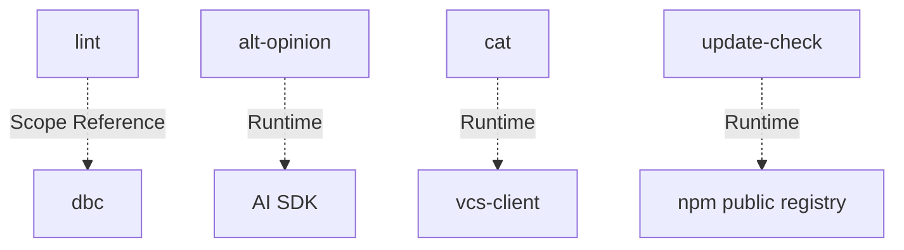

# cli: Scope Specification

## scope-type

product

## 1. Vision & Primary Goal

CLI-модуль с командами для AI-агентов. Команды: `lint` (трёхслойная валидация TypeScript-файлов и директорий с рекурсивным обходом), `alt-opinion` (альтернативные мнения от AI-моделей на переданный артефакт с опциональным синтезом), `cat` (сбор содержимого файлов в XML/MD для AI-агентов с поддержкой локальных файлов и удалённых через `--url`).

## 2. Project Type

- **Type:** cli-utility
- **Why this type:** Набор CLI-команд, запускаемых через `gennady <command>`. Вход — аргументы командной строки, выход — stdout/stderr + exit code. Без UI, без сервера.

## 3. Approved Golden DX Example

```bash
# --- happy path: всё чисто ---
$ gennady lint services/dbc/linter/dbc-linter.types.ts

# exit 0, stdout пуст

# --- ошибки: file header, контракты, anchors ---
$ gennady lint services/dbc/parser/dbc-parser.types.ts src/foo.ts

services/dbc/parser/dbc-parser.types.ts:1:1: error: ERR_CLI_LINT_MISSING_CONSUMERS  File header missing // @consumers:. Add // @consumers: <ConsumerName> before the first import.
src/foo.ts:5:3: error: ERR_DBC_LINT_MISSING_CONTRACT  Entity 'bar' has no JSDoc contract. Add /** @purpose ... */ before the exported entity.
src/foo.ts:12:1: error: ERR_CLI_LINT_ANCHOR_NESTING  END_CHECKOUT at line 12 closes parent, but START_PAYMENT at line 8 is still open. Close START_PAYMENT first.
src/foo.ts:18:1: error: ERR_CLI_LINT_ANCHOR_UNPAIRED_START  START_RETRY at line 18 has no matching END_RETRY. Add // #endregion END_RETRY.

# exit 1

# --- линтинг директории (рекурсивно, .ts + .tsx) ---
$ gennady lint services/dbc/

# exit 0

# --- смешанный ввод: файлы + директории ---
$ gennady lint src/foo.ts services/ cli/cmd/

# exit 0

# --- autofix: исправляем что можно, остаток показываем ---
$ gennady lint --autofix services/dbc/parser/dbc-parser.types.ts

Auto-fixed: 3 error(s)
services/dbc/parser/dbc-parser.types.ts:1:1: error: ERR_CLI_LINT_MISSING_CONSUMERS  File header missing // @consumers:. Add // @consumers: <ConsumerName> before the first import.

# exit 1 (одна ошибка осталась после autofix)

# --- git-режим: все изменённые/новые .ts файлы ---
$ gennady lint --staged

# exit 0

# --- комбинированный ---
$ gennady lint --staged --autofix

# --- ошибка: --staged + позиционные цели взаимоисключающие ---
$ gennady lint --staged src/foo.ts
Error: --staged and positional targets are mutually exclusive

# exit 1

# --- degradation: несуществующий путь ---
$ gennady lint src/foo.ts nonexistent/

src/foo.ts:5:3: error: ERR_DBC_LINT_MISSING_CONTRACT  Entity 'bar' has no JSDoc contract.
ERR_CLI_LINT_RESOLVE_FAILED: nonexistent/: ENOENT: no such file or directory

# exit 1 (одна ошибка линтинга + одна ошибка резолвинга)

# --- degradation: файл без прав на чтение ---
$ gennady lint src/foo.ts restricted/

ERR_CLI_LINT_RESOLVE_FAILED: restricted/: EACCES: permission denied

# exit 0 (если src/foo.ts чист) или exit 1 (если есть ошибки линтинга)
```

Файл читается один раз, контент передаётся во все три проверки. Сообщения об ошибках содержат: что сломано → указание на место → конкретное действие по исправлению. При передаче директорий — рекурсивный обход с фильтрацией по поддерживаемым расширениям (`.ts`, `.tsx`). Ошибки резолвинга целей (ENOENT, EACCES) выводятся в stderr и не прерывают линтинг остальных файлов.

### alt-opinion DX

```bash
# --- без синтеза: stdin, 2 модели → все мнения ---
$ cat specs/cli/cli.spec.md | gennady alt-opinion \
    --model="openrouter/anthropic/claude-3.5-sonnet" \
    --model="llmproxy/deepseek-v4-pro"

<!--START_ALT_OPINION_openrouter-claude-3.5-sonnet-->
### Мнение Claude 3.5 Sonnet
...
<!--END_ALT_OPINION_openrouter-claude-3.5-sonnet-->

<!--START_ALT_OPINION_llmproxy-deepseek-v4-pro-->
### Мнение DeepSeek V4 Pro
...
<!--END_ALT_OPINION_llmproxy-deepseek-v4-pro-->

# exit 0

# --- с синтезом: ТОЛЬКО синтез ---
$ gennady alt-opinion --file=task.md \
    --model="llmproxy/deepseek-v4-pro" \
    --model="openrouter/anthropic/claude-3.5-sonnet" \
    --synthModel="llmproxy/deepseek-v4-pro"

<!--START_ALT_OPINION_SYNTH-->
### Синтез
...
<!--END_ALT_OPINION_SYNTH-->

# exit 0

# --- одна модель (минимальный вызов) ---
$ gennady alt-opinion --file=task.md --model="llmproxy/deepseek-v4-pro"

# exit 0

# --- custom prompts ---
$ gennady alt-opinion --file=task.md \
    --model="openrouter/anthropic/claude-3.5-sonnet" \
    --model="llmproxy/deepseek-v4-pro" \
    --modelPrompt="./prompts/critic.prompt.md"

# exit 0

# --- per-model prompt override ---
$ gennady alt-opinion --file=task.md \
    --model="openrouter/anthropic/claude-3.5-sonnet::./prompts/architect.prompt.md" \
    --model="llmproxy/deepseek-v4-pro::./prompts/sec-auditor.prompt.md"

# exit 0

# --- degradation: модель недоступна ---
$ gennady alt-opinion --file=task.md \
    --model="llmproxy/deepseek-v4-pro" \
    --model="openrouter/nonexistent-model"

<!--START_ALT_OPINION_llmproxy-deepseek-v4-pro-->
...
<!--END_ALT_OPINION_llmproxy-deepseek-v4-pro-->

<!--START_ALT_OPINION_openrouter-nonexistent-model-->
Model error: timeout after 5m
<!--END_ALT_OPINION_openrouter-nonexistent-model-->

# exit 0 (одна модель ответила успешно, без --strict)

# --- strict mode: любая ошибка → exit 1 ---
$ gennady alt-opinion --file=task.md --strict \
    --model="llmproxy/deepseek-v4-pro" \
    --model="openrouter/nonexistent-model"

# exit 1

# --- ошибка: нет API-ключа ---
$ gennady alt-opinion --file=task.md --model="llmproxy/deepseek-v4-pro"
Error: GENNADY_LLM_PROXY_API_KEY is not set

# exit 1

# --- ошибка: и stdin, и --file ---
$ cat task.md | gennady alt-opinion --file=task.md --model="llmproxy/dsv4"
Error: --file and stdin are mutually exclusive

# exit 1
```

Модели опрашиваются параллельно (`Promise.allSettled`). При отказе модели — описание ошибки в её блоке, остальные продолжаются. `--synthModel` → вывод только синтеза (без индивидуальных мнений).

### 3.1 Update Check DX

```bash
# --- happy path: есть обновление ---
$ gennady lint src/foo.ts

# exit 0, stdout пуст (ошибок нет)

# --- после выхода процесса, в stderr: ---
╭──────────────────────────────────────────────────────────╮
│                                                          │
│   Update available: 1.2.3 → 1.3.0                       │
│   Run npm i -g gennady@latest to update.                 │
│                                                          │
╰──────────────────────────────────────────────────────────╯

# --- нет обновления: ничего не показывается ---
$ gennady lint src/foo.ts

# exit 0, stderr пуст

# --- уже проверяли сегодня: запрос не делается ---
$ gennady lint src/foo.ts

# exit 0, молча

# --- нет сети / таймаут 5с / ошибка реестра ---
$ gennady lint src/foo.ts

# exit 0, молча. Проверка просто не сработала. Не ошибка.

# --- CI-окружение: проверка не делается ---
$ CI=true gennady lint src/foo.ts

# exit 0, молча

# --- opt-out через env ---
$ GENNADY_NO_UPDATE_CHECK=1 gennady lint src/foo.ts

# exit 0, молча

# --- opt-out через флаг ---
$ gennady --no-update-check lint src/foo.ts

# exit 0, молча

# --- stdout в pipe: уведомление НЕ показывается ---
$ gennady lint src/foo.ts | tee report.txt

# exit 0, только вывод lint в stdout и файл. Без уведомления.
```

Уведомление в stderr после завершения команды, не блокирует запуск, не надоедает (раз в сутки), самоустраняется при отсутствии сети.

## 4. Requirements & Constraints

### 4.1 Functional Requirements

| ID                  | Требование                                                                                                                                       |
| ------------------- | ------------------------------------------------------------------------------------------------------------------------------------------------ |
| **File header**     |                                                                                                                                                  |
| FR-01               | Проверить наличие `// @file:` в начале файла (до первого `import`). Отсутствие → ошибка `ERR_CLI_LINT_MISSING_FILE`                              |
| FR-02               | Проверить наличие `// @consumers:` в начале файла. Отсутствие → ошибка `ERR_CLI_LINT_MISSING_CONSUMERS`                                          |
| FR-03               | `// @tasks:` не проверяется                                                                                                                      |
| **DBC-контракты**   |                                                                                                                                                  |
| FR-04               | Запустить `DbcLinter` на каждом файле. Принимает путь ИЛИ контент через опцию (требует `refine` скоупа `dbc`)                                    |
| FR-05               | Ошибки линтера транслировать в единый ESLint-формат                                                                                              |
| **Anchor-разметка** |                                                                                                                                                  |
| FR-06               | Проверить парность: каждый `START_<NAME>` имеет `END_<NAME>` в том же файле. Непарный START → `ERR_CLI_LINT_ANCHOR_UNPAIRED_START`               |
| FR-07               | Проверить вложенность: стек открытых регионов. `END_X` закрывает последний открытый `START_X`; закрытие не того → `ERR_CLI_LINT_ANCHOR_NESTING`  |
| FR-08               | Непарный `END` без `START` → `ERR_CLI_LINT_ANCHOR_UNPAIRED_END`                                                                                  |
| **Интерфейс**       |                                                                                                                                                  |
| FR-09               | Принимать список файлов и/или директорий позиционными аргументами. Директории обходятся рекурсивно, собираются `.ts`/`.tsx` файлы                |
| FR-09a              | Рекурсивный обход — поведение по умолчанию, без дополнительного флага. Фильтр: только `.ts`/`.tsx` (регистро-независимо: `.TS` ≡ `.ts`)          |
| FR-09b              | Дедупликация: файл, переданный явно и найденный в директории — линтится один раз. Результат — уникальный отсортированный список абсолютных путей |
| FR-09c              | При рекурсивном обходе исключаются: `node_modules`, скрытые директории (`.`-префикс), `dist`, `coverage`, `build`, `out`. Symlink не обходятся   |
| FR-09d              | Ошибки FS (ENOENT, EACCES) → `ERR_CLI_LINT_RESOLVE_FAILED` в stderr, цель пропускается. Команда продолжается                                     |
| FR-09e              | `--staged` и позиционные цели — взаимоисключающие. Одновременная передача → ошибка, exit 1                                                       |
| FR-10               | Режим `--staged` — автоматический сбор `.ts` файлов из `git diff --staged --name-only` + `git ls-files --others --exclude-standard`              |
| FR-11               | Флаг `--autofix` — исправлять dbc-ошибки через `lintAndFix()`; anchor и header — только диагностика                                              |
| **Вывод**           |                                                                                                                                                  |
| FR-12               | ESLint-формат: `file:line:col: severity: code: message`. Каждое сообщение: описание проблемы + конкретное действие                               |
| FR-13               | Exit code 0 при отсутствии ошибок, 1 при наличии                                                                                                 |

### 4.1.2 alt-opinion Functional Requirements

| ID             | Требование                                                                                                                                           |
| -------------- | ---------------------------------------------------------------------------------------------------------------------------------------------------- |
| **Вход**       |                                                                                                                                                      |
| FR-ALT-01      | Принимать stdin ИЛИ `--file=<path>`. Если передано и то и другое — ошибка                                                                            |
| FR-ALT-02      | Если stdin — терминал (TTY) и `--file` не указан — ошибка с подсказкой                                                                               |
| **Модели**     |                                                                                                                                                      |
| FR-ALT-03      | `--model="{provider}/{model}"` — повторяемый, минимум 1. Провайдер обязателен: `llmproxy` или `openrouter`                                           |
| FR-ALT-04      | `--synthModel="{provider}/{model}"` — опционально. Если не указан — вывод всех мнений; если указан — вывод только синтеза                            |
| FR-ALT-05      | При отсутствии API-ключа для провайдера — ошибка с указанием имени env-переменной: `GENNADY_LLM_PROXY_API_KEY`, `GENNADY_OPENROUTER_API_KEY`         |
| **Промпты**    |                                                                                                                                                      |
| FR-ALT-06      | `--modelPrompt=<path>` — общий промпт для всех моделей (читается из файла). `--synthPrompt=<path>` — промпт для синтеза                              |
| FR-ALT-07      | Per-model override: `--model="{provider}/{model}::{path}"` — индивидуальный промпт для конкретной модели                                             |
| FR-ALT-08      | Если промпт не указан — используется дефолтный из `cli/cmd/alt-opinion/prompts/`                                                                     |
| FR-ALT-09      | Дефолтный промпт мнения: «Ты — эксперт... Верни независимое, критическое мнение...»                                                                  |
| FR-ALT-10      | Дефолтный промпт синтеза: «Ниже — несколько независимых мнений... Синтезируй их в одно консолидированное мнение...»                                  |
| **Выполнение** |                                                                                                                                                      |
| FR-ALT-11      | Модели опрашиваются параллельно через `Promise.allSettled`; синтез — после сбора всех мнений                                                         |
| FR-ALT-12      | Таймаут на вызов модели — 5 минут (через `AbortController`). При таймауте / ошибке — описание в блоке модели, остальные продолжаются                 |
| FR-ALT-13      | Шаблон запроса к модели: `# GOAL:\n<prompt>\n\n# CONTEXT:\n<контент>`                                                                                |
| FR-ALT-14      | `--strict` флаг: exit 1 при любой ошибке модели. Без `--strict`: exit 1 только если все модели упали                                                 |
| **Вывод**      |                                                                                                                                                      |
| FR-ALT-15      | Markdown с блоками `<!--START_ALT_OPINION_{PROVIDER}-{MODEL}-->...<!--END_ALT_OPINION_{PROVIDER}-{MODEL}-->`                                         |
| FR-ALT-16      | При синтезе — блок `<!--START_ALT_OPINION_SYNTH-->...<!--END_ALT_OPINION_SYNTH-->` (без индивидуальных мнений)                                       |
| FR-ALT-17      | Порядок блоков в выводе соответствует порядку `--model` в CLI                                                                                        |
| **Телеметрия** |                                                                                                                                                      |
| FR-ALT-18      | Каждый opinion-блок (включая синтез) завершается строкой `<!--TELEMETRY wall=<N>ms tokens=<prompt>/<completion> reason=<finishReason>-->`            |
| FR-ALT-19      | `AltOpinionModelPort.generate()` возвращает `{ content: string; usage?: { promptTokens: number; completionTokens: number }; finishReason?: string }` |
| FR-ALT-20      | Если порт не вернул `usage` — строка телеметрии содержит только `wall` и `reason`                                                                    |
| FR-ALT-21      | `wall` — реальное время вызова модели в ms (через `performance.now()` до/после `port.generate()`)                                                    |

### 4.1.3 Update Check Functional Requirements

| ID               | Требование                                                                                                                                |
| ---------------- | ----------------------------------------------------------------------------------------------------------------------------------------- |
| **Детект**       |                                                                                                                                           |
| FR-SU-01         | При каждом запуске CLI запускать неблокирующую проверку наличия новой версии в npm-реестре. Проверка не задерживает выполнение команды    |
| FR-SU-02         | Проверка выполняется через `child_process.fork` с `.unref()` — не предотвращает `process.exit`                                            |
| FR-SU-03         | Проверка не чаще одного раза в интервал (по умолчанию 24 часа). Результат кешируется на диск                                              |
| FR-SU-04         | Интервал проверки конфигурируется через `GENNADY_UPDATE_CHECK_INTERVAL` (ms). По умолчанию: `86400000` (24h)                              |
| **Версия**       |                                                                                                                                           |
| FR-SU-05         | Текущая версия вшивается в бандл через Vite `define`                                                                                      |
| FR-SU-06         | Последняя версия запрашивается из `https://registry.npmjs.org/<package>/latest` → поле `version`                                          |
| FR-SU-07         | Таймаут HTTP-запроса к реестру — 5 секунд. При таймауте / ошибке сети — молча, без ошибки                                                 |
| **Уведомление**  |                                                                                                                                           |
| FR-SU-08         | Если найдена новая версия: вывести на stderr сообщение с текущей версией, новой версией и командой обновления (`npm i -g gennady@latest`) |
| FR-SU-09         | Сообщение выводится только если stderr — TTY (не в pipe, не в файл)                                                                       |
| FR-SU-10         | Сообщение выводится после завершения основной команды (deferred), чтобы не мешать выводу                                                  |
| **Opt-out**      |                                                                                                                                           |
| FR-SU-11         | `GENNADY_NO_UPDATE_CHECK=1` — пропустить проверку                                                                                         |
| FR-SU-12         | `--no-update-check` флаг в CLI — пропустить проверку                                                                                      |
| **Авто-пропуск** |                                                                                                                                           |
| FR-SU-13         | Пропустить проверку в CI-окружениях (`CI`, `CONTINUOUS_INTEGRATION`, `BUILD_NUMBER` env)                                                  |
| FR-SU-14         | Пропустить проверку если `NODE_ENV === 'test'`                                                                                            |

### 4.2 Non-Functional Constraints

- **NFC-01**: Файл читается один раз, контент передаётся во все три проверки
- **NFC-02**: Anchor-парсер — чистая функция `(content: string) → LintError[]`, без внешних зависимостей
- **NFC-03**: Коды ошибок — стабильные строковые константы c префиксом `ERR_CLI_LINT_`
- **NFC-04**: Node.js 22+, TypeScript strict mode. `lint` и большинство команд — zero runtime dependencies. `alt-opinion` использует AI SDK (`ai` + `@ai-sdk/openai`) — бандлится Vite
- **NFC-05**: Каждое сообщение об ошибке содержит: что сломано → указание на место → конкретное действие. Формат: `<description>. <imperative action>.`
- **NFC-06 (alt-opinion)**: AI-вызовы абстрагированы за DI-портом `AltOpinionModelPort` — позволяет мокать SDK в тестах без monkey-patching
- **NFC-07 (alt-opinion)**: `run(rawArgs, deps)` отделён от self-executing блока — поддержка инжекции stdin/stdout в тестах
- **NFC-08 (alt-opinion)**: Санитизация входного контента — экранирование `# CONTEXT:` и anchor-маркеров для предотвращения prompt injection
- **NFC-09 (alt-opinion)**: Телеметрия опциональна — если `port.generate()` не вернул `usage`, блок содержит только `wall` и `reason`. Отсутствие телеметрии у одной модели не ломает вывод остальных
- **NFC-10 (update-check)**: Zero runtime dependencies — только Node.js built-in модули (`child_process`, `https`, `fs`, `os`, `path`)
- **NFC-11 (update-check)**: Проверка реестра — чистый HTTPS-запрос без npm CLI (не зависит от наличия `npm` в системе)
- **NFC-12 (update-check)**: Кеш хранится в платформо-зависимой директории: `~/Library/Preferences/gennady/` (macOS), `~/.config/gennady/` (Linux), `%APPDATA%/gennady/` (Windows)

### 4.3 Out-of-Scope

**lint:**

- Autofix для file header и anchor-ошибок (v1 — только диагностика)
- Поддержка языков кроме TypeScript
- Проверка XML-файлов (SDD-промты)
- Diff-стратегия (только full-file в v1)
- `--watch` режим
- Валидация содержимого `@file:` / `@consumers:` (только наличие)

**alt-opinion (v2):**

- Streaming (потоковый вывод)
- `--dry-run` / `--prompt-only` (показать промпт без вызова)
- `--out=<path>` / `--append` (запись в файл)
- `--temperature`, `--max-tokens`, `--seed` (параметры генерации)
- Кеширование ответов
- История / лог запросов
- Автоматический retry / fallback на другую модель
- Concurrency limit (всегда параллельно)

**update-check (v1):**

- Автоматическая установка обновления — только детект и уведомление
- Откат версии
- Проверка из приватных реестров (Gemfury, GitHub Packages, Verdaccio) — только public npm registry
- Кастомный npm-реестр через `.npmrc`
- Кастомизация текста уведомления пользователем

### 4.4 Runtime Backing & Deferred Scope

**lint:**

| Capability                      | Posture                      |
| ------------------------------- | ---------------------------- |
| Чтение файлов (FS)              | `real-runtime`               |
| Рекурсивный обход директорий    | `real-runtime`               |
| Фильтрация по расширениям       | `real-runtime`               |
| Защита от symlink-циклов        | `real-runtime`               |
| Git-интеграция (`--staged`)     | `real-runtime`               |
| DBC-линтинг (через `DbcLinter`) | `real-runtime`               |
| Anchor-парсинг                  | `real-runtime`               |
| File header-проверка            | `real-runtime`               |
| Autofix (dbc)                   | `real-runtime`               |
| Autofix (anchor, header)        | `not-implemented` (deferred) |
| Поддержка других языков         | `not-implemented` (deferred) |

**alt-opinion:**

| Capability                 | Posture                      |
| -------------------------- | ---------------------------- |
| Чтение stdin / файлов (FS) | `real-runtime`               |
| HTTP-вызовы к AI API       | `real-runtime`               |
| Streaming вывод            | `not-implemented` (deferred) |
| Кеширование ответов        | `not-implemented` (deferred) |
| `--dry-run` / `--verbose`  | `not-implemented` (deferred) |

**update-check:**

| Capability                          | Posture                      |
| ----------------------------------- | ---------------------------- |
| HTTP-запрос к npm registry          | `real-runtime`               |
| Кеширование результата (FS)         | `real-runtime`               |
| Deferred-уведомление (TTY)          | `real-runtime`               |
| Автоматическая установка обновления | `not-implemented` (deferred) |

### 4.5 Rules

| Rule               | Category | Source                                      |
| ------------------ | -------- | ------------------------------------------- |
| `typescript-rules` | coding   | `ai/directives/coding/typescript-rules.xml` |
| `node-test`        | testing  | `ai/directives/testing/node-test.xml`       |

## 5. High-Level Architecture

**Вариант А — Flat команды (утверждён).**

Каждая команда — независимый модуль в `cli/cmd/<name>/`. Общие части — в `cli/cmd/_shared/` (при появлении второго потребителя).

### 5.1 lint

```
cli/cmd/lint/
├── index.ts                    # import './lint.cmd.ts'
├── lint.cmd.ts                 # CLI-обвязка: parseArgs, git scan, цикл по файлам, вывод
├── lint.types.ts               # LintError, LintOptions, LintReport
├── checks/
│   ├── file-header.check.ts    # проверка // @file: + // @consumers:
│   ├── anchor.check.ts         # парность + вложенность #region START/END
│   └── dbc-contract.check.ts   # адаптер к DbcTsLinter (путь или контент)
└── __tests__/
    ├── lint.cmd.test.ts
    ├── file-header.check.test.ts
    ├── anchor.check.test.ts
    └── dbc-contract.check.test.ts
```

**Ключевые решения:**

1. Один проход по файлу: `lint.cmd.ts` читает контент один раз → прокидывает в 3 проверки.
2. Адаптер к dbc: `dbc-contract.check` создаёт `DbcTsLinter` и вызывает `lint()` / `lintAndFix()`.
3. Формат ошибок: единый `LintError` — все 3 проверки возвращают один тип.
4. Git-интеграция: сбор списка файлов через `git diff --staged --name-only` и `git ls-files --others --exclude-standard`.

### 5.2 alt-opinion

```
cli/cmd/alt-opinion/
├── index.ts                    # import './alt-opinion.cmd.ts'
├── alt-opinion.cmd.ts          # CLI-обвязка: парсинг args, чтение stdin/--file, вызов runner, вывод
├── alt-opinion.types.ts        # AltOpinionModel, AltOpinionResult, AltOpinionReport
├── alt-opinion-runner.ts       # Ядро: параллельный опрос моделей + опциональный синтез (Promise.allSettled)
├── alt-opinion-parser.ts       # Свой парсер аргументов (:: синтаксис не поддерживается parseArgs)
├── prompts/
│   ├── default-opinion.prompt.md   # Дефолтный промпт мнения
│   └── default-synth.prompt.md     # Дефолтный промпт синтеза
└── __tests__/
    ├── alt-opinion-parser.test.ts      # Unit: парсер (12+ кейсов)
    ├── alt-opinion-runner.test.ts      # Unit: runner с моками AI SDK через DI-порт
    └── alt-opinion.cmd.test.ts         # Integration: CLI-обвязка
```

**Ключевые решения:**

1. **Свой парсер** (`alt-opinion-parser.ts`): `--model="{provider}/{model}::{path}"` не влезает в `parseArgs` — специализированный парсер только для этой команды.
2. **AI SDK напрямую**: используется `ai` + `@ai-sdk/openai` (через `createOpenAI` с custom baseURL для llmproxy/OpenRouter). Не через легаси `services/ai-client`.
3. **DI-порт `AltOpinionModelPort`**: абстракция для AI-вызовов, инжектится в `runner`. Позволяет мокать SDK в тестах без monkey-patching.
4. **`run(rawArgs, deps)` отделён от `process.exit`**: self-executing блок только при прямом запуске (`import.meta.url`). В тестах вызывается `run()` с инжектированными stdin/stdout.
5. **`Promise.allSettled`**: модели опрашиваются параллельно, ошибка одной не прерывает остальные.
6. **Логирование через `#logger`**: старт, прогресс (модель → ответ), ошибки, таймауты. Уровни: `info` для нормального флоу, `warn` для деградации, `error` для провала.
7. **Регистрация в `cli/gennady.ts`**: добавить `case 'alt-opinion'` в switch + обновить help и таблицу в `cli/AGENTS.md`.

### 5.3 Rejected Alternatives

| Вариант                                                    | Почему отвергнут                                                                                     |
| ---------------------------------------------------------- | ---------------------------------------------------------------------------------------------------- |
| Shared pipeline + команды как плагины                      | Pipeline-абстракция была premature для одной команды. Сейчас 2 команды — flat структура подтверждена |
| Проверка XML-файлов (SDD-промты)                           | v1 — только TypeScript. XML — deferred                                                               |
| Autofix для anchor и header                                | v1 — только диагностика. Добавление autofix — отдельная задача                                       |
| Использовать `services/ai-client` (легаси) для alt-opinion | Легаси-код с другой моделью конфигурации (.gennadyrc). alt-opinion — чистый старт на AI SDK          |
| Использовать `parseArgs` для ::-синтаксиса                 | `parseArgs` не поддерживает `::` внутри значений. Свой парсер изолирован в команде                   |
| Общий промпт-файл вместо per-model overrides               | Разные модели требуют разных промптов (архитектор, security-аудитор). Per-model overrides решают     |

### 5.4 Update Check

```
cli/cmd/_shared/
├── update-check.ts          # checkForUpdates(pkg): читает кеш, spawn worker, deferred notify
└── update-check-worker.ts   # HTTPS GET к реестру → пишет результат в кеш
```

**Ключевые решения:**

1. **Паттерн `update-notifier`**: неблокирующая проверка через detached child process (`fork` + `.unref()`). Кеш на диске. Deferred-уведомление после завершения команды.
2. **Zero runtime deps**: только Node.js built-in (`child_process`, `https`, `fs`, `os`, `path`). Версия вшивается в бандл через Vite `define`. Никаких npm-зависимостей.
3. **Worker изолирован**: `update-check-worker.ts` запускается только через `fork`, получает параметры через `process.argv`, пишет результат в кеш-файл и завершается. Не импортируется основным процессом — исключает случайную блокировку.
4. **Интеграция в `cli/gennady.ts`**: вызов `checkForUpdates(pkg)` перед `switch`-диспатчем команд. Парсинг `--no-update-check` флага до диспатча.
5. **Кеш-структура** (`~/.config/gennady/.update-check.json`): `{ "lastCheck": "ISO8601", "latestVersion": "x.y.z" }`. Интервал проверки конфигурируется через `GENNADY_UPDATE_CHECK_INTERVAL` (ms), по умолчанию 24h.

## 6. Decision Log

### D-001 — Архитектура Flat (Вариант А)

- **Status:** active
- **Recorded:** session Discovery, cli
- **Why:** Одна команда в v1. Pipeline-абстракция без второй команды — premature abstraction (YAGNI). Flat-структура минимизирует overhead — один файл типов, три проверки в `checks/`. При добавлении второй команды — refine с выделением общих частей.
- **Risk accepted:** При добавлении новых команд возможен перенос общих частей (git-scan, формат вывода) в `cli/cmd/_shared/`. С добавлением `alt-opinion` (D-003) риск подтверждён — flat структура сохранена, общие части не выделялись.
- **Rejected alternatives:** Shared pipeline (вариант Б) — абстракция ради одной команды без подтверждённого второго потребителя.

### D-002 — Декомпозиция: flat, один модуль `lint`

- **Status:** active
- **Recorded:** session ModuleDecomposition, cli
- **Why:** Одна команда в v1. Выделение pipeline-модуля без второго потребителя — YAGNI. При добавлении второй команды — `add-module`.
- **Risk accepted:** При добавлении новых команд потребуется `add-module` и возможно выделение общих частей.
- **Rejected alternatives:** Два модуля (`lint` + `pipeline`) — преждевременная абстракция.

### D-003 — Архитектура alt-opinion: Flat, свой парсер

- **Status:** active
- **Recorded:** session Discovery, cli, refine (alt-opinion)
- **Why:** alt-opinion — вторая команда в CLI. Подтверждает D-001/D-002: flat структура без выделения pipeline (только 2 команды, общие части не выделены). Свой парсер (`alt-opinion-parser.ts`) необходим, потому что `parseArgs` не поддерживает `::`-синтаксис `--model="{provider}/{model}::{path}"`. AI SDK используется напрямую, не через легаси `services/ai-client`.
- **Risk accepted:** При появлении третьей команды может потребоваться рефакторинг парсинга и выделение общих частей. `--modelPrompt` / `--synthPrompt` — файловые пути, пользователь должен обеспечить их существование.
- **Rejected alternatives:**
  - Использовать `parseArgs` + отдельный флаг `--model-prompt` — увеличивает число флагов, ломает атомарность per-model конфигурации
  - Интеграция с `.gennadyrc` — легаси, alt-opinion стартует чистый слой
  - Разделение `provider` и `model` на отдельные флаги — избыточно, `provider/model` — устоявшийся формат AI SDK

### D-004 — Update Check: свой механизм (zero-deps, паттерн update-notifier)

- **Status:** active
- **Recorded:** session Discovery, cli, refine (update-check)
- **Why:** Механизм неблокирующего детекта обновлений на старте CLI. Индустриальный стандарт — `update-notifier` (Sindre Sorhus), но он заархивирован и тянет 15+ транзитивных зависимостей (`boxen`, `chalk`, `configstore` и др.), многие из которых тоже заброшены. Проект держит курс на zero runtime deps — решение с нуля на Node.js built-in модулях (`child_process`, `https`, `fs`). Паттерн проверенный: detached worker с `.unref()`, кеш на диске, deferred-уведомление в stderr.
- **Risk accepted:** Свой код вместо проверенной библиотеки. Смягчается простотой механизма (~100 строк) и полным покрытием тестами.
- **Rejected alternatives:**
  - `update-notifier` напрямую — заархивирован + 15 зависимостей
  - `update-notifier-cjs` (форк) — те же зависимости, меньшее сообщество
  - Использовать `npm view` через `child_process.exec` — зависит от наличия `npm` в системе, медленно, негарантированный формат вывода

### D-005 — Поддержка директорий в lint (рекурсивный обход)

- **Status:** active
- **Recorded:** session Discovery, cli, refine (lint-директории)
- **Why:** Команда `gennady lint` должна принимать не только отдельные файлы, но и директории. При передаче директории — рекурсивно собирать все `.ts`/`.tsx` файлы и линтить их. Расширения объявляются самим линтером — не хардкодятся в CLI-обвязке. Рекурсивный обход — поведение по умолчанию, без дополнительного флага.
- **Risk accepted:** Рекурсивный обход без ограничения глубины. При передаче директории с очень большим количеством файлов — потенциально долгое выполнение. Смягчается тем, что оператор контролирует что передаёт.
- **Rejected alternatives:**
  - Флаг `--recursive` — усложняет интерфейс без выигрыша; рекурсивность — ожидаемое поведение по умолчанию для линтера директорий
  - Жёсткий фильтр по `.ts` без учёта `.tsx` — линтер уже поддерживает оба расширения, искусственное ограничение

### D-007 — TypeScript/Linter Disable Discipline

- **Status:** active
- **Recorded:** session refine (lint disable-discipline)
- **Why:** Любое отключение TypeScript (`@ts-ignore`, `@ts-nocheck`, `@ts-expect-error`) или линтера (`eslint-disable*`) обходит механизм статической верификации, который мы целенаправленно встроили в pipeline. Незадокументированное отключение — это **тихий drift от спецификации**: агент во время реализации обошёл систему, не обсудив это с оператором. Грубейшее нарушение implementation discipline. Поэтому каждое отключение обязано нести ссылку на запись Decision Log (формат `D-\d+`) в той же строке комментария — сам факт ссылки превращает молчаливый shortcut в осознанное решение, обсуждённое заранее.
- **Form:** комментарий с маркером отключения МОЖЕТ существовать только если в той же строке присутствуют **три части**: (a) сам маркер, (b) ссылка `D-\d+` на Decision Log запись, (c) **purpose** — обоснование в свободной форме (≥ 8 непробельных символов после удаления маркера и токена `D-NNN`).
  Рекомендованный, но не обязательный синтаксис: `<marker> — <D-NNN>: <purpose>`. Формат гибкий — разделители (`:`, `—`, `--`) не унифицированы для совместимости с ESLint-конвенцией `// eslint-disable-next-line rule -- reason`:
  ```ts
  // @ts-expect-error: D-042 — abstract class instantiation required by contract test
  // @ts-expect-error — D-042: abstract class instantiation required by contract test
  // eslint-disable-next-line no-explicit-any -- D-017: third-party type definition missing
  ```
  Невалидные (purpose отсутствует или слишком короткий):
  ```ts
  /* @ts-ignore: D-099 */ // purpose пуст
  // eslint-disable-next-line no-explicit-any -- D-017        // после D-017 ничего нет
  // @ts-ignore D-042 fix                                     // 3 непробельных символа после D-042 — недостаточно
  ```
- **Where D-NNN lives:** в первой итерации — синтаксическое требование (ссылка должна присутствовать). Существование D-NNN в каком-либо `*.spec.md` не верифицируется. Допустимы записи в scope-spec / module-spec / task-ticket Decision Log в формате `D-NNN — Authorized Escape Hatch`.
- **Enforcement:** новый чек `DisablesCheck` в gennady lint, ортогональный к ESLint и TypeScript (нельзя обойти inline-комментарием отключения — сам комментарий И есть искомый паттерн). Аудит SDD вызывает `gennady lint` на STEP_1 mechanical pre-pass — нарушения попадают в findings автоматически.
- **Scope:** код И тесты, любой `.ts`/`.tsx` файл в проекте.
- **Risk accepted:** в момент включения чека в codebase уже существуют 3 `@ts-expect-error` (`services/vcs-client/__tests__/abstract/vcs-client-abstract.test.ts`) без `D-NNN`. Они получают свою Decision Log запись в `vcs-client` module spec одновременно с включением чека.
- **Rejected alternatives:**
  - ESLint-правило `no-unauthorized-disable` — обходится `// eslint-disable` поверх собственного правила; защита нулевая
  - Запрет любых disable-комментариев — слишком строго; легитимные кейсы существуют (compile-time gates, third-party type gaps)
  - Verification существования D-NNN в spec файлах сразу — преждевременная сложность; начинаем с синтаксической проверки, существование добавляем второй итерацией если понадобится
  - Расширить проверку на `: any` / `.skip` — отдельная политика; начинаем с самого узкого среза (только явные отключения), расширим после пилота
  - Требовать только D-NNN без purpose (первая итерация) — позволяло формально соблюдать политику без реального обоснования (`/* @ts-ignore: D-099 */`); пересмотрено в refine (см. TSK-52)
  - Жёсткий формат `<marker> — <D-NNN>: <purpose>` без альтернативных разделителей — ломает ESLint-конвенцию `-- reason`; выбран семантический подход (три части присутствуют, формат гибкий)

### D-006 — Контракт resolveTargets (дедупликация, исключения, graceful degradation)

- **Status:** active
- **Recorded:** session Discovery, cli, refine (lint-директории, alt-opinion audit)
- **Why:** После аудита spec'а через alt-opinion выявлены критические пробелы в обработке corner cases. `resolveTargets` должен возвращать кортеж `{ files, errors }` вместо `string[]` — это позволяет graceful degradation при ошибках FS. Явно зафиксированы правила: дедупликация (уникальные абсолютные пути), сортировка, исключение `node_modules`/скрытых/`dist`/`coverage`/`build`/`out`, регистро-независимое сравнение расширений, защита от symlink (lstat, не следуем), запрет одновременного использования `--staged` и позиционных целей. Контракт изолирован в чистую функцию, тестируемую с моком `fs`.
- **Risk accepted:** Список исключаемых директорий (`dist`, `coverage`, `build`, `out`) не конфигурируется пользователем в v1. При необходимости — отдельный refine. Symlink-политика «не следуем» может быть неожиданной для пользователей, ожидающих обход symlink. Запрет `--staged` + позиционные цели — потенциально неудобно, но устраняет неоднозначность.
- **Rejected alternatives:**
  - Возврат `string[]` с игнорированием ошибок — молчаливый пропуск проблемных целей ведёт к ложному ощущению успеха
  - Конфигурируемый список исключений через `.gennadyignore` — premature для v1, усложняет контракт
  - Пересечение `--staged` и позиционных целей (линтить только пересечение) — семантически запутанно, сложно объяснить пользователю

## 7. Scope Dependencies

- **Depends on:**
  - [`dbc`](../dbc/dbc.spec.md) — `DbcLinter`, `DbcLintError`, `DbcLintReport`; требует `refine` для опции `content`
  - [`infra-base`](../infra-base/infra-base.spec.md) — TypeScript, node:test, prettier, Vite
- **Provides to:** AI-агенты (через CLI)

## 8. Bootstrap Requirements

| Requirement                                                              | Kind          | Owner                 | Resolution                                                                                                                          |
| ------------------------------------------------------------------------ | ------------- | --------------------- | ----------------------------------------------------------------------------------------------------------------------------------- |
| `DbcLinter.lint()` с опцией `content`                                    | external-type | external-prereq-scope | `refine` dbc — добавить `opts?: { content?: string }` в `DbcLinter.lint(filePath, opts?)` и `DbcLinter.lintAndFix(filePath, opts?)` |
| Создать `cli/cmd/lint/index.ts`                                          | file          | this-scope-task       | `import './lint.cmd.ts'`                                                                                                            |
| Создать `cli/cmd/lint/lint.cmd.ts`                                       | file          | this-scope-task       | `LintCommand.run()` + `resolveTargets()`: парсинг, сбор из директорий, git scan, вывод                                              |
| Создать `cli/cmd/lint/lint.types.ts`                                     | file          | this-scope-task       | `LintError`, `LintOptions`, `LintReport`                                                                                            |
| Создать `cli/cmd/lint/checks/file-header.check.ts`                       | file          | this-scope-task       | проверка `// @file:` + `// @consumers:`                                                                                             |
| Создать `cli/cmd/lint/checks/anchor.check.ts`                            | file          | this-scope-task       | парность + вложенность START/END                                                                                                    |
| Создать `cli/cmd/lint/checks/dbc-contract.check.ts`                      | file          | this-scope-task       | адаптер к `DbcTsLinter`                                                                                                             |
| Создать `cli/cmd/lint/__tests__/resolve-targets.test.ts`                 | file          | this-scope-task       | Юнит-тесты `resolveTargets()` с моком `fs` (24 сценария — см. lint.spec.md §6.1)                                                    |
| Обновить `cli/gennady.ts`                                                | file          | this-scope-task       | добавить `case 'lint'` + `case 'alt-opinion'` в switch + help                                                                       |
| Обновить `cli/AGENTS.md`                                                 | file          | this-scope-task       | добавить строки `lint` и `alt-opinion` в таблицу команд                                                                             |
| Обновить `cli/cmd/help/help.cmd.ts`                                      | file          | this-scope-task       | добавить `lint` и `alt-opinion` в вывод                                                                                             |
| Удалить `cli/cmd/lint/lint-cmd.task.spec.md`                             | file          | this-scope-task       | старый spec, заменён на `specs/cli/cli.spec.md`                                                                                     |
| **alt-opinion**                                                          |               |                       |                                                                                                                                     |
| Создать `cli/cmd/alt-opinion/index.ts`                                   | file          | this-scope-task       | `import './alt-opinion.cmd.ts'`                                                                                                     |
| Создать `cli/cmd/alt-opinion/alt-opinion.cmd.ts`                         | file          | this-scope-task       | CLI-обвязка: парсинг, stdin/--file, вызов runner, вывод                                                                             |
| Создать `cli/cmd/alt-opinion/alt-opinion.types.ts`                       | file          | this-scope-task       | `AltOpinionModel`, `AltOpinionResult`, `AltOpinionReport`                                                                           |
| Создать `cli/cmd/alt-opinion/alt-opinion-runner.ts`                      | file          | this-scope-task       | Ядро: параллельный опрос моделей + синтез (Promise.allSettled)                                                                      |
| Создать `cli/cmd/alt-opinion/alt-opinion-parser.ts`                      | file          | this-scope-task       | Парсер `--model="{provider}/{model}::{path}"`                                                                                       |
| Создать `cli/cmd/alt-opinion/prompts/default-opinion.prompt.md`          | file          | this-scope-task       | Дефолтный промпт мнения                                                                                                             |
| Создать `cli/cmd/alt-opinion/prompts/default-synth.prompt.md`            | file          | this-scope-task       | Дефолтный промпт синтеза                                                                                                            |
| Создать `cli/cmd/alt-opinion/__tests__/alt-opinion-parser.test.ts`       | file          | this-scope-task       | Unit: парсер (12+ кейсов)                                                                                                           |
| Создать `cli/cmd/alt-opinion/__tests__/alt-opinion-runner.test.ts`       | file          | this-scope-task       | Unit: runner с моками AI SDK через DI-порт (10+ кейсов)                                                                             |
| Создать `cli/cmd/alt-opinion/__tests__/alt-opinion.cmd.test.ts`          | file          | this-scope-task       | Integration: CLI-обвязка (10+ кейсов)                                                                                               |
| `GENNADY_LLM_PROXY_API_KEY`                                              | env           | operator-action       | Оператор устанавливает env-переменную                                                                                               |
| `GENNADY_OPENROUTER_API_KEY`                                             | env           | operator-action       | Оператор устанавливает env-переменную                                                                                               |
| **update-check**                                                         |               |                       |                                                                                                                                     |
| Добавить `define: { __GENNADY_VERSION__ }` в `vite.config.ts`            | file          | this-scope-task       | Вшить версию из `package.json` на этапе сборки                                                                                      |
| Создать `cli/cmd/_shared/update-check.ts`                                | file          | this-scope-task       | Модуль: read cache, spawn worker, deferred notify                                                                                   |
| Создать `cli/cmd/_shared/update-check-worker.ts`                         | file          | this-scope-task       | Worker: HTTPS GET к реестру, запись кеша                                                                                            |
| Интегрировать `checkForUpdates` + `--no-update-check` в `cli/gennady.ts` | file          | this-scope-task       | Вызов перед `switch`, парсинг флага из `process.argv`                                                                               |
| Создать `cli/cmd/_shared/__tests__/update-check.test.ts`                 | file          | this-scope-task       | Unit-тесты: кеш, worker, notify                                                                                                     |

## 9. Module Map

Spec hierarchy is materialized at `specs/cli/`. Module specs are at `specs/cli/<module>/<module>.spec.md`.

### 9.1 Modules

- [lint](./lint/lint.spec.md) — Команда `gennady lint`: file header + DBC-контракты + anchor-разметка
- [alt-opinion](./alt-opinion/alt-opinion.spec.md) — Команда `gennady alt-opinion`: альтернативные мнения от AI-моделей с опциональным синтезом
- [cat](./cat/cat.spec.md) — Команда `gennady cat`: сбор файлов (локальных и удалённых через --url) в XML/MD для AI-агентов
- [update-check](./update-check/update-check.spec.md) — Shared-модуль: неблокирующий детект обновлений через npm-реестр на старте CLI

### 9.2 Inter-Module Dependency Map



### 9.3 Stack Dependencies

- Languages: TypeScript
- Test frameworks: node:test

### 9.4 Handoff to Task Scaffolding

- **Primary input:** `specs/cli/cli.spec.md` (this file).
- **Required directives:** `ai/directives/coding/typescript-rules.xml`, `ai/directives/testing/node-test.xml`
- **Areas requiring decomposition:** `lint`, `alt-opinion`, `update-check`
- **Named abstractions:** `LintCommand`, `LintError`, `LintOptions`, `LintReport`, `FileHeaderCheck`, `AnchorCheck`, `DbcContractCheck`, `AltOpinionCommand`, `AltOpinionModel`, `AltOpinionResult`, `AltOpinionReport`, `AltOpinionRunner`, `AltOpinionModelPort`, `UpdateCheck`, `UpdateCheckWorker`, `UpdateCheckCache`, `UpdateCheckOptions`
- **Bootstrap tickets ready for cascade:** see 8
- **Open risks:**
  - `refine` dbc должен быть выполнен до реализации `dbc-contract.check.ts`
  - Anchor-парсер — новая логика, без существующей реализации
  - Git-интеграция: поведение при отсутствии git-репозитория не зафиксировано
  - alt-opinion: тесты парсера — критичный компонент, делать первыми (урок из lint I-01, I-04)
  - alt-opinion: `GENNADY_LLM_PROXY_API_KEY` и `GENNADY_OPENROUTER_API_KEY` должны быть установлены оператором
  - update-check: интеграционные тесты worker'а с локальным HTTP-сервером — порт может быть занят
  - update-check: платформенные пути кеша — требуют верификации на Windows/macOS/Linux

## 11. Execution Insights

Закрытые проблемы, обнаруженные при реализации. Сохранены для будущих refin'ов и смежных скоупов.

| ID   | Insight                                                                                                                                                                                                                                            | Решение                                                                                                                                                                                                            |
| ---- | -------------------------------------------------------------------------------------------------------------------------------------------------------------------------------------------------------------------------------------------------- | ------------------------------------------------------------------------------------------------------------------------------------------------------------------------------------------------------------------ |
| I-01 | `parseArgs()` делает внутренний `.slice(2)`. При передаче `process.argv` позиционные аргументы включают имя команды. Повторный `.slice()` вне parseArgs теряет аргументы.                                                                          | Фильтровать `args._` по расширению `.ts`, не делать повторный slice. Команда может запускаться по-разному (прямой импорт, tsx, npx) — структура argv нестабильна.                                                  |
| I-02 | `resolve(filePath)` даёт абсолютный путь. Если передать его в проверки, ошибки выводят `/Users/.../file.ts`, а не относительный путь из аргументов.                                                                                                | Использовать `resolve()` только для `readFileSync`. Во все проверки передавать оригинальный `filePath` из аргументов.                                                                                              |
| I-03 | `git diff --staged --name-only` и `git ls-files --others --exclude-standard` падают вне git-репозитория.                                                                                                                                           | Обёрнуты в try/catch с понятным сообщением об ошибке.                                                                                                                                                              |
| I-04 | Unit-тесты отдельных checks не покрывают CLI-интеграцию. Баги parseArgs и filePath-неконсистентности прошли бы незамеченными без ручного тестирования.                                                                                             | Создан TSK-18 — интеграционные тесты CLI: parseArgs, autofix-вывод, exit codes, консистентность путей, фильтр по расширению.                                                                                       |
| I-05 | При autofix вывод не показывал количество исправленных ошибок — команда молча мутировала файл.                                                                                                                                                     | `LintReport` расширен полем `autoFixed`, вывод начинается с `Auto-fixed: N error(s)`.                                                                                                                              |
| I-06 | `parseArgs(process.argv)` включает имя команды (`cat`) и путь к скрипту в `args._`. При запуске через `npx tsx ~/path/cli cat ...` в `args._` попадают и путь к скрипту, и `'cat'`. Простая проверка `args._.length > 0` даёт ложное срабатывание. | Фильтровать `args._`: удалять имя команды, пути скриптов (`.ts`, `.js`, `.mjs`, абсолютные пути). Команда должна работать при запуске через `tsx <абсолютный путь>`. Паттерн из lint (фильтр по расширению `.ts`). |
| I-07 | GitLab `/repository/files/:path/raw` endpoint возвращает 404 для `source_branch` (имя ветки), но работает с `sha` (head commit).                                                                                                                   | `VcsGitlabMergeRequests.getChanges` использует `sha` из ответа MR как `ref`. `source_branch` — fallback.                                                                                                           |

## 10. Handoff to module-decomposition

- **Primary input:** `specs/cli/cli.spec.md`
- **Areas requiring decomposition:** `lint`, `alt-opinion`
- **Named abstractions:** `LintError`, `LintOptions`, `LintReport`, `FileHeaderCheck`, `AnchorCheck`, `DbcContractCheck`, `AltOpinionModel`, `AltOpinionResult`, `AltOpinionReport`, `AltOpinionModelPort`
- **Bootstrap tickets ready for cascade:** see 8
- **Open risks:**
  - `refine` dbc должен быть выполнен до реализации `dbc-contract.check.ts`
  - Anchor-парсер — новая логика, без существующей реализации
  - Git-интеграция: поведение при отсутствии git-репозитория не зафиксировано
  - alt-opinion: тесты парсера — критичный компонент, делать первыми (урок из lint I-01, I-04)
  - alt-opinion: API-ключи должны быть у оператора, без них команда неработоспособна
