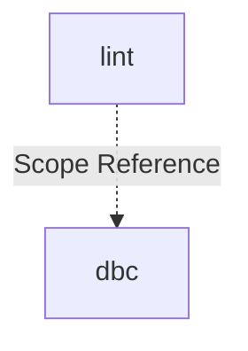

# cli: Scope Specification

## scope-type

product

## 1. Vision & Primary Goal

CLI-модуль с командами для AI-агентов. Первая команда — `lint`: трёхслойная валидация TypeScript-файлов (file header, DBC-контракты, anchor-разметка) с ESLint-совместимым выводом и autofix.

## 2. Project Type

- **Type:** cli-utility
- **Why this type:** Набор CLI-команд, запускаемых через `gennady <command>`. Вход — аргументы командной строки, выход — stdout/stderr + exit code. Без UI, без сервера.

## 3. Approved Golden DX Example

```bash
# --- happy path: всё чисто ---
$ gennady lint services/dbc/linter/dbc-linter.types.ts

# exit 0, stdout пуст

# --- ошибки: file header, контракты, anchors ---
$ gennady lint services/dbc/parser/dbc-parser.types.ts src/foo.ts

services/dbc/parser/dbc-parser.types.ts:1:1: error: ERR_CLI_LINT_MISSING_CONSUMERS  File header missing // @consumers:. Add // @consumers: <ConsumerName> before the first import.
src/foo.ts:5:3: error: ERR_DBC_LINT_MISSING_CONTRACT  Entity 'bar' has no JSDoc contract. Add /** @purpose ... */ before the exported entity.
src/foo.ts:12:1: error: ERR_CLI_LINT_ANCHOR_NESTING  END_CHECKOUT at line 12 closes parent, but START_PAYMENT at line 8 is still open. Close START_PAYMENT first.
src/foo.ts:18:1: error: ERR_CLI_LINT_ANCHOR_UNPAIRED_START  START_RETRY at line 18 has no matching END_RETRY. Add // #endregion END_RETRY.

# exit 1

# --- autofix: исправляем что можно, остаток показываем ---
$ gennady lint --autofix services/dbc/parser/dbc-parser.types.ts

Auto-fixed: 3 error(s)
services/dbc/parser/dbc-parser.types.ts:1:1: error: ERR_CLI_LINT_MISSING_CONSUMERS  File header missing // @consumers:. Add // @consumers: <ConsumerName> before the first import.

# exit 1 (одна ошибка осталась после autofix)

# --- git-режим: все изменённые/новые .ts файлы ---
$ gennady lint --staged

# exit 0

# --- комбинированный ---
$ gennady lint --staged --autofix
```

Файл читается один раз, контент передаётся во все три проверки. Сообщения об ошибках содержат: что сломано → указание на место → конкретное действие по исправлению.

## 4. Requirements & Constraints

### 4.1 Functional Requirements

| ID                  | Требование                                                                                                                                      |
| ------------------- | ----------------------------------------------------------------------------------------------------------------------------------------------- |
| **File header**     |                                                                                                                                                 |
| FR-01               | Проверить наличие `// @file:` в начале файла (до первого `import`). Отсутствие → ошибка `ERR_CLI_LINT_MISSING_FILE`                             |
| FR-02               | Проверить наличие `// @consumers:` в начале файла. Отсутствие → ошибка `ERR_CLI_LINT_MISSING_CONSUMERS`                                         |
| FR-03               | `// @tasks:` не проверяется                                                                                                                     |
| **DBC-контракты**   |                                                                                                                                                 |
| FR-04               | Запустить `DbcLinter` на каждом файле. Принимает путь ИЛИ контент через опцию (требует `refine` скоупа `dbc`)                                   |
| FR-05               | Ошибки линтера транслировать в единый ESLint-формат                                                                                             |
| **Anchor-разметка** |                                                                                                                                                 |
| FR-06               | Проверить парность: каждый `START_<NAME>` имеет `END_<NAME>` в том же файле. Непарный START → `ERR_CLI_LINT_ANCHOR_UNPAIRED_START`              |
| FR-07               | Проверить вложенность: стек открытых регионов. `END_X` закрывает последний открытый `START_X`; закрытие не того → `ERR_CLI_LINT_ANCHOR_NESTING` |
| FR-08               | Непарный `END` без `START` → `ERR_CLI_LINT_ANCHOR_UNPAIRED_END`                                                                                 |
| **Интерфейс**       |                                                                                                                                                 |
| FR-09               | Принимать список `.ts` файлов позиционными аргументами                                                                                          |
| FR-10               | Режим `--staged` — автоматический сбор `.ts` файлов из `git diff --staged --name-only` + `git ls-files --others --exclude-standard`             |
| FR-11               | Флаг `--autofix` — исправлять dbc-ошибки через `lintAndFix()`; anchor и header — только диагностика                                             |
| **Вывод**           |                                                                                                                                                 |
| FR-12               | ESLint-формат: `file:line:col: severity: code: message`. Каждое сообщение: описание проблемы + конкретное действие                              |
| FR-13               | Exit code 0 при отсутствии ошибок, 1 при наличии                                                                                                |

### 4.2 Non-Functional Constraints

- **NFC-01**: Файл читается один раз, контент передаётся во все три проверки
- **NFC-02**: Anchor-парсер — чистая функция `(content: string) → LintError[]`, без внешних зависимостей
- **NFC-03**: Коды ошибок — стабильные строковые константы c префиксом `ERR_CLI_LINT_`
- **NFC-04**: Node.js 22+, TypeScript strict mode, zero runtime dependencies
- **NFC-05**: Каждое сообщение об ошибке содержит: что сломано → указание на место → конкретное действие. Формат: `<description>. <imperative action>.`

### 4.3 Out-of-Scope

- Autofix для file header и anchor-ошибок (v1 — только диагностика)
- Поддержка языков кроме TypeScript
- Проверка XML-файлов (SDD-промты)
- Diff-стратегия (только full-file в v1)
- `--watch` режим
- Валидация содержимого `@file:` / `@consumers:` (только наличие)

### 4.4 Runtime Backing & Deferred Scope

| Capability                      | Posture                      |
| ------------------------------- | ---------------------------- |
| Чтение файлов (FS)              | `real-runtime`               |
| Git-интеграция (`--staged`)     | `real-runtime`               |
| DBC-линтинг (через `DbcLinter`) | `real-runtime`               |
| Anchor-парсинг                  | `real-runtime`               |
| File header-проверка            | `real-runtime`               |
| Autofix (dbc)                   | `real-runtime`               |
| Autofix (anchor, header)        | `not-implemented` (deferred) |
| Поддержка других языков         | `not-implemented` (deferred) |

### 4.5 Rules

| Rule               | Category | Source                                      |
| ------------------ | -------- | ------------------------------------------- |
| `typescript-rules` | coding   | `ai/directives/coding/typescript-rules.xml` |
| `node-test`        | testing  | `ai/directives/testing/node-test.xml`       |

## 5. High-Level Architecture

**Вариант А — Flat команды, общий LintRunner.**

```
cli/cmd/lint/
├── index.ts                    # import './lint.cmd.ts'
├── lint.cmd.ts                 # CLI-обвязка: parseArgs, git scan, цикл по файлам, вывод
├── lint.types.ts               # LintError, LintOptions, LintReport
├── checks/
│   ├── file-header.check.ts    # проверка // @file: + // @consumers:
│   ├── anchor.check.ts         # парность + вложенность #region START/END
│   └── dbc-contract.check.ts   # адаптер к DbcTsLinter (путь или контент)
└── __tests__/
    ├── lint.cmd.test.ts
    ├── file-header.check.test.ts
    ├── anchor.check.test.ts
    └── dbc-contract.check.test.ts
```

**Ключевые решения:**

1. **Один проход по файлу**: `lint.cmd.ts` читает контент один раз → прокидывает в 3 проверки.
2. **Адаптер к dbc**: `dbc-contract.check` создаёт `DbcTsLinter` и вызывает `lint()` / `lintAndFix()` с контентом (после `refine` dbc).
3. **Формат ошибок**: единый `LintError` — все 3 проверки возвращают один тип.
4. **Git-интеграция**: `lint.cmd.ts` собирает список файлов через `git diff --staged --name-only` и `git ls-files --others --exclude-standard`.
5. **Регистрация в `cli/gennady.ts`**: добавить `case 'lint'` в switch + обновить help и таблицу в `cli/AGENTS.md`.

### 5.1 Rejected Alternatives

| Вариант                               | Почему отвергнут                                                                                  |
| ------------------------------------- | ------------------------------------------------------------------------------------------------- |
| Shared pipeline + команды как плагины | Pipeline-абстракция для одной команды — premature (YAGNI). При добавлении второй команды — refine |
| Проверка XML-файлов (SDD-промты)      | v1 — только TypeScript. XML — deferred                                                            |
| Autofix для anchor и header           | v1 — только диагностика. Добавление autofix — отдельная задача                                    |

## 6. Decision Log

### D-001 — Архитектура Flat (Вариант А)

- **Status:** active
- **Recorded:** session Discovery, cli
- **Why:** Одна команда в v1. Pipeline-абстракция без второй команды — premature abstraction (YAGNI). Flat-структура минимизирует overhead — один файл типов, три проверки в `checks/`. При добавлении второй команды — refine с выделением общих частей.
- **Risk accepted:** При добавлении новых команд возможен перенос общих частей (git-scan, формат вывода) в `cli/cmd/_shared/`.
- **Rejected alternatives:** Shared pipeline (вариант Б) — абстракция ради одной команды без подтверждённого второго потребителя.

### D-002 — Декомпозиция: flat, один модуль `lint`

- **Status:** active
- **Recorded:** session ModuleDecomposition, cli
- **Why:** Одна команда в v1. Выделение pipeline-модуля без второго потребителя — YAGNI. При добавлении второй команды — `add-module`.
- **Risk accepted:** При добавлении новых команд потребуется `add-module` и возможно выделение общих частей.
- **Rejected alternatives:** Два модуля (`lint` + `pipeline`) — преждевременная абстракция.

## 7. Scope Dependencies

- **Depends on:**
  - [`dbc`](../dbc/dbc.spec.md) — `DbcLinter`, `DbcLintError`, `DbcLintReport`; требует `refine` для опции `content`
  - [`infra-base`](../infra-base/infra-base.spec.md) — TypeScript, node:test, prettier, Vite
- **Provides to:** AI-агенты (через CLI)

## 8. Bootstrap Requirements

| Requirement                                         | Kind          | Owner                 | Resolution                                                                                                                          |
| --------------------------------------------------- | ------------- | --------------------- | ----------------------------------------------------------------------------------------------------------------------------------- |
| `DbcLinter.lint()` с опцией `content`               | external-type | external-prereq-scope | `refine` dbc — добавить `opts?: { content?: string }` в `DbcLinter.lint(filePath, opts?)` и `DbcLinter.lintAndFix(filePath, opts?)` |
| Создать `cli/cmd/lint/index.ts`                     | file          | this-scope-task       | `import './lint.cmd.ts'`                                                                                                            |
| Создать `cli/cmd/lint/lint.cmd.ts`                  | file          | this-scope-task       | CLI-обвязка: parseArgs, git scan, вывод                                                                                             |
| Создать `cli/cmd/lint/lint.types.ts`                | file          | this-scope-task       | `LintError`, `LintOptions`, `LintReport`                                                                                            |
| Создать `cli/cmd/lint/checks/file-header.check.ts`  | file          | this-scope-task       | проверка `// @file:` + `// @consumers:`                                                                                             |
| Создать `cli/cmd/lint/checks/anchor.check.ts`       | file          | this-scope-task       | парность + вложенность START/END                                                                                                    |
| Создать `cli/cmd/lint/checks/dbc-contract.check.ts` | file          | this-scope-task       | адаптер к `DbcTsLinter`                                                                                                             |
| Обновить `cli/gennady.ts`                           | file          | this-scope-task       | добавить `case 'lint'` в switch + help                                                                                              |
| Обновить `cli/AGENTS.md`                            | file          | this-scope-task       | добавить строку `lint` в таблицу команд                                                                                             |
| Удалить `cli/cmd/lint/lint-cmd.task.spec.md`        | file          | this-scope-task       | старый spec, заменён на `specs/cli/cli.spec.md`                                                                                     |

## 9. Module Map

Spec hierarchy is materialized at `specs/cli/`. Module specs are at `specs/cli/<module>/<module>.spec.md`.

### 9.1 Modules

- [lint](./lint/lint.spec.md) — Команда `gennady lint`: file header + DBC-контракты + anchor-разметка

### 9.2 Inter-Module Dependency Map



### 9.3 Stack Dependencies

- Languages: TypeScript
- Test frameworks: node:test

### 9.4 Handoff to Task Scaffolding

- **Primary input:** `specs/cli/cli.spec.md` (this file).
- **Required directives:** `ai/directives/coding/typescript-rules.xml`, `ai/directives/testing/node-test.xml`
- **Areas requiring decomposition:** None (lint — единственный модуль)
- **Named abstractions:** `LintCommand`, `LintError`, `LintOptions`, `LintReport`, `FileHeaderCheck`, `AnchorCheck`, `DbcContractCheck`
- **Open risks & validation needs:**
  - `refine dbc` (TSK-11) должен быть выполнен до `DbcContractCheck`
  - Anchor-парсер — новая реализация
  - Git-интеграция: поведение без git-репозитория

## 11. Execution Insights

Закрытые проблемы, обнаруженные при реализации. Сохранены для будущих refin'ов и смежных скоупов.

| ID | Insight | Решение |
|---|---|---|
| I-01 | `parseArgs()` делает внутренний `.slice(2)`. При передаче `process.argv` позиционные аргументы включают имя команды. Повторный `.slice()` вне parseArgs теряет аргументы. | Фильтровать `args._` по расширению `.ts`, не делать повторный slice. Команда может запускаться по-разному (прямой импорт, tsx, npx) — структура argv нестабильна. |
| I-02 | `resolve(filePath)` даёт абсолютный путь. Если передать его в проверки, ошибки выводят `/Users/.../file.ts`, а не относительный путь из аргументов. | Использовать `resolve()` только для `readFileSync`. Во все проверки передавать оригинальный `filePath` из аргументов. |
| I-03 | `git diff --staged --name-only` и `git ls-files --others --exclude-standard` падают вне git-репозитория. | Обёрнуты в try/catch с понятным сообщением об ошибке. |
| I-04 | Unit-тесты отдельных checks не покрывают CLI-интеграцию. Баги parseArgs и filePath-неконсистентности прошли бы незамеченными без ручного тестирования. | Создан TSK-18 — интеграционные тесты CLI: parseArgs, autofix-вывод, exit codes, консистентность путей, фильтр по расширению. |
| I-05 | При autofix вывод не показывал количество исправленных ошибок — команда молча мутировала файл. | `LintReport` расширен полем `autoFixed`, вывод начинается с `Auto-fixed: N error(s)`. |

## 10. Handoff to module-decomposition

- **Primary input:** `specs/cli/cli.spec.md`
- **Areas requiring decomposition:** `lint` (первая команда), `pipeline` (общие части при добавлении второй команды)
- **Named abstractions:** `LintError`, `LintOptions`, `LintReport`, `FileHeaderCheck`, `AnchorCheck`, `DbcContractCheck`
- **Bootstrap tickets ready for cascade:** see 8
- **Open risks:**
  - `refine` dbc должен быть выполнен до реализации `dbc-contract.check.ts`
  - Anchor-парсер — новая логика, без существующей реализации
  - Git-интеграция: поведение при отсутствии git-репозитория не зафиксировано
