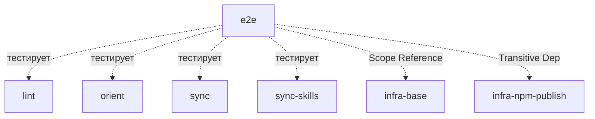

# Module: e2e

<!--SECTION:SCOPE_TYPE-->

## scope-type

product

<!--/SECTION:SCOPE_TYPE-->

<!--SECTION:MODULE_VISION-->

## 1. Module Vision

E2E-тестирование CLI-команд через локальный артефакт (`npm pack`). Создаёт `.tgz`, идентичный публикуемому в npm, устанавливает его во временный fixture-проект и запускает реальные CLI-команды как дочерние процессы. Проверяет stdout, stderr и exit code.

Родительский scope: [`cli`](../cli.spec.md). Не имеет подмодулей.

Внутренний модуль — не экспортирует публичное API. Единственная точка входа — `npm run test:e2e`.

**Out-of-Scope (v1):** E2E для `alt-opinion` (API-ключи), `cat` (сеть), `agents-rules` (тривиально), `update-check` (сеть), `sync-skills` orphan-удаление (deferred). CI-интеграция, параллельное выполнение.

<!--/SECTION:MODULE_VISION-->

<!--SECTION:MODULE_USAGE_EXAMPLE-->

## 2. Module Usage Example

```bash
# === запуск e2e-тестов ===
$ npm run test:e2e

[build] npm run build
[build] ✓ dist/gennady.js

[pack] npm pack
[pack] ✓ gennady-0.7.1.tgz

[setup] git init && git add -A
[setup] fixtures/ → /tmp/gennady-e2e-a1b2c/
[setup] npm install ./gennady-0.7.1.tgz
[setup] ✓ installed

# === lint (8 тестов) ===
▶ lint clean file
  $ npx gennady lint src/clean.ts
  ✓ exit 0

▶ lint missing @file:
  $ npx gennady lint src/no-header.ts
  ✓ exit 1
  ✓ stderr: ERR_CLI_LINT_MISSING_FILE

▶ lint missing @consumers:
  $ npx gennady lint src/no-consumers.ts
  ✓ exit 1

▶ lint unpaired anchor
  $ npx gennady lint src/bad-anchor.ts
  ✓ exit 1

▶ lint autofix
  $ npx gennady lint --autofix src/needs-autofix.ts
  ✓ exit 1

▶ lint --staged
  $ npx gennady lint --staged
  ✓ exit 0

▶ lint directory
  $ npx gennady lint src/
  ✓ exit 1

▶ lint nonexistent
  $ npx gennady lint nonexistent/
  ✓ exit 1

# === orient (6 тестов) ===
▶ orient project map
  $ npx gennady orient
  ✓ exit 0

▶ orient --task=TSK-FIX-01
  $ npx gennady orient --task=TSK-FIX-01
  ✓ exit 0

▶ orient --consumer=FixtureConsumer
  $ npx gennady orient --consumer=FixtureConsumer
  ✓ exit 0

▶ orient keyword
  $ npx gennady orient "fixture"
  ✓ exit 0

▶ orient --file
  $ npx gennady orient --file=src/service.ts
  ✓ exit 0

▶ orient --graph
  $ npx gennady orient --graph
  ✓ exit 0

# === sync (5 тестов) ===
▶ sync first run
  $ npx gennady sync
  ✓ exit 0

▶ sync repeat (unchanged)
  $ npx gennady sync
  ✓ exit 0

▶ sync --dry-run
  $ npx gennady sync --dry-run
  ✓ exit 0

▶ sync filter
  $ npx gennady sync sdd
  ✓ exit 0

▶ sync nonexistent dir
  $ npx gennady sync nonexistent/
  ✓ exit 1

# === sync skills (3 теста) ===
# [afterEach: rm -rf ai/directives/]
▶ sync-skills install + repeat
  $ npx gennady sync-skills
  ✓ exit 0

▶ sync-skills --dry-run
  $ npx gennady sync-skills --dry-run
  ✓ exit 0

▶ sync-skills filter
  $ npx gennady sync-skills sdd-execute
  ✓ exit 0

# === итог ===
✓ 22 passed (14.2s)
```

Альтернативный путь — при падении setup:

```bash
$ npm run test:e2e

[build] npm run build
[build] ✓ dist/gennady.js

[pack] npm pack
[pack] ✗ npm pack failed: npm ERR! ...

# тест падает, cleanup temp-директории
```

<!--/SECTION:MODULE_USAGE_EXAMPLE-->

<!--SECTION:ENTITY_INVENTORY-->

## 3. Entity Inventory (Closed-World)

_Это полный список сущностей модуля `e2e`. Любое введение сущности execution-агентом помимо этого списка считается drift'ом и требует обновления spec._

| Name             | Type         | Purpose                                                                             |
| ---------------- | ------------ | ----------------------------------------------------------------------------------- |
| `E2eContext`     | Value Object | Результат setup: `{ cwd, spawn, cleanup }`                                          |
| `SpawnResult`    | Value Object | Результат CLI-команды: `{ stdout, stderr, exitCode }`                               |
| `setupE2e`       | Service      | Оркестратор: build → pack → git init → cp fixture → install → E2eContext            |
| `FixtureProject` | Entity       | Статическая директория `__tests__/e2e/fixtures/` с 7 `.ts` файлами и `package.json` |

<!--/SECTION:ENTITY_INVENTORY-->

<!--SECTION:ENTITY_SURFACES-->

## 4. Entity Surfaces

### `E2eContext`

- **Type:** Value Object
- **Purpose:** Готовый к использованию контекст e2e-тестов
- **Public Properties:**
  - `cwd: string` — путь к temp-директории fixture-проекта
  - `spawn: (args: string[]) => Promise<SpawnResult>` — обёртка над `child_process.spawn('npx', ['gennady', ...args], { cwd, timeout: 30_000 })`
  - `cleanup: () => void` — `rm -rf` temp-директории
- **Lifecycle:** Создаётся `setupE2e()`, потребляется тестовыми файлами, уничтожается `cleanup()` в `after` оркестратора
- **Errors & Degradation:** N/A
- **Consumers:**
  - Internal: `lint.e2e.test.ts`, `orient.e2e.test.ts`, `sync.e2e.test.ts`, `sync-skills.e2e.test.ts`

### `SpawnResult`

- **Type:** Value Object
- **Purpose:** Результат выполнения CLI-команды
- **Public Properties:**
  - `stdout: string`
  - `stderr: string`
  - `exitCode: number`
- **Lifecycle:** Создаётся `E2eContext.spawn()`, потребляется assert-ами в тестах
- **Errors & Degradation:** N/A
- **Consumers:**
  - Internal: `lint.e2e.test.ts`, `orient.e2e.test.ts`, `sync.e2e.test.ts`, `sync-skills.e2e.test.ts`

### `setupE2e`

- **Type:** Service
- **Purpose:** Полный setup e2e-окружения
- **Public Operations:**
  - `setupE2e(): Promise<E2eContext>` — выполняет все шаги setup, возвращает готовый контекст. При падении любого шага выбрасывает ошибку с сообщением
- **Lifecycle:** Вызывается один раз в `before` оркестратора. Возвращаемый `E2eContext` живёт до `after`
- **Errors & Degradation:**
  - `build failed` — `npm run build` упал
  - `npm pack failed` — npm не установлен или permission denied
  - `fixture copy failed` — fixture-директория отсутствует или повреждена
  - `npm install failed` — диск заполнен или permission denied
  - `temp dir creation failed` — EACCES на `os.tmpdir()`
- **Consumers:**
  - Internal: `e2e.test.ts` (оркестратор)

### `FixtureProject`

- **Type:** Entity
- **Purpose:** Статическая fixture-директория с файлами для тестирования CLI-команд
- **Public Properties:**
  - `fixtures/package.json` — `{ "name": "gennady-e2e-fixture", "private": true }`
  - `fixtures/src/` — 7 `.ts` файлов:
    - `clean.ts` — `@file:`, `@consumers: FixtureConsumer`, парные anchor (валидный lint)
    - `no-header.ts` — без `@file:` (ожидается `ERR_CLI_LINT_MISSING_FILE`)
    - `no-consumers.ts` — без `@consumers:` (ожидается `ERR_CLI_LINT_MISSING_CONSUMERS`)
    - `bad-anchor.ts` — `START_X` без `END_X`, header валиден (ожидается `ERR_CLI_LINT_ANCHOR_UNPAIRED_START`)
    - `needs-autofix.ts` — DBC-ошибки, header и anchor валидны (для `--autofix`)
    - `service.ts` — для orient: `@file:`, `@tasks: TSK-FIX-01`, `@consumers: FixtureConsumer`, exports `FixtureService` с `@purpose`
    - `helper.ts` — для orient: `@file:`, `@tasks: TSK-FIX-01`, `@consumers: FixtureConsumer`, exports `FixtureHelper` с `@purpose`
- **Lifecycle:** Статический артефакт в репозитории. Копируется `setupE2e()` в temp dir при каждом запуске
- **Errors & Degradation:** При отсутствии fixture-директории — `setupE2e` падает с `fixture copy failed`
- **Consumers:**
  - Internal: `setupE2e` (копирует в temp dir)
  <!--/SECTION:ENTITY_SURFACES-->

<!--SECTION:MODULE_CONTRACTS-->

## 5. Module Contracts (DbC)

### 5.1 Service: `setupE2e`

- **Purpose:** Полный setup e2e-окружения
- **Consumers:**
  - Internal: `e2e.test.ts`
- **Runtime Backing:** `real-runtime`
- **Verification Levels:** `contract`, `e2e`
- **Deferred Runtime Scope:** None

**Contract (DbC):**

- Preconditions:
  - `npm` доступен в системе
  - `cli/__tests__/e2e/fixtures/` существует
  - `os.tmpdir()` доступен для записи
- Postconditions:
  - Возвращает `E2eContext` с готовым `{ cwd, spawn, cleanup }`
  - `dist/` содержит свежий результат `npm run build` (Vite бандл с чанками)
  - `cwd` указывает на temp-директорию с установленным gennady
  - В temp-директории инициализирован git-репозиторий, все fixture-файлы staged
- Invariants:
  - При падении любого шага — cleanup temp-директории (если была создана)
  - `cleanup()` вызывается всегда — в `after` оркестратора и при падении любого шага setup
  - `cleanup()` идемпотентен — повторный вызов безопасен

### 5.2 Value Object: `E2eContext`

- **Purpose:** Контекст для e2e-тестов
- **Runtime Backing:** `real-runtime`
- **Verification Levels:** `contract`, `e2e`

**Contract (DbC):**

- Invariants:
  - `cwd` — существующая директория
  - `spawn(args)` — вызывает `npx gennady` с аргументами в `cwd`, таймаут 30s. При таймауте выбрасывает ошибку `spawn timed out after 30s: gennady <args>`. При ENOENT (`npx` не найден) выбрасывает ошибку `npx not found`
  - `cleanup()` — идемпотентен
  - Все `spawn`-вызовы передают `GENNADY_NO_UPDATE_CHECK=1` в env
  - `afterEach` для `sync` — удаляет `ai/directives/`; `afterEach` для `sync-skills` — удаляет `.claude/skills/`. При EACCES/EBUSY ошибка пишется в stderr, но НЕ фейлит тест

### 5.3 Entity: `FixtureProject`

- **Purpose:** Статическая fixture-директория
- **Runtime Backing:** `real-runtime`
- **Verification Levels:** `e2e`

**Contract (DbC):**

- Invariants:
  - Все 7 `.ts` файлов присутствуют в `src/`
  - `package.json` содержит `{ "name": "gennady-e2e-fixture", "private": true }`
  - Все файлы с аннотациями `@consumers:` используют `FixtureConsumer`
  - Все файлы с аннотациями `@tasks:` используют `TSK-FIX-01`
  - Fixture-директория исключена из линтинга (`resolveTargets`), форматирования (`.prettierignore`) и type-check (`tsconfig.json`)
  <!--/SECTION:MODULE_CONTRACTS-->

<!--SECTION:FILE_STRUCTURE-->

## 6. File Structure

```
cli/__tests__/e2e/
├── e2e.test.ts              # Оркестратор: before(setup) → describe(lint → orient → sync → sync-skills) → after(cleanup)
├── setup.ts                 # setupE2e(): npm run build → npm pack → git init && git add -A → cp fixture → npm install → E2eContext
├── lint.e2e.test.ts         # describe('lint', ...) — 8 тестов
├── orient.e2e.test.ts       # describe('orient', ...) — 6 тестов
├── sync.e2e.test.ts         # describe('sync', ...) — 5 тестов
├── sync-skills.e2e.test.ts  # describe('sync-skills', ...) — 3 теста
└── fixtures/
    ├── package.json          # { "name": "gennady-e2e-fixture", "private": true }
    └── src/
        ├── clean.ts
        ├── no-header.ts
        ├── no-consumers.ts
        ├── bad-anchor.ts
        ├── needs-autofix.ts
        ├── service.ts
        └── helper.ts
```

**File Mapping:**

- `e2e.test.ts`: Оркестратор — `before`/`after`, последовательный вызов модульных describe-блоков
- `setup.ts`: `setupE2e()` — build, pack, git init, fixture copy, npm install, возврат `E2eContext`
- `lint.e2e.test.ts`: 8 тестов lint — описаны в FR-E2E-10/10a scope spec
- `orient.e2e.test.ts`: 6 тестов orient — описаны в FR-E2E-12/12a scope spec
- `sync.e2e.test.ts`: 5 тестов sync — описаны в FR-E2E-11 scope spec
- `sync-skills.e2e.test.ts`: 3 теста sync-skills — описаны в FR-E2E-13 scope spec
- `fixtures/`: Статическая фикстура — 7 `.ts` файлов + `package.json`
<!--/SECTION:FILE_STRUCTURE-->

<!--SECTION:MODULE_DECISION_LOG-->

## 7. Module Decision Log

### D-014 — Shared Fixture, Sequential (Variant A)

- **Status:** active
- **Recorded:** session ModuleDecomposition, cli/e2e
- **Why:** Один fixture-проект на все тесты. `npm pack` + `npm install` — один раз в `before`. Тесты последовательные: lint → orient → sync → sync-skills. Порядок важен: lint/orient — read-only, sync/sync-skills пишут. `afterEach` очищает написанное. Быстрее чем per-test setup (~12s vs ~25s).
- **Risk accepted:** Порядок тестов важен. При добавлении новых команд — добавлять после sync-skills или чистить состояние.
- **Rejected alternatives:**
  - Fresh fixture per command group (Variant B) — полная изоляция, но 2× медленнее. Избыточно для ортогональных команд.
  - Прямой запуск `dist/gennady.js` — быстрее, но не тестирует `package.json#bin` и `package.json#files`.
- **Parent:** D-013 в [`cli.spec.md`](../cli.spec.md)

### D-015 — `npm pack` как канонический артефакт

- **Status:** active
- **Recorded:** session ModuleDecomposition, cli/e2e
- **Why:** `npm pack` создаёт `.tgz`, побайтово идентичный публикуемому в npm. `npm install <путь к .tgz>` симулирует полную установку из реестра. Тесты проверяют ТОЧНО то, что получит пользователь.
- **Risk accepted:** `npm pack` + `npm install` добавляет ~5s к времени запуска. Смягчается отдельной командой `npm run test:e2e`.
- **Rejected alternatives:**
  - `npm link` — создаёт symlink, не проверяет `package.json#files`
  - Прямой запуск бандла — не тестирует установку и `package.json#bin`
  <!--/SECTION:MODULE_DECISION_LOG-->

<!--SECTION:INTER_MODULE_DEPENDENCIES-->

## 8. Inter-Module Dependencies

- **Depends on:** `lint` (команда тестируется), `orient` (команда тестируется), `sync` (команда тестируется), `sync-skills` (команда тестируется). Транзитивно: [`infra-npm-publish`](../../infra-npm-publish/infra-npm-publish.spec.md) — `ai/directives/` и `ai/skills/` должны входить в npm-пакет
- **Scope Reference (cross-scope):** [`infra-base`](../../infra-base/infra-base.spec.md) — `node:test`, Vite build
- **External:** Node.js 22+ с `npm` и `npx` в PATH (требуется для `npm pack`, `npm install`, и spawn CLI-команд)
- **Provides to:** None (internal-only модуль)



<!--/SECTION:INTER_MODULE_DEPENDENCIES-->

<!--SECTION:HANDOFF-->

## 9. Handoff to Task Scaffolding

- **Implementation files to be created:**
  - `cli/__tests__/e2e/setup.ts`
  - `cli/__tests__/e2e/e2e.test.ts`
  - `cli/__tests__/e2e/lint.e2e.test.ts`
  - `cli/__tests__/e2e/orient.e2e.test.ts`
  - `cli/__tests__/e2e/sync.e2e.test.ts`
  - `cli/__tests__/e2e/sync-skills.e2e.test.ts`
- **Test files to be created:** Все `.e2e.test.ts` файлы выше — они же являются и тестовыми файлами (запускаются через `node:test`, содержат assert-ы)
- **Fixture files to be created:**
  - `cli/__tests__/e2e/fixtures/package.json`
  - `cli/__tests__/e2e/fixtures/src/clean.ts`
  - `cli/__tests__/e2e/fixtures/src/no-header.ts`
  - `cli/__tests__/e2e/fixtures/src/no-consumers.ts`
  - `cli/__tests__/e2e/fixtures/src/bad-anchor.ts`
  - `cli/__tests__/e2e/fixtures/src/needs-autofix.ts`
  - `cli/__tests__/e2e/fixtures/src/service.ts`
  - `cli/__tests__/e2e/fixtures/src/helper.ts`
- **Structural changes:**
  - `"test:e2e"` script в `package.json`
  - `*.tgz` в `.gitignore`
  - `resolveTargets` — добавить `**/__tests__/fixtures/**` в исключения
- **Stack dependencies:**
  - Language: TypeScript (resolves to `ai/directives/coding/typescript-rules.xml`)
  - Test framework: node:test (resolves to `ai/directives/testing/node-test.xml`)
- **Module Rules Additions:** None (наследует scope-wide: `typescript-rules`, `node-test`)
- **Open risks:**
  - `spawn('npx', ...)` требует `npx` в системе (поставляется с Node.js, но может отсутствовать в минимальных Docker-образах)
  - fixture-файлы исключаются через `resolveTargets` — при изменении структуры `resolveTargets` исключение может сломаться
  - порядок тестов важен (Variant A). При добавлении новых команд — добавлять после sync-skills или явно чистить состояние
  - кроссплатформенное поведение не верифицировано — CI пока только на macOS/Linux. Windows — deferred
  - Vite-чанки с хешами — fixture пересоздаётся при каждом запуске, но изменения структуры чанков требуют пересборки
  - `npm` и `npx` должны быть доступны в системе
  <!--/SECTION:HANDOFF-->
