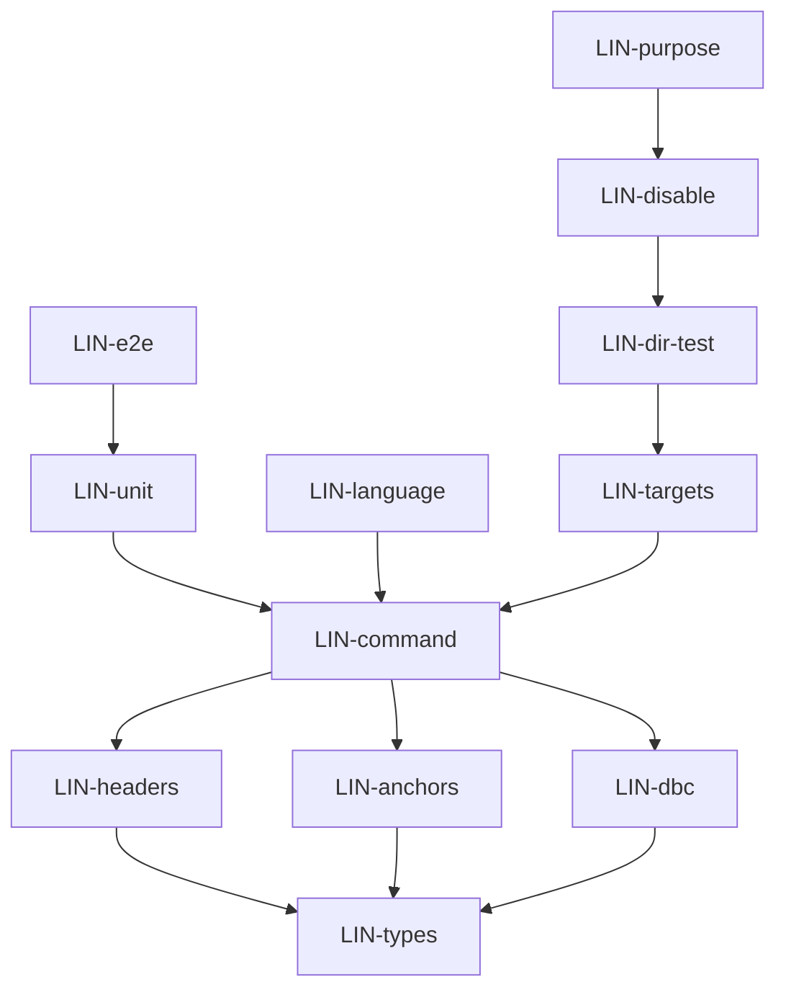

# lint — Tasks

## Tracker Index

| Task-ID      | Title                                                               | Dependencies                      | Status   | Reopens |
| ------------ | ------------------------------------------------------------------- | --------------------------------- | -------- | ------- |
| LIN-types    | Типы: LintError, LintOptions, LintReport, коды ошибок               | —                                 | [x] DONE | —       |
| LIN-headers  | FileHeaderCheck                                                     | LIN-types                         | [x] DONE | —       |
| LIN-anchors  | AnchorCheck                                                         | LIN-types                         | [x] DONE | —       |
| LIN-dbc      | DbcContractCheck                                                    | LIN-types, DL-content             | [x] DONE | —       |
| LIN-command  | LintCommand + регистрация в gennady.ts                              | LIN-headers, LIN-anchors, LIN-dbc | [x] DONE | —       |
| LIN-unit     | Тесты: проверки + интеграционные                                    | LIN-command                       | [x] DONE | —       |
| LIN-e2e      | Интеграционные тесты CLI команды lint                               | LIN-unit                          | [x] DONE | —       |
| LIN-language | LanguageCheck: проверка языка (English-only) в контрактах и хедерах | LIN-command                       | [x] DONE | —       |
| LIN-targets  | resolveTargets() + интеграция в LintCommand                         | LIN-command                       | [ ] TODO | —       |
| LIN-dir-test | Тесты resolveTargets + интеграционные тесты директорий              | LIN-targets                       | [ ] TODO | —       |
| LIN-disable  | Implement DisablesCheck (TypeScript/Linter disable discipline)      | LIN-dir-test                      | [x] DONE | —       |
| LIN-purpose  | DisablesCheck: enforce purpose text (D-007 contract tightening)     | LIN-disable                       | [x] DONE | —       |

## Slug Registry

<!-- один ID на строку; уникальность держится этим списком — одинаковый ID в двух ветках сталкивается здесь при merge. Только добавление. -->

- LIN-types
- LIN-headers
- LIN-anchors
- LIN-dbc
- LIN-command
- LIN-unit
- LIN-e2e
- LIN-language
- LIN-targets
- LIN-dir-test
- LIN-disable
- LIN-purpose

## Intra-Module DAG

<!-- ребро A → B = «A зависит от B». Кросс-модульные рёбра живут уровнем выше. -->

## Decision Log (module-task level)

<!-- решения декомпозиции/планирования; локальные решения исполнения — в Decision Log самих тикетов. -->

## Conventions

Проектные конвенции объявлены в `specs/3-tasks.md` и наследуются — здесь не повторяются.
