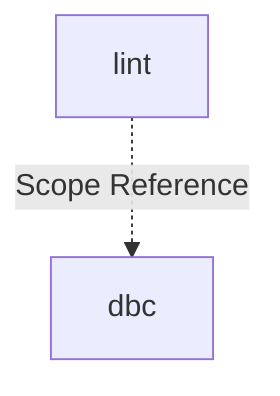

# Module: lint

## 1. Module Vision

Модуль `lint` — команда `gennady lint`: многослойная валидация TypeScript-файлов (file header, anchor-разметка, язык контрактов/хедеров, DBC-контракты, дисциплина отключений, лимит инвариантов, запрет anchor-разделителей в теле класса) с ESLint-совместимым выводом и autofix. Принимает файлы и директории — директории обходятся рекурсивно, собираются файлы поддерживаемых расширений (`.ts`, `.tsx`).

→ Parent scope: [../../cli.spec.md](../../cli.spec.md)

## 2. Entity Inventory (Closed-World)

_Это полный список сущностей модуля. Любое введение сущности execution-агентом помимо этого списка считается drift'ом и требует обновления spec._

| Name                   | Type         | Purpose                                                                                                                                                                                                                                                                                                                               |
| ---------------------- | ------------ | ------------------------------------------------------------------------------------------------------------------------------------------------------------------------------------------------------------------------------------------------------------------------------------------------------------------------------------- |
| `LintCommand`          | Service      | CLI-обвязка: parseArgs, сбор файлов из директорий (рекурсивно), git scan (`--staged`), цикл по файлам, агрегация ошибок, резолвинг связанных spec/task файлов для ошибочных файлов, вывод в ESLint-формате                                                                                                                            |
| `LintError`            | Value Object | Единый тип ошибки: `file`, `line`, `col`, `severity`, `code`, `message`                                                                                                                                                                                                                                                               |
| `LintOptions`          | Value Object | Опции запуска: `targets` (файлы + директории), `autofix`, `gitMode`                                                                                                                                                                                                                                                                   |
| `LintReport`           | Value Object | Результат линтинга: `errors`, `autoFixed`, `taskPaths`, `specPaths`, `exitCode`, `format()`                                                                                                                                                                                                                                           |
| `FileHeaderCheck`      | Service      | Проверка `// @file:` и `// @consumers:` в начале файла                                                                                                                                                                                                                                                                                |
| `LanguageCheck`        | Service      | Проверка языка: JSDoc-контракты и file headers (`@file:`, `@consumers:`) — только английский. Кириллица → `ERR_CLI_LINT_NON_ENGLISH`.                                                                                                                                                                                                 |
| `AnchorCheck`          | Service      | Проверка парности и вложенности `// #region START/END`                                                                                                                                                                                                                                                                                |
| `DbcContractCheck`     | Service      | Адаптер к `DbcTsLinter`: вызов `lint()` / `lintAndFix()` с контентом                                                                                                                                                                                                                                                                  |
| `DisablesCheck`        | Service      | Проверка дисциплины отключений TypeScript / линтера (`@ts-ignore`, `@ts-nocheck`, `@ts-expect-error`, `eslint-disable*`): каждый маркер обязан в той же строке нести (a) ссылку `D-\d+` на Decision Log, (b) purpose (≥ 8 непробельных символов после удаления маркера и токена `D-NNN`). Реализация политики D-007 из `cli.spec.md`. |
| `InvariantCountCheck`  | Service      | Проверка лимита инвариантов: подсчитывает `@invariant` в JSDoc-контрактах и `invariant:` в регион-комментариях на каждую экспортируемую сущность. Превышение порога → `ERR_CLI_LINT_TOO_MANY_INVARIANTS`.                                                                                                                             |
| `AnchorClassBodyCheck` | Service      | Проверка, что `// #region START` / `// #endregion END` не находятся на уровне тела класса (между декларациями методов). Допустимы только внутри тел методов/функций/геттеров/сеттеров. Нарушение → `ERR_CLI_LINT_ANCHOR_AT_CLASS_BODY`.                                                                                               |

## 3. Entity Surfaces

### `LintCommand`

- **Type:** Service
- **Purpose:** Точка входа команды `gennady lint`. Парсинг аргументов, резолвинг целей (файлы + директории → плоский список `.ts`/`.tsx`), оркестрация проверок, резолвинг ссылок на spec/task файлы (только для файлов с ошибками), вывод.
- **Public Operations:**
  - `run(args: string[]) → Promise<LintReport>` — выполнить линтинг
  - `resolveTargets(targets: string[]) → { files: string[]; errors: LintError[] }` — рекурсивно обойти директории, собрать файлы поддерживаемых расширений. `files` — уникальный, отсортированный список абсолютных путей к `.ts`/`.tsx`. `errors` — ошибки для целей, которые не удалось обработать (ENOENT, EACCES). Файлы других расширений молча игнорируются
- **Lifecycle:** stateless; создаётся и вызывается один раз на запуск
- **Errors & Degradation:** Не кидает исключений. Отсутствие git → ошибка при `--staged`. Нет целей → пустой отчёт.
- **Consumers:**
  - Internal: `cli/gennady.ts` (dispatch `case 'lint'`)
  - External: CLI (агент / оператор)

### `LintError`

- **Type:** Value Object
- **Purpose:** Единая модель ошибки для всех трёх проверок. ESLint-совместимый формат.
- **Public Properties:**
  - `file: string` — путь к файлу
  - `line: number` — строка (1-based)
  - `col: number` — колонка (1-based)
  - `severity: 'error'`
  - `code: string` — `ERR_CLI_LINT_*` или `ERR_DBC_LINT_*`
  - `message: string` — описание + конкретное действие
- **Lifecycle:** immutable value object
- **Consumers:**
  - Internal: `LintReport`, `FileHeaderCheck`, `AnchorCheck`, `DbcContractCheck`, `LanguageCheck`
  - External: N/A

### `LintOptions`

- **Type:** Value Object
- **Purpose:** Конфигурация одного запуска линтинга.
- **Public Properties:**
  - `targets: string[]` — список путей (`.ts`/`.tsx` файлы и/или директории)
  - `autofix: boolean` — включить autofix (dbc)
  - `gitMode?: 'staged'` — режим сбора файлов из git
- **Lifecycle:** immutable value object; создаётся `LintCommand` из аргументов
- **Consumers:**
  - Internal: `LintCommand`, `DbcContractCheck`
  - External: N/A

### `LintReport`

- **Type:** Value Object
- **Purpose:** Агрегированный результат линтинга.
- **Public Properties:**
  - `errors: LintError[]` — все ошибки (пустой массив = чисто)
  - `autoFixed: number` — количество авто-исправленных ошибок
  - `taskPaths: string[]` — пути к task-файлам, связанным с ошибочными файлами
  - `specPaths: string[]` — пути к spec-файлам, связанным с ошибочными файлами
  - `exitCode: 0 | 1`
- **Public Operations:**
  - `format() → string` — ESLint-формат: `file:line:col: severity: code: message`. Если есть ошибки — также выводит блок `Relevant specs & tasks for errors above:` с путями к связанным spec/task файлам. Если `autoFixed > 0` — первую строку `Auto-fixed: N error(s)`. | `LintReport` | `errors: LintError[]`, `autoFixed: number`, `taskPaths: string[]`, `specPaths: string[]`, `exitCode: 0 \| 1`, `format(): string` |
- **Lifecycle:** immutable value object
- **Consumers:**
  - Internal: `LintCommand` (вывод в stdout)
  - External: N/A

### `FileHeaderCheck`

- **Type:** Service
- **Purpose:** Проверка наличия `// @file:` и `// @consumers:` в начале TypeScript-файла (до первого `import`).
- **Public Operations:**
  - `check(content: string, filePath: string) → LintError[]` — проверить контент файла
- **Lifecycle:** stateless; pure function
- **Errors & Degradation:** Не кидает исключений. Отсутствие `// @file:` → `ERR_CLI_LINT_MISSING_FILE`. Отсутствие `// @consumers:` → `ERR_CLI_LINT_MISSING_CONSUMERS`.
- **Consumers:**
  - Internal: `LintCommand`
  - External: N/A

### `AnchorCheck`

- **Type:** Service
- **Purpose:** Проверка парности и вложенности `// #region START_<NAME>` / `// #endregion END_<NAME>`. Стековый алгоритм. Детектит bare `#region`/`#endregion` без `START_`/`END_` как malformed.
- **Public Operations:**
  - `check(content: string, filePath: string) → LintError[]` — проверить контент файла
- **Lifecycle:** stateless; pure function
- **Errors & Degradation:** Не кидает исключений. Непарный START → `ERR_CLI_LINT_ANCHOR_UNPAIRED_START`. Непарный END → `ERR_CLI_LINT_ANCHOR_UNPAIRED_END`. Нарушение вложенности → `ERR_CLI_LINT_ANCHOR_NESTING`. Bare `#region`/`#endregion` без `START_`/`END_` → `ERR_CLI_LINT_ANCHOR_MALFORMED`. Bare `#endregion` с непустым стеком — auto-close по вершине стека (autofix).
- **Consumers:**
  - Internal: `LintCommand`
  - External: N/A

### `DbcContractCheck`

- **Type:** Service
- **Purpose:** Адаптер к `DbcTsLinter` из scope `dbc`. Создаёт экземпляр, вызывает `lint()` или `lintAndFix()` с предварительно прочитанным контентом.
- **Public Operations:**
  - `check(content: string, filePath: string, autofix: boolean) → Promise<LintError[]>` — запустить dbc-линтер
- **Lifecycle:** stateless
- **Errors & Degradation:** Не кидает исключений. Ошибки dbc транслируются в `LintError[]`.
- **Consumers:**
  - Internal: `LintCommand`
  - External: N/A

### `LanguageCheck`

- **Type:** Service
- **Purpose:** Проверка языка: JSDoc-контракты (DbC: `@purpose`, `@implements`, `@invariant`, `@param`, `@returns`, `@consumer`, `@sideEffect`) и file headers (`// @file:`, `// @consumers:`) — только английский. Кириллица → ошибка.
- **Public Operations:**
  - `check(content: string, filePath: string) → LintError[]` — проверить контент файла на наличие кириллицы
- **Lifecycle:** stateless; pure function
- **Errors & Degradation:** Не кидает исключений. Каждый кириллический символ в JSDoc-блоке или file header → `ERR_CLI_LINT_NON_ENGLISH`. Обычные `//` комментарии и строковые литералы не проверяются.
- **Consumers:**
  - Internal: `LintCommand`
  - External: N/A

### `DisablesCheck`

- **Type:** Service
- **Purpose:** Проверка дисциплины отключений TypeScript / линтера (политика D-007 из `cli.spec.md`). Каждый маркер отключения в комментарии обязан в той же строке нести три части: (a) сам маркер, (b) `D-\d+` ссылку на Decision Log, (c) purpose-обоснование (≥ 8 непробельных символов после удаления маркера и токена `D-NNN`). Чек ортогонален ESLint и TypeScript: нельзя обойти inline-комментарием отключения, потому что сам комментарий И есть искомый паттерн.
- **Public Operations:**
  - `check(content: string, filePath: string) → LintError[]` — проверить контент файла
- **Lifecycle:** stateless; pure function
- **Errors & Degradation:** Не кидает исключений.
  - Маркер без `D-\d+` в той же строке → `ERR_CLI_LINT_UNAUTHORIZED_DISABLE`
  - Маркер с `D-\d+` но без достаточного purpose-обоснования → `ERR_CLI_LINT_DISABLE_MISSING_PURPOSE`
- **Consumers:**
  - Internal: `LintCommand`
  - External: N/A

### Value Objects

| Name          | Key Properties                                                                                                                   |
| ------------- | -------------------------------------------------------------------------------------------------------------------------------- |
| `LintError`   | `file: string`, `line: number`, `col: number`, `severity: 'error'`, `code: string`, `message: string`                            |
| `LintOptions` | `targets: string[]`, `autofix: boolean`, `gitMode?: 'staged'`                                                                    |
| `LintReport`  | `errors: LintError[]`, `autoFixed: number`, `taskPaths: string[]`, `specPaths: string[]`, `exitCode: 0 \| 1`, `format(): string` |

### Error Codes

```
ERR_CLI_LINT_MISSING_FILE     = 'ERR_CLI_LINT_MISSING_FILE'
ERR_CLI_LINT_MISSING_CONSUMERS = 'ERR_CLI_LINT_MISSING_CONSUMERS'
ERR_CLI_LINT_ANCHOR_UNPAIRED_START = 'ERR_CLI_LINT_ANCHOR_UNPAIRED_START'
ERR_CLI_LINT_ANCHOR_UNPAIRED_END   = 'ERR_CLI_LINT_ANCHOR_UNPAIRED_END'
ERR_CLI_LINT_ANCHOR_NESTING        = 'ERR_CLI_LINT_ANCHOR_NESTING'
ERR_CLI_LINT_ANCHOR_MALFORMED      = 'ERR_CLI_LINT_ANCHOR_MALFORMED'
ERR_CLI_LINT_NON_ENGLISH           = 'ERR_CLI_LINT_NON_ENGLISH'
ERR_CLI_LINT_RESOLVE_FAILED        = 'ERR_CLI_LINT_RESOLVE_FAILED'
ERR_CLI_LINT_STAGED_CONFLICT       = 'ERR_CLI_LINT_STAGED_CONFLICT'
ERR_CLI_LINT_UNAUTHORIZED_DISABLE  = 'ERR_CLI_LINT_UNAUTHORIZED_DISABLE'
ERR_CLI_LINT_DISABLE_MISSING_PURPOSE = 'ERR_CLI_LINT_DISABLE_MISSING_PURPOSE'
ERR_CLI_LINT_TOO_MANY_INVARIANTS     = 'ERR_CLI_LINT_TOO_MANY_INVARIANTS'
ERR_CLI_LINT_ANCHOR_AT_CLASS_BODY    = 'ERR_CLI_LINT_ANCHOR_AT_CLASS_BODY'
ERR_CLI_LINT_ANCHOR_CONSECUTIVE_START = 'ERR_CLI_LINT_ANCHOR_CONSECUTIVE_START'
```

## 4. Module Contracts (DbC)

### 4.3 Services

#### Service: `FileHeaderCheck`

- **Purpose:** Проверка file header в TypeScript-файле: наличие `// @file:` и `// @consumers:`.
- **Consumers:**
  - Internal: `LintCommand`
  - External: N/A
- **Runtime Backing:** `real-runtime`
- **Verification Levels:** `unit`
- **Deferred Runtime Scope:** None

**Contract (DbC):**

- Preconditions:
  - `content` — непустая строка
  - `filePath` — путь к файлу (для сообщений об ошибках)
- Postconditions:
  - Возвращает `LintError[]` (пустой если обе директивы на месте)
  - Отсутствие `// @file:` → `ERR_CLI_LINT_MISSING_FILE`
  - Отсутствие `// @consumers:` → `ERR_CLI_LINT_MISSING_CONSUMERS`
- Invariants:
  - Проверяет только строки до первого `import`
  - Не кидает исключений

#### Service: `AnchorCheck`

- **Purpose:** Проверка парности и вложенности `// #region START_<NAME>` / `// #endregion END_<NAME>`.
- **Consumers:**
  - Internal: `LintCommand`
  - External: N/A
- **Runtime Backing:** `real-runtime`
- **Verification Levels:** `unit`
- **Deferred Runtime Scope:** None

**Contract (DbC):**

- Preconditions:
  - `content` — непустая строка
- Postconditions:
  - Каждый `START_X` → push в стек
  - Каждый `END_X` → pop, сверка имени с вершиной стека
  - Несовпадение → `ERR_CLI_LINT_ANCHOR_NESTING`
  - Непустой стек в конце → `ERR_CLI_LINT_ANCHOR_UNPAIRED_START` для каждого
  - `END` без соответствующего `START` → `ERR_CLI_LINT_ANCHOR_UNPAIRED_END`
  - Bare `#endregion` без `END_<NAME>` → `ERR_CLI_LINT_ANCHOR_MALFORMED`. Если стек не пуст: auto-close (pop) + в сообщении указано ожидаемое `END_<NAME>` из вершины стека
  - Bare `#region` без `START_<NAME>` → `ERR_CLI_LINT_ANCHOR_MALFORMED`
  - Два `#region START` на одном уровне вложенности (brace depth), идущих подряд без промежуточного `#endregion END` на том же уровне → `ERR_CLI_LINT_ANCHOR_CONSECUTIVE_START`. Второй START — ошибка. Агент должен либо объединить регионы, либо закрыть первый перед открытием второго.
- Invariants:
  - Чистая функция, не зависит от внешнего состояния
  - Ошибки возвращаются в порядке сверху вниз по файлу
  - Последовательные START проверяются для одного уровня brace depth; вложенные START на разных глубинах (легитимный nesting) ошибкой не являются

#### Service: `DbcContractCheck`

- **Purpose:** Адаптер к `DbcTsLinter`. Передаёт предварительно прочитанный контент, избегая двойного чтения файла.
- **Consumers:**
  - Internal: `LintCommand`
  - External: N/A
- **Runtime Backing:** `real-runtime`
- **Verification Levels:** `integration`
- **Deferred Runtime Scope:** None
- **Scope Reference:** `dbc` — `DbcLinter`, `DbcLintError` (`../../dbc/dbc.spec.md`)

**Contract (DbC):**

- Preconditions:
  - `content` — непустая строка
  - `filePath` — путь к файлу (для сообщений об ошибках)
  - `dbc` scope предоставляет `DbcTsLinter` с опцией `content`
- Postconditions:
  - `autofix = false` → `DbcTsLinter.lint(filePath, { content })`
  - `autofix = true` → `DbcTsLinter.lintAndFix(filePath, { content })`
  - Ошибки `DbcLintError` транслируются в `LintError`
- Invariants:
  - `filePath` в ошибках — исходный путь (не подменяется)
  - `severity: 'error'` для всех ошибок

#### Service: `LanguageCheck`

- **Purpose:** Проверка языка контрактов и хедеров: в JSDoc-блоках и `// @file:` / `// @consumers:` допустим только английский. Кириллица → ошибка.
- **Consumers:**
  - Internal: `LintCommand`
  - External: N/A
- **Runtime Backing:** `real-runtime`
- **Verification Levels:** `unit`
- **Deferred Runtime Scope:** None

**Contract (DbC):**

- Preconditions:
  - `content` — непустая строка
  - `filePath` — путь к файлу (для сообщений об ошибках)
- Postconditions:
  - Возвращает `LintError[]` (пустой — кириллицы нет)
  - Каждый кириллический символ в file header (`// @file:`, `// @consumers:`) → `ERR_CLI_LINT_NON_ENGLISH`
  - Каждый кириллический символ в JSDoc-блоке (`/** ... */`) → `ERR_CLI_LINT_NON_ENGLISH`
- Invariants:
  - Проверяет ТОЛЬКО строки file header (до первого `import`) и строки внутри `/** ... */` блоков
  - Обычные `//` комментарии и строковые литералы — вне зоны проверки
  - Чистая функция, не зависит от внешнего состояния
  - Не кидает исключений

#### Service: `DisablesCheck`

- **Purpose:** Enforcement политики D-007: каждое отключение TypeScript / линтера обязано в той же строке комментария содержать ссылку `D-\d+` на Decision Log запись.
- **Consumers:**
  - Internal: `LintCommand`
  - External: N/A
- **Runtime Backing:** `real-runtime`
- **Verification Levels:** `unit`
- **Deferred Runtime Scope:** None

**Contract (DbC):**

- Preconditions:
  - `content` — непустая строка
  - `filePath` — путь к файлу (для сообщений об ошибках)
- Postconditions:
  - Возвращает `LintError[]` (пустой — все отключения корректно оформлены, либо отключений нет)
  - Маркер (`@ts-ignore`, `@ts-nocheck`, `@ts-expect-error`, `eslint-disable[*]`) в комментарии БЕЗ `D-\d+` в той же строке → `ERR_CLI_LINT_UNAUTHORIZED_DISABLE`. Сообщение содержит маркер и инструкцию добавить `D-NNN` со ссылкой на Decision Log.
  - Маркер С `D-\d+`, НО purpose-text после удаления маркера и токена `D-NNN` короче 8 непробельных символов → `ERR_CLI_LINT_DISABLE_MISSING_PURPOSE`. Сообщение содержит маркер, обнаруженный D-NNN, и инструкцию добавить purpose (≥ 8 символов).
- Invariants:
  - Маркер засчитывается ТОЛЬКО если предшествует комментарий-открывашка (`//` или `/*`) на той же строке (защита от ложноположительных в строковых литералах с похожим текстом)
  - `D-\d+` распознаётся в любой части той же строки после открывашки комментария
  - Purpose-длина считается так: из строки удаляются (1) text комментария-открывашки `//` или `/*`, (2) первое вхождение маркера, (3) первое вхождение `D-\d+` токена. Остаток нормализуется (whitespace ужимается), считаются непробельные символы. Threshold ≥ 8 — отсекает «fix», «todo», «.» и т.п., пропускает реальные обоснования вроде «abstract class instantiation gate».
  - Чистая функция, не зависит от внешнего состояния
  - Не кидает исключений
  - Multi-line `/* ... */` блоки: проверяется только строка с маркером; `D-\d+` и purpose обязаны быть на той же строке (упрощение MVP — расширение области поиска — отдельная итерация)
  - Распознавание открывашки комментария вне строковых литералов: state-machine отслеживает single-quote / double-quote / backtick с escape-rule `\` отменяет следующий символ. **Не моделируется:** template-literal interpolation `${...}`
  - Распознавание открывашки комментария вне строковых литералов: state-machine отслеживает single-quote / double-quote / backtick с escape-rule `\` отменяет следующий символ. **Не моделируется:** template-literal interpolation `${...}` (внутри которого может быть отдельный nested literal или код). Граничный кейс: `` `foo ${'bar' + // @ts-ignore`} `` потенциально может дать false-positive или false-negative; в текущей кодовой базе таких паттернов нет. Полная поддержка interpolation — отдельная итерация при появлении реальных кейсов.

#### Service: `InvariantCountCheck`

- **Purpose:** Подсчёт инвариантов на экспортируемую сущность. Суммирует `@invariant` в JSDoc и `invariant:` в регион-комментариях. Если количество > порога — сигнал агенту пересмотреть декомпозицию сущности.
- **Consumers:**
  - Internal: `LintCommand`
  - External: N/A
- **Runtime Backing:** `real-runtime`
- **Verification Levels:** `unit`
- **Deferred Runtime Scope:** None

**Contract (DbC):**

- Preconditions:
  - `content` — непустая строка
  - `filePath` — путь к файлу (для сообщений об ошибках)
  - `maxInvariants` — целое число ≥ 1 (порог)
- Postconditions:
  - Возвращает `LintError[]` (пустой — все сущности в пределах лимита)
  - Для каждой экспортируемой сущности подсчитываются инварианты двух видов **раздельно**:
    - `@invariant` в JSDoc-блоке сущности — счётчик `jsdocCount`
    - `#region START_<NAME> — invariant:` в регион-комментариях внутри сущности — счётчик `regionCount`
  - Если `jsdocCount > maxInvariants` → `LintError` с указанием типа «JSDoc @invariant tags»
  - Если `regionCount > maxInvariants` → `LintError` с указанием типа «region invariants»
  - Каждый тип проверяется независимо; если оба превышают → две ошибки на одну сущность
- Invariants:
  - JSDoc и регион-инварианты считаются раздельно (не суммируются)
  - Чистая функция, не зависит от внешнего состояния
  - Не кидает исключений

#### Service: `AnchorClassBodyCheck`

- **Purpose:** Запрет `#region START` / `#endregion END` на уровне тела класса/namespace. Регионы на top-level (вне класса) разрешены — они оборачивают функции/константы модуля. Регионы внутри тел методов/функций/геттеров/сеттеров разрешены — они оборачивают логические блоки. Запрещены только регионы, находящиеся в теле класса между декларациями членов.
- **Consumers:**
  - Internal: `LintCommand`
  - External: N/A
- **Runtime Backing:** `real-runtime`
- **Verification Levels:** `unit`
- **Deferred Runtime Scope:** None

**Contract (DbC):**

- Preconditions:
  - `content` — непустая строка
  - `filePath` — путь к файлу (для сообщений об ошибках)
- Postconditions:
  - Возвращает `LintError[]` (пустой — нарушений нет)
  - `#region START` или `#endregion END` на уровне тела класса/namespace (вне тела метода/функции/геттера/сеттера) → `ERR_CLI_LINT_ANCHOR_AT_CLASS_BODY`
  - Регионы, находящиеся внутри `{ }` тела метода/функции/геттера/сеттера → не ошибка
  - Регионы на top-level (вне какого-либо класса/namespace) → не ошибка
- Invariants:
  - Отслеживает вложенность фигурных скобок для определения контекста: тело класса vs тело метода vs top-level
  - Класс/namespace начинает новый уровень вложенности `{}`; метод/функция/геттер/сеттер внутри класса — ещё один уровень
  - Регион на уровне 1 (тело класса) → ошибка; регион на уровне ≥ 2 (тело метода) → ок; регион на уровне 0 (top-level) → ок
  - Чистая функция, не зависит от внешнего состояния
  - Не кидает исключений

### `InvariantCountCheck`

- **Type:** Service
- **Purpose:** Подсчёт инвариантов на экспортируемую сущность (функция, класс, интерфейс). Инварианты распознаются двух видов: (a) `@invariant <текст>` в JSDoc-контракте, (b) `// #region START_<NAME> — invariant: <текст>` в регион-комментариях. Каждый вид считается **раздельно** (свой счётчик). Если количество любого вида превышает настроенный порог → ошибка. Высокое количество инвариантов — сигнал, что сущность перегружена и требует декомпозиции.
- **Public Operations:**
  - `check(content: string, filePath: string, maxInvariants: number) → LintError[]` — проверить файл на превышение лимита инвариантов
- **Lifecycle:** stateless; pure function
- **Errors & Degradation:** Не кидает исключений. Количество инвариантов > `maxInvariants` → `ERR_CLI_LINT_TOO_MANY_INVARIANTS`. При подсчёте оба вида инвариантов суммируются в общий счётчик на сущность.
- **Consumers:**
  - Internal: `LintCommand`
  - External: N/A

### `AnchorClassBodyCheck`

- **Type:** Service
- **Purpose:** Запрет `// #region START` / `// #endregion END` на уровне тела класса. Регионы допустимы только внутри тел методов/функций/геттеров/сеттеров — для оборачивания логических блоков. Регионы между декларациями методов (на уровне тела класса) запрещены.
- **Public Operations:**
  - `check(content: string, filePath: string) → LintError[]` — проверить файл на наличие anchor-разделителей в теле класса
- **Lifecycle:** stateless; pure function
- **Errors & Degradation:** Не кидает исключений. `#region START` или `#endregion END` на уровне тела класса (вне тела метода/функции/геттера/сеттера) → `ERR_CLI_LINT_ANCHOR_AT_CLASS_BODY`.
- **Consumers:**
  - Internal: `LintCommand`
  - External: N/A

## 5. Public Options & Policies

| Option             | Bound to                                    | Status        |
| ------------------ | ------------------------------------------- | ------------- |
| `--autofix`        | `LintCommand.run()` → `DbcContractCheck`    | active (v1)   |
| `--staged`         | `LintCommand.run()` → git scan              | active (v1)   |
| `--max-invariants` | `LintCommand.run()` → `InvariantCountCheck` | active (v1)   |
| `--exclude`        | `LintCommand.run()` → file filtering        | active (v1)   |
| `--changed`        | —                                           | deferred (v2) |

**`--max-invariants` contract:**

- Тип: `number`, целое ≥ 1
- По умолчанию: `3`
- Если не указан явно — используется значение по умолчанию
- Передаётся в `InvariantCountCheck.check(content, filePath, maxInvariants)`

**`--exclude` contract:**

- Тип: `string` (glob-паттерн), можно указывать несколько раз
- Назначение: исключить файлы из линтинга по glob-паттерну, применённому к относительному пути от `cwd`
- Множественное указание: `--exclude "**/*.test.ts" --exclude "**/fixtures/**"` → оба паттерна активны
- Дефолтные паттерны (всегда активны, даже без явного `--exclude`):
  - `**/node_modules/**`
  - `**/__tests__/**`
  - `**/fixtures/**`
  - `**/dist/**`
  - `**/coverage/**`
  - `**/build/**`
  - `**/out/**`
- Пользовательские паттерны добавляются поверх дефолтных
- Фильтрация применяется после сбора файлов (`resolveTargets` / `--staged`), перед линтингом
- Glob-синтаксис: `*` (кроме `/`), `**` (включая `/`), `?` (один символ), `[...]` (класс символов)

### Supported Extensions

Линтер объявляет поддерживаемые расширения: `.ts`, `.tsx`. При обходе директорий и явной передаче файлов — линтер собирает ТОЛЬКО файлы этих расширений. Файлы с другими расширениями молча игнорируются — это не ошибка, а штатная фильтрация. Линтер линтит только то, что умеет.

Сравнение расширений — **регистро-независимое** (`.TS` ≡ `.ts`, `.Tsx` ≡ `.tsx`).

### Directory Resolution Contract (`resolveTargets`)

**Правила обхода директорий:**

| Правило                                   | Поведение                                                                                                 |
| ----------------------------------------- | --------------------------------------------------------------------------------------------------------- |
| Рекурсивность                             | По умолчанию, без флага `--recursive`                                                                     |
| Фильтр расширений                         | Только `.ts`, `.tsx` (регистро-независимо). Остальные файлы — молча игнорируются, включая явно переданные |
| Дедупликация                              | Файлы возвращаются уникальными. Если файл передан явно и он же найден в директории — один экземпляр       |
| Сортировка                                | Результат отсортирован по абсолютному пути (детерминированный порядок)                                    |
| Относительные пути                        | Нормализуются в абсолютные через `path.resolve()`                                                         |
| Символические ссылки                      | Не следуем. `lstat` вместо `stat`; symlink-директории не обходятся                                        |
| Скрытые директории (`.`-префикс)          | Пропускаются (`.git`, `.DS_Store`). Скрытые файлы — пропускаются                                          |
| `node_modules`                            | Пропускается при рекурсивном обходе                                                                       |
| `dist`, `coverage`, `build`, `out`        | Пропускаются при рекурсивном обходе                                                                       |
| Пустая директория                         | Ошибок нет, файлов нет                                                                                    |
| Несуществующий путь (`ENOENT`)            | Ошибка `ERR_CLI_LINT_RESOLVE_FAILED` в `errors[]`, цель пропускается                                      |
| Нет прав на чтение (`EACCES`)             | Ошибка `ERR_CLI_LINT_RESOLVE_FAILED` в `errors[]`, цель пропускается                                      |
| Спецсимволы / пробелы / кириллица в путях | Корректная обработка через `fs` API                                                                       |

**Контракт `resolveTargets`:**

- **Preconditions:**
  - `targets` — массив строк (пути к файлам или директориям, относительные или абсолютные)
- **Postconditions:**
  - `files` — уникальный, отсортированный список **абсолютных** путей к `.ts`/`.tsx` файлам
  - `errors` — `LintError[]` для целей, которые не удалось обработать
  - Если после фильтрации не осталось валидных файлов → `files: []`, ошибки в `errors[]`. Команда завершается с пустым отчётом и `exitCode: 0`
  - Если есть и валидные файлы, и ошибки → валидные линтятся, ошибки выводятся в stderr
- **Invariants:**
  - Не кидает исключений (все ошибки — в возвращаемом `errors[]`)
  - Порядок `errors[]` соответствует порядку `targets[]`
  - Файлы в `node_modules` не попадают в результат даже при явной передаче директории `node_modules/`
  - Не следует по симлинкам: `lstat` на каждом элементе, symlink → пропуск

## 6. File Structure

```
cli/cmd/lint/
├── index.ts                    # import './lint.cmd.ts'
├── lint.cmd.ts                 # LintCommand.run()
├── lint.types.ts               # LintError, LintOptions, LintReport, константы ошибок
├── checks/
│   ├── file-header.check.ts    # FileHeaderCheck.check()
│   ├── language.check.ts       # LanguageCheck.check()
│   ├── anchor.check.ts         # AnchorCheck.check()
│   ├── disables.check.ts       # DisablesCheck.check()
│   ├── dbc-contract.check.ts   # DbcContractCheck.check()
│   ├── invariant-count.check.ts # InvariantCountCheck.check()
│   └── anchor-class-body.check.ts # AnchorClassBodyCheck.check()
├── utils/
│   └── resolve-references.fn.ts # loadTaskReferences(), extractTaskIdsFromHeader(), resolveReferencesForTasks()
└── __tests__/
    ├── lint.cmd.test.ts
    ├── file-header.check.test.ts
    ├── language.check.test.ts
    ├── anchor.check.test.ts
    ├── disables.check.test.ts
    ├── dbc-contract.check.test.ts
    ├── invariant-count.check.test.ts
    └── anchor-class-body.check.test.ts
```

**File Mapping:**

- `lint.cmd.ts`: `LintCommand`
- `lint.types.ts`: `LintError`, `LintOptions`, `LintReport`, 9 × `ERR_CLI_LINT_*`
- `checks/file-header.check.ts`: `FileHeaderCheck`
- `checks/language.check.ts`: `LanguageCheck`
- `checks/anchor.check.ts`: `AnchorCheck`
- `checks/disables.check.ts`: `DisablesCheck`
- `checks/dbc-contract.check.ts`: `DbcContractCheck`
- `checks/invariant-count.check.ts`: `InvariantCountCheck`
- `checks/anchor-class-body.check.ts`: `AnchorClassBodyCheck`
- `utils/resolve-references.fn.ts`: `ResolvedReference`, `loadTaskReferences()`, `extractTaskIdsFromHeader()`, `resolveReferencesForTasks()`

## 6.1 Test Scenarios

### Unit: `resolveTargets()` (изолированно, с моком `fs`)

| ID    | Сценарий                                                             | Ожидаемый результат                                                                 |
| ----- | -------------------------------------------------------------------- | ----------------------------------------------------------------------------------- |
| UT-01 | Пустой массив целей                                                  | `{ files: [], errors: [] }`                                                         |
| UT-02 | Один `.ts` файл (существует)                                         | `{ files: [absPath], errors: [] }`                                                  |
| UT-03 | Один `.tsx` файл (существует)                                        | `{ files: [absPath], errors: [] }`                                                  |
| UT-04 | Один `.js` файл (явно передан)                                       | `{ files: [], errors: [] }` — молча игнорируется                                    |
| UT-05 | Директория с `.ts`, `.tsx`, `.js`, `.json`                           | `files` содержит только `.ts`/`.tsx`; `.js`/`.json` молча пропущены                 |
| UT-06 | Вложенные директории (2 уровня)                                      | Рекурсивный сбор всех `.ts`/`.tsx` на всех уровнях                                  |
| UT-07 | Расширение в верхнем регистре (`.TS`, `.TSX`)                        | Файлы попадают в `files` (регистро-независимое сравнение)                           |
| UT-08 | Дубликат: файл + директория с этим же файлом                         | Файл в `files` ровно один раз                                                       |
| UT-09 | Два одинаковых файла разными путями (symlink / relative vs absolute) | Дедупликация по `realpath`; один экземпляр                                          |
| UT-10 | Несуществующий путь (`ENOENT`)                                       | `{ files: [], errors: [ERR_CLI_LINT_RESOLVE_FAILED] }`                              |
| UT-11 | Нет прав на чтение (`EACCES`)                                        | `{ files: [], errors: [ERR_CLI_LINT_RESOLVE_FAILED] }`                              |
| UT-12 | Смешанные цели: валидный файл + несуществующий + EACCES              | Валидный в `files`, ошибки в `errors[]`, порядок ошибок соответствует порядку целей |
| UT-13 | Директория с symlink на другую директорию                            | Symlink-директория не обходится (пропуск)                                           |
| UT-14 | Директория с symlink на `.ts` файл                                   | Symlink-файл не включается (пропуск)                                                |
| UT-15 | Директория с циклическим symlink                                     | Не зависает; symlink не обходится                                                   |
| UT-16 | Пустая директория                                                    | `{ files: [], errors: [] }`                                                         |
| UT-17 | Директория только с неподдерживаемыми расширениями                   | `{ files: [], errors: [] }`                                                         |
| UT-18 | `node_modules/` — передан явно                                       | `files: []`, содержимое `node_modules` не обходится                                 |
| UT-19 | Скрытая директория (`.git/`)                                         | Пропускается при рекурсивном обходе                                                 |
| UT-20 | `dist/`, `coverage/`, `build/`, `out/`                               | Пропускаются при рекурсивном обходе                                                 |
| UT-21 | Сортировка: файлы из разных директорий                               | `files` отсортирован по абсолютному пути                                            |
| UT-22 | Относительный путь → нормализация                                    | Все пути в `files` — абсолютные                                                     |
| UT-23 | Пробелы в путях                                                      | Корректная обработка                                                                |
| UT-24 | Кириллица в путях                                                    | Корректная обработка                                                                |

### Integration: `lint.cmd.test.ts` (CLI-обвязка)

| ID    | Сценарий                                      | Ожидаемый результат                                                                   |
| ----- | --------------------------------------------- | ------------------------------------------------------------------------------------- |
| IT-01 | Запуск без аргументов                         | Пустой отчёт, exit 0                                                                  |
| IT-02 | Один `.ts` файл с ошибками                    | ESLint-формат ошибок в stdout, exit 1                                                 |
| IT-03 | Один `.ts` файл без ошибок                    | Пустой stdout, exit 0                                                                 |
| IT-04 | Явно передан `.js` файл                       | Пустой отчёт, exit 0 (молча игнорируется)                                             |
| IT-05 | Директория с `.ts`/`.tsx` (есть ошибки)       | Все файлы пролинчены, агрегированный вывод ошибок, exit 1                             |
| IT-06 | Директория без поддерживаемых файлов          | Пустой отчёт, exit 0                                                                  |
| IT-07 | Смешанный ввод: файл + директория             | Дедупликация (если файл в директории — один экземпляр), exit по наличию ошибок        |
| IT-08 | Несуществующий файл                           | `ERR_CLI_LINT_RESOLVE_FAILED` в stderr, exit 0                                        |
| IT-09 | Файл без прав на чтение                       | `ERR_CLI_LINT_RESOLVE_FAILED` в stderr, exit 0                                        |
| IT-10 | Частичный сбой: 1 валидный + 1 несуществующий | Валидный пролинчен, ошибка для несуществующего в stderr, exit по ошибкам линтинга     |
| IT-11 | `--staged` без git-репозитория                | Ошибка в stderr, exit 0                                                               |
| IT-12 | `--staged` с staged `.ts` файлами             | Линтятся только staged файлы, exit по ошибкам                                         |
| IT-13 | `--staged` + позиционные цели                 | Ошибка: флаги взаимоисключающие, exit 1                                               |
| IT-14 | `--autofix` с директорией                     | Исправлены dbc-ошибки во всех файлах, вывод `Auto-fixed: N error(s)`, exit по остатку |
| IT-15 | `--staged --autofix`                          | Autofix применён к staged файлам, exit по остатку                                     |
| IT-16 | Директория с 1000+ файлов (дымовой тест)      | Завершается без падения, в разумное время                                             |
| IT-17 | Директория `node_modules/` передана явно      | Пустой отчёт (содержимое не обходится), exit 0                                        |
| IT-18 | Все цели невалидны (3 несуществующих пути)    | 3 ошибки в stderr, пустой отчёт, exit 0                                               |
| IT-19 | Пути с пробелами и кириллицей                 | Корректная обработка, ошибки линтинга с правильными путями                            |

### Unit: `DisablesCheck` (`disables.check.test.ts`)

| ID    | Сценарий                                                              | Ожидаемый результат                                                                         |
| ----- | --------------------------------------------------------------------- | ------------------------------------------------------------------------------------------- |
| DC-01 | Contract typing — shape `check(content, filePath) → LintError[]`      | Compile-pass; tsc возвращает `LintError[]` без `as any` в тесте                             |
| DC-02 | Пустой контент                                                        | `[]`                                                                                        |
| DC-03 | `// @ts-expect-error: D-042 — reason` (валидный)                      | `[]`                                                                                        |
| DC-04 | `// @ts-expect-error: Cannot instantiate abstract class` (нет D-NNN)  | 1 error `ERR_CLI_LINT_UNAUTHORIZED_DISABLE`                                                 |
| DC-05 | `// @ts-ignore` без D-NNN                                             | 1 error                                                                                     |
| DC-06 | `// @ts-nocheck` без D-NNN                                            | 1 error                                                                                     |
| DC-07 | `// eslint-disable-next-line no-explicit-any -- D-017` (валидный)     | `[]`                                                                                        |
| DC-08 | `// eslint-disable-next-line no-explicit-any` (нет D-NNN)             | 1 error                                                                                     |
| DC-09 | `// eslint-disable` (файловый, нет D-NNN)                             | 1 error                                                                                     |
| DC-10 | `/* @ts-ignore: D-099 */` block (валидный)                            | `[]`                                                                                        |
| DC-11 | `/* @ts-ignore */` block без D-NNN                                    | 1 error                                                                                     |
| DC-12 | Inline trailing: `code(); // @ts-expect-error D-042`                  | `[]`                                                                                        |
| DC-13 | Inline trailing без D-NNN: `code(); // @ts-expect-error`              | 1 error                                                                                     |
| DC-14 | Строковый литерал содержит `@ts-ignore`                               | `[]` (нет открывашки комментария перед маркером)                                            |
| DC-15 | Несколько маркеров в файле: 2 валидных, 1 невалидный                  | 1 error                                                                                     |
| DC-16 | `D-7` (одна цифра)                                                    | Валидный — `\bD-\d+\b` матчит                                                               |
| DC-17 | `D-042` в комментарии БЕЗ маркера отключения                          | `[]` — чек не активен                                                                       |
| DC-18 | Маркер в строке с file-header `// @file: ... D-042`                   | `[]` — file-header не несёт маркер отключения                                               |
| DC-19 | Капитализация D-NNN: `d-042`, `D-NNN`, `d42`                          | `d-042` валидный (case-insensitive `D`); `D-NNN` невалидный (нужны цифры); `d42` невалидный |
| DC-20 | Колонка ошибки указывает на позицию маркера                           | `col` = индекс начала маркера в строке + 1                                                  |
| DC-21 | `// @ts-expect-error: D-042` — D-NNN есть, purpose отсутствует        | 1 error `ERR_CLI_LINT_DISABLE_MISSING_PURPOSE`                                              |
| DC-22 | `// @ts-ignore D-042 fix` — purpose только 3 непробельных символа     | 1 error `ERR_CLI_LINT_DISABLE_MISSING_PURPOSE`                                              |
| DC-23 | `// @ts-ignore: D-042 — abstract class gate` — 26+ символов purpose   | `[]`                                                                                        |
| DC-24 | `// eslint-disable-next-line foo -- D-017` — purpose только rule name | 1 error `ERR_CLI_LINT_DISABLE_MISSING_PURPOSE` (rule `foo` — часть конструкции, не purpose) |
| DC-25 | `/* @ts-ignore: D-099 */` — purpose пуст                              | 1 error `ERR_CLI_LINT_DISABLE_MISSING_PURPOSE`                                              |

### Unit: `AnchorCheck` — consecutive START (`anchor.check.test.ts`)

**Правило**: два `#region START` на одном уровне brace depth, идущих подряд без промежуточного `#endregion END` на том же уровне → `ERR_CLI_LINT_ANCHOR_CONSECUTIVE_START` на втором START. Вложенные START на разных глубинах (легитимный nesting) — не ошибка.

| ID    | Сценарий                                                                                                | Результат                                                                                                         |
| ----- | ------------------------------------------------------------------------------------------------------- | ----------------------------------------------------------------------------------------------------------------- |
| CS-01 | Один `#region START` с парным END — без ошибок                                                          | `[]`                                                                                                              |
| CS-02 | `START_A` → `END_A` → `START_B` → `END_B` (последовательно, не подряд)                                  | `[]`                                                                                                              |
| CS-03 | `START_A` → `START_B` на соседних строках, один уровень (top-level)                                     | 1 error `ERR_CLI_LINT_ANCHOR_CONSECUTIVE_START` на START_B                                                        |
| CS-04 | `START_A` → `START_B` на соседних строках, внутри метода класса (оба на глубине метода)                 | 1 error на START_B                                                                                                |
| CS-05 | `START_A` → пустая строка → `START_B` (одна пустая строка между)                                        | 1 error на START_B                                                                                                |
| CS-06 | `START_A` → `// комментарий` → `START_B` (комментарий между, один уровень)                              | 1 error на START_B                                                                                                |
| CS-07 | `START_A` на top-level → `START_B` внутри функции (разные глубины) — легитимный nesting                 | `[]`                                                                                                              |
| CS-08 | `START_A` на top-level → `START_B` внутри метода класса (разные глубины) — легитимный nesting           | `[]`                                                                                                              |
| CS-09 | `START_A` внутри метода → `START_B` глубже (внутри if внутри того же метода) — легитимный nesting       | `[]`                                                                                                              |
| CS-10 | `START_A` → код (не регион) → `START_B` (есть значимый код между)                                       | `[]` (между ними есть тело региона)                                                                               |
| CS-11 | `START_A` → `END_A` → `START_B` → `START_C` (C подряд после закрытого A)                                | 1 error на START_C (B и C на одном уровне подряд, B не закрыт)                                                    |
| CS-12 | `START_A` → `START_B` (ошибка на B) → `END_B` → `END_A` (вложенность корректна после ошибки)            | 1 error (только consecutive START)                                                                                |
| CS-13 | `START_A` → `START_B` → `START_C` (три подряд на одном уровне)                                          | 2 errors (на START_B и START_C)                                                                                   |
| CS-14 | `START_A` → `START_B` ошибка → `START_C` ошибка → `END_C` → `END_B` → `END_A` (triple consecutive)      | 2 errors                                                                                                          |
| CS-15 | `START_A` внутри метода класса → `START_B` на уровне тела класса (разные глубины) — nesting разрешён    | `[]` (разные глубины)                                                                                             |
| CS-16 | `START_A` на уровне тела класса → `START_B` на уровне тела класса (одинаковая глубина)                  | 2 errors: ERR_CLI_LINT_ANCHOR_AT_CLASS_BODY (оба на уровне тела) + ERR_CLI_LINT_ANCHOR_CONSECUTIVE_START (подряд) |
| CS-17 | `START_A` → `START_B` на разных глубинах, но обе внутри одного метода: A в методе, B в if внутри метода | `[]` (разные глубины — легитимный nesting)                                                                        |
| CS-18 | `START_A` → `START_B` где A и B имеют одинаковую глубину, но между ними `END_X` другого региона         | `[]` (END_X другого региона между ними — не consecutive)                                                          |
| CS-19 | `START_A` → `START_B` с одинаковой глубиной, но A на строке 5, B на строке 100 (много кода между)       | `[]` (между ними тело региона A с кодом)                                                                          |

### Unit: `InvariantCountCheck` (`invariant-count.check.test.ts`)

**Инварианты считаются на каждую экспортируемую сущность отдельно** (функция, класс, интерфейс). Источники: `@invariant` в JSDoc + `#region START_<NAME> — invariant:` в регион-комментариях внутри тела сущности. Регион-инварианты относятся к ближайшей объемлющей экспортируемой сущности.

| ID    | Сценарий                                                                                 | Ожидаемый результат                                    |
| ----- | ---------------------------------------------------------------------------------------- | ------------------------------------------------------ |
| IC-01 | Пустой файл                                                                              | `[]`                                                   |
| IC-02 | Файл без экспортируемых сущностей                                                        | `[]`                                                   |
| IC-03 | Экспортируемая функция без инвариантов                                                   | `[]`                                                   |
| IC-04 | Экспортируемый класс без инвариантов                                                     | `[]`                                                   |
| IC-05 | Экспортируемый интерфейс без инвариантов                                                 | `[]`                                                   |
| IC-06 | 1 `@invariant` на функцию (порог 3)                                                      | `[]`                                                   |
| IC-07 | 2 `@invariant` на класс (порог 3)                                                        | `[]`                                                   |
| IC-08 | 3 `@invariant` на функцию (порог 3, равно порогу)                                        | `[]`                                                   |
| IC-09 | 4 `@invariant` на класс (порог 3, превышение)                                            | 1 error                                                |
| IC-10 | 5 `@invariant` на функцию (порог 3)                                                      | 1 error                                                |
| IC-11 | 1 регион-инвариант внутри тела функции (порог 3)                                         | `[]`                                                   |
| IC-12 | 3 регион-инварианта внутри тела класса (порог 3, равно порогу)                           | `[]`                                                   |
| IC-13 | 4 регион-инварианта внутри тела функции (порог 3, превышение)                            | 1 error                                                |
| IC-14 | 2 `@invariant` + 2 регион-инварианта = 4, класс (порог 3, превышение)                    | 1 error                                                |
| IC-15 | 1 `@invariant` + 1 регион-инвариант = 2, функция (порог 3)                               | `[]`                                                   |
| IC-16 | Три экспортируемые функции: 2 инв., 4 инв., 1 инв. (порог 3)                             | 1 error (только для функции с 4 инв.)                  |
| IC-17 | Два класса: оба превышают порог (5 и 6 инв., порог 3)                                    | 2 errors                                               |
| IC-18 | Класс + функция: класс превышает (5 инв.), функция нет (2 инв., порог 3)                 | 1 error (только класс)                                 |
| IC-19 | Порог = 1, функция с 1 инвариантом (равно)                                               | `[]`                                                   |
| IC-20 | Порог = 1, функция с 2 инвариантами (превышение)                                         | 1 error                                                |
| IC-21 | Порог = 5, функция с 5 инвариантами (равно)                                              | `[]`                                                   |
| IC-22 | Порог = 5, функция с 6 инвариантами (превышение)                                         | 1 error                                                |
| IC-23 | Порог = 10, класс с 10 регион-инвариантами (равно)                                       | `[]`                                                   |
| IC-24 | Регион без `invariant:` — не считается                                                   | Не влияет на счётчик                                   |
| IC-25 | Регион с `invariant:` но без текста после `:` — считается (присутствует)                 | Засчитывается как 1 инвариант                          |
| IC-26 | Регион-инвариант внутри метода класса — относится к классу                               | Засчитывается в счётчик класса                         |
| IC-27 | Регион-инвариант вне экспортируемой сущности (на top-level) — не относится ни к кому     | Игнорируется (нет объемлющей экспортируемой сущности)  |
| IC-28 | `@invariant` на не-экспортируемой функции — не считается                                 | Игнорируется                                           |
| IC-29 | Регион-инвариант внутри не-экспортируемой функции — не считается                         | Игнорируется                                           |
| IC-30 | 3 сущности, все на грани порога: 3, 3, 3 (порог 3)                                       | `[]` (ни одна не превышает)                            |
| IC-31 | 3 сущности: 4, 4, 4 (порог 3)                                                            | 3 errors                                               |
| IC-32 | Интерфейс с 4 `@invariant` (порог 3)                                                     | 1 error                                                |
| IC-33 | Экспортируемая `const` (не функция/класс/интерфейс) с `@invariant` — не считается        | `[]` (не поддерживаемый тип сущности для подсчёта)     |
| IC-34 | Регион-инвариант внутри вложенной функции (функция внутри функции) — относится к внешней | Засчитывается в счётчик внешней экспортируемой функции |
| IC-35 | Регион-инвариант внутри замыкания (стрелочная функция) внутри метода класса              | Засчитывается в счётчик класса                         |
| IC-36 | Порог не указан — используется дефолт 3                                                  | Порог = 3                                              |

### Unit: `AnchorClassBodyCheck` (`anchor-class-body.check.test.ts`)

**Правило**: `#region START` / `#endregion END` запрещены на уровне тела класса/namespace. Допустимы только внутри тел методов/функций/геттеров/сеттеров (brace depth >= 2 относительно начала класса). Top-level функции (вне класса) — регионы допустимы.

Обозначения: ✅ = ошибок нет, ❌ = `ERR_CLI_LINT_ANCHOR_AT_CLASS_BODY`.

#### Группа A: Top-level (нет класса)

| ID    | Сценарий                                                           | Результат |
| ----- | ------------------------------------------------------------------ | --------- |
| AB-01 | Top-level функция без регионов                                     | ✅        |
| AB-02 | Регион оборачивает одну top-level функцию (START перед, END после) | ✅        |
| AB-03 | Регион оборачивает несколько top-level функций                     | ✅        |
| AB-04 | START и END оба внутри одной top-level функции                     | ✅        |
| AB-05 | START вне функции, END внутри той же функции (рассечение)          | ✅        |

#### Группа B: Класс — регионы внутри методов (валидные)

| ID    | Сценарий                                                                           | Результат |
| ----- | ---------------------------------------------------------------------------------- | --------- |
| AB-06 | Класс без регионов                                                                 | ✅        |
| AB-07 | Регион внутри тела метода (START и END внутри `{ }` метода)                        | ✅        |
| AB-08 | Регион внутри геттера                                                              | ✅        |
| AB-09 | Регион внутри сеттера                                                              | ✅        |
| AB-10 | Регион внутри конструктора                                                         | ✅        |
| AB-11 | Регион внутри статического метода                                                  | ✅        |
| AB-12 | Регион внутри асинхронного метода (`async`)                                        | ✅        |
| AB-13 | Регион внутри метода с модификатором доступа (`private`, `protected`)              | ✅        |
| AB-14 | Два региона внутри одного метода (последовательные, не вложенные)                  | ✅        |
| AB-15 | Вложенные регионы внутри одного метода (один внутри другого)                       | ✅        |
| AB-16 | Регион внутри стрелочной функции — свойства класса (`foo = () => { ... }`)         | ✅        |
| AB-17 | Регион внутри `if` блока внутри метода                                             | ✅        |
| AB-18 | Регион внутри `for` цикла внутри метода                                            | ✅        |
| AB-19 | Регион внутри `while` цикла внутри метода                                          | ✅        |
| AB-20 | Регион внутри `try/catch` внутри метода                                            | ✅        |
| AB-21 | Регион внутри `switch` блока внутри метода                                         | ✅        |
| AB-22 | Регион внутри вложенной функции внутри метода (function declaration внутри метода) | ✅        |
| AB-23 | Регион внутри вложенной стрелочной функции внутри метода                           | ✅        |
| AB-24 | Регион на нескольких уровнях вложенности: метод → if → for → регион                | ✅        |

#### Группа C: Класс — регионы на уровне тела класса (ошибки)

| ID    | Сценарий                                                                            | Результат                                                                    |
| ----- | ----------------------------------------------------------------------------------- | ---------------------------------------------------------------------------- |
| AB-25 | START и END на уровне тела класса (между методами)                                  | ❌                                                                           |
| AB-26 | START и END на уровне тела класса, оборачивают один метод полностью                 | ❌                                                                           |
| AB-27 | START и END на уровне тела класса, оборачивают несколько методов                    | ❌                                                                           |
| AB-28 | START и END на уровне тела класса, пустой регион (ничего между ними)                | ❌                                                                           |
| AB-29 | START и END на уровне тела класса, оборачивают свойство (не метод)                  | ❌                                                                           |
| AB-30 | START между методами, END между методами ниже (разные позиции, оба на уровне тела)  | ❌                                                                           |
| AB-31 | Только START на уровне тела класса (без END в файле)                                | ❌ (START; также возможен ERR_CLI_LINT_ANCHOR_UNPAIRED_START от AnchorCheck) |
| AB-32 | Только END на уровне тела класса (без START в файле)                                | ❌ (END; также возможен ERR_CLI_LINT_ANCHOR_UNPAIRED_END от AnchorCheck)     |
| AB-33 | Три региона на уровне тела класса в одном классе                                    | 3 errors                                                                     |
| AB-34 | Регион на уровне тела класса с `extends`                                            | ❌                                                                           |
| AB-35 | Регион на уровне тела класса с `implements`                                         | ❌                                                                           |
| AB-36 | Регион на уровне тела абстрактного класса (`abstract class`)                        | ❌                                                                           |
| AB-37 | Регион на уровне тела класса, экспортируемого по умолчанию (`export default class`) | ❌                                                                           |

#### Группа D: Класс — рассечение метода (ошибки на одной из границ)

| ID    | Сценарий                                                                                              | Результат                        |
| ----- | ----------------------------------------------------------------------------------------------------- | -------------------------------- |
| AB-38 | START на уровне тела класса, END внутри метода (регион рассекает метод: начало снаружи, конец внутри) | ❌ (только START на уровне тела) |
| AB-39 | START внутри метода, END на уровне тела класса (регион рассекает метод: начало внутри, конец снаружи) | ❌ (только END на уровне тела)   |
| AB-40 | START на уровне тела класса, END внутри метода другого класса (файл с 2 классами)                     | ❌ (только START)                |
| AB-41 | START на уровне тела класса → пустая строка → декларация метода → тело метода → END внутри тела       | ❌ (START) + метод рассечён      |

#### Группа E: Namespace

| ID    | Сценарий                                             | Результат |
| ----- | ---------------------------------------------------- | --------- |
| AB-42 | Namespace без регионов                               | ✅        |
| AB-43 | Регион на уровне тела namespace (между функциями)    | ❌        |
| AB-44 | Регион внутри функции внутри namespace               | ✅        |
| AB-45 | Класс внутри namespace, регион на уровне тела класса | ❌        |
| AB-46 | Класс внутри namespace, регион внутри метода класса  | ✅        |

#### Группа F: Несколько классов / смешанные сценарии

| ID    | Сценарий                                                                              | Результат                     |
| ----- | ------------------------------------------------------------------------------------- | ----------------------------- |
| AB-47 | Два класса в одном файле: оба с регионами на уровне тела                              | 2 errors (по одному на класс) |
| AB-48 | Два класса: один с регионом внутри метода (✅), другой с регионом на уровне тела (❌) | 1 error                       |
| AB-49 | Три класса: все с регионами на уровне тела                                            | 3 errors                      |
| AB-50 | Класс с регионом внутри метода (✅) + top-level функция с регионом (✅)               | ✅                            |
| AB-51 | Класс с регионом на уровне тела (❌) + top-level функция с регионом (✅)              | 1 error (только класс)        |
| AB-52 | Класс с 2 регионами внутри методов (✅) и 2 регионами на уровне тела (❌)             | 2 errors                      |

#### Группа G: Краевые случаи парсинга `{ }`

| ID    | Сценарий                                                                                 | Результат                                                                            |
| ----- | ---------------------------------------------------------------------------------------- | ------------------------------------------------------------------------------------ |
| AB-53 | `{` в строковом литерале внутри метода (`const x = "{"`) — не влияет на подсчёт глубины  | ✅ (регион внутри метода корректен)                                                  |
| AB-54 | `}` в строковом литерале внутри метода (`const x = "}"`) — не влияет                     | ✅                                                                                   |
| AB-55 | `{` в строковом литерале на уровне тела класса — не влияет                               | ✅ (нет ложного входа в тело метода)                                                 |
| AB-56 | Объектный литерал в свойстве класса (`private foo = { bar: 1 }`) — не создаёт «метод»    | ✅ (регион после такого свойства — всё ещё уровень тела класса → ❌ если регион там) |
| AB-57 | Деструктуризация в параметре метода (`function foo({ a, b }: T)`) — не влияет на глубину | ✅ (регион внутри метода корректен)                                                  |
| AB-58 | Деструктуризация на уровне тела класса (`private { a, b } = obj`) — не влияет            | ✅ (не создаёт ложного тела метода)                                                  |
| AB-59 | Шаблонная строка с `${}` внутри метода — не влияет на подсчёт                            | ✅                                                                                   |
| AB-60 | `{` в комментарии на уровне тела класса — не влияет                                      | ✅                                                                                   |
| AB-61 | `}` в комментарии внутри метода — не влияет                                              | ✅                                                                                   |
| AB-62 | Пустой метод (`foo() {}`) — регион «внутри» невозможен (нет тела)                        | Если регион между `()` и `{}` → ❌ (на уровне тела)                                  |
| AB-63 | Абстрактный метод (`abstract foo(): void`) — нет тела, регион рядом → уровень тела       | ❌ (регион на уровне тела)                                                           |
| AB-64 | Метод с телом на следующей строке после сигнатуры                                        | ✅ (регион внутри тела на следующей строке — ок)                                     |
| AB-65 | Класс с телом на следующей строке после `class Foo`                                      | ✅ / ❌ (корректное определение входа в тело класса)                                 |
| AB-66 | Generic-класс (`class Foo<T> { ... }`)                                                   | ✅ / ❌ (корректное определение класса с generic-параметром)                         |
| AB-67 | Generic-метод (`foo<T>(x: T): void { ... }`)                                             | ✅ (регион внутри — ок)                                                              |

### Unit: Exclude glob filtering (`lint.cmd.test.ts`)

| ID    | Сценарий                                                                          | Ожидаемый результат                                      |
| ----- | --------------------------------------------------------------------------------- | -------------------------------------------------------- |
| EX-01 | Без `--exclude` — дефолтные паттерны активны, `__tests__/` файлы исключены        | Файлы из `__tests__/` не линтятся                        |
| EX-02 | Без `--exclude` — дефолтные паттерны активны, `fixtures/` файлы исключены         | Файлы из `fixtures/` не линтятся                         |
| EX-03 | `--exclude "**/*.test.ts"` — исключает тестовые файлы по расширению               | `.test.ts` файлы не линтятся                             |
| EX-04 | `--exclude "**/*.special.ts"` — исключает конкретный файл по имени                | `special.ts` файл не линтится                            |
| EX-05 | Два `--exclude`: `--exclude "**/a/**" --exclude "**/b/**"` — оба активны          | Файлы из `a/` и `b/` исключены, `c/` линтится            |
| EX-06 | `--exclude "**/dir/**"` — исключает все файлы в конкретной директории             | Файлы в `dir/` и её поддиректориях исключены             |
| EX-07 | `--exclude` с паттерном, который ничему не соответствует                          | Все файлы линтятся (нет ложных исключений)               |
| EX-08 | `--staged --exclude "**/*.test.ts"` — exclude работает вместе с --staged          | Staged `.test.ts` файлы исключены                        |
| EX-09 | Дефолтный `**/node_modules/**` исключает файлы даже при явной передаче директории | Файлы из `node_modules/` не линтятся                     |
| EX-10 | Пользовательский `--exclude` не отменяет дефолтные — оба набора работают          | И дефолтные, и пользовательские паттерны исключают файлы |

## 7. Module Decision Log

- D-005 (scope) — Поддержка директорий: рекурсивный обход, `.ts`/`.tsx`, без флага `--recursive`
- D-006 (scope) — resolveTargets: дедупликация, сортировка, игнор node_modules/скрытых/symlink, регистро-независимые расширения, ENOENT/EACCES → ошибки в errors[]
- D-007 (scope) — TypeScript/Linter Disable Discipline: `DisablesCheck` реализует enforcement; каждое отключение обязано нести `D-\d+` ссылку
- D-008 (module) — Invariant limit: `InvariantCountCheck` с порогом `--max-invariants=3` по умолчанию. JSDoc `@invariant` и регион `invariant:` считаются **раздельно** (разный scope). Каждый тип сравнивается с порогом независимо. Превышение → `ERR_CLI_LINT_TOO_MANY_INVARIANTS` (error) с указанием типа (JSDoc / region).
- D-009 (module) — Anchor class body boundary: `AnchorClassBodyCheck` запрещает `#region START` / `#endregion END` на уровне тела класса. Регионы допустимы внутри тел методов и на top-level. Top-level регионы оборачивают функции модуля.
- D-010 (module) — Anchor consecutive START: `AnchorCheck` детектит два `#region START` подряд на одном уровне brace depth без промежуточного `#endregion END`. Ошибка на втором START → `ERR_CLI_LINT_ANCHOR_CONSECUTIVE_START`. Агент должен либо объединить регионы, либо закрыть первый.
- D-011 (module) — Exclude glob filtering: `--exclude` опция с glob-паттернами для исключения файлов из линтинга. Дефолтные паттерны: `node_modules`, `__tests__`, `fixtures`, `dist`, `coverage`, `build`, `out`. Можно указать несколько пользовательских паттернов, они добавляются поверх дефолтных.
- Все архитектурные решения — на уровне scope (D-001, D-002 в `cli.spec.md`).

## 8. Inter-Module Dependencies

- **Depends on:** N/A (единственный модуль в scope)
- **Scope Reference (cross-scope):** [`dbc`](../../dbc/dbc.spec.md) — `DbcLinter`, `DbcLintError`, `DbcLintReport`
- **Provides to:** N/A



## 9. Handoff to Task Scaffolding

- **Implementation files to be created:**
  - `cli/cmd/lint/index.ts`
  - `cli/cmd/lint/lint.cmd.ts`
  - `cli/cmd/lint/lint.types.ts`
  - `cli/cmd/lint/checks/file-header.check.ts`
  - `cli/cmd/lint/checks/language.check.ts`
  - `cli/cmd/lint/checks/anchor.check.ts`
  - `cli/cmd/lint/checks/dbc-contract.check.ts`
  - `cli/cmd/lint/checks/disables.check.ts`
  - `cli/cmd/lint/checks/invariant-count.check.ts`
  - `cli/cmd/lint/checks/anchor-class-body.check.ts`
- **Test files to be created:**
  - `cli/cmd/lint/__tests__/lint.cmd.test.ts` (19 интеграционных сценариев — см. 6.1)
  - `cli/cmd/lint/__tests__/file-header.check.test.ts`
  - `cli/cmd/lint/__tests__/language.check.test.ts`
  - `cli/cmd/lint/__tests__/anchor.check.test.ts`
  - `cli/cmd/lint/__tests__/dbc-contract.check.test.ts`
  - `cli/cmd/lint/__tests__/disables.check.test.ts` (25 юнит-сценариев — см. 6.1)
  - `cli/cmd/lint/__tests__/resolve-targets.test.ts` (24 юнит-сценария — см. 6.1)
  - `cli/cmd/lint/__tests__/invariant-count.check.test.ts` (36 юнит-сценариев — см. 6.1)
  - `cli/cmd/lint/__tests__/anchor-class-body.check.test.ts` (67 юнит-сценариев — см. 6.1)
- **Stack dependencies:**
  - Language: `TypeScript` (resolves to `ai/directives/coding/typescript-rules.xml`)
  - Test framework: `node:test` (resolves to `ai/directives/testing/node-test.xml`)
- **Module Rules Additions:** None (scope-wide baseline достаточен)

- **Open risks & validation needs:**
  - `refine dbc` (TSK-11) должен быть выполнен до реализации `DbcContractCheck`
  - Anchor-парсер — новая логика, без существующей реализации; требует тщательного тестирования краевых случаев
  - Git-интеграция: поведение при отсутствии git-репозитория
  - `cli/gennady.ts` и `cli/AGENTS.md` требуют обновления для регистрации команды
  - `resolveTargets`: тестирование symlink-циклов требует осторожной настройки временной FS в тестах
  - `resolveTargets`: поведение на Windows (регистр, слеши, скрытые файлы) требует верификации
  - `InvariantCountCheck`: парсинг JSDoc-контрактов требует интеграции с DbC-парсером или собственного легковесного извлечения `@invariant`; избежать дублирования логики парсинга
  - `AnchorClassBodyCheck`: детекция тела класса через отслеживание `{}`-вложенности; краевые случаи — стрелочные функции с `{}`, деструктуризация, object literals
  - `--max-invariants`: параметр нужно зарегистрировать в `parseArgs` (`lint.cmd.ts`) и в help-сообщении `gennady.ts`
  - Интеграционные тесты `lint.cmd.test.ts` должны покрыть новые чеки в общем пайплайне
  - `--staged` + позиционные цели: запрет должен быть реализован на уровне парсинга аргументов
