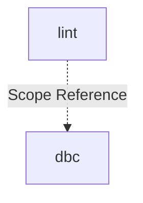

# Module: lint

## 1. Module Vision

Модуль `lint` — команда `gennady lint`: четырёхслойная валидация TypeScript-файлов (file header, anchor-разметка, язык контрактов/хедеров, DBC-контракты) с ESLint-совместимым выводом и autofix. Принимает файлы и директории — директории обходятся рекурсивно, собираются файлы поддерживаемых расширений (`.ts`, `.tsx`).

→ Parent scope: [../../cli.spec.md](../../cli.spec.md)

## 2. Entity Inventory (Closed-World)

_Это полный список сущностей модуля. Любое введение сущности execution-агентом помимо этого списка считается drift'ом и требует обновления spec._

| Name               | Type         | Purpose                                                                                                                               |
| ------------------ | ------------ | ------------------------------------------------------------------------------------------------------------------------------------- |
| `LintCommand`      | Service      | CLI-обвязка: parseArgs, сбор файлов из директорий (рекурсивно), git scan (`--staged`), цикл по файлам, агрегация ошибок, вывод в ESLint-формате |
| `LintError`        | Value Object | Единый тип ошибки: `file`, `line`, `col`, `severity`, `code`, `message`                                                               |
| `LintOptions`      | Value Object | Опции запуска: `targets` (файлы + директории), `autofix`, `gitMode`                                                                     |
| `LintReport`       | Value Object | Результат линтинга: `errors`, `exitCode`, `format()`                                                                                  |
| `FileHeaderCheck`  | Service      | Проверка `// @file:` и `// @consumers:` в начале файла                                                                                |
| `LanguageCheck`    | Service      | Проверка языка: JSDoc-контракты и file headers (`@file:`, `@consumers:`) — только английский. Кириллица → `ERR_CLI_LINT_NON_ENGLISH`. |
| `AnchorCheck`      | Service      | Проверка парности и вложенности `// #region START/END`                                                                                |
| `DbcContractCheck` | Service      | Адаптер к `DbcTsLinter`: вызов `lint()` / `lintAndFix()` с контентом                                                                  |
| `DisablesCheck`    | Service      | Проверка: каждое отключение TypeScript / линтера (`@ts-ignore`, `@ts-nocheck`, `@ts-expect-error`, `eslint-disable*`) обязано в той же строке нести ссылку `D-\d+` на Decision Log запись. Реализация политики D-007 из `cli.spec.md`. |

## 3. Entity Surfaces

### `LintCommand`

- **Type:** Service
- **Purpose:** Точка входа команды `gennady lint`. Парсинг аргументов, резолвинг целей (файлы + директории → плоский список `.ts`/`.tsx`), оркестрация проверок, вывод.
- **Public Operations:**
  - `run(args: string[]) → Promise<LintReport>` — выполнить линтинг
  - `resolveTargets(targets: string[]) → { files: string[]; errors: LintError[] }` — рекурсивно обойти директории, собрать файлы поддерживаемых расширений. `files` — уникальный, отсортированный список абсолютных путей к `.ts`/`.tsx`. `errors` — ошибки для целей, которые не удалось обработать (ENOENT, EACCES). Файлы других расширений молча игнорируются
- **Lifecycle:** stateless; создаётся и вызывается один раз на запуск
- **Errors & Degradation:** Не кидает исключений. Отсутствие git → ошибка при `--staged`. Нет целей → пустой отчёт.
- **Consumers:**
  - Internal: `cli/gennady.ts` (dispatch `case 'lint'`)
  - External: CLI (агент / оператор)

### `LintError`

- **Type:** Value Object
- **Purpose:** Единая модель ошибки для всех трёх проверок. ESLint-совместимый формат.
- **Public Properties:**
  - `file: string` — путь к файлу
  - `line: number` — строка (1-based)
  - `col: number` — колонка (1-based)
  - `severity: 'error'`
  - `code: string` — `ERR_CLI_LINT_*` или `ERR_DBC_LINT_*`
  - `message: string` — описание + конкретное действие
- **Lifecycle:** immutable value object
- **Consumers:**
  - Internal: `LintReport`, `FileHeaderCheck`, `AnchorCheck`, `DbcContractCheck`, `LanguageCheck`
  - External: N/A

### `LintOptions`

- **Type:** Value Object
- **Purpose:** Конфигурация одного запуска линтинга.
- **Public Properties:**
  - `targets: string[]` — список путей (`.ts`/`.tsx` файлы и/или директории)
  - `autofix: boolean` — включить autofix (dbc)
  - `gitMode?: 'staged'` — режим сбора файлов из git
- **Lifecycle:** immutable value object; создаётся `LintCommand` из аргументов
- **Consumers:**
  - Internal: `LintCommand`, `DbcContractCheck`
  - External: N/A

### `LintReport`

- **Type:** Value Object
- **Purpose:** Агрегированный результат линтинга.
- **Public Properties:**
  - `errors: LintError[]` — все ошибки (пустой массив = чисто)
  - `exitCode: 0 | 1`
- **Public Operations:**
  - `format() → string` — ESLint-формат: `file:line:col: severity: code: message`
- **Lifecycle:** immutable value object
- **Consumers:**
  - Internal: `LintCommand` (вывод в stdout)
  - External: N/A

### `FileHeaderCheck`

- **Type:** Service
- **Purpose:** Проверка наличия `// @file:` и `// @consumers:` в начале TypeScript-файла (до первого `import`).
- **Public Operations:**
  - `check(content: string, filePath: string) → LintError[]` — проверить контент файла
- **Lifecycle:** stateless; pure function
- **Errors & Degradation:** Не кидает исключений. Отсутствие `// @file:` → `ERR_CLI_LINT_MISSING_FILE`. Отсутствие `// @consumers:` → `ERR_CLI_LINT_MISSING_CONSUMERS`.
- **Consumers:**
  - Internal: `LintCommand`
  - External: N/A

### `AnchorCheck`

- **Type:** Service
- **Purpose:** Проверка парности и вложенности `// #region START_<NAME>` / `// #endregion END_<NAME>`. Стековый алгоритм. Детектит bare `#region`/`#endregion` без `START_`/`END_` как malformed.
- **Public Operations:**
  - `check(content: string, filePath: string) → LintError[]` — проверить контент файла
- **Lifecycle:** stateless; pure function
- **Errors & Degradation:** Не кидает исключений. Непарный START → `ERR_CLI_LINT_ANCHOR_UNPAIRED_START`. Непарный END → `ERR_CLI_LINT_ANCHOR_UNPAIRED_END`. Нарушение вложенности → `ERR_CLI_LINT_ANCHOR_NESTING`. Bare `#region`/`#endregion` без `START_`/`END_` → `ERR_CLI_LINT_ANCHOR_MALFORMED`. Bare `#endregion` с непустым стеком — auto-close по вершине стека (autofix).
- **Consumers:**
  - Internal: `LintCommand`
  - External: N/A

### `DbcContractCheck`

- **Type:** Service
- **Purpose:** Адаптер к `DbcTsLinter` из scope `dbc`. Создаёт экземпляр, вызывает `lint()` или `lintAndFix()` с предварительно прочитанным контентом.
- **Public Operations:**
  - `check(content: string, filePath: string, autofix: boolean) → Promise<LintError[]>` — запустить dbc-линтер
- **Lifecycle:** stateless
- **Errors & Degradation:** Не кидает исключений. Ошибки dbc транслируются в `LintError[]`.
- **Consumers:**
  - Internal: `LintCommand`
  - External: N/A

### `LanguageCheck`

- **Type:** Service
- **Purpose:** Проверка языка: JSDoc-контракты (DbC: `@purpose`, `@implements`, `@invariant`, `@param`, `@returns`, `@consumer`, `@sideEffect`) и file headers (`// @file:`, `// @consumers:`) — только английский. Кириллица → ошибка.
- **Public Operations:**
  - `check(content: string, filePath: string) → LintError[]` — проверить контент файла на наличие кириллицы
- **Lifecycle:** stateless; pure function
- **Errors & Degradation:** Не кидает исключений. Каждый кириллический символ в JSDoc-блоке или file header → `ERR_CLI_LINT_NON_ENGLISH`. Обычные `//` комментарии и строковые литералы не проверяются.
- **Consumers:**
  - Internal: `LintCommand`
  - External: N/A

### `DisablesCheck`

- **Type:** Service
- **Purpose:** Проверка дисциплины отключений TypeScript / линтера (политика D-007 из `cli.spec.md`). Каждое вхождение маркера отключения в комментарии обязано в той же строке нести ссылку `D-\d+`. Чек ортогонален ESLint и TypeScript: нельзя обойти inline-комментарием отключения, потому что сам комментарий И есть искомый паттерн.
- **Public Operations:**
  - `check(content: string, filePath: string) → LintError[]` — проверить контент файла
- **Lifecycle:** stateless; pure function
- **Errors & Degradation:** Не кидает исключений. Каждое отключение без `D-\d+` в той же строке → `ERR_CLI_LINT_UNAUTHORIZED_DISABLE`.
- **Consumers:**
  - Internal: `LintCommand`
  - External: N/A

### Value Objects

| Name          | Key Properties                                                                                        |
| ------------- | ----------------------------------------------------------------------------------------------------- |
| `LintError`   | `file: string`, `line: number`, `col: number`, `severity: 'error'`, `code: string`, `message: string` |
| `LintOptions` | `targets: string[]`, `autofix: boolean`, `gitMode?: 'staged'`                                             |
| `LintReport`  | `errors: LintError[]`, `exitCode: 0 \| 1`, `format(): string`                                         |

### Error Codes

```
ERR_CLI_LINT_MISSING_FILE     = 'ERR_CLI_LINT_MISSING_FILE'
ERR_CLI_LINT_MISSING_CONSUMERS = 'ERR_CLI_LINT_MISSING_CONSUMERS'
ERR_CLI_LINT_ANCHOR_UNPAIRED_START = 'ERR_CLI_LINT_ANCHOR_UNPAIRED_START'
ERR_CLI_LINT_ANCHOR_UNPAIRED_END   = 'ERR_CLI_LINT_ANCHOR_UNPAIRED_END'
ERR_CLI_LINT_ANCHOR_NESTING        = 'ERR_CLI_LINT_ANCHOR_NESTING'
ERR_CLI_LINT_ANCHOR_MALFORMED      = 'ERR_CLI_LINT_ANCHOR_MALFORMED'
ERR_CLI_LINT_NON_ENGLISH           = 'ERR_CLI_LINT_NON_ENGLISH'
ERR_CLI_LINT_RESOLVE_FAILED        = 'ERR_CLI_LINT_RESOLVE_FAILED'
ERR_CLI_LINT_STAGED_CONFLICT       = 'ERR_CLI_LINT_STAGED_CONFLICT'
ERR_CLI_LINT_UNAUTHORIZED_DISABLE  = 'ERR_CLI_LINT_UNAUTHORIZED_DISABLE'
```

## 4. Module Contracts (DbC)

### 4.3 Services

#### Service: `FileHeaderCheck`

- **Purpose:** Проверка file header в TypeScript-файле: наличие `// @file:` и `// @consumers:`.
- **Consumers:**
  - Internal: `LintCommand`
  - External: N/A
- **Runtime Backing:** `real-runtime`
- **Verification Levels:** `unit`
- **Deferred Runtime Scope:** None

**Contract (DbC):**

- Preconditions:
  - `content` — непустая строка
  - `filePath` — путь к файлу (для сообщений об ошибках)
- Postconditions:
  - Возвращает `LintError[]` (пустой если обе директивы на месте)
  - Отсутствие `// @file:` → `ERR_CLI_LINT_MISSING_FILE`
  - Отсутствие `// @consumers:` → `ERR_CLI_LINT_MISSING_CONSUMERS`
- Invariants:
  - Проверяет только строки до первого `import`
  - Не кидает исключений

#### Service: `AnchorCheck`

- **Purpose:** Проверка парности и вложенности `// #region START_<NAME>` / `// #endregion END_<NAME>`.
- **Consumers:**
  - Internal: `LintCommand`
  - External: N/A
- **Runtime Backing:** `real-runtime`
- **Verification Levels:** `unit`
- **Deferred Runtime Scope:** None

**Contract (DbC):**

- Preconditions:
  - `content` — непустая строка
- Postconditions:
  - Каждый `START_X` → push в стек
  - Каждый `END_X` → pop, сверка имени с вершиной стека
  - Несовпадение → `ERR_CLI_LINT_ANCHOR_NESTING`
  - Непустой стек в конце → `ERR_CLI_LINT_ANCHOR_UNPAIRED_START` для каждого
  - `END` без соответствующего `START` → `ERR_CLI_LINT_ANCHOR_UNPAIRED_END`
  - Bare `#endregion` без `END_<NAME>` → `ERR_CLI_LINT_ANCHOR_MALFORMED`. Если стек не пуст: auto-close (pop) + в сообщении указано ожидаемое `END_<NAME>` из вершины стека
  - Bare `#region` без `START_<NAME>` → `ERR_CLI_LINT_ANCHOR_MALFORMED`
- Invariants:
  - Чистая функция, не зависит от внешнего состояния
  - Ошибки возвращаются в порядке сверху вниз по файлу

#### Service: `DbcContractCheck`

- **Purpose:** Адаптер к `DbcTsLinter`. Передаёт предварительно прочитанный контент, избегая двойного чтения файла.
- **Consumers:**
  - Internal: `LintCommand`
  - External: N/A
- **Runtime Backing:** `real-runtime`
- **Verification Levels:** `integration`
- **Deferred Runtime Scope:** None
- **Scope Reference:** `dbc` — `DbcLinter`, `DbcLintError` (`../../dbc/dbc.spec.md`)

**Contract (DbC):**

- Preconditions:
  - `content` — непустая строка
  - `filePath` — путь к файлу (для сообщений об ошибках)
  - `dbc` scope предоставляет `DbcTsLinter` с опцией `content`
- Postconditions:
  - `autofix = false` → `DbcTsLinter.lint(filePath, { content })`
  - `autofix = true` → `DbcTsLinter.lintAndFix(filePath, { content })`
  - Ошибки `DbcLintError` транслируются в `LintError`
- Invariants:
  - `filePath` в ошибках — исходный путь (не подменяется)
  - `severity: 'error'` для всех ошибок

#### Service: `LanguageCheck`

- **Purpose:** Проверка языка контрактов и хедеров: в JSDoc-блоках и `// @file:` / `// @consumers:` допустим только английский. Кириллица → ошибка.
- **Consumers:**
  - Internal: `LintCommand`
  - External: N/A
- **Runtime Backing:** `real-runtime`
- **Verification Levels:** `unit`
- **Deferred Runtime Scope:** None

**Contract (DbC):**

- Preconditions:
  - `content` — непустая строка
  - `filePath` — путь к файлу (для сообщений об ошибках)
- Postconditions:
  - Возвращает `LintError[]` (пустой — кириллицы нет)
  - Каждый кириллический символ в file header (`// @file:`, `// @consumers:`) → `ERR_CLI_LINT_NON_ENGLISH`
  - Каждый кириллический символ в JSDoc-блоке (`/** ... */`) → `ERR_CLI_LINT_NON_ENGLISH`
- Invariants:
  - Проверяет ТОЛЬКО строки file header (до первого `import`) и строки внутри `/** ... */` блоков
  - Обычные `//` комментарии и строковые литералы — вне зоны проверки
  - Чистая функция, не зависит от внешнего состояния
  - Не кидает исключений

#### Service: `DisablesCheck`

- **Purpose:** Enforcement политики D-007: каждое отключение TypeScript / линтера обязано в той же строке комментария содержать ссылку `D-\d+` на Decision Log запись.
- **Consumers:**
  - Internal: `LintCommand`
  - External: N/A
- **Runtime Backing:** `real-runtime`
- **Verification Levels:** `unit`
- **Deferred Runtime Scope:** None

**Contract (DbC):**

- Preconditions:
  - `content` — непустая строка
  - `filePath` — путь к файлу (для сообщений об ошибках)
- Postconditions:
  - Возвращает `LintError[]` (пустой — все отключения с `D-\d+`, либо отключений нет)
  - Каждое вхождение маркера (`@ts-ignore`, `@ts-nocheck`, `@ts-expect-error`, `eslint-disable[*]`) в комментарии БЕЗ `D-\d+` в той же строке → `ERR_CLI_LINT_UNAUTHORIZED_DISABLE`
  - Сообщение об ошибке содержит обнаруженный маркер и инструкцию: «add `D-NNN` reference pointing to a Decision Log entry in the same comment»
- Invariants:
  - Маркер засчитывается ТОЛЬКО если предшествует комментарий-открывашка (`//` или `/*`) на той же строке (защита от ложноположительных в строковых литералах с похожим текстом)
  - `D-\d+` распознаётся в любой части той же строки после открывашки комментария
  - Чистая функция, не зависит от внешнего состояния
  - Не кидает исключений
  - Multi-line `/* ... */` блоки: проверяется только строка с маркером; `D-\d+` обязан быть на той же строке (упрощение MVP — расширение области поиска — отдельная итерация)

## 5. Public Options & Policies

| Option      | Bound to                                 | Status        |
| ----------- | ---------------------------------------- | ------------- |
| `--autofix` | `LintCommand.run()` → `DbcContractCheck` | active (v1)   |
| `--staged`  | `LintCommand.run()` → git scan           | active (v1)   |
| `--changed` | —                                        | deferred (v2) |

### Supported Extensions

Линтер объявляет поддерживаемые расширения: `.ts`, `.tsx`. При обходе директорий и явной передаче файлов — линтер собирает ТОЛЬКО файлы этих расширений. Файлы с другими расширениями молча игнорируются — это не ошибка, а штатная фильтрация. Линтер линтит только то, что умеет.

Сравнение расширений — **регистро-независимое** (`.TS` ≡ `.ts`, `.Tsx` ≡ `.tsx`).

### Directory Resolution Contract (`resolveTargets`)

**Правила обхода директорий:**

| Правило                                           | Поведение                                                                                        |
| ------------------------------------------------- | ------------------------------------------------------------------------------------------------ |
| Рекурсивность                                     | По умолчанию, без флага `--recursive`                                                            |
| Фильтр расширений                                 | Только `.ts`, `.tsx` (регистро-независимо). Остальные файлы — молча игнорируются, включая явно переданные |
| Дедупликация                                      | Файлы возвращаются уникальными. Если файл передан явно и он же найден в директории — один экземпляр |
| Сортировка                                        | Результат отсортирован по абсолютному пути (детерминированный порядок)                            |
| Относительные пути                                | Нормализуются в абсолютные через `path.resolve()`                                                 |
| Символические ссылки                              | Не следуем. `lstat` вместо `stat`; symlink-директории не обходятся                                |
| Скрытые директории (`.`-префикс)                  | Пропускаются (`.git`, `.DS_Store`). Скрытые файлы — пропускаются                                  |
| `node_modules`                                    | Пропускается при рекурсивном обходе                                                              |
| `dist`, `coverage`, `build`, `out`                | Пропускаются при рекурсивном обходе                                                              |
| Пустая директория                                 | Ошибок нет, файлов нет                                                                           |
| Несуществующий путь (`ENOENT`)                    | Ошибка `ERR_CLI_LINT_RESOLVE_FAILED` в `errors[]`, цель пропускается                              |
| Нет прав на чтение (`EACCES`)                     | Ошибка `ERR_CLI_LINT_RESOLVE_FAILED` в `errors[]`, цель пропускается                              |
| Спецсимволы / пробелы / кириллица в путях         | Корректная обработка через `fs` API                                                              |

**Контракт `resolveTargets`:**

- **Preconditions:**
  - `targets` — массив строк (пути к файлам или директориям, относительные или абсолютные)
- **Postconditions:**
  - `files` — уникальный, отсортированный список **абсолютных** путей к `.ts`/`.tsx` файлам
  - `errors` — `LintError[]` для целей, которые не удалось обработать
  - Если после фильтрации не осталось валидных файлов → `files: []`, ошибки в `errors[]`. Команда завершается с пустым отчётом и `exitCode: 0`
  - Если есть и валидные файлы, и ошибки → валидные линтятся, ошибки выводятся в stderr
- **Invariants:**
  - Не кидает исключений (все ошибки — в возвращаемом `errors[]`)
  - Порядок `errors[]` соответствует порядку `targets[]`
  - Файлы в `node_modules` не попадают в результат даже при явной передаче директории `node_modules/`
  - Не следует по симлинкам: `lstat` на каждом элементе, symlink → пропуск

## 6. File Structure

```
cli/cmd/lint/
├── index.ts                    # import './lint.cmd.ts'
├── lint.cmd.ts                 # LintCommand.run()
├── lint.types.ts               # LintError, LintOptions, LintReport, константы ошибок
├── checks/
│   ├── file-header.check.ts    # FileHeaderCheck.check()
│   ├── language.check.ts       # LanguageCheck.check()
│   ├── anchor.check.ts         # AnchorCheck.check()
│   ├── disables.check.ts       # DisablesCheck.check()
│   └── dbc-contract.check.ts   # DbcContractCheck.check()
└── __tests__/
    ├── lint.cmd.test.ts
    ├── file-header.check.test.ts
    ├── language.check.test.ts
    ├── anchor.check.test.ts
    ├── disables.check.test.ts
    └── dbc-contract.check.test.ts
```

**File Mapping:**

- `lint.cmd.ts`: `LintCommand`
- `lint.types.ts`: `LintError`, `LintOptions`, `LintReport`, 7 × `ERR_CLI_LINT_*`
- `checks/file-header.check.ts`: `FileHeaderCheck`
- `checks/language.check.ts`: `LanguageCheck`
- `checks/anchor.check.ts`: `AnchorCheck`
- `checks/disables.check.ts`: `DisablesCheck`
- `checks/dbc-contract.check.ts`: `DbcContractCheck`

## 6.1 Test Scenarios

### Unit: `resolveTargets()` (изолированно, с моком `fs`)

| ID     | Сценарий                                                              | Ожидаемый результат                                                                           |
| ------ | --------------------------------------------------------------------- | --------------------------------------------------------------------------------------------- |
| UT-01  | Пустой массив целей                                                   | `{ files: [], errors: [] }`                                                                   |
| UT-02  | Один `.ts` файл (существует)                                          | `{ files: [absPath], errors: [] }`                                                            |
| UT-03  | Один `.tsx` файл (существует)                                         | `{ files: [absPath], errors: [] }`                                                            |
| UT-04  | Один `.js` файл (явно передан)                                        | `{ files: [], errors: [] }` — молча игнорируется                                             |
| UT-05  | Директория с `.ts`, `.tsx`, `.js`, `.json`                            | `files` содержит только `.ts`/`.tsx`; `.js`/`.json` молча пропущены                           |
| UT-06  | Вложенные директории (2 уровня)                                       | Рекурсивный сбор всех `.ts`/`.tsx` на всех уровнях                                            |
| UT-07  | Расширение в верхнем регистре (`.TS`, `.TSX`)                         | Файлы попадают в `files` (регистро-независимое сравнение)                                     |
| UT-08  | Дубликат: файл + директория с этим же файлом                          | Файл в `files` ровно один раз                                                                 |
| UT-09  | Два одинаковых файла разными путями (symlink / relative vs absolute)  | Дедупликация по `realpath`; один экземпляр                                                    |
| UT-10  | Несуществующий путь (`ENOENT`)                                        | `{ files: [], errors: [ERR_CLI_LINT_RESOLVE_FAILED] }`                                        |
| UT-11  | Нет прав на чтение (`EACCES`)                                         | `{ files: [], errors: [ERR_CLI_LINT_RESOLVE_FAILED] }`                                        |
| UT-12  | Смешанные цели: валидный файл + несуществующий + EACCES               | Валидный в `files`, ошибки в `errors[]`, порядок ошибок соответствует порядку целей            |
| UT-13  | Директория с symlink на другую директорию                             | Symlink-директория не обходится (пропуск)                                                     |
| UT-14  | Директория с symlink на `.ts` файл                                    | Symlink-файл не включается (пропуск)                                                          |
| UT-15  | Директория с циклическим symlink                                      | Не зависает; symlink не обходится                                                             |
| UT-16  | Пустая директория                                                     | `{ files: [], errors: [] }`                                                                   |
| UT-17  | Директория только с неподдерживаемыми расширениями                    | `{ files: [], errors: [] }`                                                                   |
| UT-18  | `node_modules/` — передан явно                                        | `files: []`, содержимое `node_modules` не обходится                                           |
| UT-19  | Скрытая директория (`.git/`)                                          | Пропускается при рекурсивном обходе                                                           |
| UT-20  | `dist/`, `coverage/`, `build/`, `out/`                                | Пропускаются при рекурсивном обходе                                                           |
| UT-21  | Сортировка: файлы из разных директорий                                | `files` отсортирован по абсолютному пути                                                      |
| UT-22  | Относительный путь → нормализация                                     | Все пути в `files` — абсолютные                                                               |
| UT-23  | Пробелы в путях                                                       | Корректная обработка                                                                          |
| UT-24  | Кириллица в путях                                                     | Корректная обработка                                                                          |

### Integration: `lint.cmd.test.ts` (CLI-обвязка)

| ID     | Сценарий                                                              | Ожидаемый результат                                                                   |
| ------ | --------------------------------------------------------------------- | ------------------------------------------------------------------------------------- |
| IT-01  | Запуск без аргументов                                                 | Пустой отчёт, exit 0                                                                  |
| IT-02  | Один `.ts` файл с ошибками                                            | ESLint-формат ошибок в stdout, exit 1                                                 |
| IT-03  | Один `.ts` файл без ошибок                                            | Пустой stdout, exit 0                                                                 |
| IT-04  | Явно передан `.js` файл                                               | Пустой отчёт, exit 0 (молча игнорируется)                                                  |
| IT-05  | Директория с `.ts`/`.tsx` (есть ошибки)                               | Все файлы пролинчены, агрегированный вывод ошибок, exit 1                              |
| IT-06  | Директория без поддерживаемых файлов                                  | Пустой отчёт, exit 0                                                                  |
| IT-07  | Смешанный ввод: файл + директория                                     | Дедупликация (если файл в директории — один экземпляр), exit по наличию ошибок         |
| IT-08  | Несуществующий файл                                                   | `ERR_CLI_LINT_RESOLVE_FAILED` в stderr, exit 0                                        |
| IT-09  | Файл без прав на чтение                                               | `ERR_CLI_LINT_RESOLVE_FAILED` в stderr, exit 0                                        |
| IT-10  | Частичный сбой: 1 валидный + 1 несуществующий                         | Валидный пролинчен, ошибка для несуществующего в stderr, exit по ошибкам линтинга      |
| IT-11  | `--staged` без git-репозитория                                        | Ошибка в stderr, exit 0                                                               |
| IT-12  | `--staged` с staged `.ts` файлами                                     | Линтятся только staged файлы, exit по ошибкам                                         |
| IT-13  | `--staged` + позиционные цели                                         | Ошибка: флаги взаимоисключающие, exit 1                                               |
| IT-14  | `--autofix` с директорией                                             | Исправлены dbc-ошибки во всех файлах, вывод `Auto-fixed: N error(s)`, exit по остатку  |
| IT-15  | `--staged --autofix`                                                  | Autofix применён к staged файлам, exit по остатку                                      |
| IT-16  | Директория с 1000+ файлов (дымовой тест)                              | Завершается без падения, в разумное время                                              |
| IT-17  | Директория `node_modules/` передана явно                              | Пустой отчёт (содержимое не обходится), exit 0                                        |
| IT-18  | Все цели невалидны (3 несуществующих пути)                            | 3 ошибки в stderr, пустой отчёт, exit 0                                               |
| IT-19  | Пути с пробелами и кириллицей                                         | Корректная обработка, ошибки линтинга с правильными путями                             |

### Unit: `DisablesCheck` (`disables.check.test.ts`)

| ID     | Сценарий                                                              | Ожидаемый результат                                                                           |
| ------ | --------------------------------------------------------------------- | --------------------------------------------------------------------------------------------- |
| DC-01  | Contract typing — shape `check(content, filePath) → LintError[]`      | Compile-pass; tsc возвращает `LintError[]` без `as any` в тесте                              |
| DC-02  | Пустой контент                                                        | `[]`                                                                                          |
| DC-03  | `// @ts-expect-error: D-042 — reason` (валидный)                      | `[]`                                                                                          |
| DC-04  | `// @ts-expect-error: Cannot instantiate abstract class` (нет D-NNN) | 1 error `ERR_CLI_LINT_UNAUTHORIZED_DISABLE`                                                   |
| DC-05  | `// @ts-ignore` без D-NNN                                             | 1 error                                                                                       |
| DC-06  | `// @ts-nocheck` без D-NNN                                            | 1 error                                                                                       |
| DC-07  | `// eslint-disable-next-line no-explicit-any -- D-017` (валидный)     | `[]`                                                                                          |
| DC-08  | `// eslint-disable-next-line no-explicit-any` (нет D-NNN)             | 1 error                                                                                       |
| DC-09  | `// eslint-disable` (файловый, нет D-NNN)                             | 1 error                                                                                       |
| DC-10  | `/* @ts-ignore: D-099 */` block (валидный)                            | `[]`                                                                                          |
| DC-11  | `/* @ts-ignore */` block без D-NNN                                    | 1 error                                                                                       |
| DC-12  | Inline trailing: `code(); // @ts-expect-error D-042`                  | `[]`                                                                                          |
| DC-13  | Inline trailing без D-NNN: `code(); // @ts-expect-error`              | 1 error                                                                                       |
| DC-14  | Строковый литерал содержит `@ts-ignore`                               | `[]` (нет открывашки комментария перед маркером)                                              |
| DC-15  | Несколько маркеров в файле: 2 валидных, 1 невалидный                  | 1 error                                                                                       |
| DC-16  | `D-7` (одна цифра)                                                    | Валидный — `\bD-\d+\b` матчит                                                                 |
| DC-17  | `D-042` в комментарии БЕЗ маркера отключения                          | `[]` — чек не активен                                                                         |
| DC-18  | Маркер в строке с file-header `// @file: ... D-042`                   | `[]` — file-header не несёт маркер отключения                                                 |
| DC-19  | Капитализация D-NNN: `d-042`, `D-NNN`, `d42`                          | `d-042` валидный (case-insensitive `D`); `D-NNN` невалидный (нужны цифры); `d42` невалидный    |
| DC-20  | Колонка ошибки указывает на позицию маркера                           | `col` = индекс начала маркера в строке + 1                                                    |

## 7. Module Decision Log

- D-005 (scope) — Поддержка директорий: рекурсивный обход, `.ts`/`.tsx`, без флага `--recursive`
- D-006 (scope) — resolveTargets: дедупликация, сортировка, игнор node_modules/скрытых/symlink, регистро-независимые расширения, ENOENT/EACCES → ошибки в errors[]
- D-007 (scope) — TypeScript/Linter Disable Discipline: `DisablesCheck` реализует enforcement; каждое отключение обязано нести `D-\d+` ссылку
- Все архитектурные решения — на уровне scope (D-001, D-002 в `cli.spec.md`).

## 8. Inter-Module Dependencies

- **Depends on:** N/A (единственный модуль в scope)
- **Scope Reference (cross-scope):** [`dbc`](../../dbc/dbc.spec.md) — `DbcLinter`, `DbcLintError`, `DbcLintReport`
- **Provides to:** N/A



## 9. Handoff to Task Scaffolding

- **Implementation files to be created:**
  - `cli/cmd/lint/index.ts`
  - `cli/cmd/lint/lint.cmd.ts`
  - `cli/cmd/lint/lint.types.ts`
  - `cli/cmd/lint/checks/file-header.check.ts`
  - `cli/cmd/lint/checks/language.check.ts`
  - `cli/cmd/lint/checks/anchor.check.ts`
  - `cli/cmd/lint/checks/dbc-contract.check.ts`
- **Test files to be created:**
  - `cli/cmd/lint/__tests__/lint.cmd.test.ts` (19 интеграционных сценариев — см. 6.1)
  - `cli/cmd/lint/__tests__/file-header.check.test.ts`
  - `cli/cmd/lint/__tests__/language.check.test.ts`
  - `cli/cmd/lint/__tests__/anchor.check.test.ts`
  - `cli/cmd/lint/__tests__/dbc-contract.check.test.ts`
  - `cli/cmd/lint/__tests__/resolve-targets.test.ts` (24 юнит-сценария — см. 6.1)
- **Stack dependencies:**
  - Language: `TypeScript` (resolves to `ai/directives/coding/typescript-rules.xml`)
  - Test framework: `node:test` (resolves to `ai/directives/testing/node-test.xml`)
- **Module Rules Additions:** None (scope-wide baseline достаточен)

- **Open risks & validation needs:**
  - `refine dbc` (TSK-11) должен быть выполнен до реализации `DbcContractCheck`
  - Anchor-парсер — новая логика, без существующей реализации; требует тщательного тестирования краевых случаев
  - Git-интеграция: поведение при отсутствии git-репозитория
  - `cli/gennady.ts` и `cli/AGENTS.md` требуют обновления для регистрации команды
  - `resolveTargets`: тестирование symlink-циклов требует осторожной настройки временной FS в тестах
  - `resolveTargets`: поведение на Windows (регистр, слеши, скрытые файлы) требует верификации
  - `--staged` + позиционные цели: запрет должен быть реализован на уровне парсинга аргументов
