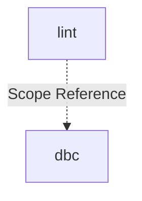

# Module: lint

## 1. Module Vision

Модуль `lint` — команда `gennady lint`: трёхслойная валидация TypeScript-файлов (file header, DBC-контракты, anchor-разметка) с ESLint-совместимым выводом и autofix.

→ Parent scope: [../../cli.spec.md](../../cli.spec.md)

## 2. Entity Inventory (Closed-World)

_Это полный список сущностей модуля. Любое введение сущности execution-агентом помимо этого списка считается drift'ом и требует обновления spec._

| Name               | Type         | Purpose                                                                                                 |
| ------------------ | ------------ | ------------------------------------------------------------------------------------------------------- |
| `LintCommand`      | Service      | CLI-обвязка: parseArgs, git scan (`--staged`), цикл по файлам, агрегация ошибок, вывод в ESLint-формате |
| `LintError`        | Value Object | Единый тип ошибки: `file`, `line`, `col`, `severity`, `code`, `message`                                 |
| `LintOptions`      | Value Object | Опции запуска: `files`, `autofix`, `gitMode`                                                            |
| `LintReport`       | Value Object | Результат линтинга: `errors`, `exitCode`, `format()`                                                    |
| `FileHeaderCheck`  | Service      | Проверка `// @file:` и `// @consumers:` в начале файла                                                  |
| `AnchorCheck`      | Service      | Проверка парности и вложенности `// #region START/END`                                                  |
| `DbcContractCheck` | Service      | Адаптер к `DbcTsLinter`: вызов `lint()` / `lintAndFix()` с контентом                                    |

## 3. Entity Surfaces

### `LintCommand`

- **Type:** Service
- **Purpose:** Точка входа команды `gennady lint`. Парсинг аргументов, сбор файлов, оркестрация проверок, вывод.
- **Public Operations:**
  - `run(args: string[]) → Promise<LintReport>` — выполнить линтинг
- **Lifecycle:** stateless; создаётся и вызывается один раз на запуск
- **Errors & Degradation:** Не кидает исключений. Отсутствие git → ошибка при `--staged`. Нет файлов → пустой отчёт.
- **Consumers:**
  - Internal: `cli/gennady.ts` (dispatch `case 'lint'`)
  - External: CLI (агент / оператор)

### `LintError`

- **Type:** Value Object
- **Purpose:** Единая модель ошибки для всех трёх проверок. ESLint-совместимый формат.
- **Public Properties:**
  - `file: string` — путь к файлу
  - `line: number` — строка (1-based)
  - `col: number` — колонка (1-based)
  - `severity: 'error'`
  - `code: string` — `ERR_CLI_LINT_*` или `ERR_DBC_LINT_*`
  - `message: string` — описание + конкретное действие
- **Lifecycle:** immutable value object
- **Consumers:**
  - Internal: `LintReport`, `FileHeaderCheck`, `AnchorCheck`, `DbcContractCheck`
  - External: N/A

### `LintOptions`

- **Type:** Value Object
- **Purpose:** Конфигурация одного запуска линтинга.
- **Public Properties:**
  - `files: string[]` — список путей к `.ts` файлам
  - `autofix: boolean` — включить autofix (dbc)
  - `gitMode?: 'staged'` — режим сбора файлов из git
- **Lifecycle:** immutable value object; создаётся `LintCommand` из аргументов
- **Consumers:**
  - Internal: `LintCommand`, `DbcContractCheck`
  - External: N/A

### `LintReport`

- **Type:** Value Object
- **Purpose:** Агрегированный результат линтинга.
- **Public Properties:**
  - `errors: LintError[]` — все ошибки (пустой массив = чисто)
  - `exitCode: 0 | 1`
- **Public Operations:**
  - `format() → string` — ESLint-формат: `file:line:col: severity: code: message`
- **Lifecycle:** immutable value object
- **Consumers:**
  - Internal: `LintCommand` (вывод в stdout)
  - External: N/A

### `FileHeaderCheck`

- **Type:** Service
- **Purpose:** Проверка наличия `// @file:` и `// @consumers:` в начале TypeScript-файла (до первого `import`).
- **Public Operations:**
  - `check(content: string, filePath: string) → LintError[]` — проверить контент файла
- **Lifecycle:** stateless; pure function
- **Errors & Degradation:** Не кидает исключений. Отсутствие `// @file:` → `ERR_CLI_LINT_MISSING_FILE`. Отсутствие `// @consumers:` → `ERR_CLI_LINT_MISSING_CONSUMERS`.
- **Consumers:**
  - Internal: `LintCommand`
  - External: N/A

### `AnchorCheck`

- **Type:** Service
- **Purpose:** Проверка парности и вложенности `// #region START_<NAME>` / `// #endregion END_<NAME>`. Стековый алгоритм.
- **Public Operations:**
  - `check(content: string, filePath: string) → LintError[]` — проверить контент файла
- **Lifecycle:** stateless; pure function
- **Errors & Degradation:** Не кидает исключений. Непарный START → `ERR_CLI_LINT_ANCHOR_UNPAIRED_START`. Непарный END → `ERR_CLI_LINT_ANCHOR_UNPAIRED_END`. Нарушение вложенности → `ERR_CLI_LINT_ANCHOR_NESTING`.
- **Consumers:**
  - Internal: `LintCommand`
  - External: N/A

### `DbcContractCheck`

- **Type:** Service
- **Purpose:** Адаптер к `DbcTsLinter` из scope `dbc`. Создаёт экземпляр, вызывает `lint()` или `lintAndFix()` с предварительно прочитанным контентом.
- **Public Operations:**
  - `check(content: string, filePath: string, autofix: boolean) → Promise<LintError[]>` — запустить dbc-линтер
- **Lifecycle:** stateless
- **Errors & Degradation:** Не кидает исключений. Ошибки dbc транслируются в `LintError[]`.
- **Consumers:**
  - Internal: `LintCommand`
  - External: N/A

### Value Objects

| Name          | Key Properties                                                                                        |
| ------------- | ----------------------------------------------------------------------------------------------------- |
| `LintError`   | `file: string`, `line: number`, `col: number`, `severity: 'error'`, `code: string`, `message: string` |
| `LintOptions` | `files: string[]`, `autofix: boolean`, `gitMode?: 'staged'`                                           |
| `LintReport`  | `errors: LintError[]`, `exitCode: 0 \| 1`, `format(): string`                                         |

### Error Codes

```
ERR_CLI_LINT_MISSING_FILE     = 'ERR_CLI_LINT_MISSING_FILE'
ERR_CLI_LINT_MISSING_CONSUMERS = 'ERR_CLI_LINT_MISSING_CONSUMERS'
ERR_CLI_LINT_ANCHOR_UNPAIRED_START = 'ERR_CLI_LINT_ANCHOR_UNPAIRED_START'
ERR_CLI_LINT_ANCHOR_UNPAIRED_END   = 'ERR_CLI_LINT_ANCHOR_UNPAIRED_END'
ERR_CLI_LINT_ANCHOR_NESTING        = 'ERR_CLI_LINT_ANCHOR_NESTING'
```

## 4. Module Contracts (DbC)

### 4.3 Services

#### Service: `FileHeaderCheck`

- **Purpose:** Проверка file header в TypeScript-файле: наличие `// @file:` и `// @consumers:`.
- **Consumers:**
  - Internal: `LintCommand`
  - External: N/A
- **Runtime Backing:** `real-runtime`
- **Verification Levels:** `unit`
- **Deferred Runtime Scope:** None

**Contract (DbC):**

- Preconditions:
  - `content` — непустая строка
  - `filePath` — путь к файлу (для сообщений об ошибках)
- Postconditions:
  - Возвращает `LintError[]` (пустой если обе директивы на месте)
  - Отсутствие `// @file:` → `ERR_CLI_LINT_MISSING_FILE`
  - Отсутствие `// @consumers:` → `ERR_CLI_LINT_MISSING_CONSUMERS`
- Invariants:
  - Проверяет только строки до первого `import`
  - Не кидает исключений

#### Service: `AnchorCheck`

- **Purpose:** Проверка парности и вложенности `// #region START_<NAME>` / `// #endregion END_<NAME>`.
- **Consumers:**
  - Internal: `LintCommand`
  - External: N/A
- **Runtime Backing:** `real-runtime`
- **Verification Levels:** `unit`
- **Deferred Runtime Scope:** None

**Contract (DbC):**

- Preconditions:
  - `content` — непустая строка
- Postconditions:
  - Каждый `START_X` → push в стек
  - Каждый `END_X` → pop, сверка имени с вершиной стека
  - Несовпадение → `ERR_CLI_LINT_ANCHOR_NESTING`
  - Непустой стек в конце → `ERR_CLI_LINT_ANCHOR_UNPAIRED_START` для каждого
  - `END` без соответствующего `START` → `ERR_CLI_LINT_ANCHOR_UNPAIRED_END`
- Invariants:
  - Чистая функция, не зависит от внешнего состояния
  - Ошибки возвращаются в порядке сверху вниз по файлу

#### Service: `DbcContractCheck`

- **Purpose:** Адаптер к `DbcTsLinter`. Передаёт предварительно прочитанный контент, избегая двойного чтения файла.
- **Consumers:**
  - Internal: `LintCommand`
  - External: N/A
- **Runtime Backing:** `real-runtime`
- **Verification Levels:** `integration`
- **Deferred Runtime Scope:** None
- **Scope Reference:** `dbc` — `DbcLinter`, `DbcLintError` (`../../dbc/dbc.spec.md`)

**Contract (DbC):**

- Preconditions:
  - `content` — непустая строка
  - `filePath` — путь к файлу (для сообщений об ошибках)
  - `dbc` scope предоставляет `DbcTsLinter` с опцией `content`
- Postconditions:
  - `autofix = false` → `DbcTsLinter.lint(filePath, { content })`
  - `autofix = true` → `DbcTsLinter.lintAndFix(filePath, { content })`
  - Ошибки `DbcLintError` транслируются в `LintError`
- Invariants:
  - `filePath` в ошибках — исходный путь (не подменяется)
  - `severity: 'error'` для всех ошибок

## 5. Public Options & Policies

| Option      | Bound to                                 | Status        |
| ----------- | ---------------------------------------- | ------------- |
| `--autofix` | `LintCommand.run()` → `DbcContractCheck` | active (v1)   |
| `--staged`  | `LintCommand.run()` → git scan           | active (v1)   |
| `--changed` | —                                        | deferred (v2) |

## 6. File Structure

```
cli/cmd/lint/
├── index.ts                    # import './lint.cmd.ts'
├── lint.cmd.ts                 # LintCommand.run()
├── lint.types.ts               # LintError, LintOptions, LintReport, константы ошибок
├── checks/
│   ├── file-header.check.ts    # FileHeaderCheck.check()
│   ├── anchor.check.ts         # AnchorCheck.check()
│   └── dbc-contract.check.ts   # DbcContractCheck.check()
└── __tests__/
    ├── lint.cmd.test.ts
    ├── file-header.check.test.ts
    ├── anchor.check.test.ts
    └── dbc-contract.check.test.ts
```

**File Mapping:**

- `lint.cmd.ts`: `LintCommand`
- `lint.types.ts`: `LintError`, `LintOptions`, `LintReport`, 5 × `ERR_CLI_LINT_*`
- `checks/file-header.check.ts`: `FileHeaderCheck`
- `checks/anchor.check.ts`: `AnchorCheck`
- `checks/dbc-contract.check.ts`: `DbcContractCheck`

## 7. Module Decision Log

None — все решения на уровне scope (D-001, D-002 в `cli.spec.md`).

## 8. Inter-Module Dependencies

- **Depends on:** N/A (единственный модуль в scope)
- **Scope Reference (cross-scope):** [`dbc`](../../dbc/dbc.spec.md) — `DbcLinter`, `DbcLintError`, `DbcLintReport`
- **Provides to:** N/A



## 9. Handoff to Task Scaffolding

- **Implementation files to be created:**
  - `cli/cmd/lint/index.ts`
  - `cli/cmd/lint/lint.cmd.ts`
  - `cli/cmd/lint/lint.types.ts`
  - `cli/cmd/lint/checks/file-header.check.ts`
  - `cli/cmd/lint/checks/anchor.check.ts`
  - `cli/cmd/lint/checks/dbc-contract.check.ts`
- **Test files to be created:**
  - `cli/cmd/lint/__tests__/lint.cmd.test.ts`
  - `cli/cmd/lint/__tests__/file-header.check.test.ts`
  - `cli/cmd/lint/__tests__/anchor.check.test.ts`
  - `cli/cmd/lint/__tests__/dbc-contract.check.test.ts`
- **Stack dependencies:**
  - Language: `TypeScript` (resolves to `ai/directives/coding/typescript-rules.xml`)
  - Test framework: `node:test` (resolves to `ai/directives/testing/node-test.xml`)
- **Module Rules Additions:** None (scope-wide baseline достаточен)

- **Open risks & validation needs:**
  - `refine dbc` (TSK-11) должен быть выполнен до реализации `DbcContractCheck`
  - Anchor-парсер — новая логика, без существующей реализации; требует тщательного тестирования краевых случаев
  - Git-интеграция: поведение при отсутствии git-репозитория
  - `cli/gennady.ts` и `cli/AGENTS.md` требуют обновления для регистрации команды
