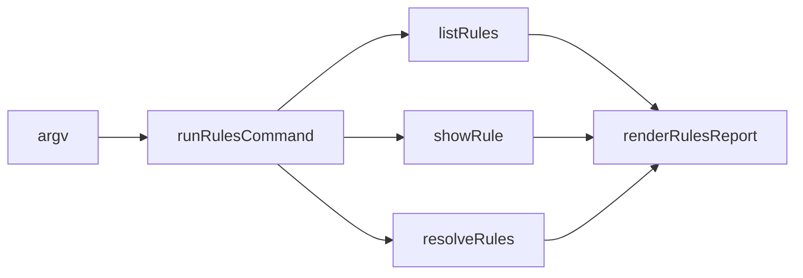

# Module: `rules-cli`

<!--SECTION:SPEC_ID-->

CLI-RULES-CLI

<!--/SECTION:SPEC_ID-->

<!--SECTION:MODULE_VISION-->

## Module Vision

`rules-cli` is the thin read-only process facade for [`rules`](./rules.spec.md). It parses one
inventory, detail or explicit-scope request, delegates all registry/resolution semantics to the
shared rules module, and renders a deterministic projection without executing project code or
writing repository state.

<!--/SECTION:MODULE_VISION-->

<!--SECTION:OVERVIEW-->

## Overview



_The facade owns strict CLI composition, never a second resolver — RC-REQ-1._

<!--/SECTION:OVERVIEW-->

<!--SECTION:MODULE_USAGE_EXAMPLE-->

## Module Usage Example

```text
gennady rules list --format json
gennady rules show typescript-rules
gennady rules resolve --phase code --files src/index.ts
```

### Call chain

| Step | Participant     | Action                                  | Data                     |
| ---- | --------------- | --------------------------------------- | ------------------------ |
| 1    | `gennady.ts`    | dispatches `rules`                      | raw argv                 |
| 2    | Rules facade    | parses one subcommand and exact scope   | `RulesInvocation`        |
| 3    | Rules service   | delegates registry/snapshot composition | `RulesReport`            |
| 4    | Rules reporter  | renders deterministic text or JSON      | `RulesCommandOutcome`    |
| 5    | Process adapter | writes bounded stdout/stderr and exits  | stable public projection |

<!--/SECTION:MODULE_USAGE_EXAMPLE-->

<!--SECTION:MODULE_REQUIREMENTS-->

## Requirements

### RC-REQ-1 [должен]

**Когда** команда получает `list`, `show` или `resolve`, **то модуль должен** использовать exact
`RuleRegistry + RuleResolver + RuleSnapshot` владельца `CLI-RULES`, не реализуя второй selection
path.

### RC-REQ-2 [должен · нештатная]

**Если** subcommand, option, rule id или explicit scope invalid/ambiguous, **то модуль должен**
вернуть non-zero actionable diagnostic и не выполнять fallback к whole registry selection.

### RC-REQ-3 [должен]

**Когда** команда завершена, **то модуль должен** оставить project files, dirty state, task bytes,
receipts и journals неизменными; output не содержит absolute repository root.

<!--/SECTION:MODULE_REQUIREMENTS-->

<!--SECTION:INTER_MODULE_DEPENDENCIES-->

## Inter-Module Dependencies

- **Depends on:** [`rules`](./rules.spec.md) for registry, resolver, facts and immutable snapshot.
- **Provides to:** `cli/gennady.ts` and `gennady help` as the public read-only rules surface.

<!--/SECTION:INTER_MODULE_DEPENDENCIES-->

<!--SECTION:ENTITY_INVENTORY-->

## Entity Inventory

| Name                        | Type         | Purpose                                                            |
| --------------------------- | ------------ | ------------------------------------------------------------------ |
| `RulesInvocation`           | Value Object | Strict parsed inventory/detail/explicit-scope request              |
| `RulesReport`               | Value Object | Stable versioned list/show/resolve projection                      |
| `RulesCommandOutcome`       | Value Object | Process exit and bounded rendered output                           |
| `runRulesCommand`           | Service      | Composes strict parsing, one subcommand and rendering              |
| `listRules`                 | Service      | Projects the complete deterministic registry inventory             |
| `projectRuleInventoryEntry` | Service      | Projects metadata from one already-loaded immutable descriptor     |
| `showRule`                  | Service      | Projects one exact descriptor and prompt body                      |
| `resolveRules`              | Service      | Resolves one explicit phase scope through the shared snapshot path |
| `renderRulesReport`         | Service      | Renders deterministic stable JSON or text                          |
| `printHelp`                 | Service      | Prints command-specific usage                                      |

<!--/SECTION:ENTITY_INVENTORY-->

<!--SECTION:ENTITY_SURFACES-->

## Entity Surfaces

<details>
<summary>CLI composition surfaces</summary>

### `RulesInvocation`, `RulesReport`, `RulesCommandOutcome`

- **Public Properties:** strict discriminated request, versioned safe projection and explicit
  exit/stdout/stderr.
- **Lifecycle:** constructed once per invocation and not mutated after handoff.

### `runRulesCommand`, `listRules`, `projectRuleInventoryEntry`, `showRule`, `resolveRules`, `renderRulesReport`, `printHelp`

- **Public Operations:** parse one request, project one subcommand, render stable output/help.
- **Errors & Degradation:** invalid source/header/scope/dependency remains fail-closed with safe
  repo-relative identity; no absolute root or partial snapshot is emitted.
- **Usage Waiver:** each function is consumed exactly once by the split CLI composition path;
  focused process tests exercise every public behavior, and a manufactured second production
  caller would duplicate the accepted facade.

</details>

<!--/SECTION:ENTITY_SURFACES-->

<!--SECTION:MODULE_CONTRACTS-->

## Module Contracts

<details>
<summary>CLI DbC contracts</summary>

### `runRulesCommand`

- **Preconditions:** cwd is a repository root and argv names one supported subcommand.
- **Postconditions:** returns one deterministic output projection and performs no project command or
  persistence write.
- **Failure:** invalid or ambiguous input returns non-zero with actionable bounded stderr.

### `resolveRules`

- **Preconditions:** selector and exactly one files/diff/task scope source are present.
- **Postconditions:** returns the same immutable snapshot digest as SDD dispatch and Verify for the
  same normalized facts, registry and overrides.
- **Failure:** path escape, symlink ambiguity, missing match/source or task ambiguity fails closed.

</details>

<!--/SECTION:MODULE_CONTRACTS-->

<!--SECTION:PUBLIC_OPTIONS-->

## Public Options & Policies

- `list [--format text|json]`; `--stack` and `--phase` are rejected.
- `show <rule-id> [--format text|json]`; id is one normalized `[a-z][a-z0-9-]*` token.
- `resolve --phase <selector> (--files <inputs...> | --changed-from <ref> | --task <ticket>)
[--format text|json]`.
- `--files` accepts exact paths/globs only inside root with no symlink escape.
- All Git calls use direct argv and the command never invokes project code.

<!--/SECTION:PUBLIC_OPTIONS-->

<!--SECTION:FILE_STRUCTURE-->

## File Structure

```text
cli/cmd/rules/
├── help.ts
├── index.ts
├── rules.cmd.ts
├── rules.types.ts
├── rules-list.ts
├── rules-show.ts
├── rules-resolve.ts
└── rules-report.ts
```

<!--/SECTION:FILE_STRUCTURE-->

<!--SECTION:MODULE_DECISION_LOG-->

## Module Decision Log

<details>
<summary>Accepted CLI decisions</summary>

### RUL-CLI-DL-1 — Inventory and selection are separate surfaces

- **Status:** accepted with D-70 and clarified for UV-20.
- **Decision:** `list` always returns complete inventory; only `resolve` performs selection from one
  explicit scope. No stack/primary-stack filtering exists.
- **Rejected:** `list --stack/--phase`, hidden whole-registry fallback and CLI-local resolution.

</details>

<!--/SECTION:MODULE_DECISION_LOG-->

<!--SECTION:HANDOFF-->

## Handoff to Tasks

- **Implementation files:** `cli/cmd/rules/**`, dispatch/help and command-table registrations.
- **Tests:** deterministic list/show/resolve, digest parity, invalid scopes and read-only process proof.
- **Open risks:** malformed external project rule sources remain fail-closed.

<!--/SECTION:HANDOFF-->
