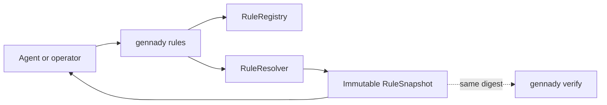
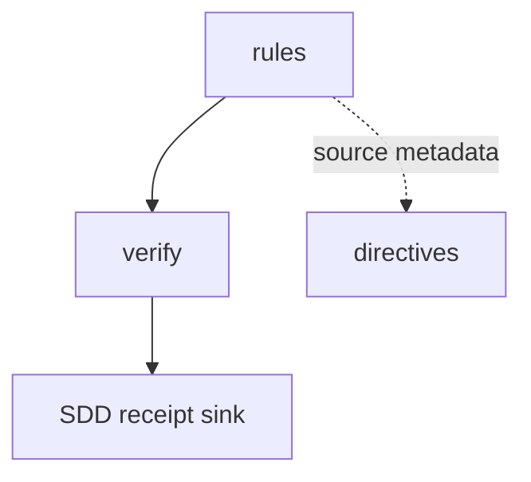

# Module: `rules`

<!--SECTION:SPEC_ID-->

CLI-RULES

<!--/SECTION:SPEC_ID-->

<!--SECTION:MODULE_VISION-->

## Module Vision

`rules` is the read-only public projection of the same future `RuleRegistry + RuleResolver` used by
[`verify`](../verify/verify.spec.md). It answers what rules exist, what one rule contains, and which
rules apply to an explicit phase/scope with reasons and provenance. It is not static CLI help, does
not reuse `agents-rules`, executes no verify step, mutates no workspace file and writes no receipt.

This is the accepted D-70 target contract. UV-01 materializes the canonical non-ignored spec only;
registry/resolver/CLI implementation remains owned by UV-18..20, and `knowledge.xml` removal remains
owned by UV-21 after entry-by-entry equivalence proof.

<!--/SECTION:MODULE_VISION-->

<!--SECTION:OVERVIEW-->

## Overview



_The command exposes one resolver snapshot without executing Verify — RUL-REQ-1, RUL-REQ-3._

<!--/SECTION:OVERVIEW-->

<!--SECTION:MODULE_USAGE_EXAMPLE-->

## Module Usage Example

```text
gennady rules list --stack node --phase code
gennady rules show typescript
gennady rules resolve --phase code --files src/index.ts --format json
```

`resolve` returns `selected.required`, `selected.suggested`, `skipped`, dependency closure,
provenance, reasons and `digest`; missing explicit files/diff/task scope fails closed.

### Call chain

| Step | Participant    | Action                                | Data                        |
| ---- | -------------- | ------------------------------------- | --------------------------- |
| 1    | Caller         | selects `list`, `show` or `resolve`   | CLI arguments               |
| 2    | Rules facade   | validates command and explicit scope  | normalized rules request    |
| 3    | RuleRegistry   | supplies deterministic descriptors    | rule inventory + provenance |
| 4    | RuleResolver   | selects rules and closes dependencies | required/suggested/skipped  |
| 5    | Rules reporter | returns text or JSON without writes   | immutable snapshot + digest |

<!--/SECTION:MODULE_USAGE_EXAMPLE-->

<!--SECTION:MODULE_REQUIREMENTS-->

## Requirements

### RUL-REQ-1 [должен]

**Когда** оператор вызывает `list`, `show` или `resolve`, **то модуль должен** оставаться read-only:
не запускать Verify steps, не менять working tree и не писать SDD receipt. Refines CLI read-only
command behavior and D-70.

### RUL-REQ-2 [должен · нештатная]

**Если** `resolve` не получает однозначный scope через `--files`, `--changed-from` или `--task`,
**то модуль должен** fail closed с actionable diagnostic, а не выбирать весь registry. Refines
target scope honesty in D-70.

### RUL-REQ-3 [должен]

**Когда** одинаковые normalized inputs переданы `rules resolve`, `verify --plan` и фактическому
Verify run, **то модуль должен** вернуть один и тот же immutable snapshot digest, selections,
dependency closure, provenance and reasons. Refines cross-surface parity in D-70.

### RUL-REQ-4 [должен · нештатная]

**Если** sidecar malformed, dependency missing/cyclic, directive body unavailable or snapshot stale,
**то модуль должен** report the exact source and fail closed for required rules; it must never parse
directive prompt markup as XML metadata. Refines registry integrity and the project directive-markup
convention.

<!--/SECTION:MODULE_REQUIREMENTS-->

<!--SECTION:INTER_MODULE_DEPENDENCIES-->

## Inter-Module Dependencies

- **Depends on:** [`verify`](../verify/verify.spec.md) for shared context/snapshot report projection.
- **Scope Reference (cross-scope):** project-local and plugin-local directive sources.
- **Provides to:** `verify --plan`, Verify execution reports, optional SDD receipt sink.



_The rules module supplies one immutable snapshot to Verify and its optional SDD receipt sink — RUL-REQ-1, RUL-REQ-3._

<!--/SECTION:INTER_MODULE_DEPENDENCIES-->

<!--SECTION:ENTITY_INVENTORY-->

## Entity Inventory

| Name             | Type         | Purpose                                                            | Implementation owner |
| ---------------- | ------------ | ------------------------------------------------------------------ | -------------------- |
| `RuleDescriptor` | Type         | Colocated sidecar metadata and directive-body identity             | UV-18                |
| `RuleRegistry`   | Service      | Deterministic inventory across generic, plugin and project sources | UV-18                |
| `RuleResolver`   | Service      | Phase/scope/stack/framework/task selection and dependency closure  | UV-19                |
| `RuleSnapshot`   | Value Object | Immutable selections, skips, reasons, provenance and digest        | UV-19, UV-20         |
| `rules list`     | CLI Command  | Read-only filtered inventory                                       | UV-20                |
| `rules show`     | CLI Command  | Read-only metadata and prompt-body projection                      | UV-20                |
| `rules resolve`  | CLI Command  | Read-only explainable resolver projection                          | UV-20                |

<!--/SECTION:ENTITY_INVENTORY-->

<!--SECTION:ENTITY_SURFACES-->

## Entity Surfaces

Target surfaces are fixed here; exact schemas are materialized by UV-18..20 without changing these
observable boundaries.

<details>
<summary>Target entity surfaces</summary>

### `RuleDescriptor`

- **Public Properties:** id; source; directive body identity; stack/framework/phase/file predicates;
  dependencies; priority; provenance.
- **Lifecycle:** immutable after registry load.
- **Errors & Degradation:** malformed or duplicate id fails closed with source path.

### `RuleRegistry`

- **Public Operations:** list descriptors; retrieve one descriptor by id; load generic/plugin/local
  sources deterministically.
- **Errors & Degradation:** unavailable required source is an error; prompt XML is never metadata.

### `RuleResolver` and `RuleSnapshot`

- **Public Operations:** resolve phase + explicit scope + stacks/frameworks + optional task/spec refs;
  close dependencies; normalize and digest the snapshot.
- **Errors & Degradation:** missing/cyclic dependency and ambiguous scope fail closed; semantic
  candidates remain suggested with reasons rather than pretending to be hard predicates.

### `rules list/show/resolve`

- **Public Operations:** render stable text or JSON projections; `resolve` exposes the same snapshot
  as Verify.
- **Errors & Degradation:** never executes steps or writes snapshots/receipts.

</details>

<!--/SECTION:ENTITY_SURFACES-->

<!--SECTION:MODULE_CONTRACTS-->

## Module Contracts

The registry owns deterministic source integrity; the resolver owns explainable selection; the CLI
owns read-only projection and stable JSON.

<details>
<summary>Target DbC contracts</summary>

### `RuleResolver.resolve`

- **Preconditions:** phase and exactly one explainable scope source are present; registry is valid.
- **Postconditions:** output is immutable and includes required/suggested/skipped, reasons,
  dependency closure, provenance and deterministic digest.
- **Failure:** invalid scope, dependency graph or required source returns a typed diagnostic; no
  partial green snapshot is emitted.

### `rules` CLI

- **Preconditions:** subcommand-specific arguments are valid.
- **Postconditions:** stdout is a projection only; repository bytes and SDD receipts are unchanged.
- **Failure:** non-zero exit with actionable diagnostic; never falls back to whole-registry resolve.

</details>

<!--/SECTION:MODULE_CONTRACTS-->

<!--SECTION:PUBLIC_OPTIONS-->

## Public Options & Policies

- `list [--stack <id>] [--phase <phase>]`
- `show <rule-id>`
- `resolve --phase <phase> (--files <glob...> | --changed-from <ref> | --task <ticket>)`
- `resolve --format text|json` (default: `text`)
- Equality policy: normalized equal inputs produce equal digest across rules/verify/report surfaces.
- Mutation policy: always read-only; only Verify/SDD workflow owners may persist snapshot/receipt.

<!--/SECTION:PUBLIC_OPTIONS-->

<!--SECTION:FILE_STRUCTURE-->

## File Structure

```text
shared/rules/
├── rule-descriptor.type.ts
├── rule-registry.ts
├── rule-resolver.ts
├── rule-snapshot.ts
└── rule-config.ts
cli/cmd/rules/
├── rules.cmd.ts
├── rules-list.ts
├── rules-show.ts
├── rules-resolve.ts
└── rules-report.ts
```

All listed runtime files are deferred to UV-18..20. Colocated `*.rule.yaml` migration and
`knowledge.xml` deletion are deferred to UV-21.

<!--/SECTION:FILE_STRUCTURE-->

<!--SECTION:MODULE_DECISION_LOG-->

## Module Decision Log

<details>
<summary>Accepted decisions</summary>

### RULES-DL-1 / D-70 — One resolver, colocated metadata, read-only reference CLI

- **Status:** accepted at U0 on 2026-09-24; implementation pending U6.
- **Decision:** replace the central `knowledge.xml` registry with colocated sidecars, resolve one
  immutable explained snapshot, and expose it through `list/show/resolve` without execution or
  receipt writes. `agents-rules` remains a separate static orient instruction.
- **Rejected:** a second CLI-only resolver, parsing prompt markup as XML metadata, implicit whole
  registry resolution and nondeterministic model selection before its decision boundary.

</details>

<!--/SECTION:MODULE_DECISION_LOG-->

<!--SECTION:HANDOFF-->

## Handoff to Tasks

- **Implementation files to be created:** all files in File Structure by UV-18..20.
- **Test files to be created:** registry, resolver, snapshot parity and CLI read-only contract tests
  by UV-18..20; entry-equivalence fixtures by UV-21.
- **Stack dependencies:** TypeScript and `node:test`.
- **Module Rules Additions:** directive prompt bodies are markup, never XML metadata.
- **Open risks & validation needs:** sidecar schema and override precedence (UV-18); deterministic
  dependency closure (UV-19); rules/verify digest parity (UV-20); entry equivalence before deletion
  (UV-21).

<!--/SECTION:HANDOFF-->
