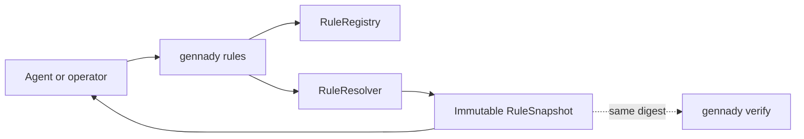
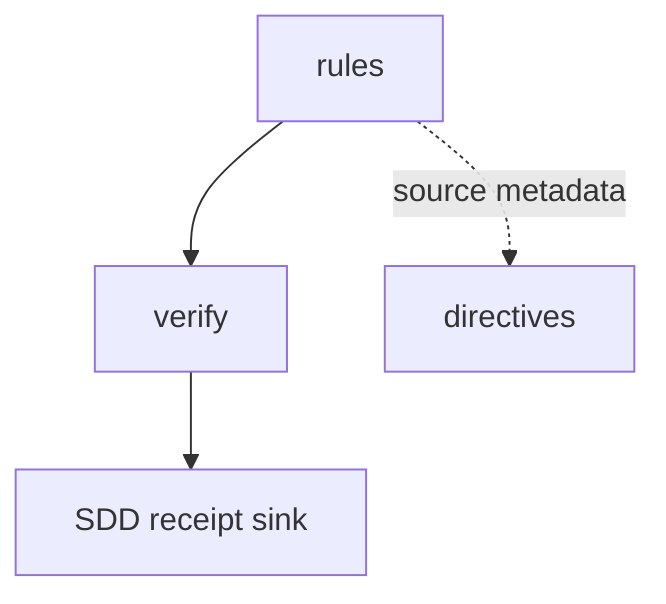

# Module: `rules`

<!--SECTION:SPEC_ID-->

CLI-RULES

<!--/SECTION:SPEC_ID-->

<!--SECTION:MODULE_VISION-->

## Module Vision

`rules` is the read-only public projection of the same future `RuleRegistry + RuleResolver` used by
[`verify`](../verify/verify.spec.md). It answers what rules exist, what one rule contains, and which
rules apply to an explicit phase/scope with reasons and provenance. It is not static CLI help, does
not reuse `agents-rules`, executes no verify step, mutates no workspace file and writes no receipt.

This is the accepted D-70 target contract. UV-01 materializes the canonical non-ignored spec only;
registry/parser/resolver/CLI implementation remains owned by UV-18A..20, and `knowledge.xml`
removal remains owned by UV-21 after entry-by-entry metadata migration and equivalence proof.

<!--/SECTION:MODULE_VISION-->

<!--SECTION:OVERVIEW-->

## Overview



_The command exposes one resolver snapshot without executing Verify — RUL-REQ-1, RUL-REQ-3._

<!--/SECTION:OVERVIEW-->

<!--SECTION:MODULE_USAGE_EXAMPLE-->

## Module Usage Example

```text
gennady rules list --stack node --phase code
gennady rules show typescript
gennady rules resolve --phase code --files src/index.ts --format json
```

`resolve` returns `selected.required`, `selected.suggested`, `skipped`, dependency closure,
provenance, reasons and `digest`; missing explicit files/diff/task scope fails closed.

### Call chain

| Step | Participant    | Action                                | Data                        |
| ---- | -------------- | ------------------------------------- | --------------------------- |
| 1    | Caller         | selects `list`, `show` or `resolve`   | CLI arguments               |
| 2    | Rules facade   | validates command and explicit scope  | normalized rules request    |
| 3    | RuleRegistry   | supplies deterministic descriptors    | rule inventory + provenance |
| 4    | RuleResolver   | selects rules and closes dependencies | required/suggested/skipped  |
| 5    | Rules reporter | returns text or JSON without writes   | immutable snapshot + digest |

<!--/SECTION:MODULE_USAGE_EXAMPLE-->

<!--SECTION:MODULE_REQUIREMENTS-->

## Requirements

### RUL-REQ-1 [должен]

**Когда** оператор вызывает `list`, `show` или `resolve`, **то модуль должен** оставаться read-only:
не запускать Verify steps, не менять working tree и не писать SDD receipt. Refines CLI read-only
command behavior and D-70.

### RUL-REQ-2 [должен · нештатная]

**Если** `resolve` не получает однозначный scope через `--files`, `--changed-from` или `--task`,
**то модуль должен** fail closed с actionable diagnostic, а не выбирать весь registry. Refines
target scope honesty in D-70.

### RUL-REQ-3 [должен]

**Когда** одинаковые normalized inputs переданы `rules resolve`, `verify --plan` и фактическому
Verify run, **то модуль должен** вернуть один и тот же immutable snapshot digest, selections,
dependency closure, provenance and reasons. Refines cross-surface parity in D-70.

### RUL-REQ-4 [должен · нештатная]

**Если** embedded header malformed, metadata key unknown, dependency missing/cyclic, prompt body
unavailable or snapshot stale, **то модуль должен** назвать exact source и fail closed для required
rules. Prompt-файл не является XML: XML parser/validator запрещён. Lexical parser читает только
первый literal root tag, ровно один strict `<Meta>` block непосредственно в header и matching final
literal root close; всё между header и close остаётся opaque arbitrary markdown/HTML-like body.

### RUL-REQ-5 [должен]

**Когда** SDD phase готовится к dispatch, **то classifier должен** построить open-vocabulary
`PhaseFacts` из exact target/planned files, artifacts (`language/role/framework`), operations,
intents, platform/tool/project facts. `RuleResolver` выбирает rules по artifacts каждой фазы, а не
по primary stack: несколько `<When .../>` образуют OR, attributes одного `When` — AND,
comma-values — OR, любой matching `<Unless .../>` veto-ит rule; `<DependsOn rule="..."/>` закрывает
dependencies детерминированно.

### RUL-REQ-6 [должен · нештатная]

**Когда** project/phase явно добавляет или пропускает rule, **то snapshot должен** сохранить
provenance и непустую reason. Skip required dependency fail closed. Одинаковые normalized facts,
registry bytes и overrides дают один immutable `RuleSnapshot` (`required/suggested/skipped`, reasons,
dependencies, provenance, digest) в `rules resolve`, SDD dispatch и Verify report; drift делает
phase evidence stale.

<!--/SECTION:MODULE_REQUIREMENTS-->

<!--SECTION:INTER_MODULE_DEPENDENCIES-->

## Inter-Module Dependencies

- **Depends on:** [`verify`](../verify/verify.spec.md) for shared context/snapshot report projection.
- **Scope Reference (cross-scope):** project-local and plugin-local directive sources.
- **Provides to:** `verify --plan`, Verify execution reports, optional SDD receipt sink.



_The rules module supplies one immutable snapshot to Verify and its optional SDD receipt sink — RUL-REQ-1, RUL-REQ-3._

<!--/SECTION:INTER_MODULE_DEPENDENCIES-->

<!--SECTION:ENTITY_INVENTORY-->

## Entity Inventory

| Name             | Type         | Purpose                                                                | Implementation owner |
| ---------------- | ------------ | ---------------------------------------------------------------------- | -------------------- |
| `RuleHeader`     | Type         | Strict embedded Meta mini-language plus opaque prompt-body identity    | UV-18A               |
| `RuleDescriptor` | Type         | Parsed predicates/dependencies and exact prompt-body identity          | UV-18A               |
| `RuleRegistry`   | Service      | Deterministic embedded-header inventory across built-in/project rules  | UV-18A               |
| `PhaseFacts`     | Value Object | Open-vocabulary phase artifacts, operations, intents and project facts | UV-18B               |
| `RuleResolver`   | Service      | Per-artifact selection, vetoes, overrides and dependency closure       | UV-19                |
| `RuleSnapshot`   | Value Object | Immutable selections, skips, reasons, provenance and digest            | UV-19, UV-20         |
| `rules list`     | CLI Command  | Read-only filtered inventory                                           | UV-20                |
| `rules show`     | CLI Command  | Read-only metadata and prompt-body projection                          | UV-20                |
| `rules resolve`  | CLI Command  | Read-only explainable resolver projection                              | UV-20                |

<!--/SECTION:ENTITY_INVENTORY-->

<!--SECTION:ENTITY_SURFACES-->

## Entity Surfaces

Target surfaces are fixed here; exact schemas are materialized by UV-18..20 without changing these
observable boundaries.

<details>
<summary>Target entity surfaces</summary>

### `RuleHeader` and `RuleDescriptor`

- **Public Properties:** `rule-id`, `rule-schema`, `type`, `ver`; ordered `When`, `Unless` and
  `DependsOn`; exact prompt body identity; provenance.
- **Grammar:** root attributes use quoted normalized scalar values. `Meta` allows only self-closing
  `When`, `Unless`, `DependsOn`; predicate attributes are open-vocabulary with initial supported
  keys `language`, `role`, `framework`, `pattern`, `operation`, `intent`, `platform`, `tool`.
  Attribute names are lowercase ASCII tokens; values decode `&quot;`, `&apos;`, `&amp;`, `&lt;`,
  `&gt;`, trim outer whitespace, normalize comma lists by trim/dedupe/sort, and reject empty members,
  duplicate attributes, unknown entities or control characters.
- **Lifecycle:** immutable after registry load.
- **Errors & Degradation:** unknown/malformed header, duplicate id, missing/mismatched literal root
  close or extra `Meta` fails closed with source path. Body bytes are never XML-decoded or rewritten.

### `RuleRegistry`

- **Public Operations:** list descriptors; retrieve one descriptor by id; load generic/plugin/local
  sources deterministically.
- **Errors & Degradation:** unavailable required source is an error; prompt XML is never metadata.

### `PhaseFacts`, `RuleResolver` and `RuleSnapshot`

- **Public Operations:** classify phase artifacts/operations/intents/platform/tool/project facts;
  resolve each rule against those facts; apply explicit add/skip with reason/provenance; close
  dependencies; normalize and digest exact selected bodies.
- **Errors & Degradation:** missing/cyclic dependency and ambiguous scope fail closed; semantic
  candidates remain suggested with reasons rather than pretending to be hard predicates.

### `rules list/show/resolve`

- **Public Operations:** render stable text or JSON projections; `resolve` exposes the same snapshot
  as Verify.
- **Errors & Degradation:** never executes steps or writes snapshots/receipts.

</details>

<!--/SECTION:ENTITY_SURFACES-->

<!--SECTION:MODULE_CONTRACTS-->

## Module Contracts

The registry owns deterministic source integrity; the resolver owns explainable selection; the CLI
owns read-only projection and stable JSON.

<details>
<summary>Target DbC contracts</summary>

### `RuleResolver.resolve`

- **Preconditions:** phase and exactly one explainable scope source are present; registry is valid.
- **Postconditions:** output is immutable and includes required/suggested/skipped, reasons,
  dependency closure, provenance and deterministic digest.
- **Failure:** invalid scope, dependency graph or required source returns a typed diagnostic; no
  partial green snapshot is emitted.

### `rules` CLI

- **Preconditions:** subcommand-specific arguments are valid.
- **Postconditions:** stdout is a projection only; repository bytes and SDD receipts are unchanged.
- **Failure:** non-zero exit with actionable diagnostic; never falls back to whole-registry resolve.

</details>

<!--/SECTION:MODULE_CONTRACTS-->

<!--SECTION:PUBLIC_OPTIONS-->

## Public Options & Policies

- `list [--stack <id>] [--phase <phase>]`
- `show <rule-id>`
- `resolve --phase <phase> (--files <glob...> | --changed-from <ref> | --task <ticket>)`
- `resolve --format text|json` (default: `text`)
- Equality policy: normalized equal inputs produce equal digest across rules/verify/report surfaces.
- Mutation policy: always read-only; only Verify/SDD workflow owners may persist snapshot/receipt.

<!--/SECTION:PUBLIC_OPTIONS-->

<!--SECTION:FILE_STRUCTURE-->

## File Structure

```text
shared/rules/
├── rule-header.type.ts
├── rule-header.parser.ts
├── rule-descriptor.type.ts
├── rule-registry.ts
├── phase-facts.type.ts
├── phase-facts.ts
├── rule-resolver.ts
├── rule-snapshot.ts
└── rule-config.ts
cli/cmd/rules/
├── rules.cmd.ts
├── rules-list.ts
├── rules-show.ts
├── rules-resolve.ts
└── rules-report.ts
```

All listed runtime files are deferred to UV-18A..20. Entry-by-entry embedded-header migration and
`knowledge.xml` deletion are deferred to UV-21.

<!--/SECTION:FILE_STRUCTURE-->

<!--SECTION:MODULE_DECISION_LOG-->

## Module Decision Log

<details>
<summary>Accepted decisions</summary>

### RULES-DL-1 / D-70 — One resolver and read-only reference CLI

- **Status:** accepted at U0 on 2026-09-24; implementation pending U6.
- **Decision:** replace the central `knowledge.xml` registry with colocated rule metadata, resolve one
  immutable explained snapshot, and expose it through `list/show/resolve` without execution or
  receipt writes. `agents-rules` remains a separate static orient instruction.
- **Rejected:** a second CLI-only resolver, parsing prompt markup as XML metadata, implicit whole
  registry resolution and nondeterministic model selection before its decision boundary.

### RULES-DL-2 — Metadata is embedded lexical prompt header; PhaseFacts feeds two products

- **Status:** accepted by operator 2026-09-26; supersedes RULES-DL-1 only where it named sidecars.
- **Decision:** metadata lives in the rule prompt file itself. A custom lexical header parser reads
  only root attributes + one strict `Meta`; the arbitrary body remains prompt text and is never
  parsed as XML. `PhaseFacts` independently powers `RuleResolver` instructions and Verify provider
  selection; rule files never become a command registry.
- **Layering:** TypeScript core, strict production and test-light are separate descriptors. A Vitest
  test artifact can exclude strict production TS while selecting TypeScript core + testing + Vitest.
- **Migration gate:** `knowledge.xml` remains until every entry has embedded metadata and equivalence
  proof; then consumer grep must be zero before deletion.

</details>

<!--/SECTION:MODULE_DECISION_LOG-->

<!--SECTION:HANDOFF-->

## Handoff to Tasks

- **Implementation files to be created:** all files in File Structure by UV-18A..20.
- **Test files to be created:** lexical header adversarial fixtures whose bodies contain invalid
  XML-ish text unchanged; When/Unless/dependency/override determinism; TypeScript production versus
  Vitest test-light selection; mixed TS+Go+CSS/Bash PhaseFacts union; snapshot-digest parity across
  resolve/dispatch/Verify; registry/resolver/CLI read-only contracts by UV-18A..20; entry-equivalence
  and zero-`knowledge.xml`-consumer fixtures by UV-21.
- **Stack dependencies:** TypeScript and `node:test`.
- **Module Rules Additions:** directive prompt bodies are markup, never XML metadata.
- **Open risks & validation needs:** lexical header grammar and PhaseFacts classifier (UV-18A/B); deterministic
  dependency closure (UV-19); rules/verify digest parity (UV-20); entry equivalence before deletion
  (UV-21).

<!--/SECTION:HANDOFF-->
