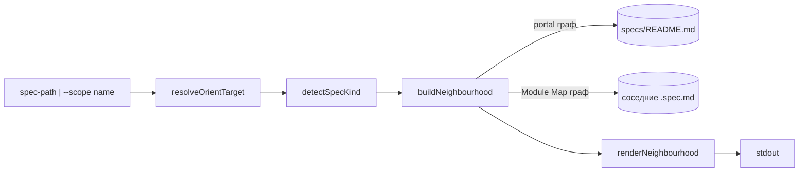
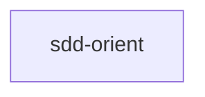
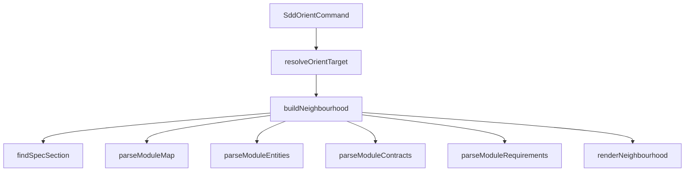
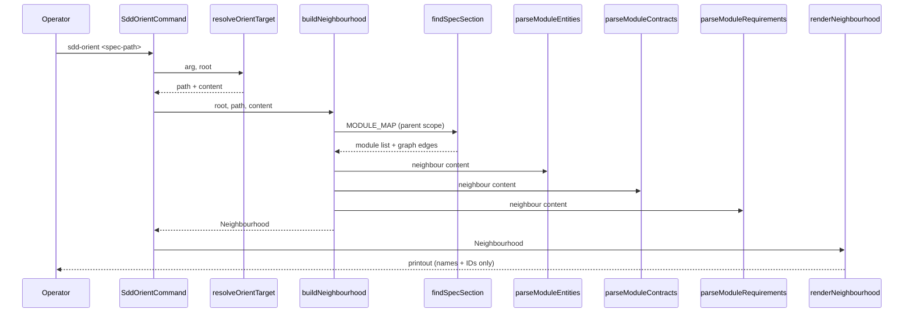

# Module: sdd-orient

<!--SECTION:MODULE_VISION-->

## Module Vision

`sdd-orient` навигирует по ДИЗАЙНУ (спекам), в отличие от `orient` — навигатора по КОДУ
(`../orient/orient.spec.md`, индексирует только `.ts`/`.tsx`-файлы через file-header). Отдельный
инструмент, а не расширение `orient` — источники данных разные: `.spec.md` со своей структурой
секций (v2 `<!--SECTION:...-->` маркеры и старый v1 формат нумерованных заголовков) против
исходного кода.

Проблема, которую решает: авторские директивы фиксируют архитектуру, не читая соседние спеки —
живой случай (аудит, 2026-08) — спека завела параллельный HTTP-сервис вместо расширения уже
спроектированного в соседней спеке ресурсного механизма; поймал только человек на втором круге
ревью. `orient` не мог это поймать — он не видит спеки вообще (только TSK-номера в них).
`sdd-orient` даёт дешёвую (только имена + ID, без тел) выжимку окрестности спеки — модули/сущности/
контракты/требования на расстоянии одного шага по графу, — которую агент обязан просмотреть перед
фиксацией новой архитектуры.

→ Parent scope: [`../cli.spec.md`](../cli.spec.md) (§9 Module Map).

<!--/SECTION:MODULE_VISION-->

<!--SECTION:OVERVIEW-->

## Overview



_Аргумент → разрешение цели → классификация → обход графа окрестности глубины 1 → дешёвый текстовый вывод._

<!--/SECTION:OVERVIEW-->

<!--SECTION:MODULE_USAGE_EXAMPLE-->

## Module Usage Example

```bash
# --- окрестность спеки модуля ---
$ npx gennady sdd-orient specs/todos-app/ui/ui.spec.md

[sdd-orient] neighbourhood — specs/todos-app/ui/ui.spec.md
portal: todos-app (product) · depends on: infra-base
neighbours (по рёбрам, глубина 1):
  storage (module) → specs/todos-app/storage/storage.spec.md
    сущности: TodoStore, DexieTodoStore, InMemoryTodoStore, Todo, TodoFilter
    контракты: TodoStore (port), DexieTodoStore (adapter), InMemoryTodoStore (adapter)
    требования: STOR-REQ-1 «...», STOR-REQ-2 «...»
потребители: нет ← (кто зависит от этой спеки)
next: перед фиксацией архитектуры ответь: расширяем что-то из перечисленного или вводим новое?
«новое» требует обоснования со ссылкой на инвариант, который не подошёл.
# exit 0

# --- окрестность по имени скоупа ---
$ npx gennady sdd-orient --scope todos-app

[sdd-orient] neighbourhood — specs/todos-app/todos-app.spec.md
portal: todos-app (product) · depends on: infra-base
neighbours (по рёбрам, глубина 1):
  storage (module) → specs/todos-app/storage/storage.spec.md
    ...
  ui (module) → specs/todos-app/ui/ui.spec.md
    ...
  uikit (module) → specs/todos-app/uikit/uikit.spec.md
    ...
потребители: нет ← (кто зависит от этой спеки)
next: ...
# exit 0

# --- спека в старом формате, часть секций отсутствует — честно, без падения ---
$ npx gennady sdd-orient specs/cli/orient/orient.spec.md

[sdd-orient] neighbourhood — specs/cli/orient/orient.spec.md
portal: cli (product) · depends on: agent-run
neighbours (по рёбрам, глубина 1):
  dbc (scope) → specs/dbc/dbc.spec.md
    требования: не найдены (старый формат)
потребители: нет ← (кто зависит от этой спеки)
next: ...
# exit 0

# --- ошибка: аргумент не резолвится ---
$ npx gennady sdd-orient specs/no-such/no-such.spec.md

[sdd-orient] error: cannot read "specs/no-such/no-such.spec.md" as a spec file, and it does not
look like a --scope name either. Pass a real .spec.md path, or `--scope <name>` matching a row in
specs/README.md's Scopes table (run `npx gennady sdd-orient --scope <name>` after checking that
table).
# exit 4
```

<!--/SECTION:MODULE_USAGE_EXAMPLE-->

<!--SECTION:MODULE_REQUIREMENTS-->

## Requirements

### Requirements

### SO-REQ-1 [должен]

**Когда** оператор вызывает `sdd-orient <spec-path>` с путём к существующей `.spec.md`, **команда
должна** вывести портал-строку (родительский скоуп + его зависимости по графу портала) и список
прямых соседей глубины 1 (родственные модули по графу Module Map / Inter-Module Dependencies, и
cross-scope Scope Reference), для каждого соседа — только имена сущностей, имена+вид контрактов
(вид — как назван в самой спеке: port/adapter/service/component/hook/…, список открытый) и
ID+короткий заголовок требований, без тел.

> Дизайн-граф — единственное, что видит спека, но не видит `orient` (индексирующий только код);
> без дешёвой выжимки соседей агент фиксирует архитектуру не глядя на уже спроектированные соседние
> механизмы — живой инцидент (см. Module Vision) обнаружился только на втором круге человеческого
> ревью.

### SO-REQ-2 [должен]

**Когда** оператор вызывает `sdd-orient --scope <name>`, **команда должна** резолвить `<name>` по
таблице Scopes портала (`specs/README.md`) на путь спеки скоупа и построить ту же окрестность, что
и при передаче пути к этой спеке напрямую.

> Аргумент — единственная точка входа; операторы и агенты чаще знают имя скоупа, чем точный путь
> файла (то же решение, что `ticket-resolve.ts` принял для Task-ID).

### SO-REQ-3 [должен]

**Когда** целевая спека — модуль, **команда должна** ограничить обход глубиной 1: вверх — только
портал-строка родительского скоупа (без рекурсии по родителям выше), в стороны — только прямые
рёбра графа Inter-Module Dependencies этого модуля (включая cross-scope Scope Reference), без
транзитивного обхода соседей соседей.

> Транзитивный обход делает выжимку дорогой (токены) и превращает её в полный граф проекта — прямая
> цель оператора («дёшево») требует жёсткого потолка глубины.

### SO-REQ-4 [должен]

**Когда** целевая спека — скоуп (по `--scope` или по прямому пути к `<scope>.spec.md`), **команда
должна** показать в качестве соседей глубины 1 все модули из секции Module Map этого скоупа
(«вниз»), а рёбра графа портала (scope-to-scope) — только в портал-строке («в стороны»), не
дублируя их отдельными записями соседей.

> Портал-строка уже покрывает scope-to-scope связи; повторять их как «соседей» раздувает вывод без
> новой информации.

### SO-REQ-5 [должен]

**Когда** команда парсит спеку любого формата, **она должна** поддержать оба формата секций:
новый (`<!--SECTION:NAME-->` маркеры) и старый (нумерованные markdown-заголовки без маркеров,
например `## 2. Entity Inventory (Closed-World)`) — извлекая секцию по совпадению заголовка
(регистронезависимо, с отсечённой нумерацией), когда маркера нет.

> В самом gennady десятки спек в старом формате; выжимка, работающая только на новом формате,
> бесполезна там, где риск (архитектура вслепую) реализовался впервые.

### SO-REQ-6 [должен]

**Когда** у соседней спеки нет секции Entity Inventory ни в одном из форматов, **команда должна**
вывести для неё честную строку `сущности: не найдены (старый формат)` (или аналогично для
контрактов/требований), а не завершиться с ошибкой и не выдумать сущности.

> Пустой случай — не баг: старый формат модуля мог не заводить инвентарь вовсе (пример —
> `specs/cli/orient/orient.spec.md` до этой ревизии не имел Module Requirements). Тишина хуже
> честного «не найдено».

### SO-REQ-7 [должен]

**Когда** у целевой или соседней спеки нет прямых соседей по графу (пустой Module Map, пустой
Inter-Module Dependencies, или все узлы графа не резолвятся ни в спеку скоупа, ни в спеку модуля),
**команда должна** вывести строку `соседей по графу нет` вместо секции `neighbours`, сохранив
портал-строку.

> «Нет соседей» — легитимный факт о графе (лист дерева), не должен маскироваться под «сломалось».

### SO-REQ-8 [должен · нештатная]

**Если** `specs/README.md` (портал) отсутствует или не парсится, **то команда должна** — в режиме
пути — выполнить обход по структуре директорий (`specs/<scope>/...`) и вывести портал-строку с
пометкой `портал не найден`, а в режиме `--scope <name>` — завершиться ошибкой tool-teaches,
указывающей на отсутствующий портал и команду для его создания.

> Без портала имя скоупа не резолвится в путь однозначно (нет таблицы Scopes) — режим `--scope`
> физически не может продолжить; но путь к конкретной спеке не нуждается в портале для собственной
> секции Module Map, только для строки зависимостей — деградация должна быть частичной, не полной.

### SO-REQ-9 [должен · нештатная]

**Если** аргумент не читается как путь к файлу и не совпадает ни с одной строкой таблицы Scopes
портала, **то команда должна** завершиться с exit-кодом 4 и tool-teaches сообщением: что не
получилось, и готовая команда/подсказка, как исправить (по образцу
`unreadableTicketHint`/`resolutionLine` из `ticket-resolve.ts`).

> Агент, получивший «ENOENT» без подсказки, тратит следующий ход на угадывание; готовая команда —
> дешевле для оператора, чем для агента гадать самостоятельно.

### SO-REQ-10 [должен]

**Когда** граф Inter-Module Dependencies спеки-скоупа содержит цикл (A ↔ B), **команда должна**
корректно показать обе стороны цикла как взаимных соседей (A видит B как соседа и как потребителя,
и наоборот), не зависая и не падая — обход ограничен глубиной 1, рекурсия по графу не выполняется.

> Глубина 1 — структурная защита от цикла: если бы обход был рекурсивным, цикл требовал бы явного
> детектора (как в `portal.ts`'s `findCyclicNodes`); при глубине 1 это не нужно, но контракт должен
> подтверждаться тестом, а не предположением.

<!--/SECTION:MODULE_REQUIREMENTS-->

<!--SECTION:INTER_MODULE_DEPENDENCIES-->

## Inter-Module Dependencies

- **Depends on:** N/A (единственный модуль в scope на момент написания)
- **Scope Reference (cross-scope):** N/A — использует общие парсеры `shared/sdd/`, но это не
  scope-level зависимость в смысле графа портала
- **Provides to:** N/A



_Единственный модуль в скоупе на момент написания — граф вырожденный._

<!--/SECTION:INTER_MODULE_DEPENDENCIES-->

<!--SECTION:ENTITY_INVENTORY-->

## Entity Inventory

_Это полный список сущностей модуля. Любое введение сущности execution-агентом помимо этого списка считается drift'ом и требует обновления spec._

| Name                      | Type         | Purpose                                                                                                    |
| ------------------------- | ------------ | ---------------------------------------------------------------------------------------------------------- |
| `SddOrientCommand`        | Function     | Точка входа CLI: парсинг аргументов → резолв цели → построение окрестности → рендер                        |
| `SddOrientOptions`        | Type         | Опции: позиционный `target`, `--scope`                                                                     |
| `resolveOrientTarget`     | Function     | Резолв аргумента (путь ИЛИ имя скоупа) в путь+содержимое спеки, по образцу `resolveTicketArg`              |
| `detectSpecKind`          | Function     | Классификация спеки: `module` \| `scope` \| `unknown`, v2-маркер с фолбэком на старый формат               |
| `findSpecSection`         | Function     | Тело именованной секции: v2-маркер, иначе заголовок старого формата (регэксп, с отсечённой нумерацией)     |
| `parseModuleEntities`     | Function     | Имена сущностей из Entity Inventory (обе формы)                                                            |
| `parseModuleContracts`    | Function     | Имена+вид контрактов (вид открытый: port/adapter/service/component/hook/…) из Module Contracts (обе формы) |
| `parseModuleRequirements` | Function     | ID+короткий заголовок требований: новый плоский формат, иначе старая таблица `ID │ Требование`             |
| `parseModuleMap`          | Function     | Список модулей скоупа (имя+путь) из секции Module Map (обе формы)                                          |
| `buildNeighbourhood`      | Function     | Обход глубиной 1: портал-строка, соседи, потребители — детерминированная сборка модели вывода              |
| `Neighbourhood`           | Value Object | Собранная модель: заголовок, портал-строка, соседи, потребители                                            |
| `NeighbourEntry`          | Value Object | Один сосед: имя, вид (module/scope), путь, сущности/контракты/требования (или для scope — список модулей)  |
| `renderNeighbourhood`     | Function     | Рендер `Neighbourhood` в фиксированный текстовый контракт                                                  |

<!--/SECTION:ENTITY_INVENTORY-->

<!--SECTION:ENTITY_SURFACES-->

## Entity Surfaces

Основная поверхность — `SddOrientCommand` (CLI-вход) и `buildNeighbourhood` (обход графа); парсеры
секций (`findSpecSection`, `parseModule*`) — внутренние утилиты, читающие и v2-, и legacy-формат
спек; `Neighbourhood`/`NeighbourEntry` — чистые value objects, потребляемые только рендерером.

<details>
<summary>Полные поверхности сущностей</summary>

### `SddOrientCommand`

- **Type:** Function
- **Purpose:** Точка входа `gennady sdd-orient`: парсит argv, резолвит цель, строит и печатает окрестность.
- **Signature:** `(argv: string[], root?: string) => Promise<{ ok: boolean; exitCode: number }>`
- **Contract:**
  - Ровно один из `<spec-path>` (позиционный) или `--scope <name>` — иначе ошибка (exit 4)
  - Успешный резолв → `buildNeighbourhood` → `renderNeighbourhood` → stdout, exit 0
  - Резолв не удался → tool-teaches сообщение в stdout, exit 4
- **Side Effect:** stdout, process.exit (только в самовызывающемся блоке, не в `run`)

### `resolveOrientTarget`

- **Type:** Function
- **Purpose:** Резолвит CLI-аргумент — путь к `.spec.md` (не изменяется) или имя скоупа (поиск в таблице Scopes портала).
- **Signature:** `(arg: string, root: string) => OrientResolution`
- **Contract:**
  - Аргумент читается как файл → `{ ok: true, path, content, resolvedFrom: 'path' }`
  - Иначе, если совпадает с `name` строки таблицы Scopes портала → резолв в `specPath` той строки
  - Иначе → `{ ok: false, reason: 'unresolved' }`
  - Портал отсутствует и аргумент похож на путь (`/` или `.md`) → `{ ok: false, reason: 'unreadable' }`

### `detectSpecKind`

- **Type:** Function
- **Purpose:** Классифицирует содержимое спеки.
- **Signature:** `(content: string) => 'module' | 'scope' | 'unknown'`
- **Contract:**
  - `<!--SECTION:MODULE_VISION-->` ИЛИ заголовок, совпадающий с `/^module vision$/i` после отсечения нумерации, ИЛИ первая строка вида `# Module: ...` → `'module'`
  - Иначе `<!--SECTION:SCOPE_TYPE-->` ИЛИ заголовок `## scope-type` (точное совпадение, регистронезависимо) → `'scope'`
  - Иначе `'unknown'`

### `findSpecSection`

- **Type:** Function
- **Purpose:** Тело именованной секции независимо от формата спеки.
- **Signature:** `(content: string, canonical: SpecSectionName) => string | null`
- **Contract:**
  - Пробует `extractSection(content, canonical)` (v2); статус `ok` → тело
  - Иначе ищет заголовок уровня 2, чей текст (с отсечённой ведущей нумерацией `N.` / `N.N`) матчит
    словарь `LEGACY_SECTION_MATCHERS[canonical]`; найден → тело до следующего заголовка уровня ≤2
  - Ничего не найдено → `null` (не бросает)

### `parseModuleEntities`

- **Type:** Function
- **Purpose:** Имена сущностей модуля.
- **Signature:** `(content: string) => string[]`
- **Contract:** `findSpecSection(content, 'ENTITY_INVENTORY')`; при `null` → `[]`. Иначе
  `parseEntityRows` из `shared/sdd/inventory.ts` — таблица `| Name | Type | Purpose |` (первая
  колонка), а при отсутствии таблицы — фолбэк на bullet-список ``- `Name` — Type: ...``,
  реальная форма живых v2-спек (обнаружено живым прогоном на todomvc — `ENTITY_INVENTORY_FORMAT`
  документирует только табличную форму, но авторы пишут списком).

### `parseModuleContracts`

- **Type:** Function
- **Purpose:** Имена и вид контрактов модуля.
- **Signature:** `(content: string) => { name: string; kind: string }[]`
- **Contract:** `findSpecSection(content, 'MODULE_CONTRACTS')`; при `null` → `[]`. Иначе сканирует
  заголовки уровня 4 вида `` #### <Kind>: `Name` `` — `Kind` открытый список, не только Port/
  Adapter/Service (`DBC_PORT_FORMAT`/`DBC_ADAPTER_FORMAT`): живой прогон на todomvc нашёл
  `Component`/`Hook` в UI-модулях — то же общее место в шаблоне («any subset of Ports / Adapters /
  Services / Patterns / Utilities») трактуется авторами шире документированного подмножества.

### `parseModuleRequirements`

- **Type:** Function
- **Purpose:** ID + короткий заголовок каждого требования модуля/скоупа.
- **Signature:** `(content: string) => { id: string; title: string }[]`
- **Contract:**
  - `findSpecSection` пробует `MODULE_REQUIREMENTS`, затем `REQUIREMENTS_AND_CONSTRAINTS`; при обоих
    `null` → `[]`
  - Внутри тела: сперва ищет плоский формат `### <ACR>-REQ-<N> [<класс>]` (`REQ_ID_GRAMMAR`) —
    заголовок → id, следующая непустая строка (без `**` и обрезанная до ~80 символов) → title
  - Если плоских заголовков нет — ищет строки таблицы `| ID | Требование |`, где `ID` матчит
    `/^[A-Z][A-Za-z0-9-]*\d[a-z]?$/` (легаси `FR-01`, `FR-ALT-02` и т.п.); `Требование`
    (обрезанная) → title
  - Ничего не найдено → `[]` (вызывающий код помечает как «не найдены (старый формат)»)

### `parseModuleMap`

- **Type:** Function
- **Purpose:** Модули скоупа из его Module Map.
- **Signature:** `(content: string) => { name: string; path: string }[]`
- **Contract:** `findSpecSection(content, 'MODULE_MAP')`; при `null` → `[]`. Иначе собирает
  markdown-ссылки `[name](path)`, где `path` заканчивается на `.spec.md`.

### `buildNeighbourhood`

- **Type:** Function
- **Purpose:** Собирает модель окрестности глубиной 1 для рендера.
- **Signature:** `(root: string, targetPath: string, targetContent: string) => Neighbourhood`
- **Contract:**
  - Определяет `kind` через `detectSpecKind`; при `'unknown'` — соседей и портал-строку не строит,
    возвращает модель с явным `kind: 'unknown'` (рендерер печатает честную заглушку)
  - `scope`-имя выводится из первого сегмента пути после `specs/` (структурная конвенция, не зависит
    от формата спеки)
  - Портал (`specs/README.md`) парсится через `parseScopes`/`parseScopeGraphEdges`
    (`shared/sdd/portal.ts`); при недоступности портала — `portalFound: false`, `dependsOn: []`
  - Для `kind: 'module'`: находит родительскую спеку скоупа (`specs/<scope>/<scope>.spec.md`),
    берёт из неё `parseModuleMap` (список модулей) и граф рёбер через `parseScopeGraphEdges`,
    примененный к телу секции Module Map этой родительской спеки (не ко всему файлу — иначе в
    выборку попадают несвязанные диаграммы), находит рёбра, касающиеся имени целевого модуля;
    соседи — цели этих рёбер, разрешённые в `module` (по списку Module Map) или `scope` (по таблице
    портала либо по конвенции `specs/<name>/<name>.spec.md`, если файл существует); узлы, не
    резолвящиеся ни туда, ни туда (внешний runtime — например «npm registry»), отбрасываются, не
    выдумываются
  - Для `kind: 'scope'`: соседи — все записи `parseModuleMap` этой самой спеки, каждая помечена
    `kind: 'module'`
  - `consumers` для `module` — цели рёбер, входящих в целевой модуль (обратное направление); для
    `scope` — скоупы портала, чьё ребро графа портала указывает НА этот скоуп
  - Цикл в графе Module Map (A ↔ B) не приводит к рекурсии — обход только по прямым рёбрам, глубина
    зафиксирована на 1

### `renderNeighbourhood`

- **Type:** Function
- **Purpose:** Печатает `Neighbourhood` в фиксированном текстовом контракте (см. Module Usage Example).
- **Signature:** `(n: Neighbourhood) => string`
- **Contract:**
  - Пустой `neighbours` → строка `соседей по графу нет` вместо блока соседей
  - Пустая сущность/контракт/требование у соседа → `не найдены (старый формат)` для той строки,
    если у файла нет вообще ни одного `<!--SECTION-->`-маркера, иначе `не найдены`
  - Финальная строка `next:` — фиксированный текст, не зависящий от данных

</details>
<!--/SECTION:ENTITY_SURFACES-->

<!--SECTION:MODULE_CONTRACTS-->

## Module Contracts

Один Port (`SpecSectionSource` — универсальный доступ к секции спеки независимо от формата) и один
Adapter (`FsSpecSectionSource` — читает реальные файлы с диска); остальные сущности — чистые
функции без порта (парсинг текста, без побочных эффектов, `AX_PORTS_AND_ABSTRACTIONS_DISCIPLINE` —
Port заведён только там, где реально существует вариативность: источник контента может быть либо
реальным файлом с диска, либо тестовой фикстурой в памяти, и юнит-тесты пользуются этой
абстракцией напрямую).



_Вызовы верхнего уровня — SO-REQ-1, SO-REQ-3, SO-REQ-4._



_Главный сценарий — окрестность спеки-модуля глубиной 1 — SO-REQ-1, SO-REQ-3._

<details>
<summary>Контракты DbC</summary>

### Ports

#### Port: `SpecSectionSource`

- **Purpose:** Абстракция чтения содержимого спеки по пути — единственная точка вариативности между реальным диском и тестовой фикстурой.
- **Consumers:**
  - Internal: `buildNeighbourhood`
  - External: N/A
- **Runtime Backing:** `real-runtime`
- **Verification Levels:** `unit`, `integration`
- **Deferred Runtime Scope:** None

**Contract (DbC):**

- `read`:
  - Pre: `path` — абсолютный путь
  - Post: возвращает содержимое файла как строку
  - On pre-violation: файл не существует или не читается → возвращает `null` (не бросает — вызывающий код обрабатывает как «сосед не резолвился»)

### Adapters

#### Adapter: `FsSpecSectionSource`

- **Implements:** `SpecSectionSource` (`core/spec-section-source.ts`)
- **Purpose:** Читает спеки и портал через `node:fs` (`readFileSync`).
- **Runtime Backing:** `real-runtime`
- **Verification Levels:** `unit` (с временными фикстурами на диске), `e2e` (живой прогон на реальных проектах)
- **Deferred Runtime Scope:** None

**Side Effects:**

- Файловый ввод-вывод: чтение `.spec.md` файлов и `specs/README.md` — только чтение, ничего не пишет

### Services

#### Service: `findSpecSection`

- **Purpose:** Достаёт тело секции независимо от формата спеки (v2-маркер или старый заголовок).
- **Consumers:**
  - Internal: `parseModuleEntities`, `parseModuleContracts`, `parseModuleRequirements`, `parseModuleMap`, `buildNeighbourhood`
  - External: N/A
- **Runtime Backing:** `not-implemented`
- **Verification Levels:** `unit`
- **Deferred Runtime Scope:** None

**Contract (DbC):**

- `findSpecSection`:
  - Pre: `content` — полный текст спеки; `canonical` — одно из известных канонических имён секций
  - Post: v2-маркер найден и сбалансирован → тело между маркерами; иначе заголовок уровня 2,
    совпавший (после отсечения нумерации) со словарным regexp для `canonical` → тело до следующего
    заголовка уровня ≤2
  - On pre-violation: секция не найдена ни в одном формате → `null`, никогда исключение

#### Service: `parseModuleRequirements`

- **Purpose:** Извлекает ID+заголовок требований, оба поддерживаемых формата.
- **Consumers:**
  - Internal: `buildNeighbourhood`
  - External: N/A
- **Runtime Backing:** `not-implemented`
- **Verification Levels:** `unit`
- **Deferred Runtime Scope:** None

**Contract (DbC):**

- `parseModuleRequirements`:
  - Pre: `content` — полный текст спеки
  - Post: секция найдена и содержит плоские заголовки `### <ACR>-REQ-<N> [<класс>]` → список
    `{id, title}` в порядке документа; секция найдена, но плоских заголовков нет → парсит легаси
    таблицу `| ID | Требование |` (пропускает строки-категории вида `| **Заголовок** | |`); секция
    не найдена → `[]`
  - On pre-violation: заголовок требования матчит `REQ_ID_GRAMMAR`, но следующая строка пуста →
    `title` — пустая строка, не отбрасывает запись (ID важнее заголовка)

#### Service: `buildNeighbourhood`

- **Purpose:** Собирает модель окрестности глубиной 1 (портал + соседи + потребители).
- **Consumers:**
  - Internal: `SddOrientCommand`
  - External: N/A
- **Runtime Backing:** `real-runtime`
- **Verification Levels:** `unit`, `integration`, `e2e`
- **Deferred Runtime Scope:** None

**Contract (DbC):**

- `buildNeighbourhood`:
  - Pre: `targetPath` резолвится в читаемую спеку; `root` — абсолютный путь проекта
  - Post: возвращает `Neighbourhood` с непустым `header`; `neighbours` — прямые рёбра графа (см.
    SO-REQ-3/SO-REQ-4), никогда транзитивные; узел, не резолвящийся в реальный файл спеки, не
    попадает в `neighbours`
  - On pre-violation: портал отсутствует → `portalFound: false` в модели, `neighbours` всё равно
    строится (для `module` — из родительской спеки на диске; для `scope` — из собственного Module
    Map), рендерер печатает деградированную портал-строку, не ошибку

**Invariants:**

- Обход никогда не рекурсирует за пределы глубины 1 — цикл в графе не может вызвать бесконечный обход, потому что обход не рекурсивен вообще.

</details>
<!--/SECTION:MODULE_CONTRACTS-->

<!--SECTION:FILE_STRUCTURE-->

## File Structure

```
sdd-orient/
├── index.ts
├── help.ts
├── sdd-orient.types.ts
├── sdd-orient.cmd.ts
├── core/
│   ├── spec-section-source.ts
│   ├── spec-kind.ts
│   ├── spec-sections.ts
│   ├── parse-module.ts
│   ├── parse-scope.ts
│   ├── resolve-target.ts
│   └── build-neighbourhood.ts
├── render/
│   └── render-neighbourhood.ts
└── __tests__/
    ├── fixtures/
    ├── spec-sections.test.ts
    ├── parse-module.test.ts
    ├── parse-scope.test.ts
    ├── resolve-target.test.ts
    ├── build-neighbourhood.test.ts
    ├── render-neighbourhood.test.ts
    └── sdd-orient.cmd.test.ts
```

`core/spec-sections.ts` builds on two shared parsers rather than re-implementing them:
`shared/sdd/section.ts` (`extractSection`, v2 markers) and `shared/sdd/legacy-headings.ts`
(`legacySpecSectionBody`, `hasAnySectionMarker` — new in this task, factored out of this same fuzzy-heading need so a future tool does not re-derive it).

**File Mapping:**

- `sdd-orient.cmd.ts`: `SddOrientCommand` — CLI entry
- `core/resolve-target.ts`: `resolveOrientTarget`
- `core/spec-kind.ts`: `detectSpecKind`
- `core/spec-sections.ts`: `findSpecSection` (v2 `extractSection` first, `legacySpecSectionBody` fallback)
- `core/spec-section-source.ts`: `SpecSectionSource` (port) + `fsSpecSectionSource` (adapter)
- `core/parse-module.ts`: `parseModuleEntities`, `parseModuleContracts`, `parseModuleRequirements`
- `core/parse-scope.ts`: `parseModuleMap`
- `core/build-neighbourhood.ts`: `buildNeighbourhood`, `Neighbourhood`, `NeighbourEntry`
- `render/render-neighbourhood.ts`: `renderNeighbourhood`
<!--/SECTION:FILE_STRUCTURE-->

<!--SECTION:MODULE_DECISION_LOG-->

## Module Decision Log

Две записи: отдельный инструмент вместо расширения `orient`; источник графа соседей — Module Map, а не построчный парсинг прозы «Depends on:».

<details>
<summary>Полные записи Decision Log</summary>

### SO-DL-1 2026-08-20 — новый инструмент, не расширение `orient` (почему: разные источники данных — спеки vs `.ts`-файлы; `orient`'s `SUPPORTED_EXTENSIONS` и `query-spec.ts` жёстко привязаны к коду и TSK-номерам, переиспользовать нельзя без потери фокуса обоих инструментов)

### SO-DL-2 2026-08-20 — соседей строим по графу Module Map / Inter-Module Dependencies (mermaid-рёбра), а не по построчному парсингу текста «Depends on:» (почему: живой корпус показал, что прозовая строка «Depends on:» несогласована между спеками — то ссылки на модули, то на файлы кода, то `N/A`; mermaid-граф в той же секции присутствует в обоих форматах спек и синтаксически детерминирован — `parseScopeGraphEdges` из `shared/sdd/portal.ts` уже умеет его читать)

</details>
<!--/SECTION:MODULE_DECISION_LOG-->

<!--SECTION:HANDOFF-->

## Handoff to Tasks

- **Implementation files to be created:** см. File Structure
- **Test files to be created:** `__tests__/*.test.ts` + `__tests__/fixtures/**` (новый и старый формат спек, скоуп без модулей, цикл в графе, отсутствующий портал, спека с зависимостями вне портала)
- **Stack dependencies:**
  - Language: `typescript` (resolves to `ai/directives/coding/typescript-rules.xml`)
  - Test framework: `node:test` (resolves to `ai/directives/testing/node-test.xml`)
- **Module Rules Additions:** None (наследует scope-wide baseline `cli`)

  | Rule | Category | Source |
  | ---- | -------- | ------ |

- **Open risks & validation needs:**
  - Механизм признан оператором «хрупким на вид» — требует юнит-тестов на фикстурах для каждой из
    восьми нештатных веток (SO-REQ-5..10 плюс пустые случаи) и живого прогона на двух реальных
    репозиториях (todomvc — новый формат, gennady сам — старый формат), не только на синтетике
  - Легаси-парсинг требований (таблица `| ID | Требование |`) — эвристика по форме ID; ложные
  срабатывания на нетипичных таблицах возможны, покрыть тестом с «похожей, но не той» таблицей
  <!--/SECTION:HANDOFF-->
