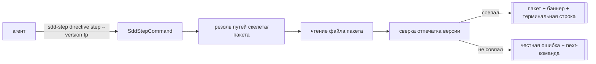
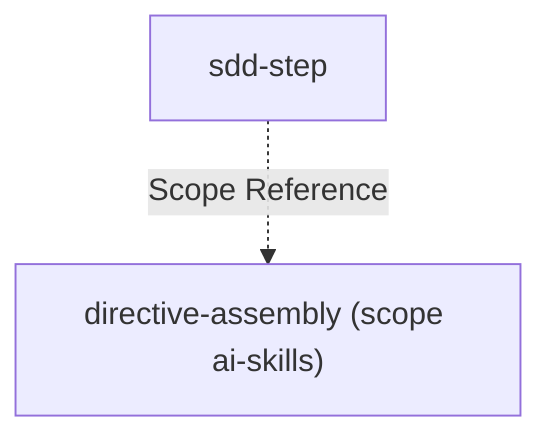
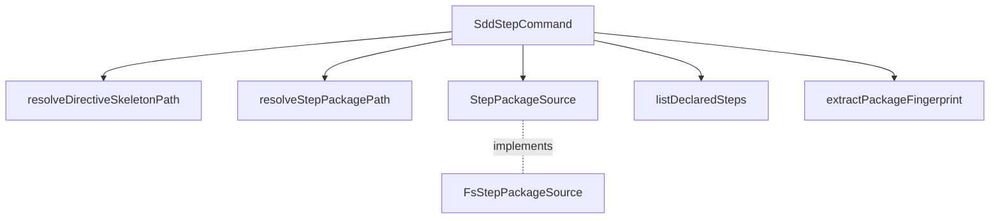

# Module: `sdd-step`

> **DEFERRED** (2026-08-22): инструмент отложен решением оператора после фактчека — доставка
> пакетов реализуется путём+Read (см. [`directive-assembly`](../../ai-skills/directive-assembly/directive-assembly.spec.md),
> DA-DL-12+). DEFERRED_DECISION: вернуться, если живые прогоны покажут потерю агентов на сырых
> ошибках чтения. Спека сохранена как проект инструмента; не реализовывать.

<!--SECTION:MODULE_VISION-->

## Module Vision

Выдача одного пакета шага lazy-директивы. Скелет lazy-директивы
(`ai/directives/sdd-v2/<directive>.directive.xml`, см.
[`directive-assembly`](../../ai-skills/directive-assembly/directive-assembly.spec.md)) печатает
рядом с каждым шагом точную команду: `npx gennady sdd-step <directive> <step-id> --version
<fingerprint>`. Агент выполняет её вместо самостоятельного чтения файла пакета
(`ai/directives/sdd-v2/<directive>/steps/<step-id>.xml`) инструментом чтения файлов — это
единственная точка, где пакет попадает в контекст агента.

Пакет принадлежит директиве, не тикету: `sdd-step` резолвит `<directive>` — имя директивы
sdd-v2 — и `<step-id>` — идентификатор шага внутри неё. Это отличает его от `sdd-task`, который
резолвит Task-ID/путь ТИКЕТА и отдаёт планировочную поверхность тикета, и от `sdd-extract`, который
извлекает произвольную именованную секцию из ОДНОГО файла-артефакта без понятия версии. `sdd-step`
— третий, узкий по предмету инструмент в этом семействе: как `sdd-orient` навигирует по спекам, а
`sdd-log` пишет в Execution Log, `sdd-step` выдаёт пакеты директив (см. Decision Log — три
кандидата рассмотрены и отклонены в пользу отдельной команды).

**Key properties:**

- CLI-опосредованная выдача — единственный канал, которым пакет попадает агенту (DA-REQ-5)
- Version-honest — несовпадение отпечатка версии — жёсткая ошибка с next-командой, никогда тихая
  выдача под чужим отпечатком (DA-REQ-8)
- Tool-teaches — неизвестный шаг называет реально существующие; отсутствующий файл пакета называет
  команду пересборки

→ Parent scope: [`../cli.spec.md`](../cli.spec.md) (§9 Module Map).

<!--/SECTION:MODULE_VISION-->

<!--SECTION:OVERVIEW-->

## Overview


_Команда шага → резолв путей → чтение → сверка версии → выдача или честная ошибка — SS-REQ-1, SS-REQ-4._

<!--/SECTION:OVERVIEW-->

<!--SECTION:MODULE_USAGE_EXAMPLE-->

## Module Usage Example

```bash
# --- happy path: пакет шага выдан под верным отпечатком, exit 0 ---
$ npx gennady sdd-step phase-execution-protocol STEP_2_NARROW_RECON --version 7a1c3f9e
[sdd-step] phase-execution-protocol · STEP_2_NARROW_RECON · build 7a1c3f9e
<PackageAxioms>
  ...одношаговые аксиомы шага STEP_2_NARROW_RECON...
</PackageAxioms>
<StepBody id="STEP_2_NARROW_RECON">
  ...полный текст шага...
</StepBody>
[sdd-step] end STEP_2_NARROW_RECON — build 7a1c3f9e
# exit 0

# --- неизвестный шаг: список ОБЪЯВЛЕННЫХ шагов из скелета (listDeclaredSteps), не файлов на диске, exit 2 ---
$ npx gennady sdd-step phase-execution-protocol STEP_QA_REVIEW --version 7a1c3f9e
[sdd-step] ERR_CLI_SDD_STEP_UNKNOWN_STEP: STEP_QA_REVIEW не найден в phase-execution-protocol
  объявленные шаги: STEP_1_GET_PHASE_CONTEXT, STEP_1B_RESUME_OR_START, STEP_2_NARROW_RECON, STEP_3_LOAD_RULES, STEP_3B_TOOL_API, STEP_4_EXECUTE, STEP_5_VERIFY, STEP_6_EMIT_HANDOFF
  Перечитай список шагов в скелете `ai/directives/sdd-v2/phase-execution-protocol.directive.xml`.
# exit 2

# --- рассинхрон версии: честная ошибка, next-команда, exit 3 ---
$ npx gennady sdd-step phase-execution-protocol STEP_2_NARROW_RECON --version 00000000
[sdd-step] ERR_CLI_SDD_STEP_VERSION_MISMATCH: запрошена версия 00000000, пакет на диске собран под 7a1c3f9e
  Скелет и пакет собраны разными прогонами сборки — текст шага не гарантированно соответствует скелету.
  next: перечитай скелет `ai/directives/sdd-v2/phase-execution-protocol.directive.xml` и возьми команду шага оттуда заново.
# exit 3

# --- шаг объявлен в скелете, но пакет не собран (сборка устарела), exit 1 ---
$ npx gennady sdd-step audit STEP_3_ROUTE --version 9b2e0a11
[sdd-step] ERR_CLI_SDD_STEP_PACKAGE_MISSING: файл пакета для STEP_3_ROUTE отсутствует на диске
  ожидался: ai/directives/sdd-v2/audit/steps/STEP_3_ROUTE.xml
  Сборка не выполнялась после правки директивы, либо выполнена не в режиме lazy. Перезапусти: `npm run build:directives -- --assembly=lazy`.
# exit 1

# --- директива не резолвится, exit 1 ---
$ npx gennady sdd-step no-such-directive STEP_1_GET_PHASE_CONTEXT --version 00000000
[sdd-step] ERR_CLI_SDD_STEP_DIRECTIVE_NOT_FOUND: скелет "no-such-directive" не найден
  искал: ai/directives/sdd-v2/no-such-directive.directive.xml
  Проверь имя директивы — список директив: ai/directives/sdd-v2/*.directive.xml.
# exit 1

# --- некорректный вызов, exit 4 ---
$ npx gennady sdd-step phase-execution-protocol STEP_2_NARROW_RECON
[sdd-step] ERR_CLI_SDD_STEP_BAD_INVOCATION: обязателен `--version <fingerprint>`
  пример: npx gennady sdd-step phase-execution-protocol STEP_2_NARROW_RECON --version 7a1c3f9e
# exit 4

# --- санитизация: аргумент с path traversal отклонён до резолва путей, exit 4 ---
$ npx gennady sdd-step ../../etc STEP_1_GET_PHASE_CONTEXT --version 00000000
[sdd-step] ERR_CLI_SDD_STEP_BAD_INVOCATION: <directive>/<step-id> не может содержать `/`, `\` или `..`
  пример: npx gennady sdd-step phase-execution-protocol STEP_2_NARROW_RECON --version 7a1c3f9e
# exit 4
```

<!--/SECTION:MODULE_USAGE_EXAMPLE-->

<!--SECTION:BDD_SCENARIOS-->

## BDD Scenarios

- **Given** скелет напечатал команду с отпечатком `7a1c3f9e` для `STEP_2_NARROW_RECON`, **when**
  агент вызывает её без изменений, **then** `sdd-step` печатает полный текст пакета, одношаговые
  аксиомы шага и терминальную строку с тем же отпечатком, exit 0 (SS-REQ-1).
- **Given** скелет описывает шаги `STEP_A`..`STEP_E`, **when** агент запрашивает id, которого в
  списке скелета нет, **then** `sdd-step` возвращает список объявленных шагов (не список файлов,
  найденных на диске), а не голое «не найдено» (SS-REQ-3).
- **Given** отпечаток запроса отличается от отпечатка, записанного в файле пакета, **when**
  команда выполняется, **then** ответ называет обе версии и next-команду «перечитай скелет», пакет
  не печатается (SS-REQ-4).
- **Given** `<step-id>` входит в объявленный список шагов скелета (`listDeclaredSteps`), но файл
  его пакета физически отсутствует на диске, **when** команда выполняется, **then** ответ называет
  ожидаемый путь и команду пересборки, а не ENOENT (SS-REQ-5).
- **Given** `<directive>` не резолвится в файл скелета, **when** команда выполняется, **then**
  ответ называет путь, который искался, и подсказывает проверить список директив (SS-REQ-6).
- **Given** вызов не содержит `--version`, **when** команда выполняется, **then** ответ — ошибка
  формы вызова с примером корректного вызова, а не попытка угадать версию (SS-REQ-7).

<!--/SECTION:BDD_SCENARIOS-->

<!--SECTION:MODULE_REQUIREMENTS-->

## Requirements

### Requirements

### SS-REQ-1 [должен]

**Когда** агент выполняет команду шага из скелета lazy-директивы (`npx gennady sdd-step
<directive> <step-id> --version <fingerprint>`), **`sdd-step` должен** вывести полный текст
пакета этого шага (текст шага + его одношаговые аксиомы + его форматы/контракты) вместе с
отпечатком версии, под которым он выдан.

> Это единственный канал, которым содержимое пакета попадает в контекст агента (DA-REQ-5,
> `directive-assembly`) — вывод должен быть самодостаточным, без отсылки «читай ещё файл».

### SS-REQ-2 [должен]

**`sdd-step` должен** резолвить `<directive>` в путь скелета
(`ai/directives/sdd-v2/<directive>.directive.xml`) и `<step-id>` в путь пакета
(`ai/directives/sdd-v2/<directive>/steps/<step-id>.xml`) по той же конвенции путей, которую
использует генератор (`directive-assembly`, DA-REQ-4) — обе стороны обязаны сойтись на одном имени
файла без отдельного маппинга.

> Рассинхрон конвенции путей между генератором и выдачей — отдельный, необязательный класс ошибки;
> одна и та же конвенция в обеих спеках устраняет его по построению.

### SS-REQ-3 [должен · нештатная]

**Если** запрошенный `<step-id>` отсутствует в объявленном списке шагов скелета
(`listDeclaredSteps(skeletonContent)`), **то `sdd-step` должен** вернуть список ОБЪЯВЛЕННЫХ шагов
этой директивы — не список файлов, найденных на диске в `steps/` — вместо голой ошибки «не найдено»
(DA-REQ-12). Если объявленный список пуст, сообщение должно явно называть причину — «шагов не
объявлено — скелет пуст либо директива не собрана в lazy», а не пустой список.

> Голая ошибка тратит следующий ход агента на угадывание корректного идентификатора; список — тот
> же tool-teaches принцип, что у соседних кодов ошибок `sdd-extract`/`sdd-task`. Список должен идти
> из скелета (единственного источника истины, который агент и так держит в контексте), а не из
> файлов на диске — иначе устаревшая сборка молча подменяет список объявленных шагов списком
> файлов, что смешивает эту ветку с `package_missing` (SS-REQ-5). Пустой список без объяснения
> читается как «шагов нет вообще», а не «скелет ещё не lazy».

### SS-REQ-4 [должен · нештатная]

**Если** отпечаток версии из `--version` не совпадает с отпечатком, записанным в файле пакета на
диске, **то `sdd-step` должен** завершиться ошибкой, называющей обе версии, и next-командой
«перечитай скелет `<путь>`», не выдавая пакет (DA-REQ-8).

> Скелет и пакет, собранные разными прогонами, не гарантируют, что текст шага соответствует
> актуальному скелету — тихая выдача маскирует именно этот факт.

### SS-REQ-5 [должен · нештатная]

**Если** `<step-id>` входит в объявленный список шагов скелета (`listDeclaredSteps`), но файл его
пакета отсутствует на диске, **то `sdd-step` должен** сообщить, что сборка не выполнялась либо
выполнена не в режиме lazy, назвать ожидаемый путь и команду пересборки, а не вернуть ENOENT без
объяснения (DA-REQ-13).

> ENOENT без контекста читается как «файла вообще нет в системе» — разница с «нужно пересобрать»
> определяет следующий ход агента.

### SS-REQ-6 [должен · нештатная]

**Если** `<directive>` не резолвится в существующий файл скелета, **то `sdd-step` должен**
завершиться ошибкой, называющей путь, который искался, и подсказкой проверить список директив
(`ai/directives/sdd-v2/*.directive.xml`).

> Опечатка в имени директивы — частый случай при ручном вводе команды; путь поиска в сообщении
> экономит агенту отдельный `ls`.

### SS-REQ-7 [должен · нештатная]

**Если** вызов не содержит одного из трёх обязательных аргументов (`<directive>`, `<step-id>`,
`--version`), **то `sdd-step` должен** завершиться ошибкой формы вызова с примером корректного
вызова.

> Версия — не опциональный аргумент с дефолтом: дефолт для отсутствующей версии эквивалентен
> отключению сверки (DA-REQ-8), поэтому её отсутствие — ошибка вызова, а не «бери последнюю».

### SS-REQ-8 [должен]

**Вывод одного пакета должен** укладываться в хардлимит невырезаемости вывода CLI, зафиксированный
в DA-DL-5 (`specs/ai-skills/directive-assembly/directive-assembly.spec.md`) — `sdd-step` сам не
обрезает и не переупаковывает вывод; гарантию размера несёт сборка (`StepBudgetGate`, DA-REQ-6/
DA-REQ-14), не эта команда.

> Число бюджета живёт в одном месте (спеке сборки, которая его и обосновывает изменяемыми
> внешними лимитами хостов) — дублирование того же числа здесь рискует расхождением при пересмотре.

### SS-REQ-9 [должен]

**Открывающий баннер и терминальная строка вывода `sdd-step` должны** быть фиксированной,
контрактной формы, не зависящей от содержимого пакета: `[sdd-step] <directive> · <step-id> · build
<fingerprint>` перед телом пакета и `[sdd-step] end <step-id> — build <fingerprint>` после него —
чтобы агент детектировал начало и конец пакета механически, без разбора содержимого. Форма
зафиксирована этим требованием, не только примером в Module Usage Example — любая правка формата
баннера/терминальной строки правит эту спеку.

> Пакет может содержать произвольный XML/markdown с собственными открывающими/закрывающими тегами;
> фиксированные внешние строки — единственный надёжный маркер границ пакета, независимый от его
> внутренней структуры.

### SS-REQ-10 [должен]

**Exit-коды `sdd-step` должны** следовать той же шкале, что соседние sdd-*-инструменты
(`sdd-extract`, `sdd-task`, `sdd-orient`): `0` успех · `1` скелет/пакет не найден на диске (файловый
класс) · `2` неизвестный шаг (семантический класс) · `3` рассинхрон версии (структурный класс —
несовпадение двух артефактов, которые обязаны совпадать) · `4` некорректный вызов.

> Агент, уже понявший семантику этой шкалы на соседних инструментах, переносит понимание без
> изучения нового контракта exit-кодов.

### SS-REQ-11 [должен · нештатная]

**Если** `<directive>` или `<step-id>` содержит `/`, `\` или `..`, **то `sdd-step` должен**
отклонить вызов как `bad_invocation` (exit 4) до резолва каких-либо путей.

> `<directive>`/`<step-id>` подставляются буквально в путь на диске (SS-REQ-2); без санитизации
> значение вида `../../etc/passwd` резолвилось бы в путь вне разрешённой директории
> `ai/directives/sdd-v2/` — санитизация закрывает этот класс path traversal по построению, до того
> как путь попадёт в `StepPackageSource`.

<!--/SECTION:MODULE_REQUIREMENTS-->

<!--SECTION:INTER_MODULE_DEPENDENCIES-->

## Inter-Module Dependencies

- **Depends on:** N/A (единственный модуль cli, специфичный для выдачи пакетов директив)
- **Scope Reference (cross-scope):**
  [`directive-assembly`](../../ai-skills/directive-assembly/directive-assembly.spec.md) (scope
  `ai-skills`) — определяет конвенцию путей скелета/пакета и формат отпечатка версии, которые
  `sdd-step` читает
- **Provides to:** Агенты и операторы, исполняющие lazy-директивы (внешний потребитель, не модуль
  этого скоупа)


_Чей формат `sdd-step` читает — SS-REQ-2._

<!--/SECTION:INTER_MODULE_DEPENDENCIES-->

<!--SECTION:ENTITY_INVENTORY-->

## Entity Inventory

_Это полный список сущностей модуля. Любое введение сущности execution-агентом помимо этого списка считается drift'ом и требует обновления spec._

| Name                            | Type         | Purpose                                                                                    |
| -------------------------------- | ------------ | ------------------------------------------------------------------------------------------- |
| `SddStepCommand`                 | Function     | Точка входа CLI: парсинг argv, резолв путей, чтение пакета, сверка версии, печать          |
| `SddStepOptions`                 | Type         | Опции: `directive`, `stepId` (позиционные), `--version`                                    |
| `resolveDirectiveSkeletonPath`   | Function     | `<directive>` → путь скелета                                                               |
| `resolveStepPackagePath`         | Function     | `<directive>, <step-id>` → путь файла пакета                                               |
| `listDeclaredSteps`              | Function     | Парсит СКЕЛЕТ директивы, возвращает объявленный список `<step-id>` — источник истины для unknown_step (не файлы на диске) |
| `extractPackageFingerprint`      | Function     | Читает отпечаток версии, записанный в файле пакета                                         |
| `StepPackageSource`               | Port         | Абстракция чтения файла пакета/скелета по пути                                             |
| `FsStepPackageSource`            | Adapter      | Реализация `StepPackageSource` через `node:fs`                                             |
| `StepPackageOutcome`             | Type         | Дискриминированный union: `ok` \| `directive_not_found` \| `unknown_step` \| `package_missing` \| `version_mismatch` \| `bad_invocation` |
| `ERR_CLI_SDD_STEP_*`             | Value Object | 5 кодов ошибок (directive-not-found, package-missing, unknown-step, version-mismatch, bad-invocation) |

<!--/SECTION:ENTITY_INVENTORY-->

<!--SECTION:ENTITY_SURFACES-->

## Entity Surfaces

Основная поверхность — `SddStepCommand` (CLI-вход) и `StepPackageSource`/`FsStepPackageSource`
(единственная точка файлового ввода-вывода); резолверы путей, `listDeclaredSteps` и
`extractPackageFingerprint` — внутренние чистые утилиты.

<details>
<summary>Полные поверхности сущностей</summary>

### `SddStepCommand`

- **Type:** Function
- **Purpose:** Точка входа `gennady sdd-step`: парсит argv, резолвит пути, читает пакет, сверяет версию, печатает.
- **Signature:** `(argv: string[], root?: string) => Promise<{ ok: boolean; exitCode: number }>`
- **Contract:**
  - Ровно три обязательных аргумента (`directive`, `step-id`, `--version`), и ни один из `directive`/`step-id` не содержит `/`, `\` или `..` — иначе `bad_invocation` (exit 4)
  - Скелет не резолвится → `directive_not_found` (exit 1)
  - `step-id` не входит в объявленный список шагов скелета (`listDeclaredSteps(skeletonContent)`) → `unknown_step` (exit 2), с подсказкой, перечисляющей ОБЪЯВЛЕННЫЕ шаги из скелета (не файлы на диске)
  - `step-id` входит в объявленный список, но файл его пакета отсутствует на диске → `package_missing` (exit 1), с командой пересборки
  - Отпечаток запроса ≠ отпечаток пакета → `version_mismatch` (exit 3), с обоими значениями и next-командой
  - Всё сошлось → печатает баннер + тело пакета + терминальную строку (SS-REQ-9), exit 0
  - Порядок проверки веток — инвариант: `bad_invocation` → `directive_not_found` → `unknown_step` → `package_missing` → `version_mismatch` (см. Invariants ниже)
- **Side Effect:** stdout, `process.exit` (только в самовызывающемся блоке, не в `run`)

### `resolveDirectiveSkeletonPath`

- **Type:** Function
- **Purpose:** `<directive>` → путь скелета по конвенции `directive-assembly` (DA-REQ-4).
- **Signature:** `(directive: string, root: string) => string`
- **Contract:** Возвращает `ai/directives/sdd-v2/<directive>.directive.xml` относительно `root`; не проверяет существование файла — это делает `StepPackageSource`.

### `resolveStepPackagePath`

- **Type:** Function
- **Purpose:** `<directive>, <step-id>` → путь файла пакета.
- **Signature:** `(directive: string, stepId: string, root: string) => string`
- **Contract:** Возвращает `ai/directives/sdd-v2/<directive>/steps/<step-id>.xml` относительно `root`.

### `listDeclaredSteps`

- **Type:** Function
- **Purpose:** Источник истины списка шагов директивы — парсит СОДЕРЖИМОЕ СКЕЛЕТА (не файлы на
  диске в `steps/`) и возвращает объявленный список `<step-id>`, тот же список, что скелет
  показывает агенту (DA-REQ-3, `directive-assembly`).
- **Signature:** `(skeletonContent: string) => string[]`
- **Contract:** Извлекает `id` каждого шага, объявленного в списке шагов скелета; скелет без
  объявленных шагов → пустой список (вызывающий код формулирует явное сообщение «шагов не
  объявлено — скелет пуст либо директива не собрана в lazy», не бросает и не возвращает пустой
  список без объяснения). Не читает директорию `steps/` — наличие или отсутствие файла пакета для
  уже объявленного шага проверяет отдельно `StepPackageSource`; это разводит `unknown_step` (id не
  входит в результат `listDeclaredSteps`) от `package_missing` (id входит в результат, но файл
  отсутствует на диске).

### `extractPackageFingerprint`

- **Type:** Function
- **Purpose:** Достаёт отпечаток версии, записанный в заголовок файла пакета при сборке (DA-REQ-7).
- **Signature:** `(packageContent: string) => string | null`
- **Contract:** Отпечаток не найден в ожидаемом месте заголовка → `null` (вызывающий код обрабатывает как повреждённый/до-версийный пакет — та же ветка, что `package_missing`, с уточнённым сообщением).

### `StepPackageSource`

- **Type:** Port
- **Purpose:** Абстракция чтения содержимого файла (скелета или пакета) по пути — единственная точка вариативности между реальным диском и тестовой фикстурой.
- **Consumers:**
  - Internal: `SddStepCommand`
  - External: N/A
- **Runtime Backing:** `real-runtime`
- **Verification Levels:** `unit`, `integration`
- **Deferred Runtime Scope:** None

**Contract (DbC):**

- `read`:
  - Pre: `path` — абсолютный путь
  - Post: возвращает содержимое файла как строку
  - On pre-violation: файл не существует или не читается → возвращает `null` (не бросает — вызывающий код различает `directive_not_found`/`package_missing` по тому, какой путь вернул `null`)

### `FsStepPackageSource`

- **Type:** Adapter
- **Implements:** `StepPackageSource` (`core/step-package-source.ts`)
- **Purpose:** Читает скелеты и пакеты через `node:fs` (`readFileSync`).
- **Runtime Backing:** `real-runtime`
- **Verification Levels:** `unit` (временные фикстуры на диске), `e2e`
- **Deferred Runtime Scope:** None

**Side Effects:**

- Файловый ввод-вывод: чтение `.directive.xml` и `steps/*.xml` — только чтение, ничего не пишет

</details>
<!--/SECTION:ENTITY_SURFACES-->

<!--SECTION:MODULE_CONTRACTS-->

## Module Contracts

Один Port (`StepPackageSource`) и один Adapter (`FsStepPackageSource`); остальные сущности — чистые
функции без Port (резолв путей, разбор отпечатка — без побочных эффектов,
`AX_PORTS_AND_ABSTRACTIONS_DISCIPLINE`).



_Кто от кого зависит внутри `sdd-step` — SS-REQ-1, SS-REQ-2._

| Step | Participant | Action | Data |
|---|---|---|---|
| 1 | Agent | `sdd-step <directive> <step-id> --version <fp>` | directive, step-id, fingerprint |
| 2 | `SddStepCommand` | резолвит путь скелета (`resolveDirectiveSkeletonPath`), читает его через `StepPackageSource` — не найден → `directive_not_found` | путь + содержимое скелета или `null` |
| 3 | `SddStepCommand` | парсит объявленный список шагов (`listDeclaredSteps(skeletonContent)`), сверяет `step-id` — не входит → `unknown_step` | объявленный список шагов |
| 4 | `SddStepCommand` | резолвит путь пакета (`resolveStepPackagePath`), читает его через `StepPackageSource` — файла нет → `package_missing` | путь + содержимое пакета или `null` |
| 5 | `SddStepCommand` | сверяет `extractPackageFingerprint(content)` с запрошенным `fp` — не совпало → `version_mismatch` | совпадение/несовпадение |
| 6 | `SddStepCommand` | печатает баннер + тело + терминальную строку, либо честную ошибку | stdout, exit code |

_Главный сценарий — выдача пакета шага с проверкой версии, в фиксированном порядке проверки веток
(bad_invocation → directive_not_found → unknown_step → package_missing → version_mismatch) —
SS-REQ-1, SS-REQ-4._

<details>
<summary>Контракты DbC</summary>

см. `Entity Surfaces` выше — DbC-блоки `StepPackageSource`/`FsStepPackageSource` полностью описаны
там (модуль мал, дублирование того же блока здесь избыточно).

**Invariants:**

- Проверки веток исполняются в фиксированном порядке: `bad_invocation` → `directive_not_found` →
  `unknown_step` → `package_missing` → `version_mismatch`; при формальной применимости нескольких
  веток одновременно срабатывает первая по этому порядку, остальные не проверяются и не сообщаются.
- Ровно одна ветка ошибки активна за один вызов — они взаимоисключающие результаты одной
  последовательной проверки, не накопительный список находок.

</details>
<!--/SECTION:MODULE_CONTRACTS-->

<!--SECTION:FILE_STRUCTURE-->

## File Structure

```
sdd-step/
├── index.ts
├── help.ts
├── sdd-step.types.ts
├── sdd-step.cmd.ts
├── core/
│   ├── step-package-source.ts     (Port + Adapter)
│   ├── resolve-paths.ts           (resolveDirectiveSkeletonPath, resolveStepPackagePath)
│   ├── declared-steps.ts          (listDeclaredSteps — парсит скелет, не steps/ на диске)
│   └── fingerprint.ts             (extractPackageFingerprint)
└── __tests__/
    ├── fixtures/
    ├── resolve-paths.test.ts
    ├── declared-steps.test.ts
    ├── fingerprint.test.ts
    └── sdd-step.cmd.test.ts
```

**File Mapping:**

- `sdd-step.cmd.ts`: `SddStepCommand`
- `core/resolve-paths.ts`: `resolveDirectiveSkeletonPath`, `resolveStepPackagePath`
- `core/declared-steps.ts`: `listDeclaredSteps`
- `core/step-package-source.ts`: `StepPackageSource` (port) + `FsStepPackageSource` (adapter)
- `core/fingerprint.ts`: `extractPackageFingerprint`
<!--/SECTION:FILE_STRUCTURE-->

<!--SECTION:MODULE_DECISION_LOG-->

## Module Decision Log

Четыре записи: выбор имени команды среди трёх кандидатов, механическая генерация акронима,
переиспользование шкалы exit-кодов соседей, ссылка на бюджет вместо дублирования числа.

<details>
<summary>Полные записи Decision Log</summary>

### SS-DL-1 2026-08-22 — новая команда `sdd-step`, не расширение `sdd-extract`, не режим `sdd-task --step` (почему: рассмотрены три кандидата — (1) `sdd-extract <package-file> STEP_N` — контракт `sdd-extract` про безусловное извлечение анонимной секции по имени из ОДНОГО файла, без понятия версии; добавление версийной сверки и tool-teaches про «шаг не существует»/«пакет не собран» смешало бы в него чужой домен; (2) `sdd-task --step`, по образцу уже существующего `sdd-task --phase` — отклонено, `sdd-task` резолвит Task-ID/путь ТИКЕТА, а пакет принадлежит ДИРЕКТИВЕ, не тикету, — это смешение доменов, а не переиспользование механики; (3) новая узкая команда `sdd-step` — выбрана: сохраняет каждый sdd-*-инструмент однозначным по предметной области (sdd-orient — спеки, sdd-log — Execution Log, sdd-sync — трекеры), а не по случайно похожей механике «выдать кусок текста по идентификатору»; отвергнуто: варианты (1) и (2) выше)

### SS-DL-2 2026-08-22 — акроним `SS` по `deriveSpecAcronym('sdd-step')` (2 слова → инициалы `S`+`S`) (почему: механическая, не авторская генерация — тот же путь, что дал `SO` для `sdd-orient`; отвергнуто: ручной акроним `STEP`/`SDDSTEP` — не соответствует грамматике `REQUIREMENT_ENTRY_FORMAT`/`deriveSpecAcronym`, вносит несогласованность с соседними спеками)

### SS-DL-3 2026-08-22 — exit-коды 0/1/2/3/4 переиспользуют шкалу `sdd-extract`/`sdd-task`/`sdd-orient`, отдельная шкала не вводится (почему: агент, уже понявший категории «файл/семантика/структура/вызов» на соседних инструментах, переносит понимание без изучения нового контракта; отвергнуто: отдельный код на каждую из пяти веток ошибок — избыточное дробление, шкала соседей уже покрывает нужные категории)

### SS-DL-4 2026-08-22 — хардлимит размера пакета — ссылка на `DA-DL-5` (`directive-assembly`), число не дублируется в этой спеке (почему: единственный источник истины о бюджете пакета — сборка, которая его и гарантирует и обосновывает изменяемыми внешними лимитами хостов; отвергнуто: `sdd-step` сам обрезает вывод при превышении — отклонено, тихая обрезка воспроизводит именно тот антипаттерн потери хвоста, который весь механизм лениво собираемых пакетов должен предотвратить)

</details>
<!--/SECTION:MODULE_DECISION_LOG-->

<!--SECTION:HANDOFF-->

## Handoff to Tasks

- **Implementation files to be created:** см. File Structure
- **Test files to be created:** `__tests__/*.test.ts` + `__tests__/fixtures/**` (директива с полным набором пакетов, неизвестный шаг, рассинхрон версии, отсутствующий файл пакета, отсутствующий скелет, некорректный вызов)
- **Stack dependencies:**
  - Language: `typescript` (resolves to `ai/directives/coding/typescript-rules.xml`)
  - Test framework: `node:test` (resolves to `ai/directives/testing/node-test.xml`)
- **Module Rules Additions:** None (наследует scope-wide baseline `cli`)

  | Rule | Category | Source |
  | ---- | -------- | ------ |

- **Open risks & validation needs:**
  - Формат заголовка пакета, в котором `extractPackageFingerprint` ищет отпечаток, зависит от
    точного места, куда `directive-assembly`/`LazyDirectiveAssembler` его штампует — обе спеки
    должны реализовываться и тестироваться на общей фикстуре, не раздельно
  - Живой прогон внутри Claude Code и opencode (реальный вызов `sdd-step` из-под каждого хоста на
    пакете, близком к хардлимиту 8000 символов) не выполнен — сделать до того, как `StepBudgetGate`
    станет блокирующим гейтом CI
  <!--/SECTION:HANDOFF-->

## Critic Rounds

### Round 1 — 2026-08-22

- **Verdict:** CRITICAL
- **Accepted:**
  1. Источник истины списка шагов не был разведён — введена `listDeclaredSteps(skeletonContent)`,
     парсящая СКЕЛЕТ директивы; разведены `unknown_step` (id не в объявленном списке скелета,
     подсказка называет объявленные шаги, не файлы на диске) и `package_missing` (id объявлен, но
     файла нет) — поправлены Entity Inventory/Surfaces, `SddStepCommand`, SS-REQ-3/SS-REQ-5 и их BDD.
  2. Порядок проверок не был зафиксирован инвариантом — добавлен в Invariants контракта
     `SddStepCommand`: `bad_invocation` → `directive_not_found` → `unknown_step` →
     `package_missing` → `version_mismatch`, первая применимая по порядку побеждает.
  3. Санитизация аргументов от path traversal не была специфицирована — добавлен SS-REQ-11:
     `<directive>`/`<step-id>` с `/`, `\` или `..` отклоняются как `bad_invocation` до резолва путей.
  4. Форма баннера была только в примере — зафиксирована требованием SS-REQ-9 рядом с терминальной
     строкой (`[sdd-step] <directive> · <step-id> · build <fp>` / `[sdd-step] end <step-id> — build
     <fp>`).
  5. Сообщение для пустого объявленного списка шагов не имело формулировки — зафиксирована в
     SS-REQ-3: «шагов не объявлено — скелет пуст либо директива не собрана в lazy».
  6. Module Usage Example использовал позиционные/несогласованные id (`STEP_2`, `P2_IMPLEMENT`,
     `audit STEP_4`) — переведён на дословные id реальных шагов (`STEP_2_NARROW_RECON`, `audit
     STEP_3_ROUTE` и т.п.), согласованно с правкой 5 `directive-assembly.spec.md`.
- **Rejected:** нет
- **Out of cycle:** наблюдение сенсора про Vision-абзац `cli.spec.md` — вне артефакта этого цикла
  (не `directive-assembly`/`sdd-step`), передано оператору без правки здесь.
- **Changes:** правки 1–6 выше, внесены точечно в Entity Inventory/Surfaces (`listDeclaredSteps`),
  Module Contracts (мермейд, sequence-таблица, Invariants), SS-REQ-3/SS-REQ-5/SS-REQ-9 (расширен)/
  SS-REQ-11 (новый), Module Usage Example, BDD-сценарии SS-REQ-1/SS-REQ-3/SS-REQ-5, File
  Structure/File Mapping.
