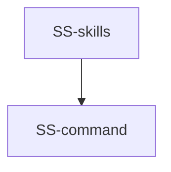

# sync-skills — Tasks

## Tracker Index

| Task-ID    | Title                                                                | Dependencies | Status   | Reopens |
| ---------- | -------------------------------------------------------------------- | ------------ | -------- | ------- |
| SS-command | sync-skills command (типы, ядро, форматтер, CLI, тесты, регистрация) | SYN-shared   | [ ] TODO | —       |
| SS-skills  | ai/skills bootstrap (13 SDD-скилов)                                  | SS-command   | [ ] TODO | —       |

## Slug Registry

<!-- один ID на строку; уникальность держится этим списком — одинаковый ID в двух ветках сталкивается здесь при merge. Только добавление. -->

- SS-command
- SS-skills

## Intra-Module DAG

<!-- ребро A → B = «A зависит от B». Кросс-модульные рёбра живут уровнем выше. -->

## Decision Log (module-task level)

<!-- решения декомпозиции/планирования; локальные решения исполнения — в Decision Log самих тикетов. -->

## Conventions

Проектные конвенции объявлены в `specs/3-tasks.md` и наследуются — здесь не повторяются.
