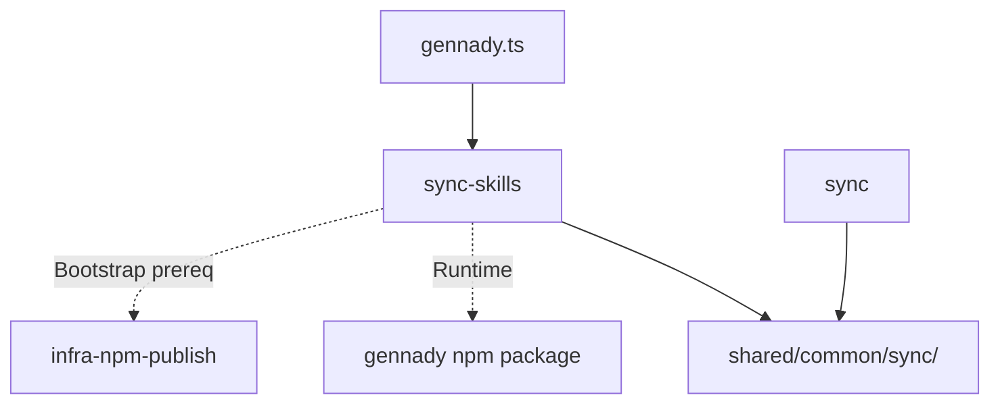

# Module: sync-skills

## 1. Module Vision

Команда `gennady sync-skills` в `cli/cmd/sync-skills/`: синхронизирует SDD-скилы из `ai/skills/` npm-пакета gennady в `<cwd>/.claude/skills/`. 13 скилов: alt-opinion, sdd-audit, sdd-check, sdd-continue, sdd-critic, sdd-discover, sdd-execute (с scripts/), sdd-execute-batch, sdd-fix, sdd-infra, sdd-module-decomposition, sdd-scaffold, sdd-setup. Каждый скил — директория с `SKILL.md` и ресурсами (scripts, prompts). Полная синхронизация с orphan-удалением (rsync --delete). Файлы сравниваются побайтово (`Buffer.compare`). Вывод: `+` (added), `~` (updated), `-` (deleted), `=` (unchanged). Zero runtime dependencies (только Node.js built-in). Shared core с `sync`: `resolvePackageDir`, `compareBytes`, `SyncFormatter`, `SyncCmdDeps` вынесены в `shared/common/sync/`. Поддержка `--dry-run`.

→ Parent scope: [`../../cli.spec.md`](../../cli.spec.md) (раздел 5.7 sync-skills).

→ Out-of-scope (v1): [`../../cli.spec.md §4.3`](../../cli.spec.md) — авто-проверка обновлений, регистрация в opencode.json, интерактивный режим, --watch, другие источники, миграция форматов.

## 2. Entity Inventory (Closed-World)

_Это полный список сущностей модуля. Любое введение сущности execution-агентом помимо этого списка считается drift'ом и требует обновления spec._

| Name                  | Type         | Purpose                                                                                             |
| --------------------- | ------------ | --------------------------------------------------------------------------------------------------- |
| `SyncSkillsOptions`   | Value Object | Конфигурация: `sourceDir`, `targetDir`, `skillNames?`, `dryRun?`                                    |
| `SyncSkillsFileEntry` | Value Object | Результат сравнения одного файла внутри скила: `skillName`, `relativePath`, `status`, `sourceSize`  |
| `SyncSkillsResult`    | Value Object | Агрегат: `entries` + computed `added`, `updated`, `deleted`, `unchanged`, `deleteFailed`, `summary` |
| `SyncSkillsCore`      | Service      | Ядро: `scanSkills`, `collectAndCompareSkills` (рекурсивное, с orphan-детектом)                      |
| `SyncSkillsFormatter` | Service      | Форматтер: `format(entries, opts) → string[]` — маркеры + отступы для вложенных файлов             |
| `SyncCmdDeps`         | Port         | Импортируется из `shared/common/sync/sync-deps.type.ts` (shared с `sync`)                           |

## 3. Entity Surfaces

### `SyncSkillsOptions`

- **Type:** Value Object
- **Purpose:** Входная конфигурация для `SyncSkillsCore.collectAndCompareSkills`
- **Public Properties:**
  - `sourceDir: string` — абсолютный путь к `ai/skills/` в npm-пакете
  - `targetDir: string` — абсолютный путь к `<cwd>/.claude/skills/`
  - `skillNames?: string[]` — опциональный фильтр: имена скилов
  - `dryRun?: boolean` — default `false`
- **Lifecycle:** Создаётся в `sync-skills.cmd.ts` после `resolvePackageDir`, передаётся в `SyncSkillsCore`
- **Consumers:** `SyncSkillsCore`

### `SyncSkillsFileEntry`

- **Type:** Value Object
- **Purpose:** Результат сравнения одного файла внутри скила
- **Public Properties:**
  - `skillName: string` — имя скила (например, `sdd-execute`)
  - `relativePath: string` — путь относительно корня скила (например, `scripts/verify.sh`)
  - `status: 'added' | 'updated' | 'deleted' | 'unchanged' | 'deleteFailed'`
  - `sourceSize?: number` — размер в байтах в источнике
  - `targetSize?: number` — размер в байтах в цели (только для `updated`/`unchanged`)
  - `errorCode?: string` — код ошибки ОС при `deleteFailed` (например `EACCES`, `EBUSY`)
- **Lifecycle:** Immutable. Создаётся `collectAndCompareSkills` для каждого файла
- **Consumers:** `SyncSkillsFormatter`, `SyncSkillsResult`

### `SyncSkillsResult`

- **Type:** Value Object
- **Purpose:** Агрегат всех `SyncSkillsFileEntry` + computed свойства
- **Public Properties:**
  - `entries: SyncSkillsFileEntry[]`
- **Public Operations (getters):**
  - `get added(): SyncSkillsFileEntry[]` — фильтр по `status === 'added'`
  - `get updated(): SyncSkillsFileEntry[]` — фильтр по `status === 'updated'`
  - `get deleted(): SyncSkillsFileEntry[]` — фильтр по `status === 'deleted'`
  - `get unchanged(): SyncSkillsFileEntry[]` — фильтр по `status === 'unchanged'`
  - `get deleteFailed(): SyncSkillsFileEntry[]` — фильтр по `status === 'deleteFailed'`
  - `get summary(): string` — `Synced: N added, M updated, K skipped, D deleted`. «Skipped» — user-facing термин для entries со статусом `unchanged`
  - `get dryRunSummary(): string` — `Dry-run: no files written.`
- **Lifecycle:** Создаётся `SyncSkillsCore.collectAndCompareSkills`. Immutable
- **Consumers:** `SyncSkillsFormatter`, `sync-skills.cmd.ts`

### `SyncSkillsCore`

- **Type:** Service (чистые функции, без I/O к stdout)
- **Purpose:** Ядро синхронизации скилов: сканирование, рекурсивное сравнение, orphan-детект
- **Public Operations:**
  - `scanSkills(sourceDir: string, skillNames?: string[]): Map<string, Map<string, Buffer>>` — карта `skillName → {filePath → content}`. Применяет исключения (скрытые файлы, `.DS_Store`)
  - `collectAndCompareSkills(deps: SyncCmdDeps, opts: SyncSkillsOptions): SyncSkillsResult` — главная точка входа
- **Lifecycle:** Stateless. Вызывается `sync-skills.cmd.ts`
- **Errors & Degradation:**
- `resolvePackageDir` может вернуть `null` — ошибка обрабатывается в `sync-skills.cmd.ts` до создания `SyncSkillsOptions`: вывод `gennady package not found. Install it locally: npm i -D gennady`, exit 1. Ядро получает гарантированно валидный `sourceDir`
- `scanSkills` → бросает ошибку если указанный скил не существует (с перечислением доступных). Это hard error — прерывает синхронизацию, exit 1
- `collectAndCompareSkills` → бросает ошибку если `sourceDir` не существует
- Если `sourceDir` существует, но является файлом (а не директорией) → фатальная ошибка `[sync-skills] sourceDir is not a directory: <path>`, exit 1
- Ошибка удаления orphan (EACCES, EBUSY) → `status: 'deleteFailed'`, не прерывает синхронизацию
- `.claude/` существует как директория без прав на запись → фатальная ошибка `[sync-skills] cannot write to .claude/skills/: <EACCES>`
- Ошибка записи (writeFile fail) → фатальная: бросает `Error` с anchor-префиксом `[sync-skills]`, прерывает синхронизацию
- **Consumers:** `sync-skills.cmd.ts`
- **Uses shared:** `compareBytes` из `shared/common/sync/sync-core.shared.ts`. `resolvePackageDir` НЕ вызывается ядром — cmd.ts резолвит путь через `deps.resolvePackageDir` и передаёт готовый `sourceDir` в `SyncSkillsOptions`

### `SyncSkillsFormatter`

- **Type:** Service (pure transformer)
- **Purpose:** Форматирует `SyncSkillsFileEntry[]` в строки для stdout с группировкой по скилам и отступами
- **Public Operations:**
  - `format(entries: SyncSkillsFileEntry[], opts: { dryRun?: boolean }): string[]` — массив строк для вывода
- **Lifecycle:** Stateless
- **Format:**
  - Скилы группируются: added → updated → deleted → unchanged, лексикографически
  - `added` → `  + <skillName>/` + все файлы с отступом `      <relativePath>`
  - `updated` → `  ~ <skillName>/` + только изменившиеся файлы `      <relativePath>`
  - `deleted` → `  - <skillName>/`
  - `deleteFailed` → `  ! <skillName>/                                         (delete failed: <code>)`
  - `unchanged` → `  = <skillName>/                                                   (unchanged)`
  - dryRun `added` → `      <relativePath>                                   (would add)`
  - dryRun `updated` → `      <relativePath>                                   (would update)`
  - dryRun `deleted` → `  - <skillName>/                                            (would delete)` — файлы перечислены без суффикса (rmdir recursive — одна операция)
   - dryRun `unchanged` → `  = <skillName>/                                   (unchanged, skip)`
   - Отступы в примерах иллюстративны (визуальное выравнивание). Реализатор вычисляет padding динамически по максимальной длине имени скила среди отображаемых.
   - Итоговая строка: `Synced: N added, M updated, K skipped, D deleted`. При наличии `deleteFailed`: `Synced: N added, M updated, K skipped, D deleted, F delete failed`
   - dryRun итоговая: `Dry-run: no files written.`
- **Consumers:** `sync-skills.cmd.ts`
- **Uses shared:** `SyncFormatter` базовые маркеры из `shared/common/sync/sync-formatter.shared.ts`

### `SyncCmdDeps` (Port)

- **Type:** Port — импортируется из `shared/common/sync/sync-deps.type.ts`
- **Purpose:** Абстракция файловой системы и вывода для тестируемости. Shared с командой `sync`
- **Public Properties:**
  - `readFile: (path: string) => Buffer`
  - `writeFile: (path: string, data: Buffer) => void`
  - `unlink: (path: string) => void`
  - `rmdir: (path: string, options?: { recursive: boolean }) => void`
  - `mkdir: (path: string, options?: { recursive: boolean }) => void`
  - `stat: (path: string) => Stats`
  - `readdir: (path: string) => string[]`
  - `resolvePackageDir: (cwd: string, subdir: string) => string | null`
  - `stdout: Writable`
  - `stderr: Writable`
- **Lifecycle:** Создаётся в `sync-skills.cmd.ts` — в проде `fs.*`, `path.*`, `process.stdout/stderr`. В тестах — моки
- **Consumers:** `SyncSkillsCore`, `sync-skills.cmd.ts`

## 4. Module Contracts (DbC)

### 4.1 Ports

### `SyncCmdDeps` (Port)

Shared с `sync`. Расширен полями `unlink`, `rmdir` для orphan-удаления.

**Invariant:** `resolvePackageDir(cwd, 'ai/skills')` всегда возвращает путь, заканчивающийся на `ai/skills` (см. §3 SyncCmdDeps, shared core). Эта инварианта принадлежит shared-функции, не ядру.

### 4.2 Service: `SyncSkillsCore`

- **Purpose:** Ядро синхронизации скилов
- **Consumers:** `sync-skills.cmd.ts`
- **Runtime Backing:** `real-runtime`
- **Verification Levels:** `unit`, `integration`
- **Deferred Runtime Scope:** None

**Contract (DbC):**

- **Preconditions:**
  - `deps.unlink` и `deps.rmdir` — не-null (обязательны для sync-skills; для sync эти поля присутствуют в типе, но не используются)
  - `opts.sourceDir` — существующая директория с `ai/skills/`
  - `opts.targetDir` — корректный путь (может не существовать). Родительская директория (`.claude/`) должна быть либо отсутствующей, либо директорией. `mkdirSync({ recursive: true })` создаёт и `.claude/` и `.claude/skills/` за один вызов. Если `.claude` существует как файл — ошибка с anchor-сообщением `[sync-skills] .claude exists but is not a directory`
- **Postconditions:**
  - Если `dryRun` — ни один `writeFile` / `unlink` / `rmdir` не вызван
  - Если не `dryRun` — для каждого `added`/`updated` файла вызван `writeFile`
  - Если не `dryRun` — для каждого `deleted` файла/директории вызван `unlink`/`rmdir`
  - Возвращённый `SyncSkillsResult.entries` отсортирован: скилы лексикографически, файлы внутри скила лексикографически
  - Скрытые файлы (`.`-префикс) и `.DS_Store` не попадают в результат
  - При фильтрации (`skillNames`) — orphan-удаление только для указанных скилов
 - **Invariants:**
   - Никогда не пишет в stdout/stderr
   - `scanSkills` всегда возвращает пути с прямыми слешами (`/`)
   - Целевые пути (`.claude/`, `.claude/skills/`) должны быть реальными директориями. Символические ссылки не обрабатываются специально — orphan-удаление через symlink может задеть файлы вне ожидаемого target. Пользователь обязуется не использовать symlink в целевом пути.

### 4.3 Service: `SyncSkillsFormatter`

- **Purpose:** Форматирование вывода с группировкой по скилам
- **Consumers:** `sync-skills.cmd.ts`
- **Runtime Backing:** `real-runtime`
- **Verification Levels:** `unit`
- **Deferred Runtime Scope:** None

**Contract (DbC):**

- **Preconditions:**
  - `entries` — массив `SyncSkillsFileEntry`
- **Postconditions:**
   - Возвращает `string[]` — сгруппировано по `skillName`.
   - Порядок групп: added → updated → deleted → unchanged, лексикографически внутри каждой группы.
   - Конкретные маркеры, dry-run-суффиксы, отступы и итоговая строка описаны в §3 (Format).
   - При пустом `entries` — только итоговая строка `Synced: 0 added, 0 updated, 0 skipped, 0 deleted`.
   - `deleted` статус — только на уровне целого скила. Смешанные статусы (часть файлов added, часть deleted) внутри одного скила невозможны.
- **Invariants:**
  - Не делает I/O
  - Формат строки: `  <marker> <skillName>/<padding><status_label>`

## 5. Public Options & Policies

| Option             | Binding                        | Status   |
| ------------------ | ------------------------------ | -------- |
| `--dry-run`        | `SyncSkillsOptions.dryRun`     | ✅ bound |
| Позиционные args   | `SyncSkillsOptions.skillNames` | ✅ bound |
| Скрытые файлы      | Константа в `sync-skills-core.ts` | ✅ bound |
| `.DS_Store`        | Константа в `sync-skills-core.ts` | ✅ bound |

Все опции привязаны. Нет отложенных.

## 6. File Structure

```
cli/cmd/sync-skills/
├── index.ts                       # import { run } from './sync-skills.cmd.ts'; run(process.argv)
├── sync-skills.cmd.ts             # CLI-обвязка: parseArgs, build deps (~80 lines, estimate)
├── sync-skills.types.ts           # SyncSkillsOptions, SyncSkillsFileEntry, SyncSkillsResult (~50 lines, estimate)
├── sync-skills-core.ts            # Ядро: scanSkills, collectAndCompareSkills (~100 lines, estimate)
├── sync-skills-formatter.ts       # Форматтер: format(entries, opts) → string[] (~60 lines, estimate)
└── __tests__/
    ├── sync-skills-core.test.ts       # Unit: scanSkills (5), collectAndCompareSkills (8), orphan (4) = ~17 cases (~150 lines)
    ├── sync-skills-formatter.test.ts  # Unit: format (8 cases): mixed, dryRun, deleteFailed, empty (~90 lines)
    └── sync-skills.cmd.test.ts        # Integration: happy path, --dry-run, filter, errors, deleteFailed (10 cases) (~150 lines)

shared/common/sync/                    # shared с командой sync
├── sync-core.shared.ts               # resolvePackageDir(subdir), compareBytes (~30 lines)
├── sync-formatter.shared.ts          # formatSyncOutput(entries, opts) — базовые маркеры (~40 lines)
└── sync-deps.type.ts                 # SyncCmdDeps (порт) — расширен unlink, rmdir (~15 lines)

ai/skills/                            # 13 скилов (физические артефакты в репозитории)
├── alt-opinion/                       # SKILL.md + opinion.prompt.md + synth.prompt.md
├── sdd-audit/SKILL.md
├── sdd-check/SKILL.md
├── sdd-continue/SKILL.md
├── sdd-critic/SKILL.md
├── sdd-discover/SKILL.md
├── sdd-execute/                       # SKILL.md + scripts/ (8 файлов)
├── sdd-execute-batch/SKILL.md
├── sdd-fix/SKILL.md
├── sdd-infra/SKILL.md
├── sdd-module-decomposition/SKILL.md
├── sdd-scaffold/SKILL.md
└── sdd-setup/SKILL.md
```

**File Mapping:**

| File                                      | Entity                                       | Notes                                                                             |
| ----------------------------------------- | -------------------------------------------- | --------------------------------------------------------------------------------- |
| `cli/cmd/sync-skills/sync-skills.types.ts` | `SyncSkillsOptions`, `SyncSkillsFileEntry`, `SyncSkillsResult` | Value Objects                                                          |
| `cli/cmd/sync-skills/sync-skills-core.ts`  | `SyncSkillsCore`                              | `scanSkills`, `collectAndCompareSkills`, константы исключений                     |
| `cli/cmd/sync-skills/sync-skills-formatter.ts` | `SyncSkillsFormatter`                     | `format(entries, opts)` — pure transformer с группировкой по скилам               |
| `cli/cmd/sync-skills/sync-skills.cmd.ts`   | `run()`, `SyncCmdDeps`                        | CLI-обвязка: `parseArgs`, DI, вызов core + formatter, вывод                       |
| `cli/cmd/sync-skills/index.ts`             | —                                            | `import { run } from './sync-skills.cmd.ts'; run(process.argv)`                   |
| `shared/common/sync/sync-core.shared.ts`   | `resolvePackageDir`, `compareBytes`           | Shared: `sync` + `sync-skills`                                                    |
| `shared/common/sync/sync-formatter.shared.ts` | `formatSyncOutput`                         | Shared: базовые маркеры `+`/`~`/`-`/`=`, dry-run, итоговая строка               |
| `shared/common/sync/sync-deps.type.ts`     | `SyncCmdDeps`                                 | Shared DI-порт, расширен `unlink`/`rmdir` для orphan-удаления                     |

**Namespace:** `sync-skills` — единый префикс.

**Limits:** Все файлы ≤ 150 строк. `SyncCmdDeps` — shared с `sync`.

## 7. Module Decision Log

### D-M004 — Shared sync core: извлечение общего кода из sync

- **Status:** active
- **Recorded:** session ModuleDecomposition, cli, sync-skills
- **Why:** `sync` и `sync-skills` используют одинаковый механизм обнаружения пакета, побайтового сравнения и форматирования вывода. Вынос в `shared/common/sync/` предотвращает дублирование ~100 строк и гарантирует консистентность формата между командами.
- **Risk accepted:** Изменение shared-кода влияет на обе команды. Смягчается тестами обеих команд. `SyncCmdDeps` расширен полями `unlink`, `rmdir` — для `sync` они опциональны (не используются), для `sync-skills` обязательны.
- **Supersedes:** sync.spec.md D-M001 (Pattern C) — не отменяет, но изменяет File Structure модуля `sync` (перенос `sync-formatter.ts` в shared)
- **Rejected alternatives:**
  - Copypaste — дублирование кода, расхождение формата вывода

### D-M005 — Команда sync-skills: отдельная команда (не флаг --skills)

- **Status:** active
- **Recorded:** session ModuleDecomposition, cli, sync-skills
- **Why:** `sync-skills` — отдельная команда (не флаг `--skills` в `sync`), потому что источник (`ai/skills/` vs `ai/directives/`), целевая директория (`.claude/skills/` vs `ai/directives/`), структура данных (директории с вложенными файлами vs плоский список) и семантика (orphan-удаление vs только добавление/обновление) принципиально отличаются. Shared core через `shared/common/sync/` минимизирует дублирование без смешивания доменных моделей.
- **Risk accepted:** Две команды с похожим интерфейсом могут запутать пользователя. Смягчается консистентным форматом вывода и именованием. Orphan-удаление деструктивно: пользовательские скилы, не принадлежащие gennady, будут удалены — это задокументированное поведение, dry-run позволяет предпросмотр.
- **Rejected alternatives:**
  - Флаг `--skills` в `sync` — смешивает две доменные модели
  - Отдельный npm-пакет `@gennady/skills` — overkill для 13 скилов

### D-M006 — Orphan-удаление: полная синхронизация

- **Status:** active
- **Recorded:** session ModuleDecomposition, cli, sync-skills
- **Why:** Полная синхронизация (rsync --delete): файлы и директории, присутствующие в target но отсутствующие в source — удаляются. Это гарантирует что состояние `.claude/skills/` точно отражает `ai/skills/` пакета. При фильтрации по позиционным аргументам — удаление только для указанных скилов. Ошибки удаления (EACCES, EBUSY) не прерывают синхронизацию — скил помечается `!` и `deleteFailed`.
- **Risk accepted:** Пользовательские скилы в `.claude/skills/`, не принадлежащие gennady, будут удалены. Пользователь должен использовать dry-run перед первым запуском или хранить свои скилы отдельно.
- **Rejected alternatives:**
  - Сохранение orphan-файлов — неполная синхронизация, пользователь не может доверять состоянию
  - Предупреждение без удаления — требует интерактивного режима (YAGNI для v1)
  - Интерактивный prompt — YAGNI; dry-run даёт предпросмотр

## 8. Inter-Module Dependencies

- **Depends on:** `shared/common/sync/` (resolvePackageDir, compareBytes, SyncFormatter, SyncCmdDeps)
- **Depends on (refactoring):** `cli/cmd/sync/` — извлечение shared core. Sync-форматтер переносится в shared
- **Scope Reference (cross-scope):** [`infra-base`](../../infra-base/infra-base.spec.md) — Node.js 22+, TypeScript, node:test, Vite
- **Scope Reference (cross-scope):** [`infra-npm-publish`](../../infra-npm-publish/infra-npm-publish.spec.md) — `ai/skills/` попадает в npm-пакет через существующий glob `"ai/**/*"` (D-005). Обновлений не требуется
- **Provides to:** `cli/gennady.ts` (регистрация `case 'sync-skills'`)



## 9. Handoff to Task Scaffolding

- **Implementation files to be created:**
  - `shared/common/sync/sync-core.shared.ts`
  - `shared/common/sync/sync-formatter.shared.ts`
  - `shared/common/sync/sync-deps.type.ts` (расширить `unlink`/`rmdir`)
  - `cli/cmd/sync-skills/sync-skills.types.ts`
  - `cli/cmd/sync-skills/sync-skills-core.ts`
  - `cli/cmd/sync-skills/sync-skills-formatter.ts`
  - `cli/cmd/sync-skills/sync-skills.cmd.ts`
  - `cli/cmd/sync-skills/index.ts`
  - `ai/skills/` (13 скилов — скопировать из `~/.config/opencode/skills/` + `~/.claude/skills/sdd-critic/`)
- **Test files to be created:**
  - `shared/common/sync/__tests__/sync-core.shared.test.ts`
  - `shared/common/sync/__tests__/sync-formatter.shared.test.ts`
  - `cli/cmd/sync-skills/__tests__/sync-skills-core.test.ts`
  - `cli/cmd/sync-skills/__tests__/sync-skills-formatter.test.ts`
  - `cli/cmd/sync-skills/__tests__/sync-skills.cmd.test.ts`
- **Files to modify:**
  - `cli/cmd/sync/sync-core.ts` — заменить локальный `resolvePackageDir` на импорт из shared
  - `cli/cmd/sync/sync-formatter.ts` — удалить, заменить на импорт из shared
  - `cli/cmd/sync/sync.cmd.ts` — обновить импорты
  - `cli/gennady.ts` — добавить `case 'sync-skills': await import('./cmd/sync-skills/index.ts'); break`
  - `cli/AGENTS.md` — добавить строку `sync-skills` в таблицу команд
  - `cli/cmd/help/help.cmd.ts` — добавить `sync-skills` в вывод help
- **Stack dependencies:**
  - Language: TypeScript (resolves to `ai/directives/coding/typescript-rules.xml`)
  - Test framework: node:test (resolves to `ai/directives/testing/node-test.xml`)
- **Module Rules Additions:** None (scope-wide baseline достаточен)

- **Open risks & validation needs:**
  - `import.meta.resolve('gennady')` + `/ai/skills/` — поведение в разных рантаймах (tsx, npx, глобальная установка) требует проверки (общее с `sync`)
  - Интеграционные тесты sync-skills.cmd.test.ts требуют временной директории с мок-файлами — использовать `fs.mkdtempSync` + очистку
  - Orphan-удаление директорий: `fs.rmdirSync` с `{ recursive: true }` доступен с Node.js 12 — OK для Node 22+
  - `SyncCmdDeps` расширен `unlink`/`rmdir` — проверить что существующие тесты `sync` не ломаются (добавить поля в моки)
  - 13 скилов в `ai/skills/` — нужно физически скопировать из `~/.config/opencode/skills/` (12) + `~/.claude/skills/sdd-critic/` (1), адаптировав пути с `~/.config/opencode/skills/` на `${SKILL_DIR}`
  - `package.json#files` уже включает `"ai/**/*"` — `ai/skills/` попадёт в пакет автоматически. Проверить после публикации

## 10. Critic Rounds

### Round 3 — 2026-05-30
- **Critic verdict:** NEEDS_WORK
- **Accepted:** 5 findings
  - .claude unwritable dir → added precondition (MAJOR)
  - dry-run per-file format in DbC → extended postconditions (MAJOR)
  - mixed-status impossible → clarified: deleted = whole skill (MAJOR)
  - summary missing deleteFailed → conditional count added (MINOR)
- **Rejected:** 3 findings
  - function naming → follows sync convention
  - hidden files in BDD → test plan sufficient
  - resolvePackageDir unused → documented
- **Changes:** +.claude unwritable precondition, dry-run DbC, mixed-status clarification, summary deleteFailed count

### Round 2 — 2026-05-30
- **Critic verdict:** NEEDS_WORK
- **Accepted:** 5 findings
  - dry-run deleted per-file suffix → removed, matches parent DX (MAJOR)
  - stderr/inline contradiction → flagged as upstream gap in parent spec FR-SS-05a (MAJOR)
  - writeFile failure BDD missing from parent DX → flagged as upstream gap (MAJOR)
  - unlink/rmdir mandatory precondition → added (MINOR)
  - typo `/>` → `/` fixed (MINOR)
- **Rejected:** 2 findings
  - "searchNamespace in formatter" → namespace в File Structure означает grepability (`rg sync-skills`), не output prefix
  - "dryRunSummary unreachable" → convenience getter для cmd.ts если bypass formatter
- **Changes:**
  - dry-run deleted: только skill-name с `(would delete)`, файлы без суффикса
  - precondition: deps.unlink, deps.rmdir обязательны для sync-skills
  - typo `/>` → `/>` в deleteFailed формате

### Round 1 — 2026-05-30
- **Critic verdict:** CRITICAL
- **Accepted:** 6 findings
  - resolvePackageDir null → error handling in cmd.ts (CRITICAL)
  - skipped/unchanged mapping note added (MAJOR)
  - writeFile failures → fatal error with anchor (MAJOR)
  - error message format → `[sync-skills]` anchor prefix (MAJOR)
  - non-existent skill → hard error clarification
  - .claude/ creation → recursive mkdir clarified
  - line counts → marked "(estimate)" (MINOR)
  - §11 → §10 renumbering (MINOR)
- **Rejected:** 2 findings
  - "Non-goals external reference" → ссылка на родительский spec — стандартная практика SDD, спецификация модуля строится поверх scope spec
  - "Concurrent modification" → задокументировано в prior Critic Rounds, не влияет на v1
- **Changes:**
  - resolvePackageDir null: cmd.ts выбрасывает ошибку до SyncSkillsOptions
  - writeFile failures: фатальные, anchor `[sync-skills]`
  - scanSkills non-existent: hard error (throw), прерывает sync
  - summary: «skipped» = user-facing термин для unchanged
  - targetDir: recursive mkdir создаёт .claude/ и .claude/skills/
  - line counts: marked (estimate), §11 → §10

### Round 4 — 2026-05-30
- **Вердикт критика:** CLEAN
- **Принято:** 4 находок
  - Инварианта resolvePackageDir misplaced в контракте SyncSkillsCore (MINOR) — перенесена в §4.1
  - Нет обработки случая «sourceDir — файл, а не директория» (MINOR) — добавлена фатальная ошибка
  - Целевой путь содержит symlink (MINOR) — добавлено в инварианты
  - Дублирование спецификации формата между §3 и §4.3 (MINOR) — §4.3 сокращён, ссылается на §3
- **Принято (confusion):** 2
  - Точные отступы в формате неясны — добавлено пояснение про динамический padding
  - Чья инварианта resolvePackageDir — уточнено: инварианта принадлежит shared-функции, не ядру
- **Отклонено:** 0 находок
- **Изменения:**
  - §3 Format: добавлено пояснение про иллюстративность отступов и динамический padding
  - §4.1: инварианта resolvePackageDir перенесена из ядра в секцию порта
  - §4.2 Invariants: убрана resolvePackageDir, добавлено ограничение по symlink
  - §3 Errors: добавлен случай sourceDir-не-директория
  - §4.3 Postconditions: удалено дублирование формата, добавлена ссылка на §3

### Round 5 — 2026-05-30
- **Вердикт критика:** CLEAN
- **Принято:** 1 находка
  - Дублирование строки deleteFailed в §3 Format (MINOR) — удалён дубликат строки 108
- **Принято (confusion):** 0
- **Отклонено:** 0 находок
- **Изменения:**
  - §3 Format: удалена дублирующая строка про deleteFailed
