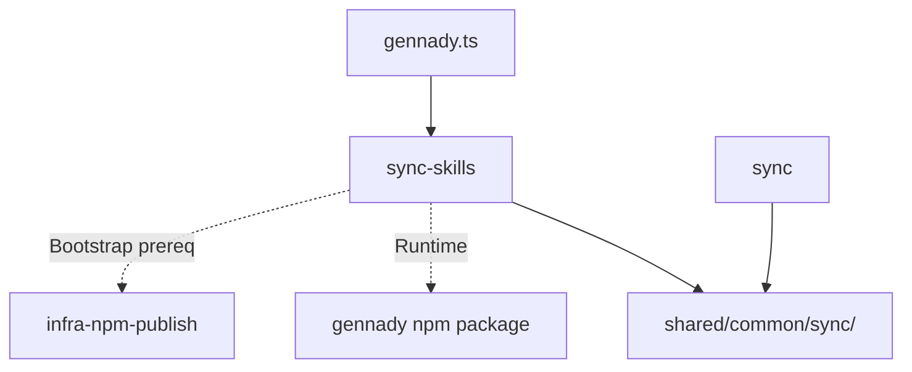

# Module: sync-skills

## 1. Module Vision

Команда `gennady sync-skills` в `cli/cmd/sync-skills/`: синхронизирует скилы из npm-пакета gennady в `<cwd>/.claude/skills/`. Набор скилов не зашит в код: источник — все каталоги `ai/skills/*` с `SKILL.md` (SDD-семейство `sdd-*`, alt-opinion, agent-inbox, prd-interview, workspace-permission-setup) плюс `plugin.skills` каждого плагина (например, `sdd-infra-golang` из плагина golang). Каждый скил — директория с `SKILL.md` и ресурсами (scripts, prompts). Синхронизация с orphan-удалением по манифесту владения: **удаляются только скилы, записанные в `.claude/skills/.gennady-synced`** — чужие скилы в целевой директории не трогаются (D-M006). Файлы сравниваются побайтово (`Buffer.compare`). **Корень пакета ищется вверх по `package.json`, а не отрезанием `/dist/`:** опубликованная установка резолвится внутрь `dist/`, а склонированная или `npm link`-нутая — прямо в исходник, и отрезание `dist` для второй давало путь к файлу и отказ «gennady package not found». **Источников скиллов несколько:** базовый `ai/skills/**` плюс `plugin.skills` каждого плагина (в пакете каталоги плагинов лежат рядом, в чекауте — тоже), фильтр по именам применяется к объединению, а пустой каталог никогда не перекрывает реальные файлы. **При копировании применяется нормализация путей: dev-пути (`~/Developer/gennady/...`) заменяются на продуктовые эквиваленты (`npx gennady`, `.claude/skills/...`, `ai/directives/...`).** Вывод: `+` (added), `~` (updated), `-` (deleted), `=` (unchanged). Zero runtime dependencies (только Node.js built-in). Shared core с `sync`: `resolvePackageDir`, `compareBytes`, `PathNormalizer`, `SyncFormatter`, `SyncCmdDeps` вынесены в `shared/common/sync/`. Поддержка `--dry-run`.

→ Parent scope: [`../cli.spec.md`](../cli.spec.md) (раздел 5.7 sync-skills).

→ Out-of-scope (v1): [`../cli.spec.md §4.3`](../cli.spec.md) — авто-проверка обновлений, регистрация в opencode.json, интерактивный режим, --watch, другие источники, миграция форматов.

## 2. Entity Inventory (Closed-World)

_Это полный список сущностей модуля. Любое введение сущности execution-агентом помимо этого списка считается drift'ом и требует обновления spec._

| Name                          | Type         | Purpose                                                                                             |
| ----------------------------- | ------------ | --------------------------------------------------------------------------------------------------- |
| `SyncSkillsOptions`           | Value Object | Конфигурация: `sourceDir`, `targetDir`, `skillNames?`, `dryRun?`                                    |
| `SyncSkillsFileEntry`         | Value Object | Результат сравнения одного файла внутри скила: `skillName`, `relativePath`, `status`, `sourceSize`  |
| `SyncSkillsFileStatus`        | Type         | Discriminated union: `'added' \| 'updated' \| 'deleted' \| 'unchanged' \| 'deleteFailed'`           |
| `SyncSkillsResult`            | Value Object | Агрегат: `entries` + computed `added`, `updated`, `deleted`, `unchanged`, `deleteFailed`, `summary` |
| `SyncSkillsCore`              | Service      | Ядро: `scanSkills`, `collectAndCompareSkills` (рекурсивное, с orphan-детектом)                      |
| `syncFile`                    | Helper       | Копирует отдельный файл из source в target с проверкой изменений                                    |
| `collectOrphanFiles`          | Helper       | Собирает список сиротских файлов в target                                                           |
| `deleteOrphan`                | Helper       | Удаляет сиротский файл/директорию с graceful degradation                                            |
| `MANIFEST_NAME`               | Constant     | Имя файла манифеста владения: `.gennady-synced`                                                     |
| `readSyncManifest`            | Helper       | Читает набор имён скилов, установленных предыдущим sync; `null` если манифеста нет                  |
| `writeSyncManifest`           | Helper       | Записывает набор владения после синхронизации (no-op при `--dry-run`)                               |
| `adoptPackageInstalled`       | Helper       | Миграция при отсутствии манифеста: присваивает только имена, которые пакет отдаёт сейчас            |
| `nextManifestNames`           | Helper       | Считает содержимое манифеста для следующего запуска: merge, а не replace                            |
| `SyncSkillsFormatter`         | Service      | Форматтер: `format(entries, opts) → string[]` — маркеры + отступы для вложенных файлов              |
| `SyncSkillsFormatOptions`     | Type         | Опции форматирования: `{ dryRun?: boolean }`                                                        |
| `PathNormalizer`              | Service      | Нормализация путей: заменяет dev-пути (`~/Developer/gennady/...`) на продуктовые (shared с `sync`)  |
| `SYNC_SKILLS_PATH_RULES`      | Constant     | Правила замены путей для sync-skills: 8 регекс-правил                                               |
| `SyncCmdDeps`                 | Port         | Импортируется из `shared/common/sync/sync-deps.type.ts` (shared с `sync`)                           |
| `ERR_SKILLS_SOURCE_NOT_FOUND` | Error code   | Source directory not found                                                                          |
| `ERR_SKILLS_SKILL_NOT_FOUND`  | Error code   | Skill name not found in source                                                                      |

## 3. Entity Surfaces

### `SyncSkillsOptions`

- **Type:** Value Object
- **Purpose:** Входная конфигурация для `SyncSkillsCore.collectAndCompareSkills`
- **Public Properties:**
  - `sourceDir: string` — абсолютный путь к `ai/skills/` в npm-пакете
  - `targetDir: string` — абсолютный путь к `<cwd>/.claude/skills/`
  - `skillNames?: string[]` — опциональный фильтр: имена скилов
  - `dryRun?: boolean` — default `false`
- **Lifecycle:** Создаётся в `sync-skills.cmd.ts` после `resolvePackageDir`, передаётся в `SyncSkillsCore`
- **Consumers:** `SyncSkillsCore`

### `SyncSkillsFileEntry`

- **Type:** Value Object
- **Purpose:** Результат сравнения одного файла внутри скила
- **Public Properties:**
  - `skillName: string` — имя скила (например, `sdd-execute`)
  - `relativePath: string` — путь относительно корня скила (например, `scripts/verify.sh`)
  - `status: 'added' | 'updated' | 'deleted' | 'unchanged' | 'deleteFailed'`
  - `sourceSize?: number` — размер в байтах в источнике
  - `targetSize?: number` — размер в байтах в цели (только для `updated`/`unchanged`)
  - `errorCode?: string` — код ошибки ОС при `deleteFailed` (например `EACCES`, `EBUSY`)
- **Lifecycle:** Immutable. Создаётся `collectAndCompareSkills` для каждого файла
- **Consumers:** `SyncSkillsFormatter`, `SyncSkillsResult`

### `SyncSkillsResult`

- **Type:** Value Object
- **Purpose:** Агрегат всех `SyncSkillsFileEntry` + computed свойства
- **Public Properties:**
  - `entries: SyncSkillsFileEntry[]`
- **Public Operations (getters):**
  - `get added(): SyncSkillsFileEntry[]` — фильтр по `status === 'added'`
  - `get updated(): SyncSkillsFileEntry[]` — фильтр по `status === 'updated'`
  - `get deleted(): SyncSkillsFileEntry[]` — фильтр по `status === 'deleted'`
  - `get unchanged(): SyncSkillsFileEntry[]` — фильтр по `status === 'unchanged'`
  - `get deleteFailed(): SyncSkillsFileEntry[]` — фильтр по `status === 'deleteFailed'`
  - `get summary(): string` — `Synced: N added, M updated, K skipped, D deleted`. «Skipped» — user-facing термин для entries со статусом `unchanged`
  - `get dryRunSummary(): string` — `Dry-run: no files written.`
- **Lifecycle:** Создаётся `SyncSkillsCore.collectAndCompareSkills`. Immutable
- **Consumers:** `SyncSkillsFormatter`, `sync-skills.cmd.ts`

### `SyncSkillsCore`

- **Type:** Service (чистые функции, без I/O к stdout)
- **Purpose:** Ядро синхронизации скилов: сканирование, рекурсивное сравнение, orphan-детект
- **Public Operations:**
  - `scanSkills(sourceDir: string, skillNames?: string[]): Map<string, Map<string, Buffer>>` — карта `skillName → {filePath → content}`. Применяет исключения (скрытые файлы, `.DS_Store`)
  - `collectAndCompareSkills(deps: SyncCmdDeps, opts: SyncSkillsOptions): SyncSkillsResult` — главная точка входа. Применяет `PathNormalizer` с `SYNC_SKILLS_PATH_RULES` к содержимому каждого файла перед сравнением и записью
- **Lifecycle:** Stateless. Вызывается `sync-skills.cmd.ts`
- **Errors & Degradation:**
- `resolvePackageDir` может вернуть `null` — ошибка обрабатывается в `sync-skills.cmd.ts` до создания `SyncSkillsOptions`: вывод `gennady package not found. Install it locally: npm i -D gennady`, exit 1. Ядро получает гарантированно валидный `sourceDir`
- `scanSkills` → бросает ошибку если указанный скил не существует (с перечислением доступных). Это hard error — прерывает синхронизацию, exit 1
- `collectAndCompareSkills` → бросает ошибку если `sourceDir` не существует
- Если `sourceDir` существует, но является файлом (а не директорией) → фатальная ошибка `[sync-skills] sourceDir is not a directory: <path>`, exit 1
- Ошибка удаления orphan (EACCES, EBUSY) → `status: 'deleteFailed'`, не прерывает синхронизацию; имя остаётся в манифесте, следующий запуск повторит попытку
- Ошибка чтения/записи манифеста (`.gennady-synced`) → проглатывается, не прерывает синхронизацию. Нечитаемый манифест трактуется как отсутствующий; худший исход — запуск, который ничего не удаляет
- `.claude/` существует как директория без прав на запись → фатальная ошибка `[sync-skills] cannot write to .claude/skills/: <EACCES>`
- Ошибка записи (writeFile fail) → фатальная: бросает `Error` с anchor-префиксом `[sync-skills]`, прерывает синхронизацию
- **Consumers:** `sync-skills.cmd.ts`
- **Uses shared:** `compareBytes` из `shared/common/sync/sync-core.shared.ts`. `resolvePackageDir` НЕ вызывается ядром — cmd.ts резолвит путь через `deps.resolvePackageDir` и передаёт готовый `sourceDir` в `SyncSkillsOptions`

### Ownership manifest (`MANIFEST_NAME`, `readSyncManifest`, `writeSyncManifest`, `adoptPackageInstalled`, `nextManifestNames`)

- **Type:** Constant + Helpers (чистые функции над `SyncCmdDeps`)
- **Purpose:** Ограничить orphan-удаление только теми скилами, которые установил `gennady sync-skills`
- **File:** `cli/cmd/sync-skills/sync-skills-core.ts`
- **Public Operations:**
  - `MANIFEST_NAME = '.gennady-synced'` — файл в `targetDir`. Точка в начале обязательна: все readdir-фильтры уже отбрасывают `.`-имена, поэтому манифест не может быть принят за скил
  - `readSyncManifest(targetDir, deps): Set<string> | null` — построчный список имён, `#`-строки и пустые строки игнорируются. `null` = «манифеста нет» (в том числе если он нечитаем)
  - `writeSyncManifest(targetDir, names, dryRun, deps): void` — пишет отсортированный список с комментарием-шапкой. При `dryRun` — no-op
  - `adoptPackageInstalled(targetSkillNames, shippedNames): Set<string>` — политика миграции при отсутствии манифеста: присваиваются ровно те существующие директории, имена которых пакет отдаёт **сейчас**
  - `nextManifestNames(owned, syncedNames, prunedNames, present): string[]` — `(owned − prunedNames − отсутствующие на диске) ∪ syncedNames`
- **Lifecycle:** Stateless. Вызываются `collectAndCompareSkills`: чтение — перед orphan-проходом, запись — после него
- **Invariants:**
  - Кандидаты на удаление = orphan-скилы ∩ набор владения. Скил вне манифеста не удаляется никогда
  - Первый запуск (манифеста нет) не удаляет ничего: `adoptPackageInstalled` присваивает только имена, которые в этом же запуске перезаписываются пакетом, поэтому orphan'ов среди них нет
  - Остатки от старых версий пакета не отличимы от скилов проекта (маркера владения в файлах скила нет) — они не присваиваются и не удаляются, пользователь удаляет их вручную
  - Merge, а не replace: фильтрованный запуск (`gennady sync-skills sdd-execute`) не теряет владение скилами, которых не касался
  - `present === null` (readdir цели не удался) трактуется не как «директория пуста»: ни одно имя не выбрасывается из манифеста по причине «его нет на диске»
- **Consumers:** `SyncSkillsCore.collectAndCompareSkills`

### `SyncSkillsFormatter`

- **Type:** Service (pure transformer)
- **Purpose:** Форматирует `SyncSkillsFileEntry[]` в строки для stdout с группировкой по скилам и отступами
- **Public Operations:**
  - `format(entries: SyncSkillsFileEntry[], opts: { dryRun?: boolean }): string[]` — массив строк для вывода
- **Lifecycle:** Stateless
- **Format:**
  - Скилы группируются: added → updated → deleted → unchanged, лексикографически
  - `added` → `  + <skillName>/` + все файлы с отступом `      <relativePath>`
  - `updated` → `  ~ <skillName>/` + только изменившиеся файлы `      <relativePath>`
  - `deleted` → `  - <skillName>/`
  - `deleteFailed` → `  ! <skillName>/                                         (delete failed: <code>)`
  - `unchanged` → `  = <skillName>/                                                   (unchanged)`
  - dryRun `added` → `      <relativePath>                                   (would add)`
  - dryRun `updated` → `      <relativePath>                                   (would update)`
  - dryRun `deleted` → `  - <skillName>/                                            (would delete)` — файлы перечислены без суффикса (rmdir recursive — одна операция)
  - dryRun `unchanged` → `  = <skillName>/                                   (unchanged, skip)`
  - Отступы в примерах иллюстративны (визуальное выравнивание). Реализатор вычисляет padding динамически по максимальной длине имени скила среди отображаемых.
  - Итоговая строка: `Synced: N added, M updated, K skipped, D deleted`. При наличии `deleteFailed`: `Synced: N added, M updated, K skipped, D deleted, F delete failed`
  - dryRun итоговая: `Dry-run: no files written.`
- **Consumers:** `sync-skills.cmd.ts`
- **Uses shared:** `SyncFormatter` базовые маркеры из `shared/common/sync/sync-formatter.shared.ts`

### `PathNormalizer`

- **Type:** Service (pure function, shared с `sync`)
- **Purpose:** Применяет правила замены к содержимому файла перед сравнением и записью. Гарантирует, что в целевой проект попадают продуктовые пути, а не dev-пути из исходников пакета.
- **File:** `shared/common/sync/path-normalizer.ts`
- **Public Operations:**
  - `normalize(content: string, rules: PathNormalizationRule[]): string` — применяет все правила последовательно
- **Lifecycle:** Stateless. Вызывается `collectAndCompareSkills` для каждого файла перед сравнением и записью
- **Consumers:** `SyncSkillsCore`, `SyncCore` (sync)

### `PathNormalizationRule`

- **Type:** Value Object (shared с `sync`)
- **Purpose:** Одно правило замены: regex → строка замены
- **Public Properties:**
  - `from: RegExp` — что искать (глобальный флаг `g` обязателен)
  - `to: string` — на что заменять
- **Lifecycle:** Immutable. Определяется как константа в модуле
- **Consumers:** `PathNormalizer`

### `SYNC_SKILLS_PATH_RULES`

- **Type:** Constant (массив `PathNormalizationRule[]`)
- **Purpose:** Правила замены dev-путей на продуктовые для sync-skills
- **Rules (в порядке применения):**
  1. `npx tsx ~/Developer/gennady/cli/gennady.ts <cmd>` → `npx gennady <cmd>` (CLI-вызовы через tsx с полным путём)
  2. `npx tsx ~/Developer/gennady/cli <cmd>` → `npx gennady <cmd>` (CLI-вызовы через tsx)
  3. `~/Developer/gennady/cli/gennady.ts` → `npx gennady` (прямая ссылка на CLI)
  4. `~/Developer/gennady/ai/skills/` → `.claude/skills/` (пути к скиллам)
  5. `~/Developer/gennady/ai/directives/` → `ai/directives/` (пути к директивам)
  6. `/Users/k.lebedev/Developer/gennady/ai/` → `ai/` (абсолютные dev-пути → относительные)
  7. `/Users/k.lebedev/Developer/gennady/cli/gennady.ts` → `npx gennady` (абсолютный путь к CLI)
  8. `$HOME/Developer/gennady/cli/gennady.ts` → `~/Developer/gennady/cli/gennady.ts` (нормализация `$HOME` в тильду, `RULE_CLI_HOME`)
  9. `plugins/<id>/directives/` → `ai/directives/` (`RULE_PLUGIN_DIRECTIVES`): директиву в чекауте держит плагин, а потребитель получает её под `ai/` — тот же dev/prod дуализм, что у остальных путей
- **Lifecycle:** Константа в `sync-skills-core.ts`. Передаётся в `PathNormalizer.normalize()`
- **Consumers:** `SyncSkillsCore.collectAndCompareSkills`

### `SyncCmdDeps` (Port)

- **Type:** Port — импортируется из `shared/common/sync/sync-deps.type.ts`
- **Purpose:** Абстракция файловой системы и вывода для тестируемости. Shared с командой `sync`
- **Public Properties:**
  - `readFile: (path: string) => Buffer`
  - `writeFile: (path: string, data: Buffer) => void`
  - `unlink: (path: string) => void`
  - `rmdir: (path: string, options?: { recursive: boolean }) => void`
  - `mkdir: (path: string, options?: { recursive: boolean }) => void`
  - `stat: (path: string) => Stats`
  - `readdir: (path: string) => string[]`
  - `resolvePackageDir: (cwd: string, subdir: string) => string | null`
  - `stdout: Writable`
  - `stderr: Writable`
- **Lifecycle:** Создаётся в `sync-skills.cmd.ts` — в проде `fs.*`, `path.*`, `process.stdout/stderr`. В тестах — моки
- **Consumers:** `SyncSkillsCore`, `sync-skills.cmd.ts`

## 4. Module Contracts (DbC)

### 4.1 Ports

### `SyncCmdDeps` (Port)

Shared с `sync`. Расширен полями `unlink`, `rmdir` для orphan-удаления.

**Invariant:** `resolvePackageDir(cwd, 'ai/skills')` всегда возвращает путь, заканчивающийся на `ai/skills` (см. §3 SyncCmdDeps, shared core). Эта инварианта принадлежит shared-функции, не ядру.

### 4.2 Service: `SyncSkillsCore`

- **Purpose:** Ядро синхронизации скилов
- **Consumers:** `sync-skills.cmd.ts`
- **Runtime Backing:** `real-runtime`
- **Verification Levels:** `unit`, `integration`
- **Deferred Runtime Scope:** None

**Contract (DbC):**

- **Preconditions:**
  - `deps.unlink` и `deps.rmdir` — не-null (обязательны для sync-skills; для sync эти поля присутствуют в типе, но не используются)
  - `opts.sourceDir` — существующая директория с `ai/skills/`
  - `opts.targetDir` — корректный путь (может не существовать). Родительская директория (`.claude/`) должна быть либо отсутствующей, либо директорией. `mkdirSync({ recursive: true })` создаёт и `.claude/` и `.claude/skills/` за один вызов. Если `.claude` существует как файл — ошибка с anchor-сообщением `[sync-skills] .claude exists but is not a directory`
- **Postconditions:**
  - Если `dryRun` — ни один `writeFile` / `unlink` / `rmdir` не вызван; манифест не записывается, ни один скил не удаляется, ни одно имя не выбывает из владения
  - Если не `dryRun` — для каждого `added`/`updated` файла вызван `writeFile` с **нормализованным** содержимым (dev-пути заменены на продуктовые)
  - Если не `dryRun` — для каждого `deleted` файла/директории вызван `unlink`/`rmdir`
  - Возвращённый `SyncSkillsResult.entries` отсортирован: скилы лексикографически, файлы внутри скила лексикографически
  - Скрытые файлы (`.`-префикс) и `.DS_Store` не попадают в результат
  - При фильтрации (`skillNames`) — orphan-удаление только для указанных скилов, и манифест обновляется merge'ем (владение остальными скилами сохраняется)
  - Удаляются только orphan'ы из набора владения (манифест, либо `adoptPackageInstalled` при первом запуске) — см. §3 Ownership manifest
  - Если не `dryRun` — после orphan-прохода записан манифест со значением `nextManifestNames(owned, синхронизированные, успешно удалённые, listing цели)`
- **Invariants:**
  - Никогда не пишет в stdout/stderr
  - Скил, отсутствующий в манифесте, не удаляется ни при каком запуске; первый запуск без манифеста не удаляет ничего
  - Сбой IO по манифесту не влияет на успех синхронизации (degradation: следующий запуск удалит меньше, но не больше)
  - `scanSkills` всегда возвращает пути с прямыми слешами (`/`)
  - Целевые пути (`.claude/`, `.claude/skills/`) должны быть реальными директориями. Символические ссылки не обрабатываются специально — orphan-удаление через symlink может задеть файлы вне ожидаемого target. Пользователь обязуется не использовать symlink в целевом пути.
  - Нормализация применяется к содержимому ВСЕХ файлов (`.md`, `.sh`, `.xml`, `.prompt.md`). Бинарные файлы в скиллах отсутствуют по определению.

### 4.3 Service: `SyncSkillsFormatter`

- **Purpose:** Форматирование вывода с группировкой по скилам
- **Consumers:** `sync-skills.cmd.ts`
- **Runtime Backing:** `real-runtime`
- **Verification Levels:** `unit`
- **Deferred Runtime Scope:** None

**Contract (DbC):**

- **Preconditions:**
  - `entries` — массив `SyncSkillsFileEntry`
- **Postconditions:**
  - Возвращает `string[]` — сгруппировано по `skillName`.
  - Порядок групп: added → updated → deleted → unchanged, лексикографически внутри каждой группы.
  - Конкретные маркеры, dry-run-суффиксы, отступы и итоговая строка описаны в §3 (Format).
  - При пустом `entries` — только итоговая строка `Synced: 0 added, 0 updated, 0 skipped, 0 deleted`.
  - `deleted` статус — только на уровне целого скила. Смешанные статусы (часть файлов added, часть deleted) внутри одного скила невозможны.
- **Invariants:**
  - Не делает I/O
  - Формат строки: `  <marker> <skillName>/<padding><status_label>`

### 4.4 Helper: `syncFile`

- **Purpose:** Копирует отдельный файл из source в target с проверкой изменений
- **Consumers:** `SyncSkillsCore.collectAndCompareSkills`
- **Runtime Backing:** `real-runtime`
- **Verification Levels:** `unit`, `integration`
- **Deferred Runtime Scope:** None

**Contract (DbC):**

- **Preconditions:**
  - `syncFile` MUST ensure the target file's parent directory exists before writing. Caller or callee must invoke `mkdir(targetParent, { recursive: true })` before `writeFile`. Failing to do so causes `ENOENT` on the first file in a new skill directory.
- **Postconditions:**
  - Файл в target идентичен файлу в source после нормализации (побайтово). `syncFile` получает уже нормализованное содержимое от `collectAndCompareSkills`
- **Invariants:**
  - Не пишет в stdout/stderr

## 5. Public Options & Policies

| Option            | Binding                                                     | Status   |
| ----------------- | ----------------------------------------------------------- | -------- |
| `--dry-run`       | `SyncSkillsOptions.dryRun`                                  | ✅ bound |
| Позиционные args  | `SyncSkillsOptions.skillNames`                              | ✅ bound |
| Скрытые файлы     | Константа в `sync-skills-core.ts`                           | ✅ bound |
| `.DS_Store`       | Константа в `sync-skills-core.ts`                           | ✅ bound |
| Манифест владения | `MANIFEST_NAME` (`.gennady-synced`) в `sync-skills-core.ts` | ✅ bound |

Все опции привязаны. Нет отложенных.

## 6. File Structure

```
cli/cmd/sync-skills/
├── index.ts                       # import { run } from './sync-skills.cmd.ts'; run(process.argv)
├── sync-skills.cmd.ts             # CLI-обвязка: parseArgs, build deps (~80 lines, estimate)
├── sync-skills.types.ts           # SyncSkillsOptions, SyncSkillsFileEntry, SyncSkillsResult (~50 lines, estimate)
├── sync-skills-core.ts            # Ядро: scanSkills, collectAndCompareSkills (~100 lines, estimate)
├── sync-skills-formatter.ts       # Форматтер: format(entries, opts) → string[] (~60 lines, estimate)
└── __tests__/
    ├── sync-skills-core.test.ts       # Unit: scanSkills (5), collectAndCompareSkills (8), orphan (4) = ~17 cases (~150 lines)
    ├── sync-skills-formatter.test.ts  # Unit: format (8 cases): mixed, dryRun, deleteFailed, empty (~90 lines)
    └── sync-skills.cmd.test.ts        # Integration: happy path, --dry-run, filter, errors, deleteFailed (10 cases) (~150 lines)

shared/common/sync/                    # shared с командой sync
├── sync-core.shared.ts               # resolvePackageDir(subdir), compareBytes (~30 lines)
├── sync-formatter.shared.ts          # formatSyncOutput(entries, opts) — базовые маркеры (~40 lines)
├── path-normalizer.ts                # PathNormalizer: замена dev-путей на продуктовые (~30 lines)
└── sync-deps.type.ts                 # SyncCmdDeps (порт) — расширен unlink, rmdir (~15 lines)

ai/skills/                            # скилы — физические артефакты в репозитории (16 на момент записи)
├── agent-inbox/SKILL.md
├── alt-opinion/                       # SKILL.md + opinion.prompt.md + synth.prompt.md
├── prd-interview/                     # SKILL.md + PRD_TEMPLATE.md
├── sdd-audit/SKILL.md
├── sdd-check/SKILL.md
├── sdd-continue/SKILL.md
├── sdd-critic/SKILL.md
├── sdd-discover/SKILL.md
├── sdd-execute/                       # SKILL.md + scripts/
├── sdd-execute-batch/SKILL.md
├── sdd-fix/SKILL.md
├── sdd-infra/SKILL.md
├── sdd-module-decomposition/SKILL.md
├── sdd-scaffold/SKILL.md
├── sdd-setup/SKILL.md
└── workspace-permission-setup/SKILL.md

plugins/<stack>/skills/               # скилы плагинов (plugin.skills), напр. golang/skills/sdd-infra-golang
```

**File Mapping:**

| File                                           | Entity                                                         | Notes                                                                            |
| ---------------------------------------------- | -------------------------------------------------------------- | -------------------------------------------------------------------------------- |
| `cli/cmd/sync-skills/sync-skills.types.ts`     | `SyncSkillsOptions`, `SyncSkillsFileEntry`, `SyncSkillsResult` | Value Objects                                                                    |
| `cli/cmd/sync-skills/sync-skills-core.ts`      | `SyncSkillsCore`                                               | `scanSkills`, `collectAndCompareSkills`, манифест владения, константы исключений |
| `cli/cmd/sync-skills/sync-skills-formatter.ts` | `SyncSkillsFormatter`                                          | `format(entries, opts)` — pure transformer с группировкой по скилам              |
| `cli/cmd/sync-skills/sync-skills.cmd.ts`       | `run()`, `SyncCmdDeps`                                         | CLI-обвязка: `parseArgs`, DI, вызов core + formatter, вывод                      |
| `cli/cmd/sync-skills/index.ts`                 | —                                                              | `import { run } from './sync-skills.cmd.ts'; run(process.argv)`                  |
| `shared/common/sync/sync-core.shared.ts`       | `resolvePackageDir`, `compareBytes`                            | Shared: `sync` + `sync-skills`                                                   |
| `shared/common/sync/sync-formatter.shared.ts`  | `formatSyncOutput`                                             | Shared: базовые маркеры `+`/`~`/`-`/`=`, dry-run, итоговая строка                |
| `shared/common/sync/sync-deps.type.ts`         | `SyncCmdDeps`                                                  | Shared DI-порт, расширен `unlink`/`rmdir` для orphan-удаления                    |

**Namespace:** `sync-skills` — единый префикс.

**Limits:** Все файлы ≤ 150 строк. `SyncCmdDeps` — shared с `sync`.

## 7. Module Decision Log

### D-M004 — Shared sync core: извлечение общего кода из sync

- **Status:** active
- **Recorded:** session ModuleDecomposition, cli, sync-skills
- **Why:** `sync` и `sync-skills` используют одинаковый механизм обнаружения пакета, побайтового сравнения и форматирования вывода. Вынос в `shared/common/sync/` предотвращает дублирование ~100 строк и гарантирует консистентность формата между командами.
- **Risk accepted:** Изменение shared-кода влияет на обе команды. Смягчается тестами обеих команд. `SyncCmdDeps` расширен полями `unlink`, `rmdir` — для `sync` они опциональны (не используются), для `sync-skills` обязательны.
- **Supersedes:** sync.spec.md D-M001 (Pattern C) — не отменяет, но изменяет File Structure модуля `sync` (перенос `sync-formatter.ts` в shared)
- **Rejected alternatives:**
  - Copypaste — дублирование кода, расхождение формата вывода

### D-M005 — Команда sync-skills: отдельная команда (не флаг --skills)

- **Status:** active
- **Recorded:** session ModuleDecomposition, cli, sync-skills
- **Why:** `sync-skills` — отдельная команда (не флаг `--skills` в `sync`), потому что источник (`ai/skills/` vs `ai/directives/`), целевая директория (`.claude/skills/` vs `ai/directives/`), структура данных (директории с вложенными файлами vs плоский список) и семантика (orphan-удаление vs только добавление/обновление) принципиально отличаются. Shared core через `shared/common/sync/` минимизирует дублирование без смешивания доменных моделей.
- **Risk accepted:** Две команды с похожим интерфейсом могут запутать пользователя. Смягчается консистентным форматом вывода и именованием. Orphan-удаление деструктивно, но ограничено манифестом владения (D-M006): пользовательские скилы не удаляются, dry-run даёт предпросмотр.
- **Rejected alternatives:**
  - Флаг `--skills` в `sync` — смешивает две доменные модели
  - Отдельный npm-пакет `@gennady/skills` — overkill для такого набора скилов

### D-M006 — Orphan-удаление: по манифесту владения, а не полная синхронизация

- **Status:** active
- **Recorded:** session ModuleDecomposition, cli, sync-skills
- **Why:** Удаляются только скилы, которые установил сам `gennady sync-skills` — они перечислены в `.claude/skills/.gennady-synced`. `.claude/skills/` — общая директория: там лежат и скилы проекта, и скилы других инструментов, поэтому rsync-семантика (`--delete` всего, чего нет в source) уничтожала чужую работу. Манифест даёт удалению явное основание: скил был установлен нами, потом исчез из пакета — значит его надо убрать. При фильтрации по позиционным аргументам удаление ограничено указанными скилами, а манифест обновляется merge'ем. Ошибки удаления (EACCES, EBUSY) не прерывают синхронизацию — скил помечается `!` и `deleteFailed` и остаётся во владении, чтобы следующий запуск повторил попытку.
- **Why (первый запуск):** Манифеста нет — присваиваются ровно те существующие директории, имена которых пакет отдаёт сейчас (`adoptPackageInstalled`); удалить в таком запуске нечего. Остатки от старых версий пакета не присваиваются и не удаляются: файлы скила пишутся дословно, маркера владения в них нет, поэтому такой остаток не отличим от скила, написанного проектом.
- **Risk accepted:** Скилы, удалённые из пакета до появления манифеста, остаются в проекте навсегда — их удаляет пользователь руками. Цена принята: альтернатива — удалять чужое.
- **Risk accepted:** Манифест можно потерять (стёрли, не закоммитили) — тогда владение пересобирается по текущему пакету и один цикл удалений пропускается. Сбои IO по манифесту проглатываются с тем же исходом: запуск, который ничего не удаляет.
- **Rejected alternatives:**
  - Полная синхронизация (rsync --delete) — исходное решение; удаляет чужие скилы в общей директории
  - Сохранение orphan-файлов вообще — устаревшие скилы пакета остаются навсегда
  - Маркер владения внутри файлов скила — скилы синхронизируются дословно, вставка метаданных ломает побайтовое сравнение и сам контент
  - Предупреждение без удаления / интерактивный prompt — требует интерактивного режима (YAGNI для v1); dry-run даёт предпросмотр

## 8. Inter-Module Dependencies

- **Depends on:** `shared/common/sync/` (resolvePackageDir, compareBytes, SyncFormatter, SyncCmdDeps)
- **Depends on (refactoring):** `cli/cmd/sync/` — извлечение shared core. Sync-форматтер переносится в shared
- **Scope Reference (cross-scope):** [`infra-base`](../../infra-base/infra-base.spec.md) — Node.js 22+, TypeScript, node:test, Vite
- **Scope Reference (cross-scope):** [`infra-npm-publish`](../../infra-npm-publish/infra-npm-publish.spec.md) — `ai/skills/` попадает в npm-пакет через существующий glob `"ai/**/*"` (D-005). Обновлений не требуется
- **Provides to:** `cli/gennady.ts` (регистрация `case 'sync-skills'`)


```mermaid
graph TD
    gennady.ts --> sync-skills
    sync-skills --> shared[shared/common/sync/]
    sync --> shared
    sync-skills -. Runtime .-> npm-package[gennady npm package]
    sync-skills -. Bootstrap prereq .-> infra-npm-publish
```

## 9. Handoff to Task Scaffolding

- **Implementation files to be created:**
  - `shared/common/sync/sync-core.shared.ts`
  - `shared/common/sync/sync-formatter.shared.ts`
  - `shared/common/sync/path-normalizer.ts` (D-M007)
  - `shared/common/sync/sync-deps.type.ts` (расширить `unlink`/`rmdir`)
  - `cli/cmd/sync-skills/sync-skills.types.ts`
  - `cli/cmd/sync-skills/sync-skills-core.ts`
  - `cli/cmd/sync-skills/sync-skills-formatter.ts`
  - `cli/cmd/sync-skills/sync-skills.cmd.ts`
  - `cli/cmd/sync-skills/index.ts`
- **Test files to be created:**
  - `shared/common/sync/__tests__/sync-core.shared.test.ts`
  - `shared/common/sync/__tests__/sync-formatter.shared.test.ts`
  - `cli/cmd/sync-skills/__tests__/sync-skills-core.test.ts`
  - `cli/cmd/sync-skills/__tests__/sync-skills-formatter.test.ts`
  - `cli/cmd/sync-skills/__tests__/sync-skills.cmd.test.ts`
- **Files to modify:**
  - `cli/cmd/sync/sync-core.ts` — заменить локальный `resolvePackageDir` на импорт из shared
  - `cli/cmd/sync/sync-formatter.ts` — удалить, заменить на импорт из shared
  - `cli/cmd/sync/sync.cmd.ts` — обновить импорты
  - `cli/cmd/sync-skills/sync-skills-core.ts` — интегрировать `PathNormalizer` в `collectAndCompareSkills` (D-M007)
  - `ai/skills/**/SKILL.md` — заменить `${SKILL_DIR}` на dev-пути `~/Developer/gennady/ai/skills/...`; заменить `npx gennady` CLI-вызовы на `npx tsx ~/Developer/gennady/cli/...` (см. D-M007 §Rules)
  - `ai/skills/**/scripts/*.sh` — заменить хардкод-пути на `~/Developer/gennady/...` (см. D-M007 §Rules)
  - `ai/directives/**/*.xml` — заменить абсолютные dev-пути на `~/Developer/gennady/...` (см. sync.spec.md D-M005)
  - `cli/gennady.ts` — добавить `case 'sync-skills': await import('./cmd/sync-skills/index.ts'); break`
  - `cli/AGENTS.md` — добавить строку `sync-skills` в таблицу команд
  - `cli/cmd/help/help.cmd.ts` — добавить `sync-skills` в вывод help
- **Stack dependencies:**
  - Language: TypeScript (resolves to `ai/directives/coding/typescript-rules.xml`)
  - Test framework: node:test (resolves to `ai/directives/testing/node-test.xml`)
- **Module Rules Additions:** None (scope-wide baseline достаточен)

- **Open risks & validation needs:**
  - `import.meta.resolve('gennady')` + `/ai/skills/` — поведение в разных рантаймах (tsx, npx, глобальная установка) требует проверки (общее с `sync`)
  - Интеграционные тесты sync-skills.cmd.test.ts требуют временной директории с мок-файлами — использовать `fs.mkdtempSync` + очистку
  - Orphan-удаление директорий: `fs.rmdirSync` с `{ recursive: true }` доступен с Node.js 12 — OK для Node 22+
  - `SyncCmdDeps` расширен `unlink`/`rmdir` — проверить что существующие тесты `sync` не ломаются (добавить поля в моки)
  - Нормализация путей (D-M007): проверить что регекс-правила не задевают пути в frontmatter или других структурных элементах, где замена нежелательна
  - Нормализация путей (D-M007): убедиться что `compareBytes` для нормализованного содержимого работает корректно — сравнение идёт ПОСЛЕ нормализации
  - `package.json#files` уже включает `"ai/**/*"` — `ai/skills/` попадёт в пакет автоматически. Проверить после публикации

### Round 4 — 2026-05-30

- **Вердикт критика:** CLEAN
- **Принято:** 4 находок
  - Инварианта resolvePackageDir misplaced в контракте SyncSkillsCore (MINOR) — перенесена в §4.1
  - Нет обработки случая «sourceDir — файл, а не директория» (MINOR) — добавлена фатальная ошибка
  - Целевой путь содержит symlink (MINOR) — добавлено в инварианты
  - Дублирование спецификации формата между §3 и §4.3 (MINOR) — §4.3 сокращён, ссылается на §3
- **Принято (confusion):** 2
  - Точные отступы в формате неясны — добавлено пояснение про динамический padding
  - Чья инварианта resolvePackageDir — уточнено: инварианта принадлежит shared-функции, не ядру
- **Отклонено:** 0 находок
- **Изменения:**
  - §3 Format: добавлено пояснение про иллюстративность отступов и динамический padding
  - §4.1: инварианта resolvePackageDir перенесена из ядра в секцию порта
  - §4.2 Invariants: убрана resolvePackageDir, добавлено ограничение по symlink
  - §3 Errors: добавлен случай sourceDir-не-директория
  - §4.3 Postconditions: удалено дублирование формата, добавлена ссылка на §3

### Round 5 — 2026-05-30

- **Вердикт критика:** CLEAN
- **Принято:** 1 находка
  - Дублирование строки deleteFailed в §3 Format (MINOR) — удалён дубликат строки 108
- **Принято (confusion):** 0
- **Отклонено:** 0 находок
- **Изменения:**
  - §3 Format: удалена дублирующая строка про deleteFailed

### Insight — 2026-05-31: mkdir-before-write contract

- **What happened:** `syncFile` in sync-skills-core.ts was missing `mkdir` before `writeFile`, causing ENOENT on first run.
- **Root cause:** The original `sync` module's `sync-core.ts` has this pattern (`mkdirSync(join(p, '..'), { recursive: true })`), but the new `syncFile` didn't inherit it.
- **Fix:** Added `mkdir` parameter to `syncFile` signature; caller passes `deps.mkdir`. Parent directory created before every `writeFile`.
- **Lesson:** Any file-writing function in a sync context must ensure parent directories exist. Tests MUST cover the "target directory doesn't exist yet" path.

### D-M007 — PathNormalizer: замена dev-путей на продуктовые при синхронизации

- **Status:** active
- **Recorded:** session Discovery, cli, sync-skills, refine
- **Why:** Навыки в исходниках (`ai/skills/`) используют dev-пути (`~/Developer/gennady/ai/skills/...`, `npx tsx ~/Developer/gennady/cli/...`) чтобы локально работать с актуальным кодом gennady. При синхронизации в пользовательский проект эти пути должны заменяться на продуктовые эквиваленты (`.claude/skills/...`, `npx gennady ...`, `ai/directives/...`). Без нормализации скиллы после sync-skills содержат битые пути, указывающие на несуществующую dev-машину.
- **Risk accepted:** Регекс-замена может задеть prose, где dev-путь упомянут в документации. Это допустимо — в продуктовой версии упоминание dev-пути в prose так же бессмысленно, как в коде. Правила упорядочены от специфичных к общим, чтобы избежать конфликтов.
- **Risk accepted:** Добавление новых dev-путей в будущем потребует обновления правил. Смягчается тем, что правила — константа в одном файле.
- **Rejected alternatives:**
  - Переменные `${SKILL_DIR}` / `${GENNADY_CLI}` вместо dev-путей — агент не резолвит их в dev-режиме (там нет хостера, который подставит значения)
  - Два набора файлов (dev + prod) — дублирование, расхождение
  - Пост-обработка отдельной командой — требует от пользователя двух шагов; нормализация — часть контракта sync
