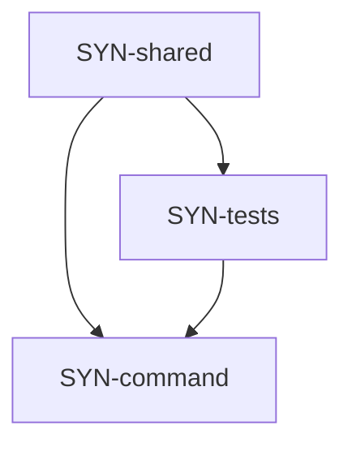

# sync — Tasks

## Tracker Index

| Task-ID     | Title                                                         | Dependencies             | Status   | Reopens |
| ----------- | ------------------------------------------------------------- | ------------------------ | -------- | ------- |
| SYN-shared  | Extract shared sync core + refactor sync                      | SYN-command, SYN-tests   | [ ] TODO | —       |
| SYN-command | Sync Core + CLI (типы, ядро, форматтер, обвязка, регистрация) | INP-rel-cmd, INP-pack-ai | [ ] TODO | —       |
| SYN-tests   | Sync Tests (core, formatter, integration)                     | SYN-command              | [ ] TODO | —       |

## Slug Registry

<!-- один ID на строку; уникальность держится этим списком — одинаковый ID в двух ветках сталкивается здесь при merge. Только добавление. -->

- SYN-shared
- SYN-command
- SYN-tests

## Intra-Module DAG

<!-- ребро A → B = «A зависит от B». Кросс-модульные рёбра живут уровнем выше. -->

## Decision Log (module-task level)

<!-- решения декомпозиции/планирования; локальные решения исполнения — в Decision Log самих тикетов. -->

## Conventions

Проектные конвенции объявлены в `specs/3-tasks.md` и наследуются — здесь не повторяются.
