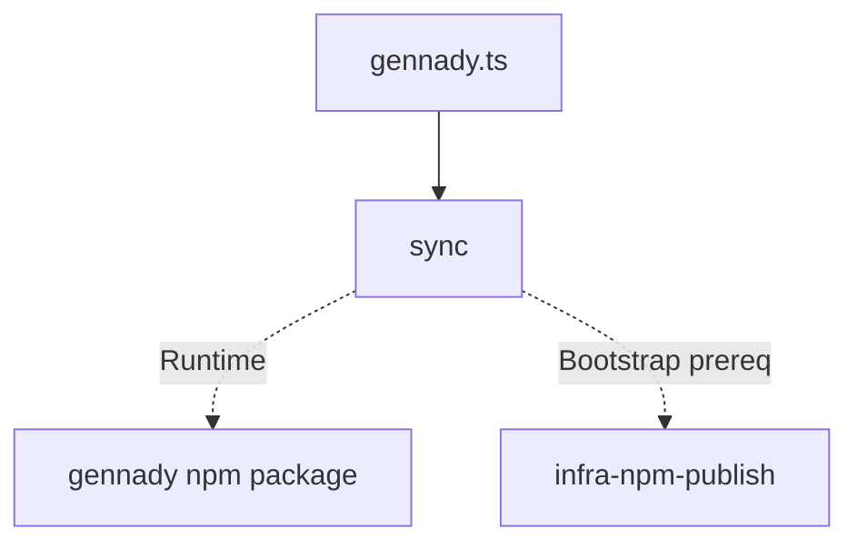

# Module: sync

## 1. Module Vision

Команда `gennady sync` в `cli/cmd/sync/`: синхронизирует `ai/directives/` из npm-пакета gennady в текущий проект. Приоритет у локальной установки (`node_modules/gennady`), fallback — резолв запущенного процесса. Файлы сравниваются побайтово (`Buffer.compare`). **При копировании применяется нормализация путей: dev-пути (`~/Developer/gennady/...`) заменяются на продуктовые эквиваленты (`ai/directives/...`, `npx gennady`).** Вывод: `+` (added), `~` (updated), `=` (unchanged). Zero runtime dependencies (только Node.js built-in). Поддержка `--dry-run`.

→ Parent scope: [`../cli.spec.md`](../cli.spec.md) (раздел 5.5 sync).

## 2. Entity Inventory (Closed-World)

_Это полный список сущностей модуля. Любое введение сущности execution-агентом помимо этого списка считается drift'ом и требует обновления spec._

| Name            | Type         | Purpose                                                                                               |
| --------------- | ------------ | ----------------------------------------------------------------------------------------------------- |
| `SyncOptions`   | Value Object | Конфигурация: `sourceDir`, `targetDir`, `subdirs?`, `dryRun?`                                         |
| `SyncFileEntry` | Value Object | Результат сравнения одного файла: `relativePath`, `status`, `sourceSize`                              |
| `SyncResult`    | Value Object | Агрегат: `entries` + computed `added`, `updated`, `unchanged`, `summary`                              |
| `SyncCore`      | Service      | Ядро: `resolvePackageDir`, `scanDirectives`, `collectAndCompare`                                      |
| `SyncFormatter` | Service      | Форматтер: `format(entries, opts) → string[]`                                                         |
| `SyncCmdDeps`   | Port         | DI-порт: `readFile`, `writeFile`, `mkdir`, `stat`, `readdir`, `resolvePackageDir`, `stdout`, `stderr` |
| `SyncCoreDeps`  | Port         | DI-порт для SyncCore: `readFile`, `writeFile`, `mkdir`, `stat`, `readdir`, `cwd` (все обязательные)   |
| `formatEntries` | Function     | Backward-compat alias для `formatSyncOutput`; реэкспортирован из `sync-formatter.ts`                  |

### shared/

| Name                    | Type         | Purpose                                                                                      |
| ----------------------- | ------------ | -------------------------------------------------------------------------------------------- |
| `resolvePackageDir`     | Function     | `(projectRoot: string, subdir: string) => string \| null` — обнаружение пакета (shared)      |
| `compareBytes`          | Function     | `(a: Buffer, b: Buffer) => boolean` — побайтовое сравнение (shared)                          |
| `PathNormalizer`        | Function     | `(content: string, rules: PathNormalizationRule[]) => string` — нормализация путей (shared)  |
| `PathNormalizationRule` | Value Object | `{ from: RegExp; to: string }` — одно правило замены (shared)                                |
| `SYNC_PATH_RULES`       | Constant     | Правила замены для sync: 6 регекс-правил (все из path-normalizer.ts кроме RULE_SKILLS_TILDE) |
| `formatSyncOutput`      | Function     | `(entries: SyncFormatEntry[], opts: SyncFormatOptions) => string[]` — форматтер (shared)     |
| `SyncFormatEntry`       | Value Object | `{ status: 'added'\|'updated'\|'deleted'\|'unchanged'; relativePath: string }` (shared)      |
| `SyncFormatOptions`     | Value Object | `{ dryRun?: boolean }` (shared)                                                              |
| `SyncCmdDeps` (shared)  | Port         | Расширенная версия с `unlink?`, `rmdir?` для sync-skills (shared)                            |

## 3. Entity Surfaces

### `SyncOptions`

- **Type:** Value Object
- **Purpose:** Входная конфигурация для `SyncCore.collectAndCompare`
- **Public Properties:**
  - `sourceDir: string` — абсолютный путь к `ai/directives/` в npm-пакете
  - `targetDir: string` — абсолютный путь к `<cwd>/ai/directives/`
  - `subdirs?: string[]` — опциональный фильтр: имена поддиректорий внутри `ai/directives/`
  - `dryRun?: boolean` — default `false`
- **Lifecycle:** Создаётся в `sync.cmd.ts` после `resolvePackageDir`, передаётся в `SyncCore`
- **Consumers:** `SyncCore`

### `SyncFileEntry`

- **Type:** Value Object
- **Purpose:** Результат сравнения одного файла
- **Public Properties:**
  - `relativePath: string` — путь относительно `ai/directives/` (например, `sdd/discovery.directive.xml`)
  - `status: 'added' | 'updated' | 'unchanged'`
  - `sourceSize?: number` — размер в байтах в источнике
  - `targetSize?: number` — размер в байтах в цели (только для `updated`/`unchanged`)
- **Lifecycle:** Immutable. Создаётся `collectAndCompare` для каждого файла
- **Consumers:** `SyncFormatter`, `SyncResult`

### `SyncResult`

- **Type:** Value Object
- **Purpose:** Агрегат всех `SyncFileEntry` + computed свойства
- **Public Properties:**
  - `entries: SyncFileEntry[]`
- **Public Operations (getters):**
  - `get added(): SyncFileEntry[]` — фильтр по `status === 'added'`
  - `get updated(): SyncFileEntry[]` — фильтр по `status === 'updated'`
  - `get unchanged(): SyncFileEntry[]` — фильтр по `status === 'unchanged'`
  - `get summary(): string` — `Synced: N added, M updated, K skipped (unchanged)`
  - `get dryRunSummary(): string` — `Dry-run: no files written.`
- **Lifecycle:** Создаётся `SyncCore.collectAndCompare`. Immutable
- **Consumers:** `SyncFormatter`, `sync.cmd.ts`

### `SyncCore`

- **Type:** Service (чистые функции, без I/O к stdout)
- **Purpose:** Ядро синхронизации: обнаружение пакета, сканирование, сравнение
- **Public Operations:**
  - `resolvePackageDir(cwd: string): string | null` — приоритет: `node_modules/gennady` > `import.meta.resolve('gennady')`
  - `scanDirectives(sourceDir: string, subdirs?: string[]): string[]` — список относительных путей всех файлов; применяет `EXCLUDED_ENTRIES`
  - `collectAndCompare(deps: SyncCmdDeps, opts: SyncOptions): SyncResult` — главная точка входа. Применяет `PathNormalizer` с `SYNC_PATH_RULES` к содержимому каждого файла перед сравнением и записью
- **Lifecycle:** Stateless. Вызывается `sync.cmd.ts`
- **Errors & Degradation:**
  - `resolvePackageDir` → `null` если пакет не найден
  - `scanDirectives` → ошибка если поддиректория не существует (с перечислением доступных)
  - `collectAndCompare` → ошибка если `sourceDir` не существует
- **Consumers:** `sync.cmd.ts`

### `SyncFormatter`

- **Type:** Service (pure transformer)
- **Purpose:** Форматирует `SyncFileEntry[]` в строки для stdout
- **Public Operations:**
  - `formatEntries(entries: SyncFileEntry[], opts: { dryRun?: boolean }): string[]` — массив строк для вывода
- **Lifecycle:** Stateless
- **Format:**
  - `added` → `  + <relativePath>`
  - `updated` → `  ~ <relativePath>`
  - `unchanged` → `  = <relativePath>                                           (unchanged)`
  - dryRun `added` → `  + <relativePath>                                   (would add)`
  - dryRun `updated` → `  ~ <relativePath>                                   (would update)`
  - dryRun `unchanged` → `  = <relativePath>                                   (unchanged, skip)`
  - Итоговая строка: `Synced: N added, M updated, K skipped (unchanged)`
  - dryRun итоговая: `Dry-run: no files written.`
- **Consumers:** `sync.cmd.ts`

### `SyncCmdDeps` (Port)

- **Type:** Port (интерфейс для DI)
- **Purpose:** Абстракция файловой системы и вывода для тестируемости
- **Public Properties:**
  - `readFile: (path: string) => Buffer`
  - `writeFile: (path: string, data: Buffer) => void`
  - `mkdir: (path: string, options?: { recursive: boolean }) => void`
  - `stat: (path: string) => Stats`
  - `readdir: (path: string) => string[]`
  - `resolvePackageDir: (cwd: string) => string | null`
  - `stdout: Writable`
  - `stderr: Writable`
- **Lifecycle:** Создаётся в `sync.cmd.ts` — в проде `fs.*`, `path.*`, `process.stdout/stderr`. В тестах — моки
- **Consumers:** `SyncCore`, `sync.cmd.ts`

## 4. Module Contracts (DbC)

### 4.1 Ports

### `SyncCmdDeps` (Port)

None.

### 4.2 Service: `SyncCore`

- **Purpose:** Ядро синхронизации
- **Consumers:** `sync.cmd.ts`
- **Runtime Backing:** `real-runtime`
- **Verification Levels:** `unit`, `integration`
- **Deferred Runtime Scope:** None

**Contract (DbC):**

- **Preconditions:**
  - `deps` — все поля не-null
  - `opts.sourceDir` — существующая директория с `ai/directives/`
  - `opts.targetDir` — корректный путь (может не существовать)
- **Postconditions:**
  - Если `dryRun` — ни один `writeFile` не вызван
  - Если не `dryRun` — для каждого `added`/`updated` файла вызван `writeFile` с **нормализованным** содержимым (dev-пути заменены на продуктовые)
  - Возвращённый `SyncResult.entries` отсортирован по `relativePath`
  - `EXCLUDED_ENTRIES` не попадают в результат
- **Invariants:**
  - Никогда не пишет в stdout/stderr
  - `resolvePackageDir` всегда возвращает путь с `ai/directives` на конце
  - `scanDirectives` всегда возвращает пути с прямыми слешами (`/`)

### 4.3 Service: `SyncFormatter`

- **Purpose:** Форматирование вывода
- **Consumers:** `sync.cmd.ts`
- **Runtime Backing:** `real-runtime`
- **Verification Levels:** `unit`
- **Deferred Runtime Scope:** None

**Contract (DbC):**

- **Preconditions:**
  - `entries` — массив `SyncFileEntry`
- **Postconditions:**
  - Возвращает `string[]` — каждая строка ровно один файл из `entries`
  - Порядок строк соответствует порядку `entries`
  - Итоговая строка — последняя в массиве
  - При `dryRun` — используются `(would add)` / `(would update)` маркеры
  - При пустом `entries` — только итоговая строка `Synced: 0 added, 0 updated, 0 skipped (unchanged)`
- **Invariants:**
  - Не делает I/O
  - Формат строки: `  <marker> <path><padding><status_label>`

## 5. Public Options & Policies

| Option             | Binding                    | Status   |
| ------------------ | -------------------------- | -------- |
| `--dry-run`        | `SyncOptions.dryRun`       | ✅ bound |
| Позиционные args   | `SyncOptions.subdirs`      | ✅ bound |
| `EXCLUDED_ENTRIES` | Константа в `sync-core.ts` | ✅ bound |

Все опции привязаны. Нет отложенных.

## 6. File Structure

```
cli/cmd/sync/
├── index.ts                    # import { run } from './sync.cmd.ts'; run(process.argv)
├── sync.cmd.ts                 # CLI-обвязка: parseArgs, build deps, вызов core + formatter, вывод (~80 lines)
├── sync.types.ts               # SyncOptions, SyncFileEntry, SyncResult (~40 lines)
├── sync-core.ts                # Ядро: scanDirectives, collectAndCompare (~80 lines)
├── sync-formatter.ts           # → перенесён в shared/common/sync/sync-formatter.shared.ts (D-M004). Импорт из shared
└── __tests__/
    ├── sync-core.test.ts       # Unit: resolveSource (3), scanDirectives (5), collectAndCompare (7) = ~15 cases (~130 lines)
    ├── sync-formatter.test.ts  # → перенесён в shared/common/sync/__tests__/ (D-M004)
    └── sync.cmd.test.ts        # Integration: happy path, --dry-run, filter, errors (9 cases) (~140 lines)

shared/common/sync/             # shared с sync-skills (D-M004)
├── sync-core.shared.ts         # resolvePackageDir(subdir), compareBytes
├── sync-formatter.shared.ts    # formatSyncOutput(entries, opts) — общие маркеры, dry-run, итог
├── sync-deps.type.ts           # SyncCmdDeps (расширен unlink, rmdir)
└── __tests__/
    ├── sync-core.shared.test.ts
    └── sync-formatter.shared.test.ts
```

**File Mapping:**

| File                             | Entity                                       | Notes                                                                          |
| -------------------------------- | -------------------------------------------- | ------------------------------------------------------------------------------ |
| `cli/cmd/sync/sync.types.ts`     | `SyncOptions`, `SyncFileEntry`, `SyncResult` | Value Objects + error codes                                                    |
| `cli/cmd/sync/sync-core.ts`      | `SyncCore`                                   | `resolvePackageDir`, `scanDirectives`, `collectAndCompare`, `EXCLUDED_ENTRIES` |
| `cli/cmd/sync/sync-formatter.ts` | `SyncFormatter`                              | `format(entries, opts)` — pure transformer                                     |
| `cli/cmd/sync/sync.cmd.ts`       | `run()`, `SyncCmdDeps`                       | CLI-обвязка: `parseArgs`, DI, вызов core + formatter, вывод                    |
| `cli/cmd/sync/index.ts`          | —                                            | `import { run } from './sync.cmd.ts'; run(process.argv)`                       |

**Namespace:** `sync` — единый префикс, `rg sync` находит все файлы модуля.

**Limits:** Все файлы ≤ 140 строк. Портов/адаптеров нет — один implementation.

## 7. Module Decision Log

### D-M001 — Pattern C (alt-opinion style) с DI-портом

- **Status:** active
- **Recorded:** session ModuleDecomposition, cli, sync
- **Why:** `run(rawArgs, deps?: SyncCmdDeps)` позволяет мокать файловую систему в тестах без monkey-patching. `SyncCore` и `SyncFormatter` — чистые функции/сервисы без I/O к stdout, легко тестируются. Паттерн заимствован из `alt-opinion` — самый современный в проекте.
- **Risk accepted:** DI-интерфейс `SyncCmdDeps` с 8 полями — overhead для небольшой команды. Смягчается простотой реализации deps (прямой маппинг на `fs.*` / `process.*`).
- **Rejected alternatives:**
  - Flat script без DI (как `cat`) — не тестируется без мока на уровне модуля/fs
  - `run()` без DI (как `lint`) — требует `mock.module` в тестах вместо простого DI

### D-M002 — Побайтовое сравнение (Buffer.compare)

- **Status:** active
- **Recorded:** session ModuleDecomposition, cli, sync
- **Why:** XML/MD файлы — килобайты. `Buffer.compare()` быстрее хеширования для мелких файлов и не требует крипто-зависимости. Изменение даже на 1 байт → `updated`. Просто и надёжно.
- **Risk accepted:** Для бинарных файлов (если появятся) `Buffer.compare` всё ещё корректен.
- **Rejected alternatives:**
  - SHA256 — избыточно, тянет `crypto`, медленнее для мелких файлов
  - `fs.stat.mtimeMs` — не ловит контентные изменения при touch

### D-M003 — Хардкод EXCLUDED_ENTRIES в модуле

- **Status:** active
- **Recorded:** session ModuleDecomposition, cli, sync
- **Why:** Список исключений (`architecture/`, `dbc-audit.directive.xml`, `dev-review.directive.xml`, `semantic-change-extractor.directive.xml`) стабилен и редко меняется. Вынесение в конфиг — premature. При изменении списка — новый релиз gennady.
- **Risk accepted:** Добавление новых исключений требует релиза пакета. Смягчается редкостью таких изменений.
- **Rejected alternatives:**
  - `.syncignore` в проекте — оверкилл, пользователи не должны управлять исключениями (это решение пакета)
  - Аргумент `--exclude` — оверкилл, те же причины

### D-M004 — Shared sync core: извлечение общего кода

- **Status:** active
- **Recorded:** session ModuleDecomposition, cli, sync-skills
- **Why:** `sync` и `sync-skills` используют одинаковый механизм обнаружения пакета (`resolvePackageDir`), побайтового сравнения (`compareBytes`) и форматирования вывода (маркеры, dry-run, итоговая строка). Вынос в `shared/common/sync/` предотвращает дублирование ~100 строк и гарантирует консистентность формата между командами. `SyncFormatter` и `resolvePackageDir` уходят в shared; `SyncCmdDeps` становится shared-портом, расширенным полями `unlink`, `rmdir` (для sync-skills, sync их игнорирует).
- **Risk accepted:** Shared-код меняет File Structure модуля — `sync-formatter.ts` переносится в shared. `SyncCmdDeps` пополняется двумя полями. Существующие юнит-тесты нужно обновить (добавить `unlink`, `rmdir` в моки).
- **Rejected alternatives:**
  - Оставить дублирование — расхождение формата при независимой эволюции
  - Вынести только `resolvePackageDir` без форматтера — не решает проблему консистентности вывода

### Insight — 2026-05-31: mkdir-before-write contract is deliberate

- **What happened:** The `sync` module's `sync-core.ts` already has `mkdirSync(join(p, '..'), { recursive: true })` before every `writeFile`. This pattern was not inherited by `syncFile` in the new `sync-skills` module, causing ENOENT on first run.
- **Lesson:** The `mkdir`-before-`writeFile` pattern in `sync-core.ts` is a deliberate contract, not incidental. Any refactoring that extracts shared writing logic (e.g., D-M004) must either preserve inline `mkdir` calls or expose `mkdir` through DI so callees can ensure parent directories exist. Tests MUST cover the "target directory doesn't exist yet" path for both modules.

### D-M005 — PathNormalizer: замена dev-путей на продуктовые в директивах

- **Status:** active
- **Recorded:** session Discovery, cli, sync, refine
- **Why:** Директивы в исходниках (`ai/directives/`) могут содержать dev-пути (`~/Developer/gennady/...`, `/Users/k.lebedev/...`, `npx tsx ~/Developer/gennady/cli/...`). При синхронизации в пользовательский проект эти пути должны заменяться на продуктовые эквиваленты (`ai/directives/...`, `npx gennady ...`). Shared `PathNormalizer` из `shared/common/sync/path-normalizer.ts` (D-M007 в sync-skills.spec.md). `SYNC_PATH_RULES` — подмножество правил, релевантных для XML-директив (только `ai/` и CLI-пути, без `~/Developer/gennady/ai/skills/` → `.claude/skills/`).
- **Risk accepted:** Регекс-замена внутри XML может задеть CDATA или атрибуты. Практика показывает что dev-пути встречаются только в prose-тексте между тегами. При появлении в атрибутах — правила нужно расширить.
- **Rejected alternatives:**
  - Не нормализовать директивы — в директивах есть ссылки на `~/.claude/skills/...` и `npx gennady`; dev-версии этих путей будут битые в продакшене
  - Отдельный `PathNormalizer` для sync — дублирование; shared через `shared/common/sync/`

## 8. Inter-Module Dependencies

- **Depends on:** None (не зависит от других модулей cli)
- **Scope Reference (cross-scope):** [`infra-base`](../../infra-base/infra-base.spec.md) — Node.js 22+, TypeScript, node:test, Vite
- **Scope Reference (cross-scope):** [`infra-npm-publish`](../../infra-npm-publish/infra-npm-publish.spec.md) — публикация `ai/` в npm-пакете
- **Provides to:** `cli/gennady.ts` (регистрация `case 'sync'`)



## 9. Handoff to Task Scaffolding

- **Implementation files to be created:**
  - `cli/cmd/sync/sync.types.ts`
  - `cli/cmd/sync/sync-core.ts`
  - `cli/cmd/sync/sync.cmd.ts` (импортит formatter из shared)
  - `cli/cmd/sync/index.ts`
  - `shared/common/sync/sync-core.shared.ts` (D-M004)
  - `shared/common/sync/sync-formatter.shared.ts` (D-M004)
  - `shared/common/sync/path-normalizer.ts` (D-M005)
  - `shared/common/sync/sync-deps.type.ts` (D-M004)
- **Files to refactor (D-M004):**
  - `cli/cmd/sync/sync-formatter.ts` → перенести в `shared/common/sync/sync-formatter.shared.ts`
  - `cli/cmd/sync/sync-core.ts` → заменить локальный `resolvePackageDir` на импорт из shared; интегрировать `PathNormalizer` в `collectAndCompare` (D-M005)
  - `cli/cmd/sync/sync.cmd.ts` → обновить импорт `SyncFormatter` на shared
- **Test files to be created:**
  - `cli/cmd/sync/__tests__/sync-core.test.ts`
  - `shared/common/sync/__tests__/sync-core.shared.test.ts`
  - `shared/common/sync/__tests__/sync-formatter.shared.test.ts`
  - `shared/common/sync/__tests__/path-normalizer.test.ts`
  - `cli/cmd/sync/__tests__/sync.cmd.test.ts`
- **Files to modify:**
  - `cli/gennady.ts` — добавить `case 'sync': await import('./cmd/sync/index.ts'); break`
  - `cli/AGENTS.md` — добавить строку `sync` в таблицу команд
  - `cli/cmd/help/help.cmd.ts` — добавить `sync` в вывод help
- **Stack dependencies:**
  - Language: TypeScript (resolves to `ai/directives/coding/typescript-rules.xml`)
  - Test framework: node:test (resolves to `ai/directives/testing/node-test.xml`)
- **Module Rules Additions:** None (scope-wide baseline достаточен)

- **Open risks & validation needs:**
  - `import.meta.resolve('gennady')` — поведение в разных рантаймах (tsx, npx, глобальная установка) требует проверки
  - Интеграционные тесты sync.cmd.test.ts требуют временной директории с мок-файлами — использовать `fs.mkdtempSync` + очистку
  - `fs.cpSync` для рекурсивного копирования директорий доступен с Node.js 16.7 — OK для Node 22+
  - `Buffer.compare` — убедиться что работает идентично на всех платформах (разные line endings не должны влиять, т.к. сравниваем сырые байты)
  - Нормализация путей (D-M005): проверить что регекс-правила не задевают пути внутри XML-атрибутов или CDATA секций
  - Нормализация путей (D-M005): `compareBytes` должно вызываться ПОСЛЕ нормализации для корректного детекта изменений
  - Фильтр `EXCLUDED_ENTRIES` применяется и к файлам и к директориям — `architecture/` исключается целиком
