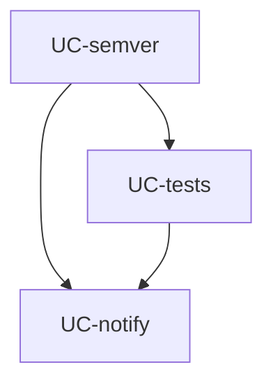

# update-check — Tasks

## Tracker Index

| Task-ID   | Title                                        | Dependencies        | Status   | Reopens |
| --------- | -------------------------------------------- | ------------------- | -------- | ------- |
| UC-semver | Fix: downgrade notification + --version flag | UC-notify, UC-tests | [ ] TODO | —       |
| UC-notify | Bootstrap + Impl: update-check механизм      | —                   | [ ] TODO | —       |
| UC-tests  | Tests: update-check (unit + integration)     | UC-notify           | [ ] TODO | —       |

## Slug Registry

<!-- один ID на строку; уникальность держится этим списком — одинаковый ID в двух ветках сталкивается здесь при merge. Только добавление. -->

- UC-semver
- UC-notify
- UC-tests

## Intra-Module DAG

<!-- ребро A → B = «A зависит от B». Кросс-модульные рёбра живут уровнем выше. -->

## Decision Log (module-task level)

<!-- решения декомпозиции/планирования; локальные решения исполнения — в Decision Log самих тикетов. -->

## Conventions

Проектные конвенции объявлены в `specs/3-tasks.md` и наследуются — здесь не повторяются.
