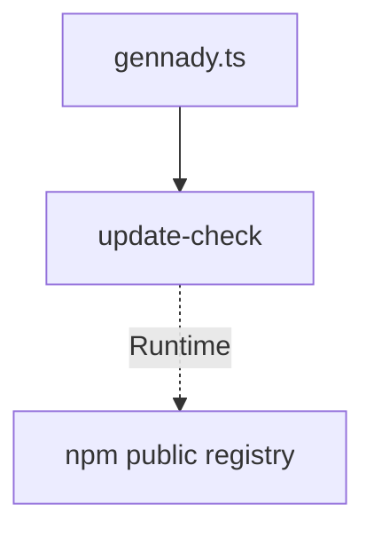

# Module: update-check

## 1. Module Vision

Shared-модуль в `cli/cmd/_shared/`: неблокирующий детект обновлений CLI на старте. Проверяет npm-реестр в фоне, при обнаружении новой версии выводит уведомление в stderr после завершения команды. Zero runtime dependencies (только Node.js built-in). Никогда не блокирует `process.exit`, никогда не бросает исключений.

→ Parent scope: [`../../cli.spec.md`](../../cli.spec.md) (раздел 5.4 Update Check).

## 2. Entity Inventory (Closed-World)

_Это полный список сущностей модуля. Любое введение сущности execution-агентом помимо этого списка считается drift'ом и требует обновления spec._

| Name                 | Type                      | Purpose                                                                                              |
| -------------------- | ------------------------- | ---------------------------------------------------------------------------------------------------- |
| `UpdateCheck`        | Service                   | Точка входа: читает кеш, решает — нужна ли проверка, spawn worker, регистрирует deferred-уведомление |
| `UpdateCheckWorker`  | Command (fire-and-forget) | Detached `child_process.spawn`: HTTPS GET к `registry.npmjs.org/<pkg>/latest`, атомарная запись кеша |
| `UpdateCheckCache`   | Value Object              | Структура кеша: `{ lastCheck: string (ISO8601), latestVersion: string }`                             |
| `UpdateCheckOptions` | Value Object              | Конфигурация: `pkg`, `interval` (default 24h), `skipNotificationIfNoTty` (default true), `cacheDir`  |

## 3. Entity Surfaces

### `UpdateCheck`

- **Type:** Service
- **Purpose:** Оркестрирует неблокирующую проверку обновлений. Stateless.
- **Public Properties:** N/A
- **Public Operations:**
  - `checkForUpdates(pkg: { name: string; version: string }, opts?: UpdateCheckOptions): void` — главная точка входа. Синхронный возврат, не ждёт результата
- **Lifecycle:** Вызывается один раз при старте CLI в `cli/gennady.ts` перед диспатчем команд
- **Events Emitted:** N/A
- **Errors & Degradation:** Никогда не кидает ошибок. Все failure-пути silent. При `GENNADY_DEBUG=1` пишет причину пропуска в stderr
- **Consumers:**
  - Internal: `cli/gennady.ts`
  - External: N/A

### `UpdateCheckWorker`

- **Type:** Command (fire-and-forget, process-level)
- **Purpose:** Изолированный процесс: HTTPS GET к npm-реестру с таймаутом, атомарная запись результата в кеш
- **Public Properties:** N/A (аргументы командной строки)
- **Public Operations:**
  - Запускается: `spawn(process.execPath, [workerScript, pkgName, pkgVersion, cachePath, timeoutMs], { stdio: 'ignore' }).unref()`
  - Вход (через `process.argv`): `pkgName`, `pkgVersion`, `cachePath`, `timeoutMs`
  - Выход: атомарная запись `{ lastCheck, latestVersion }` в кеш-файл. Exit code 0 — success, 1 — failure
- **Lifecycle:** Создаётся `UpdateCheck.checkForUpdates()`. Время жизни ≤ `timeoutMs + 500ms`. Завершается сам. Основной процесс не ждёт
- **Events Emitted:** N/A
- **Errors & Degradation:** Таймаут 3с → exit 1. Ошибка сети → exit 1. HTTP не 200 → exit 1. Неожиданный JSON → exit 1. При ошибке старый кеш сохраняется, `lastCheck` сдвигается на +1ч (защита от лавины запросов)
- **Consumers:**
  - Internal: `UpdateCheck.checkForUpdates()` (spawn)
  - External: N/A

### `UpdateCheckCache`

- **Type:** Value Object
- **Purpose:** Сериализуемая структура кеша проверки обновлений
- **Public Properties:**
  - `lastCheck: string` — ISO8601 timestamp последней проверки
  - `latestVersion: string` — последняя известная версия из реестра
- **Public Operations:**
  - `read(path: string): UpdateCheckCache | null` — читает и парсит JSON. `ENOENT`, `EACCES`, bad JSON → `null`
  - `write(path: string, cache: UpdateCheckCache): void` — атомарная запись (temp file + `fs.renameSync`). Ошибка FS → `void`
  - `isFresh(cache: UpdateCheckCache, intervalMs: number): boolean` — `Date.now() - new Date(cache.lastCheck).getTime() < intervalMs`
- **Lifecycle:** Immutable value. Создаётся при `read`
- **Errors & Degradation:** Все FS-ошибки silent. Повреждённый JSON → `null` (как отсутствие кеша)
- **Consumers:**
  - Internal: `UpdateCheck`, `UpdateCheckWorker`
  - External: N/A

### `UpdateCheckOptions`

- **Type:** Value Object
- **Purpose:** Конфигурация механизма проверки обновлений
- **Public Properties:**
  - `pkg: { name: string; version: string }` — required
  - `interval?: number` — default `86400000` (24h). Настраивается через `GENNADY_UPDATE_CHECK_INTERVAL`
  - `skipNotificationIfNoTty?: boolean` — default `true`. Подавляет ТОЛЬКО уведомление, не всю проверку
  - `cacheDir?: string` — default: `%LOCALAPPDATA%/gennady` (Win), `~/Library/Caches/gennady` (macOS), `~/.cache/gennady` (Linux). Создаётся рекурсивно главным процессом до spawn воркера
- **Public Operations:** N/A (plain object)
- **Lifecycle:** Создаётся в `gennady.ts`, передаётся в `checkForUpdates`. Immutable
- **Consumers:**
  - Internal: `cli/gennady.ts` (создаёт), `UpdateCheck` (потребляет)
  - External: N/A

## 4. Module Contracts (DbC)

### 4.1 Ports

None.

### 4.2 Service: `UpdateCheck`

- **Purpose:** Оркестрирует неблокирующую проверку обновлений
- **Consumers:**
  - Internal: `cli/gennady.ts`
  - External: N/A
- **Supporting Artifacts:** None
- **Runtime Backing:** `real-runtime`
- **Verification Levels:** `unit`, `integration`
- **Deferred Runtime Scope:** None

**Contract (DbC):**

- **Preconditions:**
  - `pkg.name` — непустая строка
  - `pkg.version` — непустая строка (semver)
  - Кеш-директория существует (создана вызывающей стороной)
- **Postconditions:**
  - Вызов возвращает управление немедленно (не блокирует)
  - Если `GENNADY_NO_UPDATE_CHECK=1` или `--no-update-check` или `CI` / `NODE_ENV=test` → мгновенный возврат. При `GENNADY_DEBUG=1` — причина пропуска в stderr
  - Если интервал с последней проверки < `opts.interval` → worker не spawn'ится, кеш проверяется на наличие новой версии
  - Если кеш содержит `latestVersion > pkg.version` → регистрируется `process.on('beforeExit')` хук для deferred-уведомления
  - Если кеш устарел → spawn `UpdateCheckWorker` с `spawn(process.execPath, args, { stdio: 'ignore' }).unref()`. Кеш читается при следующем запуске
  - Deferred-уведомление: только если `stderr.isTTY` и `!opts.skipNotificationIfNoTty`. Выводит: текущая версия → новая версия + `npm i -g gennady@latest`
- **Invariants:**
  - Никогда не бросает исключений
  - Никогда не задерживает `process.exit`
  - Никогда не пишет в stdout

### 4.3 Command: `UpdateCheckWorker`

- **Purpose:** Изолированный процесс для HTTPS-запроса к npm-реестру
- **Supporting Artifacts:** None
- **Runtime Backing:** `real-runtime`
- **Verification Levels:** `unit`, `integration`
- **Deferred Runtime Scope:** None

**Side Effects:**

- HTTPS GET к `https://registry.npmjs.org/<pkgName>/latest` с `AbortController` (таймаут 3с)
- Атомарная запись `{ lastCheck, latestVersion }` в кеш (temp file + `fs.renameSync`)

**Contract (DbC):**

- **Preconditions:**
  - `pkgName`, `pkgVersion` переданы через `process.argv`
  - `cachePath` — абсолютный путь, родительская директория существует
  - `timeoutMs` — положительное целое
- **Postconditions:**
  - При успехе: `cachePath` содержит валидный JSON `{ lastCheck: ISO8601, latestVersion: string }`. Exit code 0
  - При таймауте (> timeoutMs): exit code 1, старый кеш сохраняется, `lastCheck` обновляется на `+1h`
  - При ошибке сети / HTTP не 200: exit code 1, старый кеш сохраняется, `lastCheck` обновляется на `+1h`
  - При неожиданном формате ответа реестра: exit code 1, старый кеш сохраняется, `lastCheck` обновляется на `+1h`
- **Invariants:**
  - Время жизни ≤ `timeoutMs + 500ms`
  - Не пишет в stdout/stderr основного процесса (`stdio: 'ignore'`)
  - Не зависит от npm CLI
  - Не читает `package.json` с диска — все данные через аргументы

## 5. Public Options & Policies

| Option                          | Binding                                                     | Status   |
| ------------------------------- | ----------------------------------------------------------- | -------- |
| `GENNADY_NO_UPDATE_CHECK`       | `UpdateCheck` precondition                                  | ✅ bound |
| `--no-update-check`             | `UpdateCheck` precondition                                  | ✅ bound |
| `GENNADY_UPDATE_CHECK_INTERVAL` | `UpdateCheckOptions.interval`                               | ✅ bound |
| `GENNADY_DEBUG`                 | `UpdateCheck` — управляет выводом причины пропуска в stderr | ✅ bound |

All options bound. No deferred.

## 6. File Structure

```
cli/cmd/_shared/
├── update-check.ts              # UpdateCheck Service (~90 lines)
├── update-check-worker.ts       # UpdateCheckWorker Command (~60 lines)
└── __tests__/
    ├── update-check.test.ts     # Unit: cache logic, opt-out, CI skip, TTY guard, deferred notify (~130 lines)
    └── update-check-worker.test.ts  # Integration: local HTTP server mock, timeout, network error, unexpected JSON (~120 lines)
```

**File Mapping:**

| File                                                    | Component                                                                                     | Notes                                                                                                                                           |
| ------------------------------------------------------- | --------------------------------------------------------------------------------------------- | ----------------------------------------------------------------------------------------------------------------------------------------------- |
| `cli/cmd/_shared/update-check.ts`                       | `UpdateCheck`, `UpdateCheckCache`, `UpdateCheckOptions`, `checkForUpdates()`, `getCacheDir()` | Платформенный `getCacheDir`; `spawn` воркера; `beforeExit` хук                                                                                  |
| `cli/cmd/_shared/update-check-worker.ts`                | `UpdateCheckWorker`                                                                           | `AbortController` + 3s timeout; атомарная запись; `process.argv` парсинг                                                                        |
| `cli/cmd/_shared/__tests__/update-check.test.ts`        | Unit tests                                                                                    | Mock `child_process.spawn`; мок `fs`; coverage: cache read/write, isFresh, opt-out paths, CI skip, TTY guard, beforeExit registration           |
| `cli/cmd/_shared/__tests__/update-check-worker.test.ts` | Integration tests                                                                             | Локальный `http.createServer` имитирует npm-реестр: success, 404, timeout, bad JSON; проверка атомарной записи; проверка стратегии ошибок (+1h) |

**Namespace:** `update-check` — единый префикс, `rg update-check` находит все файлы.

**Limits:** Все файлы ≤ 130 строк. Портов/адаптеров нет — один implementation.

## 7. Module Decision Log

### D-M001 — Использовать `spawn(process.execPath)` вместо `fork`

- **Status:** active
- **Recorded:** session ModuleDecomposition, cli, update-check
- **Why:** `spawn` с явным `process.execPath` гарантирует тот же Node.js-рантайм что и основной процесс (критично для глобальной установки и бинарников), без лишнего IPC-канала от `fork`. `stdio: 'ignore'` обеспечивает изоляцию вывода. `.unref()` — не держит процесс.
- **Risk accepted:** При будущей потребности в двустороннем IPC придётся перейти на `fork`. Маловероятно для fire-and-forget проверки.
- **Rejected alternatives:**
  - `fork` — создаёт ненужный IPC-канал, тяжелее
  - `spawn('node', ...)` — может не найти `node` в PATH
  - `exec` — блокирующий, противоречит контракту

### D-M002 — Атомарная запись кеша (temp + rename)

- **Status:** active
- **Recorded:** session ModuleDecomposition, cli, update-check
- **Why:** Защита от повреждения кеша при параллельных запусках CLI. Воркер пишет во временный файл, затем `fs.renameSync(temp, target)` — атомарно на уровне FS.
- **Risk accepted:** В Windows `renameSync` может падать если target открыт другим процессом. Маловероятно — кеш читается только на старте, пишется только воркером.
- **Rejected alternatives:**
  - Прямая запись `writeFileSync` — гонка при параллельных запусках
  - Блокировка через `flock` — overkill для 50-байтного JSON

## 8. Inter-Module Dependencies

- **Depends on:** None (shared-модуль, не зависит от других модулей cli)
- **Scope Reference (cross-scope):** [`infra-base`](../../infra-base/infra-base.spec.md) — Node.js 22+, TypeScript, node:test, Vite
- **Provides to:** `cli/gennady.ts` (вызов при старте)



## 9. Handoff to Task Scaffolding

- **Implementation files to be created:**
  - `cli/cmd/_shared/update-check.ts`
  - `cli/cmd/_shared/update-check-worker.ts`
- **Test files to be created:**
  - `cli/cmd/_shared/__tests__/update-check.test.ts`
  - `cli/cmd/_shared/__tests__/update-check-worker.test.ts`
- **Files to modify:**
  - `cli/gennady.ts` — вызов `checkForUpdates(pkg)` + парсинг `--no-update-check`
  - `vite.config.ts` — `define: { __GENNADY_VERSION__ }`
- **Stack dependencies:**
  - Language: TypeScript (resolves to `ai/directives/coding/typescript-rules.xml`)
  - Test framework: node:test (resolves to `ai/directives/testing/node-test.xml`)
- **Module Rules Additions:** None (scope-wide baseline достаточен)

- **Open risks & validation needs:**
  - Worker integration-тесты требуют временного HTTP-сервера — убедиться что порт не занят
  - Платформенные пути кеша — требуют CI-прогона на всех трёх платформах (или хотя бы unit-тесты с моком `process.platform`)
  - `beforeExit` не срабатывает при `process.exit()` — необходимо явно обработать этот случай в основном процессе
  - Версия из Vite `define` должна быть доступна в рантайме — проверить что `__GENNADY_VERSION__` корректно вшивается в бандл
