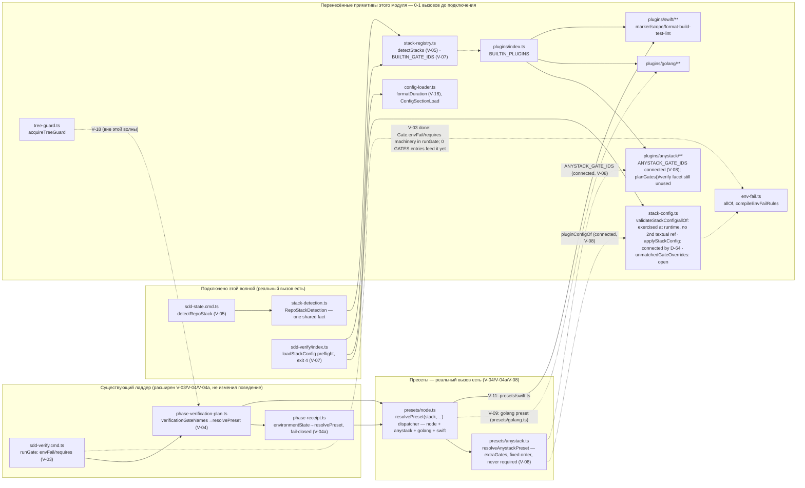
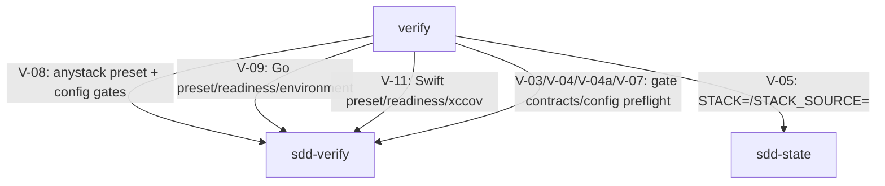

# Module: `verify`

<!--SECTION:SPEC_ID-->

CLI-VERIFY

<!--/SECTION:SPEC_ID-->

**Module:** verify · **Parent scope:** [cli](../cli.spec.md)

<!--SECTION:MODULE_VISION-->

## 1. Module Vision

> **Target/cutover contract (ACK U0, 2026-09-24):** this section and VERIFY-DL-5..10 are the
> normative release contract. The V-02..V-19 material below remains historical evidence for the
> currently shipped compatibility runtime; it must not be read as the target architecture. Cutover
> proceeds through UV-01..17 and UV-22..26, and publication stays blocked through U8 plus exact
> Swift E-18 evidence.

The target module owns one public engine, `gennady verify --phase <phase>`. A stack plugin has an
open runtime `PluginId` and supplies detection plus a declarative `VerifyPreset`: one immutable DAG
of `VerifyStep` values, phase selectors, selected-slice readiness requirements and rule ids. A phase
selects tags and dependency closure from that DAG; it never copies an independent command ladder.

The terminal `VerifyRunReport` is the single data product for standalone CLI output and the optional
SDD receipt sink. It contains the resolved `VerificationContext`, selected plan, `CapabilityMatrix`,
terminal step results, attributed mutations, evidence and the exact immutable rules snapshot.
`sdd-verify` remains only as a compatibility runner until golden receipt parity is proven; it is not
a second target engine.

### Accepted target data, planning, config and built-in preset contract (UV-01..07)

| Contract                   | Normative obligation                                                                                                    |
| -------------------------- | ----------------------------------------------------------------------------------------------------------------------- |
| `PluginId`                 | Open `string`; built-in registration stays static until UV-23.                                                          |
| `VerifyStep`               | Immutable DAG node with execution, dependency, effect and policy data.                                                  |
| `PlannedVerifyStep`        | Validated node whose id, dependencies and invalidation targets use `<plugin>:<local-id>`.                               |
| `VerifyPreset`             | Immutable plugin-owned DAG plus named phase selectors, selected-slice requirements and contributed rule ids.            |
| `ComposedVerifyPresets`    | Concrete presets plus winning per-key provenance, explicit waivers and migration diagnostics.                           |
| `VerifyStackParticipation` | Scope/dependency participation plus explicit blocking policy and provenance.                                            |
| `VerificationContext`      | Immutable request, scope, detected plugins/frameworks, exact HEAD and one rules snapshot.                               |
| `CapabilityMatrix`         | Per-plugin/per-phase readiness with terminal `READY`, `DEGRADED` or `BLOCKED`; explicit disable is visible as `WAIVED`. |
| `VerifyRunReport`          | Terminal verdict and the complete plan/readiness/result/evidence snapshot.                                              |

UV-01 materializes the model; UV-02 adds pure DAG validation/slicing; UV-03 adds strict `verify:` overlay/provenance and the temporary lossless `stack:` adapter. UV-04 adds Node's target DAG/readiness, UV-05 Go's, and UV-06 SwiftPM/Xcode/Tuist's without legacy cutover.
UV-07 composes one scope-aware multistack DAG; UV-08 adds the workspace transaction, UV-09 the direct-argv local executor/verdict, and UV-10 bounded repair/selective invalidation. Reporting remains UV-11; cutover, remote verification and dynamic rules remain U4/U5/U6.

### Target call chain

| Step | Participant          | Action                                                 | Data                                      |
| ---- | -------------------- | ------------------------------------------------------ | ----------------------------------------- |
| 1    | Caller               | submits one phase and scope                            | `VerifyRequest`                           |
| 2    | Planner              | detects plugins and composes their presets             | `VerificationContext`, `VerifyPreset[]`   |
| 3    | Planner              | validates the DAG and selects phase dependency closure | `VerifyPlan`                              |
| 4    | Readiness            | checks only selected requirements                      | `CapabilityMatrix`                        |
| 5    | Runner               | executes selected steps and attributes writes/evidence | `VerifyStepResult[]`, mutations, evidence |
| 6    | Reporters / SDD sink | project the same terminal result                       | `VerifyRunReport`                         |

`verify` — стек-движок, перенесённый из MAIN и расширенный literal-плагинами `plugins/{anystack,golang,swift}/**` в рамках пачки «Verify считает окружение и гейты как данные» (`ai/drafts/research/sdd-v1-to-v2-transfer/30-TRACK-VERIFY.md` §6, задачи V-02..V-11). Перенос идёт волнами: каждая задача добавляет РЕАЛЬНЫЙ вызов очередному примитиву, подключая его к существующему ладдеру `sdd-verify` (`cli/cmd/sdd-verify/**`), который в это же время не меняется в поведении (golden V-01, инварианты И-1/И-2). До своего подключения перенесённый примитив по определению имеет 0-1 продакшн-вызовов — это фиксирует гейт `yagni`, и единственный штатный способ унять находку — `Usage Waiver` (`cli/cmd/yagni/yagni.cmd.ts:228`), записанный здесь, в контракте модуля-получателя, с явной ссылкой на задачу, которая присоединит вызов.

**Key properties:**

- **Пересмотрено при закрытии V-16a:** модуль **получил собственный, но read-only CLI-вход** — `cli/cmd/verify/**` (`gennady verify --plan --json`, D-13, никогда не мутирует и не запускает гейт). Формулировка «не имеет собственного CLI-входа» верна только для мутирующего/исполняющего пути — им по-прежнему владеют `sdd-verify`/`sdd-state`/`sdd-task`, подключаемые задачами V-03..V-11.
- **V-04a закрыта:** `phase-receipt.ts` (`environmentState`, вне этого модуля) теперь резолвит пресет через `resolvePreset('node', …)` (`presets/node.ts`) и фейлится явно на этапе резолва для стека без реализованного источника (И-3) — реальный вызов из `gennady sdd-verify` в этот модуль есть.
- **V-05/V-05b закрыты:** новый `shared/verify/stack-detection.ts` (`detectRepoStack`) даёт один общий факт `StackDetection` вместо per-caller угадывания; `sdd-state`, `sdd-task` и `sdd-verify/phase-context` вызывают его безусловно с одной и той же валидной секцией `stack:`. Детектор сам владеет bootstrap-safety: корень без конкретного маркера и без `stack.use` получает исторический node fallback (`STACK_SOURCE=fallback:node`), `go.mod` без `stack.use` детектится как golang, а `stack.use` только сужает кандидатов. `sdd-state` печатает итоговые `STACK=`/`STACK_SOURCE=` в `[READINESS]`. Реальный второй вызов `detectStacks` (`stack-registry.ts`) есть — его запись `Usage Waiver` снята.
- **V-07 закрыта:** `cli/cmd/sdd-verify/index.ts` подключает `loadStackConfig(root, BUILTIN_GATE_IDS)` как реальный preflight-гейт — любая ошибка схемы `stack:` (`gennady.yaml`/`.gennadyrc`) останавливает `sdd-verify` с exit 4 (`ERR_CLI_SDD_VERIFY_STACK_CONFIG`) до выполнения любого гейта; отсутствие секции — не ошибка. `loadStackConfig`/`BUILTIN_GATE_IDS`/`StackConfigError`/`StackConfigLoad` сняты (реальные вторые ссылки); `validateStackConfig`/`allOf`/`ConfigSectionLoad`/`formatDuration` остаются waived (уточнены по факту, см. §6). Доказано e2e (`cli/__tests__/tool-behavior/sdd-verify-stack-config.test.ts`): валидный `gennady.yaml` с 3 `extraGates` (id/argv/envFail/requires/fixer) не спотыкается о гейт; неизвестный ключ и неизвестный `stack.use` id → exit 4. **Открытый разрыв, не закрытый этой пачкой (кандидат V-07b):** за пределами exit-4 валидации слитый `config`/провенанс нигде не наблюдаемы ни в одном v2-выводе — `resolvePhaseContext` (V-08b) теперь читает `config` для anystack-гейтов, но это потребление, не наблюдаемость (нет per-key provenance в снимке/выводе).
- **V-08 закрыта (пресет):** новый `shared/verify/presets/anystack.ts` (`resolveAnystackPreset`) реализует `StackPreset` — `resolvePreset('anystack', …)` больше не возвращает `null`, доказано unit-тестами. Гейты — только из `stack.anystack.extraGates` (`pluginConfigOf`), в точном порядке объявления (И-2, fixed order); ни один никогда не required — anystack не делает проект not-ready. `ANYSTACK_GATE_IDS`/`StackPreset`/`pluginConfigOf` сняты (реальные вторые ссылки). D-64 позднее подключил `applyStackConfig` к общему full-profile, чтобы extra gates сохраняли исполняемые `envFail`/`requires`/cwd/env свойства; `unmatchedGateOverrides` остаётся waived до подключения override-модели.
- **V-08b/V-08c закрыты:** `phase-verification-plan.ts` больше не резолвит `resolvePreset('node', …)` жёстко — `resolvePhaseVerificationPlan`/`verificationGateNames`/`requiredVerificationGateNames`/`commandForGate` принимают `stack`/`config` (по умолчанию `'node'`, byte-identical, V-01 golden не тронут). Отсутствующий пресет теперь даёт явный fail-closed `Error` с именем стека/профиля, а CLI-фазовый путь превращает его в teaching failure; `TypeError` через non-null assertion невозможен. `sdd-verify/phase-context.ts` резолвит стек через безусловный `detectRepoStack` и передаёт его в план; `phase-run.ts` для нестандартного стека выполняет `gatePlan.gates` вербатимно, в объявленном порядке, через тот же runner, что и §5-команды (нет npm-лестницы для anystack). `phase-receipt.ts`'s `phaseVerificationPlanEnvironmentState` для `stack !== 'node'` фингерпринтит сами config-authored команды гейтов вместо чтения `package.json` — восстановлен fail-closed контракт В-04a's guard для стека без своего источника (тест на `'golang'`), и добавлен позитивный тест: anystack успешно резолвится без `package.json` вообще. E2E-тест (`phase-run.test.ts`): фикстура без `package.json`, 3 anystack-гейта → receipt пишется, `receipt.commands` в порядке `gatePlan.gates` (И-2 п.а).
- V-09 подключает перенесённый golang plugin через `presets/golang.ts`: phase ladder, full-profile и environment fingerprint используют один literal plugin plan.
- **V-11:** Swift детектируется только по root `Package.swift`/`Project.swift`/`Workspace.swift` либо реальному `.xcodeproj`/`.xcworkspace`; SwiftPM получает безопасные defaults, а Xcode/Tuist build/test argv остаются config-owned. `environmentState` хэширует полный отсортированный набор build-definition manifests/locks и успешные `swift --version`/`xcodebuild -version`. Phase repair форматирует exact Target Files; ignored generated output исключается `.gitignore`-aware обходом, а non-ignored mutation остаётся fail-closed. Coverage adapter экспортирует ровно canonical/current bounded `.xcresult` через `xcrun xccov`, не угадывая workspace/scheme/destination (VERIFY-DL-4).
- `Usage Waiver` в §8 (`Module Contracts`) — не постоянное освобождение, а расписание: у каждой записи есть задача-владелец, которая обязана либо провести реальный вызов и снять запись, либо явно пересмотреть её при своём закрытии (см. `Module Decision Log`, §11, для истории снятий).
- Перенесённые файлы — MAIN `d37d5910`, минимальная правка импортов под путь RC (детали и построчные диффы — в `R-V-02.md`, не дублируются здесь).

<!--/SECTION:MODULE_VISION-->

<!--SECTION:OVERVIEW-->

## 2. Overview



_Сплошные рёбра — уже связанный код (ничего не меняется этой пачкой); пунктирные — связь, которую проведёт конкретная задача V-03..V-09/V-18, тем самым снимая соответствующие записи `Usage Waiver` из §8._

<!--/SECTION:OVERVIEW-->

<!--SECTION:MODULE_USAGE_EXAMPLE-->

## 3. Module Usage Example

**V-05:** `cli/cmd/sdd-state/sdd-state.cmd.ts` импортирует `detectRepoStack` и печатает его результат в `[READINESS]`:

```ts
import { detectRepoStack } from '../../../shared/verify/stack-detection.ts';
import { loadStackConfig } from '../../../shared/verify/stack-config.ts';
import { BUILTIN_GATE_IDS } from '../../../shared/verify/stack-registry.ts';

const loaded = loadStackConfig(root, BUILTIN_GATE_IDS);
const stackConfig = loaded.errors.length === 0 ? loaded.config : null;
const stack = detectRepoStack(root, stackConfig); // same unconditional call in all three commands
// stack.stacks === ['node'] | ['golang'] | ['golang','node'] | ['anystack']
// stack.source  === 'marker:package.json' | 'config:stack.use' | 'fallback:node' | …
```

**V-07:** `cli/cmd/sdd-verify/index.ts` loads and validates the `stack:` config section before any gate runs — a malformed `gennady.yaml`/`.gennadyrc` exits 4, never a partial run:

```ts
import { loadStackConfig, type StackConfigLoad } from '../../../shared/verify/stack-config.ts';
import { BUILTIN_GATE_IDS } from '../../../shared/verify/stack-registry.ts';
import { stackConfigError } from './sdd-verify.types.ts';

const stackConfigLoad: StackConfigLoad = loadStackConfig(projectRoot, BUILTIN_GATE_IDS);
if (stackConfigLoad.errors.length > 0) {
  const outcome = stackConfigError(stackConfigLoad.errors);
  console.error(outcome.message);
  process.exit(outcome.exitCode); // 4
}
```

**V-08:** `resolvePreset('anystack', …)` — same call, different stack — resolves through `presets/node.ts`'s dispatcher:

```ts
import { resolvePreset } from 'shared/verify/presets/node.ts';

const preset = resolvePreset('anystack', 'full', root, stackConfigLoad.config);
preset!.gateNames('full', false); // extraGate ids, declaration order
preset!.requiredGateNames('full', false); // always [] — never blocks the ladder
preset!.commandForGate('syntax', {}, []); // extraGate argv, shell-quoted
```

**V-09 закрыта:** golang preset отображает фазовые обязанности в `fix → type-check → test`, а full-profile сохраняет literal plugin gates и их `envFail`/`outputMeansFailure`/`driftMeansFailure`.

<!--/SECTION:MODULE_USAGE_EXAMPLE-->

<!--SECTION:MODULE_REQUIREMENTS-->

## Requirements

### VER-REQ-1 [должен]

**Когда** core принимает stack plugin или target Verify model, **то он должен** принимать любой
runtime `PluginId` string без closed built-in union. Refines D-66 and keeps external-code loading
separately gated by UV-23.

### VER-REQ-2 [должен]

**Когда** plugin declares verification behavior, **то он должен** represent it as one immutable
`VerifyPreset` DAG of immutable `VerifyStep` values and named phase selectors. Refines D-66.

### VER-REQ-3 [должен]

**Когда** a run reaches a terminal state, **то он должен** expose one `VerifyRunReport` containing
context, selected plan, readiness, terminal step results, attributed mutations, evidence and the
exact rules snapshot. Refines D-65 and D-67.

### VER-REQ-4 [должен · нештатная]

**Если** a required selected-slice capability is missing, a write escapes its boundary, or a step
never reaches a valid terminal result, **то verify должен** produce `BLOCKED`, `VIOLATION` or another
non-pass verdict; it must not convert the condition to implicit success. Refines D-67 and D-69.

### VER-REQ-5 [должен]

**Когда** planner принимает plugin-owned presets, **то он должен** квалифицировать authored local id
как `<plugin>:<local-id>`, нормализовать unqualified `needs` относительно owning plugin, сохранить
explicit qualified references и вернуть tag-selected seeds плюс полное transitive dependency closure
в детерминированном topological order. Refines D-66.

`exclude` применяется после `include` и выигрывает при пересечении; он удаляет только seed-кандидата:
если такой шаг нужен выбранному seed, dependency closure обязана вернуть его. Порядок входных presets
не меняет итоговый план, а globally ready steps упорядочиваются по qualified id.

### VER-REQ-6 [должен · нештатная]

**Если** composed preset содержит malformed/duplicate id, duplicate plugin contribution, plugin
ownership mismatch, missing dependency/invalidation target, dependency cycle, unknown phase либо
unknown include/exclude tag, **то planner должен** fail closed typed `VerifyPlanError` с actionable
qualified context; частичный план запрещён. Refines D-66.

### VER-REQ-7 [должен]

**Когда** concrete presets получают project configuration, **то composer должен** применить слои в
фиксированном порядке: builtin → detected facts → lossless legacy adapter → `gennady.yaml` → project
`.gennadyrc` → personal `~/.gennadyrc`. Objects deep-merge, arrays replace whole, relative `cwd`
нормализуется от repository root и не может выйти за его границы, а итог сохраняет winning
provenance каждого leaf. Default
`loadConfigSection` и действующий `stack:` runtime сохраняют legacy priority с personal config lowest.

CLI выбирает только phase/scope и не является дополнительным pipeline layer. Refines D-66.

### VER-REQ-8 [должен · нештатная]

**Если** `verify:` содержит unknown plugin/step/field, неверный type/duration/reference или
`enabled: false` без non-empty `reason`, **то loader должен** вернуть typed actionable errors и null
config, не partial overlay. UV-03 разрешает overrides только существующих preset steps; custom
steps/phases остаются UV-22. `command.npmScript` является признанным Node-owned syntax, но до UV-04
даёт typed actionable deferral, а не unknown-key ошибку и не guessed argv.

Legacy `skipGates` и basic `argv/cwd/env/timeout` переводятся с migration provenance. `extraGates`,
`when`, `envFail`, `requires`, `fixer`, output/drift policy и любой иной неэквивалентный field дают
точный `VERIFY_CONFIG_LEGACY_UNSUPPORTED`; молчаливое удаление запрещено. Refines D-66/D-67.

### VER-REQ-9 [должен]

**Когда** Node plugin строит target phase, **то он должен** использовать один DAG
`type-check → lint-fix → lint → format-fix → format → unit`, где `integration` и `coverage`
ветвятся от `unit`; `code`, `unit`, `integration`, `coverage`, `full` являются только tag slices.
Repair nodes объявляют bounded writes и invalidation ранее выполненных observations. Exact package
scripts и package-manager argv являются detected facts; missing selected script даёт actionable
`BLOCKED`. Node materialization добавляет `-- <Target Files>` как к package-script, так и к direct
repair argv prefix; prefix обязан быть target-free и не может содержать baked operands. Target Files
нормализуются как unique, code-unit-sorted repo-relative existing regular non-symlink files;
missing/absolute/escape/glob/ambiguous separator либо symlink traversal дают typed fail-closed error.
Direct `lint` обязан быть read-only и вызывать Gennady,
direct `format` обязан быть read-only. Prefix без explicit Target Files остаётся `BLOCKED`, а не
runnable/READY. Waived steps не создают package-manager requirement; Node preset не hardcode-ит rule
ids до U6 resolver. Refines D-66/D-67.

### VER-REQ-10 [должен]

**Когда** Go plugin строит target phase, **то он должен** использовать один DAG
`generate → build → vet → lint-fix → lint → format-fix → fmt → test → integration → coverage`.
`generate` имеет только `drift-signal` effect; repair не материализует generated output. `lint-fix`
и `format-fix` объявляют bounded writes и invalidation предыдущих build/vet observations, после них
остаются read-only `golangci-lint run` и `gofmt -l`. `format-fix` получает только нормализованные
exact `.go` Target Files и без них `BLOCKED`; команды всегда direct argv, без shell. Missing
selected toolchain/linter/referenced lint config даёт actionable `BLOCKED`, а waiver исключает
capability только waived шага. Go не угадывает integration identity либо coverage threshold:
эти steps commandless и блокируют только выбранные `integration`/`coverage`/`full` slices до явного
`command.argv`. `code`/`unit` остаются zero-YAML для обычного `go.mod`; rule ids не hardcode-ятся до
U6 resolver. Legacy `resolveGolangPreset`, gate order и receipt source остаются неизменны до U4.
`lint-fix` write boundary выводится из selected package patterns (`./...` разрешает repo-wide Go
boundary только для явного all scope); пустой package/exact-file scope не оставляет runnable repair
prefix. Authored `gofmt` repair допускает только target-free `-w` и optional `-s`, чтобы value-taking
flag не поглотил appended file. Legacy skip `fmt`/`lint` также visibly waives соответствующий repair;
legacy lint argv остаётся observe override и waives `lint-fix`, а legacy fmt argv fail-closed как
невыразимый одновременно через target repair+observe split.
Refines D-66/D-67.

### VER-REQ-11 [должен · нештатная]

**Когда** target planner получает resolved scope, **то он должен** подключить все detected presets
один раз, выбрать phase seeds только из scope-affected plugins и вернуть единый dependency-closed
DAG. Пустой Target Files означает all-scope: все selected detected plugins affected/blocking. Root
`gennady.yaml`/`.gennadyrc` affects all selected stacks. Unaffected plugins не исполняются и не
образуют D-64 tail; cross-plugin dependency может visibly включить их как `dependency`. Changed
scope требует exact non-empty `changedFrom` и сохраняет его рядом с resolved files.

`stack.use` задаёт только detected intersection/order и никогда не назначает отсутствующий plugin.
Unowned scope получает visible blocked empty `anystack`; explicit filter без owner fail-closed вместо
zero-step pass. Порядок не зависит от registration/map insertion. Participating failures blocking
по умолчанию; `blocking: false` требует project reason и visible provenance. Legacy tail остаётся
compatibility runtime до U4. Refines D-68.

### VER-REQ-12 [должен · нештатная]

**Когда** target executor захватывает workspace, **то `WorkspaceGuard` должен** сохранить dirty tracked/staged/unstaged/untracked non-ignored files и index без stash/refs/reset/clean; запрещать writes для non-repair effects; ограничивать repair include минус exclude внутри canonical root без symlink/escape/index mutation, применяя детерминированную glob-семантику `**`, `*`, `?`, braces и exclude-after-include; детерминированно атрибутировать create/modify/delete/rename (`previousPath`); продвигать checkpoint только после успешного repair; восстанавливать последний valid checkpoint при failure/violation/SIGINT/SIGTERM (130/143) только после integrity preflight всех blobs/index/HEAD, сохраняя lock+checkpoint при restore error для retry и восстанавливая stale dead owner до новой выдачи. Concurrent live owner блокирует. `HEAD`/ref drift никогда не откатывается автоматически: guard возвращает typed `VERIFY_WORKSPACE_REPOSITORY_MUTATION`, не трогает workspace/index и удерживает checkpoint для operator recovery; actual gitdir запрещён как root, effective `.git` writes всегда запрещены, а любой include, способный адресовать `.git`, требует явный `.git/**` exclude. Untracked gitignored output имеет explicit `preserve-and-exclude`, но tracked ignored drift остаётся наблюдаемым. UV-09 исполняет только direct argv без shell, валидирует canonical cwd/readiness, применяет serializable env-fail/output policy (`caseInsensitive: boolean` — единственный дополнительный regex mode; произвольные flags запрещены), hard timeout/cancellation с child-tree termination, сохраняет bounded UTF-8 summary каждого evidence item без argv/env secrets и отдаёт единый typed terminal outcome. Plain и exit-only шаги drain/discard verbose streams; `outputMeansFailure` хранит только streaming non-whitespace bit; finite prefix buffer включается лишь для regex streams. Его overflow никогда не убивает процесс и не делает successful exit ложным failure: executor продолжает drain, использует уже доказанный match, а nonzero без доказанного verdict возвращает fail-closed `VERIFY_LOCAL_OUTPUT_LIMIT`. Readiness связывает non-runnable fact с exact `stepId`: explicit disable → `waived`, not-applicable/optional unavailable → `skipped`, required/plugin-wide missing capability → `blocked`; ни один такой node не spawn-ится. Successful raw logs не сохраняются. UV-10 исполняет один dependency-ordered slice: каждый mutating repair обязан сойтись к no-op за максимум три passes, после каждой мутации переисполняются только уже успешные `observe`/`drift-signal` targets из `invalidates` и их уже успешные dependents в исходном plan order. Unselected или ещё не выполненные targets не запускаются. Третий pass всё ещё мутирует → `VERIFY_REPAIR_NON_CONVERGENT`/`violation`; failed/timeout/cancelled repair откатывается guard-ом. Все реальные attempts, mutations и bounded evidence сохраняются в execution order. Guard/ref/write failure доминирует обычный process verdict. Legacy runtime не переключается до U4. Refines D-67.

<!--/SECTION:MODULE_REQUIREMENTS-->

<!--SECTION:ENTITY_INVENTORY-->

## 4. Entity Inventory (Closed-World)

_Полный список файлов-сущностей, перенесённых задачей V-02. Функции/типы внутри них — в `Module Contracts` (§8), только там, где на них есть `Usage Waiver`._

| Name                                | Type         | Purpose                                                                                            |
| ----------------------------------- | ------------ | -------------------------------------------------------------------------------------------------- |
| `shared/verify/verify.types.ts`     | Types        | Общие типы стек-движка (`Gate`, `StackRun`, `VerifyReport`, …)                                     |
| `shared/verify/env-fail.ts`         | Utility      | Компилятор env-fail предикатов (`allOf`, `exitCodeMatches`, …)                                     |
| `shared/verify/tree-guard.ts`       | Port         | Лок рабочего дерева на время гейта (single-flight, ещё не подключён)                               |
| `shared/verify/stack-registry.ts`   | Service      | Реестр builtin-стеков и их gate id, детект активных стеков                                         |
| `shared/verify/plugin-api.ts`       | Port         | Публичная поверхность `gennady/stack` для авторов стек-плагинов                                    |
| `shared/verify/stack-config.ts`     | Service      | Конфиг-контракт `gennady.yaml` секция `stack:` (deep-merge, провенанс)                             |
| `services/config/config-loader.ts`  | Service      | Универсальный загрузчик секции конфига + провенанс + форматирование                                |
| `plugins/index.ts`                  | Registry     | Список встроенных стек-плагинов (`BUILTIN_PLUGINS`)                                                |
| `plugins/anystack/**`               | Adapter      | Legacy config gates; target empty preset stays visibly blocked until UV-22                         |
| `plugins/golang/**`                 | Adapter      | Стек-плагин Go: детект, scope, план (`gofmt`, `go vet`, `go generate`)                             |
| `plugins/swift/**`                  | Plugin       | SwiftPM/Xcode/Tuist legacy adapter plus target DAG, identity readiness and read-only planner       |
| `shared/verify/presets/node.ts`     | Service      | `resolvePreset(stack, …)` — dispatcher; node inline, anystack delegated (V-04/V-08)                |
| `shared/verify/presets/anystack.ts` | Service      | `resolveAnystackPreset` — config-authored gates, fixed order, never required (V-08)                |
| `shared/verify/presets/swift.ts`    | Service      | Swift phase/full mapping and manifest+tool-version `environmentState` (V-11)                       |
| `shared/verify/stack-detection.ts`  | Service      | `detectRepoStack(root, config)` — один общий факт `StackDetection`, подключён к `sdd-state` (V-05) |
| `shared/verify/model/**`            | Types        | Target `PluginId`, step/preset/context/readiness/report data contracts                             |
| `shared/verify/planning/**`         | Service      | DAG validation/slicing and deterministic scope-aware multistack orchestration                      |
| `shared/verify/config/**`           | Service      | Strict target loader, provenance contracts and temporary lossless legacy adapter                   |
| `shared/verify/execution/**`        | Service      | Dirty-safe workspace transaction plus direct-argv local step execution and bounded evidence        |
| `plugins/node/**`                   | Plugin       | Symmetric Node detector, target DAG, package facts, selected-slice readiness and read-only planner |
| `LocalStepExecution`                | Value Object | One terminal local-step product with typed non-runnable and cancellation outcomes                  |
| `executeLocalStep`                  | Service      | Execute one validated local step under `WorkspaceGuard` with bounded evidence                      |
| `LocalVerifyExecution`              | Value Object | Ordered local phase attempts, mutations, evidence and aggregate terminal state                     |
| `runLocalVerifyPlan`                | Service      | Bounded repair convergence and selective invalidation over one selected local phase                |

<!--/SECTION:ENTITY_INVENTORY-->

<!--SECTION:ENTITY_SURFACES-->

## 5. Entity Surfaces

Поверхности перенесённых сущностей раскрываются по мере подключения (V-05/V-07/V-08/V-09); до этого — только `Module Contracts` (§8) с записями `Usage Waiver`.

Target model UV-01 deliberately lands before its planner/executor consumers. The following waivers
are bounded by the task that must establish the second production use or remove the field.

### `changedFrom` — closed by UV-07

`mode=changed` now requires an exact non-empty base identity; the scope-aware planner validates and
preserves it beside the already-resolved deterministic file set. Different bases remain distinct in
the planning product. Empty files retain their derivation mode but have conservative all-scope
participation semantics. The pure planner does not rerun git/diff or replace resolved files.

### `sddPhase`

- **Usage Waiver:** SDD phase identity is required by the approved one-engine/optional-sink contract;
  its adapter consumer arrives in UV-12. Remove this waiver during UV-12 SDD context integration
  (VERIFY-DL-5).

### `frameworks`

- **Usage Waiver:** detected frameworks are an approved deterministic input to dynamic rule
  selection, whose resolver arrives in UV-19. Remove this waiver when UV-19 consumes the context
  (VERIFY-DL-10).

### `suggested`

- **Usage Waiver:** explained semantic candidates are required by D-70 but their snapshot producer
  arrives in UV-20. Remove this waiver when UV-20 connects task-intent candidates to the shared
  snapshot (VERIFY-DL-10).

### `VerifyStepOverride` / `enabled` — closed by UV-03

`composePresets` now materializes every normalized step config through `VerifyStepOverride`.
`enabled: false` requires a reason, keeps the DAG node for dependency validity and emits a separate
qualified `VerifyStepWaiver { stepId, reason, source }`; a higher layer's `enabled: true` removes it.
UV-11 consumes that sidecar for visible `WAIVED/DEGRADED` reporting (VERIFY-DL-7).

### `VerifyPreset` — closed by UV-04

The registered Node, Go and Swift plugins now contribute real target presets and their planning
entrypoints compose and slice them. `VerifyPreset` is no longer an unused exported contract
(VERIFY-DL-6).

### `VerifyRunReport`

- **Usage Waiver:** the approved single terminal product precedes its reporters and SDD sink;
  UV-11/UV-12 must connect those production consumers before the compatibility runner is removed
  (VERIFY-DL-5, VERIFY-DL-7).

### `selectPhase` — closed by UV-04

`resolveNodeVerifyPlan`, `resolveGolangVerifyPlan` and `resolveSwiftVerifyPlan` call the same shared
phase slicer. UV-11 projects the selected plan in the report (VERIFY-DL-6).

### `composePresets` — closed by UV-04

The Node target planning path composes builtin preset, package facts, lossless legacy translation
and target files before slicing. UV-24 still removes compatibility after migration evidence.

### `loadVerifyConfig` — closed by UV-04

The Node target planning path loads and materializes `verify.presets.node` before composition.

### `adaptLegacyStackConfig` — closed by UV-04

The Node, Go and Swift target planning paths translate their `stack:` compatibility fields against
exact target step ids. UV-24 removes the adapter after migration evidence.

### `resolveNodeVerifyPlan` / `resolveGolangVerifyPlan` / `resolveSwiftVerifyPlan`

- **Usage Waiver:** target-only compatibility/test facades remain until U4 removes the legacy path.
  UV-07 consumes their underlying plugin adapters through one shared composition, not three
  independently composed plans. Exact Xcode runtime proof remains E-18/UV-26 (VERIFY-DL-4/6/8).

### `resolveMultistackVerifyPlan`

- **Usage Waiver:** UV-07 exposes the read-only target orchestration entrypoint before U3 execution.
  UV-09 must consume its single composed plan/readiness product; legacy stays frozen until U4.

<details>
<summary>UV-08..10 target workspace and local-execution surfaces</summary>
### `acquireWorkspaceGuard`
- **Usage Waiver:** UV-10 consumes `WorkspaceGuard`; UV-11 owns the target CLI/report composition root. Legacy `TreeGuard` stays frozen until U4.
### `stdoutMatches` / `stderrMatches`
- **Usage Waiver:** D-67 retains stream-specific serializable environment predicates for project-owned/custom steps; builtins currently need combined output and UV-22 connects authored custom presets.
### `LocalVerifyExecution`
- **Usage Waiver:** UV-10 lands the target execution product before UV-11 projects it into the canonical report; `runLocalVerifyPlan` is its first production owner.
### `runLocalVerifyPlan`
- **Usage Waiver:** UV-10 lands the target runner before UV-11 connects CLI/report projection; adversarial tests own its interim direct consumer.
</details>
<!--/SECTION:ENTITY_SURFACES-->

<!--SECTION:MODULE_CONTRACTS-->

## 6. Module Contracts (DbC)

Исторический реестр `Usage Waiver` начинался с **26** символов задачи V-02. После V-05/V-07/V-08 были сняты 9 записей; D-64 снял `applyStackConfig` и добавил 2 exported test seam. UV-05 снял `scopeHasGoGenerate`; осталось **17** historical записей. UV-01 добавил **8** target-model waivers; UV-02 — `selectPhase`; UV-03 снял три composition symbols; UV-04 снял пять connected waivers и добавил Node facade; UV-05/06 добавили Go/Swift facades; UV-07 снял `changedFrom` и добавил `resolveMultistackVerifyPlan`; UV-08 добавил workspace pair; UV-09 consumed `WorkspaceGuard`, retained acquisition and added two stream-policy fields plus the target executor; UV-10 consumed that executor and added its target execution product/facade. Итого открыто **30**. Каждая запись объясняет 0–1 production usage по прецеденту `specs/shared/shared.spec.md` (`cli/cmd/yagni/yagni.cmd.ts:228`).

<details>
<summary>Usage Waiver — 17 символов open: 15 унаследованных после снятия `applyStackConfig`/`scopeHasGoGenerate` и 2 D-64 test seam. По владельцу: V-09 — 4 (`C`, `I`, `Bad`, `isStructuralListError`); V-18 — 4 (`TreeGuard`, `TreeGuardOptions`, `GuardAcquisition`, `acquireTreeGuard`); D-64 test seam — 2 (`DEFAULT_STACK_PRIORITY`, `orderDetectedStacks`); без твёрдого владельца — 7 (`ConfigSectionLoad`, `formatDuration`, `allOf`, `validateStackConfig`, `unmatchedGateOverrides`, `StackRun`, `VerifyReport`).</summary>

### `C`

- **Usage Waiver:** approximate-declaration ложноположительный — однобуквенный top-level идентификатор внутри одноразовых e2e-фикстур golang (`go-fmt-excludes-nested-testdata/cmd/c.go`, `go-scope-build-constraints/constrained/c.go`), не публичная поверхность плагина; фикстуры реально упражняются e2e-прогоном golang-пресета — снимается в V-09 (пересмотреть по факту: если V-09 не добавит текстовую ссылку, годится только сужение source-policy `yagni` для `e2e/fixtures/**`, отдельная задача вне этой волны).

### `I`

- **Usage Waiver:** тот же класс ложноположительного, фикстура `go-fmt-excludes-nested-testdata/internal/i.go` — снимается в V-09 (см. запись `C`).

### `Bad`

- **Usage Waiver:** тот же класс ложноположительного, фикстура `go-fmt-excludes-nested-testdata/internal/testdata/golden.go` — снимается в V-09 (см. запись `C`).

### `isStructuralListError`

- **Usage Waiver:** единственный вызов сегодня — внутри своего же файла (`golang-scope.logic.ts`); второй — из golang-пресета/e2e `go-broken-package-not-dropped` — снимается в V-09.

### `ConfigSectionLoad`

- **Usage Waiver:** тип результата `loadConfigSection`, сегодня потребляется без явной аннотации (`stack-config.ts:357`). **Пересмотрено при закрытии V-07:** подключение (`loadStackConfig` → `sdd-verify/index.ts`) не задело этот тип напрямую — `sdd-verify` типизирует `StackConfigLoad` (снят) и `StackConfigError` (снят), а `ConfigSectionLoad` остаётся внутренним для `config-loader.ts`/`stack-config.ts`. Владелец не назначен; снимается, когда какой-то будущий потребитель секции конфига (не `stack`) явно затипизирует переменную этим именем.

### `formatDuration`

- **Usage Waiver:** печать `timeoutMs` гейта в человекочитаемом виде. **Пересмотрено при закрытии V-07:** V-07 добавляет только загрузку+валидацию (+exit 4), без печати самого гейт-плана. **Пересмотрено при закрытии V-16a:** `gennady verify --plan --json` вышел с узким `VerifyPlanGate` без `timeoutMs`. **Пересмотрено D-64/V-13b:** config-authored secondary `extraGates` теперь входят в общий full-plan, но его JSON по-прежнему несёт только `name`/`stack`/`command`/`required`/`blocking`; timeout не обещан и не исполняется текущим `GateRunner`. Waiver остаётся до отдельного расширения runner/JSON-контракта, не до plugin↔preset convergence.

### `allOf`

- **Usage Waiver:** комбинатор env-fail предикатов, сегодня вызывается только внутри `compileEnvFailRules` (`env-fail.ts:248`) — единственный call site, независимо от того, сколько раз сам `compileEnvFailRules` вызывается. **Пересмотрено при закрытии V-07:** `envFail`-правило на `extraGates` теперь реально валидируется по живому CLI-пути (`sdd-verify/index.ts` → `loadStackConfig` → `validateStackConfig` → `validateGateSpec` → `compileEnvFailRules` → `allOf`), доказано e2e-тестом (`cli/__tests__/tool-behavior/sdd-verify-stack-config.test.ts`, кейс с `envFail: [exitCodeMatches, stderrMatches]` на анистек-гейте) — но это **исполнение**, не новая **текстовая** ссылка на символ `allOf`, а гейт `yagni` считает именно текстовые ссылки. Снимается, когда появится второй прямой call site самого `allOf` (не через `compileEnvFailRules`) — открытый вопрос, владелец не назначен.

### `validateStackConfig`

- **Usage Waiver:** единственный вызов сегодня — внутри `loadStackConfig` (`stack-config.ts:369`). **Подтверждено при закрытии V-07** (как и предполагала запись): подключение `loadStackConfig` к `sdd-verify/index.ts` не добавило прямой второй вызов `validateStackConfig` самого по себе — запись пересмотрена явно, не перенесена молча. Владелец не назначен.

### `unmatchedGateOverrides`

- **Usage Waiver:** валидация `overrideGates` из `gennady.yaml` против уже спланированных гейтов (полных `Gate` объектов с `envFail`/`requires`/`fixer`). **Пересмотрено при закрытии V-08:** anystack-пресет (`presets/anystack.ts`) реализует `StackPreset` — узкий контракт фазовой лестницы (`gateNames`/`commandForGate: string | null`), не полный `Gate[]`-план MAIN-стековой модели; для anystack `overrideGates` не имеет смысла (нет builtin-гейтов, которые можно было бы override). Владелец не назначен — снимается, если/когда полная `Gate`-модель (`gennady verify`, V-16) когда-нибудь заменит фазовую лестницу или получит собственный слой поверх неё.

### `DEFAULT_STACK_PRIORITY`

- **Usage Waiver:** экспортированный test seam фиксирует утверждённый D-64 default order `swift > golang > node > anystack`, включая будущий Swift до появления его detector/preset. Production использует константу через `orderDetectedStacks`; прямой экспорт нужен только точному regression-тесту, а не искусственному второму production usage (VERIFY-DL-2).

### `orderDetectedStacks`

- **Usage Waiver:** экспортированный чистый test seam доказывает обе стороны D-64: default priority с будущим Swift и `stack.use` как detected-intersection без назначения отсутствующего стека. Production вызывает его только из `detectRepoStack`; отдельный экспорт удерживает матрицу при добавлении будущих detector/preset (VERIFY-DL-2).

### `TreeGuard`

- **Usage Waiver:** тип лока рабочего дерева. Не входит в набор задач этой волны (V-03..V-09) — по `30-TRACK-VERIFY.md` §6 подключение `tree-guard`-лока к фазовому пути явно отнесено к **V-18** («single-flight … `tree-guard`-lock переносится в V-02, но не подключается к фазовому пути»). Снимается в V-18 (вне текущей пачки — см. отклонения в `R-V-02.md`/сводном отчёте пачки).

### `TreeGuardOptions`

- **Usage Waiver:** та же причина и тот же владелец, что и `TreeGuard` — снимается в V-18.

### `GuardAcquisition`

- **Usage Waiver:** та же причина и тот же владелец, что и `TreeGuard` — снимается в V-18.

### `acquireTreeGuard`

- **Usage Waiver:** та же причина и тот же владелец, что и `TreeGuard` — снимается в V-18.

### `StackRun`

- **Usage Waiver:** тип одного запуска стека; в MAIN потребляется движком `services/stack/gate-runner.ts`, который эта волна не переносит целиком. **Пересмотрено при закрытии V-04/V-16a:** presets и read-only фасад сознательно сохранили RC-формы `GateResult[]`/`VerifyOutcome` и `VerifyPlanDocument`, не MAIN `StackRun`. **Пересмотрено D-64/V-13b:** мультистековый `AssembledFullProfile` теперь реален как primary preset + secondary preset/extra-gate tail, но без plugin↔preset convergence; подмена его MAIN `StackRun` смешала бы отложенный Variant C в #46. Waiver остаётся до отдельного решения Variant C либо удаления неиспользуемого MAIN-типа.

### `VerifyReport`

- **Usage Waiver:** итоговый отчёт прогона стека — тот же пересмотр при закрытии V-04, что и `StackRun`: `resolvePreset`/`StackPreset` не используют эту форму. **Пересмотрено при закрытии V-16a (V-BATCH-13):** та же причина, что у `StackRun` — фасад несёт собственный `VerifyPlanDocument`, не `VerifyReport`. Владелец исчерпан; тот же преемник-кандидат («`extraGates`/anystack вживляются в полный профиль»), иначе кандидат на удаление вне этой волны.

</details>

<!--/SECTION:MODULE_CONTRACTS-->

<!--SECTION:PUBLIC_OPTIONS-->

## 7. Public Options & Policies

**`verify:` target overlay (UV-03..07):** existing-step overrides plus plugin-level
`blocking`/`reason` are accepted at this cutover stage. Step fields are `enabled`, `reason`, `tags`, `needs`, `command`, `requires`, `writes`,
`invalidates`, `timeout`, `onFailure`; `command` accepts generic `argv/cwd/env` and the acknowledged
Node-owned `npmScript` shorthand. Node target planning now resolves `npmScript` through explicit
package-manager facts to direct argv (never a shell), attributes derived argv to the authored file,
and reports an absent selected script as `BLOCKED`. Generic `argv` intentionally replaces the
package-script capability. Custom step and phase declarations remain UV-22.

Node repair scripts are argument-forwarding prefixes. They become readiness `READY` only when the
caller supplies explicit Target Files, which are appended after `--`; UV-07 owns automatic scope
materialization. An unscoped repair prefix is `BLOCKED`, never an implicit whole-repository command.

Go uses the same overlay/home priority; direct argv replaces that step's built-in tool capability.
`format-fix` accepts only target-free `gofmt` switches `-w` and optional `-s`, then existing exact
`.go` Target Files. `lint-fix` appends selected packages and bounds writes to them; empty/non-exact
scope omits repair commands and stays `BLOCKED`. Observe steps reject write flags. Integration and
coverage have no default argv or guessed identity/threshold. Legacy skip `fmt`/`lint` waives both
observe and repair; lint argv preserves observe and waives repair; fmt argv is a typed non-lossless
error. The active legacy runtime remains unchanged.

Target file priority is personal `~/.gennadyrc` > project `.gennadyrc` > `gennady.yaml`; detected
facts and builtins are lower layers. Objects deep-merge and arrays replace whole. The default generic
loader and existing `stack:` path retain their historical priority below.

Plugin failures block by default. `blocking: false` requires a non-empty reason; its winning value,
reason and source remain visible in composition, participation and readiness. Any effective reason
with absent/true blocking is a typed error rather than silently discarded config.

**`stack:`** (`gennady.yaml`, `.gennadyrc`) — merged deep, repo `.gennadyrc` > `gennady.yaml` > `$HOME/.gennadyrc`, per-key provenance (`shared/verify/stack-config.ts`, `services/config/config-loader.ts`). Schema is strict: any unknown key, wrong type, or bad value is fatal — `sdd-verify` exits 4 (`ERR_CLI_SDD_VERIFY_STACK_CONFIG`) before any gate runs (V-07, `cli/cmd/sdd-verify/index.ts`). No section present at all is not an error.

- `use: [<plugin-id>, …]` — restricts the candidate stack registry; never assigns an undetected stack.
- `<pluginId>.skipGates: [<gate-id>, …]` — excludes builtin gates, visibly (skip entries, never silent drops).
- `<pluginId>.overrideGates.<gate-id>: <GateSpec>` — overrides one builtin gate's `argv`/`cwd`/`env`/`timeout`/`outputMeansFailure`/`driftMeansFailure`/`envFail`/`requires`/`fixer`; unset fields inherit.
- `<pluginId>.extraGates: [<GateSpec>, …]` — repo-specific gates appended after the builtins; `id`+`argv` mandatory; `anystack`'s entire gate list comes from here (its own builtin gate list is empty).

**V-08 закрыта:** `extraGates` reach the phase ladder through `resolveAnystackPreset`; D-64 additionally passes them through `applyStackConfig` in the assembled full-profile so runtime command properties are preserved. `overrideGates`/`skipGates` still have no effect for anystack because it has no builtin gates.

<!--/SECTION:PUBLIC_OPTIONS-->

<!--SECTION:FILE_STRUCTURE-->

## 8. File Structure

```
shared/verify/
├── verify.types.ts
├── env-fail.ts
├── tree-guard.ts
├── stack-registry.ts
├── plugin-api.ts
├── stack-config.ts
├── config/
│   ├── verify-config.type.ts
│   ├── verify-config.error.ts
│   ├── load-verify-config.ts
│   └── adapt-legacy-stack-config.ts
├── model/
│   ├── plugin-id.type.ts
│   ├── verify-step.type.ts
│   ├── verify-preset.type.ts
│   ├── verify-context.type.ts
│   ├── verify-readiness.type.ts
│   ├── verify-report.type.ts
│   └── verify-multistack.type.ts
├── planning/
│   ├── verify-plan.error.ts
│   ├── compose-presets.ts
│   ├── resolve-multistack.ts
│   ├── validate-plan.ts
│   ├── resolve-dependencies.ts
│   └── select-phase.ts
└── presets/
services/config/
└── config-loader.ts
plugins/
├── index.ts
├── anystack/**
├── golang/**
├── node/**
└── swift/**
```

**File Mapping:** см. Entity Inventory (§4) — один-к-одному с этим деревом; `presets/` подключён задачами V-04/V-08/V-09/V-11.

<!--/SECTION:FILE_STRUCTURE-->

<!--SECTION:MODULE_DECISION_LOG-->

## 9. Module Decision Log

Десять записей: четыре исторических переходных решения и принятый target-контракт D-65..D-70.

<details>
<summary>Полные записи Decision Log</summary>

### VERIFY-DL-1 — Узкий waiver в новой спеке вместо слияния V-02/V-04 или исключения гейта `yagni`

- **Status:** active
- **Why:** `R-V-02.md` §4 зафиксировал 4 варианта разблокировки коммита V-02 (перенос примитивов без вызовов бьётся о гейт `yagni`, а `specs/**` был вне периметра «трогать» у исполнителя). Lead выбрал вариант 1 — точечный новый файл `specs/cli/verify/verify.spec.md` с `Usage Waiver` по существующему механизму, не сливая задачи и не отключая гейт. Каждая запись называет задачу-владельца; снятие записи — обязанность этой задачи, а не разовая амнистия.

### VERIFY-DL-2 / D-64 — Legacy primary и full-profile в мультистек-репозитории

- **Status:** compatibility-only through U4; superseded in target planning by VERIFY-DL-8.
- **Decision:** без `stack.use` detected-множество упорядочивается `swift > golang > node > anystack`, где anystack — default last-resort. `stack.use` задаёт порядок только пересечения с реально detected стеками: сужает и приоритизирует, но не назначает отсутствующий стек. Явно перечисленный `anystack` является реально applicable always-match и участвует ровно на позиции списка (`[anystack, node]` на Node-репозитории делает anystack primary); markerless корень без `stack.use` сохраняет отдельный `bootstrapNode` fallback.
- **Full profile:** primary единолично владеет блокирующим full-profile. После него идут гейты остальных detected стеков: read-only, с qualified именами `stack:gate`, стабильным порядком и non-blocking verdict. Они видимы в JSON/текстовом отчёте и выбираются общим `--only`/`--skip` matcher.
- **Single model:** `sdd-verify --profile full` исполняет, а `gennady verify --plan --json` отображает один `AssembledFullProfile`; расхождение порядка/команд/обязательности между фасадами запрещено.
- **Boundary:** frozen legacy runtime; target planner не воспроизводит primary/tail.

### VERIFY-DL-3 — Go phase repair ограничен exact Target Files

- **Status:** active
- **Decision:** V-09 исполняет `fix` как `gofmt -w` только над `.go`-файлами из структурных Target Files. Он не запускает `go mod tidy`, не меняет `go.mod`/`go.sum` и не форматирует соседние `.go`-файлы. `type-check` отображается в literal plugin `go build` + `go vet`, `test` — в `go test`; `generate` drift и `gofmt -l` принадлежат только full-profile.
- **Why:** обзор трека §3.1.4 одновременно предлагал module-wide `go mod tidy` и требовал phase repair «только по Target Files». Эти требования несовместимы с действующим runtime write-zone: `tidy` может менять module manifests вне declared targets. Узкая acceptance V-09 и операторское решение выбирают exact-target repair; module maintenance должна быть отдельной явно владеющей фазой, а не скрытой частью formatter rung.

### VERIFY-DL-4 — Swift environment, project-owned Xcode argv и generated-output boundary

- **Status:** active
- **Decision:** Swift `environmentState` = hash отсортированного repo-relative набора Swift/Xcode/Tuist manifests+locks плюс успешные `swift --version` и `xcodebuild -version`; gate commands остаются только в `planState`. SwiftPM defaults допустимы только при root `Package.swift`; Xcode/Tuist workspace/scheme/destination задаёт `stack.swift` config. Phase `fix` работает по exact Target Files. Workspace mutation scan пропускает только реально gitignored output. `xccov` producer экспортирует canonical/current bounded `.xcresult`, созданный project-owned test gate, и сохраняет mtime bundle в JSON-report для честной freshness.
- **Why:** generic Xcode argv неизбежно угадывает project identity, полный hash DerivedData неприемлем на реальном cloud-ios, а новый JSON mtime после экспорта скрывал бы stale source относительно старого test bundle. Эти границы сохраняют ownership проекта, производительность и fail-closed evidence одновременно.
- **Eval fixture:** опубликованный cloud-ios commit `d9de0f7c16824aff043be8332818154d9ed00960` остаётся immutable; обязательный V-19 scope для долгих legacy build/test gates добавляется только deterministic overlay внутри isolated eval worktree перед переносом literals в Swift overrides.
- **Runtime validation: DEFERRED / UNVERIFIED IN REAL XCODE.** По решению оператора release validation должна проверить exact `xccov` argv и JSON shape, duplicate source paths across targets, bundle-mtime freshness, единый active Xcode/`DEVELOPER_DIR`, реальные workspace/scheme/destination/runtime и resource cost. Unit/contract tests зелёные, а parser фейлится closed, но это не является runtime proof E-18.

### VERIFY-DL-5 / D-65 — Один Verify вместо двух движков и отдельного fix

- **Status:** accepted; cutover in progress through U1..U4.
- **Decision:** `gennady verify --phase <phase>` выполняет observe, repair, selective recheck и возвращает один typed report. Отдельного `gennady fix` нет; `sdd-verify` становится adapter + receipt sink до golden parity.

### VERIFY-DL-6 / D-66 — Preset является одним DAG, phase является срезом

- **Status:** accepted; model materialized by UV-01, pure planner by UV-02, config composition by UV-03, Node target preset by UV-04, Go target preset by UV-05, Swift target preset by UV-06.
- **Decision:** plugin поставляет detector + `VerifyPreset` DAG + readiness/rule inputs. Phases выбирают tags + dependency closure; config перегружает preset. Zero-YAML обязателен для Node, Go и SwiftPM; Xcode/Tuist задаёт project identity.
- **UV-02 semantics:** local ids становятся `<plugin>:<local-id>`; unqualified refs остаются в plugin, qualified refs сохраняются. Include/exclude seeds получают полный deterministic dependency closure. Malformed/duplicate ids, mismatch, missing refs, cycles и unknown tags fail closed; planner ничего не исполняет.
- **UV-03 overlay:** builtin → detected facts → lossless legacy → target files, personal rc wins. Objects deep-merge, arrays replace, cwd repo-absolute, leaves retain provenance. Unknown schema/ref и non-lossless legacy reject overlay; custom steps/phases остаются UV-22.
- **UV-04 Node:** one DAG has observe, bounded repair, integration/coverage. Package-manager/script facts materialize direct argv; missing/unknown blocks without guessing. Repair requires normalized target files. Home isolation matches target+legacy loaders; runtime remains frozen.
- **UV-05 Go:** one DAG has generate drift-signal, build/vet, bounded lint/gofmt repair, convergence checks and unit. Exact `.go` targets bound `gofmt -w`; readiness covers only selected non-waived steps. Integration/coverage stay project-owned; legacy remains unchanged through U4.

### VERIFY-DL-7 / D-67 — Repair и readiness остаются честными

- **Status:** accepted; WorkspaceGuard implemented by UV-08, local execution/verdict by UV-09, and bounded repair/selective invalidation by UV-10; UV-11 owns report projection.
- **Decision:** каждый пишущий шаг объявляет effect, write boundary и invalidation; неожиданный write
  является `VIOLATION`, repair bounded и повторяет только инвалидированные проверки. Missing required
  capability даёт `BLOCKED`, explicit disable — видимый `WAIVED/DEGRADED`, не pass.
- **UV-03 representation:** disabled node stays in the composed DAG so dependents retain valid refs;
  a separate qualified waiver sidecar carries reason/source. UV-09 execution must not run that node,
  and UV-11 must project the sidecar as visible `WAIVED/DEGRADED` rather than success.

### VERIFY-DL-8 / D-68 — Scope-aware multistack замещает D-64 tail

- **Status:** implemented by UV-07 target planner; D-64 остаётся compatibility runtime до U4.
- **Decision:** блокируют все обнаруженные стеки, затронутые scope; non-blocking разрешён только явной
  reasoned project policy. Empty target = all-scope; root config affects all selected stacks;
  unowned scope never passes vacuously. `stack.use` filters/orders detection without assignment.

### VERIFY-DL-9 / D-69 — Remote Verify закрепляет pipeline exact SHA

- **Status:** accepted; implementation deferred to U5.
- **Decision:** `phase=ci` доказывает pushed HEAD, находит pipeline exact SHA, закрепляет immutable
  pipeline id, ждёт terminal state и сохраняет jobs/log evidence. Автоматический rollback/force-push
  не входит в контракт. Dirty source переносится через manifest + tests, не raw cherry-pick.

### VERIFY-DL-10 / D-70 — Динамические правила имеют один resolver и read-only CLI

- **Status:** accepted; canonical CLI/rules contract lives in [rules.spec.md](../rules/rules.spec.md),
  implementation deferred to U6.
- **Decision:** colocated `*.rule.yaml` sidecars и один `RuleResolver` заменяют `knowledge.xml` после
  equivalence proof. `gennady rules list/show/resolve` не запускает steps и не пишет receipts;
  `resolve`, `verify --plan`, фактический report и SDD sink разделяют один snapshot digest.

</details>

<!--/SECTION:MODULE_DECISION_LOG-->

<!--SECTION:INTER_MODULE_DEPENDENCIES-->

## 10. Inter-Module Dependencies

- **Depends on:** None (перенесённый код пока изолирован — см. Overview, §2)
- **Scope Reference (cross-scope):** None
- **Provides to:** [sdd-verify](../sdd-verify/sdd-verify.spec.md) (node, anystack, golang и swift presets подключены к фазовой/full модели), [sdd-state](../sdd-state/sdd-state.spec.md) (общий stack detection/readiness), `testcov` (Swift xccov adapter)



_Кто подключит `verify` к своему ладдеру и какая задача проведёт это ребро._

<!--/SECTION:INTER_MODULE_DEPENDENCIES-->

<!--SECTION:HANDOFF-->

## 11. Handoff to Tasks

- **Node target files created by UV-04:** `plugins/node/{node-project.logic,node-script.logic,node-target.logic,node-plugin,node-planner}.ts`
  plus zero-YAML tests; Go/Swift provide the same target facet. UV-07 connects all three through
  `resolve-multistack.ts`; U3 owns execution and legacy remains unchanged through U4 parity.
- **UV-07 planner tests:** `shared/verify/__tests__/multistack-planner.test.ts` cover conservative
  scope, detected intersection/order, cross-plugin closure, policy and anystack fallback.
- **Target config files created by UV-03:** `shared/verify/config/**` and
  `shared/verify/planning/compose-presets.ts`; the existing stack loader/runtime is unchanged.
- **Config contract tests:** `shared/verify/__tests__/{verify-config,legacy-verify-config}.test.ts`;
  UV-04 owns `npmScript` materialization with detected package-manager facts, UV-22 owns custom
  steps/phases, and UV-24 removes the migration adapter.
- **Target planner files created by UV-02:** `shared/verify/planning/{validate-plan,resolve-dependencies,select-phase}.ts`
  plus typed `verify-plan.error.ts`; no executor/config/preset conversion is part of this task.
- **Planner contract tests:** `shared/verify/__tests__/verify-planning.test.ts`; later preset tasks
  UV-04..06 must supply their own zero-YAML slice fixtures.
- **Stack dependencies:**
  - Language: `typescript` (резолвится в `ai/directives/coding/typescript-rules.xml`)
  - Test framework: `node:test` (резолвится в `ai/directives/testing/baseline-testing.xml`)
- **Module Rules Additions:** None

  | Rule | Category | Source |
  | ---- | -------- | ------ |
  | None | —        | —      |

- **Open risks & validation needs:**
  - `StackRun`/`VerifyReport` (§6) — **закрыто по факту V-16a (V-BATCH-13):** предполагаемый владелец `gennady verify --plan --json` closed with its own `VerifyPlanDocument`/`VerifyPlanGate`, not the MAIN shape — owner exhausted, unassigned; revisit if/when «extraGates/anystack вживляются в полный профиль» lands, else candidates for removal.
  - `validateStackConfig`/`ConfigSectionLoad`/`allOf` (§6) — **закрыто по факту V-07:** подключение `loadStackConfig` не добавило новую текстовую ссылку на эти три символа (только исполняет их на реальном CLI-пути, доказано e2e); владелец не назначен — снимается, когда появится прямой второй call site.
  - `unmatchedGateOverrides` (§6) остаётся без владельца; `applyStackConfig` снят с waiver после реального D-64 вызова из assembled full-profile.
  - `C`/`I`/`Bad` (§6) — структурный false-positive source-policy `yagni` на `e2e/fixtures/**`; если V-09 не даст реального второго упоминания, нужна отдельная задача на сужение `yagni` (вне этой волны).

<!--/SECTION:HANDOFF-->
