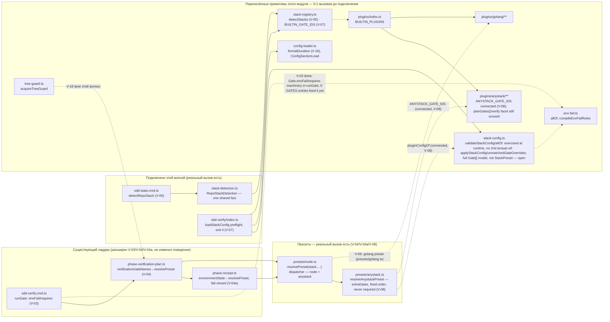
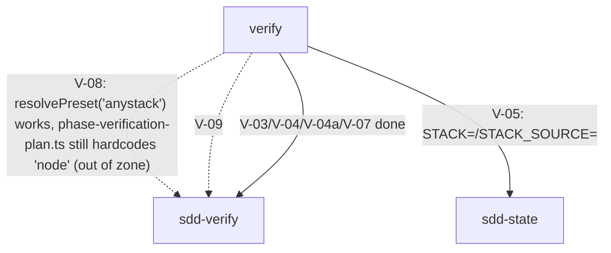

# Module: `verify`

**Module:** verify · **Parent scope:** [cli](../cli.spec.md)

<!--SECTION:MODULE_VISION-->

## 1. Module Vision

`verify` — стек-движок, переносимый дословно из MAIN (`services/stack/**`, `plugins/{anystack,golang}/**`) в рамках пачки «Verify считает окружение и гейты как данные» (`ai/drafts/research/sdd-v1-to-v2-transfer/30-TRACK-VERIFY.md` §6, задачи V-02..V-09). Перенос идёт волнами: каждая задача добавляет РЕАЛЬНЫЙ вызов очередному примитиву, подключая его к существующему ладдеру `sdd-verify` (`cli/cmd/sdd-verify/**`), который в это же время не меняется в поведении (golden V-01, инварианты И-1/И-2). До своего подключения перенесённый примитив по определению имеет 0-1 продакшн-вызовов — это фиксирует гейт `yagni`, и единственный штатный способ унять находку — `Usage Waiver` (`cli/cmd/yagni/yagni.cmd.ts:228`), записанный здесь, в контракте модуля-получателя, с явной ссылкой на задачу, которая присоединит вызов.

**Key properties:**

- Модуль **не имеет собственного CLI-входа** — это внутренний слой (`shared/verify/**`, `services/config/config-loader.ts`, `plugins/**`), потребляемый существующими командами `sdd-verify`/`sdd-state`/`sdd-task` по мере их подключения задачами V-03..V-09.
- **V-04a закрыта:** `phase-receipt.ts` (`environmentState`, вне этого модуля) теперь резолвит пресет через `resolvePreset('node', …)` (`presets/node.ts`) и фейлится явно на этапе резолва для стека без реализованного источника (И-3) — реальный вызов из `gennady sdd-verify` в этот модуль есть.
- **V-05 закрыта:** новый `shared/verify/stack-detection.ts` (`detectRepoStack`) даёт один общий факт `StackDetection` вместо per-caller угадывания; `sdd-state.cmd.ts` подключает его и печатает `STACK=`/`STACK_SOURCE=` в `[READINESS]`. Реальный второй вызов `detectStacks` (`stack-registry.ts`) есть — его запись `Usage Waiver` снята.
- **V-07 закрыта:** `cli/cmd/sdd-verify/index.ts` подключает `loadStackConfig(root, BUILTIN_GATE_IDS)` как реальный preflight-гейт — любая ошибка схемы `stack:` (`gennady.yaml`/`.gennadyrc`) останавливает `sdd-verify` с exit 4 (`ERR_CLI_SDD_VERIFY_STACK_CONFIG`) до выполнения любого гейта; отсутствие секции — не ошибка. `loadStackConfig`/`BUILTIN_GATE_IDS`/`StackConfigError`/`StackConfigLoad` сняты (реальные вторые ссылки); `validateStackConfig`/`allOf`/`ConfigSectionLoad`/`formatDuration` остаются waived (уточнены по факту, см. §6). Доказано e2e (`cli/__tests__/tool-behavior/sdd-verify-stack-config.test.ts`): валидный `gennady.yaml` с 3 `extraGates` (id/argv/envFail/requires/fixer) не спотыкается о гейт; неизвестный ключ и неизвестный `stack.use` id → exit 4.
- **V-08 закрыта (пресет), но не достижима через реальный ладдер:** новый `shared/verify/presets/anystack.ts` (`resolveAnystackPreset`) реализует `StackPreset` — `resolvePreset('anystack', …)` больше не возвращает `null`, доказано unit-тестами. Гейты — только из `stack.anystack.extraGates` (`pluginConfigOf`), в точном порядке объявления (И-2, fixed order); ни один никогда не required — anystack не делает проект not-ready. `ANYSTACK_GATE_IDS`/`StackPreset`/`pluginConfigOf` сняты (реальные вторые ссылки). **Открытые разрывы (задокументированы как отклонение — см. сводный отчёт пачки):** (1) `unmatchedGateOverrides`/`applyStackConfig` остаются waived — они работают над полными `Gate[]` MAIN-модели (envFail/requires/fixer как исполняемые примитивы), а `StackPreset.commandForGate` фазовой лестницы возвращает только `string | null`; (2) **`phase-verification-plan.ts` (вне периметра «трогать» этой волны) по-прежнему жёстко резолвит `resolvePreset('node', …)`** — anystack-пресет не выбирается ни для одной реальной фазы `sdd-verify` сегодня; нужен отдельный шаг, который передаёт V-05's `detectRepoStack` в этот call site.
- Неподключённым остаётся только перенесённый golang-пресет волны V-09 — Overview (§2) рисует это явно: пунктирные рёбра = ещё не подключено.
- `Usage Waiver` в §8 (`Module Contracts`) — не постоянное освобождение, а расписание: у каждой записи есть задача-владелец, которая обязана либо провести реальный вызов и снять запись, либо явно пересмотреть её при своём закрытии (см. `Module Decision Log`, §11, для истории снятий).
- Перенесённые файлы — MAIN `d37d5910`, минимальная правка импортов под путь RC (детали и построчные диффы — в `R-V-02.md`, не дублируются здесь).

<!--/SECTION:MODULE_VISION-->

<!--SECTION:OVERVIEW-->

## 2. Overview



_Сплошные рёбра — уже связанный код (ничего не меняется этой пачкой); пунктирные — связь, которую проведёт конкретная задача V-03..V-09/V-18, тем самым снимая соответствующие записи `Usage Waiver` из §8._

<!--/SECTION:OVERVIEW-->

<!--SECTION:MODULE_USAGE_EXAMPLE-->

## 3. Module Usage Example

**V-05:** `cli/cmd/sdd-state/sdd-state.cmd.ts` импортирует `detectRepoStack` и печатает его результат в `[READINESS]`:

```ts
import { detectRepoStack } from '../../../shared/verify/stack-detection.ts';

const stack = detectRepoStack(root, null); // config wiring is V-07's job
// stack.stacks === ['node'] | ['golang'] | ['golang','node'] | ['anystack']
// stack.source  === 'marker:package.json' | 'config:stack.use' | …
```

**V-07:** `cli/cmd/sdd-verify/index.ts` loads and validates the `stack:` config section before any gate runs — a malformed `gennady.yaml`/`.gennadyrc` exits 4, never a partial run:

```ts
import { loadStackConfig, type StackConfigLoad } from '../../../shared/verify/stack-config.ts';
import { BUILTIN_GATE_IDS } from '../../../shared/verify/stack-registry.ts';
import { stackConfigError } from './sdd-verify.types.ts';

const stackConfigLoad: StackConfigLoad = loadStackConfig(projectRoot, BUILTIN_GATE_IDS);
if (stackConfigLoad.errors.length > 0) {
  const outcome = stackConfigError(stackConfigLoad.errors);
  console.error(outcome.message);
  process.exit(outcome.exitCode); // 4
}
```

**V-08:** `resolvePreset('anystack', …)` — same call, different stack — resolves through `presets/node.ts`'s dispatcher:

```ts
import { resolvePreset } from 'shared/verify/presets/node.ts';

const preset = resolvePreset('anystack', 'full', root, stackConfigLoad.config);
preset!.gateNames('full', false); // extraGate ids, declaration order
preset!.requiredGateNames('full', false); // always [] — never blocks the ladder
preset!.commandForGate('syntax', {}, []); // extraGate argv, shell-quoted
```

TODO(V-09): golang-пресет ещё не подключён — см. Overview (§2).

<!--/SECTION:MODULE_USAGE_EXAMPLE-->

<!--SECTION:ENTITY_INVENTORY-->

## 4. Entity Inventory (Closed-World)

_Полный список файлов-сущностей, перенесённых задачей V-02. Функции/типы внутри них — в `Module Contracts` (§8), только там, где на них есть `Usage Waiver`._

| Name                                | Type     | Purpose                                                                                            |
| ----------------------------------- | -------- | -------------------------------------------------------------------------------------------------- |
| `shared/verify/verify.types.ts`     | Types    | Общие типы стек-движка (`Gate`, `StackRun`, `VerifyReport`, …)                                     |
| `shared/verify/env-fail.ts`         | Utility  | Компилятор env-fail предикатов (`allOf`, `exitCodeMatches`, …)                                     |
| `shared/verify/tree-guard.ts`       | Port     | Лок рабочего дерева на время гейта (single-flight, ещё не подключён)                               |
| `shared/verify/stack-registry.ts`   | Service  | Реестр builtin-стеков и их gate id, детект активных стеков                                         |
| `shared/verify/plugin-api.ts`       | Port     | Публичная поверхность `gennady/stack` для авторов стек-плагинов                                    |
| `shared/verify/stack-config.ts`     | Service  | Конфиг-контракт `gennady.yaml` секция `stack:` (deep-merge, провенанс)                             |
| `services/config/config-loader.ts`  | Service  | Универсальный загрузчик секции конфига + провенанс + форматирование                                |
| `plugins/index.ts`                  | Registry | Список встроенных стек-плагинов (`BUILTIN_PLUGINS`)                                                |
| `plugins/anystack/**`               | Adapter  | Read-only стек-плагин для произвольных гейтов из `gennady.yaml`                                    |
| `plugins/golang/**`                 | Adapter  | Стек-плагин Go: детект, scope, план (`gofmt`, `go vet`, `go generate`)                             |
| `shared/verify/presets/node.ts`     | Service  | `resolvePreset(stack, …)` — dispatcher; node inline, anystack delegated (V-04/V-08)                |
| `shared/verify/presets/anystack.ts` | Service  | `resolveAnystackPreset` — config-authored gates, fixed order, never required (V-08)                |
| `shared/verify/stack-detection.ts`  | Service  | `detectRepoStack(root, config)` — один общий факт `StackDetection`, подключён к `sdd-state` (V-05) |

<!--/SECTION:ENTITY_INVENTORY-->

<!--SECTION:ENTITY_SURFACES-->

## 5. Entity Surfaces

Поверхности перенесённых сущностей раскрываются по мере подключения (V-05/V-07/V-08/V-09); до этого — только `Module Contracts` (§8) с записями `Usage Waiver`.

<details>
<summary>Развёрнутые поверхности сущностей</summary>

TODO(V-05, V-07, V-08, V-09): наполняется задачей, которая реально подключает соответствующий файл (см. Entity Inventory, §4, и Overview, §2).

</details>

<!--/SECTION:ENTITY_SURFACES-->

<!--SECTION:MODULE_CONTRACTS-->

## 6. Module Contracts (DbC)

Единственный наполненный контракт этого раздела сегодня — реестр `Usage Waiver`, изначально 25 символов задачи V-02 (0-1 продакшн-вызовов на момент переноса, все — из `d37d5910` дословно); 17 записей остаются open после V-05 (`detectStacks` снят), V-07 (`loadStackConfig`/`BUILTIN_GATE_IDS`/`StackConfigError`/`StackConfigLoad` сняты) и V-08 (`ANYSTACK_GATE_IDS`/`StackPreset`/`pluginConfigOf` сняты — реальные вторые ссылки в `presets/anystack.ts`). Каждая запись называет задачу-владельца, которая обязана провести реальный второй вызов и снять запись; форма/грамматика — по прецеденту `specs/shared/shared.spec.md`, `specs/cli/sdd-check/sdd-check.spec.md` (`cli/cmd/yagni/yagni.cmd.ts:228`).

<details>
<summary>Usage Waiver — 17 символов open (25 исходных V-02, минус 8 снятых V-05/V-07/V-08), по задаче-владельцу</summary>

### `C`

- **Usage Waiver:** approximate-declaration ложноположительный — однобуквенный top-level идентификатор внутри одноразовых e2e-фикстур golang (`go-fmt-excludes-nested-testdata/cmd/c.go`, `go-scope-build-constraints/constrained/c.go`), не публичная поверхность плагина; фикстуры реально упражняются e2e-прогоном golang-пресета — снимается в V-09 (пересмотреть по факту: если V-09 не добавит текстовую ссылку, годится только сужение source-policy `yagni` для `e2e/fixtures/**`, отдельная задача вне этой волны).

### `I`

- **Usage Waiver:** тот же класс ложноположительного, фикстура `go-fmt-excludes-nested-testdata/internal/i.go` — снимается в V-09 (см. запись `C`).

### `Bad`

- **Usage Waiver:** тот же класс ложноположительного, фикстура `go-fmt-excludes-nested-testdata/internal/testdata/golden.go` — снимается в V-09 (см. запись `C`).

### `scopeHasGoGenerate`

- **Usage Waiver:** единственный вызов сегодня — внутри своего же файла (`golang-plan.logic.ts`); второй — из golang-пресета, переносящего `driftMeansFailure` (`go generate`) в ладдер (`30-TRACK-VERIFY.md` §6, V-09) — снимается в V-09.

### `isStructuralListError`

- **Usage Waiver:** единственный вызов сегодня — внутри своего же файла (`golang-scope.logic.ts`); второй — из golang-пресета/e2e `go-broken-package-not-dropped` — снимается в V-09.

### `ConfigSectionLoad`

- **Usage Waiver:** тип результата `loadConfigSection`, сегодня потребляется без явной аннотации (`stack-config.ts:357`). **Пересмотрено при закрытии V-07:** подключение (`loadStackConfig` → `sdd-verify/index.ts`) не задело этот тип напрямую — `sdd-verify` типизирует `StackConfigLoad` (снят) и `StackConfigError` (снят), а `ConfigSectionLoad` остаётся внутренним для `config-loader.ts`/`stack-config.ts`. Владелец не назначен; снимается, когда какой-то будущий потребитель секции конфига (не `stack`) явно затипизирует переменную этим именем.

### `formatDuration`

- **Usage Waiver:** печать `timeoutMs` гейта в человекочитаемом виде. **Пересмотрено при закрытии V-07:** V-07 добавляет только загрузку+валидацию (+exit 4), без печати самого гейт-плана — печать config-driven гейтов принадлежит `--plan`/`[gate] ` выводу (V-14/V-16, вне этой волны). Владелец — V-16 (если `gennady verify --plan --json` появится) или V-09 (если golang-пресет напечатает конфигурируемый timeout раньше).

### `allOf`

- **Usage Waiver:** комбинатор env-fail предикатов, сегодня вызывается только внутри `compileEnvFailRules` (`env-fail.ts:248`) — единственный call site, независимо от того, сколько раз сам `compileEnvFailRules` вызывается. **Пересмотрено при закрытии V-07:** `envFail`-правило на `extraGates` теперь реально валидируется по живому CLI-пути (`sdd-verify/index.ts` → `loadStackConfig` → `validateStackConfig` → `validateGateSpec` → `compileEnvFailRules` → `allOf`), доказано e2e-тестом (`cli/__tests__/tool-behavior/sdd-verify-stack-config.test.ts`, кейс с `envFail: [exitCodeMatches, stderrMatches]` на анистек-гейте) — но это **исполнение**, не новая **текстовая** ссылка на символ `allOf`, а гейт `yagni` считает именно текстовые ссылки. Снимается, когда появится второй прямой call site самого `allOf` (не через `compileEnvFailRules`) — открытый вопрос, владелец не назначен.

### `validateStackConfig`

- **Usage Waiver:** единственный вызов сегодня — внутри `loadStackConfig` (`stack-config.ts:369`). **Подтверждено при закрытии V-07** (как и предполагала запись): подключение `loadStackConfig` к `sdd-verify/index.ts` не добавило прямой второй вызов `validateStackConfig` самого по себе — запись пересмотрена явно, не перенесена молча. Владелец не назначен.

### `unmatchedGateOverrides`

- **Usage Waiver:** валидация `overrideGates` из `gennady.yaml` против уже спланированных гейтов (полных `Gate` объектов с `envFail`/`requires`/`fixer`). **Пересмотрено при закрытии V-08:** anystack-пресет (`presets/anystack.ts`) реализует `StackPreset` — узкий контракт фазовой лестницы (`gateNames`/`commandForGate: string | null`), не полный `Gate[]`-план MAIN-стековой модели; для anystack `overrideGates` не имеет смысла (нет builtin-гейтов, которые можно было бы override). Владелец не назначен — снимается, если/когда полная `Gate`-модель (`gennady verify`, V-16) когда-нибудь заменит фазовую лестницу или получит собственный слой поверх неё.

### `applyStackConfig`

- **Usage Waiver:** deep-merge применения конфига к гейтам — тот же класс, что `unmatchedGateOverrides`: работает над полными `Gate[]` MAIN-модели, не над `StackPreset`. **Пересмотрено при закрытии V-08:** anystack-пресет читает `extraGates` напрямую через `pluginConfigOf` (снят), минуя `applyStackConfig` — фазовая лестница проще (нет skipGates/overrideGates для config-only стека). Владелец не назначен, тот же критерий снятия, что у `unmatchedGateOverrides`.

### `TreeGuard`

- **Usage Waiver:** тип лока рабочего дерева. Не входит в набор задач этой волны (V-03..V-09) — по `30-TRACK-VERIFY.md` §6 подключение `tree-guard`-лока к фазовому пути явно отнесено к **V-18** («single-flight … `tree-guard`-lock переносится в V-02, но не подключается к фазовому пути»). Снимается в V-18 (вне текущей пачки — см. отклонения в `R-V-02.md`/сводном отчёте пачки).

### `TreeGuardOptions`

- **Usage Waiver:** та же причина и тот же владелец, что и `TreeGuard` — снимается в V-18.

### `GuardAcquisition`

- **Usage Waiver:** та же причина и тот же владелец, что и `TreeGuard` — снимается в V-18.

### `acquireTreeGuard`

- **Usage Waiver:** та же причина и тот же владелец, что и `TreeGuard` — снимается в V-18.

### `StackRun`

- **Usage Waiver:** тип одного запуска стека; в MAIN потребляется движком `services/stack/gate-runner.ts`, который эта волна не переносит целиком. **Пересмотрено при закрытии V-04:** `resolvePreset`/`StackPreset` (`shared/verify/presets/node.ts`) сознательно НЕ импортируют `StackRun`/`VerifyReport` — RC's ладдер продолжает нести собственную форму результата (`GateResult[]`/`VerifyOutcome` в `sdd-verify.types.ts`), а не форму MAIN. Открытый вопрос снят отрицательно для V-04; новый предполагаемый владелец — CLI-фасад `gennady verify --plan --json` (V-16a, вне этой волны), если он когда-нибудь примет форму MAIN как свой JSON-контракт; в противном случае символ остаётся кандидатом на удаление вне этой волны.

### `VerifyReport`

- **Usage Waiver:** итоговый отчёт прогона стека — тот же пересмотр при закрытии V-04, что и `StackRun`: `resolvePreset`/`StackPreset` не используют эту форму; новый предполагаемый владелец — V-16a (если возникнет), иначе кандидат на удаление вне этой волны.

</details>

<!--/SECTION:MODULE_CONTRACTS-->

<!--SECTION:PUBLIC_OPTIONS-->

## 7. Public Options & Policies

**`stack:`** (`gennady.yaml`, `.gennadyrc`) — merged deep, repo `.gennadyrc` > `gennady.yaml` > `$HOME/.gennadyrc`, per-key provenance (`shared/verify/stack-config.ts`, `services/config/config-loader.ts`). Schema is strict: any unknown key, wrong type, or bad value is fatal — `sdd-verify` exits 4 (`ERR_CLI_SDD_VERIFY_STACK_CONFIG`) before any gate runs (V-07, `cli/cmd/sdd-verify/index.ts`). No section present at all is not an error.

- `use: [<plugin-id>, …]` — restricts the candidate stack registry; never assigns an undetected stack.
- `<pluginId>.skipGates: [<gate-id>, …]` — excludes builtin gates, visibly (skip entries, never silent drops).
- `<pluginId>.overrideGates.<gate-id>: <GateSpec>` — overrides one builtin gate's `argv`/`cwd`/`env`/`timeout`/`outputMeansFailure`/`driftMeansFailure`/`envFail`/`requires`/`fixer`; unset fields inherit.
- `<pluginId>.extraGates: [<GateSpec>, …]` — repo-specific gates appended after the builtins; `id`+`argv` mandatory; `anystack`'s entire gate list comes from here (its own builtin gate list is empty).

**V-08 закрыта:** `extraGates` reach the phase ladder through `resolveAnystackPreset` (`pluginConfigOf(config, 'anystack')`, not `applyStackConfig` — see Module Contracts §6 for why the full `Gate[]`-model functions stay unconnected). `overrideGates`/`skipGates` have no effect for anystack today (no builtin gates exist to override or skip).

<!--/SECTION:PUBLIC_OPTIONS-->

<!--SECTION:FILE_STRUCTURE-->

## 8. File Structure

```
shared/verify/
├── verify.types.ts
├── env-fail.ts
├── tree-guard.ts
├── stack-registry.ts
├── plugin-api.ts
├── stack-config.ts
└── presets/            <!-- V-04 (node), V-08 (anystack), V-09 (golang) -->
services/config/
└── config-loader.ts
plugins/
├── index.ts
├── anystack/**
└── golang/**
```

**File Mapping:** см. Entity Inventory (§4) — один-к-одному с этим деревом; `presets/` создаётся последующими задачами (V-04/V-08/V-09), а не этой.

<!--/SECTION:FILE_STRUCTURE-->

<!--SECTION:MODULE_DECISION_LOG-->

## 9. Module Decision Log

Одна запись на сегодня — решение Lead L-21 разрешить этот файл как узкий waiver вместо более широкого пересмотра границ задач.

<details>
<summary>Полные записи Decision Log</summary>

### VERIFY-DL-1 — Узкий waiver в новой спеке вместо слияния V-02/V-04 или исключения гейта `yagni`

- **Status:** active
- **Why:** `R-V-02.md` §4 зафиксировал 4 варианта разблокировки коммита V-02 (перенос примитивов без вызовов бьётся о гейт `yagni`, а `specs/**` был вне периметра «трогать» у исполнителя). Lead выбрал вариант 1 — точечный новый файл `specs/cli/verify/verify.spec.md` с `Usage Waiver` по существующему механизму, не сливая задачи и не отключая гейт. Каждая запись называет задачу-владельца; снятие записи — обязанность этой задачи, а не разовая амнистия.

</details>

<!--/SECTION:MODULE_DECISION_LOG-->

<!--SECTION:INTER_MODULE_DEPENDENCIES-->

## 10. Inter-Module Dependencies

- **Depends on:** None (перенесённый код пока изолирован — см. Overview, §2)
- **Scope Reference (cross-scope):** None
- **Provides to:** [sdd-verify](../sdd-verify/sdd-verify.spec.md) (V-03/V-04/V-04a/V-07 закрыты; **V-08 частично** — `resolvePreset('anystack', …)` реализован и протестирован, но `phase-verification-plan.ts` — вне периметра «трогать» этой волны — по-прежнему жёстко резолвит только `'node'`, так что anystack-пресет не достижим через реальный `sdd-verify`-путь; V-09 не начата), [sdd-state](../sdd-state/sdd-state.spec.md) (V-05 закрыта — `STACK=`/`STACK_SOURCE=` реально подключены)



_Кто подключит `verify` к своему ладдеру и какая задача проведёт это ребро._

<!--/SECTION:INTER_MODULE_DEPENDENCIES-->

<!--SECTION:HANDOFF-->

## 11. Handoff to Tasks

- **Implementation files to be created:** `shared/verify/presets/golang.ts` (V-09) — `presets/{node,anystack}.ts` (V-04/V-08) and `shared/verify/stack-detection.ts` (V-05) already exist
- **Test files to be created:** по каждой задаче-владельцу — см. `30-TRACK-VERIFY.md` §6, колонка «тесты, которые добавляются»
- **Stack dependencies:**
  - Language: `typescript` (резолвится в `ai/directives/coding/typescript-rules.xml`)
  - Test framework: `node:test` (резолвится в `ai/directives/testing/baseline-testing.xml`)
- **Module Rules Additions:** None

  | Rule | Category | Source |
  | ---- | -------- | ------ |
  | None | —        | —      |

- **Open risks & validation needs:**
  - `StackRun`/`VerifyReport` (§6) — предварительный владелец V-04 не подтверждён структурно; пересмотреть при закрытии V-04.
  - `validateStackConfig`/`ConfigSectionLoad`/`allOf` (§6) — **закрыто по факту V-07:** подключение `loadStackConfig` не добавило новую текстовую ссылку на эти три символа (только исполняет их на реальном CLI-пути, доказано e2e); владелец не назначен — снимается, когда появится прямой второй call site.
  - `unmatchedGateOverrides`/`applyStackConfig` (§6) — **закрыто по факту V-08:** `pluginConfigOf` снят (real 2nd ref via `presets/anystack.ts`), but these two still work over the full `Gate[]` model, not `StackPreset` — owner unassigned, revisit if/when `gennady verify`'s Gate model (V-16) gets its own connection layer.
  - `C`/`I`/`Bad` (§6) — структурный false-positive source-policy `yagni` на `e2e/fixtures/**`; если V-09 не даст реального второго упоминания, нужна отдельная задача на сужение `yagni` (вне этой волны).

<!--/SECTION:HANDOFF-->
