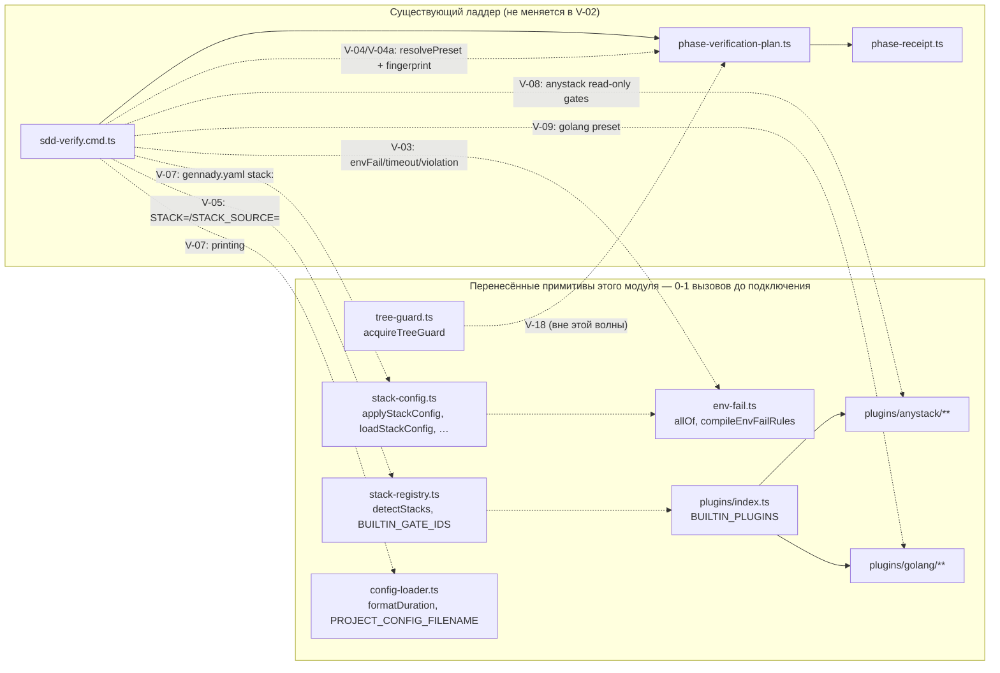
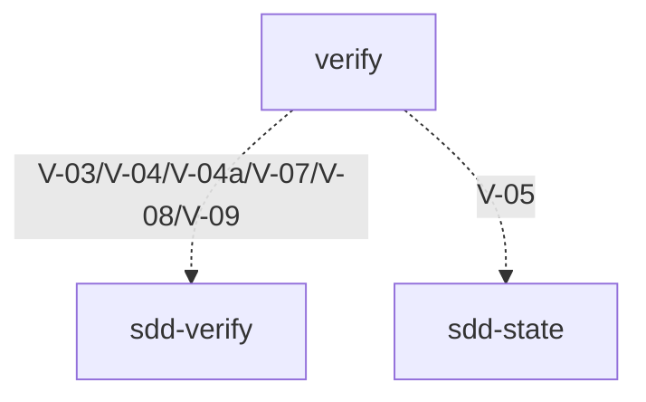

# Module: `verify`

**Module:** verify · **Parent scope:** [cli](../cli.spec.md)

<!--SECTION:MODULE_VISION-->

## 1. Module Vision

`verify` — стек-движок, переносимый дословно из MAIN (`services/stack/**`, `plugins/{anystack,golang}/**`) в рамках пачки «Verify считает окружение и гейты как данные» (`ai/drafts/research/sdd-v1-to-v2-transfer/30-TRACK-VERIFY.md` §6, задачи V-02..V-09). Перенос идёт волнами: каждая задача добавляет РЕАЛЬНЫЙ вызов очередному примитиву, подключая его к существующему ладдеру `sdd-verify` (`cli/cmd/sdd-verify/**`), который в это же время не меняется в поведении (golden V-01, инварианты И-1/И-2). До своего подключения перенесённый примитив по определению имеет 0-1 продакшн-вызовов — это фиксирует гейт `yagni`, и единственный штатный способ унять находку — `Usage Waiver` (`cli/cmd/yagni/yagni.cmd.ts:228`), записанный здесь, в контракте модуля-получателя, с явной ссылкой на задачу, которая присоединит вызов.

**Key properties:**

- Модуль **не имеет собственного CLI-входа** — это внутренний слой (`shared/verify/**`, `services/config/config-loader.ts`, `plugins/**`), потребляемый существующими командами `sdd-verify`/`sdd-state`/`sdd-task` по мере их подключения задачами V-03..V-09.
- Пока последняя связывающая задача (в этой волне — V-04a) не закрыта, ни одна строка этого модуля не вызывается из реального прогона `gennady sdd-verify` — Overview (§2) рисует это явно: пунктирные рёбра = ещё не подключено.
- `Usage Waiver` в §8 (`Module Contracts`) — не постоянное освобождение, а расписание: у каждой записи есть задача-владелец, которая обязана либо провести реальный вызов и снять запись, либо явно пересмотреть её при своём закрытии (см. `Module Decision Log`, §11, для истории снятий).
- Перенесённые файлы — MAIN `d37d5910`, минимальная правка импортов под путь RC (детали и построчные диффы — в `R-V-02.md`, не дублируются здесь).

<!--/SECTION:MODULE_VISION-->

<!--SECTION:OVERVIEW-->

## 2. Overview



_Сплошные рёбра — уже связанный код (ничего не меняется этой пачкой); пунктирные — связь, которую проведёт конкретная задача V-03..V-09/V-18, тем самым снимая соответствующие записи `Usage Waiver` из §8._

<!--/SECTION:OVERVIEW-->

<!--SECTION:MODULE_USAGE_EXAMPLE-->

## 3. Module Usage Example

TODO(V-05, V-07, V-09): модуль пока не имеет собственного публичного входа — вызывающий код появляется по одной задаче за раз (детект стека — V-05, конфиг — V-07, golang-пресет — V-09). Пример наполняется первой задачей, которая реально импортирует `shared/verify/*` за пределами своего же файла.

<!--/SECTION:MODULE_USAGE_EXAMPLE-->

<!--SECTION:ENTITY_INVENTORY-->

## 4. Entity Inventory (Closed-World)

_Полный список файлов-сущностей, перенесённых задачей V-02. Функции/типы внутри них — в `Module Contracts` (§8), только там, где на них есть `Usage Waiver`._

| Name                               | Type     | Purpose                                                                |
| ---------------------------------- | -------- | ---------------------------------------------------------------------- |
| `shared/verify/verify.types.ts`    | Types    | Общие типы стек-движка (`Gate`, `StackRun`, `VerifyReport`, …)         |
| `shared/verify/env-fail.ts`        | Utility  | Компилятор env-fail предикатов (`allOf`, `exitCodeMatches`, …)         |
| `shared/verify/tree-guard.ts`      | Port     | Лок рабочего дерева на время гейта (single-flight, ещё не подключён)   |
| `shared/verify/stack-registry.ts`  | Service  | Реестр builtin-стеков и их gate id, детект активных стеков             |
| `shared/verify/plugin-api.ts`      | Port     | Публичная поверхность `gennady/stack` для авторов стек-плагинов        |
| `shared/verify/stack-config.ts`    | Service  | Конфиг-контракт `gennady.yaml` секция `stack:` (deep-merge, провенанс) |
| `services/config/config-loader.ts` | Service  | Универсальный загрузчик секции конфига + провенанс + форматирование    |
| `plugins/index.ts`                 | Registry | Список встроенных стек-плагинов (`BUILTIN_PLUGINS`)                    |
| `plugins/anystack/**`              | Adapter  | Read-only стек-плагин для произвольных гейтов из `gennady.yaml`        |
| `plugins/golang/**`                | Adapter  | Стек-плагин Go: детект, scope, план (`gofmt`, `go vet`, `go generate`) |

<!--/SECTION:ENTITY_INVENTORY-->

<!--SECTION:ENTITY_SURFACES-->

## 5. Entity Surfaces

Поверхности перенесённых сущностей раскрываются по мере подключения (V-05/V-07/V-08/V-09); до этого — только `Module Contracts` (§8) с записями `Usage Waiver`.

<details>
<summary>Развёрнутые поверхности сущностей</summary>

TODO(V-05, V-07, V-08, V-09): наполняется задачей, которая реально подключает соответствующий файл (см. Entity Inventory, §4, и Overview, §2).

</details>

<!--/SECTION:ENTITY_SURFACES-->

<!--SECTION:MODULE_CONTRACTS-->

## 6. Module Contracts (DbC)

Единственный наполненный контракт этого раздела сегодня — реестр `Usage Waiver` для 25 символов задачи V-02 (0-1 продакшн-вызовов на момент переноса, все — из `d37d5910` дословно). Каждая запись называет задачу-владельца, которая обязана провести реальный второй вызов и снять запись; форма/грамматика — по прецеденту `specs/shared/shared.spec.md`, `specs/cli/sdd-check/sdd-check.spec.md` (`cli/cmd/yagni/yagni.cmd.ts:228`).

<details>
<summary>Usage Waiver — 25 символов V-02, по задаче-владельцу</summary>

### `ANYSTACK_GATE_IDS`

- **Usage Waiver:** используется один раз внутри своего же plugin-объекта (`gateIds: ANYSTACK_GATE_IDS`); второй, реальный вызов появится, когда anystack-пресет (`presets/anystack.ts`) прочитает `plugin.gateIds` в `gatePlan` фазовой модели — снимается в V-08.

### `C`

- **Usage Waiver:** approximate-declaration ложноположительный — однобуквенный top-level идентификатор внутри одноразовых e2e-фикстур golang (`go-fmt-excludes-nested-testdata/cmd/c.go`, `go-scope-build-constraints/constrained/c.go`), не публичная поверхность плагина; фикстуры реально упражняются e2e-прогоном golang-пресета — снимается в V-09 (пересмотреть по факту: если V-09 не добавит текстовую ссылку, годится только сужение source-policy `yagni` для `e2e/fixtures/**`, отдельная задача вне этой волны).

### `I`

- **Usage Waiver:** тот же класс ложноположительного, фикстура `go-fmt-excludes-nested-testdata/internal/i.go` — снимается в V-09 (см. запись `C`).

### `Bad`

- **Usage Waiver:** тот же класс ложноположительного, фикстура `go-fmt-excludes-nested-testdata/internal/testdata/golden.go` — снимается в V-09 (см. запись `C`).

### `scopeHasGoGenerate`

- **Usage Waiver:** единственный вызов сегодня — внутри своего же файла (`golang-plan.logic.ts`); второй — из golang-пресета, переносящего `driftMeansFailure` (`go generate`) в ладдер (`30-TRACK-VERIFY.md` §6, V-09) — снимается в V-09.

### `isStructuralListError`

- **Usage Waiver:** единственный вызов сегодня — внутри своего же файла (`golang-scope.logic.ts`); второй — из golang-пресета/e2e `go-broken-package-not-dropped` — снимается в V-09.

### `PROJECT_CONFIG_FILENAME`

- **Usage Waiver:** используется один раз внутри `config-loader.ts`; вторая ссылка ожидается там, где V-07 подключит `gennady.yaml`-специфичные сообщения (например, текст ошибки exit 4) — снимается в V-07.

### `ConfigSectionLoad`

- **Usage Waiver:** тип результата `loadConfigSection`, сегодня потребляется без явной аннотации (`stack-config.ts:357`); явная вторая ссылка на имя типа ожидается при подключении обработки `configLoad` к реальному ладдеру — снимается в V-07 (пересмотреть по факту: неявное потребление не добавляет текстовую ссылку само по себе).

### `formatDuration`

- **Usage Waiver:** печать `timeoutMs` гейта в человекочитаемом виде; в MAIN вызывается при печати config-driven гейтов тем же путём, что подключает V-07 — снимается в V-07 (пересмотреть: если печать переедет в маркер `[gate] ` задачи V-14, владелец меняется).

### `allOf`

- **Usage Waiver:** комбинатор env-fail предикатов, сегодня вызывается только внутри `compileEnvFailRules` (`env-fail.ts:248`); golang-плагин уже вызывает `exitCodeMatches`/`outputMatches` напрямую, но не комбинирует их через `allOf` — второй прямой вызов ожидается, когда V-03 составит `envFail`-правило из нескольких условий для встроенного (не golang) гейта `GATES` — снимается в V-03.

### `StackConfigError`

- **Usage Waiver:** тип ошибки валидации конфига; вторая явная ссылка появится, когда V-07 прокинет `configLoad.errors: StackConfigError[]` в вывод/exit 4 `sdd-verify` — снимается в V-07.

### `StackConfigLoad`

- **Usage Waiver:** тип результата `loadStackConfig`; та же вторая ссылка, что у `StackConfigError` — снимается в V-07.

### `validateStackConfig`

- **Usage Waiver:** единственный вызов сегодня — внутри `loadStackConfig` (`stack-config.ts:369`); подключение `loadStackConfig` к ладдеру (V-07) не гарантирует новую текстовую ссылку на `validateStackConfig` само по себе — снимается в V-07, если к его закрытию прямой второй вызов не появится, запись пересматривается явно (не переносится молча).

### `loadStackConfig`

- **Usage Waiver:** точка входа конфиг-контракта; второй вызов — прямое подключение к `sdd-verify.cmd.ts` (аналог MAIN `verify.cmd.ts:108`) — снимается в V-07.

### `pluginConfigOf`

- **Usage Waiver:** срез конфигурации на плагин; второй вызов — там же, где V-07 подключает per-plugin конфиг к реальному циклу гейтов — снимается в V-07.

### `unmatchedGateOverrides`

- **Usage Waiver:** валидация `overrideGates` из `gennady.yaml`; второй вызов приходит вместе с подключением V-07 — снимается в V-07.

### `applyStackConfig`

- **Usage Waiver:** deep-merge применения конфига к гейтам — ядро конфиг-контракта; второй вызов приходит вместе с подключением V-07 — снимается в V-07.

### `BUILTIN_GATE_IDS`

- **Usage Waiver:** передаётся аргументом в `loadStackConfig(root, BUILTIN_GATE_IDS)` в MAIN (`verify.cmd.ts:20,108`); второй вызов — тот же путь подключения, что и у `loadStackConfig` — снимается в V-07.

### `detectStacks`

- **Usage Waiver:** детект активных стеков репозитория; второй вызов — новый `shared/verify/stack-detection.ts`, который V-05 подключает к `sdd-state`/`sdd-task`/`sdd-verify` (`STACK=`/`STACK_SOURCE=`) — снимается в V-05.

### `TreeGuard`

- **Usage Waiver:** тип лока рабочего дерева. Не входит в набор задач этой волны (V-03..V-09) — по `30-TRACK-VERIFY.md` §6 подключение `tree-guard`-лока к фазовому пути явно отнесено к **V-18** («single-flight … `tree-guard`-lock переносится в V-02, но не подключается к фазовому пути»). Снимается в V-18 (вне текущей пачки — см. отклонения в `R-V-02.md`/сводном отчёте пачки).

### `TreeGuardOptions`

- **Usage Waiver:** та же причина и тот же владелец, что и `TreeGuard` — снимается в V-18.

### `GuardAcquisition`

- **Usage Waiver:** та же причина и тот же владелец, что и `TreeGuard` — снимается в V-18.

### `acquireTreeGuard`

- **Usage Waiver:** та же причина и тот же владелец, что и `TreeGuard` — снимается в V-18.

### `StackRun`

- **Usage Waiver:** тип одного запуска стека; в MAIN потребляется движком `services/stack/gate-runner.ts`, который эта волна не переносит целиком (RC сохраняет свой существующий ладдер `phase-verification-plan.ts`/`phase-run.ts`). Предварительно отнесён к `resolvePreset` (V-04: «node-пресет + правки `phase-verification-plan.ts`»); если V-04 не примет эту форму для своего возвращаемого значения, владелец — CLI-фасад `gennady verify --plan --json` (V-16a, вне этой волны) — открытый вопрос, пересмотреть при закрытии V-04.

### `VerifyReport`

- **Usage Waiver:** итоговый отчёт прогона стека; тот же открытый вопрос и тот же предварительный владелец, что и `StackRun` — предварительно V-04, пересмотреть при закрытии.

</details>

<!--/SECTION:MODULE_CONTRACTS-->

<!--SECTION:PUBLIC_OPTIONS-->

## 7. Public Options & Policies

TODO(V-07): секция `stack:` `gennady.yaml` (deep-merge, провенанс, `skipGates`/`overrideGates`/`extraGates`) описывается здесь, когда V-07 подключает конфиг-контракт к реальному ладдеру. До этого — см. перенесённые типы в §4/§6.

<!--/SECTION:PUBLIC_OPTIONS-->

<!--SECTION:FILE_STRUCTURE-->

## 8. File Structure

```
shared/verify/
├── verify.types.ts
├── env-fail.ts
├── tree-guard.ts
├── stack-registry.ts
├── plugin-api.ts
├── stack-config.ts
└── presets/            <!-- V-04 (node), V-08 (anystack), V-09 (golang) -->
services/config/
└── config-loader.ts
plugins/
├── index.ts
├── anystack/**
└── golang/**
```

**File Mapping:** см. Entity Inventory (§4) — один-к-одному с этим деревом; `presets/` создаётся последующими задачами (V-04/V-08/V-09), а не этой.

<!--/SECTION:FILE_STRUCTURE-->

<!--SECTION:MODULE_DECISION_LOG-->

## 9. Module Decision Log

Одна запись на сегодня — решение Lead L-21 разрешить этот файл как узкий waiver вместо более широкого пересмотра границ задач.

<details>
<summary>Полные записи Decision Log</summary>

### VERIFY-DL-1 — Узкий waiver в новой спеке вместо слияния V-02/V-04 или исключения гейта `yagni`

- **Status:** active
- **Why:** `R-V-02.md` §4 зафиксировал 4 варианта разблокировки коммита V-02 (перенос примитивов без вызовов бьётся о гейт `yagni`, а `specs/**` был вне периметра «трогать» у исполнителя). Lead выбрал вариант 1 — точечный новый файл `specs/cli/verify/verify.spec.md` с `Usage Waiver` по существующему механизму, не сливая задачи и не отключая гейт. Каждая запись называет задачу-владельца; снятие записи — обязанность этой задачи, а не разовая амнистия.

</details>

<!--/SECTION:MODULE_DECISION_LOG-->

<!--SECTION:INTER_MODULE_DEPENDENCIES-->

## 10. Inter-Module Dependencies

- **Depends on:** None (перенесённый код пока изолирован — см. Overview, §2)
- **Scope Reference (cross-scope):** None
- **Provides to:** [sdd-verify](../sdd-verify/sdd-verify.spec.md) (V-03/V-04/V-04a/V-07/V-08/V-09 подключают по одному ребру за раз), [sdd-state](../sdd-state/sdd-state.spec.md) (V-05 — `STACK=`/`STACK_SOURCE=`)



_Кто подключит `verify` к своему ладдеру и какая задача проведёт это ребро._

<!--/SECTION:INTER_MODULE_DEPENDENCIES-->

<!--SECTION:HANDOFF-->

## 11. Handoff to Tasks

- **Implementation files to be created:** `shared/verify/presets/{node,anystack,golang}.ts` (V-04/V-08/V-09), `shared/verify/stack-detection.ts` (V-05)
- **Test files to be created:** по каждой задаче-владельцу — см. `30-TRACK-VERIFY.md` §6, колонка «тесты, которые добавляются»
- **Stack dependencies:**
  - Language: `typescript` (резолвится в `ai/directives/coding/typescript-rules.xml`)
  - Test framework: `node:test` (резолвится в `ai/directives/testing/baseline-testing.xml`)
- **Module Rules Additions:** None

  | Rule | Category | Source |
  | ---- | -------- | ------ |
  | None | —        | —      |

- **Open risks & validation needs:**
  - `StackRun`/`VerifyReport` (§6) — предварительный владелец V-04 не подтверждён структурно; пересмотреть при закрытии V-04.
  - `validateStackConfig`/`ConfigSectionLoad`/`allOf` (§6) — подключение вызывающей функции (V-07/V-03) не гарантирует новую текстовую ссылку на сам символ; пересмотреть при закрытии соответствующей задачи, а не считать снятым автоматически.
  - `C`/`I`/`Bad` (§6) — структурный false-positive source-policy `yagni` на `e2e/fixtures/**`; если V-09 не даст реального второго упоминания, нужна отдельная задача на сужение `yagni` (вне этой волны).

<!--/SECTION:HANDOFF-->
