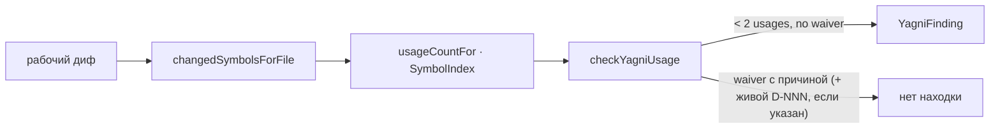

# Module: `yagni`

**Module:** yagni · **Parent scope:** [cli](../cli.spec.md)

<!--SECTION:MODULE_VISION-->

## 1. Module Vision

Команда находит символы (экспорт, метод класса, внутренняя функция, тип), которые появились или изменились в текущем диффе репозитория и имеют меньше двух использований в прод-коде по всей кодовой базе. Такой символ — кандидат на удаление. Если он нужен несмотря на это, рядом с ним в спеке модуля записывается причина (метка `Usage Waiver`) — тогда команда его пропускает.

**Key properties:**

- Языко-независимо на уровне порта: `SymbolIndex` (`services/symbol-index/`) — точный tree-sitter-адаптер для `.ts`/`.tsx` (единственная установленная грамматика) и приблизительный grep-адаптер для `.mts/.cts`, JS-вариантов, Python, Go, Ruby и Java. Единый source-policy задаёт расширения `ts/tsx/mts/cts/js/jsx/mjs/cjs/py/go/rb/java` и test territory одновременно для diff-discovery и corpus index; JS/TS `.test/.spec`, Go `_test.go`, Python `test_`/`_test`, Ruby `_spec/_test`, Java `Test/Tests` и test directories исключаются симметрично, поэтому два множества не могут разойтись.
- Тесты **никогда** не считаются использованием — файлы-тесты (`shared/common/files.ts#isTestFile`, тот же механизм, что у `git-core`) исключены из подсчёта.
- Реэкспорт из barrel/index (`export { X } from '...'`, `export * from '...'`) не считается использованием — такие строки вычищаются перед подсчётом (`stripBarrelReexports`).
- «Изменённый символ» — по имени: символ, объявленный в текущей версии файла, но отсутствующий среди имён, объявленных в версии файла на `HEAD`. Символ, чьё имя не поменялось, а изменилось лишь тело — вне периметра этого прохода (у него уже есть история использования).
- Видимость принадлежит языковому адаптеру, а не JS-regex в CLI: TypeScript определяет exports по AST, Go — по правилу uppercase top-level identifier. Остальной grep-fallback возвращает `unknown`; при ровно одном использовании команда выдаёт `ERR_CLI_YAGNI_VISIBILITY_UNKNOWN` (ограничение адаптера, не YAGNI-обвинение), поэтому неизвестная видимость не превращается ни в ложный clean, ни в ложную underuse-находку.
- Production/spec corpus индексируется fail-closed: любое существующее, но нечитаемое поддерево/файл возвращает `ERR_CLI_YAGNI_CORPUS_UNREADABLE` с путём и причиной до семантических находок. Отсутствующий optional `specs/` остаётся валидным пустым корпусом.
- Погашение находки — метка `- **Usage Waiver:** <причина>` в контракте/поверхности сущности. Причина обязательна — пустая метка не гасит. Ссылка на `D-NNN` опциональна: её пишут только тогда, когда за меткой стоит настоящее решение из Decision Log; если ссылка есть, она обязана указывать на живую запись.
- Формат вывода — ESLint-совместимый, как у `gennady lint` (`ERR_CLI_YAGNI_*`).

**Known limitations (v1, минимально достаточное качество — доработки по факту использования):**

- Подсчёт ссылок — по имени идентификатора, без разрешения областей видимости: два разных символа с одинаковым именем в разных файлах/скоупах учитываются как один. Переименованный при импорте (`import { x as y }`) счётчик не свяжет `x` и `y`. Тень имени (локальная переменная с тем же именем, что и проверяемый символ) считается как использование.
- Grep-адаптер (не-TS файлы) matches внутри строк/комментариев — approximate по определению, не дорабатывается сейчас.
- «Изменённый символ» = добавлено имя (D-YG001) — модификация тела без изменения имени не проверяется этим проходом.

<!--/SECTION:MODULE_VISION-->

<!--SECTION:OVERVIEW-->

## 2. Overview



_Символ диффа проходит через подсчёт использований (языко-независимый `SymbolIndex`) в чистое ядро `checkYagniUsage`; погашенная `Usage Waiver`-меткой находка не всплывает._

<!--/SECTION:OVERVIEW-->

<!--SECTION:MODULE_USAGE_EXAMPLE-->

## 3. Module Usage Example

```bash
# Проверка рабочего диффа текущего репо (незакоммиченные изменения + untracked, относительно HEAD)
npx gennady yagni

# Против конкретного корня
npx gennady yagni /path/to/repo
```

Пример находки:

```
cli/cmd/orient/core/unused-helper.ts:1:1: error: ERR_CLI_YAGNI_UNDERUSED: `formatWidgetLabel` (function) has 0 usage(s) in production code (< 2) — YAGNI suspect. Fix: remove it, or — if genuinely needed — add `- **Usage Waiver:** <reason>` to its contract/surface entry ...

yagni: 1 finding(s) across 3 changed file(s)
```

<!--/SECTION:MODULE_USAGE_EXAMPLE-->

<!--SECTION:ENTITY_INVENTORY-->

## 4. Entity Inventory (Closed-World)

_Это полный список сущностей модуля `yagni`. Любое введение сущности execution-агентом помимо этого списка считается drift'ом и требует обновления spec._

| Name                         | Type         | Purpose                                                                                                             |
| ---------------------------- | ------------ | ------------------------------------------------------------------------------------------------------------------- |
| `run`                        | Command      | Точка входа CLI-команды: сбор изменённых символов, подсчёт использований, находки, отчёт                            |
| `runGit`                     | Utility      | argv-safe запуск git с сохранением exit/status/stderr; ошибка никогда не превращается в пустой stdout               |
| `discoverChangedSourceFiles` | Service      | Fail-closed определение точного множества changed source files относительно `HEAD` или доказанного empty tree       |
| `ChangedFileDiscovery`       | Value Object | `{ok, files, comparisonBase}` либо `{ok:false, problem}` — доказанный scope или причина отказа                      |
| `changedSymbolsForFile`      | Service      | Символы regular файла сейчас минус `HEAD`; deleted → пусто, unreadable/symlink/outside-root → fail closed           |
| `ChangedSymbolsRead`         | Value Object | `{ok:true,symbols}` либо `{ok:false,problem}` — отличает удаление от недоказанного чтения                           |
| `YAGNI_SOURCE_EXTENSIONS`    | Policy       | Закрытое множество расширений exact/approximate адаптеров для diff и corpus                                         |
| `isYagniSourceFile`          | Policy       | Проверяет расширение changed source по единому множеству                                                            |
| `isYagniTestTerritory`       | Policy       | Единые JS/TS/Go/Python/Ruby/Java test conventions для declaration и usage sides                                     |
| `indexUsageCounts`           | Service      | Один проход production corpus: counts + typed `ioIssues`; partial counts никогда не означают clean                  |
| `indexSpecEvidence`          | Service      | Один проход optional specs corpus: waivers/decisions + typed `ioIssues`                                             |
| `YagniIoIssue`               | Value Object | `{path, operation, reason}` — точная дыра полноты evidence                                                          |
| `YagniFileListing`           | Value Object | `{files, ioIssues}` — traversal без silent skip                                                                     |
| `YagniTextRead`              | Value Object | `{ok,content}` либо `{ok:false,issue}` — unreadable не смешивается с empty                                          |
| `formatYagniReport`          | Utility      | ESLint-совместимое форматирование находок + сводная строка; exit 0/1                                                |
| `YagniReport`                | Value Object | `{text, exitCode}` — результат одного прогона                                                                       |
| `SymbolIndex`                | Port         | Языко-независимый порт: перечислить объявленные символы файла; сосчитать ссылки на имя                              |
| `DeclaredSymbol`             | Value Object | `{name, kind, line, visibility}` — символ с языковой `public/private/unknown` политикой адаптера                    |
| `SymbolVisibility`           | Value Object | `public \| private \| unknown` — portable visibility metadata                                                       |
| `ReferenceCount`             | Value Object | `{count, precision}` — результат подсчёта ссылок, `precision: 'exact' \| 'approximate'`                             |
| `TsSymbolIndexAdapter`       | Adapter      | Точная реализация `SymbolIndex` через tree-sitter-typescript (`.ts`/`.tsx`)                                         |
| `GrepSymbolIndexAdapter`     | Adapter      | Приблизительная реализация `SymbolIndex` через regex-поиск — любое расширение                                       |
| `selectSymbolIndex`          | Utility      | Чистый выбор адаптера по расширению файла — сборка адаптеров вне этой функции (composition root)                    |
| `ChangedSymbol`              | Value Object | `{name, kind, file, visibility}` — символ диффа; порог выбирается только по adapter metadata                        |
| `UsageWaiver`                | Value Object | `{decision?, reason, external?}` — разобранная метка `Usage Waiver`; `decision` есть только когда метка её цитирует |
| `YagniFinding`               | Value Object | `{severity, code, file, symbol, message}` — одна находка YAGNI                                                      |
| `checkYagniUsage`            | Service      | Чистая проверка: символ + счётчик использований + waiver + живые decisions → находки                                |
| `stripBarrelReexports`       | Utility      | Вычищает строки `export {...} from '...'` / `export * from '...'` перед подсчётом                                   |
| `parseUsageWaiver`           | Utility      | Разбор `- **Usage Waiver:** <причина>` (опционально `D-NNN — <причина>`) внутри блока `` ### `<Entity>` ``          |
| `hasDecisionHeading`         | Utility      | Есть ли в тексте заголовок `### D-NNN — ...`                                                                        |

<!--/SECTION:ENTITY_INVENTORY-->

<!--SECTION:ENTITY_SURFACES-->

## 5. Entity Surfaces

<details>
<summary>Развёрнутые поверхности сущностей</summary>

### `run`

- **Type:** Command
- **Purpose:** Точка входа CLI-команды `gennady yagni` — composition root порта `SymbolIndex`.
- **Public Operations:**
  - `discoverChangedSourceFiles(root)` → доказанный список изменённых файлов
  - `changedSymbolsForFile` на каждый файл → изменённые символы
  - `indexUsageCounts` → счётчики + полнота production corpus
  - `indexSpecEvidence` → метки/decisions + полнота optional specs corpus
  - `checkYagniUsage` (чистая) → находки
  - `formatYagniReport` → текст + exit code
- **Lifecycle:** Self-executing; вызывается из `gennady.ts` при команде `yagni`.
- **Errors & Degradation:** Нечитаемый production/spec path → один fail-closed `ERR_CLI_YAGNI_CORPUS_UNREADABLE` до семантических находок; отсутствующий `specs/` → валидный пустой optional corpus.
- **Consumers:** Internal `gennady.ts`; External — CLI, `sdd-verify` (гейт).

### `SymbolIndex`

- **Type:** Port
- **Purpose:** Языко-независимая граница между `yagni` и языко-специфичным разбором символов.
- **Public Operations:**
  - `declaredSymbols(filePath, content) -> DeclaredSymbol[]`
  - `countReferences(name, filePath, content) -> ReferenceCount`
  - `countReferencesMany(names, filePath, content) -> Map<name, ReferenceCount>`
- **Lifecycle:** Реализации конструируются один раз в `run` (composition root); выбор экземпляра — `selectSymbolIndex`.
- **Errors & Degradation:** Никогда не бросает — разбор-неудача даёт `[]` / `{count: 0}`.
- **Consumers:** Internal `TsSymbolIndexAdapter`, `GrepSymbolIndexAdapter`, `changedSymbolsForFile`, `usageCountFor`.

### `checkYagniUsage`

- **Type:** Service
- **Purpose:** Чистое ядро правила: `< 2` использований → находка, если нет живого `Usage Waiver`.
- **Public Operations:**
  - `checkYagniUsage(changed, usageCounts, waivers, liveDecisions) -> YagniFinding[]`
- **Lifecycle:** Вызывается из `run` после того, как всё I/O (git, fs, grep, tree-sitter) уже выполнено.
- **Errors & Degradation:** Не имеет — чистая функция от входных данных.
- **Consumers:** Internal `run`.

</details>

<!--/SECTION:ENTITY_SURFACES-->

<!--SECTION:MODULE_CONTRACTS-->

## 6. Module Contracts (DbC)

<details>
<summary>Контракты (DbC)</summary>

### 6.1 Port: `SymbolIndex`

- **Purpose:** Языко-независимая декларация символов + подсчёт ссылок для YAGNI-проверки.
- **Consumers:** internal: `yagni.cmd.ts` (composition root)
- **Runtime Backing:** `real-runtime`
- **Verification Levels:** `unit`, `contract`

**Contract (DbC):**

- Preconditions:
  - `content` — валидный исходный текст файла по адресу `filePath`
- Postconditions:
  - `declaredSymbols` возвращает все объявленные на верхнем уровне и member-символы вместе с adapter-owned `visibility` (для tree-sitter-адаптера — точно; для grep-адаптера — по языковой policy или `unknown`)
  - `countReferences` возвращает число совпадений и `precision`
- Invariants:
  - Ни одна операция не бросает исключение — ошибка разбора даёт пустой/нулевой результат

### 6.2 Adapter: `TsSymbolIndexAdapter`

- **Implements:** `SymbolIndex` (`services/symbol-index/symbol-index.types.ts`)
- **Purpose:** Точный разбор `.ts`/`.tsx` через tree-sitter-typescript: прямые exports и структурные `export { name }` получают `public`, внутренние top-level/member — `private`.
- **Runtime Backing:** `real-runtime`
- **Verification Levels:** `unit` (чистая логика без инициализации грамматики — фикстуры готовых AST-узлов недоступны, тестируется через реальный парсер, allow-skip если нативный модуль не грузится, как `dbc-contract.check.test.ts`)

**Side Effects:**

- Ленивая динамическая загрузка `tree-sitter` + `tree-sitter-typescript` (native module)

### 6.3 Adapter: `GrepSymbolIndexAdapter`

- **Implements:** `SymbolIndex` (`services/symbol-index/symbol-index.types.ts`)
- **Purpose:** Приблизительный разбор для расширений без грамматики — regex declarations + word-boundary references; отдельная language-policy определяет Go visibility, неизвестные политики возвращают `unknown`.
- **Runtime Backing:** `real-runtime`
- **Verification Levels:** `unit`

**Side Effects:**

- Нет (чистый regex над переданным текстом)

### 6.4 YAGNI Usage Gate

- **Runtime Backing:** `real-runtime`
- **Verification Levels:** `unit`, `e2e`

**Contract (DbC):**

- Preconditions:
  - argv содержит ровно 0 или 1 positional `[root]`; unknown/repeated/value-bearing boolean flags и лишние positional → exit 4 с canonical usage
  - `[root]` существует, является directory и совпадает с Git worktree top-level; иначе exit 2 с teaching diagnostic
  - Git обязан доказать comparison base и changed-file set. При живом `HEAD` scope = `git diff HEAD` + untracked; любой git failure (включая exit 128) → exit 2, никогда не `[]`/clean
  - Валидный git repo без `HEAD` разрешён только когда `git rev-list --all --count` доказывает ноль commits: comparison base = empty tree, scope = все cached + untracked non-ignored source files. Если HEAD отсутствует, но пустота repo не доказана → exit 2
  - `usageCounts` посчитан по прод-коду всего репо (тесты исключены), собственное объявление символа вычтено
- Postconditions:
  - `count >= 2` → находки нет
  - Публичная сущность (`ChangedSymbol.visibility === 'public'`), `count < 2` и нет `Usage Waiver` → `ERR_CLI_YAGNI_UNDERUSED`, всегда `error`
  - Приватная сущность с `count === 1` → находки НЕТ — это обычная декомпозиция
  - Приватная сущность с `count === 0` → находка `ERR_CLI_YAGNI_UNDERUSED` (мёртвый код — ни одного использования, включая собственное объявление) — тот же строгий porog, что для экспортов, но только на нуле, не на единице (D-YG005)
  - Неизвестная visibility с `count === 1` → `ERR_CLI_YAGNI_VISIBILITY_UNKNOWN`; это capability diagnostic, не underuse verdict. На `count === 0` underuse не зависит от visibility, на `count >= 2` символ clean
  - Любой `ioIssue` production/spec corpus → `ERR_CLI_YAGNI_CORPUS_UNREADABLE` до `checkYagniUsage`; partial evidence не оценивается
  - `count < 2`, `Usage Waiver` есть с причиной, но без ссылки на `D-NNN` → находки нет, причина одна достаточна для погашения
  - `count < 2`, `Usage Waiver` есть, ссылка на `D-NNN` указана, но не резолвится ни в одном Decision Log → `ERR_CLI_YAGNI_WAIVER_DECISION_MISSING`, всегда `error`
  - `count < 2`, `Usage Waiver` есть, ссылка на `D-NNN` указана и резолвится → находки нет, независимо от того, публична сущность или приватна (`findWaiver`/`parseUsageWaiver` ищут метку по имени в тексте спеки, не по строке Entity Inventory — метка гасит находку для ЛЮБОЙ сущности)
- Invariants:
  - Реэкспорт из barrel/index никогда не считается использованием
  - Символы, живущие только в тестах, никогда не проходят порог за счёт тестовых ссылок
  - `sdd-verify` падает (`exitCode=1`), если есть хотя бы одна непогашенная находка — обе `ERR_CLI_YAGNI_*` всегда `error`, нет `warn`-варианта

</details>

<!--/SECTION:MODULE_CONTRACTS-->

<!--SECTION:PUBLIC_OPTIONS-->

## 7. Public Options & Policies

| Flag / Arg     | Type    | Default | Description                                                                                        |
| -------------- | ------- | ------- | -------------------------------------------------------------------------------------------------- |
| `[root]`       | string  | `.`     | Существующий directory, совпадающий с Git worktree top-level; допускается ровно 0 или 1 positional |
| `--help`, `-h` | boolean | false   | Показать справку                                                                                   |

**Exit code:** `0` — чисто; `1` — semantic/capability findings; `2` — invalid root / Git scope / corpus completeness нельзя доказать; `4` — invalid argv с canonical usage. Формат semantic/capability строк — `<file>:1:1: error: <ERR_CLI_YAGNI_*>: <message>`; corpus error печатает exact path/operation/reason один раз до findings.

<!--/SECTION:PUBLIC_OPTIONS-->

<!--SECTION:FILE_STRUCTURE-->

## 8. File Structure

```
cli/cmd/yagni/
├── index.ts           # Entry point for dynamic import
├── yagni.cmd.ts        # Composition root: command logic + adapter construction
├── yagni-index.ts      # Single-pass production/spec indexes + typed evidence completeness
├── yagni.types.ts       # Output formatting (ESLint-compatible)
└── help.ts             # Help text output

shared/sdd/
└── yagni.ts             # Pure usage-check logic (checkYagniUsage, waiver parsing, barrel stripping)

services/symbol-index/
├── symbol-index.types.ts                              # Port: SymbolIndex, DeclaredSymbol, ReferenceCount
├── select-symbol-index.ts                              # Pure by-extension adapter selection
└── implementations/
    ├── tree-sitter/ts-symbol-index-adapter.ts          # Exact adapter (.ts/.tsx)
    └── grep/grep-symbol-index-adapter.ts                # Approximate adapter (any extension)
```

**Registration points (4 files):**

- `cli/gennady.ts` — help dispatch + command switch
- `cli/cmd/help/help.cmd.ts` — main help listing
- `cli/AGENTS.md` — commands table
- `cli/cmd/README.md` — scenarios + commands table

<!--/SECTION:FILE_STRUCTURE-->

<!--SECTION:MODULE_DECISION_LOG-->

## 9. Module Decision Log

Шесть решений о правиле: D-YG001/002 задают diff и usage-count; D-YG003/004 — отменённые итерации severity; D-YG005 разделил public/private thresholds; D-YG006 перенёс visibility в языковой адаптер и сделал неполный I/O-корпус fail-closed.

<details>
<summary>Полные записи Decision Log</summary>

### D-YG001 — «Изменённый символ» = добавлено имя, не line-hunk диф

- **Status:** active
- **Recorded:** session ModuleDecomposition, yagni
- **Why:** Точное «модифицирован» требует построчного diff + привязки объявления к строке. Для экспортов, переиспользуемых через `DbcTsAstAdapter`, точная строка объявления недоступна (адаптер даёт только строку JSDoc-контракта). Диф по множеству имён (текущие минус объявленные в `HEAD`) простой, детерминированный и покрывает главный риск YAGNI — новый неиспользуемый код. Побочный эффект: символ, чьё тело переписано без изменения имени, не проверяется этим проходом — но у него уже есть история использования, риск ниже.
- **Risk accepted:** Средний для «тихо разросшегося», но неймово-стабильного метода — не обнаруживается. Компенсируется тем, что `InventorySyncCheck` (lint) и обычный код-ревью всё равно видят такие изменения.

### D-YG002 — Подсчёт ссылок: сумма по репо минус 1 (собственное объявление)

- **Status:** active
- **Recorded:** session ModuleDecomposition, yagni
- **Why:** Полноценное разрешение областей видимости (какое конкретное объявление ссылается на какое использование) — отдельный движок уровня type-checker, избыточен для порога `< 2`. Грубая эвристика «сумма вхождений имени по репо минус объявление» достаточна для номинального порога и совпадает по духу с тем, как `sdd-check`'s `CONSUMERS_RESOLVABLE` резолвит имена (грубый grep).
- **Risk accepted:** Коллизия имён (два разных символа с одинаковым именем) даёт переоценку использований — ложноотрицательный YAGNI-пропуск, не блокирующий. Та же грубость уже принята в `CONSUMERS_RESOLVABLE` (warn-severity).

### D-YG003 — `ERR_CLI_YAGNI_UNDERUSED` severity зависит от `flowVersion`, по образцу `SDD_BDD_SCENARIO_UNTESTED`

- **Status:** superseded by D-YG004
- **Recorded:** session ModuleDecomposition, yagni
- **Why:** Смок-прогон `gennady yagni` на реальном диффе модуля дал 23 находки — почти все на приватных однократно вызываемых helper-функциях внутри composition-root файлов (`changedSymbolsForFile`, `findWaiver`, аналогичные хелперы в `sdd-check.cmd.ts`) — идиоматичный для этого репо стиль декомпозиции: много мелких приватных функций, каждая вызывается из одного места. В отличие от кейса `SDD_BDD_SCENARIO_UNTESTED` (шум на легаси-тикетах), здесь шум — на свежем коде и не привязан к `flowVersion` конкретного скоупа причинно. Решено было использовать репо-уровневый `detectFlowVersion(root)` как рычаг — `warn` на v1, `error` на v2.
- **Superseded because:** Градация не подходит: проверка идёт только по изменённому коду, а дифф — всегда свежая работа, легаси-шума тут нет по построению (в отличие от `BDD_COVERAGE`, где скан шёл по старым тикетам — там градация была уместна, тут нет). Смягчение через severity не решает исходную боль — агент всё равно плодит однострочные предикаты без потребителей, контракт длиннее самой функции. См. D-YG004.

### D-YG004 — `ERR_CLI_YAGNI_UNDERUSED` всегда `error`, для любой сущности, метка гасит независимо от публичности

- **Status:** superseded by D-YG005
- **Supersedes:** D-YG003
- **Recorded:** session ModuleDecomposition, yagni
- **Why:** Правило строгое для всех сущностей — экспорты, публичные методы, приватные функции, поля, константы (уже так по построению, `checkYagniUsage` не различал видимость). Проверка идёт только по изменённому коду текущего диффа, а дифф — всегда свежая работа; легаси-шума здесь нет по построению, поэтому `flowVersion`-градация (D-YG003) неуместна — в отличие от `BDD_COVERAGE`, где скан шёл по старым тикетам. Метка `Usage Waiver` гасит находку для ЛЮБОЙ сущности независимо от того, публична она или приватна — `findWaiver` ищет по имени в тексте спеки (`` ### `<name>` ``), не по строке Entity Inventory, поэтому приватный хелпер без формальной записи в инвентаре тоже может получить метку.
- **Risk accepted:** Каждый однократно вызываемый приватный хелпер/константа в composition-root файле теперь требует либо инлайна на место вызова, либо метки `Usage Waiver`. Разбор находок собственного диффа модуля показал: часть хелперов инлайнится без потери читаемости, часть — реальные читаемость-декомпозиции с явной меткой (см. записи ниже). Трение принято сознательно — это и есть цель правила (см. также `AX_USAGE_WAIVER_DISCIPLINE`).
- **Superseded because:** Строгий порог `< 2` для КАЖДОГО приватного хелпера оказался избыточным трением на практике — приватная функция, вызванная ровно один раз внутри своего файла, это идиоматичная декомпозиция (разбить длинную функцию на именованные шаги), не спекулятивная поверхность; требовать `Usage Waiver` на каждую такую декомпозицию плодило метки-ритуалы без реального решения за ними. См. D-YG005.

### D-YG005 — Строгий порог `< 2` — только для экспортируемых символов; приватный символ судится по нулю, не по единице

- **Status:** superseded by D-YG006
- **Supersedes:** D-YG004
- **Recorded:** реформа верификации (сегодня)
- **Why:** `ChangedSymbol` получил поле `exported: boolean`. Правило раздвоено по видимости: для экспортируемого символа порог остаётся строгим — `count < 2` без `Usage Waiver` → находка (экспорт — это заявленная публичная поверхность, один потребитель настолько же подозрителен, что и ноль). Для НЕ экспортируемого (приватного) символа `count === 1` больше не находка — это обычная декомпозиция тела на приватный именованный шаг, естественный стиль этого репо (см. смок-прогон в D-YG003: 23 находки почти все на таких хелперах); находка остаётся только при `count === 0` — приватный символ, который вообще ни разу не используется, это чистый мёртвый код, тот же диагноз, что и для экспорта на нуле. `Usage Waiver` продолжает гасить находку для любой сущности независимо от видимости (не изменилось).
- **Risk accepted:** Приватный символ, добавленный «на будущее» и используемый ровно один раз внутри собственного файла-инициатора (например тестовый хелпер, вызванный только в одном сценарии), теперь проходит без метки — компенсируется тем, что порог для экспортов остаётся строгим, а обычный код-ревью всё равно видит разросшиеся приватные поверхности.

### D-YG006 — Visibility принадлежит языковому адаптеру; неполный corpus не является evidence

- **Status:** active
- **Supersedes:** D-YG005 в части `exported: boolean`; сохраняет его public/private thresholds
- **Recorded:** RC52 final audit
- **Why:** JS-regex в composition root ошибочно классифицировал Go `func PublicThing` как private и превращал один production consumer в ложный clean. `DeclaredSymbol.visibility` теперь переносит `public | private | unknown` из language adapter: TypeScript использует AST exports, Go — спецификационное uppercase-name правило, а generic grep не притворяется знающим семантику будущего языка. Ровно один usage при `unknown` даёт отдельный `ERR_CLI_YAGNI_VISIBILITY_UNKNOWN`, который не обвиняет код в YAGNI, но не разрешает false clean. Одновременно single-pass indexes возвращают typed `ioIssues`: unreadable production/spec entry больше не превращается в нулевой count или отсутствие waiver; CLI останавливается с `ERR_CLI_YAGNI_CORPUS_UNREADABLE` до семантических findings.
- **Risk accepted:** Generic grep-язык с одним usage блокируется capability diagnostic до появления маленькой visibility policy или grammar adapter. Это намеренное fail-safe трение: выбрать public или private без знания языка было бы либо ложным clean, либо ложным обвинением.

### `changedSymbolsForFile`

- **Usage Waiver:** Шаг пайплайна `run()`: вычисляет диф-скоуп файла (имена сейчас минус имена на `HEAD`) — выделен для отдельного модульного теста name-диффа без остального пайплайна.

### `findCandidateFiles`

- **Usage Waiver:** Grep-предфильтр перед точным подсчётом использований — изолирует I/O-границу (`execSyncSafe`) от чистой логики `usageCountFor`.

### `usageCountFor`

- **Usage Waiver:** Суммирует использования имени по кандидатным файлам и вычитает собственное объявление — изолирует агрегацию от grep-предфильтра и от адаптерного подсчёта.

### `findWaiver`

- **Usage Waiver:** Ищет метку `Usage Waiver` по specs/ для одного имени — изолирует I/O (grep + чтение файлов) от разбора метки (`parseUsageWaiver`).

### `decisionLive`

- **Usage Waiver:** Проверяет живость `D-NNN` по specs/ для одного имени — изолирует I/O от разбора заголовка (`hasDecisionHeading`); вызывается только когда метка цитирует decision.

### `DECLARATION_PATTERNS`

- **Usage Waiver:** Таблица regex-паттернов объявления по языкам (JS/TS, Python, Go, …) для approximate-адаптера — вынесена из тела функции, чтобы список языков был виден и расширяем в одном месте.

### `lineAt`

- **Usage Waiver:** Переводит смещение в символах в номер строки для approximate-находок — изолирована для отдельного модульного теста подсчёта строк на многострочном тексте.

### `_nonExportedTopLevel`

- **Usage Waiver:** Обходит top-level узлы AST, не являющиеся export — дополняет `DbcTsAstAdapter` (который видит только экспорты) для полного списка объявленных символов файла.

### `REFERENCE_NODE_TYPES`

- **Usage Waiver:** Множество типов AST-узлов, которые считаются ссылкой на имя (identifier-подобные, не declaration) — вынесено из тела обхода, чтобы граница exact/approximate была видна явно.

### `EXACT_EXTENSIONS`

- **Usage Waiver:** Множество расширений с точным (tree-sitter) адаптером — единственная точка правки при добавлении новой установленной грамматики.

### `ERR_CLI_YAGNI_UNDERUSED`

- **Usage Waiver:** Публичный код ошибки — часть ESLint-совместимого выходного контракта команды, разбирается вызывающими инструментами (`sdd-verify`) по значению строки, не через импорт функции.

### `ERR_CLI_YAGNI_WAIVER_DECISION_MISSING`

- **Usage Waiver:** Публичный код ошибки — часть выходного контракта команды, тот же паттерн, что у `ERR_CLI_YAGNI_UNDERUSED`.

### `ERR_CLI_YAGNI_VISIBILITY_UNKNOWN`

- **Usage Waiver:** Публичный capability-код отличает недостающую language policy от семантической YAGNI-находки; нужен вызывающим гейтам и человеку для правильного remediation.

### `corpusUnreadable`

- **Usage Waiver:** Единая fail-closed граница форматирует все typed source/spec `ioIssues` до semantic gate; отдельно тестируется на path/reason и nonzero exit.

### `MIN_USAGE`

- **Usage Waiver:** Именованный порог использований (сейчас `2`) — единственная точка правки, если порог понадобится изменить.

</details>

<!--/SECTION:MODULE_DECISION_LOG-->

<!--SECTION:INTER_MODULE_DEPENDENCIES-->

## 10. Inter-Module Dependencies

- **Depends on:** `shared/common/changed-files.ts` (git diff scope, общий с `sdd-check --changed`), `shared/common/files.ts#isTestFile`, `shared/common/exec.ts#execSyncSafe`, `services/dbc/linter/implementations/ts/dbc-ts-ast-adapter.ts` (через `TsSymbolIndexAdapter`)
- **Provides to:** `gennady.ts` (регистрация команды), `sdd-verify` (гейт `yagni`), `ai/directives/sdd-v2/phase-execution-protocol.directive.xml` (`yagni <name> ← <reason>` Execution Log строка), `ai/directives/sdd-v2/audit.directive.xml` (сверка погашенных находок)

<!--/SECTION:INTER_MODULE_DEPENDENCIES-->

<!--SECTION:HANDOFF-->

## 11. Handoff to Task Scaffolding

- **Implementation files:** `cli/cmd/yagni/{index.ts,yagni.cmd.ts,yagni.types.ts,help.ts}`, `shared/sdd/yagni.ts`, `services/symbol-index/**`
- **Test files:** `shared/sdd/__tests__/yagni.test.ts`, `services/symbol-index/__tests__/*.test.ts`, `cli/cmd/yagni/__tests__/*.test.ts`
- **Stack dependencies:**
  - Language: `TypeScript` (resolves to `ai/directives/coding/typescript.xml`)
  - Test framework: `node:test` (resolves to `ai/directives/testing/node-test.xml`)
- **Open risks & validation needs:**
  - Grammar coverage — только TypeScript установлен; grep-адаптер для Go/Python не проверен на реальных не-TS репозиториях (deferred до появления такого потребителя)
  - Line-hunk-based «modified» detection (D-YG001) — deferred, если добавленный-по-имени эвристики окажется недостаточным на практике

<!--/SECTION:HANDOFF-->
