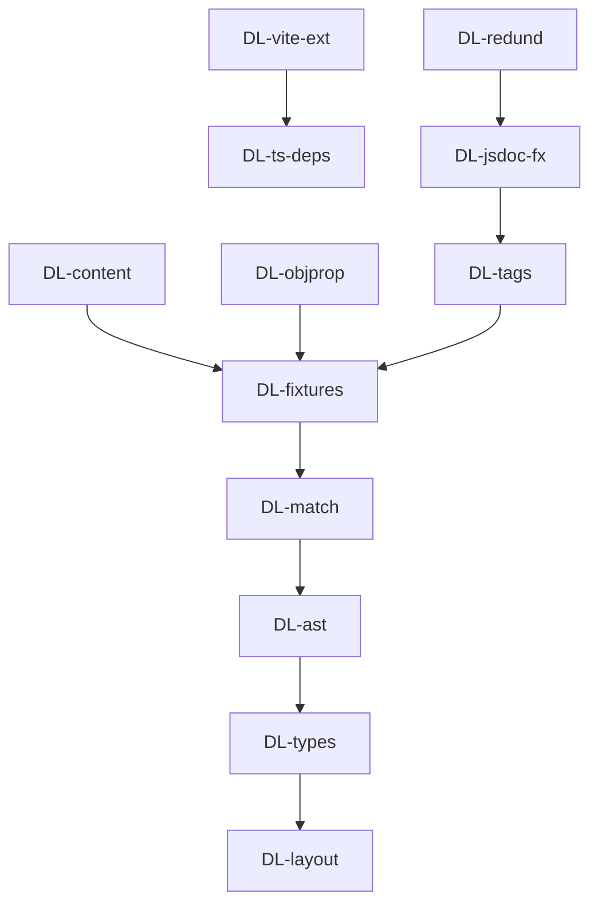

# dbc-linter — Tasks

## Tracker Index

| Task-ID     | Title                                                                                        | Dependencies | Status   | Reopens |
| ----------- | -------------------------------------------------------------------------------------------- | ------------ | -------- | ------- |
| DL-ts-deps  | Bootstrap: установить tree-sitter зависимости                                                | —            | [ ] TODO | —       |
| DL-vite-ext | Bootstrap: tree-sitter external в Vite                                                       | DL-ts-deps   | [ ] TODO | —       |
| DL-layout   | Bootstrap: создать структуру директорий dbc-linter                                           | —            | [ ] TODO | —       |
| DL-types    | Типы: Ports, Value Objects, константы                                                        | DL-layout    | [ ] TODO | —       |
| DL-ast      | DbcTsAstAdapter: tree-sitter парсинг TypeScript                                              | DL-types     | [ ] TODO | —       |
| DL-match    | DbcTsLinter + DbcContractMatchValidator + autofix                                            | DL-ast       | [ ] TODO | —       |
| DL-fixtures | Тесты: 88 fixture-кейсов полного покрытия                                                    | DL-match     | [ ] TODO | —       |
| DL-content  | DbcLinter: опция `content` для предварительно прочитанного файла                             | DL-fixtures  | [x] DONE | —       |
| DL-objprop  | Проверка контрактов для type alias (объектный литерал) и interface property (function-typed) | DL-fixtures  | [x] DONE | —       |
| DL-tags     | Fix \_reorderTags: `*/` closing boundary + edge cases                                        | DL-fixtures  | [x] DONE | —       |
| DL-jsdoc-fx | Autofix: normalize multi-line + expand inlining + always-run formatting                      | DL-tags      | [x] DONE | —       |
| DL-redund   | Реализовать `removeRedundantInImplements` в autofix-цепочке                                  | DL-jsdoc-fx  | [ ] TODO | —       |

## Slug Registry

<!-- один ID на строку; уникальность держится этим списком — одинаковый ID в двух ветках сталкивается здесь при merge. Только добавление. -->

- DL-ts-deps
- DL-vite-ext
- DL-layout
- DL-types
- DL-ast
- DL-match
- DL-fixtures
- DL-content
- DL-objprop
- DL-tags
- DL-jsdoc-fx
- DL-redund

## Intra-Module DAG

<!-- ребро A → B = «A зависит от B». Кросс-модульные рёбра живут уровнем выше. -->

## Decision Log (module-task level)

<!-- решения декомпозиции/планирования; локальные решения исполнения — в Decision Log самих тикетов. -->

## Conventions

Проектные конвенции объявлены в `specs/3-tasks.md` и наследуются — здесь не повторяются.
