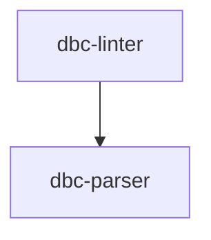

# Module: dbc-linter

## 1. Module Vision

Модуль линтинга: проверка покрытия кодовых сущностей DBC-контрактами, валидация контрактов через `dbc-parser`, сверка сигнатур контракта с реальным кодом, генерация ESLint-совместимого отчёта и autofix исправимых ошибок.

→ Parent scope: [../../dbc.spec.md](../../dbc.spec.md)

## 2. Entity Inventory (Closed-World)

_Это полный список сущностей модуля. Любое введение сущности execution-агентом помимо этого списка считается drift'ом и требует обновления spec._

| Name                        | Type         | Purpose                                                                                                                          |
| --------------------------- | ------------ | -------------------------------------------------------------------------------------------------------------------------------- |
| `DbcAstAdapter`             | Port         | Абстракция парсинга исходного файла: извлечение экспортируемых сущностей, их членов, сигнатур и ассоциированных JSDoc-контрактов |
| `DbcLinter`                 | Port         | Абстракция линтинга: проверка покрытия контрактами + валидация + сверка сигнатур + autofix                                       |
| `DbcTsAstAdapter`           | Adapter      | Реализация `DbcAstAdapter` для TypeScript через tree-sitter                                                                      |
| `DbcTsLinter`               | Adapter      | Реализация `DbcLinter` для TypeScript: pass 1–4                                                                                  |
| `DbcParseResult`            | Value Object | Результат `DbcAstAdapter.parseFile()`: discriminated union                                                                       |
| `DbcExportedEntity`         | Value Object | Экспортируемая сущность: имя, kind, члены, контракт, сигнатура                                                                   |
| `DbcMember`                 | Value Object | Член сущности: имя, kind, контракт, сигнатура                                                                                    |
| `DbcSignatureInfo`          | Value Object | Сигнатура: параметры + возвращаемый тип                                                                                          |
| `DbcParamInfo`              | Value Object | Параметр: имя, тип, optional, isRest                                                                                             |
| `DbcLintOptions`            | Value Object | Опции линтинга: `strategy?: 'full'`, `content?: string` (предварительно прочитанный контент)                                     |
| `DbcLintReport`             | Value Object | Результат `lint()`: ошибки + `format()`                                                                                          |
| `DbcLintFixReport`          | Value Object | Результат `lintAndFix()`: оставшиеся ошибки + `autoFixed` + `format()`                                                           |
| `DbcLintError`              | Value Object | Одна ошибка: file, line, col, severity, code, message                                                                            |
| `DbcLintIssueCode`          | Value Object | Union 8 констант кодов ошибок линтера                                                                                            |
| `ERR_DBC_LINT_*` ×8         | Constant     | Стабильные строковые коды ошибок линтера                                                                                         |
| `DbcContractMatchValidator` | Service      | Сервис сверки контракта с сигнатурой: проверка param-ов, returns, порядка, избыточных типов                                      |

## 3. Entity Surfaces

### `DbcAstAdapter`

- **Type:** Port
- **Purpose:** Абстракция парсинга исходного файла. Скрывает грамматику языка, движок парсинга и маппинг комментарий→узел.
- **Public Properties:** N/A
- **Public Operations:**
  - `parseFile(filePath: string, content?: string) → Promise<DbcParseResult>` — принять путь к файлу и опционально предварительно прочитанный контент. Если `content` передан — использовать его; иначе читать с диска
- **Lifecycle:** stateless; создаётся один раз, `parseFile` идемпотентен
- **Events Emitted:** N/A
- **Errors & Degradation:** Не кидает исключений. Файл не найден → `{ ok: false, error }`. Синтаксически битый → `{ ok: false, error }`.
- **Consumers:**
  - Internal: `DbcTsLinter`
  - External: N/A (v1)

### `DbcLinter`

- **Type:** Port
- **Purpose:** Абстракция линтинга: проверка покрытия кода контрактами, валидация, сверка сигнатур, отчёт, autofix.
- **Public Properties:** N/A
- **Public Operations:**
  - `lint(filePath: string, options?: DbcLintOptions) → Promise<DbcLintReport>` — проверить файл, вернуть отчёт
  - `lintAndFix(filePath: string, options?: DbcLintOptions) → Promise<DbcLintFixReport>` — проверить, autofix, вернуть остаток
- **Lifecycle:** stateless; constructor injection `(parser: DbcParser, astAdapter: DbcAstAdapter)`
- **Events Emitted:** N/A
- **Errors & Degradation:** Не кидает исключений. Все проблемы — в `errors`. Пустой/бинарный/без экспортов файл → пустой отчёт.
- **Consumers:**
  - Internal: CLI-команда `dbc lint`, `cli` scope (`lint-command`)
  - External: N/A

### `DbcTsAstAdapter`

- **Type:** Adapter
- **Purpose:** Реализация `DbcAstAdapter` для TypeScript через tree-sitter: обход AST, сбор export-сущностей, членов, сигнатур и JSDoc-контрактов. Извлекает члены из type alias с объектным литералом и различает function-typed interface property (→ interface-method).
- **Public Properties:** N/A
- **Public Operations:**
  - `parseFile(filePath: string, content?: string) → Promise<DbcParseResult>` — реализация контракта `DbcAstAdapter`. Если `content` передан — использовать его; иначе читать с диска через `readFileSync`
- **Lifecycle:** stateless; инициализирует tree-sitter с TS-грамматикой один раз
- **Events Emitted:** N/A
- **Errors & Degradation:** Синтаксически битый файл → `{ ok: false, error }`. Файл не найден → `{ ok: false, error }`.
- **Consumers:**
  - Internal: `DbcTsLinter`
  - External: N/A

### `DbcTsLinter`

- **Type:** Adapter
- **Purpose:** Реализация `DbcLinter` для TypeScript. Pass 1: сбор сущностей. Pass 2: проверка контрактов + сверка сигнатур. Pass 3: ESLint-отчёт. Pass 4: autofix.
- **Public Properties:** N/A
- **Public Operations:**
  - `lint(filePath, options?) → Promise<DbcLintReport>` — реализация `DbcLinter.lint()`
  - `lintAndFix(filePath, options?) → Promise<DbcLintFixReport>` — реализация `DbcLinter.lintAndFix()`
- **Lifecycle:** stateless; constructor injection: `new DbcTsLinter(parser: DbcParser, astAdapter: DbcAstAdapter)`
- **Events Emitted:** N/A
- **Errors & Degradation:** Не кидает исключений. Все ошибки — в отчёте.
- **Consumers:**
  - Internal: CLI-команда `dbc lint`, `cli` scope (`lint-command`)
  - External: N/A

### `DbcContractMatchValidator`

- **Type:** Service
- **Purpose:** Сверка контракта (`DbcEntrySchema[]`) с сигнатурой кода (`DbcSignatureInfo`). Определяет несоответствия по param-ам, returns, порядку, избыточным `{type}`.
- **Public Properties:** N/A
- **Public Operations:**
  - `validate(entries: DbcEntrySchema[], signature: DbcSignatureInfo, kind: string) → DbcLintError[]` — вернуть массив ошибок несоответствия (пустой если всё ок)
- **Lifecycle:** stateless; pure function, не зависит от внешнего состояния
- **Events Emitted:** N/A
- **Errors & Degradation:** Не кидает исключений. Неизвестный `kind` сущности → пустой массив ошибок.
- **Consumers:**
  - Internal: `DbcTsLinter` (pass 2)
  - External: N/A

### Value Objects

| Name                | Key Properties                                                                                                                    |
| ------------------- | --------------------------------------------------------------------------------------------------------------------------------- |
| `DbcParseResult`    | discriminated: `{ ok: true, exported: DbcExportedEntity[] }` \| `{ ok: false, error: string }`                                    |
| `DbcExportedEntity` | `name: string`, `kind: string`, `members: DbcMember[]`, `contract?: { text, startLine, startCol }`, `signature: DbcSignatureInfo` |
| `DbcMember`         | `name: string`, `kind: string`, `contract?: { text, startLine, startCol }`, `signature: DbcSignatureInfo`                         |
| `DbcSignatureInfo`  | `params: DbcParamInfo[]`, `returnType: string`                                                                                    |
| `DbcParamInfo`      | `name: string`, `type: string`, `optional: boolean`, `isRest: boolean`                                                            |
| `DbcLintOptions`    | `strategy?: 'full'`, `content?: string`                                                                                           |
| `DbcLintReport`     | `errors: DbcLintError[]`, `format(): string`                                                                                      |
| `DbcLintFixReport`  | `errors: DbcLintError[]`, `autoFixed: number`, `format(): string`                                                                 |
| `DbcLintError`      | `file: string`, `line: number`, `col: number`, `severity: 'error'`, `code: string`, `message: string`                             |
| `DbcLintIssueCode`  | Union: `typeof ERR_DBC_LINT_MISSING_CONTRACT \| ... \| typeof ERR_DBC_LINT_TYPE_REDUNDANT`                                        |

### Constants

```
ERR_DBC_LINT_MISSING_CONTRACT = 'ERR_DBC_LINT_MISSING_CONTRACT'
ERR_DBC_LINT_PARSE_FAILED     = 'ERR_DBC_LINT_PARSE_FAILED'
ERR_DBC_LINT_PARAM_MISSING    = 'ERR_DBC_LINT_PARAM_MISSING'
ERR_DBC_LINT_PARAM_EXTRA      = 'ERR_DBC_LINT_PARAM_EXTRA'
ERR_DBC_LINT_PARAM_ORDER      = 'ERR_DBC_LINT_PARAM_ORDER'
ERR_DBC_LINT_RETURNS_MISSING  = 'ERR_DBC_LINT_RETURNS_MISSING'
ERR_DBC_LINT_RETURNS_UNEXPECTED = 'ERR_DBC_LINT_RETURNS_UNEXPECTED'
ERR_DBC_LINT_TYPE_REDUNDANT   = 'ERR_DBC_LINT_TYPE_REDUNDANT'
```

## 4. Module Contracts (DbC)

### 4.1 Ports

#### Port: `DbcAstAdapter`

- **Purpose:** Абстракция парсинга исходного файла — сбор экспортируемых сущностей с сигнатурами и JSDoc-контрактами.
- **Consumers:**
  - Internal: `DbcTsLinter`
  - External: N/A
- **Supporting Artifacts:** `dbc-ast-adapter.types.ts`
- **Runtime Backing:** `real-runtime`
- **Verification Levels:** `contract`, `unit`
- **Deferred Runtime Scope:** None

**Contract (DbC):**

- Preconditions:
  - `filePath` — абсолютный или относительный путь к существующему файлу
  - `content` — опционально: предварительно прочитанный контент файла. Если передан — используется вместо чтения с диска
- Postconditions:
  - Файл существует и парсится → `{ ok: true, exported: DbcExportedEntity[] }`
  - Файл не найден или синтаксически невалиден → `{ ok: false, error: string }`
  - No throw
- Invariants:
  - `exported` содержит все экспортируемые сущности файла (без re-export)
  - Каждая сущность имеет `kind` из закрытого списка
  - `members` непуст только для class, interface, enum
  - Для сущности с JSDoc-контрактом `contract` содержит текст между `/**` и `*/`

#### Port: `DbcLinter`

- **Purpose:** Абстракция линтинга: проверка покрытия + валидация + сверка сигнатур + отчёт + autofix.
- **Consumers:**
  - Internal: CLI-команда `dbc lint`
  - External: N/A
- **Supporting Artifacts:** `dbc-linter.types.ts`
- **Runtime Backing:** `real-runtime`
- **Verification Levels:** `contract`, `unit`, `integration`
- **Deferred Runtime Scope:** Diff-стратегия, не-TS языки

**Contract (DbC):**

- Preconditions:
  - `parser: DbcParser` — валидный экземпляр парсера
  - `astAdapter: DbcAstAdapter` — валидный экземпляр адаптера
  - `filePath` — путь к существующему файлу (обязателен, используется в сообщениях об ошибках)
  - `options.content` — если передан, используется вместо чтения с диска
  - `options.strategy` ∈ `{'full'}`
- Postconditions:
  - `lint()` → `DbcLintReport` с `errors` (всегда массив, пустой при отсутствии ошибок)
  - `lintAndFix()` → `DbcLintFixReport`: файл мутирован, `autoFixed ≥ 0`, `errors` — только неисправимые
  - No throw
- Invariants:
  - Каждая ошибка имеет `severity: 'error'`
  - `format()` — ESLint-совместимый вывод
  - `autoFixed` = errors_before.length - errors_after.length
  - Порядок ошибок стабилен (сверху вниз по файлу)

### 4.2 Adapters

#### Adapter: `DbcTsAstAdapter`

- **Implements:** `DbcAstAdapter`
- **Purpose:** Парсинг TypeScript-файла через tree-sitter.
- **Supporting Artifacts:** `dbc-ts-ast-adapter.ts`
- **Runtime Backing:** `real-runtime`
- **Verification Levels:** `unit`, `integration`
- **Deferred Runtime Scope:** None

**Side Effects:**

- Инициализация tree-sitter с TS-грамматикой (one-time)
- Чтение файла с диска
- Логирование через `#logger`

#### Adapter: `DbcTsLinter`

- **Implements:** `DbcLinter`
- **Purpose:** Реализация линтера для TypeScript. Pass 1–4.
- **Supporting Artifacts:** `dbc-ts-linter.ts`
- **Runtime Backing:** `real-runtime`
- **Verification Levels:** `unit`, `integration`
- **Deferred Runtime Scope:** Diff-стратегия, не-TS языки

**Side Effects:**

- Чтение файла с диска только если `options.content` не передан
- Парсинг через `DbcAstAdapter`: если `content` передан — использовать его; иначе `DbcAstAdapter` читает файл сам
- Запись файла при autofix
- Логирование через `#logger`

**Autofix chain (приватные):**

1. `removeRedundantTypes(source) → string`
2. `removeExtraParams(source, signature) → string`
3. `removeUnexpectedReturns(source, signature) → string`
4. `reorderParams(source, signature) → string`
5. `reorderTags(source) → string`
6. `inlineIfSafe(source, parser) → string` — dry-run через `DbcParser.parse()`

### 4.3 Services

#### Service: `DbcContractMatchValidator`

- **Purpose:** Чистая функция сверки `DbcEntrySchema[]` с `DbcSignatureInfo`. Не имеет зависимостей, не делает I/O.
- **Consumers:**
  - Internal: `DbcTsLinter` (pass 2)
  - External: N/A
- **Runtime Backing:** `real-runtime`
- **Verification Levels:** `unit`, `contract`
- **Deferred Runtime Scope:** None

**Contract (DbC):**

- Preconditions:
  - `entries` — результат `DbcParser.parse()` (всегда массив)
  - `signature` — извлечён из AST
  - `kind` — валидный kind экспортируемой сущности
- Postconditions:
  - Возвращает `DbcLintError[]` (пустой если контракт соответствует сигнатуре)
  - Каждая ошибка содержит `code` из `DbcLintIssueCode`
- Invariants:
  - Не кидает исключений
  - Не мутирует входные данные
  - Ошибки возвращаются в порядке: `PARAM_MISSING` → `PARAM_EXTRA` → `PARAM_ORDER` → `RETURNS_MISSING` → `RETURNS_UNEXPECTED` → `TYPE_REDUNDANT`

## 5. Public Options & Policies

| Option             | Bound to                                     | Status        |
| ------------------ | -------------------------------------------- | ------------- |
| `strategy: 'full'` | `DbcLinter.lint()`, `DbcLinter.lintAndFix()` | active (v1)   |
| `content`          | `DbcLinter.lint()`, `DbcLinter.lintAndFix()` | active (v1)   |
| `strategy: 'diff'` | —                                            | deferred (v2) |

## 6. File Structure

```
services/dbc/linter/
├── dbc-linter.types.ts            # Port DbcLinter + VO + константы
├── dbc-ast-adapter.types.ts       # Port DbcAstAdapter + VO
└── implementations/
    └── ts/
        ├── dbc-ts-linter.ts       # Adapter DbcTsLinter + DbcContractMatchValidator
        ├── dbc-ts-ast-adapter.ts  # Adapter DbcTsAstAdapter
        └── __tests__/
            ├── dbc-ts-linter.test.ts
            └── fixtures/
                ├── happy/
                │   └── user.service.ts
                ├── errors/
                │   ├── missing-contract/
                │   ├── param-extra/
                │   ├── param-order/
                │   ├── returns-missing/
                │   ├── returns-unexpected/
                │   ├── type-redundant/
                │   ├── parse-failed/
                │   └── autofix-combined/
                └── edge/
                    ├── empty.ts
                    └── no-exports.ts
```

**File Mapping:**

- `dbc-linter.types.ts`: `DbcLinter`, `DbcLintReport`, `DbcLintFixReport`, `DbcLintError`, `DbcLintOptions`, `DbcLintIssueCode`, 8 × `ERR_DBC_LINT_*`
- `dbc-ast-adapter.types.ts`: `DbcAstAdapter`, `DbcParseResult`, `DbcExportedEntity`, `DbcMember`, `DbcSignatureInfo`, `DbcParamInfo`
- `dbc-ts-linter.ts`: `DbcTsLinter`, `DbcContractMatchValidator` + autofix chain (приватные)
- `dbc-ts-ast-adapter.ts`: `DbcTsAstAdapter` + tree-sitter инициализация
- `__tests__/dbc-ts-linter.test.ts`: тесты через fixture-файлы
- `__tests__/fixtures/`: по одному `.ts`-файлу на каждый тестовый случай

## 7. Module Decision Log

### D-014 — `DbcContractMatchValidator` как отдельный Service

- **Status:** active
- **Recorded:** session ModuleDecomposition, dbc, add-module dbc-linter
- **Why:** Сверка контракта с сигнатурой — чистая функция без зависимостей. Выделение в отдельный Service упрощает unit-тестирование (не нужно инстанцировать весь линтер).
- **Risk accepted:** —
- **Rejected alternatives:** Держать валидацию сигнатур внутри `DbcTsLinter` — смешивает pass 2 логику с чистой функцией, усложняет тестирование.

### D-016 — Проверка type alias (объектный литерал) и interface property (function-typed)

- **Status:** active
- **Recorded:** session Execution, dbc, TSK-19
- **Why:** `type SimpleLogger = { debug: (m: string) => void }` — методы внутри type alias не проверялись. `interface property` с function type не проверялась. Адаптер расширен: `_extractTypeAliasMembers` (извлечение членов из object_type), `_isFunctionTypedProperty` (классификация function-typed property как interface-method). `_extractSignature` обновлён для `function_type` узлов.
- **Risk accepted:** Только type alias с объектным литералом. Mapped types, intersection types, union types — не поддерживаются (v1).
- **Rejected alternatives:** Полный парсинг всех вариантов type alias — overengineered для v1.

## 8. Inter-Module Dependencies

- **Depends on:** [`dbc-parser`](../dbc-parser/dbc-parser.spec.md) — `DbcParser`, `DbcSchema`, `DbcEntrySchema`, `DbcDbcEntryIssue`, `DbcIssueCode`, константы `ERR_DBC_*`
- **Scope Reference (cross-scope):** None
- **Provides to:** N/A (других модулей в скоупе кроме dbc-parser нет); cross-scope: `cli` scope (`lint-command`)



## 9. Handoff to Task Scaffolding

- **Implementation files to be created:** все файлы новые:
  - `services/dbc/linter/dbc-linter.types.ts`
  - `services/dbc/linter/dbc-ast-adapter.types.ts`
  - `services/dbc/linter/implementations/ts/dbc-ts-linter.ts`
  - `services/dbc/linter/implementations/ts/dbc-ts-ast-adapter.ts`
- **Test files to be created:**
  - `services/dbc/linter/implementations/ts/__tests__/dbc-ts-linter.test.ts`
  - `services/dbc/linter/implementations/ts/__tests__/fixtures/` — 10+ fixture-файлов
- **Stack dependencies:**
  - Language: `TypeScript` (resolves to `ai/directives/coding/typescript-rules.xml`)
  - Test framework: `node:test` (resolves to `ai/directives/testing/node-test.xml`)
  - Runtime: `tree-sitter`, `tree-sitter-typescript`
- **Module Rules Additions:** None (scope-wide baseline достаточен)

- **Open risks & validation needs:**
  - `tree-sitter` + Vite: нативные биндинги должны быть помечены как external в `vite.config.ts`
  - Связь комментарий→узел через позицию — эвристика, требует fixture-покрытия включая случай «комментарий → export → узел»
  - `DbcContractMatchValidator` — отдельный Service, должен тестироваться независимо от `DbcTsLinter`

- **Обязательная матрица покрытия тестами (каждый пункт = fixture-файл):**

  **A. Happy path (контракты валидны, ошибок нет):**
  | # | Fixture | Что проверяется |
  |---|---------|-----------------|
  | A1 | `happy/const.ts` | `export const` с валидным контрактом |
  | A2 | `happy/function.ts` | `export function` с полным контрактом (@param + @returns) |
  | A3 | `happy/function-void.ts` | `export function` возвращает void, без @returns |
  | A4 | `happy/class.ts` | `export class` с контрактом, все члены (field, method, getter, setter, constructor) покрыты |
  | A5 | `happy/interface.ts` | `export interface` с контрактом, все члены (property, method) покрыты |
  | A6 | `happy/type.ts` | `export type` с контрактом |
  | A7 | `happy/enum.ts` | `export enum` с контрактом, все члены покрыты |
  | A8 | `happy/export-default.ts` | `export default function/class` с контрактом |
  | A9 | `happy/comment-before-export.ts` | Комментарий перед `export` (не перед сущностью) — должен найтись |
  | A10 | `happy/multi-export.ts` | Файл с несколькими экспортами, все покрыты |

  **B. ERR_DBC_LINT_MISSING_CONTRACT — сущность без контракта:**
  | # | Fixture | Что проверяется |
  |---|---------|-----------------|
  | B1 | `missing-contract/const.ts` | `export const` без контракта |
  | B2 | `missing-contract/function.ts` | `export function` без контракта |
  | B3 | `missing-contract/class.ts` | `export class` без контракта |
  | B4 | `missing-contract/interface.ts` | `export interface` без контракта |
  | B5 | `missing-contract/type.ts` | `export type` без контракта |
  | B6 | `missing-contract/enum.ts` | `export enum` без контракта |
  | B7 | `missing-contract/export-default.ts` | `export default` без контракта |
  | B8 | `missing-contract/member-field.ts` | class: поле без контракта |
  | B9 | `missing-contract/member-method.ts` | class: метод без контракта |
  | B10 | `missing-contract/member-getter.ts` | class: геттер без контракта |
  | B11 | `missing-contract/member-setter.ts` | class: сеттер без контракта |
  | B12 | `missing-contract/member-constructor.ts` | class: конструктор без контракта |
  | B13 | `missing-contract/member-interface-property.ts` | interface: свойство без контракта |
  | B14 | `missing-contract/member-interface-method.ts` | interface: метод без контракта |
  | B15 | `missing-contract/member-enum.ts` | enum: член без контракта |
  | B16 | `missing-contract/class-all-members.ts` | class: все члены без контрактов (5 ошибок) |

  **C. ERR_DBC_LINT_PARSE_FAILED — синтаксически битый файл:**
  | # | Fixture | Что проверяется |
  |---|---------|-----------------|
  | C1 | `parse-failed/syntax-error.ts` | Файл с синтаксической ошибкой (невалидный TS) |
  | C2 | `parse-failed/binary-or-empty.ts` | Пустой файл или бинарный контент |

  **D. ERR_DBC_LINT_PARAM_MISSING — параметр есть в сигнатуре, нет в контракте:**
  | # | Fixture | Что проверяется |
  |---|---------|-----------------|
  | D1 | `param-missing/function-single.ts` | Функция с 1 параметром, контракт без @param |
  | D2 | `param-missing/function-multiple.ts` | Функция с 3 параметрами, контракт с 1 @param (2 missing) |
  | D3 | `param-missing/function-all.ts` | Функция с параметрами, контракт без @param вообще |
  | D4 | `param-missing/method.ts` | Метод класса с параметрами, без @param |
  | D5 | `param-missing/constructor.ts` | Конструктор с параметрами, без @param |

  **E. ERR_DBC_LINT_PARAM_EXTRA — @param в контракте, нет в сигнатуре (autofix):**
  | # | Fixture | Что проверяется |
  |---|---------|-----------------|
  | E1 | `param-extra/single.ts` | Сигнатура без параметров, контракт с 1 лишним @param |
  | E2 | `param-extra/multiple.ts` | Сигнатура: 2 параметра, контракт: 4 @param (2 лишних) |
  | E3 | `param-extra/renamed.ts` | Сигнатура: `x`, контракт: @param y (по факту y — лишний) |
  | E4 | `param-extra/autofix.ts` | После autofix лишние @param удалены |

  **F. ERR_DBC_LINT_PARAM_ORDER — порядок @param не совпадает с сигнатурой (autofix):**
  | # | Fixture | Что проверяется |
  |---|---------|-----------------|
  | F1 | `param-order/reversed.ts` | Сигнатура: a, b, c. Контракт: @param c, @param b, @param a |
  | F2 | `param-order/partial.ts` | Порядок нарушен частично (2 из 3 не на месте) |
  | F3 | `param-order/autofix.ts` | После autofix порядок исправлен |

  **G. ERR_DBC_LINT_RETURNS_MISSING — не-void без @returns:**
  | # | Fixture | Что проверяется |
  |---|---------|-----------------|
  | G1 | `returns-missing/function.ts` | Функция возвращает string, контракт без @returns |
  | G2 | `returns-missing/method.ts` | Метод возвращает объект, контракт без @returns |
  | G3 | `returns-missing/getter.ts` | Геттер без @returns |

  **H. ERR_DBC_LINT_RETURNS_UNEXPECTED — @returns где не нужен (autofix):**
  | # | Fixture | Что проверяется |
  |---|---------|-----------------|
  | H1 | `returns-unexpected/function-void.ts` | void-функция с @returns |
  | H2 | `returns-unexpected/constructor.ts` | Конструктор с @returns |
  | H3 | `returns-unexpected/setter.ts` | Сеттер с @returns |
  | H4 | `returns-unexpected/field.ts` | Поле с @returns |
  | H5 | `returns-unexpected/const.ts` | const с @returns |
  | H6 | `returns-unexpected/autofix.ts` | После autofix @returns удалены |

  **I. ERR_DBC_LINT_TYPE_REDUNDANT — {type} в @param / @returns (autofix):**
  | # | Fixture | Что проверяется |
  |---|---------|-----------------|
  | I1 | `type-redundant/param.ts` | `@param {string} x` — {string} лишнее |
  | I2 | `type-redundant/returns.ts` | `@returns {User}` — {User} лишнее |
  | I3 | `type-redundant/multiple.ts` | Несколько @param с {type} |
  | I4 | `type-redundant/autofix.ts` | После autofix {type} удалены |

  **J. Ошибки парсера (транслируются из DbcParser):**
  | # | Fixture | Что проверяется |
  |---|---------|-----------------|
  | J1 | `parser-order.ts` | ERR_DBC_ORDER: теги не в каноническом порядке (autofix) |
  | J2 | `parser-purpose-conflict.ts` | ERR_DBC_PURPOSE_CONFLICT: @purpose + @see |
  | J3 | `parser-param-name-missing.ts` | ERR_DBC_PARAM_NAME_MISSING: @param без имени |
  | J4 | `parser-see-format-invalid.ts` | ERR_DBC_SEE_FORMAT_INVALID: @see без {specifier} |

  **K. Autofix — комбинированные случаи:**
  | # | Fixture | Что проверяется |
  |---|---------|-----------------|
  | K1 | `autofix-combined/all-fixable.ts` | Все autofix-абельные ошибки в одном файле → после autofix только неисправимые |
  | K2 | `autofix-combined/multi-line-to-inline.ts` | Multi-line контракт без конфликтов → сжат в inline |
  | K3 | `autofix-combined/multi-line-cannot-inline.ts` | Multi-line контракт с конфликтами → НЕ сжат (dry-run показал новые ошибки) |
  | K4 | `autofix-combined/order-tags.ts` | ERR_DBC_ORDER + ERR_DBC_LINT_PARAM_ORDER одновременно |

  **L. Edge cases:**
  | # | Fixture | Что проверяется |
  |---|---------|-----------------|
  | L1 | `edge/empty-file.ts` | Пустой файл → пустой отчёт, без ошибок |
  | L2 | `edge/no-exports.ts` | Файл с кодом, но без export → пустой отчёт |
  | L3 | `edge/re-export.ts` | `export { x } from './other'` → пропустить, не ошибка |
  | L4 | `edge/all-exports.ts` | `export * from './other'` → пропустить |
  | L5 | `edge/private-class.ts` | Класс с private полями/методами → все должны быть покрыты |
  | L6 | `edge/nested-class.ts` | Класс внутри класса — члены внешнего покрыты, внутренний класс — отдельная сущность |
  | L7 | `edge/decorators.ts` | Файл с декораторами — не должен падать |
  | L8 | `edge/optional-param.ts` | `x?: string` → @param [x] |
  | L9 | `edge/rest-param.ts` | `...args: string[]` → @param ...args |
  | L10 | `edge/comment-style.ts` | Комментарий с пробелами/звёздочками разного форматирования внутри /\*\* \*/ |

  **M. DbcContractMatchValidator (unit-тесты, без файлов):**
  | # | Тест | Что проверяется |
  |---|------|-----------------|
  | M1 | Все параметры совпадают | Пустой массив ошибок |
  | M2 | Параметр отсутствует | `ERR_DBC_LINT_PARAM_MISSING` |
  | M3 | Лишний @param | `ERR_DBC_LINT_PARAM_EXTRA` |
  | M4 | Порядок нарушен | `ERR_DBC_LINT_PARAM_ORDER` |
  | M5 | Не-void без @returns | `ERR_DBC_LINT_RETURNS_MISSING` |
  | M6 | Void с @returns | `ERR_DBC_LINT_RETURNS_UNEXPECTED` |
  | M7 | Конструктор с @returns | `ERR_DBC_LINT_RETURNS_UNEXPECTED` |
  | M8 | Геттер без @returns | `ERR_DBC_LINT_RETURNS_MISSING` |
  | M9 | Setter с @returns | `ERR_DBC_LINT_RETURNS_UNEXPECTED` |
  | M10 | Поле с @param | `ERR_DBC_LINT_PARAM_EXTRA` |
  | M11 | Поле с @returns | `ERR_DBC_LINT_RETURNS_UNEXPECTED` |
  | M12 | Const с @param | `ERR_DBC_LINT_PARAM_EXTRA` |
  | M13 | {type} в @param | `ERR_DBC_LINT_TYPE_REDUNDANT` |
  | M14 | {type} в @returns | `ERR_DBC_LINT_TYPE_REDUNDANT` |
  | M15 | Optional параметр: `x?` ↔ `@param [x]` | Нет ошибок |
  | M16 | Rest параметр: `...args` ↔ `@param ...args` | Нет ошибок |
  | M17 | Неизвестный kind сущности | Пустой массив ошибок (не падает) |

  **Итого: 10 happy + 16 missing-contract + 2 parse-failed + 5 param-missing + 4 param-extra + 3 param-order + 3 returns-missing + 6 returns-unexpected + 4 type-redundant + 4 parser-errors + 4 autofix-combined + 10 edge + 17 unit-validator = 88 тестовых случаев.**
