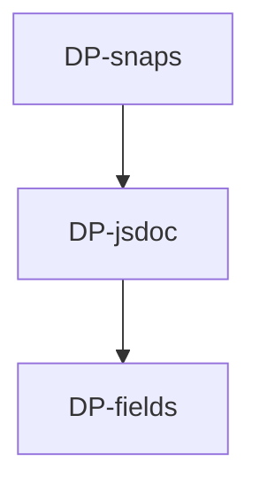

# dbc-parser — Tasks

## Tracker Index

| Task-ID   | Title                                                                         | Dependencies | Status   | Reopens |
| --------- | ----------------------------------------------------------------------------- | ------------ | -------- | ------- |
| DP-fields | Обновить типы: `DbcSchema.format` + `DbcEntrySchema.inline`                   | —            | [ ] TODO | —       |
| DP-jsdoc  | Обновить парсер: `@implements` + новый `CONTRACT_ORDER` + `format` + `inline` | DP-fields    | [ ] TODO | —       |
| DP-snaps  | Обновить тесты и snapshot-ы под новую схему                                   | DP-jsdoc     | [ ] TODO | —       |

## Slug Registry

<!-- один ID на строку; уникальность держится этим списком — одинаковый ID в двух ветках сталкивается здесь при merge. Только добавление. -->

- DP-fields
- DP-jsdoc
- DP-snaps

## Intra-Module DAG

<!-- ребро A → B = «A зависит от B». Кросс-модульные рёбра живут уровнем выше. -->

## Decision Log (module-task level)

<!-- решения декомпозиции/планирования; локальные решения исполнения — в Decision Log самих тикетов. -->

## Conventions

Проектные конвенции объявлены в `specs/3-tasks.md` и наследуются — здесь не повторяются.
