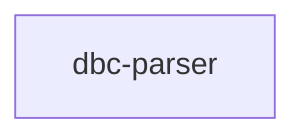

# Module: dbc-parser

## 1. Module Vision

Единый модуль, содержащий универсальный DBC-контракт парсинга и первую реализацию для JSDoc-подобного синтаксиса. Охватывает всё: типы, интерфейс `DbcParser`, issue-коды, валидацию и JSDoc-парсер.

→ Parent scope: [../../dbc.spec.md](../../dbc.spec.md)

## 2. Entity Inventory (Closed-World)

_Это полный список сущностей модуля. Любое введение сущности execution-агентом помимо этого списка считается drift'ом и требует обновления spec._

| Name                         | Type         | Purpose                                                                              |
| ---------------------------- | ------------ | ------------------------------------------------------------------------------------ |
| `DbcParser`                  | Port         | Универсальный контракт парсинга текстового DBC-блока в схему                         |
| `DbcJsDocParser`             | Adapter      | Реализация `DbcParser` для JSDoc-подобного синтаксиса                                |
| `DbcSchema`                  | Value Object | Корневой результат парсинга: entries + признак формата                               |
| `DbcSchemaFormat`            | Value Object | Признак формы контракта: `'single-line'` или `'multi-line'`                          |
| `DbcEntrySchema`             | Value Object | Одна распарсенная запись: type, specifier, dataType, optional, value, issues, inline |
| `DbcDbcEntryIssue`           | Value Object | Одна диагностическая проблема: code + line                                           |
| `DbcIssueCode`               | Value Object | Union стабильных issue-кодов                                                         |
| `ERR_DBC_PURPOSE_CONFLICT`   | Constant     | Код: `@purpose` и `@see` в одном контракте                                           |
| `ERR_DBC_ORDER`              | Constant     | Код: нарушен порядок тегов                                                           |
| `ERR_DBC_PARAM_NAME_MISSING` | Constant     | Код: `@param` без specifier                                                          |
| `ERR_DBC_SEE_FORMAT_INVALID` | Constant     | Код: `@see` без корректного `{specifier}`                                            |

## 3. Entity Surfaces

### `DbcParser`

- **Type:** Port
- **Purpose:** Универсальный контракт парсинга текстового DBC-блока в `DbcSchema`.
- **Public Properties:** N/A
- **Public Operations:**
  - `parse(inputContract: string) → DbcSchema` — принять сырой текст, вернуть нормализованную схему с диагностикой на уровне записей.
- **Lifecycle:** stateless; инстанцируется один раз; вызов `parse` идемпотентен.
- **Events Emitted:** N/A
- **Errors & Degradation:** Не кидает исключений. Любой вход (включая пустую строку и мусор) возвращает `DbcSchema` с `entries` (возможно пустым) и `format`.
- **Consumers:**
  - Internal: все модули, потребляющие DBC-схему (анализ, генерация, проверка, автодокументация, агентная обработка)
  - External: N/A

### `DbcJsDocParser`

- **Type:** Adapter
- **Purpose:** Реализация `DbcParser` для JSDoc-подобного синтаксиса. Построчный разбор + two-pass валидация.
- **Public Properties:** N/A
- **Public Operations:**
  - `parse(inputContract: string) → DbcSchema` — построчный разбор JSDoc-блока, нормализация строк, парсинг тегов, two-pass валидация.
- **Lifecycle:** stateless; один экземпляр на приложение.
- **Events Emitted:** N/A
- **Errors & Degradation:** Не кидает исключений. Невалидный вход → issues привязаны к конкретным записям. Данные не теряются при частичной невалидности.
- **Consumers:**
  - Internal: то же что и `DbcParser`
  - External: N/A

### `DbcSchema`

- **Type:** Value Object
- **Purpose:** Корневой результат парсинга. Содержит все распознанные записи и признак формата исходного контракта.
- **Public Properties:**
  - `entries: DbcEntrySchema[]` — распознанные записи
  - `format: DbcSchemaFormat` — `'single-line'` или `'multi-line'`
- **Public Operations:** N/A
- **Lifecycle:** Создаётся парсером, потребляется read-only.
- **Events Emitted:** N/A
- **Errors & Degradation:** N/A
- **Consumers:**
  - Internal: все потребители результата парсинга
  - External: N/A

### `DbcEntrySchema`

- **Type:** Value Object
- **Purpose:** Одна распарсенная запись контракта с полями, извлечёнными из тега, и локальной диагностикой.
- **Public Properties:**
  - `type: string` — тип тега без `@`
  - `specifier?: string` — идентификатор сущности
  - `dataType?: string` — тип данных из `{...}`
  - `optional?: boolean` — флаг опциональности для `[specifier]`
  - `value: string` — текстовое содержимое записи
  - `issues: DbcDbcEntryIssue[]` — диагностика (пустой массив если нет проблем)
  - `inline?: DbcEntrySchema[]` — вложенные теги из ` | @<name>` в single-line режиме
- **Invariant:** `issues` всегда массив (никогда `null` или отсутствует). `inline` только в single-line контрактах.
- **Consumers:** то же что и `DbcSchema`

### `DbcDbcEntryIssue`

- **Type:** Value Object
- **Purpose:** Одна диагностическая проблема, привязанная к конкретной записи.
- **Public Properties:**
  - `code: DbcIssueCode` — стабильный код ошибки
  - `line?: number` — номер строки в исходном тексте
- **Consumers:** диагностические утилиты, tooling

## 4. Module Contracts (DbC)

### 4.1 Ports

#### Port: `DbcParser`

- **Purpose:** Универсальный контракт парсинга текстового DBC-блока в схему.
- **Consumers:**
  - Internal: все модули, потребляющие DBC-схему
  - External: N/A
- **Supporting Artifacts:** `dbc-parser.types.ts`
- **Runtime Backing:** `real-runtime`
- **Verification Levels:** `contract`, `unit`
- **Deferred Runtime Scope:** None

**Contract (DbC):**

- Preconditions:
  - `inputContract` — любая строка (включая пустую, включая синтаксический мусор)
- Postconditions:
  - Возвращает `DbcSchema` с `entries` (всегда массив) и `format` (всегда определён)
  - No throw — парсер не выбрасывает исключений ни при каком входе
- Invariants:
  - `entries[*].issues` — всегда `DbcDbcEntryIssue[]` (пустой массив при отсутствии проблем)
  - Issue-коды стабильны (4 константы: `ERR_DBC_PURPOSE_CONFLICT`, `ERR_DBC_ORDER`, `ERR_DBC_PARAM_NAME_MISSING`, `ERR_DBC_SEE_FORMAT_INVALID`)
  - Частично невалидный контракт не теряет уже извлечённые данные

### 4.2 Adapters

#### Adapter: `DbcJsDocParser`

- **Implements:** `DbcParser`
- **Purpose:** Построчный разбор JSDoc-подобных контрактов в универсальную схему.
- **Supporting Artifacts:** `dbc-jsdoc-parser.ts`
- **Runtime Backing:** `real-runtime`
- **Verification Levels:** `unit`, `integration`
- **Deferred Runtime Scope:** None

**Side Effects:**

- Логирование через `#logger` (debug — состояние парсинга, error — неожиданные ситуации)
- Чистая функция: нет I/O, нет мутации внешнего состояния помимо логгера

## 5. Public Options & Policies

Нет публичных опций. Все решения зафиксированы в контракте `DbcParser.parse()`.

## 6. File Structure

```
services/dbc/parser/
├── dbc-parser.types.ts          # Port + Value Objects + Constants
└── implementations/
    └── jsdoc/
        ├── dbc-jsdoc-parser.ts  # Adapter: class DbcJsDocParser
        └── __tests__/
            ├── jsdoc-parser-syntax.test.ts
            ├── jsdoc-parser-fields.test.ts
            ├── jsdoc-parser-descriptions.test.ts
            ├── jsdoc-parser-validation.test.ts
            ├── jsdoc-parser-edge-cases.test.ts
            └── snapshots/       # snapshot-файлы
```

**File Mapping:**

- `dbc-parser.types.ts`: `DbcParser`, `DbcSchema`, `DbcSchemaFormat`, `DbcEntrySchema`, `DbcDbcEntryIssue`, `DbcIssueCode`, `ERR_DBC_PURPOSE_CONFLICT`, `ERR_DBC_ORDER`, `ERR_DBC_PARAM_NAME_MISSING`, `ERR_DBC_SEE_FORMAT_INVALID`
- `implementations/jsdoc/dbc-jsdoc-parser.ts`: `DbcJsDocParser` + protected helpers (`normalizeLine`, `parseTagLine`, `parseParamTag`, `parseSeeTag`, `parseImplementsTag`, `parseTagWithOptionalDataType`, `validatePurposeConflict`, `validateContractOrder`, `validateParamSpecifier`, `validateSeeSpecifier`, `attachIssue`)
- `__tests__/`: 5 групп тестов + `snapshots/`

## 7. Module Decision Log

Нет module-level решений — все решения на уровне scope spec (§6 Decision Log).

## 8. Inter-Module Dependencies

- **Depends on:** None (других модулей в скоупе нет — flat-модуль)
- **Scope Reference (cross-scope):** None
- **Provides to:** N/A (других модулей в скоупе нет)



## 9. Handoff to Task Scaffolding

- **Implementation files to be created:** все файлы уже существуют — требуется обновление:
  - `services/dbc/parser/dbc-parser.types.ts` — добавить `DbcSchemaFormat`, `format` в `DbcSchema`, `inline` в `DbcEntrySchema`
  - `services/dbc/parser/implementations/jsdoc/dbc-jsdoc-parser.ts` — добавить `@implements`, обновить `CONTRACT_ORDER`, `format` detection, `inline` parsing
- **Test files to be created:** все 5 тестовых файлов уже существуют — требуется обновление snapshot-ов
- **Stack dependencies:**
  - Language: `TypeScript` (resolves to `ai/directives/coding/typescript-rules.xml`)
  - Test framework: `node:test` (resolves to `ai/directives/testing/node-test.xml`)
- **Module Rules Additions:** None (scope-wide baseline достаточен)

- **Open risks & validation needs:**
  - Реализация должна быть выровнена с обновлёнными типами (`format`, `inline`, `@implements`, новый `CONTRACT_ORDER`)
  - Snapshot-тесты должны быть обновлены под новую схему
  - Malformed `{datatype` (незакрытая скобка) — поведение не зафиксировано, открытый вопрос
