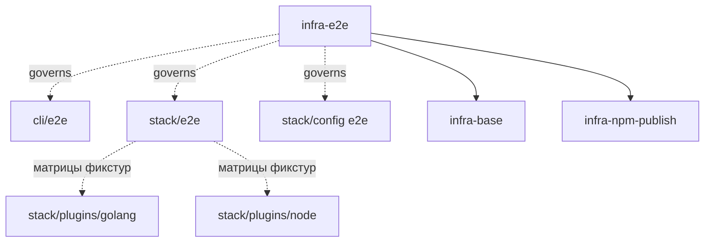

# infra-e2e: Infrastructure Specification

## scope-type

infrastructure

## 1. Vision

Единая доктрина E2E-тестирования проекта: **чему мы верим, чем проверяем и что обязано гоняться автоматически**. Стек-специфика и поверхностная специфика живут в модулях-наборах; здесь — общая база, которую они обязаны соблюдать, и решения уровня проекта (CI/CD, политика скипов, покрытие флагов).

Причина существования: E2E-наборов в проекте больше одного, и они проверяют **разные поверхности** — CLI (bin, упаковка, exit-коды), вердикты гейтов (классификация на настоящих тулчейнах), семантику конфига (deep-merge, discovery, валидация). Без общего уровня каждый набор заводит свои соглашения — свой способ установки, свою политику скипов, свою трактовку «зелёного» — а CI не появляется ни у одного, потому что это решение никому конкретно не принадлежит. Наборы принадлежат разным мейнтейнерам; **доктрина не должна форкаться вместе с ними**.

## 2. Definitions

| Term                | Definition                                                                                                                                                    |
| ------------------- | ------------------------------------------------------------------------------------------------------------------------------------------------------------- |
| **E2E-набор**       | Модуль-владелец группы E2E-тестов одной поверхности: `cli/e2e`, `stack/e2e`, `stack/config` (§4). Имеет мейнтейнера, свою npm-команду и свой временный корень |
| **Поверхность**     | То, что набор проверяет как чёрный ящик: CLI-команды, вердикты гейтов, поведение конфига                                                                      |
| **Артефакт**        | `.tgz`, собранный `npm run build:publish` + `npm pack` — то же, что получает пользователь из реестра                                                          |
| **Фикстура**        | Эталонный проект с намеренно посаженным дефектом (или намеренно чистый) плюс декларация ожидаемого результата                                                 |
| **STRICT-режим**    | Прогон, в котором отсутствие внешнего тулчейна — отказ, а не скип. Включается `<SUITE>_STRICT=1`; обязателен в CI и `prepublishOnly`                          |
| **Полный сценарий** | Прогон без сужающих флагов (`verify` целиком) — главный пользовательский путь; обязателен в каждом наборе (§7)                                                |

## 3. Values (обязательны для всех наборов)

1. **Чёрный ящик через артефакт.** Набор запускает установленный из `.tgz` пакет, а не исходники: проверяется то, что получит пользователь, включая `package.json#bin` и `#files`. Артефакт собирается **`npm run build:publish`**, а не `npm run build` — `prepublishOnly` не срабатывает на `npm pack`, и без этого в пакет уедет `dist/` без типов и без `dist/ai/**` (D-IE2E-002).
2. **Утверждения на машинном выводе.** Где команда умеет `--json`, набор утверждает поля JSON, а не человеческий текст. Человеческий текст проверяется адресно — там, где сам текст является контрактом (инструкция агенту «не правь код», указание на fixer).
3. **Тест — это данные.** Добавление регрессии стоит одну директорию с декларацией ожидания, а не новый код. Декларация обязана нести поле «что защищает».
4. **Тихих скипов не бывает.** Скип печатается с причиной, попадает в итоговую сводку и превращается в отказ в STRICT-режиме (§5).
5. **Герметичность.** Сеть выключена, внешние зависимости фикстур — нулевые, `HOME` подменён (иначе личные `~/.gennadyrc` и `~/.npmrc` меняют результат), реестр задаётся явно.
6. **Ноль мутаций отслеживаемых файлов.** Набор не меняет ни одного tracked-файла репозитория; собственные артефакты (`dist/**`, `*.tgz`) — gitignored и убираются в `finally` с проверкой пустого `git status --porcelain`.

## 4. Suite Registry

| Набор                                            | Поверхность                                                              | npm-команда       | Тулчейны          | STRICT-переменная   |
| ------------------------------------------------ | ------------------------------------------------------------------------ | ----------------- | ----------------- | ------------------- |
| [`cli/e2e`](../cli/e2e/e2e.spec.md)              | Поверхность CLI: bin, упаковка, stdout/exit-коды команд                  | `test:cli-e2e`    | npm, npx, git     | — (см. ниже)        |
| [`stack/e2e`](../stack/e2e/e2e.spec.md)          | Вердикты гейтов на настоящих тулчейнах (механизм фикстур и ожиданий)     | `test:stack-e2e`  | git + по фикстуре | `STACK_E2E_STRICT`  |
| [`stack/config`](../stack/config/config.spec.md) | Семантика конфига: discovery, deep-merge, провенанс, фатальная валидация | `test:config-e2e` | git               | `CONFIG_E2E_STRICT` |

Матрицы фикстур **не живут здесь**: они принадлежат владельцам поверхностей — по стекам это спеки плагинов ([`golang`](../stack/plugins/golang/golang.spec.md), [`node`](../stack/plugins/node/node.spec.md)), по конфигу — `config.spec.md`. Новый набор добавляется строкой в эту таблицу и обязан удовлетворять §3, §5, §7.

## 5. Skip & Strictness Policy

- Внешний тулчейн отсутствует → фикстура **скипается**, причина печатается, id попадает в итоговую сводку. Локальная разработка без `golangci-lint` или `go` обязана оставаться возможной.
- `<SUITE>_STRICT=1` → тот же случай становится **отказом** с текстом `TOOLCHAIN_MISSING: <id>` и инструкцией по установке.
- STRICT обязателен: в CI (§6) и в `prepublishOnly`. Публикация пакета, часть проверок которого молча не исполнялась, недопустима.
- `git` — не опциональный тулчейн ни для одного набора: без него не работает реплика прогона (stack.spec D-STACK-013) и не создаются фикстуры-репозитории. Его отсутствие — отказ всегда, независимо от STRICT.
- Наблюдаемое предупреждение: сегодняшний `npm run test:cli-e2e` печатает 18 прошедших из 45 — ровно та тишина, против которой введена политика.

## 6. CI/CD Strategy

Решение уровня проекта: **CI обязателен**, иначе E2E-наборы устаревают за недели, а STRICT-режим не исполняется никогда, кроме дня публикации. Реализация — [`.github/workflows/ci.yml`](../../.github/workflows/ci.yml); **источник истины — сам файл**, здесь фиксируются требования к нему, чтобы альтернативная реализация (GitLab CI, self-hosted) была проверяема.

| Джоба        | Что делает                                                        | Внешнее           |
| ------------ | ----------------------------------------------------------------- | ----------------- |
| `lint`       | `format:check` + `type-check` + DbC-линтер **в check-only форме** | node              |
| `unit`       | `npm test`                                                        | node              |
| `cli-e2e`    | `test:cli-e2e` — поверхность CLI через установленный tgz          | node + **реестр** |
| `config-e2e` | `test:config-e2e` со `CONFIG_E2E_STRICT=1`                        | node, git         |
| `stack-e2e`  | `test:stack-e2e` со `STACK_E2E_STRICT=1`                          | node, git, **go** |
| `dogfood`    | `gennady verify --all` — инструмент проверяет сам себя            | node, git         |

**Обязательные свойства любой реализации:**

1. **Только не-мутирующие команды.** `npm run lint` и `lint:contracts` переписывают дерево (`prettier --write`, `gennady lint --autofix`) — их зелёный прогон ничего не доказывает. В CI идут `format:check`, `type-check` и линтер контрактов **без** `--autofix`.
2. **STRICT там, где набор зависит от внешних тулчейнов** (§5). Без него набор, у которого не оказалось тулчейна, сообщит success.
3. **Пиннутые версии тулчейнов.** Плавающая версия делает изменение поведения инструмента неотличимым от регрессии в ожидаемом вердикте фикстуры.
4. **Наборы — отдельные джобы.** `config-e2e` нужен только git, поэтому он не должен ждать установки Go: это следствие «один артефакт на набор» (D-IE2E-003).
5. **`fetch-depth: 0` для `dogfood`.** `verify` строит реплику от git-истории, поэтому shallow-клона недостаточно.
6. **`concurrency.cancel-in-progress`** — прогоны длинные, очередь дешевле отменять.
7. **`workflow_dispatch`** — ручной перезапуск без пустого коммита: прогон, упавший на внешней причине (сбой реестра), не должен требовать правки истории.

**Включение в новом репозитории.** Наличие файла workflow **не** включает Actions: в `Settings → Actions → General` нужны «Allow all actions» и политика для PR из форков («Require approval for first-time contributors» — разумный дефолт). Включение **не создаёт прогоны для уже открытых PR** — нужен новый push, либо close/reopen PR, либо `workflow_dispatch` после мержа в дефолтную ветку. `permissions: contents: read` достаточно: джобам не нужен write-токен.

**Чего в CI сознательно нет:**

- **`golangci-lint`** — ни одна фикстура его не требует (`requires` фикстур — источник probe-листа, §5). Появится фикстура — STRICT уронит `stack-e2e` с явным `TOOLCHAIN_MISSING`, и тулчейн добавляется тогда же. Спекулятивная установка тулчейна, который никто не просит, только удлиняет прогон.
- **`docker`** — по той же причине; `requires`-предусловия проверяются фикстурами без поднятия контейнеров.

**Измеренная стоимость (локально, полный тулчейн).** `stack-e2e` — ~36s wall на оба стековых набора. Общий `GOCACHE` (`STACK_E2E_GOCACHE`, кэшируется `actions/cache`) снижает CPU 38s → 26s, но **wall-clock почти не меняет**: время доминирует per-suite сборка артефакта (`build:publish` + `pack` + install), а не компиляция Go. Кэш оставлен как дешёвый (67MB), но ускорения от него ждать не следует.

**Известное ограничение `cli-e2e`.** Его setup ставит tgz из публичного реестра и **не имеет offline-пути**: за корпоративным прокси, который отдаёт `403` на публичные зависимости (`ink`), джоба и локальный `prepublishOnly` не проходят. Стековые наборы это уже обходят (реестр параметризован + `--offline`-ретрай по прогретому кэшу); перенести тот же приём в `cli/e2e` — отдельная правка в его scope, зафиксирована в Handoff.

`prepublishOnly` остаётся вторым барьером и **не заменяется** CI: он ловит публикацию с локальной машины.

## 7. Flag & Scenario Coverage

Скорость набора — не цель, а ограничение. Целевая функция — покрытие пользовательских сценариев.

1. **Полный прогон обязателен.** В каждом наборе есть минимум одна фикстура, запускающая команду **без сужающих флагов** — это главный пользовательский путь. Сужение через `--only` допустимо для фикстур, проверяющих один вердикт, но не может быть единственной формой прогона (правка D-SE2E-006 по ревью).
2. **Каждый флаг покрыт.** Любой флаг команды `verify`/`fix` обязан появляться минимум в одной фикстуре какого-либо набора; таблица соответствия «флаг → набор/фикстура» ведётся в спеке владельца поверхности и проверяется при добавлении флага.
3. **Комбинации, а не только одиночки.** Обязательны сочетания, меняющие смысл друг друга: `--only` + `skipGates` (снятие конфигового скипа), `--skip` + `--only` (кто побеждает), `--all` + `--root=<subdir>`, `--json` + `--full-output`, `--plan` + `--json` (план не исполняет гейтов).
4. **Новый флаг = новая фикстура** в том же коммите. Флаг без E2E-покрытия — незакрытая задача, а не «мелочь».

## 8. Decision Log

### D-IE2E-001 — Доктрина E2E — уровень проекта, наборы — уровень поверхности

- **Status:** active
- **Recorded:** review PR #5 — «CI/CD strategy is a project level decision, not stack- or cli- level»
- **Why:** Наборы принадлежат разным мейнтейнерам и живут в разных scope'ах; общие решения (артефакт, политика скипов, CI, покрытие флагов) при этом обязаны быть одни. Без выделенного уровня они либо дублируются с расхождениями, либо не принимаются вовсе — что и произошло: CI в проекте отсутствует, а `cli/e2e` и `stack/e2e` независимо изобретали установку артефакта.
- **Rejected alternatives:** держать общее в `infra-base` (он про инструменты сборки, а не про стратегию тестирования; его §2.1 — единственное пересечение и остаётся там); дублировать решения в каждом наборе (расхождение — вопрос времени).

### D-IE2E-002 — Артефакт собирается `build:publish`, не `build`

- **Status:** active
- **Recorded:** гайд мейнтейнера по локальной проверке пакета (PR #5)
- **Why:** `prepublishOnly` срабатывает только на `npm publish`; при `npm pack` он не запускается. `npm run build` не делает ни `build:types`, ни копирования `ai/**` → `dist/ai/**` (`scripts/prepare-publish-artifacts.ts`), поэтому его `.tgz` — подмножество публикуемого, и набор проверяет не то, что получит пользователь. Сегодняшний `cli/__tests__/e2e/setup.ts` запускает именно `npm run build`, а комментарий региона и D-015 утверждают «идентичен публикуемому» — неточность, подлежащая исправлению вместе с внедрением этой спеки.
- **Risk accepted:** `build:publish` дороже; плата за проверку публикуемого артефакта.

### D-IE2E-003 — Один артефакт на набор, а не один на проект

- **Status:** active
- **Recorded:** review PR #5 — «Let's make 1 `.tgz` per stack … different stacks will have different maintainers»
- **Why:** Общий `before` с единственной установкой делает наборы связанными: падение setup одного набора роняет чужие, а правка общего шага требует согласования между мейнтейнерами. Каждый набор собирает и ставит свой артефакт в свой временный корень — наборы становятся независимо запускаемыми и независимо владеемыми. Для стеков это означает установку на стек, а не на проект.
- **Risk accepted:** установка (~5s) умножается на число наборов. Приемлемо: наборы гоняются параллельными джобами CI, а локально мейнтейнер запускает свой набор.
- **Rejected alternatives:** общий кэш `.tgz` по контрольной сумме (возвращает связанность через общий мутируемый путь — ровно то, от чего уходим).

### D-IE2E-004 — Покрытие важнее скорости; полный прогон обязателен

- **Status:** active
- **Recorded:** review PR #5 — «Full verify run is a main user scenario, it must not be ignored»
- **Why:** Сужение каждой фикстуры до одного гейта (`--only`) даёт быстрый набор, который не проверяет главный путь: пользователь запускает `verify` целиком, и взаимодействие гейтов внутри плана (порядок, реплика прогона, накопление отказов, RUN-ALL) видно только на полном прогоне. §7 фиксирует минимум: полный прогон, покрытие каждого флага, обязательные комбинации.

## 9. Inter-Scope Dependencies

- **Depends on:** [`infra-base`](../infra-base/infra-base.spec.md) — `node:test`, vite, prettier/tsc, исключение фикстур (§2.1); [`infra-npm-publish`](../infra-npm-publish/infra-npm-publish.spec.md) — `build:publish`, состав пакета
- **Governs:** [`cli/e2e`](../cli/e2e/e2e.spec.md), [`stack/e2e`](../stack/e2e/e2e.spec.md), E2E-часть [`stack/config`](../stack/config/config.spec.md)
- **External:** Node.js 22+ (`npm`, `npx`), `git`; по наборам — `go`, `golangci-lint`

## 10. Handoff to Task Scaffolding

- **Files created:** `.github/workflows/ci.yml` (§6) — шесть джоб, все команды не-мутирующие
- **Structural changes:**
  - `package.json`: переименование `test:e2e` → `test:cli-e2e` (единая стратегия `test:<suite>-e2e`), новые `test:stack-e2e` и `test:config-e2e`; STRICT-переменные в `prepublishOnly`
  - `infra-base` §2.1: расширить обязательный паттерн исключения фикстур на `**/__tests__/e2e/fixtures/**` — текущий `**/__tests__/fixtures/**` его не матчит (проверено), а фикстуры намеренно содержат невалидный YAML/JSON
  - `cli/__tests__/e2e/setup.ts` + `cli/e2e` D-015: (а) привести к D-IE2E-002 (`build:publish`) и убрать неверное утверждение об идентичности артефакта; (б) параметризовать реестр и добавить `--offline`-ретрай, иначе за корпоративным прокси не работают ни джоба `cli-e2e`, ни `prepublishOnly`; (в) у `cli/e2e` нет тулчейн-зависимых скипов, поэтому STRICT-переменной у него нет — единственный гейт `GENNADY_E2E=1`
  - `specs/README.md`: зарегистрировать scope `infra-e2e` в графе и таблице
- **Open risks:**
  - CI в репозитории отсутствует; внедрение workflow — решение мейнтейнера. Спека фиксирует требуемые свойства, чтобы любая альтернативная реализация (GitLab CI, self-hosted) была проверяема
  - `stack-e2e` — самая долгая джоба; без кэша `GOCACHE` она доминирует по времени прогона
  - политика «каждый флаг покрыт» требует дисциплины при добавлении флагов; смягчается пунктом §7.4 (флаг и фикстура в одном коммите)
