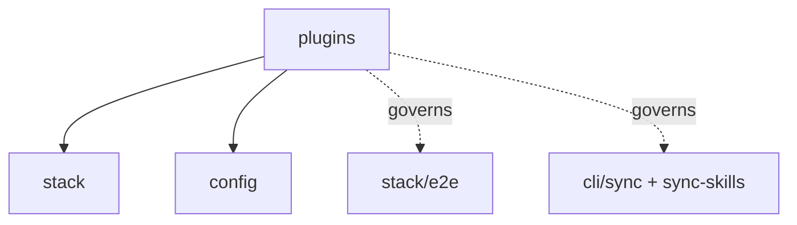

# plugins: Infrastructure Specification

## scope-type

infrastructure

## 1. Vision

**Плагин — это один каталог.** Всё, что принадлежит стеку — реализация, спека, директивы, скиллы, юнит-тесты, E2E-фикстуры — лежит в `plugins/<id>/` и больше нигде. Основной репозиторий не хранит ни одного файла, принадлежащего плагину, и узнаёт о плагинах только через **резолвер**.

Проблема, которую это решает: сегодня `golang` живёт в шести деревьях (`services/stack/plugins/golang/`, `specs/stack/plugins/golang/`, `ai/directives/infra/`, `ai/skills/`, `__tests__/e2e/fixtures/golang/`, плюс точка входа E2E-набора). Добавить стек — значит тронуть шесть мест и не забыть ни одного; вынести стек наружу — значит собрать его по репозиторию вручную. Это же блокирует [D-STACK-001](../stack/stack.spec.md) (внешние плагины отложены «без дизайна»): «плагин — это каталог с манифестом» и **есть** тот отсутствующий дизайн.

**Критерий приёмки — submodule-тест.** Заменяем `plugins/golang/` на git-submodule и спрашиваем:

1. Изменилось ли что-нибудь для основного репозитория? — **Нет.**
2. Самодостаточен ли плагин? — **Да.**

Оба ответа обязаны сохраняться после любой правки. Тест не риторический: он проверяется механически (§6).

**Почему `plugins/` в корне, а не `services/stack/plugins/`.** Каталог не является частью сервиса `stack`: он — точка подключения, к которой сервис обращается через резолвер. Корневое размещение делает submodule-границу очевидной и не заставляет внешний плагин жить внутри чужого сервисного дерева. Имя содержит тип (`stack-`), потому что типы плагинов будут и другие; сам тип дублируется в манифесте полем `kind`, чтобы резолвер оставался общим, когда появится второй каталог.

## 2. Definitions

| Term                | Definition                                                                                                                                      |
| ------------------- | ----------------------------------------------------------------------------------------------------------------------------------------------- |
| **Plugin dir**      | `plugins/<id>/` — единственное место хранения файлов плагина `<id>`                                                                             |
| **Manifest**        | `plugins/<id>/plugin.json` — объявление того, что плагин предоставляет; единственный обязательный файл кроме точки входа                        |
| **Surface**         | Вид файлов, который потребляет какая-то команда: реализация, спека, директивы, скиллы, юнит-тесты, E2E-фикстуры                                 |
| **Resolver**        | Единственный модуль, перечисляющий плагины и отдающий абсолютные пути их surface'ов. Потребители не знают о раскладке каталога                  |
| **Lookup**          | Механизм доступа: потребитель спрашивает резолвер и обходит «репозиторий + каждый плагин». Противоположность — symlink'и, отвергнуты (D-SP-001) |
| **Built-in plugin** | Плагин, живущий в `plugins/` этого репозитория и попадающий в npm-пакет                                                                         |
| **External plugin** | Тот же каталог, подключённый submodule'ом или путём из конфига; та же схема, тот же резолвер (D-SP-005)                                         |
| **Locality**        | Свойство «ни один файл плагина не лежит вне его каталога», проверяемое тестом (§6)                                                              |

## 3. Plugin Directory Layout

```
plugins/golang/
├── plugin.json              # манифест (§4)
├── plugin.ts                # экспорт StackPlugin — точка входа
├── golang-detect.logic.ts   # реализация, свободная раскладка
├── golang-scope.logic.ts
├── golang-plan.logic.ts
├── __tests__/               # юнит-тесты плагина
│   └── golang-plan.test.ts
├── specs/                   # спеки плагина; раскладка как у specs/ в репозитории
│   ├── golang.spec.md       #   root-спека: <id>.spec.md по конвенции
│   └── codegen/             #   спека фичи плагина, если она нужна
│       └── codegen.spec.md
├── directives/
│   └── golang-setup.xml     # была ai/directives/infra/
├── skills/
│   └── sdd-infra-golang/SKILL.md   # была ai/skills/
└── e2e/
    └── fixtures/<fixture>/expect.yaml   # были __tests__/e2e/fixtures/golang/
```

Внутренняя раскладка за пределами манифеста — дело плагина: резолвер читает только то, что объявлено.

## 4. Manifest

Манифест — **декларация surface'ов**: единственный ответ на вопрос «что этот каталог предоставляет и по каким путям». Это не package.json плагина, не описание зависимостей и не список возможностей: возможности (`verify`, `fix`, …) живут в объекте `StackPlugin` и дублировать их в манифесте нельзя — иначе появляется второй источник истины, который разойдётся с кодом.

### 4.1 Golden example

`plugins/golang/plugin.json` — все поля, включая те, что равны дефолтам:

```jsonc
{
  // Идентичность. `id` ОБЯЗАН совпадать с именем каталога; `kind` — единственное место,
  // где живёт тип плагина (D-SP-002), и по нему фильтрует резолвер.
  "id": "golang",
  "kind": "stack",

  // Код: модуль, экспортирующий StackPlugin. Резолвер отдаёт путь, импортирует потребитель.
  "entry": "plugin.ts",

  // Документация: КАТАЛОГ спек. Root-спека внутри — `<id>.spec.md`; рядом с ней
  // живут спеки фич плагина, как scope и его модули в specs/.
  "specs": "specs",

  // Материал для агентов: `sync` и `sync-skills` раскладывают это в репозиторий пользователя
  // наравне с репозиторными ai/directives/** и ai/skills/**.
  "directives": "directives",
  "skills": "skills",

  // Тесты, которыми владеет плагин: корень фикстур для набора stack/e2e.
  "e2eFixtures": "e2e/fixtures",
}
```

Минимальный валидный манифест — плагин без директив, скиллов и E2E-фикстур:

```json
{ "id": "rust", "kind": "stack" }
```

Он означает: код в `plugin.ts`, спеки в `specs/` с root-спекой `specs/rust.spec.md` (конвенциональные дефолты), остальных surface'ов нет.

### 4.2 Правила

| Поле          | Обяз. | Дефолт         | Смысл                                                    |
| ------------- | ----- | -------------- | -------------------------------------------------------- |
| `id`          | да    | —              | Идентификатор; **обязан** совпадать с именем каталога    |
| `kind`        | да    | —              | Тип плагина; резолвер фильтрует по нему (D-SP-002)       |
| `entry`       | нет   | `plugin.ts`    | Модуль с реализацией                                     |
| `specs`       | нет   | `specs`        | Каталог спек; root-спека — `<specs>/<id>.spec.md` (§4.3) |
| `directives`  | нет   | `directives`   | Каталог `*.xml` для `gennady sync`                       |
| `skills`      | нет   | `skills`       | Каталог `<name>/SKILL.md` для `gennady sync-skills`      |
| `e2eFixtures` | нет   | `e2e/fixtures` | Корень фикстур набора                                    |

- **Замкнутая схема**: неизвестный ключ — фатальная ошибка с did-you-mean, как в конфиге (config.spec §4.1). Не версионируется (D-CFG-005).
- **Объявленный, но отсутствующий путь — фатальная ошибка. Необъявленный surface просто отсутствует.** Это разница между «опечатался в имени каталога» и «у плагина нет скиллов»: первое обязано падать, второе — норма. Поэтому дефолт применяется только когда ключ **опущен**, и отсутствие каталога `specs/` у минимального плагина ошибкой не является.
- **`id` дублирует имя каталога намеренно**: имя каталога видит человек, `id` видит код, и расхождение даёт плагин, который «есть, но зовётся иначе». Проверка равенства — первая, что делает резолвер.
- **Манифест обязателен**, даже когда состоит из двух полей: явное перечисление дешевле и предсказуемее угадывания конвенций по glob'ам, а ошибка диагностируется до запуска чего-либо.

### 4.3 Каталог спек и root-спека

Спек у плагина может быть несколько: контракт плагина целиком плюс спеки отдельных фич (кодогенерация, скоупинг, будущие фасеты). Поэтому `specs` — **каталог**, и его раскладка повторяет раскладку `specs/` основного репозитория: root-спека рядом, спеки фич — в подкаталогах.

- **Root-спека определяется конвенцией `<specs>/<id>.spec.md`** — так же, как scope-спека зовётся по имени scope, а модульная по имени модуля. Отдельного поля в манифесте нет: имя выводится из `id`, который и так обязан совпадать с именем каталога, поэтому третьего места для одного факта не появляется.
- **Каталог спек есть, а root-спеки в нём нет — фатальная ошибка.** Набор спек без точки входа не отвечает ни агенту, ни ревьюеру на вопрос «с чего начинать читать»; это класс опечатки, а не осознанное отсутствие.
- **Резолвер отдаёт и root, и полный список** (`specRoot` + `specs[]`): SDD-каскад и `orient` начинают с root'а, а обход «все спеки репозитория» обязан видеть каждый файл.
- Вложенность внутри каталога не ограничена: плагин раскладывает свои фичи так же свободно, как scope раскладывает модули.

### 4.4 Контракт импортов: чем плагин пользуется у хоста

Плагину нужен код хоста: комбинаторы `envFail`, `parseDuration`, `execFileTrimSafe`, типы `StackPlugin`/`GateSpec`. Сегодня `golang` берёт их относительными путями (`../../env-fail.ts`, `../../../config/config-loader.ts`, `../../../../shared/common/exec.ts`), и это ломает **второй** критерий §1 — самодостаточность:

- относительный путь фиксирует глубину: плагин работает ровно на два уровня ниже корня и нигде больше, а D-SP-005 обещает корень из конфига;
- вне суперпроекта такой импорт висит: standalone-репозиторий плагина не проходит ни `tsc`, ни свои юнит-тесты;
- в опубликованном пакете `services/` и `shared/` **отсутствуют** (`npm pack` отдаёт `ai/**`, `cli/**`, `dist/**`), а `package.json#exports` не имеет входа для плагинов, поэтому внешний плагин, поставленный рядом с пакетом, не разрешит вообще ничего.

Правило: **плагин импортирует хост только по published-специфаеру `gennady/stack`; относительный путь за пределы своего каталога запрещён** и проверяется locality-тестом (§6, п. 4).

| Что                       | Как                                                                                                                         |
| ------------------------- | --------------------------------------------------------------------------------------------------------------------------- |
| Поверхность               | `package.json#exports` получает `"./stack"` — единственный вход для плагинов                                                |
| Что экспортируется        | типы (`StackPlugin`, `GateSpec`, `Gate`, `Cmd`, `GateOutcome`), комбинаторы `env-fail`, `parseDuration`, `execFileTrimSafe` |
| Built-in'ы в репозитории  | тот же специфаер через self-reference пакета; относительных путей нет ни у кого                                             |
| Что **не** экспортируется | раннер, реестр, резолвер, загрузчик конфига целиком — плагин их не вызывает                                                 |

Это и есть SDK: список функций, за совместимость которых хост отвечает. Всё, что в него не входит, плагину недоступно — не по дисциплине, а потому что не разрешается.

### 4.5 Чем манифест не является

- **не** package.json: ни `version`, ни `dependencies`, ни `scripts` — плагин может быть просто submodule'ом без npm-семантики;
- **не** декларацией возможностей: `verify`/`fix`/`sandboxLinks` читаются из объекта `StackPlugin` (stack.spec §4.1), потому что код — источник истины о поведении;
- **не** конфигом: поведение плагина в конкретном репозитории настраивает секция `stack` в `gennady.yaml` (config.spec §3), а манифест описывает сам плагин и от репозитория не зависит;
- **не** механизмом загрузки: он отдаёт путь к `entry`, а импортирует потребитель (§5).

## 5. Resolver Contract

Один модуль (`services/plugins/resolve-plugins.ts`), один вызов, и ни один потребитель не знает раскладки:

```ts
type ResolvedPlugin = {
  readonly id: string;
  readonly kind: 'stack';
  readonly dir: string; // абсолютный
  readonly entry: string; // абсолютный путь к модулю с StackPlugin
  readonly specRoot: string | null; // <specs>/<id>.spec.md
  readonly specs: readonly string[]; // все *.spec.md каталога, включая root
  readonly directives: readonly string[]; // абсолютные пути файлов
  readonly skills: readonly string[];
  readonly e2eFixtures: string | null;
};

function resolvePlugins(
  roots: readonly string[],
  kind?: string
): {
  plugins: readonly ResolvedPlugin[];
  errors: readonly ConfigError[]; // та же форма, что у config-scope
};
```

- **Фильтр по `kind`** — потребитель просит свой тип; плагин другого типа не попадает в выборку и не считается ошибкой (D-SP-002).
- **Порядок детерминирован** — лексикографический по `id`; отчёты и планы не должны зависеть от порядка чтения каталога.
- **Ошибки не выбрасываются**, а возвращаются списком: команда печатает их все и выходит с кодом ошибки, как со конфигом (FR-STACK-12).
- **Отсутствующий каталог плагина — не ошибка** (submodule не инициализирован): плагин отсутствует, а команды, которым он нужен, сообщают об этом внятно.
- **Корень ровно один — `<repo>/plugins`.** Параметр `roots` — множественный ради D-SP-005, но пока конфиг **не** объявляет ключа для внешних корней: секция закрыта (config.spec §4.1), а придумывать surface под ещё не спроектированную фичу — тот же дрейф, против которого этот scope. Внешние корни приходят вместе с D-STACK-001, не раньше.
- **Порядок загрузки: resolve → импорт `entry` → словарь гейтов → валидация конфига → детект.** Строгая валидация конфига сверяется со словарём id гейтов (`BUILTIN_GATE_IDS`, `verify.cmd.ts`), то есть словарь нужен **до** детекта и **после** загрузки кода. Манифест его не объявляет: это продублировало бы то, что уже есть в `StackPlugin` (§4.5). Загрузка кода и детект — разные шаги, и только это разводит цикл.
- **Резолвер не импортирует `entry`.** Пути отдаются как данные; динамический импорт делает вызывающий (реестр), поэтому спеки, директивы и фикстуры доступны даже когда код плагина не грузится.

## 6. Locality Enforcement

Локальность проверяется тестом, а не ревью — по образцу теста паритета (stack.spec §4.6):

1. Для каждого `<id>` из резолвера: ни один путь **вне** `plugins/<id>/` не упоминает `<id>` — кроме явного allow-list.
2. Allow-list закрыт и мал: реестр built-in'ов, кросс-стековые фикстуры (§7), стейджинг публикации (§7), история задач.
3. Обратная проверка: каждый surface, объявленный манифестом, существует.
4. Внутри `plugins/<id>/` ни один импорт не выходит за каталог: `../` мимо границы — ошибка, хост берётся по `gennady/stack` (§4.4).

Тест падает, когда кто-то «просто положил рядом» ещё один файл плагина — то есть ловит эрозию до ревью, а не после.

### 6.1 Что именно сопоставляется

**Сегменты нормализованного пути, а не подстрока.** `node` — подстрока `node_modules`, `golang` — подстрока `golang-setup.xml`; проверка по подстроке даёт либо шум на каждом прогоне, либо (после первого «поправим матчер») тихо пропускает настоящее нарушение. Правило: путь разбивается на сегменты, сегмент сравнивается с `<id>` целиком; содержимое файлов не сканируется вовсе — locality про раскладку, а не про упоминания в тексте.

### 6.2 Производные наборы обязаны иметь пол

Резолвер стал источником трёх наборов: E2E-наборы (§7), тест паритета `GateSpec` (stack.spec §4.6) и этот тест. У всех троих пустой вход — зелёный прогон: ноль наборов, ноль плагинов для паритета, ноль нарушений локальности. Поэтому **каждый производный набор утверждает литеральный пол** — built-in id (`golang`, `node`) обязаны в нём присутствовать, — и падает, когда резолвер вернул меньше. Без этого пола миграция может «позеленеть» ровно тем, что перестала находить плагины.

## 7. Surfaces & Consumers

| Surface         | Кто потребляет                              | Что меняется                                                                               |
| --------------- | ------------------------------------------- | ------------------------------------------------------------------------------------------ |
| Реализация      | `stack-registry`                            | динамический импорт `entry` вместо статического; порядок из резолвера                      |
| Юнит-тесты      | `npm test`                                  | glob покрывает `plugins/**/__tests__/**`                                                   |
| Спеки           | `orient`, SDD-каскад, ревьюер               | обход `specs/**` + `plugin.specs` каждого плагина (root + вложенные)                       |
| Директивы       | `gennady sync`                              | источники: `ai/directives/**` + `plugin.directives` каждого плагина                        |
| Скиллы          | `gennady sync-skills`                       | источники: `ai/skills/**` + `plugin.skills`                                                |
| E2E-фикстуры    | `declareStackSuite`, `scripts/stack-e2e.ts` | набор на плагин объявляется динамически по резолверу; репо-файла на плагин больше нет      |
| Линт/формат/tsc | `lint:contracts`, prettier, tsc             | `plugins/**` в таргетах и в `tsconfig`; фикстуры остаются исключёнными                     |
| Пакет           | `npm pack`, `prepare-publish-artifacts`     | стейджинг по манифесту + тест содержимого тарбола (D-SP-008); `files: plugins/**` запрещён |

**Кросс-стековые фикстуры.** `node-plus-golang` проверяет свойство реестра (репозиторий принадлежит двум стекам сразу), а не свойство плагина. Такие фикстуры остаются за репозиторием в наборе `multi`, потому что «положить в один из плагинов» сломало бы локальность обоих.

## 8. Decision Log

### D-SP-001 — Lookup'ы, а не symlink'и

- **Status:** active
- **Why:** Symlink'и заманчивы тем, что ни один потребитель не меняется, но ломают три вещи. (1) **`npm pack`**: `files` тянет `ai/**`; symlink внутрь submodule'а публикуется то битым, то разыменованным — в зависимости от версии npm, то есть мы отправляем пользователю сломанный артефакт. (2) **Двойной обход**: prettier, tsc и DbC-линтер пройдут и по реальному пути, и по ссылке — один файл обработается дважды, а граф `@consumers` увидит две сущности вместо одной. (3) **Неинициализированный submodule** оставляет висящие ссылки, и падение приходит из середины чужого инструмента вместо внятного сообщения резолвера. Lookup'ы дороже на входе, но submodule-тест проходят честно: ничего не дублируется, отсутствующий плагин — просто отсутствующая запись.
- **Rejected alternatives:** symlink'и (см. выше); генерация-и-коммит копий в канонические пути (два источника истины, дрейф — вопрос времени, ровно то, против чего этот scope).

### D-SP-002 — `plugins/` в корне; тип живёт только в манифесте

- **Status:** active
- **Recorded:** ревью — «если есть `kind`, переходим со `stack-plugins` на просто `plugins`»
- **Why:** Каталог — точка подключения, а не часть сервиса `stack`, поэтому он не живёт под `services/`. Тип плагина объявлен **один раз**, в манифесте: имя каталога с префиксом (`stack-plugins/`) дублировало бы `kind` и заставляло бы плодить каталог на каждый новый тип, хотя резолвер и так умеет фильтровать. Один `plugins/` + `kind` означает, что второй тип плагинов не требует ни новой раскладки, ни правки резолвера — только нового потребителя, который спросит свой `kind`.
- **Следствия, которые нужно держать:** (1) резолвер принимает фильтр по `kind`, и `stack-registry` спрашивает только `kind: 'stack'`; (2) `id` уникален **глобально**, а не внутри типа, потому что пространство имён — имена каталогов; (3) плагин чужого `kind` для стековых потребителей просто не существует, без ошибки.
- **Rejected alternatives:** `stack-plugins/` (тип в двух местах — имя каталога и `kind`; расхождение между ними неизбежно и не диагностируется); каталог на тип (`stack-plugins/`, `vcs-plugins/`) — резолвер тогда обходит N корней, а «где лежит плагин» перестаёт быть одним ответом.

### D-SP-003 — Манифест обязателен, пути опциональны

- **Status:** active
- **Why:** Обязательный манифест делает набор surface'ов явным и проверяемым до запуска; конвенциональные дефолты оставляют минимальный плагин двухстрочным. Объявленный-но-отсутствующий путь фатален, необъявленный — просто отсутствует: это отличает опечатку от осознанного отсутствия скиллов.
- **Rejected alternatives:** только конвенции по glob'ам (тихо пропускает файл при опечатке в имени каталога); манифест в `package.json` плагина (тянет npm-семантику туда, где плагин может быть просто submodule'ом).

### D-SP-004 — Один резолвер, много потребителей

- **Status:** active
- **Why:** Если каждый surface заводит свой обход, «плагин — один каталог» держится ровно до следующей команды: восемь потребителей — восемь мест, где можно забыть плагин. Резолвер отдаёт пути как данные и ничего не импортирует, поэтому спеки и фикстуры доступны даже при неработающем коде плагина.

### D-SP-005 — Внешние плагины: тот же каталог, тот же резолвер (дизайн для D-STACK-001)

- **Status:** active
- **Why:** Единственная разница built-in и внешнего плагина — откуда взялся каталог: `plugins/` этого репозитория (и в npm-пакете) либо submodule/путь из конфига. Это и есть отложенный дизайн D-STACK-001: подключение — не «ссылка как id», а корень поиска. Ключ `stack.use` продолжает **ограничивать** реестр, а не подключать.
- **Risk accepted:** `StackId` перестаёт быть закрытым union'ом. Компромисс: union built-in'ов сохраняется как `BuiltinStackId` (типизация там, где она несёт нагрузку), а на границах резолвера id — строка. Закрытый мир Entity Inventory продолжает описывать built-in'ы; внешний плагин по построению вне инвентаря.

### D-SP-006 — Локальность проверяется тестом

- **Status:** active
- **Why:** «Все файлы плагина в одном каталоге» — свойство, которое ломается одним `git add` в удобном месте. Ревьюер это пропустит, grep-тест — нет. Тот же приём, что с паритетом `GateSpec` (stack.spec §4.6): правило, за которым следит CI, а не дисциплина.

### D-SP-007 — Плагин видит хост только через published-специфаер

- **Status:** active
- **Why:** Относительные импорты в `services/`/`shared/` проходят submodule-тест по случайности — потому что рабочее дерево submodule'а лежит внутри суперпроекта, — и проваливают второй критерий §1: standalone плагин не собирается, а внешний плагин рядом с npm-пакетом не разрешает ничего, потому что `services/` и `shared/` в пакет не попадают, а `exports` входа для плагинов не имеет. Один специфаер `gennady/stack` делает зависимость плагина от хоста **перечислимой**: видно, за что хост отвечает, и видно, когда он это ломает.
- **Consequences:** `package.json#exports` получает `./stack`; built-in'ы переходят на тот же специфаер (иначе правило проверяется только у внешних, то есть не проверяется); locality-тест запрещает `../` за границу каталога.
- **Rejected alternatives:** оставить относительные пути (submodule-тест зелёный, самодостаточность — нет; ломается на первом же внешнем корне); публиковать `services/**` целиком (весь хост становится публичным API, любая внутренняя правка — breaking change); дублировать хелперы в каждый плагин (два источника истины у `envFail`-семантики — ровно то, против чего этот scope).

### D-SP-008 — Пакет собирается по манифесту, а не по glob'у `plugins/**`

- **Status:** active
- **Why:** `files: ["plugins/**"]` **тихо** теряет файлы: `.gitignore` **внутри** каталога плагина вычитается из тарбола, а у плагина-submodule'а такой `.gitignore` есть по построению (в своём репозитории он игнорирует свой `dist/`, логи, кэш). Проверено: с `plugins/<id>/.gitignore`, содержащим `dist`, скомпилированный `entry` из тарбола исчезает — без предупреждения, с кодом 0. Это тот же класс дефекта, за который в D-SP-001 отклонены symlink'и: пользователю уезжает битый артефакт.
- **Consequences:** `prepare-publish-artifacts` стейджит объявленные манифестом surface'ы явно (как уже делает с `ai/**`); тест публикации сверяет `npm pack --dry-run` со списком из резолвера — для каждого плагина `entry` и каждый объявленный каталог обязаны присутствовать; отсутствие — падение, а не тишина.
- **Rejected alternatives:** `files: ["plugins/**"]` (см. выше); **починить вычитание ещё одним ignore-файлом внутри каталога плагина** — негация в самом `.gitignore` плагина (`dist` + `!dist/**`) и пустой `.npmignore` рядом действительно возвращают файлы в тарбол (проверено), но требуют, чтобы суперпроект правил содержимое чужого каталога: у submodule'а его владелец — сам плагин, а внешний плагин из конфига патчить нечем; вдобавок `.npmignore` отменяет ignore-правила каталога **целиком** и меняет тихую потерю файлов на тихую отправку логов, кэшей и `.env` — то есть делает хуже; требовать от плагинов не иметь `.gitignore` (несовместимо с «плагин может быть отдельным репозиторием»).

## 9. Inter-Scope Dependencies

- **Depends on:** [`stack`](../stack/stack.spec.md) (интерфейс `StackPlugin`, реестр), [`config`](../config/config.spec.md) (форма ошибок, корни внешних плагинов), [`infra-base`](../infra-base/infra-base.spec.md) (таргеты линта/tsc)
- **Governs:** раскладку и обнаружение плагинов для [`stack/e2e`](../stack/e2e/e2e.spec.md), `sync`, `sync-skills`, `orient`
- **Amends:** `stack.spec` D-STACK-001 — этот scope является его дизайном



## 10. Handoff to Task Scaffolding

**Порядок миграции** (каждый шаг проверяем: `npm test`, все E2E-наборы, `verify --all`):

1. Резолвер + манифест + locality-тест; `plugins/` пуст. Тест зелёный тривиально.
2. **Поверхность `gennady/stack`** (D-SP-007) и перевод на неё нынешнего `golang` — до переноса каталога, отдельным шагом: пока плагин лежит на месте, замена относительных импортов на специфаер проверяется существующими тестами и ничего больше не двигает.
3. Перенос `golang` целиком; S-размерные потребители: реестр (динамический импорт), E2E (динамические наборы), lint/tsc/prettier таргеты, стейджинг публикации (D-SP-008).
4. **Проверка submodule-теста руками**: в scratch-клоне превратить `plugins/golang/` в submodule и прогнать полный набор. Пока это не сделано, критерий §1 не подтверждён.
5. Lookup'ы для `sync`, `sync-skills`, обхода спек.
6. Перенос `node` — единственное доказательство, что механизм не golang-образный.
7. Удалить `specs/stack/plugins/` (её содержимое переезжает в `plugins/<id>/specs/`), `ai/directives/infra/golang-setup.xml`, `ai/skills/sdd-infra-golang/`.

**Structural changes:** `tsconfig.json` (+`plugins/**`, исключить `**/e2e/fixtures/**`), `.prettierignore`, `lint:contracts` таргеты, `package.json#exports` (+`./stack`) и `scripts/prepare-publish-artifacts.ts`, `scripts/stack-e2e.ts` (динамические наборы), `specs/README.md` (регистрация scope).

**Open risks:**

- **Динамический импорт против бандла.** Vite бандлит статический граф; `entry` по вычисленному пути в собранном `dist/` не разрешится сам. Built-in'ы, скорее всего, придётся регистрировать статически сгенерированным индексом (`plugins/index.generated.ts`), а динамический путь оставить внешним плагинам. Это главный неизвестный этой миграции, и шаг 2 обязан его закрыть до шага 4.
- **Порядок и детерминизм отчётов**: реестр раньше задавал порядок статическим массивом; теперь его задаёт резолвер, и это нужно зафиксировать тестом, иначе `--plan` начнёт «плавать».
- **E2E-время**: набор на плагин означает артефакт на плагин (D-IE2E-003, «один tgz на набор»). Два стека — два прогона установки; при росте числа плагинов это линейно.
- **`@consumers`-граф DbC** пересекает границу каталога, и это нормально: границы peer-видимы (config.spec §1). Но пересекает он её **по специфаеру `gennady/stack`** (D-SP-007), а не относительным путём: locality проверяет раскладку файлов, а направление импортов — отдельное правило §6, п. 4.
- **Тарбол — часть submodule-теста.** Критерий §1 подтверждён только когда плагин-submodule доехал до пользователя целиком (D-SP-008); шаг 4 обязан проверять не только `verify --all` в клоне, но и содержимое `npm pack`.
