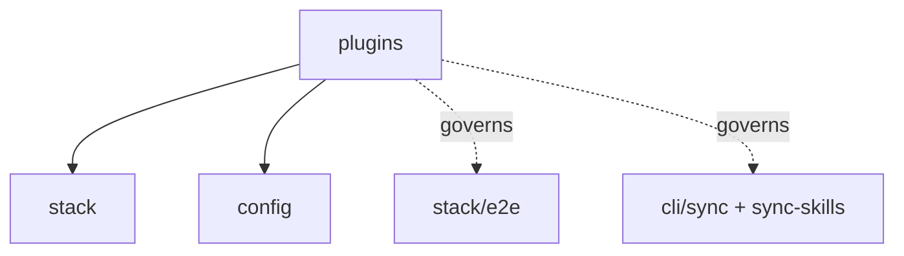

# plugins: Infrastructure Specification

## scope-type

infrastructure

## 1. Vision

**Плагин — это один каталог.** Всё, что принадлежит стеку — реализация, спека, директивы, скиллы, юнит-тесты, E2E-фикстуры — лежит в `plugins/<id>/` и больше нигде. Основной репозиторий не хранит ни одного файла, принадлежащего плагину, и узнаёт о плагинах только через **резолвер**.

Проблема, которую это решало: `golang` жил в шести деревьях (`services/stack/plugins/golang/`, `specs/stack/plugins/golang/`, `ai/directives/infra/`, `ai/skills/`, `__tests__/e2e/fixtures/golang/`, плюс точка входа E2E-набора). Добавить стек значило тронуть шесть мест и не забыть ни одного; вынести стек наружу — собрать его по репозиторию вручную. Это же блокировало [D-STACK-001](../stack/stack.spec.md) (внешние плагины отложены «без дизайна»): «плагин — это каталог с манифестом» и **есть** тот отсутствующий дизайн.

**Критерий приёмки — submodule-тест.** Заменяем `plugins/golang/` на git-submodule и спрашиваем:

1. Изменилось ли что-нибудь для основного репозитория? — **Нет.**
2. Самодостаточен ли плагин? — **Да.**

Оба ответа обязаны сохраняться после любой правки. Тест не риторический: он проверяется механически (§6).

**Почему `plugins/` в корне, а не `services/stack/plugins/`.** Каталог не является частью сервиса `stack`: он — точка подключения, к которой сервис обращается через резолвер. Корневое размещение делает submodule-границу очевидной и не заставляет внешний плагин жить внутри чужого сервисного дерева. Тип плагина живёт только в манифесте (`kind`), поэтому имя каталога его не дублирует и второй тип плагинов не потребует ни новой раскладки, ни правки резолвера (D-SP-002).

## 2. Definitions

| Term                | Definition                                                                                                                                      |
| ------------------- | ----------------------------------------------------------------------------------------------------------------------------------------------- |
| **Plugin dir**      | `plugins/<id>/` — единственное место хранения файлов плагина `<id>`                                                                             |
| **Manifest**        | `plugins/<id>/plugin.json` — объявление того, что плагин предоставляет; единственный обязательный файл кроме точки входа                        |
| **Surface**         | Вид файлов, который потребляет какая-то команда: реализация, спека, директивы, скиллы, юнит-тесты, E2E-фикстуры                                 |
| **Resolver**        | Единственный модуль, перечисляющий плагины и отдающий абсолютные пути их surface'ов. Потребители не знают о раскладке каталога                  |
| **Lookup**          | Механизм доступа: потребитель спрашивает резолвер и обходит «репозиторий + каждый плагин». Противоположность — symlink'и, отвергнуты (D-SP-001) |
| **Built-in plugin** | Плагин, живущий в `plugins/` этого репозитория и попадающий в npm-пакет                                                                         |
| **External plugin** | Тот же каталог, подключённый submodule'ом или путём из конфига; та же схема, тот же резолвер (D-SP-005)                                         |
| **Locality**        | Свойство «ни один файл плагина не лежит вне его каталога», проверяемое тестом (§6)                                                              |

## 3. Plugin Directory Layout

```
plugins/golang/
├── plugin.json              # манифест (§4); объявляет entry: golang-plugin.ts
├── golang-plugin.ts         # экспорт StackPlugin — точка входа (`entry` из манифеста)
├── golang-detect.logic.ts   # реализация, свободная раскладка
├── golang-scope.logic.ts
├── golang-plan.logic.ts
├── __tests__/               # юнит-тесты плагина
│   └── golang-plan.test.ts
├── specs/                   # спеки плагина; раскладка как у specs/ в репозитории
│   ├── golang.spec.md       #   root-спека: <id>.spec.md по конвенции
│   └── codegen/             #   спека фичи плагина, если она нужна
│       └── codegen.spec.md
├── directives/
│   └── infra/golang-setup.xml       # была ai/directives/infra/
├── skills/
│   └── sdd-infra-golang/SKILL.md   # была ai/skills/
└── e2e/
    └── fixtures/<fixture>/expect.yaml   # были __tests__/e2e/fixtures/golang/
```

Внутренняя раскладка за пределами манифеста — дело плагина: резолвер читает только то, что объявлено.

## 4. Manifest

Манифест — **декларация surface'ов**: единственный ответ на вопрос «что этот каталог предоставляет и по каким путям». Это не package.json плагина, не описание зависимостей и не список возможностей: возможности (`verify`, `fix`, …) живут в объекте `StackPlugin` и дублировать их в манифесте нельзя — иначе появляется второй источник истины, который разойдётся с кодом.

### 4.1 Golden example

`plugins/golang/plugin.json` — все поля, включая те, что равны дефолтам:

```jsonc
{
  // Идентичность. `id` ОБЯЗАН совпадать с именем каталога; `kind` — единственное место,
  // где живёт тип плагина (D-SP-002), и по нему фильтрует резолвер.
  "id": "golang",
  "kind": "stack",

  // Код: модуль, экспортирующий StackPlugin. Built-in'ы называют его `<id>-plugin.ts` —
  // это отклонение от дефолта `plugin.ts`, поэтому поле объявлено (§4.2). Резолвер отдаёт
  // путь как данные и не импортирует его (D-SP-009).
  "entry": "golang-plugin.ts",

  // Документация: КАТАЛОГ спек. Root-спека внутри — `<id>.spec.md`; рядом с ней
  // живут спеки фич плагина, как scope и его модули в specs/.
  "specs": "specs",

  // Материал для агентов: `sync` и `sync-skills` раскладывают это в репозиторий пользователя
  // наравне с репозиторными ai/directives/** и ai/skills/**.
  "directives": "directives",
  "skills": "skills",

  // Тесты, которыми владеет плагин: корень фикстур для набора stack/e2e.
  "e2eFixtures": "e2e/fixtures",
}
```

Минимальный валидный манифест — плагин без директив, скиллов и E2E-фикстур:

```json
{ "id": "rust", "kind": "stack" }
```

Он означает: код в `plugin.ts` (дефолт `entry`; отсутствие этого файла — фатальная ошибка «missing plugin code», §4.2), спеки в `specs/` с root-спекой `specs/rust.spec.md` (конвенциональные дефолты), остальных surface'ов нет. Все built-in'ы от дефолта `entry` отклоняются — их точка входа зовётся `<id>-plugin.ts` — и потому объявляют `entry` явно, как и предписывает правило «объявляйте только отклонения от конвенции».

### 4.2 Правила

| Поле          | Обяз. | Дефолт         | Смысл                                                    |
| ------------- | ----- | -------------- | -------------------------------------------------------- |
| `id`          | да    | —              | Идентификатор; **обязан** совпадать с именем каталога    |
| `kind`        | да    | —              | Тип плагина; резолвер фильтрует по нему (D-SP-002)       |
| `entry`       | нет   | `plugin.ts`    | Модуль с реализацией                                     |
| `specs`       | нет   | `specs`        | Каталог спек; root-спека — `<specs>/<id>.spec.md` (§4.3) |
| `directives`  | нет   | `directives`   | Каталог `*.xml` для `gennady sync`                       |
| `skills`      | нет   | `skills`       | Каталог `<name>/SKILL.md` для `gennady sync-skills`      |
| `e2eFixtures` | нет   | `e2e/fixtures` | Корень фикстур набора                                    |

- **Замкнутая схема**: неизвестный ключ — фатальная ошибка с did-you-mean, как в конфиге (config.spec §4.1). Не версионируется (D-CFG-005).
- **Объявленный, но отсутствующий путь — фатальная ошибка. Необъявленный surface просто отсутствует.** Это разница между «опечатался в имени каталога» и «у плагина нет скиллов»: первое обязано падать, второе — норма. Поэтому дефолт применяется только когда ключ **опущен**, и отсутствие каталога `specs/` у минимального плагина ошибкой не является.
- **Объявляйте только отклонения от конвенции.** Путь, совпадающий с дефолтом, лучше не писать: правило «объявленный, но отсутствующий путь фатален» тогда сработает там, где отсутствие законно — опубликованный пакет везёт **подмножество** каталогов плагина (без спек и фикстур), и объявленный `specs` сделает плагин нерезолвящимся у потребителя. Дефолт находит surface там же, а его отсутствие ошибкой не является.
- **`entry` — исключение из предыдущего правила: его отсутствие фатально даже когда он не объявлен.** Каталог без кода — не плагин: регистрировать нечего, и лучше сказать это резолвером, чем упасть внутри `import` у первого потребителя. Остальные surface'ы описывают, насколько плагин документирован и оснащён, а `entry` — существует ли он вообще.
- **`id` дублирует имя каталога намеренно**: имя каталога видит человек, `id` видит код, и расхождение даёт плагин, который «есть, но зовётся иначе». Проверка равенства — первая, что делает резолвер.
- **Манифест обязателен**, даже когда состоит из двух полей: явное перечисление дешевле и предсказуемее угадывания конвенций по glob'ам, а ошибка диагностируется до запуска чего-либо.

### 4.3 Каталог спек и root-спека

Спек у плагина может быть несколько: контракт плагина целиком плюс спеки отдельных фич (кодогенерация, скоупинг, будущие фасеты). Поэтому `specs` — **каталог**, и его раскладка повторяет раскладку `specs/` основного репозитория: root-спека рядом, спеки фич — в подкаталогах.

- **Root-спека определяется конвенцией `<specs>/<id>.spec.md`** — так же, как scope-спека зовётся по имени scope, а модульная по имени модуля. Отдельного поля в манифесте нет: имя выводится из `id`, который и так обязан совпадать с именем каталога, поэтому третьего места для одного факта не появляется.
- **Каталог спек есть, а root-спеки в нём нет — фатальная ошибка.** Набор спек без точки входа не отвечает ни агенту, ни ревьюеру на вопрос «с чего начинать читать»; это класс опечатки, а не осознанное отсутствие.
- **Резолвер отдаёт и root, и полный список** (`specRoot` + `specs[]`): читатель (SDD-каскад, ревьюер) начинает с root'а, а обход «все спеки репозитория» обязан видеть каждый файл. `orient` этот surface пока не потребляет — открытый разрыв (§10).
- Вложенность внутри каталога не ограничена: плагин раскладывает свои фичи так же свободно, как scope раскладывает модули.

### 4.4 Контракт импортов: чем плагин пользуется у хоста

Плагину нужен код хоста: комбинаторы `envFail`, `parseDuration`, `execFileTrimSafe`, типы `StackPlugin`/`GateSpec`. До миграции `golang` брал их относительными путями (`../../env-fail.ts`, `../../../config/config-loader.ts`, `../../../../shared/common/exec.ts`), и это ломало **второй** критерий §1 — самодостаточность:

- относительный путь фиксирует глубину: плагин работает ровно на два уровня ниже корня и нигде больше, а D-SP-005 обещает корень из конфига;
- вне суперпроекта такой импорт висит: standalone-репозиторий плагина не проходит ни `tsc`, ни свои юнит-тесты;
- в опубликованном пакете `services/` и `shared/` **отсутствуют** (`npm pack` отдаёт `dist/**`, `ai/**`, `cli/**` и объявленные surface'ы плагинов), а `package.json#exports` до D-SP-007 не имел входа для плагинов, поэтому внешний плагин, поставленный рядом с пакетом, не разрешал вообще ничего.

Правило: **плагин импортирует хост только по published-специфаеру `gennady/stack`; относительный путь за пределы своего каталога запрещён** и проверяется locality-тестом (§6, п. 4).

| Что                       | Как                                                                                                                                                                                                                                                                                                                           |
| ------------------------- | ----------------------------------------------------------------------------------------------------------------------------------------------------------------------------------------------------------------------------------------------------------------------------------------------------------------------------- |
| Поверхность               | `package.json#exports` получает `"./stack"` — единственный вход для плагинов                                                                                                                                                                                                                                                  |
| Что экспортируется        | типы (`StackPlugin`, `GateSpec`, `Gate`, `Cmd`, `GateOutcome`, `GatePlanOptions`, `EnvFailPredicate`, `ScopeRequest`, `StackDetection`, `StackScope`, `StackDiagnostic`, `StackVerifyCapability`), комбинаторы `env-fail` (`allOf`, `exitCodeMatches`, `outputMatches`, `streamMatches`), `parseDuration`, `execFileTrimSafe` |
| Built-in'ы в репозитории  | тот же специфаер через self-reference пакета; относительных путей нет ни у кого                                                                                                                                                                                                                                               |
| Что **не** экспортируется | раннер, реестр, резолвер, загрузчик конфига целиком — плагин их не вызывает                                                                                                                                                                                                                                                   |

Это и есть SDK: список функций, за совместимость которых хост отвечает. Всё, что в него не входит, плагину недоступно — не по дисциплине, а потому что не разрешается.

### 4.5 Чем манифест не является

- **не** package.json: ни `version`, ни `dependencies`, ни `scripts` — плагин может быть просто submodule'ом без npm-семантики;
- **не** декларацией возможностей: `verify`/`fix` читаются из объекта `StackPlugin` (stack.spec §4.1), потому что код — источник истины о поведении;
- **не** конфигом: поведение плагина в конкретном репозитории настраивает секция `stack` в `gennady.yaml` (config.spec §3), а манифест описывает сам плагин и от репозитория не зависит;
- **не** механизмом загрузки: он отдаёт путь к `entry` как данные; в бандл built-in'ы попадают статическим индексом `plugins/index.ts` (§5, D-SP-009).

## 5. Resolver Contract

Один модуль (`services/plugins/resolve-plugins.ts`), один вызов, и ни один потребитель не знает раскладки:

```ts
type ResolvedPlugin = {
  readonly id: string;
  readonly kind: string; // фильтруется, но не сужается: типов плагинов больше одного
  readonly dir: string; // абсолютный
  readonly entry: string; // абсолютный путь к модулю с StackPlugin; резолвер его не импортирует
  readonly specRoot: string | null; // <specs>/<id>.spec.md
  readonly specs: readonly string[]; // все *.spec.md каталога, включая root
  readonly directivesDir: string | null; // сам каталог — нужен потребителю, воспроизводящему его дерево
  readonly directives: readonly string[]; // абсолютные пути *.xml
  readonly skillsDir: string | null; // сам каталог, или null
  readonly skills: readonly string[]; // все <name>/SKILL.md
  readonly e2eFixtures: string | null;
};

function resolvePlugins(
  roots: readonly string[],
  kind?: string
): {
  plugins: readonly ResolvedPlugin[];
  errors: readonly ConfigError[]; // та же форма, что у config-scope
};
```

- **Каталог без манифеста — ошибка.** Под `plugins/` не бывает «просто папок»: манифест обязателен (§4.2), поэтому каталог без него — либо забытый файл, либо неинициализированный плагин, и оба случая надо назвать. Файлы рядом с каталогами (README) резолвер не читает.
- **Одинаковый `id` из двух корней — ошибка, а не молчаливый выбор.** `id` уникален глобально (D-SP-002); при коллизии остаётся первый, а конфликт печатается — иначе «плагин есть, но не тот» отлаживается часами.
- **Фильтр по `kind`** — потребитель просит свой тип; плагин другого типа не попадает в выборку и не считается ошибкой (D-SP-002).
- **Порядок детерминирован** — лексикографический по `id`; отчёты и планы не должны зависеть от порядка чтения каталога.
- **Ошибки не выбрасываются**, а возвращаются списком: команда печатает их все и выходит с кодом ошибки, как со конфигом (FR-STACK-12).
- **Отсутствующий или пустой каталог плагина — не ошибка.** `git submodule deinit` оставляет **пустую** точку монтирования, а не удаляет каталог, поэтому «пусто» и «нет» — один случай: плагин отсутствует, команды, которым он нужен, говорят это прямо. Каталог **с файлами** но без манифеста — уже ошибка: кто-то положил файлы рядом. Разница проверена на живом submodule, а не только на temp-каталоге.
- **Корень ровно один — `<repo>/plugins`.** Параметр `roots` — множественный ради D-SP-005, но пока конфиг **не** объявляет ключа для внешних корней: секция закрыта (config.spec §4.1), а придумывать surface под ещё не спроектированную фичу — тот же дрейф, против которого этот scope. Внешние корни приходят вместе с D-STACK-001, не раньше.
- **Порядок загрузки: статический индекс → словарь гейтов → валидация конфига → детект.** Код built-in'ов приходит статическим импортом `plugins/index.ts` (D-SP-009), а не резолвом-и-импортом `entry`: рантайм-путь `verify` резолвер вообще не проходит. Словарь id гейтов читается с самих объектов (`StackPlugin.gateIds` → `BUILTIN_GATE_IDS` в `stack-registry`), строгая валидация конфига сверяется с ним **до** детекта. Манифест словарь не объявляет: это продублировало бы то, что уже есть в `StackPlugin` (§4.5). Загрузка кода и детект — разные шаги, и только это разводит цикл.
- **Резолвер не импортирует `entry`.** Пути отдаются как данные, поэтому спеки, директивы и фикстуры доступны даже когда код плагина не грузится. Built-in'ы попадают в бандл статическим индексом (D-SP-009), внешние — предмет D-STACK-001.

## 6. Locality Enforcement

Локальность проверяется тестом, а не ревью — по образцу теста паритета (stack.spec §4.6). Тест (`services/plugins/__tests__/plugin-locality.test.ts`) утверждает:

1. **Пол резолва**: каждый built-in id (§6.2) резолвится — резолвер, не нашедший ничего, делает все проверки ниже вакуумно зелёными.
2. **Паритет со статическим индексом**: множество id из резолвера совпадает с `plugins/index.ts` (D-SP-009). Плагин на диске без строки в индексе резолвится, но никогда не загрузится; строка без каталога ломает сборку.
3. **Каждый surface, объявленный манифестом, существует**: резолвер обязан вернуть ноль ошибок (правило «объявленный, но отсутствующий путь фатален», §4.2).
4. **Импорты не выходят за каталог**: внутри `plugins/<id>/` ни один относительный специфаер — статический или динамический `import()` — не указывает мимо границы каталога; хост берётся по `gennady/stack` (§4.4, D-SP-007).

### 6.1 Чего тест не делает

Исходный дизайн добавлял grep-проверку «ни один путь **вне** `plugins/<id>/` не упоминает `<id>`» с закрытым allow-list'ом; реализация её не содержит и allow-list'а больше нет. Единственное легальное упоминание плагина снаружи — строка в `plugins/index.ts`, и её согласованность с диском держит паритет (п. 2); файл, «просто положенный рядом», этим правилом не ловится — он остаётся на ревью. Если grep-правило понадобится, сопоставлять нужно **сегменты нормализованного пути, а не подстроку**: `node` — подстрока `node_modules`, `golang` — подстрока `golang-setup.xml`, и проверка по подстроке даёт либо шум на каждом прогоне, либо тихий пропуск настоящего нарушения.

### 6.2 Производные наборы обязаны иметь пол

Резолвер стал источником четырёх производных наборов: E2E-наборы (§7, `scripts/stack-e2e.ts`), этот тест, целостность фикстур (`fixture-integrity.test.ts`) и тест содержимого пакета (`publish-contents.e2e.test.ts`). У всех пустой вход — зелёный прогон: ноль наборов, ноль нарушений, ноль ассетов. Поэтому **каждый производный набор утверждает литеральный пол** — built-in id (`anystack`, `golang`, `node`) обязаны в нём присутствовать, — и падает, когда резолвер вернул меньше. Без этого пола миграция может «позеленеть» ровно тем, что перестала находить плагины. Тест паритета `GateSpec` (stack.spec §4.6) от резолвера больше не зависит: он обходит статический индекс `BUILTIN_PLUGINS`, чью полноту держит п. 2 этого теста.

## 7. Surfaces & Consumers

| Surface         | Кто потребляет                              | Что меняется                                                                                                                                              |
| --------------- | ------------------------------------------- | --------------------------------------------------------------------------------------------------------------------------------------------------------- |
| Реализация      | `stack-registry`                            | объекты плагинов из статического `plugins/index.ts` (D-SP-009); порядок — лексикографический по id, то же правило, что у резолвера                        |
| Юнит-тесты      | `npm test`                                  | glob покрывает `plugins/**/__tests__/**`                                                                                                                  |
| Спеки           | SDD-каскад, ревьюер                         | резолвер отдаёт `specRoot` + `specs[]`; `orient` их пока **не** читает — обходит только `specs/**` репозитория (разрыв, §10)                              |
| Директивы       | `gennady sync`                              | источники: `ai/directives/**` + `plugin.directives` каждого плагина (мультикорневой обход)                                                                |
| Скиллы          | `gennady sync-skills`                       | источники: `ai/skills/**` + `plugin.skills` каждого плагина                                                                                               |
| E2E-фикстуры    | `declareStackSuite`, `scripts/stack-e2e.ts` | набор на плагин объявляется динамически по резолверу; репо-файла на плагин больше нет                                                                     |
| Линт/формат/tsc | `lint:contracts`, prettier, tsc             | `plugins/**` в таргетах и в `tsconfig`; фикстуры остаются исключёнными                                                                                    |
| Пакет           | `npm pack`, `prepare-publish-artifacts`     | `files` несёт маски по surface'ам (`plugins/*/plugin.json`, `plugins/*/*.ts`, `plugins/*/directives/**`, `plugins/*/skills/**`); тест содержимого тарбола |

**Почему `sync`/`sync-skills` всё-таки получили lookup'ы.** Раньше здесь стояло обратное: обе команды читают установленный пакет, значит достаточно стейджинга. Это опиралось на баг — `resolvePackageDir` выводил корень пакета, отрезая `/dist/`, что работает только для опубликованной установки; из клона или `npm link` резолв возвращал путь к **файлу** и команда падала с «gennady package not found». После починки (корень ищется вверх по `package.json`) установка из клона — полноправный случай, а в клоне никаких staged-копий нет. Поэтому обе команды обходят **несколько корней**: базовый `ai/**` плюс `plugin.directives`/`plugin.skills` каждого плагина.

**Кросс-стековые фикстуры.** `node-plus-golang` проверяет свойство реестра (репозиторий принадлежит двум стекам сразу), а не свойство одного плагина. Отдельного репо-набора под это нет: за репозиторием остался только набор `config` (`scripts/stack-e2e.ts`), а фикстура живёт в наборе плагина `node` (node.spec §6) — свойство реестра проверяемо из любого из участников, и это дешевле ещё одного репо-корня фикстур.

## 8. Decision Log

### D-SP-001 — Lookup'ы, а не symlink'и

- **Status:** active
- **Why:** Symlink'и заманчивы тем, что ни один потребитель не меняется, но ломают три вещи. (1) **`npm pack`**: `files` тянет `ai/**`; symlink внутрь submodule'а публикуется то битым, то разыменованным — в зависимости от версии npm, то есть мы отправляем пользователю сломанный артефакт. (2) **Двойной обход**: prettier, tsc и DbC-линтер пройдут и по реальному пути, и по ссылке — один файл обработается дважды, а граф `@consumers` увидит две сущности вместо одной. (3) **Неинициализированный submodule** оставляет висящие ссылки, и падение приходит из середины чужого инструмента вместо внятного сообщения резолвера. Lookup'ы дороже на входе, но submodule-тест проходят честно: ничего не дублируется, отсутствующий плагин — просто отсутствующая запись.
- **Rejected alternatives:** symlink'и (см. выше); генерация-и-коммит копий в канонические пути (два источника истины, дрейф — вопрос времени, ровно то, против чего этот scope).

### D-SP-002 — `plugins/` в корне; тип живёт только в манифесте

- **Status:** active
- **Recorded:** ревью — «если есть `kind`, переходим со `stack-plugins` на просто `plugins`»
- **Why:** Каталог — точка подключения, а не часть сервиса `stack`, поэтому он не живёт под `services/`. Тип плагина объявлен **один раз**, в манифесте: имя каталога с префиксом (`stack-plugins/`) дублировало бы `kind` и заставляло бы плодить каталог на каждый новый тип, хотя резолвер и так умеет фильтровать. Один `plugins/` + `kind` означает, что второй тип плагинов не требует ни новой раскладки, ни правки резолвера — только нового потребителя, который спросит свой `kind`.
- **Следствия, которые нужно держать:** (1) резолвер принимает фильтр по `kind`, и `stack-registry` спрашивает только `kind: 'stack'`; (2) `id` уникален **глобально**, а не внутри типа, потому что пространство имён — имена каталогов; (3) плагин чужого `kind` для стековых потребителей просто не существует, без ошибки.
- **Rejected alternatives:** `stack-plugins/` (тип в двух местах — имя каталога и `kind`; расхождение между ними неизбежно и не диагностируется); каталог на тип (`stack-plugins/`, `vcs-plugins/`) — резолвер тогда обходит N корней, а «где лежит плагин» перестаёт быть одним ответом.

### D-SP-003 — Манифест обязателен, пути опциональны

- **Status:** active
- **Why:** Обязательный манифест делает набор surface'ов явным и проверяемым до запуска; конвенциональные дефолты оставляют минимальный плагин двухстрочным. Объявленный-но-отсутствующий путь фатален, необъявленный — просто отсутствует: это отличает опечатку от осознанного отсутствия скиллов.
- **Rejected alternatives:** только конвенции по glob'ам (тихо пропускает файл при опечатке в имени каталога); манифест в `package.json` плагина (тянет npm-семантику туда, где плагин может быть просто submodule'ом).

### D-SP-004 — Один резолвер, много потребителей

- **Status:** active
- **Why:** Если каждый surface заводит свой обход, «плагин — один каталог» держится ровно до следующей команды: восемь потребителей — восемь мест, где можно забыть плагин. Резолвер отдаёт пути как данные и ничего не импортирует, поэтому спеки и фикстуры доступны даже при неработающем коде плагина.

### D-SP-005 — Внешние плагины: тот же каталог, тот же резолвер (дизайн для D-STACK-001)

- **Status:** active
- **Why:** Единственная разница built-in и внешнего плагина — откуда взялся каталог: `plugins/` этого репозитория (и в npm-пакете) либо submodule/путь из конфига. Это и есть отложенный дизайн D-STACK-001: подключение — не «ссылка как id», а корень поиска. Ключ `stack.use` продолжает **ограничивать** реестр, а не подключать.
- **Risk accepted:** с приходом внешних плагинов `StackId` перестанет быть закрытым union'ом. Пока код держит компромисс наполовину: `StackId` (stack.types.ts) остаётся закрытым union'ом built-in'ов — типизация там, где она несёт нагрузку, — а на границах резолвера id уже строка (`ResolvedPlugin.id: string`). Переименование в `BuiltinStackId` отложено до D-STACK-001. Закрытый мир Entity Inventory продолжает описывать built-in'ы; внешний плагин по построению вне инвентаря.

### D-SP-006 — Локальность проверяется тестом

- **Status:** active
- **Why:** «Все файлы плагина в одном каталоге» — свойство, которое ломается одним `git add` в удобном месте. Ревьюер это пропустит, grep-тест — нет. Тот же приём, что с паритетом `GateSpec` (stack.spec §4.6): правило, за которым следит CI, а не дисциплина.

### D-SP-007 — Плагин видит хост только через published-специфаер

- **Status:** active
- **Why:** Относительные импорты в `services/`/`shared/` проходят submodule-тест по случайности — потому что рабочее дерево submodule'а лежит внутри суперпроекта, — и проваливают второй критерий §1: standalone плагин не собирается, а внешний плагин рядом с npm-пакетом не разрешает ничего, потому что `services/` и `shared/` в пакет не попадают, а `exports` входа для плагинов не имеет. Один специфаер `gennady/stack` делает зависимость плагина от хоста **перечислимой**: видно, за что хост отвечает, и видно, когда он это ломает.
- **Consequences:** `package.json#exports` получает `./stack`; built-in'ы переходят на тот же специфаер (иначе правило проверяется только у внешних, то есть не проверяется); locality-тест запрещает `../` за границу каталога.
- **Rejected alternatives:** оставить относительные пути (submodule-тест зелёный, самодостаточность — нет; ломается на первом же внешнем корне); публиковать `services/**` целиком (весь хост становится публичным API, любая внутренняя правка — breaking change); дублировать хелперы в каждый плагин (два источника истины у `envFail`-семантики — ровно то, против чего этот scope).

### D-SP-008 — Пакет везёт каталоги плагинов; копий в `ai/` нет

- **Status:** active
- **Why:** `files: ["plugins/**"]` отклонён: вложенный `.gitignore` **молча** вычитает из тарбола, а у плагина-submodule'а он есть по построению. Первой попыткой был стейджинг объявленных surface'ов в `ai/**` — и он оказался хуже болезни: `build:publish` мутирует **отслеживаемое** дерево, `postpublish` чистит его только при публикации, поэтому любой прогон E2E оставлял `ai/skills/<plugin-skill>/` в рабочей копии. Эта копия затем **побеждала** в мультикорневом обходе и подменяла скилл плагина собой (в один момент — пустым каталогом), то есть тихо удаляла его из каждого `sync`. Итог: пакет везёт сами каталоги плагинов (`plugin.json`, `entry`, `directives/**`, `skills/**`), в `ai/` ничего не копируется, рабочее дерево остаётся чистым, а раскладка в пакете совпадает с раскладкой в чекауте — один код-путь для обеих установок.
- **Consequences:** (1) `files` перечисляет маски по surface'ам (`plugins/*/plugin.json`, `plugins/*/*.ts`, `plugins/*/directives/**/*`, `plugins/*/skills/**/*`), а не общую маску `plugins/**`: спеки и фикстуры в пакет не едут — они не нужны в рантайме; (2) манифест объявляет **только отклонения от конвенции** (см. §4.2), иначе `specs`/`e2eFixtures`, которых в пакете нет, делают плагин нерезолвящимся — правило «объявленный, но отсутствующий путь фатален» и должно так работать; (3) тест публикации сверяет `npm pack --dry-run` со списком из манифестов и ловит именно то, что вложенный `.gitignore` мог бы вычесть.
- **Rejected alternatives:** `files: ["plugins/**"]` (тихое вычитание + фикстуры в пакете); стейджинг в `ai/**` (см. выше — мутация отслеживаемого дерева и подмена скилла); негации в `.gitignore` плагина или пустой `.npmignore` рядом (работают, но это правка содержимого чужого каталога: у submodule'а его владелец — сам плагин, а `.npmignore` отменяет ignore-правила целиком и меняет тихую потерю файлов на тихую публикацию логов и `.env`).

### D-SP-009 — Built-in'ы регистрируются статическим индексом, а не динамическим импортом

- **Status:** active
- **Why:** Опубликованный CLI — это собранный `dist/gennady.js` на обычном Node: импортировать `plugin.ts` по вычисленному пути он не может, а путь `<repo>/plugins/<id>/` в пакете и не существует. Значит код built-in'а обязан быть **в бандле**, то есть достижим статически. `plugins/index.ts` — одна строка на built-in в корне каталога плагинов, ровно то место, которое allow-list §6 уже разрешает; `stack-registry` больше не знает ни путей, ни внутренностей плагина, а порядок берёт из резолвера (лексикографический по `id`).
- **Consequences:** (1) добавить built-in — это каталог **плюс** строка в индексе; шесть мест из §1 стали двумя, а не одним, и это осознанная цена; (2) неинициализированный submodule built-in'а ломает сборку, а не деградирует в «плагина нет» — CLI без своего встроенного стека собираться молча не должен; (3) словарь гейтов читается с самих объектов (`StackPlugin.gateIds`), поэтому реестр не импортирует внутренние модули плагина.
- **Rejected alternatives:** динамический `import()` по пути из резолвера (в бандле не разрешается — это и был главный неизвестный §10); `import.meta.glob` (работает только в vite: под `tsx` в тестах его нет, значит нужен второй кодовый путь и `define`-флаг — vite-специфичная магия в обмен на терпимость к отсутствующему каталогу); генерируемый и коммитимый индекс (кодоген ради того, что руками занимает одну строку, плюс дрейф между файлом и диском).

## 9. Inter-Scope Dependencies

- **Depends on:** [`stack`](../stack/stack.spec.md) (интерфейс `StackPlugin`, реестр), [`config`](../config/config.spec.md) (форма ошибок, корни внешних плагинов), [`infra-base`](../infra-base/infra-base.spec.md) (таргеты линта/tsc)
- **Governs:** раскладку и обнаружение плагинов для [`stack/e2e`](../stack/e2e/e2e.spec.md), `sync`, `sync-skills`, `orient`
- **Amends:** `stack.spec` D-STACK-001 — этот scope является его дизайном



## 10. Migration Record

Миграция выполнена; порядок был такой, и каждый шаг проверялся полным набором (`npm test`, все E2E-наборы, `verify --all`):

1. Резолвер + манифест + юнит-тесты.
2. Поверхность `gennady/stack` (D-SP-007) — до переноса каталогов, чтобы замену импортов проверили существующие тесты.
3. `golang`: код и фикстуры; статический индекс built-in'ов (D-SP-009), `StackPlugin.gateIds`, E2E-набор из резолвера.
4. `golang`: спека, директива и скилл; пакет везёт каталог плагина без стейджинга в `ai/` (D-SP-008) + тест содержимого тарбола.
5. `node` — доказательство, что механизм не golang-образный: `services/stack/plugins/` и `specs/stack/plugins/` удалены.

**Что осталось открытым.**

- ~~**Submodule-тест руками (§1).**~~ Выполнен. `plugins/golang/` превращён в отдельный репозиторий (со своим `.gitignore`: `dist`, `*.log`, `node_modules`) и подключён в клон хоста настоящим submodule'ом (`.git` — файл). Результат: резолвер видит все built-in-плагины (сегодня их три — `anystack`, `golang`, `node`), `tsc` чист, locality/parity/resolver-тесты зелёные, `verify --plan` планирует, **все 49 go-фикстур проходят из submodule'а**, тарбол остаётся полным несмотря на `.gitignore` плагина. `deinit` → плагин просто отсутствует без ошибок, а `tsc` падает на `plugins/index.ts` с внятным TS2307 — ровно то поведение, которое описывает D-SP-009.
- **Что тест нашёл:** резолвер считал пустую точку монтирования сломанным плагином («missing plugin.json») вместо отсутствующего. Исправлено, правило записано в §5, покрыто юнит-тестом.
- **Внешние плагины — D-STACK-001.** Опубликованный CLI не умеет исполнять `.ts`, поэтому подключение плагина «из конфига» требует ответа на вопрос формата поставки (собранный `.js` в манифесте?). Резолвер к этому готов: `roots` уже множественный, `kind` фильтруется, id на границе — строка.
- **TODO: `orient` не читает спеки плагинов.** Резолвер отдаёт `specRoot`/`specs[]`, но `cli/cmd/orient/core/query-spec.ts` обходит только `specs/` репозитория — спеки built-in-плагинов (включая эту иерархию у `plugins/*/specs/`) в обзор и поиск спек не попадают. Разрыв с намерением §4.3/§7; закрыть при следующем заходе на `orient`.
- **Правило принадлежности директив.** Директива принадлежит плагину, когда описывает его гейты: `golang-setup.xml` ссылается на `gennady verify`, гейты и `skipGates` 27 раз и переехал; `nodejs-npm-setup.xml` — общая дисциплина Node-рантайма, ноль таких ссылок, остался в `ai/`. Для следующего плагина применяется тот же критерий.
