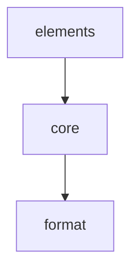

# Module: core

<!--SECTION:MODULE_VISION-->
## 1. Module Vision
Ядро prompt-kit: фабрика элементов, рендер-движок, нормализация JSX-деревьев, разрешение элементов. Не знает про конкретные примитивы и форматы — только инфраструктура.

[Scope spec → `../../prompt-kit.spec.md`](../../prompt-kit.spec.md)
<!--/SECTION:MODULE_VISION-->

<!--SECTION:MODULE_USAGE_EXAMPLE-->
## 2. Module Usage Example

```ts
import { definePromptElement, renderPrompt } from 'gennady/prompt-kit'

const MySection = definePromptElement<{ title: string }>({
  role: 'section',
  markdown: {
    title: ({ props }) => props.title,
    includeBoundaryComments: true,
  },
})

const MyPrompt = (props: { name: string }) => (
  <MySection title={`Hello ${props.name}`}>содержимое</MySection>
)

const result = renderPrompt(MyPrompt, { name: 'world' }, 'md')
// → ## Hello world:\n<!--START_MYSECTION-->\nсодержимое\n<!--END_MYSECTION-->
```
<!--/SECTION:MODULE_USAGE_EXAMPLE-->

<!--SECTION:ENTITY_INVENTORY-->
## 3. Entity Inventory (Closed-World)

_Это полный список сущностей модуля. Любое введение сущности execution-агентом помимо этого списка считается drift'ом и требует обновления spec._

| Name | Surface | Type | Purpose |
|---|---|---|---|
| `definePromptElement` | 🟢 | Factory | Создаёт элемент промпта по конфигу (роль, рендер-функции, флаги) |
| `renderPrompt` | 🟢 | Service | Принимает компонент + пропсы + формат, возвращает строку |
| `PromptElement` | 🟢 | Type | Тип элемента — результат `definePromptElement` |
| `PromptElementConfig` | 🟢 | Type | Конфиг элемента: роль, markdown.*, html.* |
| `JSXNode` | ⚪ | Type | Канонический узел JSX-дерева: `{ type, props, children }` |
| `JSXTreeNormalizer` | ⚪ | Utility | Приводит деревья от разных JSX-рантаймов к `{type, props, children}` |
| `RenderContext` | ⚪ | Value Object | Контекст рендера: depth, inList, format |
| `TreeWalker` | ⚪ | Service | Рекурсивный обход дерева: дети → родитель, разрешение type → рендер |
| `ElementResolver` | ⚪ | Utility | По `node.type` определяет стратегию: PromptElement, string (HTML-тег), function (прозрачный) |
| `HTMLTagRegistry` | ⚪ | Registry | Реестр встроенных HTML-тегов (`b`, `em`, `table`, ...) — маппинг имени на рендер |
<!--/SECTION:ENTITY_INVENTORY-->

<!--SECTION:ENTITY_SURFACES-->
## 4. Entity Surfaces

### `definePromptElement`
- **Type:** Factory
- **Purpose:** Создаёт элемент промпта из конфига. Возвращает объект, используемый JSX как `node.type`.
- **Public Properties:** `tagName`, `config` (readonly)
- **Public Operations:** `definePromptElement<Props>(config) → PromptElement<Props>`
- **Lifecycle:** Вызывается на уровне модуля при импорте. Результат живёт всё время жизни процесса.
- **Events Emitted:** N/A
- **Errors & Degradation:** N/A — чистая фабрика, ошибок не бросает
- **Consumers:**
  - Internal: `elements/` — все примитивы
  - External: пользовательский код

### `renderPrompt`
- **Type:** Service
- **Purpose:** Вызывает функцию-компонент → получает JSX-дерево → рекурсивно обходит → рендерит в строку.
- **Public Properties:** N/A
- **Public Operations:** `renderPrompt(component, props, format) → string`
- **Lifecycle:** Stateless. Вызывается на каждый рендер.
- **Events Emitted:** N/A
- **Errors & Degradation:** `Error` при неизвестном формате, `Error` при невалидном дереве, `Error` при ошибке в компоненте. Все ошибки — с префиксом `[prompt-kit]` и `cause`.
- **Consumers:**
  - Internal: N/A
  - External: CLI, скрипты генерации промптов

### `JSXTreeNormalizer`
- **Type:** Utility (⚪)
- **Purpose:** Нормализует дерево от `jsx()` / `jsxs()` / `createElement()` к единой форме `{type, props, children}`. Обрабатывает `children` внутри `props` и отдельным аргументом.
- **Consumers:** Internal — `renderPrompt`

### `RenderContext`
- **Type:** Value Object (⚪)
- **Purpose:** Контекст, передаваемый сверху вниз при обходе дерева.
- **Public Properties:** `depth: number`, `inList: boolean`, `format: 'xml' | 'md'`
- **Consumers:** Internal — `TreeWalker`, `TFormatEngine`

### `TreeWalker`
- **Type:** Service (⚪)
- **Purpose:** Рекурсивно обходит нормализованное дерево: сначала рендерит детей, затем передаёт результат родителю. Для каждого узла разрешает тип через `ElementResolver` и вызывает соответствующий метод `TFormatEngine`.
- **Role→method dispatch (для PromptElement):**
  - `root` → skip (не рендерится)
  - `section` → `formatSection(ctx, children, element)`
  - `list` → `formatList(ctx, children, element)`
  - `block` → `formatBlock(ctx, children, element)`
  - `inline` → `formatInline(ctx, children, element)`
- **Dispatch для других категорий:**
  - `'html-tag'` → `HTMLTagRegistry.resolve(tagName)`; найден → вызвать рендерер; `null` → `Error`
  - `'transparent'` → вернуть `children` как есть (форматер не вызывается)
  - `'skip'` → вернуть пустую строку
- **Context propagation:** `section` → `depth + 1` детям. `list` → `inList: true` детям. Остальные роли → контекст без изменений.
- **Consumers:** Internal — `renderPrompt`

### `ElementResolver`
- **Type:** Utility (⚪)
- **Purpose:** По `node.type` определяет категорию: `'prompt-element'` (brand symbol), `'html-tag'` (строка), `'transparent'` (функция без brand). Нераспознанный тип → `Error`.
- **Public Operations:** `resolve(type) → 'prompt-element' | 'html-tag' | 'transparent' | 'skip'`
- **Consumers:** Internal — `TreeWalker`
- `'skip'` — для `null` / `undefined` type (пустой JSX-узел), TreeWalker пропускает

### `HTMLTagRegistry`
- **Type:** Registry (⚪)
- **Purpose:** Словарь: строковое имя HTML-тега → рендер-функции. Наполняется при импорте модуля.
- **Public Operations:** `register(name: string, renderer: HtmlTagRenderer)`, `resolve(name: string) → HtmlTagRenderer | null`
- **Consumers:** Internal — `ElementResolver`
<!--/SECTION:ENTITY_SURFACES-->

<!--SECTION:MODULE_CONTRACTS-->
## 5. Module Contracts (DbC)

### Module-level invariants
- **Рендер синхронный**: `renderPrompt` не делает I/O, не аллоцирует внешние ресурсы, не зависит от сети.
- **Толерантность к деревьям**: `JSXTreeNormalizer` принимает любое дерево и нормализует losslessly. Распознанные паттерны (props.children, фрагменты, примитивы) — нормализуются. Нераспознанные — проходят как есть (pass-through), ошибка не бросается.
- **Прозрачность**: обычная функция без `Symbol('prompt-element')` в `node.type` → рендерятся только children. Пропсы и имя функции игнорируются.
- **Разрешение типа**: `ElementResolver` ищет: объект с brand-символом → PromptElement, строка → HTMLTagRegistry, функция без brand → transparent. Не найден → `Error`.
- **Реестр HTML-тегов**: `HTMLTagRegistry` идемпотентен — повторная регистрация перезаписывает. Пользовательский `definePromptElement` с UpperCase-именем не конфликтует с HTML-тегами (lowercase).
- **Форматер-интерфейс**: `TreeWalker` вызывает форматеры через интерфейс:
  ```ts
  interface TFormatEngine {
    formatSection(ctx: RenderContext, children: string, element: PromptElement<any>) → string
    formatList(ctx: RenderContext, children: string, element: PromptElement<any>) → string
    formatBlock(ctx: RenderContext, children: string, element: PromptElement<any>) → string
    formatInline(ctx: RenderContext, children: string, element: PromptElement<any>) → string
  }
  ```
  Конкретные реализации (`XmlFormatter`, `MdFormatter`) предоставляются модулем `format`.
- **renderPrompt try/catch**: `renderPrompt` оборачивает вызов компонента и рекурсивный обход в try/catch. При ошибке → `Error` с исходной ошибкой как `cause` и префиксом `[prompt-kit]`. Частичный вывод не возвращается.
- **Нормализатор pass-through**: после нормализации каждый узел приводится к форме `{ type: unknown, props: Record<string, unknown>, children?: JSXNode[] }`. Нераспознанные структуры оборачиваются: если у входа нет `type` → `type = undefined` (разрешается как `'skip'`).
<!--/SECTION:MODULE_CONTRACTS-->

<!--SECTION:PUBLIC_OPTIONS-->
## 6. Public Options & Policies
N/A — модуль не имеет публичных опций.
<!--/SECTION:PUBLIC_OPTIONS-->

<!--SECTION:FILE_STRUCTURE-->
## 7. File Structure
```
core/
├── define-prompt-element.ts
├── render-prompt.ts
├── tree-walker.ts
├── jsx-normalizer.ts
├── element-resolver.ts
├── html-tag-registry.ts
├── types.ts
└── index.ts
```

**File Mapping:**
- `define-prompt-element.ts`: `definePromptElement`
- `render-prompt.ts`: `renderPrompt`
- `tree-walker.ts`: `TreeWalker`
- `jsx-normalizer.ts`: `JSXTreeNormalizer`
- `element-resolver.ts`: `ElementResolver`
- `html-tag-registry.ts`: `HTMLTagRegistry`
- `types.ts`: `PromptElement`, `PromptElementConfig`, `RenderContext`, `JSXNode`
- `index.ts`: публичный экспорт модуля
<!--/SECTION:FILE_STRUCTURE-->

<!--SECTION:MODULE_DECISION_LOG-->
## 8. Module Decision Log
_Пусто — решения уровня scope зафиксированы в scope-спеке._
<!--/SECTION:MODULE_DECISION_LOG-->

<!--SECTION:INTER_MODULE_DEPENDENCIES-->
## 9. Inter-Module Dependencies
- **Depends on:** `format` (TreeWalker вызывает XmlFormatter / MdFormatter)
- **Scope Reference (cross-scope):** N/A
- **Provides to:** `elements`, внешние потребители


<!--/SECTION:INTER_MODULE_DEPENDENCIES-->

<!--SECTION:HANDOFF-->
## 10. Handoff to task scaffolding **Implementation files to be created:** `core/define-prompt-element.ts`, `core/render-prompt.ts`, `core/tree-walker.ts`, `core/jsx-normalizer.ts`, `core/element-resolver.ts`, `core/html-tag-registry.ts`, `core/types.ts`, `core/index.ts`
- **Test files to be created:** `core/__tests__/define-prompt-element.test.ts`, `core/__tests__/render-prompt.test.ts`, `core/__tests__/tree-walker.test.ts`, `core/__tests__/jsx-normalizer.test.ts`, `core/__tests__/element-resolver.test.ts`, `core/__tests__/html-tag-registry.test.ts`
- **Fixture test files:** сквозные фикстуры — renderPrompt от входа до выхода.

  Структура: `core/__tests__/fixtures/<case-name>/`
  ```
  <case-name>/
  ├── input.tsx            # JSX-дерево
  └── expected.xml        # ожидаемый XML
  └── expected.md          # ожидаемый Markdown
  ```

  *Критические кейсы:*

  - `transparent-component` — обычная функция-компонент прозрачна (только children)
  - `custom-element` — элемент через definePromptElement, оба формата
  - `custom-element-props` — definePromptElement с пропсами, атрибуты в xml, заголовок в md
  - `react-tree` — дерево от React (children в props.children)
  - `preact-tree` — дерево в плоском виде (children отдельным аргументом)
  - `mixed-builtin-custom` — встроенные + пользовательские элементы в одном дереве
  - `unknown-format` — renderPrompt с форматом не xml/md → Error
  - `html-tag-b` — строчный тег `b` из коробки
  - `html-tag-em` — строчный тег `em`
  - `html-tag-table` — table/tr/td из коробки
  - `html-tag-p` — параграф `p`
- **Stack dependencies:**
  - Language: `TypeScript` (resolves to `ai/directives/coding/typescript-rules.xml`)
  - Test framework: `node:test` (resolves to `ai/directives/testing/node-test.xml`)
- **Module Rules Additions:** None
- **Open risks & validation needs:** Нормализация деревьев от нестандартных JSX-трансформеров может потребовать доработки
<!--/SECTION:HANDOFF-->

## Critic Rounds

### Round 1 — 2026-06-06
- Verdict: NEEDS_WORK
- Accepted: 3 — TreeWalker-formatter interface unspecified, normalizer error boundary, missing HTMLTagRegistry test
- Rejected: 0
- Changes: добавлен TFormatEngine интерфейс; нормализатор lossless + pass-through; html-tag-registry.test.ts; brand-symbol dispatch

### Round 2 — 2026-06-06
- Verdict: NEEDS_WORK
- Accepted: 7 — surfaces + TFormatEngine params + dispatch table + error contract + normalizer boundary
- Rejected: 0
- Changes: JSXNode в inventory; RenderContext/TreeWalker/ElementResolver/HTMLTagRegistry surfaces; TFormatEngine с сигнатурами; role-method dispatch table; renderPrompt error contract aligned; pass-through форма узла
