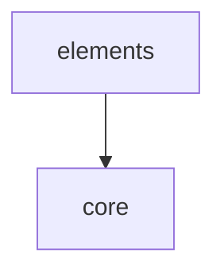

# Module: elements

<!--SECTION:MODULE_VISION-->

## 1. Module Vision

Встроенные примитивы prompt-kit: секции, списки, блоки, inline-элементы. Каждый — результат `definePromptElement` с предопределённой ролью и рендер-функциями.

[Scope spec → `../prompt-kit.spec.md`](../prompt-kit.spec.md)

<!--/SECTION:MODULE_VISION-->

<!--SECTION:MODULE_USAGE_EXAMPLE-->

## 2. Module Usage Example

```tsx
import {
  Prompt,
  PrimaryGoal,
  BeliefState,
  Axiom,
  HardForbidden,
  List,
  Code,
  Bold,
} from 'gennady/prompt-kit';

const directive = (
  <Prompt keywords="rules, safety">
    <PrimaryGoal>Следовать правилам безопасности.</PrimaryGoal>
    <BeliefState>
      <Axiom id="AX_SURGICAL">Минимальные правки.</Axiom>
      <Axiom id="AX_NO_SOLO">Без solo-решений.</Axiom>
    </BeliefState>
    <HardForbidden>
      <List>Редактировать без подтверждения. Читать за пределами артефакта.</List>
    </HardForbidden>
    <Code lang="ts" title="Пример">{`const x = 1`}</Code>
  </Prompt>
);
```

<!--/SECTION:MODULE_USAGE_EXAMPLE-->

<!--SECTION:ENTITY_INVENTORY-->

## 3. Entity Inventory (Closed-World)

_Это полный список сущностей модуля. Любое введение сущности execution-агентом помимо этого списка считается drift'ом и требует обновления spec._

Все элементы неявно принимают универсальный пропс `forcedFormat?: 'md' | 'xml'` (см. FR15 в scope spec).

| Name            | Surface | Type    | Purpose                                                                                                                                                                      |
| --------------- | ------- | ------- | ---------------------------------------------------------------------------------------------------------------------------------------------------------------------------- |
| `Prompt`        | 🟢      | Element | Корень сообщения. Роль `root`, пропс `keywords`                                                                                                                              |
| `PrimaryGoal`   | 🟢      | Element | Секция-цель. Роль `section`                                                                                                                                                  |
| `BeliefState`   | 🟢      | Element | Секция-контейнер для Axiom. Роль `section`                                                                                                                                   |
| `Axiom`         | 🟢      | Element | Аксиома с id. Роль `section`, пропс `id: string`                                                                                                                             |
| `HardForbidden` | 🟢      | Element | Секция-запреты. Роль `section`                                                                                                                                               |
| `Section`       | 🟢      | Element | Универсальная секция. Роль `section`, пропсы `title: string`, `id?: string`                                                                                                  |
| `List`          | 🟢      | Element | Список. Роль `list`, пропсы `ordered?: boolean`, `title?: string`                                                                                                            |
| `Code`          | 🟢      | Element | Блок кода. Роль `block`, пропсы `lang?: string`, `title?: string`                                                                                                            |
| `Bold`          | 🟢      | Element | Жирный текст. Роль `inline`                                                                                                                                                  |
| `Group`         | 🟢      | Element | Универсальный контейнер. Роль `section`. Пропс `is: string` — имя HTML-тега (потребляется, удаляется из атрибутов). Доп. пропсы становятся атрибутами                        |
| `Node`          | 🟢      | Element | Универсальный листовой элемент ключ-значение. Роль `property`. Пропс `is: string` — имя HTML-тега. `id?: string`. Доп. пропсы — атрибуты. md: `- **is:** text` в одну строку |
| `li`            | 🟢      | HtmlTag | Встроенный HTML-тег элемента списка. Рендеринг: XML `<Item>` / `<Step num="N">` в зависимости от ordered, MD transparent (см. FR11, FR17 scope spec)                         |

<!--/SECTION:ENTITY_INVENTORY-->

<!--SECTION:ENTITY_SURFACES-->

## 4. Entity Surfaces

### Встроенные примитивы

Все 🟢, Type: Element. Каждый создан через `definePromptElement`, роль предопределена. Публичная поверхность — объект с `tagName` и конфигом; потребляется JSX как `node.type`.

#### `Prompt`

- **Type:** Element
- **Purpose:** Корень сообщения. Задаёт keywords, обрамляет всё содержимое.
- **Public Properties:** `keywords?: string`
- **Public Operations:** N/A — используется как JSX-элемент
- **Lifecycle:** Stateless
- **Events Emitted:** N/A
- **Errors & Degradation:** N/A
- **Consumers:**
  - Internal: N/A
  - External: пользовательский код

#### `PrimaryGoal`

- **Type:** Element
- **Purpose:** Секция с целью агента. `includeBoundaryComments: true`.
- **Public Properties:** N/A (children only)
- **Consumers:** External — пользовательский код

#### `BeliefState`

- **Type:** Element
- **Purpose:** Секция-контейнер для Axiom. Наращивает depth для детей. `includeBoundaryComments: true`.
- **Public Properties:** N/A (children only)
- **Consumers:** External — пользовательский код

#### `Axiom`

- **Type:** Element
- **Purpose:** Аксиома с обязательным id. Заголовок в md включает `` `AX_...` ``. Якоря включают id.
- **Public Properties:** `id: string`
- **Consumers:** External — пользовательский код

#### `HardForbidden`

- **Type:** Element
- **Purpose:** Секция с запретами. `includeBoundaryComments: true`. Обычно содержит List.
- **Public Properties:** N/A (children only)
- **Consumers:** External — пользовательский код

#### `Section`

- **Type:** Element
- **Purpose:** Универсальная секция с произвольным заголовком и опциональным id.
- **Public Properties:** `title: string`, `id?: string`
- **Consumers:** External — пользовательский код

#### `List`

- **Type:** Element
- **Purpose:** Список. Все дети автоматически становятся строками списка. Поддерживает ordered и title.
- **Public Properties:** `ordered?: boolean`, `title?: string`
- **Consumers:** External — пользовательский код

#### `Code`

- **Type:** Element
- **Purpose:** Блок кода с опциональным языком и заголовком.
- **Public Properties:** `lang?: string`, `title?: string`
- **Consumers:** External — пользовательский код

#### `Bold`

- **Type:** Element
- **Purpose:** Жирный текст. Inline.
- **Public Properties:** N/A (children only)
- **Consumers:** External — пользовательский код

#### `Group`

- **Type:** Element
- **Purpose:** Универсальный контейнер. HTML-тег = `props.is`. Пропс `is` потребляется для имени тега и удаляется из атрибутов. Дополнительные пропсы становятся HTML-атрибутами.
- **Public Properties:** `is: string`, `[key: string]: unknown`
- **Consumers:** External — пользовательский код

#### `Node`

- **Type:** Element
- **Purpose:** Универсальный листовой элемент ключ-значение. Роль `property`. HTML-тег = `props.is`. В Markdown: `- **is:** text` в одну строку, без heading-префикса.
- **Public Properties:** `is: string`, `id?: string`, `[key: string]: unknown`
- **Consumers:** External — пользовательский код

#### `li`

- **Type:** HtmlTag (встроенный, lowercase)
- **Purpose:** Элемент списка внутри `<List>`. XML: `<Item>` без ordered, `<Step num="N">` с ordered (N из `ctx.listStep`). MD: transparent (только текст children).
- **Public Properties:** children only (text / inline elements)
- **Consumers:** External — пользовательский код, внутри `<List>`
<!--/SECTION:ENTITY_SURFACES-->

<!--SECTION:MODULE_CONTRACTS-->

## 5. Module Contracts (DbC)

### Module-level invariants

- Все примитивы — чистые декларации через `definePromptElement`. Ни один не содержит логики рендера вне конфига.
- Имена элементов — UpperCase (JSX-ограничение). Не конфликтуют с HTML-тегами (lowercase).
- `Section` с `id` генерирует якоря с id в имени. Без `id` — только имя элемента.
- `List` внутри списка: section-элементы схлопываются в строчную форму в md, сохраняют полный тег в xml.
- `Axiom.id` обязателен по контракту — отсутствие id при рендере не крашит систему, но семантика теряется (v1 — без валидации).
- `li` в ordered `<List>`: `num` атрибут `<Step>` берётся из `ctx.listStep` (начиная с 1). Без ordered: `<Item>` без атрибутов. В MD — transparent.
<!--/SECTION:MODULE_CONTRACTS-->

<!--SECTION:PUBLIC_OPTIONS-->

## 6. Public Options & Policies

N/A — модуль не имеет публичных опций сверх пропсов элементов.

<!--/SECTION:PUBLIC_OPTIONS-->

<!--SECTION:FILE_STRUCTURE-->

## 7. File Structure

```
elements/
├── prompt.ts
├── primary-goal.ts
├── belief-state.ts
├── axiom.ts
├── hard-forbidden.ts
├── section.ts
├── list.ts
├── code.ts
├── bold.ts
├── group.ts
├── node.ts
└── index.ts
```

**File Mapping:**

- `prompt.ts`: `Prompt`
- `primary-goal.ts`: `PrimaryGoal`
- `belief-state.ts`: `BeliefState`
- `axiom.ts`: `Axiom`
- `hard-forbidden.ts`: `HardForbidden`
- `section.ts`: `Section`
- `list.ts`: `List`
- `code.ts`: `Code`
- `bold.ts`: `Bold`
- `group.ts`: `Group`
- `node.ts`: `Node`
- `index.ts`: агрегирующий экспорт
<!--/SECTION:FILE_STRUCTURE-->

<!--SECTION:MODULE_DECISION_LOG-->

## 8. Module Decision Log

_Пусто — решения уровня scope зафиксированы в scope-спеке._

<!--/SECTION:MODULE_DECISION_LOG-->

<!--SECTION:INTER_MODULE_DEPENDENCIES-->

## 9. Inter-Module Dependencies

- **Depends on:** `core` (все примитивы используют `definePromptElement`)
- **Scope Reference (cross-scope):** N/A
- **Provides to:** внешние потребители



<!--/SECTION:INTER_MODULE_DEPENDENCIES-->

<!--SECTION:HANDOFF-->

## 10. Handoff to task scaffolding

- **Implementation files to be created:** `elements/prompt.ts`, `elements/primary-goal.ts`, `elements/belief-state.ts`, `elements/axiom.ts`, `elements/hard-forbidden.ts`, `elements/section.ts`, `elements/list.ts`, `elements/code.ts`, `elements/bold.ts`, `elements/group.ts`, `elements/node.ts`, `elements/index.ts`
- **Test files to be created:** `elements/__tests__/elements.test.ts`
- **Fixture test files:** каждый встроенный примитив — фикстура.

  Структура: `elements/__tests__/fixtures/<case-name>/`

  ```
  <case-name>/
  ├── input.tsx            # JSX с элементом
  └── expected.xml         # ожидаемый XML
  └── expected.md          # ожидаемый Markdown
  ```

  _Критические кейсы (по одному на каждый элемент):_
  - `prompt-basic` — Prompt с keywords, дети
  - `prompt-no-keywords` — Prompt без keywords
  - `primary-goal` — PrimaryGoal с текстом
  - `belief-state` — BeliefState с Axiom'ами внутри
  - `axiom` — Axiom с id
  - `hard-forbidden` — HardForbidden с List внутри
  - `section-basic` — Section с title
  - `section-with-id` — Section с title и id → якоря с id
  - `list-ordered` — List ordered, элементы-строки
  - `list-unordered` — List без ordered
  - `list-title` — List с title → **{title}:**
  - `code-basic` — Code с lang
  - `code-with-title` — Code с lang и title
  - `bold` — Bold внутри текста
  - `group-basic` — Group с is + children
  - `group-with-attributes` — Group с is + доп. пропсы (атрибуты)
  - `node-basic` — Node с is + children
  - `node-with-id` — Node с is + id
  - `li-ordered` — li внутри ordered List → `<Step num="N">`
  - `li-unordered` — li внутри unordered List → `<Item>`

- **Stack dependencies:**
  - Language: `TypeScript` (resolves to `ai/directives/coding/typescript-rules.xml`)
  - Test framework: `node:test` (resolves to `ai/directives/testing/node-test.xml`)
- **Module Rules Additions:** None
- **Open risks & validation needs:** Полный набор встроенных HTML-тегов уточнить при реализации. Фикстуры гарантируют, что каждый примитив рендерится ожидаемо в обоих форматах.
<!--/SECTION:HANDOFF-->
