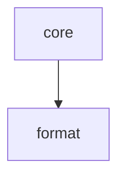

# Module: format

<!--SECTION:MODULE_VISION-->

## 1. Module Vision

Движки форматирования: XML-сериализация, Markdown-сериализация, отступы, переносы, якоря, пунктуация списков, рендер таблиц. Вызываются из `core/TreeWalker`, публичной поверхности не имеют.

[Scope spec → `../prompt-kit.spec.md`](../prompt-kit.spec.md)

<!--/SECTION:MODULE_VISION-->

<!--SECTION:MODULE_USAGE_EXAMPLE-->

## 2. Module Usage Example

```ts
// Форматеры вызываются только из core/TreeWalker.
// Пользователь их не импортирует напрямую.

// XmlFormatter получает контекст и рендерит:
//   tag: 'Axiom'
//   props: { id: 'AX_1' }
//   children: 'текст аксиомы'
//   depth: 2
// → '    <Axiom id="AX_1">\n      текст аксиомы\n    </Axiom>'

// MdFormatter:
// → '### AXIOM `AX_1`:\n<!--START_AXIOM_AX_1-->\nтекст аксиомы\n<!--END_AXIOM_AX_1-->'
```

<!--/SECTION:MODULE_USAGE_EXAMPLE-->

<!--SECTION:ENTITY_INVENTORY-->

## 3. Entity Inventory (Closed-World)

_Это полный список сущностей модуля. Любое введение сущности execution-агентом помимо этого списка считается drift'ом и требует обновления spec._

| Name              | Surface | Type      | Purpose                                                                   |
| ----------------- | ------- | --------- | ------------------------------------------------------------------------- |
| `XmlFormatter`    | ⚪      | Formatter | Сериализует дерево в XML-строку: теги, атрибуты, отступы                  |
| `MdFormatter`     | ⚪      | Formatter | Сериализует дерево в Markdown: заголовки, списки, таблицы, якоря, inline  |
| `SpacingEngine`   | ⚪      | Utility   | Вычисляет отступы и переносы между соседями на основе ролей               |
| `AnchorBuilder`   | ⚪      | Utility   | Строит имена и текст якорей `<!--START_...--> / <!--END_...-->`           |
| `ListPunctuation` | ⚪      | Utility   | Ставит `;` / `.` в конце элемента списка, пропускает если уже есть знак   |
| `TableRenderer`   | ⚪      | Utility   | Преобразует `table/tr/td` в Markdown-таблицу. `thead`/`tbody` — прозрачны |

<!--/SECTION:ENTITY_INVENTORY-->

<!--SECTION:ENTITY_SURFACES-->

## 4. Entity Surfaces

### `XmlFormatter`

- **Type:** Formatter (⚪)
- **Purpose:** Рендерит узел дерева в XML-строку с правильными отступами и атрибутами.
- **Public Properties:** N/A
- **Public Operations:** `formatElement(tag, props, children, depth) → string`, `formatInline(tag, props, children) → string`
- **Lifecycle:** Stateless, вызывается TreeWalker'ом на каждый узел
- **Events Emitted:** N/A
- **Errors & Degradation:** N/A — чистый рендер
- **Consumers:**
  - Internal: `core/TreeWalker`

### `MdFormatter`

- **Type:** Formatter (⚪)
- **Purpose:** Рендерит узел дерева в Markdown: заголовки (`#` по depth), списки, таблицы, якоря, inline-форматирование.
- **Public Properties:** N/A
- **Public Operations:** `formatSection(title, children, depth, anchors) → string`, `formatList(children, ordered, title) → string`, `formatBlock(children, lang, title) → string`, `formatInline(wrapper, children) → string`
- **Lifecycle:** Stateless, вызывается TreeWalker'ом на каждый узел
- **Events Emitted:** N/A
- **Errors & Degradation:** N/A
- **Consumers:**
  - Internal: `core/TreeWalker`

### `SpacingEngine`

- **Type:** Utility (⚪)
- **Purpose:** Вычисляет префиксные и постфиксные переносы/отступы для элемента на основе его роли и ролей соседей.
- **Public Operations:** `before(role, prevRole, depth) → string`, `after(role, nextRole, depth) → string`
- **Consumers:** Internal — `XmlFormatter`, `MdFormatter`

### `AnchorBuilder`

- **Type:** Utility (⚪)
- **Purpose:** Строит имя якоря из `[tagName, ...sortedPropValues].join('_').toUpperCase()` и генерирует парные комментарии.
- **Public Operations:** `buildStart(tagName, props) → string`, `buildEnd(tagName, props) → string`
- **Consumers:** Internal — `MdFormatter`

### `ListPunctuation`

- **Type:** Utility (⚪)
- **Purpose:** Для каждого элемента списка определяет концевой знак: `;` (не последний), `.` (последний). Пропускает, если в тексте уже есть `.`, `!`, `?`, `;`.
- **Public Operations:** `punctuate(text, isLast) → string`
- **Consumers:** Internal — `MdFormatter`, `XmlFormatter`

### `TableRenderer`

- **Type:** Utility (⚪)
- **Purpose:** Преобразует HTML-таблицу в Markdown-формат. `thead`/`tbody` пропускаются (рендерятся только children). `tr` → строка таблицы, `td`/`th` → ячейка.
- **Public Operations:** `renderToMd(children) → string`
- **Consumers:** Internal — `MdFormatter`
<!--/SECTION:ENTITY_SURFACES-->

<!--SECTION:MODULE_CONTRACTS-->

## 5. Module Contracts (DbC)

### XmlFormatter

- **Preconditions:** `tag` — непустая строка. `children` — уже отрендеренная строка. `props` — объект (может быть пустым).
- **Postconditions:** Возвращает XML-строку вида `<tag attr="val">\n{indented children}\n</tag>`. Атрибуты экранируются: `&` → `&amp;`, `<` → `&lt;`, `>` → `&gt;`, `"` → `&quot;`. Текстовое содержимое экранируется так же. Пустые дети → самозакрывающийся тег `<tag attr="val"/>`.
- **Invariants:** Отступ = depth × 2 пробела. Inline-элементы — без переноса, в одну строку.

### MdFormatter

- **Preconditions:** `title` / `children` — строки. `depth` — целое ≥ 0.
- **Postconditions:**
  - `formatSection`: `{'#'.repeat(depth + 1)} {title}:\n\n{children}`. Якоря — start перед заголовком, end после детей.
  - `formatList`: `{title prefix}\n{item prefix}{children}`. `ordered`: `1. ` / `2. `; unordered: `- `. Title → `**{title}:**\n`.
  - `formatBlock`: `**{title}:**\n\`\`\`{lang}\n{children}\n\`\`\`` (title опционален).
- **Invariants:** depth 0 → `#`, depth 1 → `##`. Inline-обёртка симметрична (`**` ... `**`, `*` ... `*`).

### SpacingEngine

- **Preconditions:** `role` ∈ `{root, section, block, inline, list}`. `prevRole` / `nextRole` могут быть null.
- **Postconditions:** Возвращает строку из `\n` и пробелов. Inline-элементы — всегда пустая строка.
- **Invariants:** Между секциями — пустая строка. После списка — пустая строка. Перед/после блока кода — пустая строка. Секция внутри списка не добавляет переносов.

### AnchorBuilder

- **Preconditions:** `tagName` — непустая строка. `props` — объект (может быть пустым).
- **Postconditions:** `start` и `end` якоря парные. Формат: `<!--START_{NAME}-->` / `<!--END_{NAME}-->`. При повторном вызове с теми же параметрами — якорь не выводится (указывает на первое вхождение).
- **Invariants:** Имя якоря — `[tagName, ...sortedPropValues].join('_').toUpperCase()`. Сортировка — по ключу (key-sorted). Нестроковые значения → `String(value)`.

### ListPunctuation

- **Preconditions:** `text` — строка (может быть пустой).
- **Postconditions:** Добавляет `;` или `.` только если последний символ текста не является концевым знаком (`.`, `!`, `?`, `;`).
- **Invariants:** Не-последний элемент → `;`, последний → `.`.

### TableRenderer

- **Preconditions:** Дети — `tr` элементы (возможно внутри `thead`/`tbody`).
- **Postconditions:** Markdown-таблица: `| cell | cell |\n|-----|-----|\n| ... |`. `thead`/`tbody` в выводе отсутствуют.
- **Invariants:** Количество колонок — по первой строке. Если в строке меньше ячеек — дополняется пустыми. Если больше — лишние отбрасываются. `th` → жирный в первой строке.
<!--/SECTION:MODULE_CONTRACTS-->

<!--SECTION:PUBLIC_OPTIONS-->

## 6. Public Options & Policies

N/A — модуль не имеет публичных опций. Все форматеры — внутренние.

<!--/SECTION:PUBLIC_OPTIONS-->

<!--SECTION:FILE_STRUCTURE-->

## 7. File Structure

```
format/
├── xml-formatter.ts
├── md-formatter.ts
├── spacing-engine.ts
├── anchor-builder.ts
├── list-punctuation.ts
├── table-renderer.ts
└── index.ts
```

**File Mapping:**

- `xml-formatter.ts`: `XmlFormatter`
- `md-formatter.ts`: `MdFormatter`
- `spacing-engine.ts`: `SpacingEngine`
- `anchor-builder.ts`: `AnchorBuilder`
- `list-punctuation.ts`: `ListPunctuation`
- `table-renderer.ts`: `TableRenderer`
- `index.ts`: внутренний экспорт для core
<!--/SECTION:FILE_STRUCTURE-->

<!--SECTION:MODULE_DECISION_LOG-->

## 8. Module Decision Log

_Пусто — решения уровня scope зафиксированы в scope-спеке._

<!--/SECTION:MODULE_DECISION_LOG-->

<!--SECTION:INTER_MODULE_DEPENDENCIES-->

## 9. Inter-Module Dependencies

- **Depends on:** N/A (листовой модуль)
- **Scope Reference (cross-scope):** N/A
- **Provides to:** `core`



<!--/SECTION:INTER_MODULE_DEPENDENCIES-->

<!--SECTION:HANDOFF-->

## 10. Handoff to task scaffolding

- **Implementation files to be created:** `format/xml-formatter.ts`, `format/md-formatter.ts`, `format/spacing-engine.ts`, `format/anchor-builder.ts`, `format/list-punctuation.ts`, `format/table-renderer.ts`, `format/index.ts`
- **Test files to be created:** `format/__tests__/xml-formatter.test.ts`, `format/__tests__/md-formatter.test.ts`, `format/__tests__/spacing-engine.test.ts`, `format/__tests__/list-punctuation.test.ts`, `format/__tests__/table-renderer.test.ts`
- **Fixture test files (primary validation strategy):** формат — зона особого внимания. Валидация через фикстуры на диске, не через снапшоты.

  Структура: `format/__tests__/fixtures/<case-name>/`

  ```
  <case-name>/
  ├── input.tsx            # JSX-дерево (вызов renderPrompt)
  └── expected.xml        # ожидаемый XML-вывод
  └── expected.md          # ожидаемый Markdown-вывод
  ```

  _Критические кейсы (обязательный минимум):_
  - `nested-sections` — три уровня вложенности секций. Проверка `depth` → `#`/`##`/`###` и отступов в xml
  - `section-inside-list` — секция внутри List. Md: строчная форма. Xml: полный тег
  - `list-ordered` — ordered list, нумерация 1/2/3
  - `list-unordered` — маркированный список, `-`
  - `list-title` — List с title → `**{title}:**`
  - `list-punctuation` — `;` и `.`, пропуск если уже есть знак
  - `list-nested-sections` — несколько секций внутри списка, каждая → строчная форма в md
  - `code-block` — Code с lang и title
  - `code-inside-list` — Code внутри List, отступы
  - `table-basic` — table/tr/td → markdown-таблица
  - `table-thead-tbody` — thead/tbody прозрачны в выводе
  - `anchors-section` — Section с includeBoundaryComments, якоря парные
  - `anchors-with-id` — Axiom с id, якоря с id в имени
  - `anchors-collision` — две секции с одинаковыми параметрами, вторая без якоря
  - `inline-mixed` — Bold + текст + em в одной строке
  - `prompt-keywords` — Prompt с keywords, заголовок в md, атрибут в xml
  - `empty-children` — секция без детей, список без элементов
  - `deep-nesting` — 5+ уровней, проверка что отступы не ломаются

- **Unit test files (дополнительно):** `format/__tests__/spacing-engine.test.ts`, `format/__tests__/list-punctuation.test.ts`, `format/__tests__/table-renderer.test.ts`, `format/__tests__/anchor-builder.test.ts` — тесты на граничные значения методов
- **Stack dependencies:**
  - Language: `TypeScript` (resolves to `ai/directives/coding/typescript-rules.xml`)
  - Test framework: `node:test` (resolves to `ai/directives/testing/node-test.xml`)
- **Module Rules Additions:** None
- **Open risks & validation needs:** Markdown-таблицы с colspan/rowspan не поддерживаются в v1. Фикстуры — единственный достоверный способ поймать расхождение в форматировании.
<!--/SECTION:HANDOFF-->

## Critic Rounds

### Round 1 — 2026-06-06

- Verdict: NEEDS_WORK
- Accepted: 5 — Formatters без DbC, TableRenderer mismatch, SpacingEngine role set, AnchorBuilder sort, handoff title
- Rejected: 0
- Changes: добавлены контракты XmlFormatter/MdFormatter; TableRenderer: pad пустыми ячейками при mismatch; SpacingEngine: роли перечислены; AnchorBuilder: key-sorted + String(); handoff title починен
