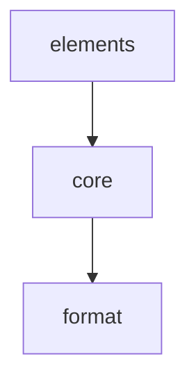

# prompt-kit: Library Specification

<!--SECTION:SCOPE_TYPE-->

## scope-type

library

<!--/SECTION:SCOPE_TYPE-->

<!--SECTION:VISION-->

## 1. Vision & Primary Goal

Библиотека для декларативного описания промптов через JSX-компоненты. Разработчик собирает сообщение из семантических примитивов, рендерит в XML-подобный формат или Markdown — и отправляет агенту как строку.

<!--/SECTION:VISION-->

<!--SECTION:GOLDEN_DX-->

## 2. Approved Golden DX Example (composition view)

Публичная поверхность собирается из трёх модулей. Полный сценарий — см. usage-примеры каждого модуля.

```tsx
// 1. Описываем промпт — module: elements
//    см. [elements/usage](./elements/elements.spec.md#2-module-usage-example)
import { Prompt, Axiom, List, Code, Bold } from 'gennady/prompt-kit';

// 2. Или создаём свой элемент — module: core
//    см. [core/usage](./core/core.spec.md#2-module-usage-example)
import { definePromptElement } from 'gennady/prompt-kit';

const MyAxiom = definePromptElement<{ id: string }>({
  role: 'section',
  markdown: {
    title: ({ tagName, props }) => `${tagName} \`${props.id}\``,
    includeBoundaryComments: true,
  },
});

const directive = (
  <Prompt keywords="rules, safety">
    <MyAxiom id="AX_1">
      Не менять <Bold>архитектуру</Bold> без подтверждения.
    </MyAxiom>
    <List ordered title="Порядок">
      <Code lang="ts" title="Пример">{`const x = 1`}</Code>
      текст
    </List>
  </Prompt>
);

// 3. Рендерим — module: core
//    Форматеры (module: format) вызываются движком автоматически.
import { renderPrompt } from 'gennady/prompt-kit';

const xml = renderPrompt(directive, {}, 'xml');
const md = renderPrompt(directive, {}, 'md');
```

<!--/SECTION:GOLDEN_DX-->

<!--SECTION:REQUIREMENTS_AND_CONSTRAINTS-->

## 3. Requirements & Constraints

### 3.1 Functional Requirements

- **FR1 · Декларация промпта через JSX** — пользователь описывает сообщение деревом JSX-элементов. Корень — один элемент-сообщение (Prompt).
- **FR2 · Мультиформатный рендер** — одно дерево рендерится в `'xml'` и `'md'`. JSON — v2.
- **FR3 · Встроенные примитивы** — Prompt (root), PrimaryGoal / BeliefState / Axiom / HardForbidden / Section (section), List (list), Code (block), Bold (inline). Em / Underline / Paragraph / Table / Row / Cell — покрываются FR11 (HTML-теги `em`, `u`, `p`, `table`, `tr`, `td`).
- **FR4 · Пользовательские элементы** — `definePromptElement<Props>(config)` создаёт новый элемент. Движок из конфига знает роль, заголовок, форматирование, якоря.
- **FR5 · Атрибуты элементов** — пропсы типизируются через generic `definePromptElement<Props>`. Движок пробрасывает их в рендер-функции. В xml пропсы сериализуются в атрибуты: строки/числа/булевы — напрямую, объекты/массивы — `JSON.stringify` с последующим XML-экранированием. Функции в пропсах → `Error`.
- **FR6 · Композиция и вложенность** — элементы вкладываются произвольно. Рендер рекурсивный: дети рендерятся раньше родителя, результат передаётся родителю.
- **FR7 · Авто-форматирование движком** — переносы строк, отступы, уровни заголовков (`#` в md) вычисляются движком на основе роли, depth и контекста. Пользователь не пишет `\n` и ` ` вручную.
- **FR8 · Контекстный рендер** — поведение элемента зависит от контекста (внутри списка или нет, уровень вложенности).
- **FR9 · Якоря в Markdown** — секционные элементы с `includeBoundaryComments: true` получают `<!--START_{NAME}[_{ID}]-->` / `<!--END_{NAME}[_{ID}]-->`. Имя строится из `[tagName, ...sortedPropValues].join('_').toUpperCase()`. Если секция с одинаковыми параметрами встречается повторно — не добавляется (якорь указывает на первое вхождение).
- **FR10 · Прозрачные компоненты** — обычная функция-компонент (не созданная через `definePromptElement`) не имеет представления: рендерятся только children, пропсы игнорируются.
- **FR11 · Встроенные HTML-теги** — `b`, `em`, `i`, `u`, `strong`, `p`, `table`, `thead`, `tbody`, `tr`, `th`, `td` распознаются движком и рендерятся в соответствии с форматом:
  - xml: as-is, с атрибутами. Текстовое содержимое и значения атрибутов экранируются: `&` → `&amp;`, `<` → `&lt;`, `>` → `&gt;`, `"` → `&quot;`
  - md: `b` → `**`, `em` → `*`, `table` → markdown-таблица, `p` → пустая строка до и после
- **FR12 · Авто-пунктуация списка** — `;` в конце каждого элемента, `.` в конце последнего. Пропускается, если последний символ текста уже является концевым знаком: `.`, `!`, `?`, `;`.

### 3.2 Non-Functional Constraints

- **NFR1** — Node.js 22+, zero runtime-зависимостей.
- **NFR2** — Экспортируется через `gennady/prompt-kit`.
- **NFR3** — Рендер синхронный: `renderPrompt(component, props, format) → string`.
- **NFR4** — Толерантность к разным JSX-рантаймам: дерево может быть создано React, Preact или любым совместимым jsx-трансформером. Движок нормализует структуру.
- **NFR5** — Использует существующий `"jsx": "react-jsx"` в tsconfig репозитория. Не требует своего `jsxImportSource`.

### 3.3 Out-of-Scope

- JSON-формат (v2)
- Валидация структуры промпта (обязательные секции, порядок)
- Асинхронные компоненты
- Стриминг-рендер
- Интеграция с AI SDK

### 3.4 Runtime Backing & Deferred Scope

Все возможности — `real-runtime`. Библиотека — чистый строковый рендер, без сетевых вызовов, без персистентности, без trust boundaries.

### 3.5 Rules

| Rule             | Category | Source                                    |
| ---------------- | -------- | ----------------------------------------- |
| typescript-rules | coding   | ai/directives/coding/typescript-rules.xml |

<!--/SECTION:REQUIREMENTS_AND_CONSTRAINTS-->

<!--SECTION:PUBLIC_API_SURFACE-->

## 4. Public API Surface

### Ядро

```ts
const PROMPT_ELEMENT_BRAND = Symbol('prompt-element');

function definePromptElement<Props>(config: PromptElementConfig<Props>): PromptElement<Props>;

function renderPrompt(
  tree: JSXNode | ((props: any) => JSXNode),
  props: Record<string, unknown>,
  format: 'xml' | 'md'
): string;

type PromptElement<Props> = {
  (props: Props): JSXNode;
  [PROMPT_ELEMENT_BRAND]: true;
  tagName: string;
  config: PromptElementConfig<Props>;
};

type JSXNode = {
  type: PromptElement<any> | string | Function;
  props: Record<string, unknown>;
  children?: JSXNode[];
};
```

Рендер различает `PromptElement` (brand symbol) и обычную функцию (transparent): `PromptElement` рендерится по конфигу, обычная функция — прозрачно.

`renderPrompt` оборачивает вызов компонента и рекурсивный обход в try/catch. При ошибке → выбрасывает `Error` с исходной ошибкой как `cause`, префикс `[prompt-kit]`. Частичный вывод не возвращается.

Нормализатор (`JSXTreeNormalizer` в core) приводит любой вход к этому каноническому виду:

- `children` внутри `props.children` → извлекается в `node.children`
- Фрагменты (`Symbol.for('react.fragment')`, `<>...</>`) → плоский массив children
- Примитивы (`string`, `number`, `boolean`) → оборачиваются в текстовый узел
- `null`, `undefined` → узел с пустым children
- `children`-как-аргумент (Preact-стиль) → `node.children`

### PromptElementConfig

```ts
type PromptElementConfig<Props> = {
  role: 'root' | 'section' | 'block' | 'inline' | 'list';
  markdown?: {
    title?: (ctx: { tagName: string; props: Props; depth: number }) => string;
    renderChildren?: (ctx: { children: string; props: Props }) => string;
    renderChildElement?: (ctx: { children: string; props: Props; index: number }) => string;
    includeBoundaryComments?: boolean;
  };
  xml?: {
    renderChildren?: (ctx: { children: string; props: Props }) => string;
    renderChildElement?: (ctx: { children: string; props: Props; index: number }) => string;
  };
};
```

Роли:

- `root` — корень сообщения. xml: `<Prompt keywords="...">\n{children}\n</Prompt>`. md: `## KEYWORDS:\n{keywords}\n\n{children}`. Если keywords отсутствует — заголовок/атрибут не выводится.
- `section` — заголовок + тело. Влияет на depth. Внутри списка схлопывается в строчную форму.
- `block` — блочный элемент (код). Не влияет на depth.
- `inline` — строчный. Не влияет на depth, не добавляет переносов.
- `list` — контейнер списка. Дети автоматически становятся строками списка.

### Встроенные примитивы (из коробки)

| Элемент         | Роль    | Пропсы                                |
| --------------- | ------- | ------------------------------------- |
| `Prompt`        | root    | `keywords?: string`                   |
| `PrimaryGoal`   | section | —                                     |
| `BeliefState`   | section | —                                     |
| `Axiom`         | section | `id: string`                          |
| `HardForbidden` | section | —                                     |
| `Section`       | section | `title: string`, `id?: string`        |
| `List`          | list    | `ordered?: boolean`, `title?: string` |
| `Code`          | block   | `lang?: string`, `title?: string`     |
| `Bold`          | inline  | —                                     |

### Встроенные HTML-теги (распознаются по строковому имени)

`b`, `em`, `i`, `u`, `strong`, `p`, `table`, `thead`, `tbody`, `tr`, `th`, `td`

<!--/SECTION:PUBLIC_API_SURFACE-->

<!--SECTION:ARCHITECTURE-->

## 5. Architecture

### Поток рендера

```
[tsx-файл] → tsc (react-jsx) → {type, props, children} → renderPrompt() → рекурсивный обход → строка
```

`renderPrompt` вызывает функцию-компонент (или принимает готовое JSX-дерево), получает JSX-дерево, обходит узлы:

1. `node.type` — объект с `Symbol('prompt-element')` → рендер по конфигу
2. `node.type` — строка (`b`, `table`, `em`...) → встроенный рендер
3. `node.type` — функция без brand → прозрачно, рендерятся только children
4. `node.type` — не попадает под 1–3 → `Error('[prompt-kit] unknown element type: <type>')`

Движок передаёт контекст: `depth` (уровень секционной вложенности), `inList` (контекст списка). Элемент на основе контекста выбирает полное или компактное представление.

### Решения

- **Единая фабрика** — `definePromptElement` вместо отдельных функций под каждую роль. Роль и опциональные рендер-функции — достаточный API.
- **Движок управляет форматированием** — отступы, переносы, пунктуация списка, уровни заголовков. Элемент говорит «что», движок — «как».
- **Толерантность к JSX-деревьям** — не привязаны к конкретному рантайму. Читаем `type`/`props`/`children`, нормализуем.
- **Прозрачные компоненты** — обычные функции-компоненты без `definePromptElement` невидимы в выводе. Позволяют декомпозицию без влияния на результат.

### 5.1 Rejected Alternatives

- **React/Preact как зависимость** — лишний вес для строкового рендера.
- **Свой jsxImportSource** — не нужен: репозиторий уже использует `react-jsx`, prompt-kit читает готовое дерево.
- **Ручное форматирование (`\n`, ` `) в элементах** — плодит баги с отступами, убивает DRY. Движок считает сам.
<!--/SECTION:ARCHITECTURE-->

<!--SECTION:DECISION_LOG-->

## 6. Decision Log

### D-001 — Единая фабрика definePromptElement

- **Status:** active
- **Recorded:** session Discovery, prompt-kit
- **Why:** Одна точка создания элементов с ролью вместо набора фабрик (`defineSection`, `defineInline`, `defineList`). Меньше API, гибче.
- **Risk accepted:** Нет валидации несовместимых комбинаций (например, `role: 'inline'` с `title`).
- **Rejected alternatives:** `defineSection` / `defineInline` / `defineList` — дробит API без выигрыша в типобезопасности.

### D-002 — Движок управляет форматированием

- **Status:** active
- **Recorded:** session Discovery, prompt-kit
- **Why:** Отступы, переносы, пунктуация, уровни заголовков — зона движка. Элемент задаёт семантику, движок — представление. Убирает дублирование и баги с `\n`.
- **Risk accepted:** Сложные структуры могут потребовать ручного управления — тогда `renderChildren` / `renderChildElement` дают точечный контроль.
- **Rejected alternatives:** Каждый элемент сам форматирует — плодит `\n` и ` `, расходится между элементами.

### D-003 — Толерантность к JSX-рантаймам

- **Status:** active
- **Recorded:** session Discovery, prompt-kit
- **Why:** Дерево может быть создано React, Preact, или любым jsx-трансформером. Движок нормализует структуру, не привязан к `$$typeof` или конкретному формату пропсов.
- **Risk accepted:** Глубоко нестандартные рантаймы могут требовать расширения нормализатора.
- **Rejected alternatives:** Привязка к React-дереву — режет потребителей без причины.

### D-004 — Встроенные HTML-теги

- **Status:** active
- **Recorded:** session Discovery, prompt-kit
- **Why:** `b`, `em`, `table`, `tr`, `td` и другие — стандартные имена, которые движок знает из коробки. Пользователь не объявляет их через `definePromptElement`.
- **Risk accepted:** Конфликт имён с пользовательскими элементами (маловероятно — lowercase vs UpperCase).
- **Rejected alternatives:** Объявлять каждый тег явно — boilerplate.

### D-005 — Прозрачные компоненты

- **Status:** active
- **Recorded:** session Discovery, prompt-kit
- **Why:** Обычная функция-компонент не имеет представления в выводе. Позволяет декомпозицию (`MySection = () => <Section>...</Section>`) без влияния на результат.
- **Risk accepted:** Пользователь может ожидать, что его компонент породит тег.
- **Rejected alternatives:** Рендерить имя функции как тег — смешивает декомпозицию и семантику.

### D-006 — Zero runtime dependencies

- **Status:** active
- **Recorded:** session Discovery, prompt-kit
- **Why:** Проектный стандарт (gennady). Чистый строковый рендер не требует внешних библиотек.
- **Risk accepted:** Отсутствие экосистемы плагинов.
- **Rejected alternatives:** Зависимость от React — противоречит цели.

### D-007 — Использование существующего react-jsx

- **Status:** active
- **Recorded:** session Discovery, prompt-kit
- **Why:** Репозиторий уже настроен на `"jsx": "react-jsx"`. Prompt-kit читает готовое дерево, не требует своего `jsxImportSource`. 8 существующих .tsx файлов (agent-mon UI на ink) продолжают работать без изменений.
- **Risk accepted:** При смене jsx-настройки в корневом tsconfig нужно проверить совместимость.
- **Rejected alternatives:** Свой `jsxImportSource` — ломает agent-mon UI.

### D-008 — Экспорт через gennady/prompt-kit

- **Status:** active
- **Recorded:** session Discovery, prompt-kit
- **Why:** Библиотека — часть репозитория, импортируется как `gennady/prompt-kit`.
- **Risk accepted:** Зависимость от основного пакета — при разделении репозиториев потребуется переименование.
- **Rejected alternatives:** Отдельный npm-пакет — усложняет разработку и синхронизацию версий.

### D-009 — Декомпозиция по слоям (core + elements + format)

- **Status:** active
- **Recorded:** session ModuleDecomposition, prompt-kit
- **Why:** Три модуля с чёткими границами: алгоритмы ядра не знают про элементы, элементы не знают про форматы. Расширение (новый примитив, новый формат) — точечное, без каскада.
- **Risk accepted:** Три модуля для небольшой библиотеки — может ощущаться как перебор на старте.
- **Rejected alternatives:** Монолит (всё в одном модуле) — превратится в свалку при добавлении JSON-формата и новых элементов; декомпозиция по ролям (7 модулей) — избыточно для v1.
<!--/SECTION:DECISION_LOG-->

<!--SECTION:SCOPE_DEPENDENCIES-->

## 7. Scope Dependencies

- **Depends on:** infra-base (TypeScript, prettier, node:test, vite)
- **Provides to:** cli, ai-skills
<!--/SECTION:SCOPE_DEPENDENCIES-->

<!--SECTION:BOOTSTRAP_REQUIREMENTS-->

## 8. Bootstrap Requirements

| Requirement                  | Kind       | Owner           | Resolution                                                          |
| ---------------------------- | ---------- | --------------- | ------------------------------------------------------------------- |
| Экспорт `gennady/prompt-kit` | structural | this-scope-task | Добавить `./prompt-kit` и `./prompt-kit/*` в `exports` package.json |
| Директория `prompt-kit/`     | structural | this-scope-task | Создать корневую директорию                                         |

<!--/SECTION:BOOTSTRAP_REQUIREMENTS-->

<!--SECTION:MODULE_MAP-->

## 9. Module Map

Spec hierarchy is materialized at `specs/prompt-kit/`. Module specs are at `specs/prompt-kit/<module>/<module>.spec.md`.

### 9.1 Modules

- [core](./core/core.spec.md) — ядро: definePromptElement, renderPrompt, обход дерева, нормализация JSX, разрешение элементов
- [elements](./elements/elements.spec.md) — встроенные примитивы: Prompt, PrimaryGoal, BeliefState, Axiom, HardForbidden, Section, List, Code, Bold
- [format](./format/format.spec.md) — движки форматирования: XML, Markdown, отступы, якоря, пунктуация, таблицы

### 9.2 Inter-Module Dependency Map



### 9.3 Stack Dependencies

- Languages: TypeScript
- Test frameworks: node:test
<!--/SECTION:MODULE_MAP-->

<!--SECTION:HANDOFF-->

## 10. Handoff to module-decomposition

- **Primary input:** `specs/prompt-kit/prompt-kit.spec.md`
- **Areas requiring decomposition:** decomposition complete — core, elements, format
- **Named abstractions:** `definePromptElement`, `renderPrompt`, `PromptElement`, `PromptElementConfig`, `Prompt`, `PrimaryGoal`, `BeliefState`, `Axiom`, `HardForbidden`, `Section`, `List`, `Code`, `Bold`
- **Bootstrap tickets ready for cascade:** see 8
- **Open risks:** полный набор встроенных HTML-тегов уточнить при реализации
<!--/SECTION:HANDOFF-->

## Critic Rounds

### Round 1 — 2026-06-06

- Verdict: NEEDS_WORK
- Accepted: 3 — JSXNode тип не определён, нормализация недоописана, дубликат §9.4 с placeholder
- Rejected: 0
- Reconcile: N/A
- Changes: добавлен тип JSXNode + контракт нормализации; удалён дубликат §9.4

### Round 2 — 2026-06-06

- Verdict: NEEDS_WORK
- Accepted: 3 — PromptElement неотличим от transparent (brand symbol), FR3 противоречит API surface, renderPrompt не обрабатывает throw
- Rejected: 0
- Reconcile: N/A
- Changes: добавлен `Symbol('prompt-element')` brand; FR3 исправлен (Em/Underline/Table → FR11); renderPrompt try/catch + Error; JSXNode тип

### Round 3 — 2026-06-06

- Verdict: NEEDS_WORK
- Accepted: 6 — renderPrompt сигнатура vs Golden DX, XML escaping, keywords effect, anchor collision, unrecognised node.type, html→xml naming
- Rejected: 0
- Changes: renderPrompt принимает JSXNode | Function; XML escaping в FR11; keywords специфицирован; anchor collision → первое вхождение; unrecognised type → Error; html→xml в PromptElementConfig
