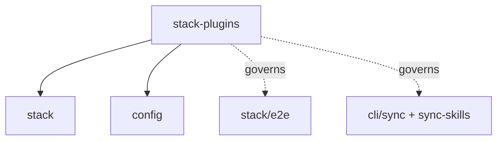

# stack-plugins: Infrastructure Specification

## scope-type

infrastructure

## 1. Vision

**Плагин — это один каталог.** Всё, что принадлежит стеку — реализация, спека, директивы, скиллы, юнит-тесты, E2E-фикстуры — лежит в `stack-plugins/<id>/` и больше нигде. Основной репозиторий не хранит ни одного файла, принадлежащего плагину, и узнаёт о плагинах только через **резолвер**.

Проблема, которую это решает: сегодня `golang` живёт в шести деревьях (`services/stack/plugins/golang/`, `specs/stack/plugins/golang/`, `ai/directives/infra/`, `ai/skills/`, `__tests__/e2e/fixtures/golang/`, плюс точка входа E2E-набора). Добавить стек — значит тронуть шесть мест и не забыть ни одного; вынести стек наружу — значит собрать его по репозиторию вручную. Это же блокирует [D-STACK-001](../stack/stack.spec.md) (внешние плагины отложены «без дизайна»): «плагин — это каталог с манифестом» и **есть** тот отсутствующий дизайн.

**Критерий приёмки — submodule-тест.** Заменяем `stack-plugins/golang/` на git-submodule и спрашиваем:

1. Изменилось ли что-нибудь для основного репозитория? — **Нет.**
2. Самодостаточен ли плагин? — **Да.**

Оба ответа обязаны сохраняться после любой правки. Тест не риторический: он проверяется механически (§6).

**Почему `stack-plugins/` в корне, а не `services/stack/plugins/`.** Каталог не является частью сервиса `stack`: он — точка подключения, к которой сервис обращается через резолвер. Корневое размещение делает submodule-границу очевидной и не заставляет внешний плагин жить внутри чужого сервисного дерева. Имя содержит тип (`stack-`), потому что типы плагинов будут и другие; сам тип дублируется в манифесте полем `kind`, чтобы резолвер оставался общим, когда появится второй каталог.

## 2. Definitions

| Term                | Definition                                                                                                                                      |
| ------------------- | ----------------------------------------------------------------------------------------------------------------------------------------------- |
| **Plugin dir**      | `stack-plugins/<id>/` — единственное место хранения файлов плагина `<id>`                                                                       |
| **Manifest**        | `stack-plugins/<id>/plugin.json` — объявление того, что плагин предоставляет; единственный обязательный файл кроме точки входа                  |
| **Surface**         | Вид файлов, который потребляет какая-то команда: реализация, спека, директивы, скиллы, юнит-тесты, E2E-фикстуры                                 |
| **Resolver**        | Единственный модуль, перечисляющий плагины и отдающий абсолютные пути их surface'ов. Потребители не знают о раскладке каталога                  |
| **Lookup**          | Механизм доступа: потребитель спрашивает резолвер и обходит «репозиторий + каждый плагин». Противоположность — symlink'и, отвергнуты (D-SP-001) |
| **Built-in plugin** | Плагин, живущий в `stack-plugins/` этого репозитория и попадающий в npm-пакет                                                                   |
| **External plugin** | Тот же каталог, подключённый submodule'ом или путём из конфига; та же схема, тот же резолвер (D-SP-005)                                         |
| **Locality**        | Свойство «ни один файл плагина не лежит вне его каталога», проверяемое тестом (§6)                                                              |

## 3. Plugin Directory Layout

```
stack-plugins/golang/
├── plugin.json              # манифест (§4)
├── plugin.ts                # экспорт StackPlugin — точка входа
├── golang-detect.logic.ts   # реализация, свободная раскладка
├── golang-scope.logic.ts
├── golang-plan.logic.ts
├── __tests__/               # юнит-тесты плагина
│   └── golang-plan.test.ts
├── spec.md                  # спека плагина (была specs/stack/plugins/golang/)
├── directives/
│   └── golang-setup.xml     # была ai/directives/infra/
├── skills/
│   └── sdd-infra-golang/SKILL.md   # была ai/skills/
└── e2e/
    └── fixtures/<fixture>/expect.yaml   # были __tests__/e2e/fixtures/golang/
```

Внутренняя раскладка за пределами манифеста — дело плагина: резолвер читает только то, что объявлено.

## 4. Manifest

```jsonc
{
  "id": "golang", // обязателен; ДОЛЖЕН совпадать с именем каталога
  "kind": "stack", // обязателен; тип плагина, задел под другие каталоги
  "entry": "plugin.ts", // всё ниже — опционально, с конвенциональными дефолтами
  "spec": "spec.md",
  "directives": "directives",
  "skills": "skills",
  "e2eFixtures": "e2e/fixtures",
}
```

- **Замкнутая схема.** Неизвестный ключ — фатальная ошибка с did-you-mean, как в конфиге (config.spec §4.1). Не версионируется (та же логика, что D-CFG-005).
- **`id` дублирует имя каталога намеренно** и обязан совпадать: имя каталога — то, что видит человек, `id` — то, что видит код, и расхождение между ними даёт плагин, который «есть, но зовётся иначе».
- **Объявленный, но отсутствующий путь — фатальная ошибка**; необъявленный surface просто отсутствует. Это разница между «опечатался» и «у плагина нет скиллов».
- Манифест **обязателен**: перечисление каталогов дешевле и предсказуемее, чем угадывание конвенций по glob'ам, а ошибка в нём диагностируется до запуска чего-либо.

## 5. Resolver Contract

Один модуль (`services/stack-plugins/resolve-plugins.ts`), один вызов, и ни один потребитель не знает раскладки:

```ts
type ResolvedPlugin = {
  readonly id: string;
  readonly kind: 'stack';
  readonly dir: string; // абсолютный
  readonly entry: string; // абсолютный путь к модулю с StackPlugin
  readonly spec: string | null;
  readonly directives: readonly string[]; // абсолютные пути файлов
  readonly skills: readonly string[];
  readonly e2eFixtures: string | null;
};

function resolvePlugins(roots: readonly string[]): {
  plugins: readonly ResolvedPlugin[];
  errors: readonly ConfigError[]; // та же форма, что у config-scope
};
```

- **Порядок детерминирован** — лексикографический по `id`; отчёты и планы не должны зависеть от порядка чтения каталога.
- **Ошибки не выбрасываются**, а возвращаются списком: команда печатает их все и выходит с кодом ошибки, как со конфигом (FR-STACK-12).
- **Отсутствующий каталог плагина — не ошибка** (submodule не инициализирован): плагин отсутствует, а команды, которым он нужен, сообщают об этом внятно.
- **Резолвер не импортирует `entry`.** Пути отдаются как данные; динамический импорт делает вызывающий (реестр), поэтому спеки, директивы и фикстуры доступны даже когда код плагина не грузится.

## 6. Locality Enforcement

Локальность проверяется тестом, а не ревью — по образцу теста паритета (stack.spec §4.6):

1. Для каждого `<id>` из резолвера: ни один путь **вне** `stack-plugins/<id>/` не упоминает `<id>` — кроме явного allow-list.
2. Allow-list закрыт и мал: реестр built-in'ов, кросс-стековые фикстуры (§7), `package.json#files`, история задач.
3. Обратная проверка: каждый surface, объявленный манифестом, существует.

Тест падает, когда кто-то «просто положил рядом» ещё один файл плагина — то есть ловит эрозию до ревью, а не после.

## 7. Surfaces & Consumers

| Surface         | Кто потребляет                              | Что меняется                                                                          |
| --------------- | ------------------------------------------- | ------------------------------------------------------------------------------------- |
| Реализация      | `stack-registry`                            | динамический импорт `entry` вместо статического; порядок из резолвера                 |
| Юнит-тесты      | `npm test`                                  | glob покрывает `stack-plugins/**/__tests__/**`                                        |
| Спека           | `orient`, SDD-каскад, ревьюер               | обход `specs/**` + `plugin.spec` каждого плагина                                      |
| Директивы       | `gennady sync`                              | источники: `ai/directives/**` + `plugin.directives` каждого плагина                   |
| Скиллы          | `gennady sync-skills`                       | источники: `ai/skills/**` + `plugin.skills`                                           |
| E2E-фикстуры    | `declareStackSuite`, `scripts/stack-e2e.ts` | набор на плагин объявляется динамически по резолверу; репо-файла на плагин больше нет |
| Линт/формат/tsc | `lint:contracts`, prettier, tsc             | `stack-plugins/**` в таргетах и в `tsconfig`; фикстуры остаются исключёнными          |
| Пакет           | `npm pack`, `prepare-publish-artifacts`     | `files` включает `stack-plugins/**`; ассеты плагинов копируются в `dist/` как `ai/**` |

**Кросс-стековые фикстуры.** `node-plus-golang` проверяет свойство реестра (репозиторий принадлежит двум стекам сразу), а не свойство плагина. Такие фикстуры остаются за репозиторием в наборе `multi`, потому что «положить в один из плагинов» сломало бы локальность обоих.

## 8. Decision Log

### D-SP-001 — Lookup'ы, а не symlink'и

- **Status:** active
- **Why:** Symlink'и заманчивы тем, что ни один потребитель не меняется, но ломают три вещи. (1) **`npm pack`**: `files` тянет `ai/**`; symlink внутрь submodule'а публикуется то битым, то разыменованным — в зависимости от версии npm, то есть мы отправляем пользователю сломанный артефакт. (2) **Двойной обход**: prettier, tsc и DbC-линтер пройдут и по реальному пути, и по ссылке — один файл обработается дважды, а граф `@consumers` увидит две сущности вместо одной. (3) **Неинициализированный submodule** оставляет висящие ссылки, и падение приходит из середины чужого инструмента вместо внятного сообщения резолвера. Lookup'ы дороже на входе, но submodule-тест проходят честно: ничего не дублируется, отсутствующий плагин — просто отсутствующая запись.
- **Rejected alternatives:** symlink'и (см. выше); генерация-и-коммит копий в канонические пути (два источника истины, дрейф — вопрос времени, ровно то, против чего этот scope).

### D-SP-002 — `stack-plugins/` в корне, тип и в имени каталога, и в манифесте

- **Status:** active
- **Why:** Каталог — точка подключения, а не часть сервиса `stack`, поэтому он не живёт под `services/`. Имя несёт тип, чтобы человек видел назначение без чтения манифеста; `kind` в манифесте нужен, чтобы резолвер остался общим, когда появится второй каталог плагинов другого типа, — и чтобы «тип» не выводился из строкового парсинга пути.

### D-SP-003 — Манифест обязателен, пути опциональны

- **Status:** active
- **Why:** Обязательный манифест делает набор surface'ов явным и проверяемым до запуска; конвенциональные дефолты оставляют минимальный плагин двухстрочным. Объявленный-но-отсутствующий путь фатален, необъявленный — просто отсутствует: это отличает опечатку от осознанного отсутствия скиллов.
- **Rejected alternatives:** только конвенции по glob'ам (тихо пропускает файл при опечатке в имени каталога); манифест в `package.json` плагина (тянет npm-семантику туда, где плагин может быть просто submodule'ом).

### D-SP-004 — Один резолвер, много потребителей

- **Status:** active
- **Why:** Если каждый surface заводит свой обход, «плагин — один каталог» держится ровно до следующей команды: восемь потребителей — восемь мест, где можно забыть плагин. Резолвер отдаёт пути как данные и ничего не импортирует, поэтому спеки и фикстуры доступны даже при неработающем коде плагина.

### D-SP-005 — Внешние плагины: тот же каталог, тот же резолвер (дизайн для D-STACK-001)

- **Status:** active
- **Why:** Единственная разница built-in и внешнего плагина — откуда взялся каталог: `stack-plugins/` этого репозитория (и в npm-пакете) либо submodule/путь из конфига. Это и есть отложенный дизайн D-STACK-001: подключение — не «ссылка как id», а корень поиска. Ключ `stack.use` продолжает **ограничивать** реестр, а не подключать.
- **Risk accepted:** `StackId` перестаёт быть закрытым union'ом. Компромисс: union built-in'ов сохраняется как `BuiltinStackId` (типизация там, где она несёт нагрузку), а на границах резолвера id — строка. Закрытый мир Entity Inventory продолжает описывать built-in'ы; внешний плагин по построению вне инвентаря.

### D-SP-006 — Локальность проверяется тестом

- **Status:** active
- **Why:** «Все файлы плагина в одном каталоге» — свойство, которое ломается одним `git add` в удобном месте. Ревьюер это пропустит, grep-тест — нет. Тот же приём, что с паритетом `GateSpec` (stack.spec §4.6): правило, за которым следит CI, а не дисциплина.

## 9. Inter-Scope Dependencies

- **Depends on:** [`stack`](../stack/stack.spec.md) (интерфейс `StackPlugin`, реестр), [`config`](../config/config.spec.md) (форма ошибок, корни внешних плагинов), [`infra-base`](../infra-base/infra-base.spec.md) (таргеты линта/tsc)
- **Governs:** раскладку и обнаружение плагинов для [`stack/e2e`](../stack/e2e/e2e.spec.md), `sync`, `sync-skills`, `orient`
- **Amends:** `stack.spec` D-STACK-001 — этот scope является его дизайном



## 10. Handoff to Task Scaffolding

**Порядок миграции** (каждый шаг проверяем: `npm test`, все E2E-наборы, `verify --all`):

1. Резолвер + манифест + locality-тест; `stack-plugins/` пуст. Тест зелёный тривиально.
2. Перенос `golang` целиком; S-размерные потребители: реестр (динамический импорт), E2E (динамические наборы), lint/tsc/prettier таргеты, `package.json#files`.
3. **Проверка submodule-теста руками**: в scratch-клоне превратить `stack-plugins/golang/` в submodule и прогнать полный набор. Пока это не сделано, критерий §1 не подтверждён.
4. Lookup'ы для `sync`, `sync-skills`, обхода спек.
5. Перенос `node` — единственное доказательство, что механизм не golang-образный.
6. Удалить `specs/stack/plugins/`, `ai/directives/infra/golang-setup.xml`, `ai/skills/sdd-infra-golang/`.

**Structural changes:** `tsconfig.json` (+`stack-plugins/**`, исключить `**/e2e/fixtures/**`), `.prettierignore`, `lint:contracts` таргеты, `package.json#files` и `scripts/prepare-publish-artifacts.ts`, `scripts/stack-e2e.ts` (динамические наборы), `specs/README.md` (регистрация scope).

**Open risks:**

- **Динамический импорт против бандла.** Vite бандлит статический граф; `entry` по вычисленному пути в собранном `dist/` не разрешится сам. Built-in'ы, скорее всего, придётся регистрировать статически сгенерированным индексом (`stack-plugins/index.generated.ts`), а динамический путь оставить внешним плагинам. Это главный неизвестный этой миграции, и шаг 2 обязан его закрыть до шага 4.
- **Порядок и детерминизм отчётов**: реестр раньше задавал порядок статическим массивом; теперь его задаёт резолвер, и это нужно зафиксировать тестом, иначе `--plan` начнёт «плавать».
- **E2E-время**: набор на плагин означает артефакт на плагин (D-IE2E-003, «один tgz на набор»). Два стека — два прогона установки; при росте числа плагинов это линейно.
- **`@consumers`-граф DbC** пересекает границу каталога (плагин ссылается на `services/stack/`), и это нормально: границы peer-видимы (config.spec §1). Locality — про **файлы**, не про импорты.
