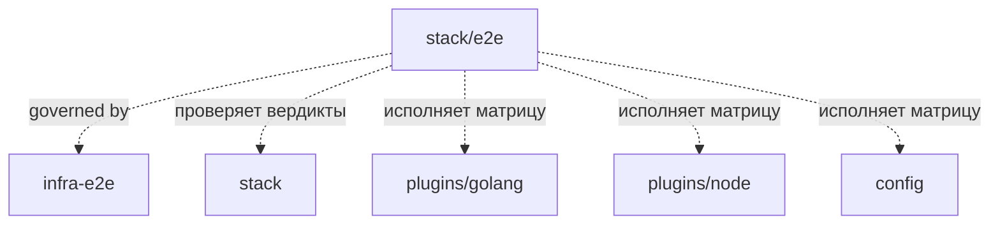

# Module: e2e (stack gate verdicts)

<!--SECTION:SCOPE_TYPE-->

## scope-type

product

<!--/SECTION:SCOPE_TYPE-->

<!--SECTION:MODULE_VISION-->

## 1. Module Vision

**Механизм** E2E-проверки вердиктов гейтов: эталонные репозитории с посаженными дефектами, материализация их в настоящие git-репозитории, прогон установленным пакетом и сверка вердикта каждого гейта (`pass` / `fail` / `env-fail` / `violation` / `timeout` / `skipped`) с декларацией.

**Parent scope:** [`stack`](../stack.spec.md) · **Доктрина:** [`infra-e2e`](../../infra-e2e/infra-e2e.spec.md) — общие ценности, политика скипов, CI и покрытие флагов принадлежат уровню проекта и здесь не переопределяются.

**Границы ответственности.** Этот модуль владеет только механизмом: схемой `expect.yaml`, материализацией фикстур, разведкой тулчейнов, сверкой. **Матрицы фикстур ему не принадлежат** — они живут у владельцев поверхностей, потому что у стеков разные мейнтейнеры:

| Матрица                                        | Владелец                                                                  |
| ---------------------------------------------- | ------------------------------------------------------------------------- |
| Go-фикстуры (49)                               | [`plugins/golang` §7](../../../plugins/golang/specs/golang.spec.md)       |
| npm-фикстуры (12)                              | [`plugins/node` §6](../../../plugins/node/specs/node.spec.md)             |
| anystack-фикстуры (4)                          | [`plugins/anystack` §6](../../../plugins/anystack/specs/anystack.spec.md) |
| Конфиг: discovery, merge, провенанс, валидация | [`config` §6](../../config/config.spec.md)                                |

**Зачем этот уровень вообще.** Классификация вердикта — композиция плагина, конфига, порядка проверок в раннере и exit-кодов настоящего инструмента. Юнит-тесты проверяют звенья по отдельности и **структурно не способны** поймать ошибку композиции. Доказательство из практики (PR #5): гейт `golang:lint` несёт `exit > 1 ↦ ENV_FAIL`, а `applyStackConfig` наследует предикаты при `overrideGates.lint.argv` — документированном способе обёртки. `make` возвращает 2 на любом упавшем рецепте, поэтому `argv: [make, lint]` превращает **каждую настоящую находку линтера** в `ENV_FAIL` с текстом «это НЕ находка про код, не меняй исходники». Все юнит-тесты при этом зелёные: каждое звено ведёт себя как задумано, ошибочна композиция. Класс дефектов особенно дорог тем, что не ломает сборку, а **тихо разворачивает инструкцию агенту** — агент бросает настоящий баг.

**Out-of-Scope:** производительность и бенчмарки; прогоны на настоящих внутренних монорепозиториях (не воспроизводимы и не публичны); Windows; параллельный запуск фикстур внутри набора; поднятие docker-контейнеров (docker участвует только как `requires`-precondition).

<!--/SECTION:MODULE_VISION-->

<!--SECTION:MODULE_USAGE_EXAMPLE-->

## 2. Module Usage Example

```bash
# === все стековые наборы; у каждого стека свой артефакт (D-SE2E-003) ===
$ npm run test:stack-e2e

[golang] build:publish → pack → install → /tmp/gennady-e2e-golang-a1b2c/runner
[golang] toolchains: go 1.24.2 ✓ · golangci-lint 1.64.5 ✓
▶ go-clean-full            весь план          expect pass        ✓ 4.1s
▶ go-fmt-drift             golang:fmt         expect fail        ✓ 0.7s
▶ go-make-lint-exit2       golang:lint        expect fail        ✓ 1.1s
▶ go-generate-ok           golang:generate    expect pass        ✓ 0.9s
▶ go-mutating-gate         golang:dirty       expect violation   ✓ 0.6s
▶ go-hang                  golang:sleeper     expect timeout     ✓ 2.3s
▶ go-skip-lifted-by-only   golang:test        expect pass        ✓ 1.8s

[node] build:publish → pack → install → /tmp/gennady-e2e-node-d4e5f/runner
▶ node-clean-full          весь план          expect pass        ✓ 2.2s
▶ node-mutating-lint       node:lint          expect skipped     ✓ 0.4s
⏭ node-sandbox-links       node:test          SKIP — vendored dep missing in template

✓ 39 passed · 1 skipped (78.4s)
  skipped: node-sandbox-links
  → STACK_E2E_STRICT=1 turns skips into failures (infra-e2e §5)
```

Отладка одной фикстуры — временное дерево сохраняется:

```bash
$ STACK_E2E_KEEP=1 npm run test:stack-e2e -- --fixture=go-make-lint-exit2

▶ go-make-lint-exit2    golang:lint    expect fail    ✗ got env-fail
  fixture kept: /tmp/gennady-e2e-golang-a1b2c/go-make-lint-exit2
  command:      npx gennady verify --all --only=golang:lint --json --root=<fixture>
  expected:     status "fail"       (expect.yaml: gates."golang:lint".status)
  actual:       status "env-fail"   matched rule: exit > 1  (from plugin)
```

<!--/SECTION:MODULE_USAGE_EXAMPLE-->

<!--SECTION:ENTITY_INVENTORY-->

## 3. Entity Inventory (Closed-World)

_Полный список сущностей модуля. Любая сущность помимо этого списка — drift; сначала обновляется spec._

| Name                 | Type         | Purpose                                                                                       |
| -------------------- | ------------ | --------------------------------------------------------------------------------------------- |
| `StackSuite`         | Value Object | Набор одного стека: `{ stackId, fixturesDir, toolchains }` — единица владения и запуска       |
| `StackE2eContext`    | Value Object | Окружение набора: `{ runnerDir, tmpRoot, toolchains, spawn, cleanup }`                        |
| `Toolchain`          | Value Object | Внешний инструмент: `{ id, probeArgv, available, version }`                                   |
| `FixtureTemplate`    | Entity       | Директория в репозитории: файлы эталонного проекта + `gennady.yaml` + `expect.yaml`           |
| `FixtureExpectation` | Value Object | Разобранный `expect.yaml` (§4)                                                                |
| `GateExpectation`    | Value Object | Ожидание по одному гейту: `{ status, outputIncludes, hintIncludes, describeIncludes }`        |
| `FixtureRun`         | Value Object | Факт прогона: `{ id, dir, exitCode, json, stdout, durationMs }`                               |
| `setupStackSuite`    | Service      | `build:publish` → `pack` → install → probe → cleanup publish-артефактов → `StackE2eContext`   |
| `materializeFixture` | Service      | Копия шаблона в temp → `git init` + commit → применение `dirty` → путь к готовому репозиторию |
| `runFixture`         | Service      | Запуск `verify`/`fix` с флагами из `expect` → `FixtureRun`                                    |
| `assertFixture`      | Service      | Сверка `FixtureRun` с `FixtureExpectation`; расхождение → падение с диффом                    |
| `probeToolchains`    | Service      | Наличие и версии `go`, `golangci-lint`, `npm`, `docker`                                       |

<!--/SECTION:ENTITY_INVENTORY-->

<!--SECTION:ENTITY_SURFACES-->

## 4. Entity Surfaces

### `FixtureExpectation`

- **Type:** Value Object
- **Purpose:** Тест как **данные**: добавление регрессии = добавление директории, а не кода
- **Public Properties:**
  - `notes: string` — **обязательно**: какую находку или контракт защищает фикстура
  - `requires: string[]` — id тулчейнов; отсутствие → skip (в STRICT — отказ, infra-e2e §5)
  - `command: 'verify' | 'fix' | 'verify,fix,verify'` — сценарий; последняя форма — цикл fix-loop
  - `argv: string[]` — **флаги CLI как есть** (`--all`, `--only=…`, `--skip=…`, `--plan`, `--json`, `--full-output`, `--root=…`); пусто = полный прогон без сужения (главный путь, infra-e2e §7)
  - `dirty: {path: content}` — незакоммиченные правки, применяемые **после** baseline-коммита
  - `exitCode: number` — ожидаемый код выхода
  - `config: {error: string}` — фикстура невалидного конфига: ожидается `CONFIG_ERROR` + подстрока
  - `gates: {<stack:id>: GateExpectation}` — ожидания по гейтам
  - `diagnostics: string[]` — ожидаемые коды диагностик (`NODE_INVALID_MANIFEST`, `UNSANDBOXED_RUN`, …)
  - `treeUnchanged: boolean` — default `true`: после прогона рабочее дерево фикстуры байт-идентично (снимается только для `fix`-сценариев)
- **Errors & Degradation:** неизвестный ключ → `FIXTURE_INVALID` до запуска гейтов (замкнутый мир, как в конфиге «Геннадии»); `gates` со ссылкой на гейт, отсутствующий в результате → падение (иначе опечатка даёт вечно-зелёный тест)
- **Consumers:** Internal: `runFixture`, `assertFixture`, оркестратор набора

**Фикстура — это закоммиченный репозиторий.** Любой файл под корнем фикстур обязан быть в git: файл, который есть у автора и отсутствует у всех остальных, делает набор красным на свежем клоне. Именно так `.gennadyrc` четырёх config-фикстур попал под `.gitignore` (совпадение на любой глубине) и не доехал до CI. Инвариант проверяется юнит-тестом `fixture-integrity`: под каждым корнем фикстур — репозиторного набора и каждого плагина через резолвер — нет ни untracked-, ни ignored-файлов.

### `GateExpectation`

- **Type:** Value Object
- **Purpose:** Ожидаемый вердикт одного гейта
- **Public Properties:**
  - `status: 'pass' | 'fail' | 'env-fail' | 'violation' | 'timeout' | 'skipped'` — **обязателен**
  - `outputIncludes: string[]` — подстроки в `results[].output`
  - `hintIncludes: string` — подстрока сработавшего `hint`
  - `describeIncludes: string[]` — подстроки отрендеренных предикатов в `--plan --json`

  Отдельно, на уровне всей фикстуры: `noGatesRan: boolean` — прогон не исполнил ни одного гейта (ZERO_GATES). `gates: {}` этого не выражает: сверяются только **объявленные** гейты, поэтому пустая карта не утверждает ничего.

- **Consumers:** Internal: `assertFixture`

### `StackSuite`

- **Type:** Value Object
- **Purpose:** Единица владения: один стек — один набор, один артефакт, один мейнтейнер
- **Public Properties:** `stackId: 'golang' | 'node'`; `fixturesDir: string`; `toolchains: string[]` (объединение `requires` фикстур)
- **Lifecycle:** объявляется в оркестраторе; добавление стека = добавление набора и директории фикстур
- **Consumers:** Internal: оркестратор, `setupStackSuite`

### `FixtureTemplate`

- **Type:** Entity
- **Purpose:** Эталонный проект с посаженным дефектом (или намеренно чистый)
- **Public Properties:** `<fixture>/expect.yaml` — обязателен; остальные файлы копируются как есть (`go.mod`, `*.go`, `Makefile`, `package.json`, `scripts/*.sh`, `gennady.yaml`, `.gennadyrc`); имя директории = id фикстуры
- **Lifecycle:** статический артефакт; никогда не мутируется — материализуется в temp
- **Consumers:** Internal: `materializeFixture`

### `probeToolchains`

- **Type:** Service
- **Purpose:** Разведка внешних инструментов один раз на набор
- **Public Operations:** `probeToolchains(ids): Map<string, Toolchain>` — один version-probe на инструмент
- **Errors & Degradation:** отсутствие инструмента — не ошибка (`available: false`); решение skip/отказ принимает оркестратор по STRICT
- **Consumers:** Internal: `setupStackSuite`

<!--/SECTION:ENTITY_SURFACES-->

<!--SECTION:MODULE_CONTRACTS-->

## 5. Module Contracts (DbC)

### 5.1 Service: `setupStackSuite`

- **Purpose:** Подготовка окружения одного стекового набора
- **Consumers:** Internal: `golang.e2e.test.ts`, `node.e2e.test.ts`
- **Runtime Backing:** `real-runtime` · **Verification Levels:** `e2e`
- **Deferred Runtime Scope:** None

**Contract (DbC):**

- Preconditions: доступны `npm`, `npx`, `git`; `os.tmpdir()` пишется
- Postconditions:
  - артефакт собран **`npm run build:publish`** и установлен в собственный `runnerDir` набора (infra-e2e D-IE2E-002, D-IE2E-003)
  - установка выполнена с `--registry` из `STACK_E2E_REGISTRY` (default `https://registry.npmjs.org/`)
  - после `npm pack` вызван `scripts/cleanup-publish-artifacts.ts`, `git status --porcelain` пуст
  - `toolchains` заполнен ровно одним probe на инструмент из `StackSuite.toolchains`
  - в env каждого `spawn`: `HOME=<tmpRoot>/home`, `GENNADY_NO_UPDATE_CHECK=1`, `GOPROXY=off`, `GOFLAGS=`, общий `GOCACHE`
- Invariants:
  - **`HOME` подменён всегда** — иначе личные `~/.gennadyrc` и `~/.npmrc` разработчика участвуют в deep-merge конфига и в установке, делая прогон невоспроизводимым
  - ни один **отслеживаемый** файл дерева не изменяется: `build:publish` пишет только в `dist/**`, `npm pack` создаёт `*.tgz`, оба в `.gitignore`
  - наборы независимы: падение setup одного не влияет на другой
  - `cleanup()` идемпотентен, вызывается при любом исходе, кроме `STACK_E2E_KEEP=1`

### 5.2 Service: `materializeFixture`

- **Purpose:** Шаблон → временный git-репозиторий
- **Runtime Backing:** `real-runtime` · **Verification Levels:** `e2e`

**Contract (DbC):**

- Preconditions: шаблон существует и содержит валидный `expect.yaml`
- Postconditions:
  - в temp-директории есть `.git` и **минимум один коммит** (реплике прогона нужен HEAD — stack.spec §8.2); исключение — фикстуры, намеренно проверяющие его отсутствие
  - файлы из `dirty` записаны **после** коммита и видны как незакоммиченные
  - путь не совпадает с директорией шаблона
- Invariants: шаблон не изменяется; `user.email`/`user.name` передаются через `-c`, глобальный git-конфиг не читается и не пишется

### 5.3 Service: `runFixture`

- **Purpose:** Прогон сценария фикстуры и захват машинного результата
- **Runtime Backing:** `real-runtime` · **Verification Levels:** `e2e`

**Contract (DbC):**

- Preconditions: фикстура материализована; `requires` удовлетворены
- Postconditions:
  - команда вызвана с `argv` из `expect` плюс `--json`; при `command: fix` — `gennady fix`; при `verify,fix,verify` — три вызова, результат каждого сохранён
  - stdout распарсен как JSON; непарсящийся stdout → падение с первыми 40 строками stdout и stderr
  - при `treeUnchanged: true` после прогона снят `git status --porcelain` фикстуры и он пуст
- Invariants: per-fixture таймаут (default 120s) — превышение отказывает фикстуре, а не вешает набор

### 5.4 Service: `assertFixture`

- **Purpose:** Сверка факта с ожиданием
- **Runtime Backing:** `real-runtime` · **Verification Levels:** `e2e`

**Contract (DbC):**

- Postconditions:
  - сверены `status` каждого гейта из `gates`, затем `outputIncludes`/`hintIncludes`/`describeIncludes`, затем `exitCode`, `diagnostics`, `treeUnchanged`
  - при расхождении сообщение содержит id фикстуры, гейт, ожидание, факт, **сработавшее правило** и путь сохранённой фикстуры при `STACK_E2E_KEEP=1`
- Invariants:
  - гейт в результате, но не в `gates` — не ошибка (фикстура сужается через `argv`); гейт в `gates`, но не в результате — ошибка
  - утверждения на JSON-полях, не на человеческом тексте (D-SE2E-001)

<!--/SECTION:MODULE_CONTRACTS-->

<!--SECTION:FILE_STRUCTURE-->

## 6. File Structure

```
services/stack/__tests__/e2e/
├── golang.e2e.test.ts         # Набор golang: свой setup → фикстуры fixtures/golang/*
├── node.e2e.test.ts           # Набор node: свой setup → фикстуры fixtures/node/*
├── setup.ts                   # setupStackSuite(), probeToolchains()
├── fixture.ts                 # materializeFixture(), runFixture(), assertFixture(), схема expect.yaml
└── fixtures/
    ├── golang/                # матрица — plugins/golang §7 (28 директорий)
    └── node/                  # матрица — plugins/node §6 (12 директорий)
```

**File Mapping:**

- `golang.e2e.test.ts` / `node.e2e.test.ts`: по набору на стек — независимый setup, независимый артефакт, независимый мейнтейнер (D-SE2E-003); перечисляют `fixtures/<stack>/*` лексикографически, skip по `requires`
- `setup.ts`: `setupStackSuite(suite)` — `build:publish` → pack → install (`--registry`) → cleanup publish-артефактов → `probeToolchains`; подмена `HOME`
- `fixture.ts`: материализация, прогон, сверка + валидация `expect.yaml` по замкнутой схеме
- `scripts/stack-e2e.ts`: обёртка для CI и `prepublishOnly` — проставляет `STACK_E2E_STRICT=1`, печатает сводку скипов, поддерживает `--fixture=<id>` и `--stack=<id>`

<!--/SECTION:FILE_STRUCTURE-->

<!--SECTION:MODULE_DECISION_LOG-->

## 7. Module Decision Log

_Общие решения (артефакт `build:publish`, политика скипов, CI, покрытие флагов) — [`infra-e2e` §8](../../infra-e2e/infra-e2e.spec.md). Здесь только специфика стековых вердиктов._

### D-SE2E-001 — Утверждения на `--json`, не на человеческом отчёте

- **Status:** active
- **Why:** Вердикт — структурное поле (`results[].status`), а формулировки отчёта меняются при каждом улучшении DX. Утверждения на тексте дают ложные падения при переписывании фраз и ложные проходы на случайных подстроках (уже случалось в PR #5: тест на усечение вывода проходил из-за «500» в строке команды). Человеческий текст проверяется адресно — там, где он сам является контрактом: подсказка fixer'а, «do not change source».
- **Risk accepted:** поля `--json` становятся тестируемым контрактом и не могут переименовываться молча. Это желаемое свойство — stack.spec §8.4 уже объявляет их стабильными для оркестраторов.

### D-SE2E-002 — Тест как данные: `expect.yaml` рядом с фикстурой

- **Status:** active
- **Why:** Добавление регрессии должно стоить одну директорию, иначе сетка не растёт. Ожидание в YAML читается ревьюером без чтения кода теста; обязательное `notes` не даёт появиться фикстуре без объяснения, что она защищает. Схема замкнута и валидируется до запуска: опечатка в id гейта иначе даёт вечно-зелёный тест — худший вид теста.
- **Rejected alternatives:** ассерты в коде на фикстуру (растут линейно, ревью дороже); snapshot-тесты (снимок не объясняет, что важно, и обновляется механически, пряча регрессии).

### D-SE2E-003 — Один артефакт и один набор **на стек**

- **Status:** active
- **Recorded:** review PR #5 — «Let's make 1 `.tgz` per stack … different stacks will have different maintainers»
- **Why:** Общий setup связывает наборы: падение установки роняет чужой стек, а правка общего шага требует согласования между мейнтейнерами. У каждого стека свой набор, свой артефакт и свой временный корень — наборы запускаются и владеются независимо. Реплика прогона строится от git-toplevel фикстуры, поэтому изоляция самих фикстур сохраняется в любом случае.
- **Risk accepted:** установка (~5s) умножается на число стеков; наборы гоняются отдельными джобами CI, локально мейнтейнер запускает свой (`--stack=<id>`).

### D-SE2E-004 — Фикстуры в репозитории — шаблоны, git-репозиторием становятся в temp

- **Status:** active
- **Why:** Вложенные git-репозитории в дереве проекта — источник путаницы и submodule-случайностей. Плюс часть контрактов требует **конструирования** состояния: baseline-коммит, затем незакоммиченные правки (`dirty`) — ровно то, что реплика прогона обязана переносить. Шаблон этого выразить не может, temp-репозиторий может.

### D-SE2E-005 — Герметичность: сеть выключена, `HOME` подменён

- **Status:** active
- **Why:** `GOPROXY=off` и нулевые внешние зависимости фикстур делают прогон воспроизводимым и быстрым; «заблокированный proxy» симулируется закрытым портом (`http://127.0.0.1:1`), а не отсутствием сети. Подмена `HOME` обязательна: `$HOME/.gennadyrc` участвует в deep-merge (config.spec §1.2), а `~/.npmrc` — в установке артефакта; иначе личное окружение разработчика меняет вердикты.

### D-SE2E-006 — Покрытие сценариев важнее скорости набора

- **Status:** active
- **Recorded:** review PR #5 — «Full verify run is a main user scenario, it must not be ignored»
- **Why:** Сужение каждой фикстуры до одного гейта (`--only`) даёт быстрый набор, который не проверяет главный путь: пользователь запускает `verify` целиком, и взаимодействие гейтов в плане (порядок, одна реплика на прогон, RUN-ALL, накопление отказов) видно только на полном прогоне. Поэтому `expect.argv` принимает произвольные флаги, пустое значение означает полный прогон, и матрицы плагинов обязаны нести столбец «Флаги» — политика минимума в infra-e2e §7. Сужение остаётся у фикстур, проверяющих один вердикт, но больше не является единственной формой.
- **Rejected alternatives:** только `--only` (быстро, но главный путь не покрыт); только полные прогоны (набор становится минутным и указывает на «что-то в плане», а не на гейт).

<!--/SECTION:MODULE_DECISION_LOG-->

<!--SECTION:INTER_MODULE_DEPENDENCIES-->

## 8. Inter-Module Dependencies

- **Governed by:** [`infra-e2e`](../../infra-e2e/infra-e2e.spec.md) — ценности, политика скипов, CI, покрытие флагов
- **Depends on:** [`stack`](../stack.spec.md) (вердикты и раннер — предмет проверки), [`config`](../../config/config.spec.md) (`gennady.yaml` фикстур, `CONFIG_ERROR`)
- **Serves:** [`plugins/golang`](../../../plugins/golang/specs/golang.spec.md), [`plugins/node`](../../../plugins/node/specs/node.spec.md) — их матрицы исполняются этим механизмом
- **Scope Reference (cross-scope):** [`cli`](../../cli/cli.spec.md) — `verify`/`fix` вызываются как чёрный ящик; [`cli/e2e`](../../cli/e2e/e2e.spec.md) — родственный набор другой поверхности; [`infra-base`](../../infra-base/infra-base.spec.md) — `node:test`, vite, исключение фикстур
- **External:** Node.js 22+ (`npm`, `npx`), `git` (обязателен); `go`, `golangci-lint`, `docker` — по `requires`



<!--/SECTION:INTER_MODULE_DEPENDENCIES-->

<!--SECTION:HANDOFF-->

## 9. Handoff to Task Scaffolding

- **Implementation files to be created:**
  - `services/stack/__tests__/e2e/setup.ts`
  - `services/stack/__tests__/e2e/fixture.ts`
  - `services/stack/__tests__/e2e/golang.e2e.test.ts`
  - `services/stack/__tests__/e2e/node.e2e.test.ts`
  - `scripts/stack-e2e.ts`
- **Fixture files:** по матрицам владельцев — `plugins/golang` §7, `plugins/node` §6, `config` §6
- **Structural changes:**
  - `package.json`: скрипты `test:stack-e2e`, `test:config-e2e`; STRICT-переменные в `prepublishOnly`
  - `infra-base` §2.1: расширить обязательный паттерн исключения фикстур на `**/__tests__/e2e/fixtures/**` — текущий `**/__tests__/fixtures/**` его не матчит (проверено); фикстуры намеренно содержат невалидный YAML/JSON
  - `stack.spec.md` §5: `FR-STACK-15` — правка классификации вердикта сопровождается фикстурой
- **Open risks:**
  - **стоимость на холодном `GOCACHE`** — бюджет достижим только с общим кэшем между фикстурами (он в контракте setup); в CI без кэша прогон заметно дольше
  - **версии тулчейнов** — фикстуры не утверждают текст сторонних инструментов, только вердикт; версии в CI пиннятся (infra-e2e §6)
  - **матрица растёт с каждой находкой** — риск «сетка есть, а гоняют её раз в релиз» снимается CI (infra-e2e §6)
  - **`timeout`-фикстуры зависят от таймингов** — при повторяющейся флаке увеличивается разрыв, фикстура не отключается

<!--/SECTION:HANDOFF-->
