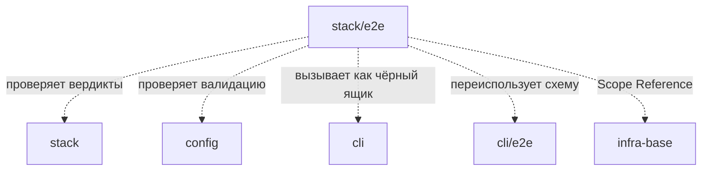

# Module: e2e (stack gate verdicts)

<!--SECTION:SCOPE_TYPE-->

## scope-type

product

<!--/SECTION:SCOPE_TYPE-->

<!--SECTION:MODULE_VISION-->

## 1. Module Vision

E2E-проверка **вердиктов гейтов на настоящих тулчейнах**: эталонные репозитории с намеренно посаженными дефектами прогоняются реальной установленной «Геннадией», и утверждается вердикт каждого гейта — `pass` / `fail` / `env-fail` / `violation` / `timeout` / `skipped`.

Родительский scope: [`stack`](../stack.spec.md). Не имеет подмодулей. Внутренний модуль — публичного API не экспортирует; единственная точка входа — `npm run test:e2e:stack`.

**Зачем отдельный уровень.** Классификация вердикта — это композиция плагина, конфига, порядка проверок в раннере и exit-кодов настоящего инструмента. Юнит-тесты проверяют звенья по отдельности и **структурно не способны** поймать ошибку композиции. Доказательство из практики (PR #5): гейт `golang:lint` несёт `envFail: [exitAbove(1), …]`, а `applyStackConfig` наследует предикаты при `overrideGates.lint.argv` — документированном (D-STACK-009, `ai/directives/infra/golang-setup.xml`) способе обёртки. `make` возвращает 2 на любом упавшем рецепте, поэтому обёртка `argv: [make, lint]` превращает **каждую настоящую находку линтера** в `ENV_FAIL` с текстом «это НЕ находка про код, не меняй исходники». Все юнит-тесты при этом зелёные: каждое звено ведёт себя как задумано, ошибочна композиция. Такой класс дефектов особенно дорог: он не ломает сборку, а **тихо разворачивает инструкцию агенту** — агент бросает настоящий баг.

Отличие от [`cli/e2e`](../../cli/e2e/e2e.spec.md): тот модуль проверяет **поверхность CLI** (bin, `package.json#files`, stdout/exit code команд) на TypeScript-фикстурах. Здесь проверяется **семантика вердиктов** на Go/node-репозиториях с настоящими `go`, `golangci-lint`, `npm`. Артефакт установки переиспользуется по той же схеме (`npm pack`), утверждения строятся на `--json`, а не на человеческом тексте.

**Второе назначение — регрессионная сетка для правок вердиктов.** Каждая находка ревью (список в §9) получает минимум одну фикстуру, поэтому «починили классификацию X, сломали Y» становится красным тестом, а не сообщением из внутреннего монорепозитория через неделю.

**Out-of-Scope (v1):** производительность и бенчмарки; проверки на настоящих внутренних монорепозиториях (они не воспроизводимы и не публичны); Windows; параллельный запуск фикстур; `docker`-зависимые фикстуры (только как `requires`-precondition, без поднятия контейнеров); мутационное тестирование.

<!--/SECTION:MODULE_VISION-->

<!--SECTION:MODULE_USAGE_EXAMPLE-->

## 2. Module Usage Example

```bash
# === обычный локальный запуск ===
$ npm run test:e2e:stack

[setup] npm run build:publish → npm pack → gennady-0.7.1.tgz
[setup] install into /tmp/gennady-stack-e2e-a1b2c/runner (registry: npmjs.org)
[setup] toolchains: go 1.24.2 ✓ · golangci-lint 1.64 ✓ · npm 10.9 ✓ · docker ✗

▶ go-fmt-drift          golang:fmt        expect fail        ✓ 0.7s
▶ go-test-panic         golang:test       expect fail        ✓ 1.9s
▶ go-make-lint-exit2    golang:lint       expect fail        ✓ 1.1s
▶ go-generate-missing   golang:generate   expect env-fail    ✓ 0.9s
▶ go-mutating-gate      golang:dirty      expect violation   ✓ 0.6s
▶ go-hang               golang:sleeper    expect timeout     ✓ 2.3s
▶ go-requires-missing   golang:e2e        expect env-fail    ✓ 0.2s
▶ node-sandbox-links    node:test         expect pass        ✓ 1.4s
⏭ go-lint-config        golang:lint       SKIP — toolchain "golangci-lint" absent

✓ 23 passed · 1 skipped (41.3s)
  skipped fixtures: go-lint-config (golangci-lint)
  → run with STACK_E2E_STRICT=1 to make missing toolchains a failure
```

Строгий режим (CI и `prepublishOnly`) — отсутствие тулчейна становится отказом, а не тишиной:

```bash
$ STACK_E2E_STRICT=1 npm run test:e2e:stack

✗ go-lint-config — TOOLCHAIN_MISSING: "golangci-lint" not in PATH (strict mode)
  fix: install golangci-lint, or run without STACK_E2E_STRICT

✗ 1 failed · 23 passed (39.8s)
```

Отладка одной фикстуры — временное дерево сохраняется:

```bash
$ STACK_E2E_KEEP=1 npm run test:e2e:stack -- --fixture=go-make-lint-exit2

▶ go-make-lint-exit2    golang:lint    expect fail    ✗ got env-fail
  fixture kept: /tmp/gennady-stack-e2e-a1b2c/go-make-lint-exit2
  command:      npx gennady verify --all --only=golang:lint --json --root=<fixture>
  expected:     status "fail"       (expect.yaml: gates.golang:lint.status)
  actual:       status "env-fail"   matched rule: exit > 1  (from plugin)
```

<!--/SECTION:MODULE_USAGE_EXAMPLE-->

<!--SECTION:ENTITY_INVENTORY-->

## 3. Entity Inventory (Closed-World)

_Полный список сущностей модуля. Любая сущность помимо этого списка — drift; сначала обновляется spec._

| Name                 | Type         | Purpose                                                                                       |
| -------------------- | ------------ | --------------------------------------------------------------------------------------------- |
| `StackE2eContext`    | Value Object | Результат setup: `{ runnerDir, tmpRoot, toolchains, spawn, cleanup }`                         |
| `Toolchain`          | Value Object | Внешний инструмент фикстуры: `{ id, probeArgv, available, version }`                          |
| `FixtureTemplate`    | Entity       | Директория в репозитории: файлы эталонного проекта + `gennady.yaml` + `expect.yaml`           |
| `FixtureExpectation` | Value Object | Разобранный `expect.yaml`: `{ requires, only, dirty, exitCode, config, gates, notes }`        |
| `GateExpectation`    | Value Object | Ожидание по одному гейту: `{ status, outputIncludes, hintIncludes, describeIncludes }`        |
| `FixtureRun`         | Value Object | Факт прогона: `{ id, dir, exitCode, json, durationMs }`                                       |
| `setupStackE2e`      | Service      | build → pack → install → probe toolchains → `StackE2eContext`                                 |
| `materializeFixture` | Service      | Копия шаблона в temp → `git init` + commit → применение `dirty` → путь к готовому репозиторию |
| `runFixture`         | Service      | Запуск `gennady verify --json` (или `fix`) в фикстуре → `FixtureRun`                          |
| `assertFixture`      | Service      | Сверка `FixtureRun` с `FixtureExpectation`; расхождение → падение с диффом                    |
| `probeToolchains`    | Service      | Определение наличия и версий `go`, `golangci-lint`, `npm`, `docker`                           |

<!--/SECTION:ENTITY_INVENTORY-->

<!--SECTION:ENTITY_SURFACES-->

## 4. Entity Surfaces

### `FixtureTemplate`

- **Type:** Entity
- **Purpose:** Эталонный проект с намеренно посаженным дефектом (или намеренно чистый)
- **Public Properties:**
  - `<fixture>/expect.yaml` — **обязателен**; схема — `FixtureExpectation`
  - `<fixture>/**` — остальные файлы копируются в temp как есть: `go.mod`, `*.go`, `Makefile`, `package.json`, `scripts/*.sh`, `gennady.yaml`
  - Имя директории = id фикстуры; префикс = стек (`go-*`, `node-*`)
- **Lifecycle:** Статический артефакт репозитория. `materializeFixture` копирует его в temp при каждом прогоне; шаблон никогда не мутируется
- **Errors & Degradation:** отсутствует `expect.yaml` → падение `FIXTURE_INVALID` с путём; неизвестный ключ в `expect.yaml` → падение до запуска гейтов (замкнутый мир, как в конфиге «Геннадии»)
- **Consumers:**
  - Internal: `materializeFixture`

### `FixtureExpectation`

- **Type:** Value Object
- **Purpose:** Тест как **данные**: добавление регрессии = добавление директории, а не кода
- **Public Properties:**
  - `requires: string[]` — id тулчейнов (`go`, `golangci-lint`, `npm`, `docker`); отсутствие → skip (или отказ в strict)
  - `only: string[]` — гейты для прогона, попадают в `--only`; пусто = весь план
  - `command: 'verify' | 'fix'` — проверяемая команда; default `verify`
  - `dirty: {path: content}` — незакоммиченные правки, применяемые **после** baseline-коммита (проверка репликации рабочего состояния)
  - `exitCode: number` — ожидаемый код выхода команды
  - `config: {error: string}` — фикстура намеренно невалидного конфига: ожидается `CONFIG_ERROR` и подстрока в тексте
  - `gates: {<stack:id>: GateExpectation}` — ожидания по гейтам
  - `notes: string` — **обязательное** поле: какую находку/контракт защищает фикстура (ссылка на FR/решение)
- **Lifecycle:** Читается один раз на фикстуру; иммутабелен
- **Errors & Degradation:** невалидная схема → `FIXTURE_INVALID`; `gates` со ссылкой на гейт, отсутствующий в плане → падение (защита от опечаток, которые иначе дают ложно-зелёный тест)
- **Consumers:**
  - Internal: `assertFixture`, `runFixture` (читает `only`/`command`), оркестратор (читает `requires`)

### `GateExpectation`

- **Type:** Value Object
- **Purpose:** Ожидаемый вердикт одного гейта
- **Public Properties:**
  - `status: 'pass' | 'fail' | 'env-fail' | 'violation' | 'timeout' | 'skipped'` — **обязателен**
  - `outputIncludes: string[]` — подстроки, обязанные быть в `results[].output`
  - `hintIncludes: string` — подстрока сработавшего `hint` (для env-fail-фикстур)
  - `describeIncludes: string[]` — подстроки отрендеренных предикатов в `--plan --json` (защита читаемости правил)
- **Lifecycle:** Часть `FixtureExpectation`
- **Errors & Degradation:** N/A
- **Consumers:**
  - Internal: `assertFixture`

### `StackE2eContext`

- **Type:** Value Object
- **Purpose:** Готовое окружение прогона: установленная «Геннадия» + разведанные тулчейны
- **Public Properties:**
  - `runnerDir: string` — директория с установленным из `.tgz` пакетом
  - `tmpRoot: string` — корень временных фикстур
  - `toolchains: Map<string, Toolchain>`
  - `spawn: (args: string[], cwd: string) => Promise<{stdout, stderr, exitCode}>` — вызов установленного бинаря
  - `cleanup: () => void` — идемпотентная уборка (кроме `STACK_E2E_KEEP=1`)
- **Lifecycle:** Создаётся один раз в `before` оркестратора, живёт до `after`
- **Errors & Degradation:** падение любого шага setup → уборка + ошибка с шагом в тексте
- **Consumers:**
  - Internal: оркестратор, `materializeFixture`, `runFixture`

### `materializeFixture`

- **Type:** Service
- **Purpose:** Превратить шаблон в настоящий git-репозиторий во временной директории
- **Public Operations:**
  - `materializeFixture(ctx, template): Promise<string>` — копия → `git init -b main` → `git add -A` → commit → применение `dirty` → путь
- **Lifecycle:** Вызывается на каждую фикстуру
- **Errors & Degradation:** `git` отсутствует → отказ всего прогона (не skip: без git не работает реплика прогона, D-STACK-013)
- **Consumers:**
  - Internal: оркестратор

### `probeToolchains`

- **Type:** Service
- **Purpose:** Разведка внешних инструментов один раз на прогон
- **Public Operations:**
  - `probeToolchains(): Map<string, Toolchain>` — по одному version-probe на инструмент
- **Lifecycle:** Один вызов в setup; результат переиспользуется всеми фикстурами
- **Errors & Degradation:** инструмент отсутствует → `available: false` (не ошибка); решение о skip/отказе принимает оркестратор по `STACK_E2E_STRICT`
- **Consumers:**
  - Internal: `setupStackE2e`

<!--/SECTION:ENTITY_SURFACES-->

<!--SECTION:MODULE_CONTRACTS-->

## 5. Module Contracts (DbC)

### 5.1 Service: `setupStackE2e`

- **Purpose:** Подготовка окружения прогона
- **Consumers:** Internal: `stack-e2e.test.ts` (оркестратор)
- **Runtime Backing:** `real-runtime` · **Verification Levels:** `e2e`
- **Deferred Runtime Scope:** None

**Contract (DbC):**

- Preconditions: доступны `npm`, `npx`, `git`; `os.tmpdir()` пишется
- Postconditions:
  - `.tgz` собран через **`npm run build:publish`** и установлен в `runnerDir` — проверяется то, что получит пользователь (D-E2E-003)
  - установка выполнена с `--registry` из `STACK_E2E_REGISTRY` (default `https://registry.npmjs.org/`) — корпоративный реестр в `~/.npmrc` отдаёт `403` на части публичных зависимостей
  - после `npm pack` вызван `scripts/cleanup-publish-artifacts.ts`, и `git status --porcelain` пуст
  - `toolchains` заполнен ровно одним probe на инструмент
  - в env каждого `spawn` проставлены `HOME=<tmpRoot>/home`, `GENNADY_NO_UPDATE_CHECK=1`, `GOPROXY=off`, `GOFLAGS=`, общий `GOCACHE`
- Invariants:
  - **`HOME` подменён всегда** — иначе личный `$HOME/.gennadyrc` разработчика участвует в deep-merge конфига (config.spec §1.2) и делает прогон невоспроизводимым
  - ни один **отслеживаемый** файл дерева не изменяется: `build:publish` пишет только в `dist/**`, `npm pack` создаёт `*.tgz`, оба пути в `.gitignore`; уборка publish-артефактов идёт в `finally` и подтверждается пустым `git status --porcelain` (ручной шаг из гайда мейнтейнера становится автоматической инвариантой)
  - `cleanup()` идемпотентен и вызывается при любом исходе, кроме `STACK_E2E_KEEP=1`

### 5.2 Service: `materializeFixture`

- **Purpose:** Шаблон → временный git-репозиторий
- **Runtime Backing:** `real-runtime` · **Verification Levels:** `e2e`

**Contract (DbC):**

- Preconditions: шаблон существует и содержит валидный `expect.yaml`
- Postconditions:
  - в temp-директории есть `.git` и **минимум один коммит** (реплика прогона требует HEAD, §8.2 stack.spec)
  - файлы из `dirty` записаны **после** коммита и видны как незакоммиченные изменения
  - путь не совпадает с директорией шаблона
- Invariants: шаблон в репозитории не изменяется; `user.email`/`user.name` передаются через `-c`, глобальный git-конфиг не читается и не пишется

### 5.3 Service: `runFixture`

- **Purpose:** Прогон команды в фикстуре и захват машинного результата
- **Runtime Backing:** `real-runtime` · **Verification Levels:** `e2e`

**Contract (DbC):**

- Preconditions: фикстура материализована; `expect.requires` удовлетворены
- Postconditions:
  - команда вызвана как `verify --json` (плюс `--all`/`--only` из `expect`), результат распарсен как JSON
  - возвращён фактический `exitCode`
  - непарсящийся stdout → падение с первыми 40 строками stdout и stderr (иначе диагностика теряется)
- Invariants: у прогона свой per-fixture таймаут (default 120s), превышение — отказ фикстуры, а не зависание всего прогона

### 5.4 Service: `assertFixture`

- **Purpose:** Сверка факта с ожиданием
- **Runtime Backing:** `real-runtime` · **Verification Levels:** `e2e`

**Contract (DbC):**

- Preconditions: `FixtureRun` получен
- Postconditions:
  - для каждого ключа `gates` сверены `status`, затем `outputIncludes`/`hintIncludes`/`describeIncludes`
  - сверен `exitCode`; для `config.error` — факт `CONFIG_ERROR` и подстрока
  - при расхождении сообщение содержит id фикстуры, гейт, ожидание, факт, **сработавшее правило** и путь сохранённой фикстуры при `STACK_E2E_KEEP=1`
- Invariants:
  - гейт, присутствующий в результате но отсутствующий в `gates`, **не** является ошибкой (фикстура сужается через `only`); гейт из `gates`, отсутствующий в результате, — ошибка
  - утверждения строятся на JSON-полях, не на человеческом тексте (D-E2E-001)

<!--/SECTION:MODULE_CONTRACTS-->

<!--SECTION:FILE_STRUCTURE-->

## 6. File Structure

```
services/stack/__tests__/e2e/
├── stack-e2e.test.ts          # Оркестратор: before(setup) → фикстуры по директориям → after(cleanup)
├── setup.ts                   # setupStackE2e(), probeToolchains()
├── fixture.ts                 # materializeFixture(), runFixture(), assertFixture(), схема expect.yaml
└── fixtures/
    ├── go-clean/              # go.mod, main.go, main_test.go, expect.yaml
    ├── go-fmt-drift/
    ├── go-vet-error/
    ├── go-build-error/
    ├── go-test-fail/
    ├── go-test-panic/
    ├── go-proxy-blocked/
    ├── go-generate-stale/
    ├── go-generate-missing-tool/
    ├── go-make-lint-exit2/
    ├── go-mutating-gate/
    ├── go-sandbox-drift/
    ├── go-hang/
    ├── go-requires-missing/
    ├── go-requires-ok/
    ├── go-envfail-rules/
    ├── go-envfail-streams/
    ├── go-envfail-catchall/
    ├── go-envfail-hint-precedence/
    ├── go-gate-fixer/
    ├── go-plan-describe/
    ├── node-clean/
    ├── node-test-fail/
    ├── node-mutating-script/
    └── node-sandbox-links/
```

**File Mapping:**

- `stack-e2e.test.ts`: перечисляет `fixtures/*`, для каждой — `it(id)` с skip по `requires`; порядок стабилен (лексикографический)
- `setup.ts`: `setupStackE2e()` — `build:publish` → pack → install (`--registry`) → cleanup publish-артефактов → `probeToolchains()`; подмена `HOME`
- `fixture.ts`: `materializeFixture()` / `runFixture()` / `assertFixture()` + валидация `expect.yaml` (замкнутая схема)
- `fixtures/<id>/expect.yaml`: единственный обязательный файл фикстуры; `notes` объясняет, что защищается
- `scripts/stack-e2e.ts`: обёртка запуска для CI/`prepublishOnly` — прокидывает `STACK_E2E_STRICT=1` и печатает сводку по скипам

<!--/SECTION:FILE_STRUCTURE-->

<!--SECTION:MODULE_DECISION_LOG-->

## 7. Module Decision Log

### D-E2E-001 — Утверждения на `--json`, не на человеческом отчёте

- **Status:** active
- **Why:** Вердикт — структурное поле (`results[].status`), а формулировки отчёта меняются при каждом улучшении DX. Утверждения на тексте дают ложные падения при переписывании фраз и ложные проходы при подстроках-совпадениях (уже случалось в PR #5: тест на усечение вывода проходил из-за «500» в строке команды). Человеческий отчёт покрывается адресно: `outputIncludes` там, где текст — сам контракт (подсказка fixer'а, «do not change source»).
- **Risk accepted:** формат `--json` становится тестируемым контрактом — его поля нельзя переименовывать молча. Это желаемое свойство (§8.5 stack.spec объявляет их стабильными для оркестраторов).

### D-E2E-002 — Тест как данные: `expect.yaml` рядом с фикстурой

- **Status:** active
- **Why:** Добавление регрессии должно стоить одну директорию, иначе сетка не растёт. Ожидание в YAML читается ревьюером без чтения кода теста, а обязательное поле `notes` не даёт появиться фикстуре без объяснения, что она защищает. Схема замкнута и валидируется до запуска — опечатка в id гейта иначе даёт вечно-зелёный тест, худший вид теста.
- **Rejected alternatives:** ассерты в коде на фикстуру (растёт линейно, ревью дороже); snapshot-тесты (снимок не объясняет, что важно, и обновляется механически, пряча регрессии).

### D-E2E-003 — Один установленный `.tgz`, N фикстур-репозиториев, `--root` на фикстуру

- **Status:** active
- **Why:** `npm pack` + install — канонический артефакт (наследуется D-015 из `cli/e2e`): проверяется то, что получит пользователь, включая `package.json#bin`. Установка дорогая (~5s), поэтому она одна на прогон, а фикстуры — отдельные git-репозитории, адресуемые `--root`. Реплика прогона строится от git-toplevel фикстуры, то есть изоляция фикстур сохраняется.
- **Обязательно `build:publish`, а не `build`** (гайд мейнтейнера в PR #5): `prepublishOnly` срабатывает только на `npm publish` — при `npm pack` он не запускается, поэтому без ручного `build:publish` в `.tgz` уедет старый или пустой `dist/`, и набор будет проверять не то дерево, что на диске. `npm run build` вдобавок не делает ни `build:types`, ни копирования `ai/**` → `dist/ai/**` из `scripts/prepare-publish-artifacts.ts`, то есть его `.tgz` **не равен** публикуемому.
- **Risk accepted:** `build:publish` дороже `build` (типы + копирование ассетов) — это плата за то, что e2e проверяет публикуемый артефакт, а не его подмножество.
- **Rejected alternatives:** установка в каждую фикстуру (×N по 5s); запуск из исходников через `tsx` (быстрее, но мимо упаковки — а именно упаковка ломалась в этом проекте: `dist` падал с `ERR_INVALID_URL_SCHEME`).

### D-E2E-004 — Фикстуры в репозитории — шаблоны, git-репозиторием становятся в temp

- **Status:** active
- **Why:** Вложенные git-репозитории в дереве проекта — источник путаницы и submodule-случайностей. Плюс часть контрактов требует **конструирования** состояния: baseline-коммит, затем незакоммиченные правки (`dirty`) — ровно то, что реплика прогона обязана переносить. Шаблон этого выразить не может, temp-репозиторий может.

### D-E2E-005 — Отсутствие тулчейна: видимый skip локально, отказ в strict-режиме

- **Status:** active
- **Why:** Тихие скипы — стандартный способ гниения e2e-набора: набор «зелёный», потому что ничего не запускалось. Локально skip обязателен (не у всех стоит `golangci-lint`), но он печатается в сводку со причиной, а `STACK_E2E_STRICT=1` превращает его в отказ — этот режим идёт в `prepublishOnly` и в CI. Предупреждение уже наблюдаемо: существующий `npm run test:e2e` показывает 18 прошедших из 45.
- **Rejected alternatives:** всегда падать (нельзя работать без `golangci-lint` локально); всегда скипать (набор перестаёт защищать).

### D-E2E-006 — Герметичность: сеть выключена, `HOME` подменён

- **Status:** active
- **Why:** `GOPROXY=off` и нулевые внешние зависимости у фикстур делают прогон воспроизводимым и быстрым; «заблокированный proxy» симулируется закрытым портом (`http://127.0.0.1:1`), а не отсутствием сети. Подмена `HOME` обязательна: `$HOME/.gennadyrc` участвует в deep-merge (config.spec §1.2), поэтому личный конфиг разработчика иначе меняет вердикты — то же самое, что делает найденная панелью machine-global-проблема, только в тестах.

### D-E2E-007 — Прогон одного гейта на фикстуру через `--only`

- **Status:** active
- **Why:** Фикстура проверяет один вердикт; полный план добавил бы к каждой минуты `go build`/`go test` и посторонние падения. `expect.only` попадает в `--only`, поэтому фикстура остаётся быстрой (<3s) и её падение указывает на один гейт. Бюджет прогона — под 90s на машине с полным тулчейном.
- **Risk accepted:** взаимодействие гейтов внутри плана не покрывается; для этого есть отдельные фикстуры без `only` (`go-clean`, `node-clean`).

### D-E2E-008 — CI-джоба предлагается отдельно: в репозитории нет CI

- **Status:** active
- **Why:** В `gennady` нет ни `.github/workflows`, ни `.gitlab-ci.yml`; единственный существующий регрессионный барьер — `prepublishOnly` (`lint` + `test:smoke` + `test:e2e`). Поэтому обязательная часть — скрипт и npm-команда, встроенные в `prepublishOnly`; заводить CI-инфраструктуру в чужом OSS-репозитории — решение мейнтейнера, а не следствие этой задачи. Готовый workflow предлагается как отдельный, отклоняемый артефакт.

<!--/SECTION:MODULE_DECISION_LOG-->

<!--SECTION:INTER_MODULE_DEPENDENCIES-->

## 8. Inter-Module Dependencies

- **Depends on:** [`stack`](../stack.spec.md) (вердикты и раннер — предмет проверки), [`config`](../config/config.spec.md) (`gennady.yaml` фикстур, `CONFIG_ERROR`-фикстуры)
- **Scope Reference (cross-scope):** [`cli`](../../cli/cli.spec.md) — команды `verify`/`fix` вызываются как чёрный ящик; [`cli/e2e`](../../cli/e2e/e2e.spec.md) — переиспользуемая схема «pack → install → spawn»; [`infra-base`](../../infra-base/infra-base.spec.md) — `node:test`, Vite build
- **External:** Node.js 22+ (`npm`, `npx`), `git`; опционально `go`, `golangci-lint`, `docker` — по `requires` фикстуры
- **Provides to:** None (внутренний модуль)



<!--/SECTION:INTER_MODULE_DEPENDENCIES-->

<!--SECTION:HANDOFF-->

## 9. Handoff to Task Scaffolding

### Матрица фикстур: находка → фикстура → ожидаемый вердикт

Каждая строка — обязательная фикстура v1. Столбец «Защищает» ссылается на находку ревью PR #5 или на существующий контракт.

| Фикстура                     | Гейт              | Посаженный дефект                                                  | Ожидание                          | Защищает                                 |
| ---------------------------- | ----------------- | ------------------------------------------------------------------ | --------------------------------- | ---------------------------------------- |
| `go-clean`                   | весь план         | нет (эталон)                                                       | `pass`, exit 0                    | базовая линия, взаимодействие гейтов     |
| `go-fmt-drift`               | `golang:fmt`      | неотформатированный файл                                           | `fail`, файл в выводе             | контракт `gofmt -l` (D-STACK-005)        |
| `go-vet-error`               | `golang:vet`      | unkeyed-поля в литерале                                            | `fail`                            | базовая линия                            |
| `go-build-error`             | `golang:build`    | синтаксическая ошибка                                              | `fail` (не env-fail)              | review B4: ошибка компиляции — код       |
| `go-test-fail`               | `golang:test`     | падающий тест                                                      | `fail`                            | базовая линия                            |
| `go-test-panic`              | `golang:test`     | паника в коде под тестом                                           | `fail`, не `env-fail`             | review B4 / FR-STACK-09                  |
| `go-proxy-blocked`           | `golang:build`    | зависимость + `GOPROXY=http://127.0.0.1:1`                         | `env-fail`                        | предикат module-fetch (D-STACK-004)      |
| `go-generate-stale`          | `golang:generate` | закоммиченный сгенерированный файл разошёлся                       | `fail`, `gennady fix` в выводе    | D-STACK-011                              |
| `go-generate-missing-tool`   | `golang:generate` | директива зовёт отсутствующий бинарь                               | `env-fail` + hint `go install`    | D-STACK-012                              |
| `go-make-lint-exit2`         | `golang:lint`     | `overrideGates.lint.argv: [make, lint]`, настоящая находка, exit 2 | **`fail`**, не `env-fail`         | **находка 2** (живой баг)                |
| `go-mutating-gate`           | extra             | гейт пишет файл, без `sandbox`                                     | `violation` + список файлов       | D-STACK-013                              |
| `go-sandbox-drift`           | extra             | `sandbox: true`, гейт пишет файл                                   | `fail` + drift-список             | D-STACK-013                              |
| `go-hang`                    | extra             | скрипт спит дольше `timeout: 2s`                                   | `timeout` + note «не правь код»   | **находка 1** (лестница вердиктов)       |
| `go-requires-missing`        | extra             | `requires` с падающей командой                                     | `env-fail` быстро, argv не вызван | **находка 1/2** (`requires`)             |
| `go-requires-ok`             | extra             | `requires` проходит                                                | argv вызван, `pass`               | `requires` не ломает нормальный путь     |
| `go-envfail-rules`           | extra             | exit 69 + инфра-сообщение                                          | `env-fail` + hint                 | сама фича (`envFail` в GateSpec)         |
| `go-envfail-streams`         | extra             | сообщение только в stderr                                          | `stderrMatches` срабатывает       | разделение потоков                       |
| `go-envfail-catchall`        | —                 | `exitCodeMatches: '>0'` без уточнения                              | `CONFIG_ERROR`, exit 4            | находка 15 (footgun-валидация)           |
| `go-envfail-hint-precedence` | `golang:build`    | правило конфига + предикат плагина совпадают                       | hint конфига в выводе             | находка 5 (prepend + hint)               |
| `go-gate-fixer`              | extra             | гейт с вложенным `fixer`                                           | `gennady fix` мутирует дерево     | правка пользователя 2 (`fixer` на гейте) |
| `go-plan-describe`           | —                 | гейт с правилами, `--plan --json`                                  | описания правил, без `null`       | находка 4 (`describe`)                   |
| `node-clean`                 | весь план         | нет                                                                | `pass`                            | базовая линия node                       |
| `node-test-fail`             | `node:test`       | падающий npm-скрипт                                                | `fail`                            | базовая линия node                       |
| `node-mutating-script`       | `node:format`     | скрипт с `--write`                                                 | `skipped` с причиной              | D-STACK-005 (скрининг npm-скриптов)      |
| `node-sandbox-links`         | `node:test`       | тест требует пакет из `node_modules`                               | `pass` (симлинк в реплику)        | D-STACK-013 (`sandboxLinks`)             |

### Implementation files to be created

- `services/stack/__tests__/e2e/setup.ts`
- `services/stack/__tests__/e2e/fixture.ts`
- `services/stack/__tests__/e2e/stack-e2e.test.ts`
- `scripts/stack-e2e.ts` (обёртка strict-режима для `prepublishOnly`)
- `services/stack/__tests__/e2e/fixtures/<id>/…` — по матрице выше

### Structural changes

- `package.json`: скрипт `test:e2e:stack`; добавить его в `prepublishOnly` после `test:e2e`
- `README.md`: раздел `verify` — упомянуть e2e-сетку вердиктов
- **исключения фикстур из тулинга — обязательная часть задачи, текущие паттерны их НЕ покрывают** (проверено): DbC-линтер покрывает (`lint.cmd.ts` → `**/fixtures/**`), а `.prettierignore` и `tsconfig.json` держат `**/__tests__/fixtures/**`, что не матчит `__tests__/e2e/fixtures/`. Нужен паттерн `**/__tests__/e2e/fixtures/**` в обоих. Критично: фикстуры намеренно содержат невалидный YAML/JSON (`go-envfail-catchall`), который `prettier --write` перепишет, а `format:check` в собственном `verify` «Геннадии» пометит как дрейф
- `.gitignore`: не требуется (temp-директории вне дерева)

### Spec rows to add elsewhere (в цикле реализации)

- `stack.spec.md` §5: `FR-STACK-15` — «каждая правка классификации вердикта сопровождается фикстурой в `stack/e2e`»
- `stack.spec.md` §12 Handoff: ссылка на модуль `e2e`
- `tasks/stack/*`: новая задача под модуль (`TSK-97`?) либо строка исполнения в TSK-95

### Open risks

- **Стоимость на холодном `GOCACHE`.** Первый `go build` в CI прогревает кэш; бюджет 90s достижим только с общим `GOCACHE` между фикстурами — он в контракте setup, но на CI без кэша прогон будет заметно дольше
- **Версии тулчейнов.** `golangci-lint` меняет коды выхода и формулировки между мажорами; фикстуры не должны утверждать текст линтера, только вердикт (`describeIncludes`/`outputIncludes` — только для собственного текста «Геннадии»)
- **`go-proxy-blocked` и корпоративные окружения.** Закрытый порт — надёжнее сети, но в средах с прозрачным прокси может вернуться иной текст ошибки; фикстура утверждает только `env-fail`
- **`node-sandbox-links` требует установленного `node_modules` в фикстуре** — то есть локальный `npm install` без сети; решается вендорингом одного крошечного пакета в шаблон (без реестра)
- **Унаследованная неточность в `cli/e2e`.** Его `setup.ts` запускает только `npm run build`, но комментарий региона и D-015 утверждают, что `.tgz` «идентичен публикуемому». По гайду мейнтейнера это неверно: без `build:publish` в пакете нет `build:types` и `dist/ai/**`. Правка — вне скоупа этого модуля (другой scope), занесена в список находок цикла
- **Матрица растёт с каждой находкой** — риск «сетка есть, а гоняют её раз в релиз»; смягчается `prepublishOnly` и предложенной CI-джобой (D-E2E-008)
- **`timeout`-фикстура зависит от таймингов** — 2s-таймаут против 10s-сна даёт запас, но на очень загруженной машине возможна флака; при повторяющейся флаке увеличивается разрыв, а не отключается фикстура

<!--/SECTION:HANDOFF-->
