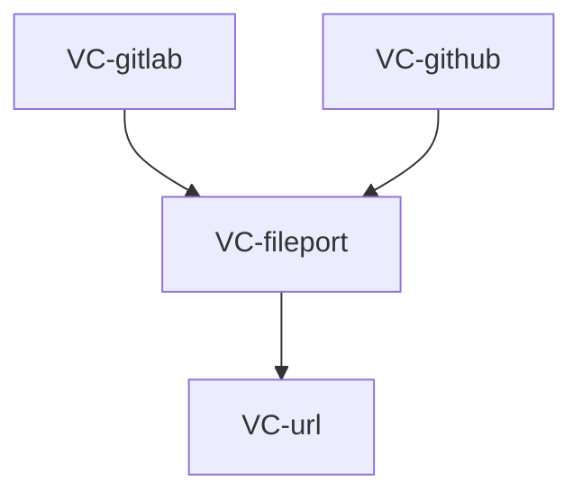

# vcs-client — Tasks

## Tracker Index

| Task-ID     | Title                                                                                 | Dependencies | Status   | Reopens |
| ----------- | ------------------------------------------------------------------------------------- | ------------ | -------- | ------- |
| VC-headers  | vcs-client: file headers + DBC contracts                                              | —            | [x] DONE | —       |
| VC-url      | vcs-client: Entities + URL parser                                                     | —            | [ ] TODO | —       |
| VC-fileport | vcs-client: Abstract ports (RepositoryFiles + optional MergeDiscussions + getChanges) | VC-url       | [ ] TODO | —       |
| VC-gitlab   | vcs-client: GitLab adapters (RepositoryFiles + getChanges)                            | VC-fileport  | [ ] TODO | —       |
| VC-github   | vcs-client: GitHub adapters (Client + MergeRequests + RepositoryFiles)                | VC-fileport  | [ ] TODO | —       |
| VC-approve  | Метод approve на MergeRequests порте                                                  | —            | [ ] TODO | —       |
| VC-resolve  | Метод resolveDiscussion на MergeDiscussions порте                                     | —            | [ ] TODO | —       |
| VC-unappr   | unapprove() на MergeRequests порте                                                    | —            | [x] DONE | —       |
| VC-todos    | todoIds + markTodoDone (Inbox порт)                                                   | —            | [ ] TODO | —       |
| VC-noteedit | updateNote/deleteNote порт + адаптер                                                  | —            | [x] DONE | —       |
| VC-pipeline | getPipeline порт + адаптер                                                            | —            | [ ] TODO | —       |
| VC-jobs     | VcsClientPipeline порт + VcsGitlabPipeline адаптер                                    | —            | [ ] TODO | —       |
| VC-drafts   | —                                                                                     | —            | [ ] TODO | —       |

## Slug Registry

<!-- один ID на строку; уникальность держится этим списком — одинаковый ID в двух ветках сталкивается здесь при merge. Только добавление. -->

- VC-headers
- VC-url
- VC-fileport
- VC-gitlab
- VC-github
- VC-approve
- VC-resolve
- VC-unappr
- VC-todos
- VC-noteedit
- VC-pipeline
- VC-jobs
- VC-drafts

## Intra-Module DAG

<!-- ребро A → B = «A зависит от B». Кросс-модульные рёбра живут уровнем выше. -->

## Decision Log (module-task level)

<!-- решения декомпозиции/планирования; локальные решения исполнения — в Decision Log самих тикетов. -->

## Conventions

Проектные конвенции объявлены в `specs/3-tasks.md` и наследуются — здесь не повторяются.
