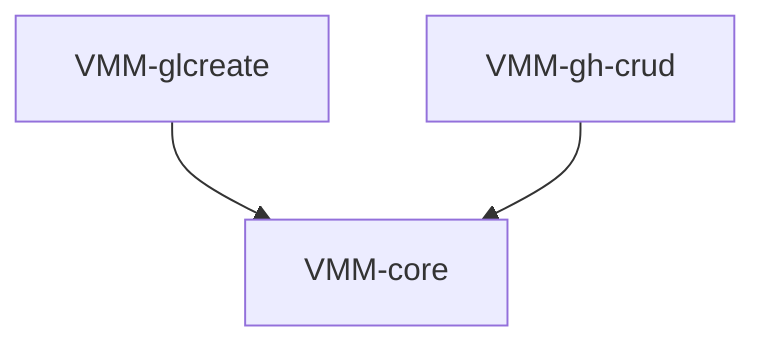

# vcs-mr-management — Tasks

## Tracker Index

| Task-ID      | Title                                                      | Dependencies | Status   | Reopens |
| ------------ | ---------------------------------------------------------- | ------------ | -------- | ------- |
| VMM-core     | API core: query types + abstract port for MR create/update | —            | [ ] TODO | —       |
| VMM-glcreate | GitLab adapter: MR create + update                         | VMM-core     | [ ] TODO | —       |
| VMM-gh-crud  | GitHub adapter: MR/PR create + update + getList + getByIid | VMM-core     | [ ] TODO | —       |

## Slug Registry

<!-- один ID на строку; уникальность держится этим списком — одинаковый ID в двух ветках сталкивается здесь при merge. Только добавление. -->

- VMM-core
- VMM-glcreate
- VMM-gh-crud

## Intra-Module DAG

<!-- ребро A → B = «A зависит от B». Кросс-модульные рёбра живут уровнем выше. -->

## Decision Log (module-task level)

<!-- решения декомпозиции/планирования; локальные решения исполнения — в Decision Log самих тикетов. -->

## Conventions

Проектные конвенции объявлены в `specs/3-tasks.md` и наследуются — здесь не повторяются.
